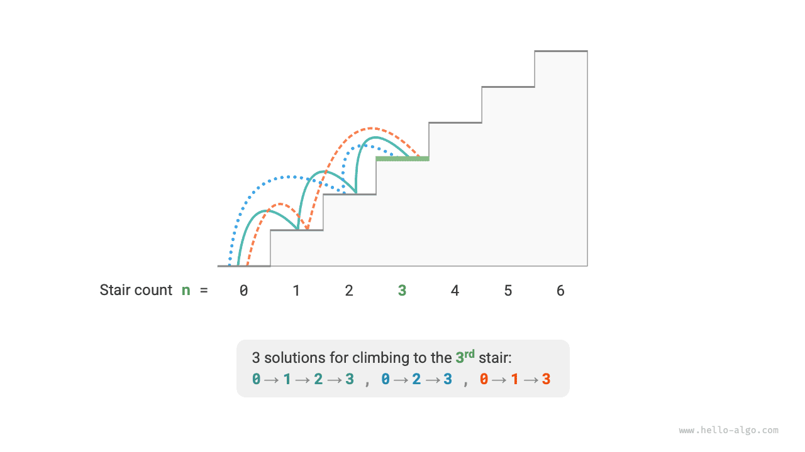
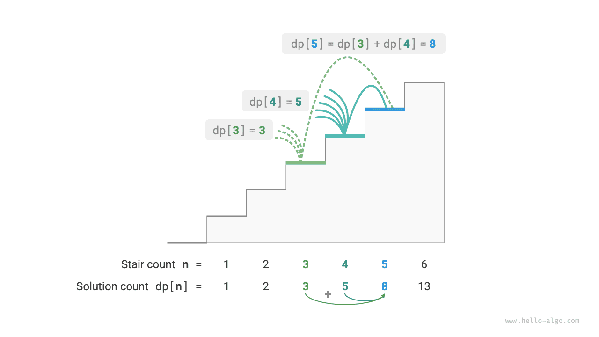
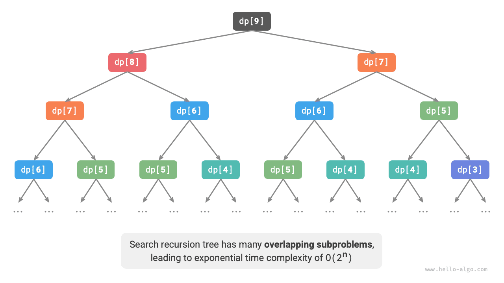

# Первое знакомство с динамическим программированием

<u>Динамическое программирование (dynamic programming)</u> - это важная алгоритмическая парадигма, которая разбивает задачу на последовательность более мелких подзадач и за счет хранения их решений избегает повторных вычислений, тем самым резко повышая эффективность по времени.

В этом разделе мы начнем с классического примера: сначала запишем его грубое решение через backtracking, увидим в нем перекрывающиеся подзадачи, а затем постепенно выведем более эффективное решение на основе динамического программирования.

!!! question "Подъем по лестнице"

    Дана лестница из $n$ ступеней. За один шаг можно подняться на $1$ или на $2$ ступени. Сколькими способами можно добраться до вершины?

Как показано на рисунке ниже, для лестницы из $3$ ступеней существует $3$ способа добраться до вершины.



Цель этой задачи - вычислить количество способов. **Поэтому можно попробовать грубо перебрать все варианты с помощью backtracking**. Если представить подъем по лестнице как последовательность решений, то мы начинаем от земли и на каждом раунде выбираем прыжок на $1$ или на $2$ ступени; всякий раз, когда достигаем вершины, увеличиваем число способов на $1$ , а если перескакиваем вершину, обрезаем эту ветвь. Код выглядит так:

```src
[file]{climbing_stairs_backtrack}-[class]{}-[func]{climbing_stairs_backtrack}
```

## Метод 1: полный перебор

Backtracking обычно не раскладывает задачу явно на подзадачи; вместо этого он рассматривает решение как последовательность решений, используя попытки и обрезку для поиска всех возможных ответов.

Попробуем посмотреть на задачу именно как на разложение подзадач. Пусть число способов добраться до ступени $i$ равно $dp[i]$ ; тогда $dp[i]$ - это исходная задача, а ее подзадачи включают:

$$
dp[i-1], dp[i-2], \dots, dp[2], dp[1]
$$

Поскольку за один раунд можно подняться только на $1$ или на $2$ ступени, стоя на ступени $i$ , в предыдущий раунд мы могли находиться только на ступени $i - 1$ или на ступени $i - 2$ . Иначе говоря, на ступень $i$ можно попасть только со ступени $i -1$ или со ступени $i - 2$ .

Отсюда получается важный вывод: **число способов добраться до ступени $i - 1$ плюс число способов добраться до ступени $i - 2$ равно числу способов добраться до ступени $i$**. Формула имеет вид:

$$
dp[i] = dp[i-1] + dp[i-2]
$$

Это означает, что в задаче о подъеме по лестнице между подзадачами существует рекуррентная зависимость, и **решение исходной задачи может быть построено на основе решений подзадач**. Эта связь показана на рисунке ниже.



По рекуррентной формуле можно получить решение полного перебора. Начиная с $dp[n]$ , **мы рекурсивно разлагаем большую задачу в сумму двух меньших задач** , пока не дойдем до наименьших подзадач $dp[1]$ и $dp[2]$ . Их решения уже известны: $dp[1] = 1$ и $dp[2] = 2$ , что означает $1$ и $2$ способа подняться соответственно на $1$-ю и $2$-ю ступени.

Посмотрите на следующий код: как и стандартный backtracking, он относится к поиску в глубину, но выглядит более компактно:

```src
[file]{climbing_stairs_dfs}-[class]{}-[func]{climbing_stairs_dfs}
```

На рисунке ниже показано дерево рекурсии, возникающее при полном переборе. Для задачи $dp[n]$ глубина дерева рекурсии равна $n$ , а временная сложность равна $O(2^n)$ . Экспоненциальный рост взрывообразен: если подать на вход достаточно большое значение $n$ , ожидание станет очень долгим.



Если посмотреть на рисунок выше, то видно, что **экспоненциальная временная сложность порождается "перекрывающимися подзадачами"**. Например, $dp[9]$ раскладывается в $dp[8]$ и $dp[7]$ , а $dp[8]$ - в $dp[7]$ и $dp[6]$ ; обе ветви содержат подзадачу $dp[7]$ .

Продолжая это рассуждение, мы видим, что подзадачи порождают все более мелкие перекрывающиеся подзадачи без конца. Подавляющая часть вычислительных ресурсов уходит именно на них.

## Метод 2: поиск с мемоизацией

Чтобы ускорить алгоритм, **мы хотим, чтобы каждая перекрывающаяся подзадача вычислялась только один раз**. Для этого объявим массив `mem` для хранения решения каждой подзадачи и будем обрезать повторные вычисления в процессе поиска.

1. Когда $dp[i]$ вычисляется впервые, мы сохраняем его в `mem[i]` для последующего использования.
2. Когда значение $dp[i]$ требуется снова, мы просто берем его напрямую из `mem[i]` и тем самым избегаем повторного вычисления подзадачи.

Код приведен ниже:

```src
[file]{climbing_stairs_dfs_mem}-[class]{}-[func]{climbing_stairs_dfs_mem}
```

Как показано на рисунке ниже, **после введения мемоизации каждая перекрывающаяся подзадача вычисляется только один раз, и временная сложность оптимизируется до $O(n)$** . Это огромный скачок в эффективности.


## Метод 3: динамическое программирование

**Поиск с мемоизацией - это метод "сверху вниз"** : мы начинаем с исходной задачи (корня), рекурсивно раскладываем более крупные подзадачи на меньшие, пока не достигнем наименьших подзадач с уже известным ответом (листьев). Затем в процессе возврата постепенно собираем решения подзадач и тем самым получаем решение исходной задачи.

Напротив, **динамическое программирование - это метод "снизу вверх"** : начиная с решений наименьших подзадач, мы итеративно строим решения для более крупных подзадач, пока не получим ответ на исходную задачу.

Поскольку в динамическом программировании нет этапа возврата, для его реализации достаточно обычных циклов, без рекурсии. В приведенном ниже коде мы инициализируем массив `dp` для хранения решений подзадач; он выполняет ту же роль, что и массив `mem` в мемоизированном поиске:

```src
[file]{climbing_stairs_dp}-[class]{}-[func]{climbing_stairs_dp}
```

На рисунке ниже смоделирован процесс выполнения этого кода.


Как и в backtracking, в динамическом программировании используется понятие "состояние" для обозначения некоторого этапа решения задачи; каждое состояние соответствует одной подзадаче и ее локально оптимальному решению. Например, в задаче о лестнице состояние определяется текущим номером ступени $i$ .

На основе сказанного можно подвести несколько часто используемых терминов динамического программирования.

- Массив `dp` называют <u>таблицей dp</u>, а $dp[i]$ обозначает решение подзадачи, соответствующей состоянию $i$ .
- Состояния, соответствующие наименьшим подзадачам (первая и вторая ступени), называют <u>начальными состояниями</u>.
- Рекуррентную формулу $dp[i] = dp[i-1] + dp[i-2]$ называют <u>уравнением перехода состояния</u>.

## Оптимизация пространства

Внимательный читатель мог заметить, что **поскольку $dp[i]$ зависит только от $dp[i-1]$ и $dp[i-2]$ , нам не нужен весь массив `dp` для хранения ответов всех подзадач** ; достаточно двух переменных, которые будут "перекатываться" вперед. Код имеет вид:

```src
[file]{climbing_stairs_dp}-[class]{}-[func]{climbing_stairs_dp_comp}
```

Из кода видно, что после отказа от массива `dp` пространственная сложность уменьшается с $O(n)$ до $O(1)$ .

Во многих задачах динамического программирования текущее состояние зависит лишь от ограниченного числа предыдущих состояний. Тогда можно сохранять только действительно нужные состояния и за счет "уменьшения размерности" экономить память. **Этот прием оптимизации памяти называют "скользящими переменными" или "скользящим массивом"**.
