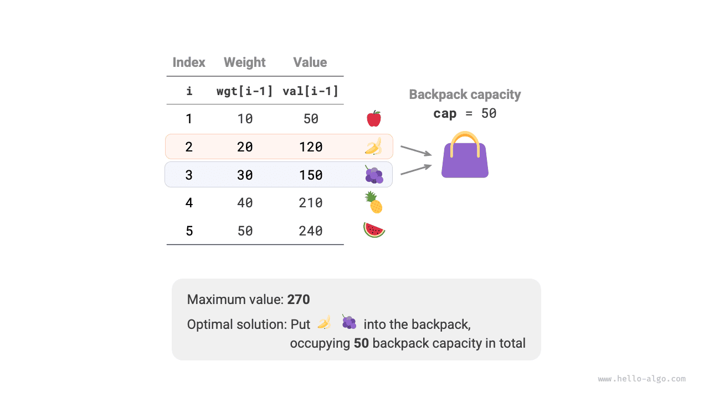
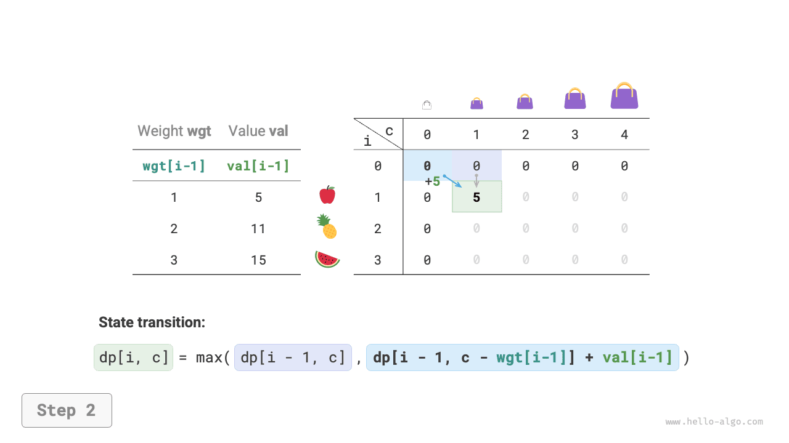
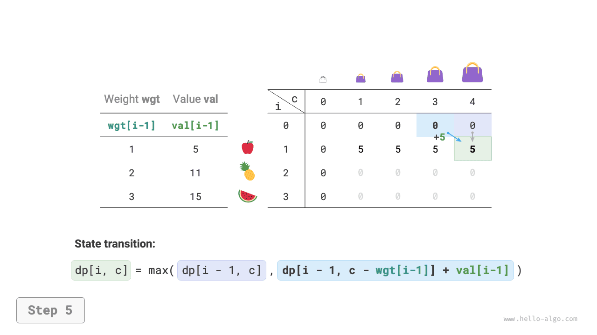
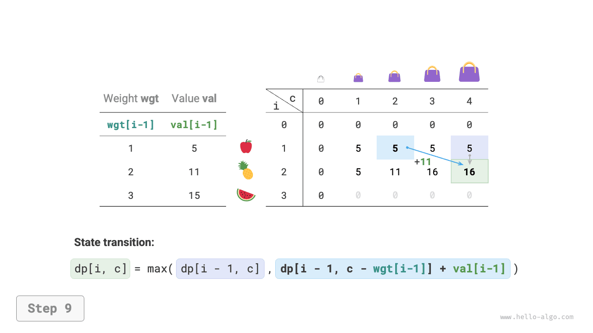
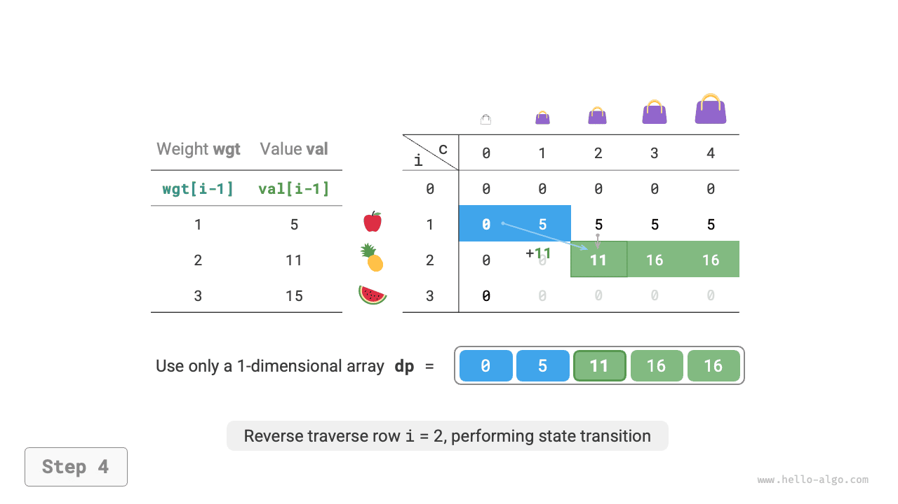

# Задача о рюкзаке 0-1

Задача о рюкзаке - это очень хороший вводный пример для динамического программирования и одна из самых типичных форм задач этого класса. У нее существует множество вариантов, например задача о рюкзаке 0-1, задача о полном рюкзаке, задача о многократном рюкзаке и т.д.

В этом разделе сначала разберем самый распространенный вариант - задачу о рюкзаке 0-1.

!!! question

    Даны $n$ предметов. Вес $i$-го предмета равен $wgt[i-1]$ , стоимость равна $val[i-1]$ . Также дан рюкзак вместимости $cap$ . Каждый предмет можно выбрать только один раз. Найдите максимальную суммарную стоимость, которую можно поместить в рюкзак при заданной вместимости.

Как видно на рисунке ниже, поскольку номер предмета $i$ начинается с $1$ , а индексы массива начинаются с $0$ , предмету $i$ соответствуют вес $wgt[i-1]$ и стоимость $val[i-1]$ .



На задачу о рюкзаке 0-1 можно смотреть как на процесс из $n$ раундов решений: для каждого предмета есть два решения - не класть его в рюкзак или положить в рюкзак. Поэтому задача удовлетворяет модели дерева решений.

Цель задачи - найти "максимальную суммарную стоимость при ограниченной вместимости рюкзака", значит, с большой вероятностью это задача динамического программирования.

**Шаг 1: продумать решения на каждом раунде, определить состояние и тем самым получить таблицу $dp$**

Для каждого предмета возможны два случая: не класть его в рюкзак, тогда вместимость не меняется; или положить его в рюкзак, тогда оставшаяся вместимость уменьшается. Отсюда получается определение состояния: текущий номер предмета $i$ и текущая вместимость рюкзака $c$ , то есть состояние обозначается как $[i, c]$ .

Подзадача, соответствующая состоянию $[i, c]$ , такова: **максимальная стоимость, которую можно получить, используя первые $i$ предметов и рюкзак вместимости $c$**. Ее решение обозначается через $dp[i, c]$ .

Искомым значением является $dp[n, cap]$ , значит, нам нужна двумерная таблица $dp$ размера $(n+1) \times (cap+1)$ .

**Шаг 2: найти оптимальную подструктуру и на ее основе вывести уравнение перехода состояния**

После того как мы принимаем решение по предмету $i$ , остается подзадача, связанная с первыми $i-1$ предметами. Здесь возможны два случая.

- **Не класть предмет $i$** : вместимость рюкзака не меняется, и состояние переходит в $[i-1, c]$ .
- **Положить предмет $i$** : вместимость рюкзака уменьшается на $wgt[i-1]$ , а стоимость увеличивается на $val[i-1]$ , и состояние переходит в $[i-1, c-wgt[i-1]]$ .

Этот анализ и раскрывает оптимальную подструктуру задачи: **максимальная стоимость $dp[i, c]$ равна лучшему из двух вариантов - не брать предмет $i$ или взять предмет $i$**. Отсюда получается уравнение перехода состояния:

$$
dp[i, c] = \max(dp[i-1, c], dp[i-1, c - wgt[i-1]] + val[i-1])
$$

Нужно учитывать, что если вес текущего предмета $wgt[i - 1]$ превышает оставшуюся вместимость $c$ , то предмет можно только не брать.

**Шаг 3: определить граничные условия и порядок переходов**

Когда предметов нет или вместимость рюкзака равна $0$ , максимальная стоимость равна $0$ ; то есть весь первый столбец $dp[i, 0]$ и вся первая строка $dp[0, c]$ заполняются нулями.

Текущее состояние $[i, c]$ зависит от состояния сверху $[i-1, c]$ и состояния слева сверху $[i-1, c-wgt[i-1]]$ , поэтому достаточно двумя вложенными циклами пройти по всей таблице $dp$ в прямом порядке.

После этого анализа реализуем по порядку: полный перебор, поиск с мемоизацией и динамическое программирование.

### Метод 1: полный перебор

Код поиска содержит следующие элементы.

- **Параметры рекурсии**: состояние $[i, c]$ .
- **Возвращаемое значение**: решение подзадачи $dp[i, c]$ .
- **Условие завершения**: когда номер предмета выходит за границу, то есть $i = 0$ , или оставшаяся вместимость равна $0$ , рекурсия завершается и возвращается стоимость $0$ .
- **Обрезка**: если вес текущего предмета превышает оставшуюся вместимость рюкзака, то можно только не класть этот предмет.

```src
[file]{knapsack}-[class]{}-[func]{knapsack_dfs}
```

Как показано на рисунке ниже, поскольку каждый предмет создает две ветви поиска - "не брать" и "брать", временная сложность равна $O(2^n)$ .

Посмотрев на дерево рекурсии, легко заметить наличие перекрывающихся подзадач, например $dp[1, 10]$ и подобных. Когда число предметов растет, вместимость рюкзака велика, а особенно когда много предметов с одинаковым весом, количество перекрывающихся подзадач быстро увеличивается.


### Метод 2: поиск с мемоизацией

Чтобы каждая перекрывающаяся подзадача вычислялась только один раз, используем таблицу памяти `mem` для хранения решений подзадач, где `mem[i][c]` соответствует $dp[i, c]$ .

После введения мемоизации **временная сложность определяется числом подзадач** , то есть равна $O(n \times cap)$ . Код выглядит так:

```src
[file]{knapsack}-[class]{}-[func]{knapsack_dfs_mem}
```

На рисунке ниже показаны ветви поиска, которые были отсечены благодаря мемоизации.


### Метод 3: динамическое программирование

По своей сути динамическое программирование здесь - это процесс последовательного заполнения таблицы $dp$ в соответствии с переходами состояний. Код приведен ниже:

```src
[file]{knapsack}-[class]{}-[func]{knapsack_dp}
```

Как показано на рисунке ниже, и временная сложность, и пространственная сложность определяются размером массива `dp` , то есть равны $O(n \times cap)$ .

=== "<1>"
    

=== "<2>"
    

=== "<3>"
    

=== "<4>"
    

=== "<5>"
    

=== "<6>"
    

=== "<7>"
    

=== "<8>"
    

=== "<9>"
    

=== "<10>"
    

=== "<11>"
    

=== "<12>"
    

=== "<13>"
    

=== "<14>"
    

### Оптимизация пространства

Поскольку каждое состояние зависит только от состояния в предыдущей строке, можно использовать два массива, которые будут "перекатываться" вперед, и тем самым уменьшить пространственную сложность с $O(n^2)$ до $O(n)$ .

Если пойти дальше, можно спросить: можно ли оптимизировать память так, чтобы использовать только один массив? Наблюдение показывает, что каждое состояние зависит от клетки прямо сверху и клетки слева сверху. Предположим, что у нас есть только один массив, и в момент начала обхода строки $i$ он еще хранит состояния строки $i-1$ .

- Если обходить массив слева направо, то к моменту вычисления $dp[i, j]$ значения слева сверху $dp[i-1, 1]$ ~ $dp[i-1, j-1]$ могут уже быть перезаписаны, и правильный результат перехода состояния получить не удастся.
- Если же обходить массив справа налево, проблема перезаписи не возникает, и переход состояния вычисляется корректно.

На рисунке ниже показан процесс перехода от строки $i = 1$ к строке $i = 2$ при использовании одного массива. Попробуйте сопоставить его с разницей между прямым и обратным обходом.

=== "<1>"
    

=== "<2>"
    

=== "<3>"
    

=== "<4>"
    

=== "<5>"
    

=== "<6>"
    

В коде для этого достаточно удалить первое измерение массива `dp` , а внутренний цикл заменить на обратный обход:

```src
[file]{knapsack}-[class]{}-[func]{knapsack_dp_comp}
```
