# Задача о полном рюкзаке

В этом разделе сначала решим еще один распространенный вариант задачи о рюкзаке - полный рюкзак, а затем рассмотрим одну из его типичных специальных форм: задачу о размене монет.

## Задача о полном рюкзаке

!!! question

    Даны $n$ предметов. Вес $i$-го предмета равен $wgt[i-1]$ , стоимость равна $val[i-1]$ . Также дан рюкзак вместимости $cap$ . **Каждый предмет можно выбирать многократно**. Найдите максимальную суммарную стоимость, которую можно поместить в рюкзак при заданной вместимости. Пример показан на рисунке ниже.

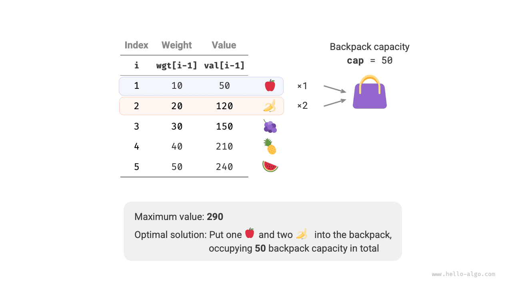

### Идея динамического программирования

Задача о полном рюкзаке очень похожа на задачу о рюкзаке 0-1; **разница состоит только в том, что число выборов каждого предмета не ограничено**.

- В задаче о рюкзаке 0-1 каждого предмета существует только один экземпляр, поэтому после того как предмет $i$ помещен в рюкзак, выбирать можно только из первых $i-1$ предметов.
- В задаче о полном рюкзаке число экземпляров каждого предмета бесконечно, поэтому после того как предмет $i$ помещен в рюкзак, **выбирать все еще можно из первых $i$ предметов**.

При этом состояние $[i, c]$ в задаче о полном рюкзаке может изменяться двумя способами.

- **Не брать предмет $i$** : как и в задаче о рюкзаке 0-1, переход осуществляется в $[i-1, c]$ .
- **Взять предмет $i$** : в отличие от рюкзака 0-1 переход происходит в $[i, c-wgt[i-1]]$ .

Следовательно, уравнение перехода состояния принимает вид:

$$
dp[i, c] = \max(dp[i-1, c], dp[i, c - wgt[i-1]] + val[i-1])
$$

### Реализация кода

Если сравнить код этой задачи с кодом задачи о рюкзаке 0-1, то окажется, что в переходе состояний меняется только одна деталь: вместо $i-1$ появляется $i$ ; все остальное остается таким же:

```src
[file]{unbounded_knapsack}-[class]{}-[func]{unbounded_knapsack_dp}
```

### Оптимизация пространства

Поскольку текущее состояние переходит из состояния слева и состояния сверху, **после оптимизации памяти каждую строку таблицы $dp$ нужно обходить слева направо**.

Этот порядок обхода как раз противоположен задаче о рюкзаке 0-1. Разницу удобно понять по рисунку ниже.

=== "<1>"
    

=== "<2>"
    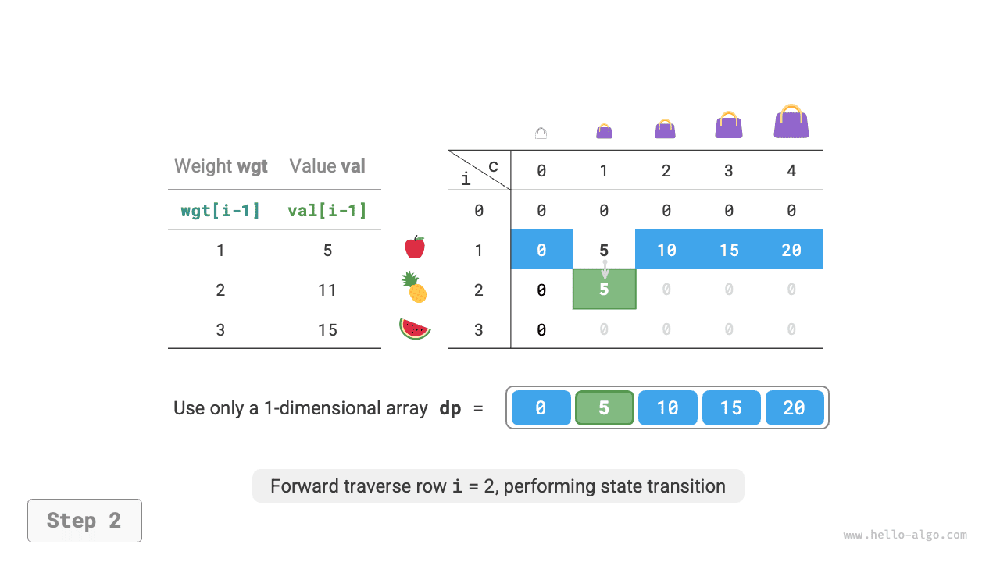

=== "<3>"
    

=== "<4>"
    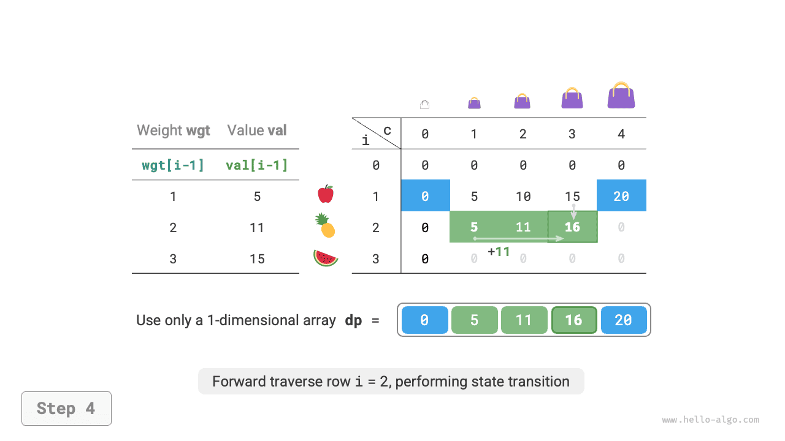

=== "<5>"
    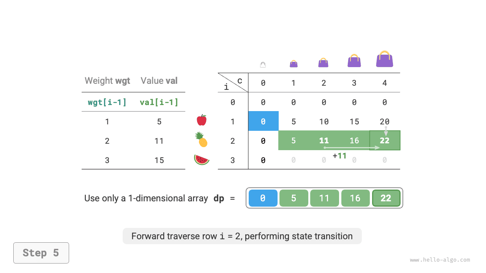

=== "<6>"
    

Код реализации здесь довольно прост: достаточно просто убрать первое измерение массива `dp` :

```src
[file]{unbounded_knapsack}-[class]{}-[func]{unbounded_knapsack_dp_comp}
```

## Задача о размене монет

Задача о рюкзаке представляет собой целый класс задач динамического программирования, у которого есть множество вариантов, и одной из таких вариаций является задача о размене монет.

!!! question

    Даны $n$ видов монет, номинал монеты $i$ равен $coins[i - 1]$ , а целевая сумма равна $amt$ . **Монеты каждого вида можно брать многократно**. Требуется найти минимальное число монет, которыми можно набрать целевую сумму. Если набрать сумму невозможно, верните $-1$ . Пример показан на рисунке ниже.


### Идея динамического программирования

**Задачу о размене монет можно рассматривать как частный случай задачи о полном рюкзаке** ; между ними существует следующая связь и следующие различия.

- Эти две задачи можно взаимно переводить друг в друга: "предмет" соответствует "монете", "вес предмета" соответствует "номиналу монеты", а "вместимость рюкзака" соответствует "целевой сумме".
- Цель оптимизации противоположна: в задаче о полном рюкзаке нужно максимизировать стоимость предметов, а в задаче о размене монет - минимизировать число монет.
- В задаче о полном рюкзаке ищется решение, не превышающее вместимость, а в задаче о размене монет требуется **ровно** набрать целевую сумму.

**Шаг 1: продумать решения на каждом раунде, определить состояние и тем самым получить таблицу $dp$**

Подзадача, соответствующая состоянию $[i, a]$ , выглядит так: **минимальное число монет из первых $i$ видов, которыми можно набрать сумму $a$**. Решение этой подзадачи обозначается как $dp[i, a]$ .

Размер двумерной таблицы $dp$ равен $(n+1) \times (amt+1)$ .

**Шаг 2: найти оптимальную подструктуру и на ее основе вывести уравнение перехода состояния**

По сравнению с задачей о полном рюкзаке здесь есть два отличия в уравнении перехода состояния.

- Нужно искать минимум, а не максимум, поэтому оператор $\max()$ заменяется на $\min()$ .
- Оптимизируемое значение - это число монет, а не суммарная стоимость, поэтому при выборе монеты нужно просто прибавить $1$ .

$$
dp[i, a] = \min(dp[i-1, a], dp[i, a - coins[i-1]] + 1)
$$

**Шаг 3: определить граничные условия и порядок переходов**

Когда целевая сумма равна $0$ , минимальное число монет для ее набора равно $0$ , то есть весь первый столбец $dp[i, 0]$ заполняется нулями.

Когда монет нет, **невозможно набрать никакую целевую сумму $> 0$** ; это и есть недопустимое решение. Чтобы функция $\min()$ в уравнении перехода состояния могла распознавать и отбрасывать такие недопустимые решения, удобно использовать значение $+ \infty$ ; то есть всю первую строку $dp[0, a]$ нужно инициализировать значением $+ \infty$ .

### Реализация кода

Большинство языков программирования не предоставляет готовую переменную $+ \infty$ для целых чисел, поэтому обычно приходится заменять ее на максимальное значение типа `int` . Но тогда возникает риск переполнения: операция $+ 1$ в уравнении перехода может переполнить большое число.

Поэтому здесь мы используем число $amt + 1$ как обозначение недопустимого решения, потому что для набора суммы $amt$ максимум нужно не больше чем $amt$ монет. Перед возвратом результата проверяем, равно ли $dp[n, amt]$ значению $amt + 1$ ; если да, то возвращаем $-1$ , что означает невозможность набрать целевую сумму. Код приведен ниже:

```src
[file]{coin_change}-[class]{}-[func]{coin_change_dp}
```

Как показано на рисунке ниже, процесс динамического программирования для задачи о размене монет очень похож на задачу о полном рюкзаке.

=== "<1>"
    

=== "<2>"
    

=== "<3>"
    

=== "<4>"
    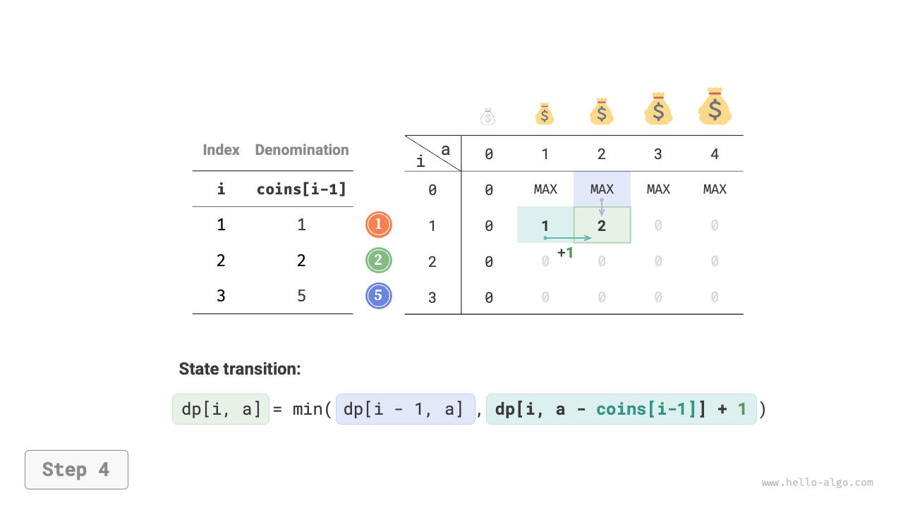

=== "<5>"
    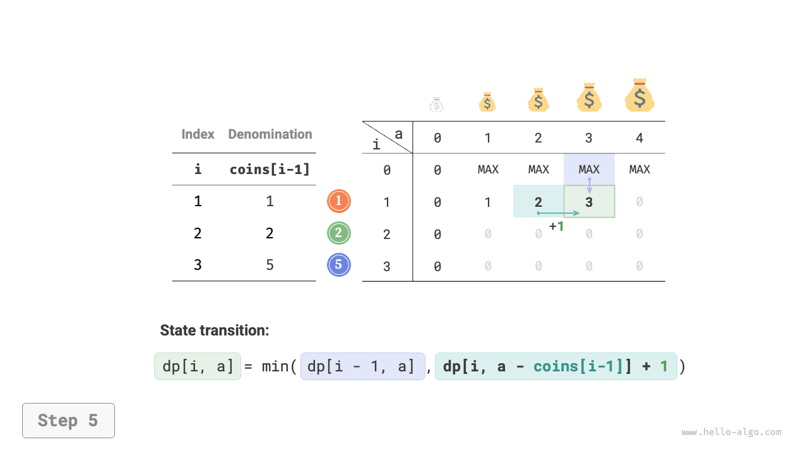

=== "<6>"
    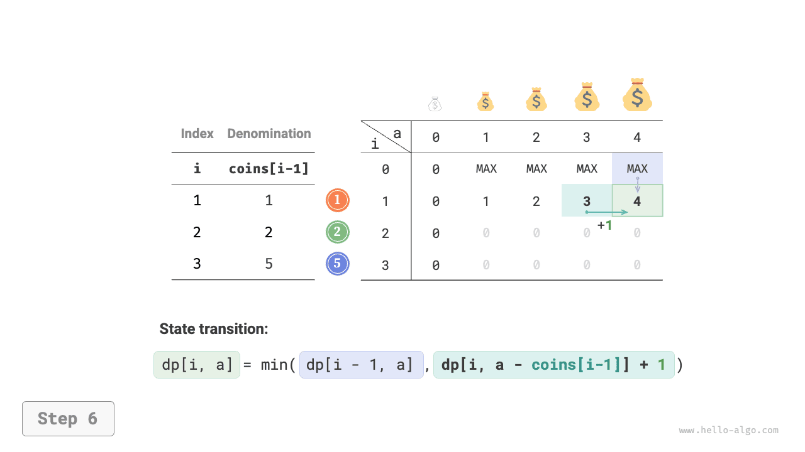

=== "<7>"
    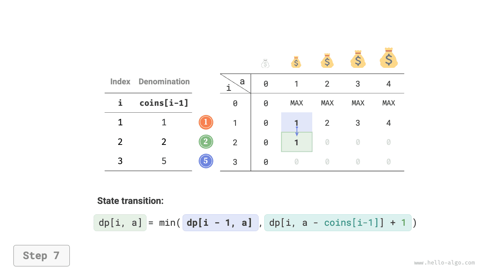

=== "<8>"
    

=== "<9>"
    

=== "<10>"
    

=== "<11>"
    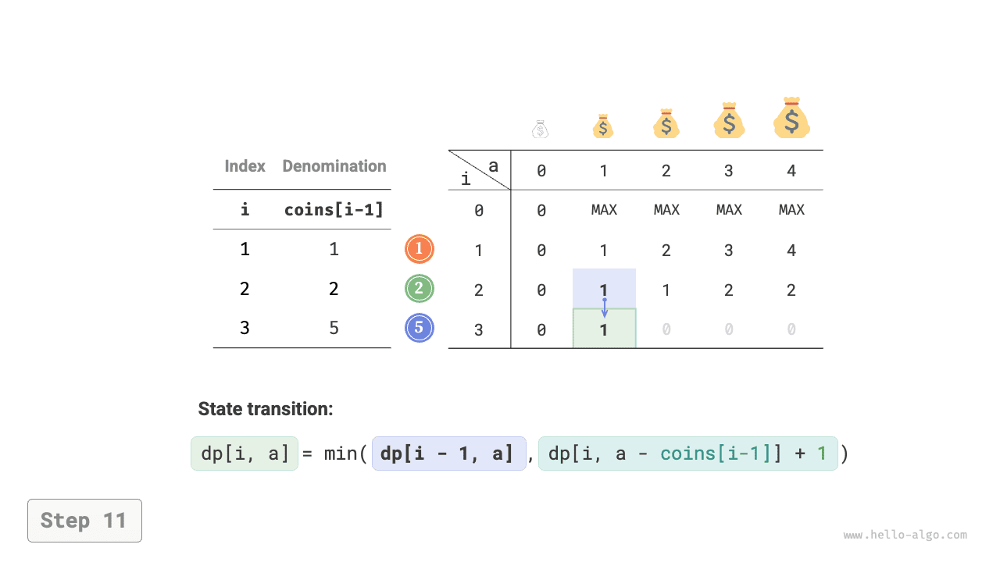

=== "<12>"
    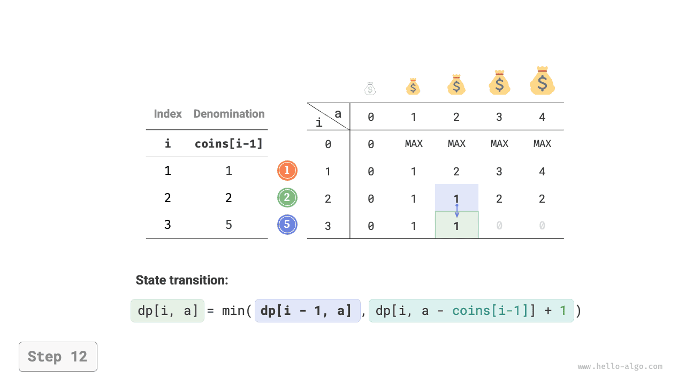

=== "<13>"
    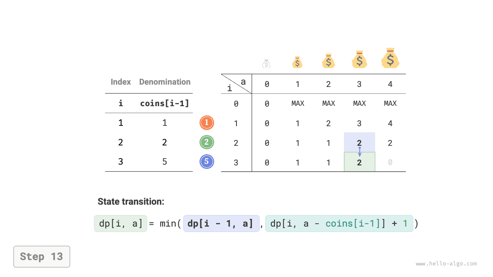

=== "<14>"
    

=== "<15>"
    

### Оптимизация пространства

Оптимизация пространства для задачи о размене монет выполняется так же, как и для полного рюкзака:

```src
[file]{coin_change}-[class]{}-[func]{coin_change_dp_comp}
```

## Задача о размене монет II

!!! question

    Даны $n$ видов монет, номинал монеты $i$ равен $coins[i - 1]$ , а целевая сумма равна $amt$ . Монеты каждого вида можно брать многократно. **Найдите число различных комбинаций монет, которыми можно набрать целевую сумму**. Пример показан на рисунке ниже.

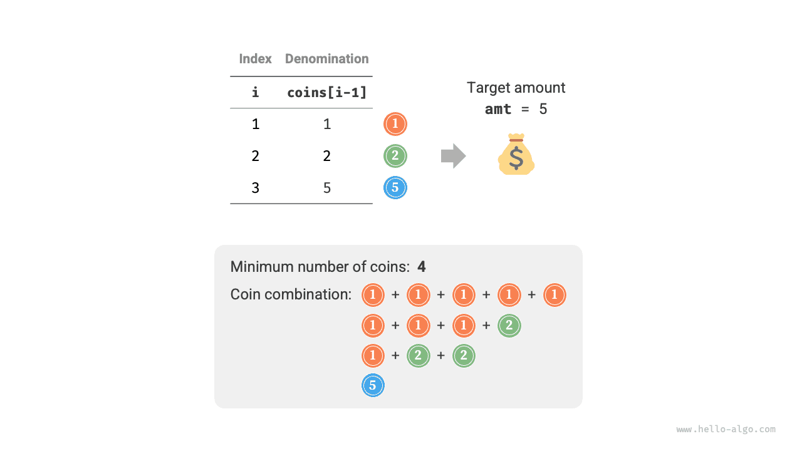

### Идея динамического программирования

По сравнению с предыдущей задачей теперь целью является число комбинаций. Поэтому подзадача меняется на следующую: **число комбинаций из первых $i$ видов монет, которыми можно набрать сумму $a$**. При этом таблица $dp$ по-прежнему остается двумерной матрицей размера $(n+1) \times (amt + 1)$ .

Число комбинаций для текущего состояния равно сумме числа комбинаций для двух решений: не брать текущую монету и брать текущую монету. Поэтому уравнение перехода состояния принимает вид:

$$
dp[i, a] = dp[i-1, a] + dp[i, a - coins[i-1]]
$$

Когда целевая сумма равна $0$ , ее можно набрать, не выбирая ни одной монеты, поэтому весь первый столбец $dp[i, 0]$ нужно инициализировать единицами. Когда монет нет, невозможно набрать никакую сумму $>0$ , поэтому вся первая строка $dp[0, a]$ должна быть заполнена нулями.

### Реализация кода

```src
[file]{coin_change_ii}-[class]{}-[func]{coin_change_ii_dp}
```

### Оптимизация пространства

При оптимизации памяти способ остается тем же самым: достаточно убрать измерение, отвечающее за виды монет:

```src
[file]{coin_change_ii}-[class]{}-[func]{coin_change_ii_dp_comp}
```
