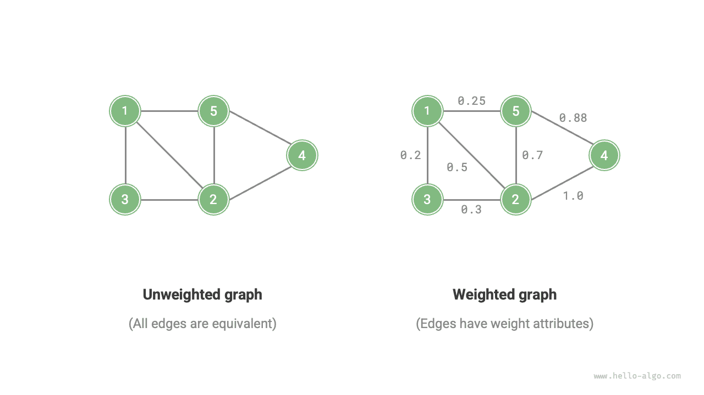

# Граф

<u>Граф (graph)</u> - это нелинейная структура данных, состоящая из <u>вершин (vertex)</u> и <u>ребер (edge)</u>. Граф $G$ можно абстрактно представить как множество вершин $V$ и множество ребер $E$ . Ниже приведен пример графа, содержащего 5 вершин и 7 ребер.

$$
\begin{aligned}
V & = \{ 1, 2, 3, 4, 5 \} \newline
E & = \{ (1,2), (1,3), (1,5), (2,3), (2,4), (2,5), (4,5) \} \newline
G & = \{ V, E \} \newline
\end{aligned}
$$

Если рассматривать вершины как узлы, а ребра как ссылки, соединяющие узлы, граф можно считать структурой данных, расширяющей связный список. Как показано на рисунке ниже, **по сравнению с линейными отношениями (связный список) и отношениями разделения (дерево), сетевые отношения (граф) обладают большей свободой** и потому являются более сложными.

## Распространенные типы и термины графов

В зависимости от наличия направления у ребер графы делятся на <u>неориентированные графы (undirected graph)</u> и <u>ориентированные графы (directed graph)</u> , как показано на рисунке ниже.

- В неориентированном графе ребро представляет двустороннюю связь между двумя вершинами, например дружеские отношения в социальных сетях.
- В ориентированном графе ребро имеет направление, то есть ребра $A \rightarrow B$ и $A \leftarrow B$ независимы друг от друга, например отношения подписки и подписчиков.

В зависимости от того, связаны ли все вершины между собой, граф делится на <u>связный граф (connected graph)</u> и <u>несвязный граф (disconnected graph)</u> , как показано на рисунке ниже.

- В связном графе из любой вершины можно достичь любой другой вершины.
- В несвязном графе существует по крайней мере одна вершина, недостижимая из текущей.

Мы также можем добавить к ребрам переменную "вес" и получить показанный ниже <u>взвешенный граф (weighted graph)</u>. Например, в мобильных играх вроде Honor of Kings система рассчитывает "близость" между игроками по времени совместной игры, и такую сеть близости можно представить взвешенным графом.

Со структурой данных "граф" связаны следующие основные термины.

- <u>Смежность (adjacency)</u>: если между двумя вершинами существует ребро, то такие вершины называются смежными. На рисунке выше с вершиной 1 смежны вершины 2, 3 и 5.
- <u>Путь (path)</u>: последовательность ребер от вершины A до вершины B называется путем из A в B. На рисунке выше последовательность ребер 1-5-2-4 является одним из путей от вершины 1 к вершине 4.
- <u>Степень (degree)</u>: количество ребер, принадлежащих вершине. Для ориентированного графа <u>входящая степень (in-degree)</u> показывает, сколько ребер входит в вершину, а <u>исходящая степень (out-degree)</u> показывает, сколько ребер из нее выходит.

## Представление графа

Распространенные способы представления графа включают "матрицу смежности" и "список смежности". Ниже для примера рассматривается неориентированный граф.

### Матрица смежности

Пусть число вершин графа равно $n$ ; тогда <u>матрица смежности (adjacency matrix)</u> использует матрицу размера $n \times n$ для представления графа, где каждая строка и каждый столбец соответствуют вершине, а элементы матрицы показывают наличие или отсутствие ребра.

Как показано на рисунке ниже, обозначим матрицу смежности через $M$ , а список вершин через $V$ ; тогда элемент матрицы $M[i, j] = 1$ означает наличие ребра между вершинами $V[i]$ и $V[j]$ , а элемент $M[i, j] = 0$ означает отсутствие ребра.

Матрица смежности обладает следующими особенностями.

- В простом графе вершина не может соединяться сама с собой, поэтому элементы на главной диагонали матрицы смежности не имеют значения.
- Для неориентированного графа ребра в обоих направлениях эквивалентны, поэтому матрица смежности симметрична относительно главной диагонали.
- Если заменить в матрице смежности значения $1$ и $0$ на веса, то можно представить взвешенный граф.

При представлении графа матрицей смежности можно напрямую обращаться к элементам матрицы и получать сведения о ребрах, поэтому операции добавления, удаления, поиска и изменения обладают высокой эффективностью и выполняются за $O(1)$ . Однако пространственная сложность матрицы составляет $O(n^2)$ , поэтому она требует значительных затрат памяти.

### Список смежности

<u>Список смежности (adjacency list)</u> использует $n$ списков для представления графа, где узлы списка обозначают вершины. $i$-й список соответствует вершине $i$ и хранит все смежные с ней вершины, то есть все вершины, соединенные с данной вершиной. На рисунке ниже показан пример графа, представленного списком смежности.

Список смежности хранит только реально существующие ребра, а общее число ребер обычно значительно меньше $n^2$ , поэтому он лучше экономит память. Однако для поиска ребра в списке смежности требуется обходить список, поэтому по времени он уступает матрице смежности.

Если посмотреть на рисунок выше, можно заметить, что **структура списка смежности очень похожа на цепную адресацию в хеш-таблицах, поэтому здесь можно использовать похожие методы оптимизации эффективности**. Например, если список слишком длинный, его можно преобразовать в AVL-дерево или красно-черное дерево, чтобы снизить временную сложность с $O(n)$ до $O(\log n)$ ; также список можно преобразовать в хеш-таблицу, чтобы довести временную сложность до $O(1)$ .

## Типичные применения графов

Как показано в таблице ниже, многие реальные системы можно моделировать с помощью графов, а соответствующие задачи затем сводить к задачам вычислений на графах.

 Таблица <id> &nbsp; Распространенные графы в реальной жизни 

|          | Вершина | Ребро                | Задача вычислений на графе |
| -------- | ------- | -------------------- | -------------------------- |
| Социальные сети | Пользователь | Дружеская связь     | Рекомендация потенциальных друзей |
| Линии метро | Станция | Связь между станциями | Рекомендация кратчайшего маршрута |
| Солнечная система | Небесное тело | Гравитационное взаимодействие между телами | Вычисление орбит планет |
