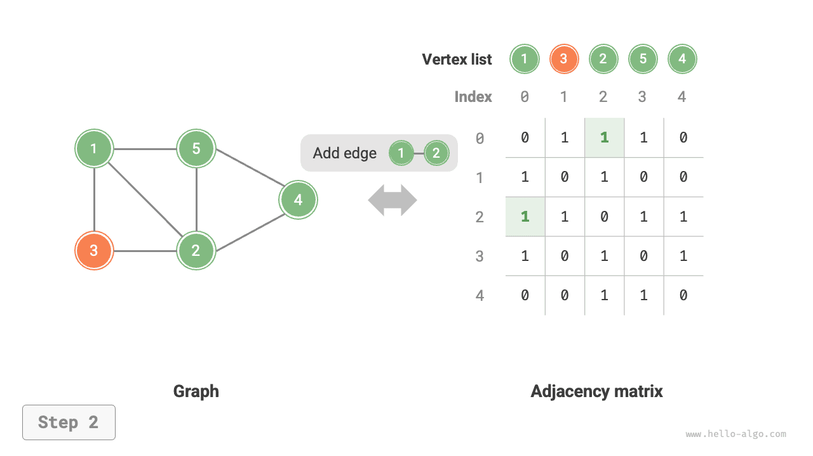
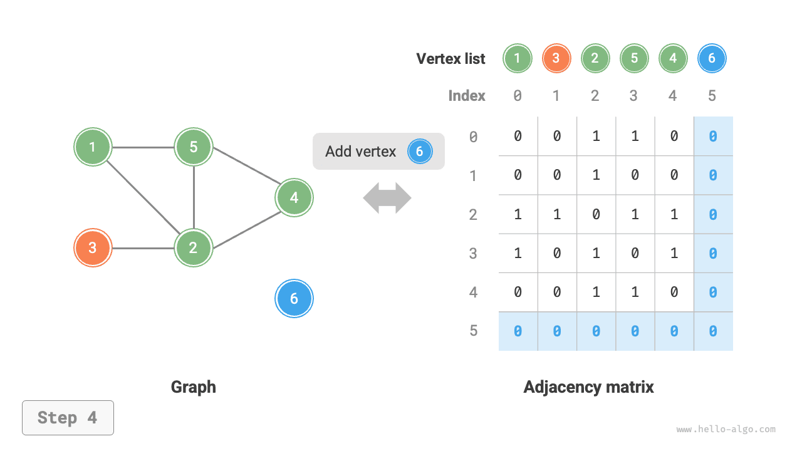
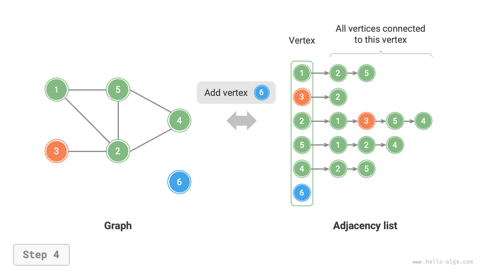
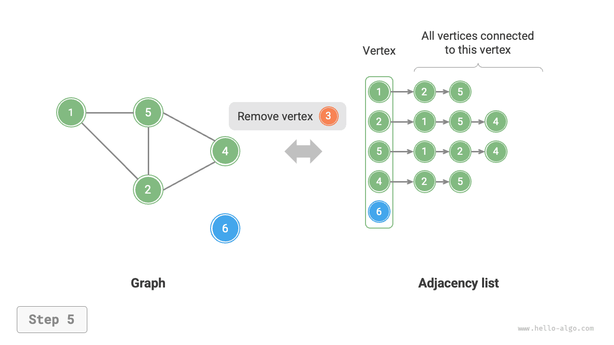

# 9.2 &nbsp; Базовые операции графа

Базовые операции графа можно разделить на операции над "ребрами" и операции над "вершинами". В двух способах представления - "матрица смежности" и "список смежности" - реализация будет различаться.

## 9.2.1 &nbsp; Реализация на основе матрицы смежности

Пусть дан неориентированный граф с числом вершин $n$ . Тогда способы реализации различных операций показаны на рисунках ниже.

- **Добавление или удаление ребра**: достаточно изменить соответствующее ребро в матрице смежности, это требует $O(1)$ времени. Поскольку граф неориентированный, нужно одновременно обновлять ребра в обоих направлениях.
- **Добавление вершины**: в конец матрицы смежности добавляется одна строка и один столбец, которые полностью заполняются нулями; это требует $O(n)$ времени.
- **Удаление вершины**: из матрицы смежности удаляется одна строка и один столбец. В худшем случае, когда удаляются первая строка и первый столбец, приходится "сдвигать вверх-влево" $(n-1)^2$ элементов, поэтому требуется $O(n^2)$ времени.
- **Инициализация**: передаются $n$ вершин, затем инициализируется список вершин `vertices` длины $n$ , что требует $O(n)$ времени; после этого инициализируется матрица смежности `adjMat` размера $n \times n$ , что требует $O(n^2)$ времени.

=== "Инициализация матрицы смежности"
    { class="animation-figure" }

=== "Добавление ребра"
    { class="animation-figure" }

=== "Удаление ребра"
    { class="animation-figure" }

=== "Добавление вершины"
    { class="animation-figure" }

=== "Удаление вершины"
    { class="animation-figure" }

<p align="center"> Рисунок 9-7 &nbsp; Инициализация матрицы смежности, добавление и удаление ребер и вершин </p>

Ниже приведен код реализации графа на основе матрицы смежности:

=== "Python"

    ```python title="graph_adjacency_matrix.py"
    class GraphAdjMat:
        """Класс неориентированного графа на основе матрицы смежности"""

        def __init__(self, vertices: list[int], edges: list[list[int]]):
            """Конструктор"""
            # Список вершин: элементы представляют «значения вершин», а индексы — «индексы вершин»
            self.vertices: list[int] = []
            # Матрица смежности, где индексы строк и столбцов соответствуют «индексам вершин»
            self.adj_mat: list[list[int]] = []
            # Добавление вершины
            for val in vertices:
                self.add_vertex(val)
            # Добавить ребра
            # Обратите внимание: элементы edges представляют собой индексы вершин, то есть соответствуют индексам элементов vertices
            for e in edges:
                self.add_edge(e[0], e[1])

        def size(self) -> int:
            """Получить число вершин"""
            return len(self.vertices)

        def add_vertex(self, val: int):
            """Добавление вершины"""
            n = self.size()
            # Добавить значение новой вершины в список вершин
            self.vertices.append(val)
            # Добавить строку в матрицу смежности
            new_row = [0] * n
            self.adj_mat.append(new_row)
            # Добавить столбец в матрицу смежности
            for row in self.adj_mat:
                row.append(0)

        def remove_vertex(self, index: int):
            """Удаление вершины"""
            if index >= self.size():
                raise IndexError()
            # Удалить вершину с индексом index из списка вершин
            self.vertices.pop(index)
            # Удалить строку с индексом index из матрицы смежности
            self.adj_mat.pop(index)
            # Удалить столбец с индексом index из матрицы смежности
            for row in self.adj_mat:
                row.pop(index)

        def add_edge(self, i: int, j: int):
            """Добавление ребра"""
            # Параметры i и j соответствуют индексам элементов vertices
            # Обработка выхода индекса за границы и случая равенства
            if i < 0 or j < 0 or i >= self.size() or j >= self.size() or i == j:
                raise IndexError()
            # В неориентированном графе матрица смежности симметрична относительно главной диагонали, то есть выполняется (i, j) == (j, i)
            self.adj_mat[i][j] = 1
            self.adj_mat[j][i] = 1

        def remove_edge(self, i: int, j: int):
            """Удаление ребра"""
            # Параметры i и j соответствуют индексам элементов vertices
            # Обработка выхода индекса за границы и случая равенства
            if i < 0 or j < 0 or i >= self.size() or j >= self.size() or i == j:
                raise IndexError()
            self.adj_mat[i][j] = 0
            self.adj_mat[j][i] = 0

        def print(self):
            """Вывести матрицу смежности"""
            print("Список вершин =", self.vertices)
            print("Матрица смежности =")
            print_matrix(self.adj_mat)
    ```

=== "C++"

    ```cpp title="graph_adjacency_matrix.cpp"
    /* Класс неориентированного графа на основе матрицы смежности */
    class GraphAdjMat {
        vector<int> vertices;       // Список вершин: элементы представляют «значения вершин», а индексы — «индексы вершин»
        vector<vector<int>> adjMat; // Матрица смежности, где индексы строк и столбцов соответствуют «индексам вершин»

      public:
        /* Конструктор */
        GraphAdjMat(const vector<int> &vertices, const vector<vector<int>> &edges) {
            // Добавление вершины
            for (int val : vertices) {
                addVertex(val);
            }
            // Добавить ребра
            // Обратите внимание: элементы edges представляют собой индексы вершин, то есть соответствуют индексам элементов vertices
            for (const vector<int> &edge : edges) {
                addEdge(edge[0], edge[1]);
            }
        }

        /* Получить число вершин */
        int size() const {
            return vertices.size();
        }

        /* Добавление вершины */
        void addVertex(int val) {
            int n = size();
            // Добавить значение новой вершины в список вершин
            vertices.push_back(val);
            // Добавить строку в матрицу смежности
            adjMat.emplace_back(vector<int>(n, 0));
            // Добавить столбец в матрицу смежности
            for (vector<int> &row : adjMat) {
                row.push_back(0);
            }
        }

        /* Удаление вершины */
        void removeVertex(int index) {
            if (index >= size()) {
                throw out_of_range("вершина не существует");
            }
            // Удалить вершину с индексом index из списка вершин
            vertices.erase(vertices.begin() + index);
            // Удалить строку с индексом index из матрицы смежности
            adjMat.erase(adjMat.begin() + index);
            // Удалить столбец с индексом index из матрицы смежности
            for (vector<int> &row : adjMat) {
                row.erase(row.begin() + index);
            }
        }

        /* Добавление ребра */
        // Параметры i и j соответствуют индексам элементов vertices
        void addEdge(int i, int j) {
            // Обработка выхода индекса за границы и случая равенства
            if (i < 0 || j < 0 || i >= size() || j >= size() || i == j) {
                throw out_of_range("вершина не существует");
            }
            // В неориентированном графе матрица смежности симметрична относительно главной диагонали, то есть выполняется (i, j) == (j, i)
            adjMat[i][j] = 1;
            adjMat[j][i] = 1;
        }

        /* Удаление ребра */
        // Параметры i и j соответствуют индексам элементов vertices
        void removeEdge(int i, int j) {
            // Обработка выхода индекса за границы и случая равенства
            if (i < 0 || j < 0 || i >= size() || j >= size() || i == j) {
                throw out_of_range("вершина не существует");
            }
            adjMat[i][j] = 0;
            adjMat[j][i] = 0;
        }

        /* Вывести матрицу смежности */
        void print() {
            cout << "Список вершин = ";
            printVector(vertices);
            cout << "Матрица смежности =" << endl;
            printVectorMatrix(adjMat);
        }
    };
    ```

=== "Java"

    ```java title="graph_adjacency_matrix.java"
    /* Класс неориентированного графа на основе матрицы смежности */
    class GraphAdjMat {
        List<Integer> vertices; // Список вершин: элементы представляют «значения вершин», а индексы — «индексы вершин»
        List<List<Integer>> adjMat; // Матрица смежности, где индексы строк и столбцов соответствуют «индексам вершин»

        /* Конструктор */
        public GraphAdjMat(int[] vertices, int[][] edges) {
            this.vertices = new ArrayList<>();
            this.adjMat = new ArrayList<>();
            // Добавление вершины
            for (int val : vertices) {
                addVertex(val);
            }
            // Добавить ребра
            // Обратите внимание: элементы edges представляют собой индексы вершин, то есть соответствуют индексам элементов vertices
            for (int[] e : edges) {
                addEdge(e[0], e[1]);
            }
        }

        /* Получить число вершин */
        public int size() {
            return vertices.size();
        }

        /* Добавление вершины */
        public void addVertex(int val) {
            int n = size();
            // Добавить значение новой вершины в список вершин
            vertices.add(val);
            // Добавить строку в матрицу смежности
            List<Integer> newRow = new ArrayList<>(n);
            for (int j = 0; j < n; j++) {
                newRow.add(0);
            }
            adjMat.add(newRow);
            // Добавить столбец в матрицу смежности
            for (List<Integer> row : adjMat) {
                row.add(0);
            }
        }

        /* Удаление вершины */
        public void removeVertex(int index) {
            if (index >= size())
                throw new IndexOutOfBoundsException();
            // Удалить вершину с индексом index из списка вершин
            vertices.remove(index);
            // Удалить строку с индексом index из матрицы смежности
            adjMat.remove(index);
            // Удалить столбец с индексом index из матрицы смежности
            for (List<Integer> row : adjMat) {
                row.remove(index);
            }
        }

        /* Добавление ребра */
        // Параметры i и j соответствуют индексам элементов vertices
        public void addEdge(int i, int j) {
            // Обработка выхода индекса за границы и случая равенства
            if (i < 0 || j < 0 || i >= size() || j >= size() || i == j)
                throw new IndexOutOfBoundsException();
            // В неориентированном графе матрица смежности симметрична относительно главной диагонали, то есть выполняется (i, j) == (j, i)
            adjMat.get(i).set(j, 1);
            adjMat.get(j).set(i, 1);
        }

        /* Удаление ребра */
        // Параметры i и j соответствуют индексам элементов vertices
        public void removeEdge(int i, int j) {
            // Обработка выхода индекса за границы и случая равенства
            if (i < 0 || j < 0 || i >= size() || j >= size() || i == j)
                throw new IndexOutOfBoundsException();
            adjMat.get(i).set(j, 0);
            adjMat.get(j).set(i, 0);
        }

        /* Вывести матрицу смежности */
        public void print() {
            System.out.print("Список вершин = ");
            System.out.println(vertices);
            System.out.println("Матрица смежности =");
            PrintUtil.printMatrix(adjMat);
        }
    }
    ```

=== "C#"

    ```csharp title="graph_adjacency_matrix.cs"
    /* Класс неориентированного графа на основе матрицы смежности */
    class GraphAdjMat {
        List<int> vertices;     // Список вершин: элементы представляют «значения вершин», а индексы — «индексы вершин»
        List<List<int>> adjMat; // Матрица смежности, где индексы строк и столбцов соответствуют «индексам вершин»

        /* Конструктор */
        public GraphAdjMat(int[] vertices, int[][] edges) {
            this.vertices = [];
            this.adjMat = [];
            // Добавление вершины
            foreach (int val in vertices) {
                AddVertex(val);
            }
            // Добавить ребра
            // Обратите внимание: элементы edges представляют собой индексы вершин, то есть соответствуют индексам элементов vertices
            foreach (int[] e in edges) {
                AddEdge(e[0], e[1]);
            }
        }

        /* Получить число вершин */
        int Size() {
            return vertices.Count;
        }

        /* Добавление вершины */
        public void AddVertex(int val) {
            int n = Size();
            // Добавить значение новой вершины в список вершин
            vertices.Add(val);
            // Добавить строку в матрицу смежности
            List<int> newRow = new(n);
            for (int j = 0; j < n; j++) {
                newRow.Add(0);
            }
            adjMat.Add(newRow);
            // Добавить столбец в матрицу смежности
            foreach (List<int> row in adjMat) {
                row.Add(0);
            }
        }

        /* Удаление вершины */
        public void RemoveVertex(int index) {
            if (index >= Size())
                throw new IndexOutOfRangeException();
            // Удалить вершину с индексом index из списка вершин
            vertices.RemoveAt(index);
            // Удалить строку с индексом index из матрицы смежности
            adjMat.RemoveAt(index);
            // Удалить столбец с индексом index из матрицы смежности
            foreach (List<int> row in adjMat) {
                row.RemoveAt(index);
            }
        }

        /* Добавление ребра */
        // Параметры i и j соответствуют индексам элементов vertices
        public void AddEdge(int i, int j) {
            // Обработка выхода индекса за границы и случая равенства
            if (i < 0 || j < 0 || i >= Size() || j >= Size() || i == j)
                throw new IndexOutOfRangeException();
            // В неориентированном графе матрица смежности симметрична относительно главной диагонали, то есть выполняется (i, j) == (j, i)
            adjMat[i][j] = 1;
            adjMat[j][i] = 1;
        }

        /* Удаление ребра */
        // Параметры i и j соответствуют индексам элементов vertices
        public void RemoveEdge(int i, int j) {
            // Обработка выхода индекса за границы и случая равенства
            if (i < 0 || j < 0 || i >= Size() || j >= Size() || i == j)
                throw new IndexOutOfRangeException();
            adjMat[i][j] = 0;
            adjMat[j][i] = 0;
        }

        /* Вывести матрицу смежности */
        public void Print() {
            Console.Write("Список вершин = ");
            PrintUtil.PrintList(vertices);
            Console.WriteLine("Матрица смежности =");
            PrintUtil.PrintMatrix(adjMat);
        }
    }
    ```

=== "Go"

    ```go title="graph_adjacency_matrix.go"
    /* Класс неориентированного графа на основе матрицы смежности */
    type graphAdjMat struct {
        // Список вершин: элементы представляют «значения вершин», а индексы — «индексы вершин»
        vertices []int
        // Матрица смежности, где индексы строк и столбцов соответствуют «индексам вершин»
        adjMat [][]int
    }

    /* Конструктор */
    func newGraphAdjMat(vertices []int, edges [][]int) *graphAdjMat {
        // Добавление вершины
        n := len(vertices)
        adjMat := make([][]int, n)
        for i := range adjMat {
            adjMat[i] = make([]int, n)
        }
        // Инициализировать граф
        g := &graphAdjMat{
            vertices: vertices,
            adjMat:   adjMat,
        }
        // Добавить ребра
        // Обратите внимание: элементы edges представляют собой индексы вершин, то есть соответствуют индексам элементов vertices
        for i := range edges {
            g.addEdge(edges[i][0], edges[i][1])
        }
        return g
    }

    /* Получить число вершин */
    func (g *graphAdjMat) size() int {
        return len(g.vertices)
    }

    /* Добавление вершины */
    func (g *graphAdjMat) addVertex(val int) {
        n := g.size()
        // Добавить значение новой вершины в список вершин
        g.vertices = append(g.vertices, val)
        // Добавить строку в матрицу смежности
        newRow := make([]int, n)
        g.adjMat = append(g.adjMat, newRow)
        // Добавить столбец в матрицу смежности
        for i := range g.adjMat {
            g.adjMat[i] = append(g.adjMat[i], 0)
        }
    }

    /* Удаление вершины */
    func (g *graphAdjMat) removeVertex(index int) {
        if index >= g.size() {
            return
        }
        // Удалить вершину с индексом index из списка вершин
        g.vertices = append(g.vertices[:index], g.vertices[index+1:]...)
        // Удалить строку с индексом index из матрицы смежности
        g.adjMat = append(g.adjMat[:index], g.adjMat[index+1:]...)
        // Удалить столбец с индексом index из матрицы смежности
        for i := range g.adjMat {
            g.adjMat[i] = append(g.adjMat[i][:index], g.adjMat[i][index+1:]...)
        }
    }

    /* Добавление ребра */
    // Параметры i и j соответствуют индексам элементов vertices
    func (g *graphAdjMat) addEdge(i, j int) {
        // Обработка выхода индекса за границы и случая равенства
        if i < 0 || j < 0 || i >= g.size() || j >= g.size() || i == j {
            fmt.Errorf("%s", "Index Out Of Bounds Exception")
        }
        // В неориентированном графе матрица смежности симметрична относительно главной диагонали, то есть выполняется (i, j) == (j, i)
        g.adjMat[i][j] = 1
        g.adjMat[j][i] = 1
    }

    /* Удаление ребра */
    // Параметры i и j соответствуют индексам элементов vertices
    func (g *graphAdjMat) removeEdge(i, j int) {
        // Обработка выхода индекса за границы и случая равенства
        if i < 0 || j < 0 || i >= g.size() || j >= g.size() || i == j {
            fmt.Errorf("%s", "Index Out Of Bounds Exception")
        }
        g.adjMat[i][j] = 0
        g.adjMat[j][i] = 0
    }

    /* Вывести матрицу смежности */
    func (g *graphAdjMat) print() {
        fmt.Printf("\tСписок вершин = %v\n", g.vertices)
        fmt.Printf("\tМатрица смежности = \n")
        for i := range g.adjMat {
            fmt.Printf("\t\t\t%v\n", g.adjMat[i])
        }
    }
    ```

=== "Swift"

    ```swift title="graph_adjacency_matrix.swift"
    /* Класс неориентированного графа на основе матрицы смежности */
    class GraphAdjMat {
        private var vertices: [Int] // Список вершин: элементы представляют «значения вершин», а индексы — «индексы вершин»
        private var adjMat: [[Int]] // Матрица смежности, где индексы строк и столбцов соответствуют «индексам вершин»

        /* Конструктор */
        init(vertices: [Int], edges: [[Int]]) {
            self.vertices = []
            adjMat = []
            // Добавление вершины
            for val in vertices {
                addVertex(val: val)
            }
            // Добавить ребра
            // Обратите внимание: элементы edges представляют собой индексы вершин, то есть соответствуют индексам элементов vertices
            for e in edges {
                addEdge(i: e[0], j: e[1])
            }
        }

        /* Получить число вершин */
        func size() -> Int {
            vertices.count
        }

        /* Добавление вершины */
        func addVertex(val: Int) {
            let n = size()
            // Добавить значение новой вершины в список вершин
            vertices.append(val)
            // Добавить строку в матрицу смежности
            let newRow = Array(repeating: 0, count: n)
            adjMat.append(newRow)
            // Добавить столбец в матрицу смежности
            for i in adjMat.indices {
                adjMat[i].append(0)
            }
        }

        /* Удаление вершины */
        func removeVertex(index: Int) {
            if index >= size() {
                fatalError("Выход за границы диапазона")
            }
            // Удалить вершину с индексом index из списка вершин
            vertices.remove(at: index)
            // Удалить строку с индексом index из матрицы смежности
            adjMat.remove(at: index)
            // Удалить столбец с индексом index из матрицы смежности
            for i in adjMat.indices {
                adjMat[i].remove(at: index)
            }
        }

        /* Добавление ребра */
        // Параметры i и j соответствуют индексам элементов vertices
        func addEdge(i: Int, j: Int) {
            // Обработка выхода индекса за границы и случая равенства
            if i < 0 || j < 0 || i >= size() || j >= size() || i == j {
                fatalError("Выход за границы диапазона")
            }
            // В неориентированном графе матрица смежности симметрична относительно главной диагонали, то есть выполняется (i, j) == (j, i)
            adjMat[i][j] = 1
            adjMat[j][i] = 1
        }

        /* Удаление ребра */
        // Параметры i и j соответствуют индексам элементов vertices
        func removeEdge(i: Int, j: Int) {
            // Обработка выхода индекса за границы и случая равенства
            if i < 0 || j < 0 || i >= size() || j >= size() || i == j {
                fatalError("Выход за границы диапазона")
            }
            adjMat[i][j] = 0
            adjMat[j][i] = 0
        }

        /* Вывести матрицу смежности */
        func print() {
            Swift.print("Список вершин = ", terminator: "")
            Swift.print(vertices)
            Swift.print("Матрица смежности =")
            PrintUtil.printMatrix(matrix: adjMat)
        }
    }
    ```

=== "JS"

    ```javascript title="graph_adjacency_matrix.js"
    /* Класс неориентированного графа на основе матрицы смежности */
    class GraphAdjMat {
        vertices; // Список вершин: элементы представляют «значения вершин», а индексы — «индексы вершин»
        adjMat; // Матрица смежности, где индексы строк и столбцов соответствуют «индексам вершин»

        /* Конструктор */
        constructor(vertices, edges) {
            this.vertices = [];
            this.adjMat = [];
            // Добавление вершины
            for (const val of vertices) {
                this.addVertex(val);
            }
            // Добавить ребра
            // Обратите внимание: элементы edges представляют собой индексы вершин, то есть соответствуют индексам элементов vertices
            for (const e of edges) {
                this.addEdge(e[0], e[1]);
            }
        }

        /* Получить число вершин */
        size() {
            return this.vertices.length;
        }

        /* Добавление вершины */
        addVertex(val) {
            const n = this.size();
            // Добавить значение новой вершины в список вершин
            this.vertices.push(val);
            // Добавить строку в матрицу смежности
            const newRow = [];
            for (let j = 0; j < n; j++) {
                newRow.push(0);
            }
            this.adjMat.push(newRow);
            // Добавить столбец в матрицу смежности
            for (const row of this.adjMat) {
                row.push(0);
            }
        }

        /* Удаление вершины */
        removeVertex(index) {
            if (index >= this.size()) {
                throw new RangeError('Index Out Of Bounds Exception');
            }
            // Удалить вершину с индексом index из списка вершин
            this.vertices.splice(index, 1);

            // Удалить строку с индексом index из матрицы смежности
            this.adjMat.splice(index, 1);
            // Удалить столбец с индексом index из матрицы смежности
            for (const row of this.adjMat) {
                row.splice(index, 1);
            }
        }

        /* Добавление ребра */
        // Параметры i и j соответствуют индексам элементов vertices
        addEdge(i, j) {
            // Обработка выхода индекса за границы и случая равенства
            if (i < 0 || j < 0 || i >= this.size() || j >= this.size() || i === j) {
                throw new RangeError('Index Out Of Bounds Exception');
            }
            // В неориентированном графе матрица смежности симметрична относительно главной диагонали, то есть выполняется (i, j) === (j, i)
            this.adjMat[i][j] = 1;
            this.adjMat[j][i] = 1;
        }

        /* Удаление ребра */
        // Параметры i и j соответствуют индексам элементов vertices
        removeEdge(i, j) {
            // Обработка выхода индекса за границы и случая равенства
            if (i < 0 || j < 0 || i >= this.size() || j >= this.size() || i === j) {
                throw new RangeError('Index Out Of Bounds Exception');
            }
            this.adjMat[i][j] = 0;
            this.adjMat[j][i] = 0;
        }

        /* Вывести матрицу смежности */
        print() {
            console.log('Список вершин = ', this.vertices);
            console.log('Матрица смежности =', this.adjMat);
        }
    }
    ```

=== "TS"

    ```typescript title="graph_adjacency_matrix.ts"
    /* Класс неориентированного графа на основе матрицы смежности */
    class GraphAdjMat {
        vertices: number[]; // Список вершин: элементы представляют «значения вершин», а индексы — «индексы вершин»
        adjMat: number[][]; // Матрица смежности, где индексы строк и столбцов соответствуют «индексам вершин»

        /* Конструктор */
        constructor(vertices: number[], edges: number[][]) {
            this.vertices = [];
            this.adjMat = [];
            // Добавление вершины
            for (const val of vertices) {
                this.addVertex(val);
            }
            // Добавить ребра
            // Обратите внимание: элементы edges представляют собой индексы вершин, то есть соответствуют индексам элементов vertices
            for (const e of edges) {
                this.addEdge(e[0], e[1]);
            }
        }

        /* Получить число вершин */
        size(): number {
            return this.vertices.length;
        }

        /* Добавление вершины */
        addVertex(val: number): void {
            const n: number = this.size();
            // Добавить значение новой вершины в список вершин
            this.vertices.push(val);
            // Добавить строку в матрицу смежности
            const newRow: number[] = [];
            for (let j: number = 0; j < n; j++) {
                newRow.push(0);
            }
            this.adjMat.push(newRow);
            // Добавить столбец в матрицу смежности
            for (const row of this.adjMat) {
                row.push(0);
            }
        }

        /* Удаление вершины */
        removeVertex(index: number): void {
            if (index >= this.size()) {
                throw new RangeError('Index Out Of Bounds Exception');
            }
            // Удалить вершину с индексом index из списка вершин
            this.vertices.splice(index, 1);

            // Удалить строку с индексом index из матрицы смежности
            this.adjMat.splice(index, 1);
            // Удалить столбец с индексом index из матрицы смежности
            for (const row of this.adjMat) {
                row.splice(index, 1);
            }
        }

        /* Добавление ребра */
        // Параметры i и j соответствуют индексам элементов vertices
        addEdge(i: number, j: number): void {
            // Обработка выхода индекса за границы и случая равенства
            if (i < 0 || j < 0 || i >= this.size() || j >= this.size() || i === j) {
                throw new RangeError('Index Out Of Bounds Exception');
            }
            // В неориентированном графе матрица смежности симметрична относительно главной диагонали, то есть выполняется (i, j) === (j, i)
            this.adjMat[i][j] = 1;
            this.adjMat[j][i] = 1;
        }

        /* Удаление ребра */
        // Параметры i и j соответствуют индексам элементов vertices
        removeEdge(i: number, j: number): void {
            // Обработка выхода индекса за границы и случая равенства
            if (i < 0 || j < 0 || i >= this.size() || j >= this.size() || i === j) {
                throw new RangeError('Index Out Of Bounds Exception');
            }
            this.adjMat[i][j] = 0;
            this.adjMat[j][i] = 0;
        }

        /* Вывести матрицу смежности */
        print(): void {
            console.log('Список вершин = ', this.vertices);
            console.log('Матрица смежности =', this.adjMat);
        }
    }
    ```

=== "Dart"

    ```dart title="graph_adjacency_matrix.dart"
    /* Класс неориентированного графа на основе матрицы смежности */
    class GraphAdjMat {
      List<int> vertices = []; // Элемент вершины: элемент представляет «значение вершины», индекс представляет «индекс вершины»
      List<List<int>> adjMat = []; // Матрица смежности, где индексы строк и столбцов соответствуют «индексам вершин»

      /* Конструктор */
      GraphAdjMat(List<int> vertices, List<List<int>> edges) {
        this.vertices = [];
        this.adjMat = [];
        // Добавление вершины
        for (int val in vertices) {
          addVertex(val);
        }
        // Добавить ребра
        // Обратите внимание: элементы edges представляют собой индексы вершин, то есть соответствуют индексам элементов vertices
        for (List<int> e in edges) {
          addEdge(e[0], e[1]);
        }
      }

      /* Получить число вершин */
      int size() {
        return vertices.length;
      }

      /* Добавление вершины */
      void addVertex(int val) {
        int n = size();
        // Добавить значение новой вершины в список вершин
        vertices.add(val);
        // Добавить строку в матрицу смежности
        List<int> newRow = List.filled(n, 0, growable: true);
        adjMat.add(newRow);
        // Добавить столбец в матрицу смежности
        for (List<int> row in adjMat) {
          row.add(0);
        }
      }

      /* Удаление вершины */
      void removeVertex(int index) {
        if (index >= size()) {
          throw IndexError;
        }
        // Удалить вершину с индексом index из списка вершин
        vertices.removeAt(index);
        // Удалить строку с индексом index из матрицы смежности
        adjMat.removeAt(index);
        // Удалить столбец с индексом index из матрицы смежности
        for (List<int> row in adjMat) {
          row.removeAt(index);
        }
      }

      /* Добавление ребра */
      // Параметры i и j соответствуют индексам элементов vertices
      void addEdge(int i, int j) {
        // Обработка выхода индекса за границы и случая равенства
        if (i < 0 || j < 0 || i >= size() || j >= size() || i == j) {
          throw IndexError;
        }
        // В неориентированном графе матрица смежности симметрична относительно главной диагонали, то есть выполняется (i, j) == (j, i)
        adjMat[i][j] = 1;
        adjMat[j][i] = 1;
      }

      /* Удаление ребра */
      // Параметры i и j соответствуют индексам элементов vertices
      void removeEdge(int i, int j) {
        // Обработка выхода индекса за границы и случая равенства
        if (i < 0 || j < 0 || i >= size() || j >= size() || i == j) {
          throw IndexError;
        }
        adjMat[i][j] = 0;
        adjMat[j][i] = 0;
      }

      /* Вывести матрицу смежности */
      void printAdjMat() {
        print("Список вершин = $vertices");
        print("Матрица смежности = ");
        printMatrix(adjMat);
      }
    }
    ```

=== "Rust"

    ```rust title="graph_adjacency_matrix.rs"
    /* Тип неориентированного графа на основе матрицы смежности */
    pub struct GraphAdjMat {
        // Список вершин: элементы представляют «значения вершин», а индексы — «индексы вершин»
        pub vertices: Vec<i32>,
        // Матрица смежности, где индексы строк и столбцов соответствуют «индексам вершин»
        pub adj_mat: Vec<Vec<i32>>,
    }

    impl GraphAdjMat {
        /* Конструктор */
        pub fn new(vertices: Vec<i32>, edges: Vec<[usize; 2]>) -> Self {
            let mut graph = GraphAdjMat {
                vertices: vec![],
                adj_mat: vec![],
            };
            // Добавление вершины
            for val in vertices {
                graph.add_vertex(val);
            }
            // Добавить ребра
            // Обратите внимание: элементы edges представляют собой индексы вершин, то есть соответствуют индексам элементов vertices
            for edge in edges {
                graph.add_edge(edge[0], edge[1])
            }

            graph
        }

        /* Получить число вершин */
        pub fn size(&self) -> usize {
            self.vertices.len()
        }

        /* Добавление вершины */
        pub fn add_vertex(&mut self, val: i32) {
            let n = self.size();
            // Добавить значение новой вершины в список вершин
            self.vertices.push(val);
            // Добавить строку в матрицу смежности
            self.adj_mat.push(vec![0; n]);
            // Добавить столбец в матрицу смежности
            for row in self.adj_mat.iter_mut() {
                row.push(0);
            }
        }

        /* Удаление вершины */
        pub fn remove_vertex(&mut self, index: usize) {
            if index >= self.size() {
                panic!("index error")
            }
            // Удалить вершину с индексом index из списка вершин
            self.vertices.remove(index);
            // Удалить строку с индексом index из матрицы смежности
            self.adj_mat.remove(index);
            // Удалить столбец с индексом index из матрицы смежности
            for row in self.adj_mat.iter_mut() {
                row.remove(index);
            }
        }

        /* Добавление ребра */
        pub fn add_edge(&mut self, i: usize, j: usize) {
            // Параметры i и j соответствуют индексам элементов vertices
            // Обработка выхода индекса за границы и случая равенства
            if i >= self.size() || j >= self.size() || i == j {
                panic!("index error")
            }
            // В неориентированном графе матрица смежности симметрична относительно главной диагонали, то есть выполняется (i, j) == (j, i)
            self.adj_mat[i][j] = 1;
            self.adj_mat[j][i] = 1;
        }

        /* Удаление ребра */
        // Параметры i и j соответствуют индексам элементов vertices
        pub fn remove_edge(&mut self, i: usize, j: usize) {
            // Параметры i и j соответствуют индексам элементов vertices
            // Обработка выхода индекса за границы и случая равенства
            if i >= self.size() || j >= self.size() || i == j {
                panic!("index error")
            }
            self.adj_mat[i][j] = 0;
            self.adj_mat[j][i] = 0;
        }

        /* Вывести матрицу смежности */
        pub fn print(&self) {
            println!("Список вершин = {:?}", self.vertices);
            println!("Матрица смежности =");
            println!("[");
            for row in &self.adj_mat {
                println!("  {:?},", row);
            }
            println!("]")
        }
    }
    ```

=== "C"

    ```c title="graph_adjacency_matrix.c"
    /* Структура неориентированного графа на основе матрицы смежности */
    typedef struct {
        int vertices[MAX_SIZE];
        int adjMat[MAX_SIZE][MAX_SIZE];
        int size;
    } GraphAdjMat;

    /* Конструктор */
    GraphAdjMat *newGraphAdjMat() {
        GraphAdjMat *graph = (GraphAdjMat *)malloc(sizeof(GraphAdjMat));
        graph->size = 0;
        for (int i = 0; i < MAX_SIZE; i++) {
            for (int j = 0; j < MAX_SIZE; j++) {
                graph->adjMat[i][j] = 0;
            }
        }
        return graph;
    }

    /* Деструктор */
    void delGraphAdjMat(GraphAdjMat *graph) {
        free(graph);
    }

    /* Добавление вершины */
    void addVertex(GraphAdjMat *graph, int val) {
        if (graph->size == MAX_SIZE) {
            fprintf(stderr, "Количество вершин графа уже достигло максимума\n");
            return;
        }
        // Добавить n-ю вершину и обнулить n-ю строку и столбец
        int n = graph->size;
        graph->vertices[n] = val;
        for (int i = 0; i <= n; i++) {
            graph->adjMat[n][i] = graph->adjMat[i][n] = 0;
        }
        graph->size++;
    }

    /* Удаление вершины */
    void removeVertex(GraphAdjMat *graph, int index) {
        if (index < 0 || index >= graph->size) {
            fprintf(stderr, "индекс вершины выходит за границы\n");
            return;
        }
        // Удалить вершину с индексом index из списка вершин
        for (int i = index; i < graph->size - 1; i++) {
            graph->vertices[i] = graph->vertices[i + 1];
        }
        // Удалить строку с индексом index из матрицы смежности
        for (int i = index; i < graph->size - 1; i++) {
            for (int j = 0; j < graph->size; j++) {
                graph->adjMat[i][j] = graph->adjMat[i + 1][j];
            }
        }
        // Удалить столбец с индексом index из матрицы смежности
        for (int i = 0; i < graph->size; i++) {
            for (int j = index; j < graph->size - 1; j++) {
                graph->adjMat[i][j] = graph->adjMat[i][j + 1];
            }
        }
        graph->size--;
    }

    /* Добавление ребра */
    // Параметры i и j соответствуют индексам элементов vertices
    void addEdge(GraphAdjMat *graph, int i, int j) {
        if (i < 0 || j < 0 || i >= graph->size || j >= graph->size || i == j) {
            fprintf(stderr, "индексы ребра выходят за границы или совпадают\n");
            return;
        }
        graph->adjMat[i][j] = 1;
        graph->adjMat[j][i] = 1;
    }

    /* Удаление ребра */
    // Параметры i и j соответствуют индексам элементов vertices
    void removeEdge(GraphAdjMat *graph, int i, int j) {
        if (i < 0 || j < 0 || i >= graph->size || j >= graph->size || i == j) {
            fprintf(stderr, "индексы ребра выходят за границы или совпадают\n");
            return;
        }
        graph->adjMat[i][j] = 0;
        graph->adjMat[j][i] = 0;
    }

    /* Вывести матрицу смежности */
    void printGraphAdjMat(GraphAdjMat *graph) {
        printf("Список вершин = ");
        printArray(graph->vertices, graph->size);
        printf("Матрица смежности =\n");
        for (int i = 0; i < graph->size; i++) {
            printArray(graph->adjMat[i], graph->size);
        }
    }
    ```

=== "Kotlin"

    ```kotlin title="graph_adjacency_matrix.kt"
    /* Класс неориентированного графа на основе матрицы смежности */
    class GraphAdjMat(vertices: IntArray, edges: Array<IntArray>) {
        val vertices = mutableListOf<Int>() // Список вершин: элементы представляют «значения вершин», а индексы — «индексы вершин»
        val adjMat = mutableListOf<MutableList<Int>>() // Матрица смежности, где индексы строк и столбцов соответствуют «индексам вершин»

        /* Конструктор */
        init {
            // Добавление вершины
            for (vertex in vertices) {
                addVertex(vertex)
            }
            // Добавить ребра
            // Обратите внимание: элементы edges представляют собой индексы вершин, то есть соответствуют индексам элементов vertices
            for (edge in edges) {
                addEdge(edge[0], edge[1])
            }
        }

        /* Получить число вершин */
        fun size(): Int {
            return vertices.size
        }

        /* Добавление вершины */
        fun addVertex(_val: Int) {
            val n = size()
            // Добавить значение новой вершины в список вершин
            vertices.add(_val)
            // Добавить строку в матрицу смежности
            val newRow = mutableListOf<Int>()
            for (j in 0..<n) {
                newRow.add(0)
            }
            adjMat.add(newRow)
            // Добавить столбец в матрицу смежности
            for (row in adjMat) {
                row.add(0)
            }
        }

        /* Удаление вершины */
        fun removeVertex(index: Int) {
            if (index >= size())
                throw IndexOutOfBoundsException()
            // Удалить вершину с индексом index из списка вершин
            vertices.removeAt(index)
            // Удалить строку с индексом index из матрицы смежности
            adjMat.removeAt(index)
            // Удалить столбец с индексом index из матрицы смежности
            for (row in adjMat) {
                row.removeAt(index)
            }
        }

        /* Добавление ребра */
        // Параметры i и j соответствуют индексам элементов vertices
        fun addEdge(i: Int, j: Int) {
            // Обработка выхода индекса за границы и случая равенства
            if (i < 0 || j < 0 || i >= size() || j >= size() || i == j)
                throw IndexOutOfBoundsException()
            // В неориентированном графе матрица смежности симметрична относительно главной диагонали, то есть выполняется (i, j) == (j, i)
            adjMat[i][j] = 1
            adjMat[j][i] = 1
        }

        /* Удаление ребра */
        // Параметры i и j соответствуют индексам элементов vertices
        fun removeEdge(i: Int, j: Int) {
            // Обработка выхода индекса за границы и случая равенства
            if (i < 0 || j < 0 || i >= size() || j >= size() || i == j)
                throw IndexOutOfBoundsException()
            adjMat[i][j] = 0
            adjMat[j][i] = 0
        }

        /* Вывести матрицу смежности */
        fun print() {
            print("Список вершин = ")
            println(vertices)
            println("Матрица смежности =")
            printMatrix(adjMat)
        }
    }
    ```

=== "Ruby"

    ```ruby title="graph_adjacency_matrix.rb"
    =begin
    File: graph_adjacency_matrix.rb
    Created Time: 2024-04-25
    Author: Xuan Khoa Tu Nguyen (ngxktuzkai2000@gmail.com)
    =end

    require_relative '../utils/print_util'

    # ## Класс неориентированного графа на основе матрицы смежности ###
    class GraphAdjMat
      def initialize(vertices, edges)
        # ## Конструктор ###
        # Список вершин: элементы представляют «значения вершин», а индексы — «индексы вершин»
        @vertices = []
        # Матрица смежности, где индексы строк и столбцов соответствуют «индексам вершин»
        @adj_mat = []
        # Добавление вершины
        vertices.each { |val| add_vertex(val) }
        # Добавить ребра
        # Обратите внимание: элементы edges представляют собой индексы вершин, то есть соответствуют индексам элементов vertices
        edges.each { |e| add_edge(e[0], e[1]) }
      end

      # ## Получение числа вершин ###
      def size
        @vertices.length
      end

      # ## Добавление вершины ###
      def add_vertex(val)
        n = size
        # Добавить значение новой вершины в список вершин
        @vertices << val
        # Добавить строку в матрицу смежности
        new_row = Array.new(n, 0)
        @adj_mat << new_row
        # Добавить столбец в матрицу смежности
        @adj_mat.each { |row| row << 0 }
      end

      # ## Удаление вершины ###
      def remove_vertex(index)
        raise IndexError if index >= size

        # Удалить вершину с индексом index из списка вершин
        @vertices.delete_at(index)
        # Удалить строку с индексом index из матрицы смежности
        @adj_mat.delete_at(index)
        # Удалить столбец с индексом index из матрицы смежности
        @adj_mat.each { |row| row.delete_at(index) }
      end

      # ## Добавление ребра ###
      def add_edge(i, j)
        # Параметры i и j соответствуют индексам элементов vertices
        # Обработка выхода индекса за границы и случая равенства
        if i < 0 || j < 0 || i >= size || j >= size || i == j
          raise IndexError
        end
        # В неориентированном графе матрица смежности симметрична относительно главной диагонали, то есть выполняется (i, j) == (j, i)
        @adj_mat[i][j] = 1
        @adj_mat[j][i] = 1
      end

      # ## Удаление ребра ###
      def remove_edge(i, j)
        # Параметры i и j соответствуют индексам элементов vertices
        # Обработка выхода индекса за границы и случая равенства
        if i < 0 || j < 0 || i >= size || j >= size || i == j
          raise IndexError
        end
        @adj_mat[i][j] = 0
        @adj_mat[j][i] = 0
      end

      # ## Вывести матрицу смежности ###
      def __print__
        puts "Список вершин = #{@vertices}"
        puts 'Матрица смежности ='
        print_matrix(@adj_mat)
      end
    end
    ```

??? pythontutor "Визуализация кода"

    <div style="height: 549px; width: 100%;"><iframe class="pythontutor-iframe" src="https://pythontutor.com/iframe-embed.html#code=class%20GraphAdjMat%3A%0A%0A%20%20%20%20def%20__init__%28self%2C%20vertices%3A%20list%5Bint%5D%2C%20edges%3A%20list%5Blist%5Bint%5D%5D%29%3A%0A%20%20%20%20%20%20%20%20self.vertices%3A%20list%5Bint%5D%20%3D%20%5B%5D%0A%20%20%20%20%20%20%20%20self.adj_mat%3A%20list%5Blist%5Bint%5D%5D%20%3D%20%5B%5D%0A%20%20%20%20%20%20%20%20for%20val%20in%20vertices%3A%0A%20%20%20%20%20%20%20%20%20%20%20%20self.add_vertex%28val%29%0A%20%20%20%20%20%20%20%20for%20e%20in%20edges%3A%0A%20%20%20%20%20%20%20%20%20%20%20%20self.add_edge%28e%5B0%5D%2C%20e%5B1%5D%29%0A%0A%20%20%20%20def%20size%28self%29%20-%3E%20int%3A%0A%20%20%20%20%20%20%20%20return%20len%28self.vertices%29%0A%0A%20%20%20%20def%20add_vertex%28self%2C%20val%3A%20int%29%3A%0A%20%20%20%20%20%20%20%20n%20%3D%20self.size%28%29%0A%20%20%20%20%20%20%20%20self.vertices.append%28val%29%0A%20%20%20%20%20%20%20%20new_row%20%3D%20%5B0%5D%20%2A%20n%0A%20%20%20%20%20%20%20%20self.adj_mat.append%28new_row%29%0A%20%20%20%20%20%20%20%20for%20row%20in%20self.adj_mat%3A%0A%20%20%20%20%20%20%20%20%20%20%20%20row.append%280%29%0A%0A%20%20%20%20def%20remove_vertex%28self%2C%20index%3A%20int%29%3A%0A%20%20%20%20%20%20%20%20if%20index%20%3E%3D%20self.size%28%29%3A%0A%20%20%20%20%20%20%20%20%20%20%20%20raise%20IndexError%28%29%0A%20%20%20%20%20%20%20%20self.vertices.pop%28index%29%0A%20%20%20%20%20%20%20%20self.adj_mat.pop%28index%29%0A%20%20%20%20%20%20%20%20for%20row%20in%20self.adj_mat%3A%0A%20%20%20%20%20%20%20%20%20%20%20%20row.pop%28index%29%0A%0A%20%20%20%20def%20add_edge%28self%2C%20i%3A%20int%2C%20j%3A%20int%29%3A%0A%20%20%20%20%20%20%20%20if%20i%20%3C%200%20or%20j%20%3C%200%20or%20i%20%3E%3D%20self.size%28%29%20or%20%28j%20%3E%3D%20self.size%28%29%29%20or%20%28i%20%3D%3D%20j%29%3A%0A%20%20%20%20%20%20%20%20%20%20%20%20raise%20IndexError%28%29%0A%20%20%20%20%20%20%20%20self.adj_mat%5Bi%5D%5Bj%5D%20%3D%201%0A%20%20%20%20%20%20%20%20self.adj_mat%5Bj%5D%5Bi%5D%20%3D%201%0A%0A%20%20%20%20def%20remove_edge%28self%2C%20i%3A%20int%2C%20j%3A%20int%29%3A%0A%20%20%20%20%20%20%20%20if%20i%20%3C%200%20or%20j%20%3C%200%20or%20i%20%3E%3D%20self.size%28%29%20or%20%28j%20%3E%3D%20self.size%28%29%29%20or%20%28i%20%3D%3D%20j%29%3A%0A%20%20%20%20%20%20%20%20%20%20%20%20raise%20IndexError%28%29%0A%20%20%20%20%20%20%20%20self.adj_mat%5Bi%5D%5Bj%5D%20%3D%200%0A%20%20%20%20%20%20%20%20self.adj_mat%5Bj%5D%5Bi%5D%20%3D%200%0A%27Driver%20Code%27%0Aif%20__name__%20%3D%3D%20%27__main__%27%3A%0A%20%20%20%20vertices%20%3D%20%5B1%2C%203%2C%202%2C%205%2C%204%5D%0A%20%20%20%20edges%20%3D%20%5B%5B0%2C%201%5D%2C%20%5B0%2C%203%5D%2C%20%5B1%2C%202%5D%2C%20%5B2%2C%203%5D%2C%20%5B2%2C%204%5D%2C%20%5B3%2C%204%5D%5D%0A%20%20%20%20graph%20%3D%20GraphAdjMat%28vertices%2C%20edges%29%0A%20%20%20%20graph.add_edge%280%2C%202%29%0A%20%20%20%20graph.remove_edge%280%2C%201%29%0A%20%20%20%20graph.add_vertex%286%29%0A%20%20%20%20graph.remove_vertex%281%29&codeDivHeight=472&codeDivWidth=350&cumulative=false&curInstr=3&heapPrimitives=nevernest&origin=opt-frontend.js&py=311&rawInputLstJSON=%5B%5D&textReferences=false"> </iframe></div>
    <div style="margin-top: 5px;"><a href="https://pythontutor.com/iframe-embed.html#code=class%20GraphAdjMat%3A%0A%0A%20%20%20%20def%20__init__%28self%2C%20vertices%3A%20list%5Bint%5D%2C%20edges%3A%20list%5Blist%5Bint%5D%5D%29%3A%0A%20%20%20%20%20%20%20%20self.vertices%3A%20list%5Bint%5D%20%3D%20%5B%5D%0A%20%20%20%20%20%20%20%20self.adj_mat%3A%20list%5Blist%5Bint%5D%5D%20%3D%20%5B%5D%0A%20%20%20%20%20%20%20%20for%20val%20in%20vertices%3A%0A%20%20%20%20%20%20%20%20%20%20%20%20self.add_vertex%28val%29%0A%20%20%20%20%20%20%20%20for%20e%20in%20edges%3A%0A%20%20%20%20%20%20%20%20%20%20%20%20self.add_edge%28e%5B0%5D%2C%20e%5B1%5D%29%0A%0A%20%20%20%20def%20size%28self%29%20-%3E%20int%3A%0A%20%20%20%20%20%20%20%20return%20len%28self.vertices%29%0A%0A%20%20%20%20def%20add_vertex%28self%2C%20val%3A%20int%29%3A%0A%20%20%20%20%20%20%20%20n%20%3D%20self.size%28%29%0A%20%20%20%20%20%20%20%20self.vertices.append%28val%29%0A%20%20%20%20%20%20%20%20new_row%20%3D%20%5B0%5D%20%2A%20n%0A%20%20%20%20%20%20%20%20self.adj_mat.append%28new_row%29%0A%20%20%20%20%20%20%20%20for%20row%20in%20self.adj_mat%3A%0A%20%20%20%20%20%20%20%20%20%20%20%20row.append%280%29%0A%0A%20%20%20%20def%20remove_vertex%28self%2C%20index%3A%20int%29%3A%0A%20%20%20%20%20%20%20%20if%20index%20%3E%3D%20self.size%28%29%3A%0A%20%20%20%20%20%20%20%20%20%20%20%20raise%20IndexError%28%29%0A%20%20%20%20%20%20%20%20self.vertices.pop%28index%29%0A%20%20%20%20%20%20%20%20self.adj_mat.pop%28index%29%0A%20%20%20%20%20%20%20%20for%20row%20in%20self.adj_mat%3A%0A%20%20%20%20%20%20%20%20%20%20%20%20row.pop%28index%29%0A%0A%20%20%20%20def%20add_edge%28self%2C%20i%3A%20int%2C%20j%3A%20int%29%3A%0A%20%20%20%20%20%20%20%20if%20i%20%3C%200%20or%20j%20%3C%200%20or%20i%20%3E%3D%20self.size%28%29%20or%20%28j%20%3E%3D%20self.size%28%29%29%20or%20%28i%20%3D%3D%20j%29%3A%0A%20%20%20%20%20%20%20%20%20%20%20%20raise%20IndexError%28%29%0A%20%20%20%20%20%20%20%20self.adj_mat%5Bi%5D%5Bj%5D%20%3D%201%0A%20%20%20%20%20%20%20%20self.adj_mat%5Bj%5D%5Bi%5D%20%3D%201%0A%0A%20%20%20%20def%20remove_edge%28self%2C%20i%3A%20int%2C%20j%3A%20int%29%3A%0A%20%20%20%20%20%20%20%20if%20i%20%3C%200%20or%20j%20%3C%200%20or%20i%20%3E%3D%20self.size%28%29%20or%20%28j%20%3E%3D%20self.size%28%29%29%20or%20%28i%20%3D%3D%20j%29%3A%0A%20%20%20%20%20%20%20%20%20%20%20%20raise%20IndexError%28%29%0A%20%20%20%20%20%20%20%20self.adj_mat%5Bi%5D%5Bj%5D%20%3D%200%0A%20%20%20%20%20%20%20%20self.adj_mat%5Bj%5D%5Bi%5D%20%3D%200%0A%27Driver%20Code%27%0Aif%20__name__%20%3D%3D%20%27__main__%27%3A%0A%20%20%20%20vertices%20%3D%20%5B1%2C%203%2C%202%2C%205%2C%204%5D%0A%20%20%20%20edges%20%3D%20%5B%5B0%2C%201%5D%2C%20%5B0%2C%203%5D%2C%20%5B1%2C%202%5D%2C%20%5B2%2C%203%5D%2C%20%5B2%2C%204%5D%2C%20%5B3%2C%204%5D%5D%0A%20%20%20%20graph%20%3D%20GraphAdjMat%28vertices%2C%20edges%29%0A%20%20%20%20graph.add_edge%280%2C%202%29%0A%20%20%20%20graph.remove_edge%280%2C%201%29%0A%20%20%20%20graph.add_vertex%286%29%0A%20%20%20%20graph.remove_vertex%281%29&codeDivHeight=800&codeDivWidth=600&cumulative=false&curInstr=3&heapPrimitives=nevernest&origin=opt-frontend.js&py=311&rawInputLstJSON=%5B%5D&textReferences=false" target="_blank" rel="noopener noreferrer">Во весь экран ></a></div>

## 9.2.2 &nbsp; Реализация на основе списка смежности

Пусть неориентированный граф содержит в сумме $n$ вершин и $m$ ребер. Тогда различные операции можно реализовать способом, показанным на рисунках ниже.

- **Добавление ребра**: достаточно добавить ребро в конец списка, соответствующего вершине; это требует $O(1)$ времени. Поскольку граф неориентированный, нужно одновременно добавлять ребра в обоих направлениях.
- **Удаление ребра**: нужно найти и удалить указанное ребро в списке, соответствующем вершине; это требует $O(m)$ времени. В неориентированном графе нужно удалять ребра в обоих направлениях.
- **Добавление вершины**: в список смежности добавляется еще один список, а новая вершина становится его головным узлом; это требует $O(1)$ времени.
- **Удаление вершины**: требуется пройти по всему списку смежности и удалить все ребра, содержащие указанную вершину; это требует $O(n + m)$ времени.
- **Инициализация**: в списке смежности создаются $n$ вершин и $2m$ ребер; это требует $O(n + m)$ времени.

=== "Инициализация списка смежности"
    { class="animation-figure" }

=== "Добавление ребра"
    { class="animation-figure" }

=== "Удаление ребра"
    { class="animation-figure" }

=== "Добавление вершины"
    { class="animation-figure" }

=== "Удаление вершины"
    { class="animation-figure" }

<p align="center"> Рисунок 9-8 &nbsp; Инициализация списка смежности, добавление и удаление ребер и вершин </p>

Ниже приведен код списка смежности. По сравнению с рисунками выше, реальная реализация имеет следующие отличия.

- Чтобы упростить добавление и удаление вершин, а также упростить код, мы используем список, то есть динамический массив, вместо связного списка.
- Для хранения списка смежности используется хеш-таблица, где `key` - это экземпляр вершины, а `value` - список смежных вершин данной вершины.

Кроме того, в списке смежности мы используем класс `Vertex` для представления вершины. Причина в следующем: если, как и в матрице смежности, различать вершины по индексам списка, то при удалении вершины с индексом $i$ пришлось бы обходить весь список смежности и уменьшать на $1$ все индексы, большие $i$ , что крайне неэффективно. Если же каждая вершина является уникальным экземпляром `Vertex` , то после удаления одной вершины остальные вершины менять уже не требуется.

=== "Python"

    ```python title="graph_adjacency_list.py"
    class GraphAdjList:
        """Класс неориентированного графа на основе списка смежности"""

        def __init__(self, edges: list[list[Vertex]]):
            """Конструктор"""
            # Список смежности, где key — вершина, а value — все смежные ей вершины
            self.adj_list = dict[Vertex, list[Vertex]]()
            # Добавить все вершины и ребра
            for edge in edges:
                self.add_vertex(edge[0])
                self.add_vertex(edge[1])
                self.add_edge(edge[0], edge[1])

        def size(self) -> int:
            """Получить число вершин"""
            return len(self.adj_list)

        def add_edge(self, vet1: Vertex, vet2: Vertex):
            """Добавление ребра"""
            if vet1 not in self.adj_list or vet2 not in self.adj_list or vet1 == vet2:
                raise ValueError()
            # Добавить ребро vet1 - vet2
            self.adj_list[vet1].append(vet2)
            self.adj_list[vet2].append(vet1)

        def remove_edge(self, vet1: Vertex, vet2: Vertex):
            """Удаление ребра"""
            if vet1 not in self.adj_list or vet2 not in self.adj_list or vet1 == vet2:
                raise ValueError()
            # Удалить ребро vet1 - vet2
            self.adj_list[vet1].remove(vet2)
            self.adj_list[vet2].remove(vet1)

        def add_vertex(self, vet: Vertex):
            """Добавление вершины"""
            if vet in self.adj_list:
                return
            # Добавить новый список в список смежности
            self.adj_list[vet] = []

        def remove_vertex(self, vet: Vertex):
            """Удаление вершины"""
            if vet not in self.adj_list:
                raise ValueError()
            # Удалить из списка смежности список, соответствующий вершине vet
            self.adj_list.pop(vet)
            # Обойти списки других вершин и удалить все ребра, содержащие vet
            for vertex in self.adj_list:
                if vet in self.adj_list[vertex]:
                    self.adj_list[vertex].remove(vet)

        def print(self):
            """Вывести список смежности"""
            print("Список смежности =")
            for vertex in self.adj_list:
                tmp = [v.val for v in self.adj_list[vertex]]
                print(f"{vertex.val}: {tmp},")
    ```

=== "C++"

    ```cpp title="graph_adjacency_list.cpp"
    /* Класс неориентированного графа на основе списка смежности */
    class GraphAdjList {
      public:
        // Список смежности, где key — вершина, а value — все смежные ей вершины
        unordered_map<Vertex *, vector<Vertex *>> adjList;

        /* Удалить указанный узел из vector */
        void remove(vector<Vertex *> &vec, Vertex *vet) {
            for (int i = 0; i < vec.size(); i++) {
                if (vec[i] == vet) {
                    vec.erase(vec.begin() + i);
                    break;
                }
            }
        }

        /* Конструктор */
        GraphAdjList(const vector<vector<Vertex *>> &edges) {
            // Добавить все вершины и ребра
            for (const vector<Vertex *> &edge : edges) {
                addVertex(edge[0]);
                addVertex(edge[1]);
                addEdge(edge[0], edge[1]);
            }
        }

        /* Получить число вершин */
        int size() {
            return adjList.size();
        }

        /* Добавление ребра */
        void addEdge(Vertex *vet1, Vertex *vet2) {
            if (!adjList.count(vet1) || !adjList.count(vet2) || vet1 == vet2)
                throw invalid_argument("вершина не существует");
            // Добавить ребро vet1 - vet2
            adjList[vet1].push_back(vet2);
            adjList[vet2].push_back(vet1);
        }

        /* Удаление ребра */
        void removeEdge(Vertex *vet1, Vertex *vet2) {
            if (!adjList.count(vet1) || !adjList.count(vet2) || vet1 == vet2)
                throw invalid_argument("вершина не существует");
            // Удалить ребро vet1 - vet2
            remove(adjList[vet1], vet2);
            remove(adjList[vet2], vet1);
        }

        /* Добавление вершины */
        void addVertex(Vertex *vet) {
            if (adjList.count(vet))
                return;
            // Добавить новый список в список смежности
            adjList[vet] = vector<Vertex *>();
        }

        /* Удаление вершины */
        void removeVertex(Vertex *vet) {
            if (!adjList.count(vet))
                throw invalid_argument("вершина не существует");
            // Удалить из списка смежности список, соответствующий вершине vet
            adjList.erase(vet);
            // Обойти списки других вершин и удалить все ребра, содержащие vet
            for (auto &adj : adjList) {
                remove(adj.second, vet);
            }
        }

        /* Вывести список смежности */
        void print() {
            cout << "Список смежности =" << endl;
            for (auto &adj : adjList) {
                const auto &key = adj.first;
                const auto &vec = adj.second;
                cout << key->val << ": ";
                printVector(vetsToVals(vec));
            }
        }
    };
    ```

=== "Java"

    ```java title="graph_adjacency_list.java"
    /* Класс неориентированного графа на основе списка смежности */
    class GraphAdjList {
        // Список смежности, где key — вершина, а value — все смежные ей вершины
        Map<Vertex, List<Vertex>> adjList;

        /* Конструктор */
        public GraphAdjList(Vertex[][] edges) {
            this.adjList = new HashMap<>();
            // Добавить все вершины и ребра
            for (Vertex[] edge : edges) {
                addVertex(edge[0]);
                addVertex(edge[1]);
                addEdge(edge[0], edge[1]);
            }
        }

        /* Получить число вершин */
        public int size() {
            return adjList.size();
        }

        /* Добавление ребра */
        public void addEdge(Vertex vet1, Vertex vet2) {
            if (!adjList.containsKey(vet1) || !adjList.containsKey(vet2) || vet1 == vet2)
                throw new IllegalArgumentException();
            // Добавить ребро vet1 - vet2
            adjList.get(vet1).add(vet2);
            adjList.get(vet2).add(vet1);
        }

        /* Удаление ребра */
        public void removeEdge(Vertex vet1, Vertex vet2) {
            if (!adjList.containsKey(vet1) || !adjList.containsKey(vet2) || vet1 == vet2)
                throw new IllegalArgumentException();
            // Удалить ребро vet1 - vet2
            adjList.get(vet1).remove(vet2);
            adjList.get(vet2).remove(vet1);
        }

        /* Добавление вершины */
        public void addVertex(Vertex vet) {
            if (adjList.containsKey(vet))
                return;
            // Добавить новый список в список смежности
            adjList.put(vet, new ArrayList<>());
        }

        /* Удаление вершины */
        public void removeVertex(Vertex vet) {
            if (!adjList.containsKey(vet))
                throw new IllegalArgumentException();
            // Удалить из списка смежности список, соответствующий вершине vet
            adjList.remove(vet);
            // Обойти списки других вершин и удалить все ребра, содержащие vet
            for (List<Vertex> list : adjList.values()) {
                list.remove(vet);
            }
        }

        /* Вывести список смежности */
        public void print() {
            System.out.println("Список смежности =");
            for (Map.Entry<Vertex, List<Vertex>> pair : adjList.entrySet()) {
                List<Integer> tmp = new ArrayList<>();
                for (Vertex vertex : pair.getValue())
                    tmp.add(vertex.val);
                System.out.println(pair.getKey().val + ": " + tmp + ",");
            }
        }
    }
    ```

=== "C#"

    ```csharp title="graph_adjacency_list.cs"
    /* Класс неориентированного графа на основе списка смежности */
    class GraphAdjList {
        // Список смежности, где key — вершина, а value — все смежные ей вершины
        public Dictionary<Vertex, List<Vertex>> adjList;

        /* Конструктор */
        public GraphAdjList(Vertex[][] edges) {
            adjList = [];
            // Добавить все вершины и ребра
            foreach (Vertex[] edge in edges) {
                AddVertex(edge[0]);
                AddVertex(edge[1]);
                AddEdge(edge[0], edge[1]);
            }
        }

        /* Получить число вершин */
        int Size() {
            return adjList.Count;
        }

        /* Добавление ребра */
        public void AddEdge(Vertex vet1, Vertex vet2) {
            if (!adjList.ContainsKey(vet1) || !adjList.ContainsKey(vet2) || vet1 == vet2)
                throw new InvalidOperationException();
            // Добавить ребро vet1 - vet2
            adjList[vet1].Add(vet2);
            adjList[vet2].Add(vet1);
        }

        /* Удаление ребра */
        public void RemoveEdge(Vertex vet1, Vertex vet2) {
            if (!adjList.ContainsKey(vet1) || !adjList.ContainsKey(vet2) || vet1 == vet2)
                throw new InvalidOperationException();
            // Удалить ребро vet1 - vet2
            adjList[vet1].Remove(vet2);
            adjList[vet2].Remove(vet1);
        }

        /* Добавление вершины */
        public void AddVertex(Vertex vet) {
            if (adjList.ContainsKey(vet))
                return;
            // Добавить новый список в список смежности
            adjList.Add(vet, []);
        }

        /* Удаление вершины */
        public void RemoveVertex(Vertex vet) {
            if (!adjList.ContainsKey(vet))
                throw new InvalidOperationException();
            // Удалить из списка смежности список, соответствующий вершине vet
            adjList.Remove(vet);
            // Обойти списки других вершин и удалить все ребра, содержащие vet
            foreach (List<Vertex> list in adjList.Values) {
                list.Remove(vet);
            }
        }

        /* Вывести список смежности */
        public void Print() {
            Console.WriteLine("Список смежности =");
            foreach (KeyValuePair<Vertex, List<Vertex>> pair in adjList) {
                List<int> tmp = [];
                foreach (Vertex vertex in pair.Value)
                    tmp.Add(vertex.val);
                Console.WriteLine(pair.Key.val + ": [" + string.Join(", ", tmp) + "],");
            }
        }
    }
    ```

=== "Go"

    ```go title="graph_adjacency_list.go"
    /* Класс неориентированного графа на основе списка смежности */
    type graphAdjList struct {
        // Список смежности, где key — вершина, а value — все смежные ей вершины
        adjList map[Vertex][]Vertex
    }

    /* Конструктор */
    func newGraphAdjList(edges [][]Vertex) *graphAdjList {
        g := &graphAdjList{
            adjList: make(map[Vertex][]Vertex),
        }
        // Добавить все вершины и ребра
        for _, edge := range edges {
            g.addVertex(edge[0])
            g.addVertex(edge[1])
            g.addEdge(edge[0], edge[1])
        }
        return g
    }

    /* Получить число вершин */
    func (g *graphAdjList) size() int {
        return len(g.adjList)
    }

    /* Добавление ребра */
    func (g *graphAdjList) addEdge(vet1 Vertex, vet2 Vertex) {
        _, ok1 := g.adjList[vet1]
        _, ok2 := g.adjList[vet2]
        if !ok1 || !ok2 || vet1 == vet2 {
            panic("error")
        }
        // Добавить ребро vet1 - vet2, добавив анонимную struct{}
        g.adjList[vet1] = append(g.adjList[vet1], vet2)
        g.adjList[vet2] = append(g.adjList[vet2], vet1)
    }

    /* Удаление ребра */
    func (g *graphAdjList) removeEdge(vet1 Vertex, vet2 Vertex) {
        _, ok1 := g.adjList[vet1]
        _, ok2 := g.adjList[vet2]
        if !ok1 || !ok2 || vet1 == vet2 {
            panic("error")
        }
        // Удалить ребро vet1 - vet2
        g.adjList[vet1] = DeleteSliceElms(g.adjList[vet1], vet2)
        g.adjList[vet2] = DeleteSliceElms(g.adjList[vet2], vet1)
    }

    /* Добавление вершины */
    func (g *graphAdjList) addVertex(vet Vertex) {
        _, ok := g.adjList[vet]
        if ok {
            return
        }
        // Добавить новый список в список смежности
        g.adjList[vet] = make([]Vertex, 0)
    }

    /* Удаление вершины */
    func (g *graphAdjList) removeVertex(vet Vertex) {
        _, ok := g.adjList[vet]
        if !ok {
            panic("error")
        }
        // Удалить из списка смежности список, соответствующий вершине vet
        delete(g.adjList, vet)
        // Обойти списки других вершин и удалить все ребра, содержащие vet
        for v, list := range g.adjList {
            g.adjList[v] = DeleteSliceElms(list, vet)
        }
    }

    /* Вывести список смежности */
    func (g *graphAdjList) print() {
        var builder strings.Builder
        fmt.Printf("Список смежности = \n")
        for k, v := range g.adjList {
            builder.WriteString("\t\t" + strconv.Itoa(k.Val) + ": ")
            for _, vet := range v {
                builder.WriteString(strconv.Itoa(vet.Val) + " ")
            }
            fmt.Println(builder.String())
            builder.Reset()
        }
    }
    ```

=== "Swift"

    ```swift title="graph_adjacency_list.swift"
    /* Класс неориентированного графа на основе списка смежности */
    class GraphAdjList {
        // Список смежности, где key — вершина, а value — все смежные ей вершины
        public private(set) var adjList: [Vertex: [Vertex]]

        /* Конструктор */
        public init(edges: [[Vertex]]) {
            adjList = [:]
            // Добавить все вершины и ребра
            for edge in edges {
                addVertex(vet: edge[0])
                addVertex(vet: edge[1])
                addEdge(vet1: edge[0], vet2: edge[1])
            }
        }

        /* Получить число вершин */
        public func size() -> Int {
            adjList.count
        }

        /* Добавление ребра */
        public func addEdge(vet1: Vertex, vet2: Vertex) {
            if adjList[vet1] == nil || adjList[vet2] == nil || vet1 == vet2 {
                fatalError("Неверный аргумент")
            }
            // Добавить ребро vet1 - vet2
            adjList[vet1]?.append(vet2)
            adjList[vet2]?.append(vet1)
        }

        /* Удаление ребра */
        public func removeEdge(vet1: Vertex, vet2: Vertex) {
            if adjList[vet1] == nil || adjList[vet2] == nil || vet1 == vet2 {
                fatalError("Неверный аргумент")
            }
            // Удалить ребро vet1 - vet2
            adjList[vet1]?.removeAll { $0 == vet2 }
            adjList[vet2]?.removeAll { $0 == vet1 }
        }

        /* Добавление вершины */
        public func addVertex(vet: Vertex) {
            if adjList[vet] != nil {
                return
            }
            // Добавить новый список в список смежности
            adjList[vet] = []
        }

        /* Удаление вершины */
        public func removeVertex(vet: Vertex) {
            if adjList[vet] == nil {
                fatalError("Неверный аргумент")
            }
            // Удалить из списка смежности список, соответствующий вершине vet
            adjList.removeValue(forKey: vet)
            // Обойти списки других вершин и удалить все ребра, содержащие vet
            for key in adjList.keys {
                adjList[key]?.removeAll { $0 == vet }
            }
        }

        /* Вывести список смежности */
        public func print() {
            Swift.print("Список смежности =")
            for (vertex, list) in adjList {
                let list = list.map { $0.val }
                Swift.print("\(vertex.val): \(list),")
            }
        }
    }
    ```

=== "JS"

    ```javascript title="graph_adjacency_list.js"
    /* Класс неориентированного графа на основе списка смежности */
    class GraphAdjList {
        // Список смежности, где key — вершина, а value — все смежные ей вершины
        adjList;

        /* Конструктор */
        constructor(edges) {
            this.adjList = new Map();
            // Добавить все вершины и ребра
            for (const edge of edges) {
                this.addVertex(edge[0]);
                this.addVertex(edge[1]);
                this.addEdge(edge[0], edge[1]);
            }
        }

        /* Получить число вершин */
        size() {
            return this.adjList.size;
        }

        /* Добавление ребра */
        addEdge(vet1, vet2) {
            if (
                !this.adjList.has(vet1) ||
                !this.adjList.has(vet2) ||
                vet1 === vet2
            ) {
                throw new Error('Illegal Argument Exception');
            }
            // Добавить ребро vet1 - vet2
            this.adjList.get(vet1).push(vet2);
            this.adjList.get(vet2).push(vet1);
        }

        /* Удаление ребра */
        removeEdge(vet1, vet2) {
            if (
                !this.adjList.has(vet1) ||
                !this.adjList.has(vet2) ||
                vet1 === vet2 ||
                this.adjList.get(vet1).indexOf(vet2) === -1
            ) {
                throw new Error('Illegal Argument Exception');
            }
            // Удалить ребро vet1 - vet2
            this.adjList.get(vet1).splice(this.adjList.get(vet1).indexOf(vet2), 1);
            this.adjList.get(vet2).splice(this.adjList.get(vet2).indexOf(vet1), 1);
        }

        /* Добавление вершины */
        addVertex(vet) {
            if (this.adjList.has(vet)) return;
            // Добавить новый список в список смежности
            this.adjList.set(vet, []);
        }

        /* Удаление вершины */
        removeVertex(vet) {
            if (!this.adjList.has(vet)) {
                throw new Error('Illegal Argument Exception');
            }
            // Удалить из списка смежности список, соответствующий вершине vet
            this.adjList.delete(vet);
            // Обойти списки других вершин и удалить все ребра, содержащие vet
            for (const set of this.adjList.values()) {
                const index = set.indexOf(vet);
                if (index > -1) {
                    set.splice(index, 1);
                }
            }
        }

        /* Вывести список смежности */
        print() {
            console.log('Список смежности =');
            for (const [key, value] of this.adjList) {
                const tmp = [];
                for (const vertex of value) {
                    tmp.push(vertex.val);
                }
                console.log(key.val + ': ' + tmp.join());
            }
        }
    }
    ```

=== "TS"

    ```typescript title="graph_adjacency_list.ts"
    /* Класс неориентированного графа на основе списка смежности */
    class GraphAdjList {
        // Список смежности, где key — вершина, а value — все смежные ей вершины
        adjList: Map<Vertex, Vertex[]>;

        /* Конструктор */
        constructor(edges: Vertex[][]) {
            this.adjList = new Map();
            // Добавить все вершины и ребра
            for (const edge of edges) {
                this.addVertex(edge[0]);
                this.addVertex(edge[1]);
                this.addEdge(edge[0], edge[1]);
            }
        }

        /* Получить число вершин */
        size(): number {
            return this.adjList.size;
        }

        /* Добавление ребра */
        addEdge(vet1: Vertex, vet2: Vertex): void {
            if (
                !this.adjList.has(vet1) ||
                !this.adjList.has(vet2) ||
                vet1 === vet2
            ) {
                throw new Error('Illegal Argument Exception');
            }
            // Добавить ребро vet1 - vet2
            this.adjList.get(vet1).push(vet2);
            this.adjList.get(vet2).push(vet1);
        }

        /* Удаление ребра */
        removeEdge(vet1: Vertex, vet2: Vertex): void {
            if (
                !this.adjList.has(vet1) ||
                !this.adjList.has(vet2) ||
                vet1 === vet2 ||
                this.adjList.get(vet1).indexOf(vet2) === -1
            ) {
                throw new Error('Illegal Argument Exception');
            }
            // Удалить ребро vet1 - vet2
            this.adjList.get(vet1).splice(this.adjList.get(vet1).indexOf(vet2), 1);
            this.adjList.get(vet2).splice(this.adjList.get(vet2).indexOf(vet1), 1);
        }

        /* Добавление вершины */
        addVertex(vet: Vertex): void {
            if (this.adjList.has(vet)) return;
            // Добавить новый список в список смежности
            this.adjList.set(vet, []);
        }

        /* Удаление вершины */
        removeVertex(vet: Vertex): void {
            if (!this.adjList.has(vet)) {
                throw new Error('Illegal Argument Exception');
            }
            // Удалить из списка смежности список, соответствующий вершине vet
            this.adjList.delete(vet);
            // Обойти списки других вершин и удалить все ребра, содержащие vet
            for (const set of this.adjList.values()) {
                const index: number = set.indexOf(vet);
                if (index > -1) {
                    set.splice(index, 1);
                }
            }
        }

        /* Вывести список смежности */
        print(): void {
            console.log('Список смежности =');
            for (const [key, value] of this.adjList.entries()) {
                const tmp = [];
                for (const vertex of value) {
                    tmp.push(vertex.val);
                }
                console.log(key.val + ': ' + tmp.join());
            }
        }
    }
    ```

=== "Dart"

    ```dart title="graph_adjacency_list.dart"
    /* Класс неориентированного графа на основе списка смежности */
    class GraphAdjList {
      // Список смежности, где key — вершина, а value — все смежные ей вершины
      Map<Vertex, List<Vertex>> adjList = {};

      /* Конструктор */
      GraphAdjList(List<List<Vertex>> edges) {
        for (List<Vertex> edge in edges) {
          addVertex(edge[0]);
          addVertex(edge[1]);
          addEdge(edge[0], edge[1]);
        }
      }

      /* Получить число вершин */
      int size() {
        return adjList.length;
      }

      /* Добавление ребра */
      void addEdge(Vertex vet1, Vertex vet2) {
        if (!adjList.containsKey(vet1) ||
            !adjList.containsKey(vet2) ||
            vet1 == vet2) {
          throw ArgumentError;
        }
        // Добавить ребро vet1 - vet2
        adjList[vet1]!.add(vet2);
        adjList[vet2]!.add(vet1);
      }

      /* Удаление ребра */
      void removeEdge(Vertex vet1, Vertex vet2) {
        if (!adjList.containsKey(vet1) ||
            !adjList.containsKey(vet2) ||
            vet1 == vet2) {
          throw ArgumentError;
        }
        // Удалить ребро vet1 - vet2
        adjList[vet1]!.remove(vet2);
        adjList[vet2]!.remove(vet1);
      }

      /* Добавление вершины */
      void addVertex(Vertex vet) {
        if (adjList.containsKey(vet)) return;
        // Добавить новый список в список смежности
        adjList[vet] = [];
      }

      /* Удаление вершины */
      void removeVertex(Vertex vet) {
        if (!adjList.containsKey(vet)) {
          throw ArgumentError;
        }
        // Удалить из списка смежности список, соответствующий вершине vet
        adjList.remove(vet);
        // Обойти списки других вершин и удалить все ребра, содержащие vet
        adjList.forEach((key, value) {
          value.remove(vet);
        });
      }

      /* Вывести список смежности */
      void printAdjList() {
        print("Список смежности =");
        adjList.forEach((key, value) {
          List<int> tmp = [];
          for (Vertex vertex in value) {
            tmp.add(vertex.val);
          }
          print("${key.val}: $tmp,");
        });
      }
    }
    ```

=== "Rust"

    ```rust title="graph_adjacency_list.rs"
    /* Тип неориентированного графа на основе списка смежности */
    pub struct GraphAdjList {
        // Список смежности, где key — вершина, а value — все смежные ей вершины
        pub adj_list: HashMap<Vertex, Vec<Vertex>>, // maybe HashSet<Vertex> for value part is better?
    }

    impl GraphAdjList {
        /* Конструктор */
        pub fn new(edges: Vec<[Vertex; 2]>) -> Self {
            let mut graph = GraphAdjList {
                adj_list: HashMap::new(),
            };
            // Добавить все вершины и ребра
            for edge in edges {
                graph.add_vertex(edge[0]);
                graph.add_vertex(edge[1]);
                graph.add_edge(edge[0], edge[1]);
            }

            graph
        }

        /* Получить число вершин */
        #[allow(unused)]
        pub fn size(&self) -> usize {
            self.adj_list.len()
        }

        /* Добавление ребра */
        pub fn add_edge(&mut self, vet1: Vertex, vet2: Vertex) {
            if vet1 == vet2 {
                panic!("value error");
            }
            // Добавить ребро vet1 - vet2
            self.adj_list.entry(vet1).or_default().push(vet2);
            self.adj_list.entry(vet2).or_default().push(vet1);
        }

        /* Удаление ребра */
        #[allow(unused)]
        pub fn remove_edge(&mut self, vet1: Vertex, vet2: Vertex) {
            if vet1 == vet2 {
                panic!("value error");
            }
            // Удалить ребро vet1 - vet2
            self.adj_list
                .entry(vet1)
                .and_modify(|v| v.retain(|&e| e != vet2));
            self.adj_list
                .entry(vet2)
                .and_modify(|v| v.retain(|&e| e != vet1));
        }

        /* Добавление вершины */
        pub fn add_vertex(&mut self, vet: Vertex) {
            if self.adj_list.contains_key(&vet) {
                return;
            }
            // Добавить новый список в список смежности
            self.adj_list.insert(vet, vec![]);
        }

        /* Удаление вершины */
        #[allow(unused)]
        pub fn remove_vertex(&mut self, vet: Vertex) {
            // Удалить из списка смежности список, соответствующий вершине vet
            self.adj_list.remove(&vet);
            // Обойти списки других вершин и удалить все ребра, содержащие vet
            for list in self.adj_list.values_mut() {
                list.retain(|&v| v != vet);
            }
        }

        /* Вывести список смежности */
        pub fn print(&self) {
            println!("Список смежности =");
            for (vertex, list) in &self.adj_list {
                let list = list.iter().map(|vertex| vertex.val).collect::<Vec<i32>>();
                println!("{}: {:?},", vertex.val, list);
            }
        }
    }
    ```

=== "C"

    ```c title="graph_adjacency_list.c"
    /* Структура узла */
    typedef struct AdjListNode {
        Vertex *vertex;           // Вершина
        struct AdjListNode *next; // Узел-преемник
    } AdjListNode;

    /* Найти узел, соответствующий вершине */
    AdjListNode *findNode(GraphAdjList *graph, Vertex *vet) {
        for (int i = 0; i < graph->size; i++) {
            if (graph->heads[i]->vertex == vet) {
                return graph->heads[i];
            }
        }
        return NULL;
    }

    /* Вспомогательная функция добавления ребра */
    void addEdgeHelper(AdjListNode *head, Vertex *vet) {
        AdjListNode *node = (AdjListNode *)malloc(sizeof(AdjListNode));
        node->vertex = vet;
        // Вставка в голову
        node->next = head->next;
        head->next = node;
    }

    /* Вспомогательная функция удаления ребра */
    void removeEdgeHelper(AdjListNode *head, Vertex *vet) {
        AdjListNode *pre = head;
        AdjListNode *cur = head->next;
        // Искать в связном списке узел, соответствующий vet
        while (cur != NULL && cur->vertex != vet) {
            pre = cur;
            cur = cur->next;
        }
        if (cur == NULL)
            return;
        // Удалить из связного списка узел, соответствующий vet
        pre->next = cur->next;
        // Освободить память
        free(cur);
    }

    /* Класс неориентированного графа на основе списка смежности */
    typedef struct {
        AdjListNode *heads[MAX_SIZE]; // Массив узлов
        int size;                     // Количество узлов
    } GraphAdjList;

    /* Конструктор */
    GraphAdjList *newGraphAdjList() {
        GraphAdjList *graph = (GraphAdjList *)malloc(sizeof(GraphAdjList));
        if (!graph) {
            return NULL;
        }
        graph->size = 0;
        for (int i = 0; i < MAX_SIZE; i++) {
            graph->heads[i] = NULL;
        }
        return graph;
    }

    /* Деструктор */
    void delGraphAdjList(GraphAdjList *graph) {
        for (int i = 0; i < graph->size; i++) {
            AdjListNode *cur = graph->heads[i];
            while (cur != NULL) {
                AdjListNode *next = cur->next;
                if (cur != graph->heads[i]) {
                    free(cur);
                }
                cur = next;
            }
            free(graph->heads[i]->vertex);
            free(graph->heads[i]);
        }
        free(graph);
    }

    /* Найти узел, соответствующий вершине */
    AdjListNode *findNode(GraphAdjList *graph, Vertex *vet) {
        for (int i = 0; i < graph->size; i++) {
            if (graph->heads[i]->vertex == vet) {
                return graph->heads[i];
            }
        }
        return NULL;
    }

    /* Добавление ребра */
    void addEdge(GraphAdjList *graph, Vertex *vet1, Vertex *vet2) {
        AdjListNode *head1 = findNode(graph, vet1);
        AdjListNode *head2 = findNode(graph, vet2);
        assert(head1 != NULL && head2 != NULL && head1 != head2);
        // Добавить ребро vet1 - vet2
        addEdgeHelper(head1, vet2);
        addEdgeHelper(head2, vet1);
    }

    /* Удаление ребра */
    void removeEdge(GraphAdjList *graph, Vertex *vet1, Vertex *vet2) {
        AdjListNode *head1 = findNode(graph, vet1);
        AdjListNode *head2 = findNode(graph, vet2);
        assert(head1 != NULL && head2 != NULL);
        // Удалить ребро vet1 - vet2
        removeEdgeHelper(head1, head2->vertex);
        removeEdgeHelper(head2, head1->vertex);
    }

    /* Добавление вершины */
    void addVertex(GraphAdjList *graph, Vertex *vet) {
        assert(graph != NULL && graph->size < MAX_SIZE);
        AdjListNode *head = (AdjListNode *)malloc(sizeof(AdjListNode));
        head->vertex = vet;
        head->next = NULL;
        // Добавить новый список в список смежности
        graph->heads[graph->size++] = head;
    }

    /* Удаление вершины */
    void removeVertex(GraphAdjList *graph, Vertex *vet) {
        AdjListNode *node = findNode(graph, vet);
        assert(node != NULL);
        // Удалить из списка смежности список, соответствующий вершине vet
        AdjListNode *cur = node, *pre = NULL;
        while (cur) {
            pre = cur;
            cur = cur->next;
            free(pre);
        }
        // Обойти списки других вершин и удалить все ребра, содержащие vet
        for (int i = 0; i < graph->size; i++) {
            cur = graph->heads[i];
            pre = NULL;
            while (cur) {
                pre = cur;
                cur = cur->next;
                if (cur && cur->vertex == vet) {
                    pre->next = cur->next;
                    free(cur);
                    break;
                }
            }
        }
        // Сдвинуть вершины после данной вперед, чтобы заполнить образовавшийся пробел
        int i;
        for (i = 0; i < graph->size; i++) {
            if (graph->heads[i] == node)
                break;
        }
        for (int j = i; j < graph->size - 1; j++) {
            graph->heads[j] = graph->heads[j + 1];
        }
        graph->size--;
        free(vet);
    }
    ```

=== "Kotlin"

    ```kotlin title="graph_adjacency_list.kt"
    /* Класс неориентированного графа на основе списка смежности */
    class GraphAdjList(edges: Array<Array<Vertex?>>) {
        // Список смежности, где key — вершина, а value — все смежные ей вершины
        val adjList = HashMap<Vertex, MutableList<Vertex>>()

        /* Конструктор */
        init {
            // Добавить все вершины и ребра
            for (edge in edges) {
                addVertex(edge[0]!!)
                addVertex(edge[1]!!)
                addEdge(edge[0]!!, edge[1]!!)
            }
        }

        /* Получить число вершин */
        fun size(): Int {
            return adjList.size
        }

        /* Добавление ребра */
        fun addEdge(vet1: Vertex, vet2: Vertex) {
            if (!adjList.containsKey(vet1) || !adjList.containsKey(vet2) || vet1 == vet2)
                throw IllegalArgumentException()
            // Добавить ребро vet1 - vet2
            adjList[vet1]?.add(vet2)
            adjList[vet2]?.add(vet1)
        }

        /* Удаление ребра */
        fun removeEdge(vet1: Vertex, vet2: Vertex) {
            if (!adjList.containsKey(vet1) || !adjList.containsKey(vet2) || vet1 == vet2)
                throw IllegalArgumentException()
            // Удалить ребро vet1 - vet2
            adjList[vet1]?.remove(vet2)
            adjList[vet2]?.remove(vet1)
        }

        /* Добавление вершины */
        fun addVertex(vet: Vertex) {
            if (adjList.containsKey(vet))
                return
            // Добавить новый список в список смежности
            adjList[vet] = mutableListOf()
        }

        /* Удаление вершины */
        fun removeVertex(vet: Vertex) {
            if (!adjList.containsKey(vet))
                throw IllegalArgumentException()
            // Удалить из списка смежности список, соответствующий вершине vet
            adjList.remove(vet)
            // Обойти списки других вершин и удалить все ребра, содержащие vet
            for (list in adjList.values) {
                list.remove(vet)
            }
        }

        /* Вывести список смежности */
        fun print() {
            println("Список смежности =")
            for (pair in adjList.entries) {
                val tmp = mutableListOf<Int>()
                for (vertex in pair.value) {
                    tmp.add(vertex._val)
                }
                println("${pair.key._val}: $tmp,")
            }
        }
    }
    ```

=== "Ruby"

    ```ruby title="graph_adjacency_list.rb"
    =begin
    File: graph_adjacency_list.rb
    Created Time: 2024-04-25
    Author: Xuan Khoa Tu Nguyen (ngxktuzkai2000@gmail.com)
    =end

    require_relative '../utils/vertex'

    # ## Класс неориентированного графа на основе списка смежности ###
    class GraphAdjList
      attr_reader :adj_list
      
      # ## Конструктор ###
      def initialize(edges)
        # Список смежности, где key — вершина, а value — все смежные ей вершины
        @adj_list = {}
        # Добавить все вершины и ребра
        for edge in edges
          add_vertex(edge[0])
          add_vertex(edge[1])
          add_edge(edge[0], edge[1])
        end
      end

      # ## Получение числа вершин ###
      def size
        @adj_list.length
      end

      # ## Добавление ребра ###
      def add_edge(vet1, vet2)
        raise ArgumentError if !@adj_list.include?(vet1) || !@adj_list.include?(vet2)

        @adj_list[vet1] << vet2
        @adj_list[vet2] << vet1
      end

      # ## Удаление ребра ###
      def remove_edge(vet1, vet2)
        raise ArgumentError if !@adj_list.include?(vet1) || !@adj_list.include?(vet2)

        # Удалить ребро vet1 - vet2
        @adj_list[vet1].delete(vet2)
        @adj_list[vet2].delete(vet1)
      end

      # ## Добавление вершины ###
      def add_vertex(vet)
        return if @adj_list.include?(vet)

        # Добавить новый список в список смежности
        @adj_list[vet] = []
      end

      # ## Удаление вершины ###
      def remove_vertex(vet)
        raise ArgumentError unless @adj_list.include?(vet)

        # Удалить из списка смежности список, соответствующий вершине vet
        @adj_list.delete(vet)
        # Обойти списки других вершин и удалить все ребра, содержащие vet
        for vertex in @adj_list
          @adj_list[vertex.first].delete(vet) if @adj_list[vertex.first].include?(vet)
        end
      end

      # ## Вывести список смежности ###
      def __print__
        puts 'Список смежности ='
        for vertex in @adj_list
          tmp = @adj_list[vertex.first].map { |v| v.val }
          puts "#{vertex.first.val}: #{tmp},"
        end
      end
    end
    ```

??? pythontutor "Визуализация кода"

    <div style="height: 549px; width: 100%;"><iframe class="pythontutor-iframe" src="https://pythontutor.com/iframe-embed.html#code=class%20Vertex%3A%0A%0A%20%20%20%20def%20__init__%28self%2C%20val%3A%20int%29%3A%0A%20%20%20%20%20%20%20%20self.val%20%3D%20val%0A%0Adef%20vals_to_vets%28vals%3A%20list%5Bint%5D%29%20-%3E%20list%5B%27Vertex%27%5D%3A%0A%20%20%20%20return%20%5BVertex%28val%29%20for%20val%20in%20vals%5D%0A%0Aclass%20GraphAdjList%3A%0A%0A%20%20%20%20def%20__init__%28self%2C%20edges%3A%20list%5Blist%5BVertex%5D%5D%29%3A%0A%20%20%20%20%20%20%20%20self.adj_list%20%3D%20dict%5BVertex%2C%20list%5BVertex%5D%5D%28%29%0A%20%20%20%20%20%20%20%20for%20edge%20in%20edges%3A%0A%20%20%20%20%20%20%20%20%20%20%20%20self.add_vertex%28edge%5B0%5D%29%0A%20%20%20%20%20%20%20%20%20%20%20%20self.add_vertex%28edge%5B1%5D%29%0A%20%20%20%20%20%20%20%20%20%20%20%20self.add_edge%28edge%5B0%5D%2C%20edge%5B1%5D%29%0A%0A%20%20%20%20def%20size%28self%29%20-%3E%20int%3A%0A%20%20%20%20%20%20%20%20return%20len%28self.adj_list%29%0A%0A%20%20%20%20def%20add_edge%28self%2C%20vet1%3A%20Vertex%2C%20vet2%3A%20Vertex%29%3A%0A%20%20%20%20%20%20%20%20if%20vet1%20not%20in%20self.adj_list%20or%20vet2%20not%20in%20self.adj_list%20or%20vet1%20%3D%3D%20vet2%3A%0A%20%20%20%20%20%20%20%20%20%20%20%20raise%20ValueError%28%29%0A%20%20%20%20%20%20%20%20self.adj_list%5Bvet1%5D.append%28vet2%29%0A%20%20%20%20%20%20%20%20self.adj_list%5Bvet2%5D.append%28vet1%29%0A%0A%20%20%20%20def%20remove_edge%28self%2C%20vet1%3A%20Vertex%2C%20vet2%3A%20Vertex%29%3A%0A%20%20%20%20%20%20%20%20if%20vet1%20not%20in%20self.adj_list%20or%20vet2%20not%20in%20self.adj_list%20or%20vet1%20%3D%3D%20vet2%3A%0A%20%20%20%20%20%20%20%20%20%20%20%20raise%20ValueError%28%29%0A%20%20%20%20%20%20%20%20self.adj_list%5Bvet1%5D.remove%28vet2%29%0A%20%20%20%20%20%20%20%20self.adj_list%5Bvet2%5D.remove%28vet1%29%0A%0A%20%20%20%20def%20add_vertex%28self%2C%20vet%3A%20Vertex%29%3A%0A%20%20%20%20%20%20%20%20if%20vet%20in%20self.adj_list%3A%0A%20%20%20%20%20%20%20%20%20%20%20%20return%0A%20%20%20%20%20%20%20%20self.adj_list%5Bvet%5D%20%3D%20%5B%5D%0A%0A%20%20%20%20def%20remove_vertex%28self%2C%20vet%3A%20Vertex%29%3A%0A%20%20%20%20%20%20%20%20if%20vet%20not%20in%20self.adj_list%3A%0A%20%20%20%20%20%20%20%20%20%20%20%20raise%20ValueError%28%29%0A%20%20%20%20%20%20%20%20self.adj_list.pop%28vet%29%0A%20%20%20%20%20%20%20%20for%20vertex%20in%20self.adj_list%3A%0A%20%20%20%20%20%20%20%20%20%20%20%20if%20vet%20in%20self.adj_list%5Bvertex%5D%3A%0A%20%20%20%20%20%20%20%20%20%20%20%20%20%20%20%20self.adj_list%5Bvertex%5D.remove%28vet%29%0A%27Driver%20Code%27%0Aif%20__name__%20%3D%3D%20%27__main__%27%3A%0A%20%20%20%20v%20%3D%20vals_to_vets%28%5B1%2C%203%2C%202%2C%205%2C%204%5D%29%0A%20%20%20%20edges%20%3D%20%5B%5Bv%5B0%5D%2C%20v%5B1%5D%5D%2C%20%5Bv%5B0%5D%2C%20v%5B3%5D%5D%2C%20%5Bv%5B1%5D%2C%20v%5B2%5D%5D%2C%20%5Bv%5B2%5D%2C%20v%5B3%5D%5D%2C%20%5Bv%5B2%5D%2C%20v%5B4%5D%5D%2C%20%5Bv%5B3%5D%2C%20v%5B4%5D%5D%5D%0A%20%20%20%20graph%20%3D%20GraphAdjList%28edges%29%0A%20%20%20%20del%20edges%0A%20%20%20%20graph.add_edge%28v%5B0%5D%2C%20v%5B2%5D%29%0A%20%20%20%20graph.remove_edge%28v%5B0%5D%2C%20v%5B1%5D%29%0A%20%20%20%20v5%20%3D%20Vertex%286%29%0A%20%20%20%20graph.add_vertex%28v5%29%0A%20%20%20%20graph.remove_vertex%28v%5B1%5D%29&codeDivHeight=472&codeDivWidth=350&cumulative=false&curInstr=39&heapPrimitives=nevernest&origin=opt-frontend.js&py=311&rawInputLstJSON=%5B%5D&textReferences=false"> </iframe></div>
    <div style="margin-top: 5px;"><a href="https://pythontutor.com/iframe-embed.html#code=class%20Vertex%3A%0A%0A%20%20%20%20def%20__init__%28self%2C%20val%3A%20int%29%3A%0A%20%20%20%20%20%20%20%20self.val%20%3D%20val%0A%0Adef%20vals_to_vets%28vals%3A%20list%5Bint%5D%29%20-%3E%20list%5B%27Vertex%27%5D%3A%0A%20%20%20%20return%20%5BVertex%28val%29%20for%20val%20in%20vals%5D%0A%0Aclass%20GraphAdjList%3A%0A%0A%20%20%20%20def%20__init__%28self%2C%20edges%3A%20list%5Blist%5BVertex%5D%5D%29%3A%0A%20%20%20%20%20%20%20%20self.adj_list%20%3D%20dict%5BVertex%2C%20list%5BVertex%5D%5D%28%29%0A%20%20%20%20%20%20%20%20for%20edge%20in%20edges%3A%0A%20%20%20%20%20%20%20%20%20%20%20%20self.add_vertex%28edge%5B0%5D%29%0A%20%20%20%20%20%20%20%20%20%20%20%20self.add_vertex%28edge%5B1%5D%29%0A%20%20%20%20%20%20%20%20%20%20%20%20self.add_edge%28edge%5B0%5D%2C%20edge%5B1%5D%29%0A%0A%20%20%20%20def%20size%28self%29%20-%3E%20int%3A%0A%20%20%20%20%20%20%20%20return%20len%28self.adj_list%29%0A%0A%20%20%20%20def%20add_edge%28self%2C%20vet1%3A%20Vertex%2C%20vet2%3A%20Vertex%29%3A%0A%20%20%20%20%20%20%20%20if%20vet1%20not%20in%20self.adj_list%20or%20vet2%20not%20in%20self.adj_list%20or%20vet1%20%3D%3D%20vet2%3A%0A%20%20%20%20%20%20%20%20%20%20%20%20raise%20ValueError%28%29%0A%20%20%20%20%20%20%20%20self.adj_list%5Bvet1%5D.append%28vet2%29%0A%20%20%20%20%20%20%20%20self.adj_list%5Bvet2%5D.append%28vet1%29%0A%0A%20%20%20%20def%20remove_edge%28self%2C%20vet1%3A%20Vertex%2C%20vet2%3A%20Vertex%29%3A%0A%20%20%20%20%20%20%20%20if%20vet1%20not%20in%20self.adj_list%20or%20vet2%20not%20in%20self.adj_list%20or%20vet1%20%3D%3D%20vet2%3A%0A%20%20%20%20%20%20%20%20%20%20%20%20raise%20ValueError%28%29%0A%20%20%20%20%20%20%20%20self.adj_list%5Bvet1%5D.remove%28vet2%29%0A%20%20%20%20%20%20%20%20self.adj_list%5Bvet2%5D.remove%28vet1%29%0A%0A%20%20%20%20def%20add_vertex%28self%2C%20vet%3A%20Vertex%29%3A%0A%20%20%20%20%20%20%20%20if%20vet%20in%20self.adj_list%3A%0A%20%20%20%20%20%20%20%20%20%20%20%20return%0A%20%20%20%20%20%20%20%20self.adj_list%5Bvet%5D%20%3D%20%5B%5D%0A%0A%20%20%20%20def%20remove_vertex%28self%2C%20vet%3A%20Vertex%29%3A%0A%20%20%20%20%20%20%20%20if%20vet%20not%20in%20self.adj_list%3A%0A%20%20%20%20%20%20%20%20%20%20%20%20raise%20ValueError%28%29%0A%20%20%20%20%20%20%20%20self.adj_list.pop%28vet%29%0A%20%20%20%20%20%20%20%20for%20vertex%20in%20self.adj_list%3A%0A%20%20%20%20%20%20%20%20%20%20%20%20if%20vet%20in%20self.adj_list%5Bvertex%5D%3A%0A%20%20%20%20%20%20%20%20%20%20%20%20%20%20%20%20self.adj_list%5Bvertex%5D.remove%28vet%29%0A%27Driver%20Code%27%0Aif%20__name__%20%3D%3D%20%27__main__%27%3A%0A%20%20%20%20v%20%3D%20vals_to_vets%28%5B1%2C%203%2C%202%2C%205%2C%204%5D%29%0A%20%20%20%20edges%20%3D%20%5B%5Bv%5B0%5D%2C%20v%5B1%5D%5D%2C%20%5Bv%5B0%5D%2C%20v%5B3%5D%5D%2C%20%5Bv%5B1%5D%2C%20v%5B2%5D%5D%2C%20%5Bv%5B2%5D%2C%20v%5B3%5D%5D%2C%20%5Bv%5B2%5D%2C%20v%5B4%5D%5D%2C%20%5Bv%5B3%5D%2C%20v%5B4%5D%5D%5D%0A%20%20%20%20graph%20%3D%20GraphAdjList%28edges%29%0A%20%20%20%20del%20edges%0A%20%20%20%20graph.add_edge%28v%5B0%5D%2C%20v%5B2%5D%29%0A%20%20%20%20graph.remove_edge%28v%5B0%5D%2C%20v%5B1%5D%29%0A%20%20%20%20v5%20%3D%20Vertex%286%29%0A%20%20%20%20graph.add_vertex%28v5%29%0A%20%20%20%20graph.remove_vertex%28v%5B1%5D%29&codeDivHeight=800&codeDivWidth=600&cumulative=false&curInstr=39&heapPrimitives=nevernest&origin=opt-frontend.js&py=311&rawInputLstJSON=%5B%5D&textReferences=false" target="_blank" rel="noopener noreferrer">Во весь экран ></a></div>

## 9.2.3 &nbsp; Сравнение эффективности

Пусть в графе имеется $n$ вершин и $m$ ребер. В таблице 9-2 сравниваются временная и пространственная эффективность матрицы смежности и списка смежности. Обрати внимание: список смежности (связный список) соответствует реализации из этой статьи, а список смежности (хеш-таблица) означает вариант, где все списки заменены хеш-таблицами.

<p align="center"> Таблица 9-2 &nbsp; Сравнение матрицы смежности и списка смежности </p>

<div class="center-table" markdown>

|              | Матрица смежности | Список смежности (связный список) | Список смежности (хеш-таблица) |
| ------------ | ----------------- | --------------------------------- | ------------------------------ |
| Проверка смежности | $O(1)$   | $O(n)$         | $O(1)$           |
| Добавление ребра   | $O(1)$   | $O(1)$         | $O(1)$           |
| Удаление ребра     | $O(1)$   | $O(n)$         | $O(1)$           |
| Добавление вершины | $O(n)$   | $O(1)$         | $O(1)$           |
| Удаление вершины   | $O(n^2)$ | $O(n + m)$     | $O(n)$           |
| Занимаемая память  | $O(n^2)$ | $O(n + m)$     | $O(n + m)$       |

</div>

Если смотреть только на таблицу, может показаться, что список смежности на основе хеш-таблицы является лучшим и по времени, и по памяти. Но на практике операции над ребрами в матрице смежности часто выполняются быстрее, потому что там нужен лишь один доступ к массиву или одно присваивание. В целом матрица смежности воплощает принцип "обмен пространства на время", а список смежности - принцип "обмен времени на пространство".
