# Обход графа

Дерево представляет отношение "один ко многим", а граф имеет более высокую степень свободы и может выражать произвольные отношения "многие ко многим". Поэтому мы можем рассматривать дерево как частный случай графа. Очевидно, что **операции обхода дерева также являются частным случаем операций обхода графа**.

И графы, и деревья требуют использования поисковых алгоритмов для реализации обхода. Способы обхода графа также делятся на два типа: <u>обход в ширину</u> и <u>обход в глубину</u>.

## Обход в ширину

**Обход в ширину - это способ обхода "от близкого к далекому": начиная с некоторого узла, мы всегда в первую очередь посещаем ближайшие вершины и слой за слоем расширяемся наружу**. Как показано на рисунке ниже, начиная с вершины в левом верхнем углу, мы сначала обходим все смежные вершины этой вершины, затем все смежные вершины следующей вершины и так далее, пока не будут посещены все вершины.

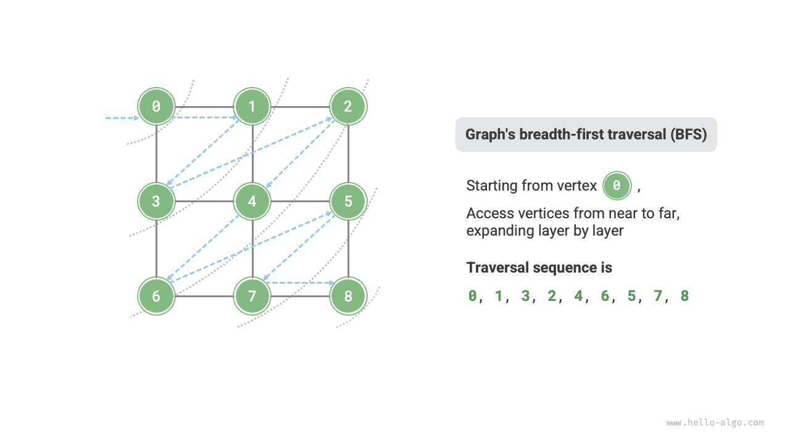

### Реализация алгоритма

BFS обычно реализуется с помощью очереди, код приведен ниже. Очередь обладает свойством "первым пришел - первым вышел", что хорошо соответствует идее BFS "от близкого к далекому".

1. Поместить стартовую вершину обхода `startVet` в очередь и запустить цикл.
2. На каждой итерации цикла извлекать вершину из головы очереди и записывать факт ее посещения, после чего добавлять все смежные вершины этой вершины в хвост очереди.
3. Повторять шаг `2.` до тех пор, пока не будут посещены все вершины.

Чтобы предотвратить повторный обход вершин, нам нужен хеш-набор `visited` , в котором будет записываться, какие узлы уже посещены.

!!! tip

    Хеш-набор можно рассматривать как хеш-таблицу, которая хранит только `key` и не хранит `value` . Он позволяет выполнять добавление, удаление, поиск и изменение `key` за $O(1)$ времени. Благодаря уникальности `key` хеш-набор обычно используется, например, для устранения повторов.

```src
[file]{graph_bfs}-[class]{}-[func]{graph_bfs}
```

Код сравнительно абстрактен, поэтому рекомендуется сверяться с рисунками ниже для лучшего понимания.

=== "<1>"
    

=== "<2>"
    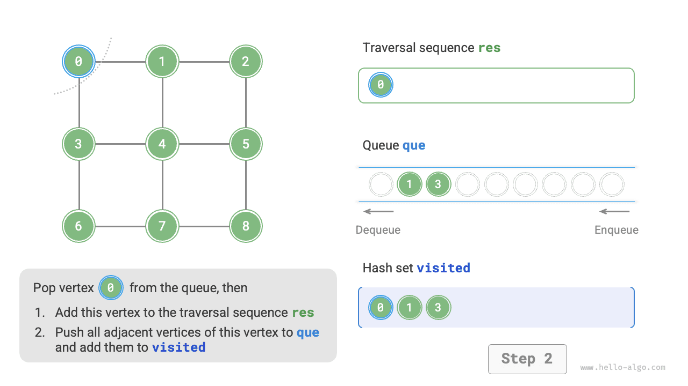

=== "<3>"
    

=== "<4>"
    

=== "<5>"
    

=== "<6>"
    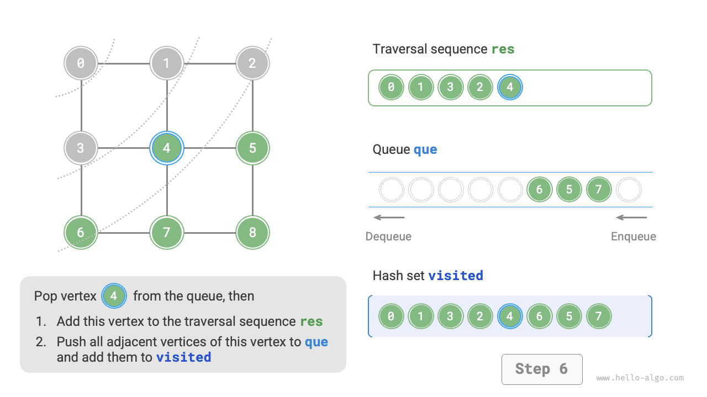

=== "<7>"
    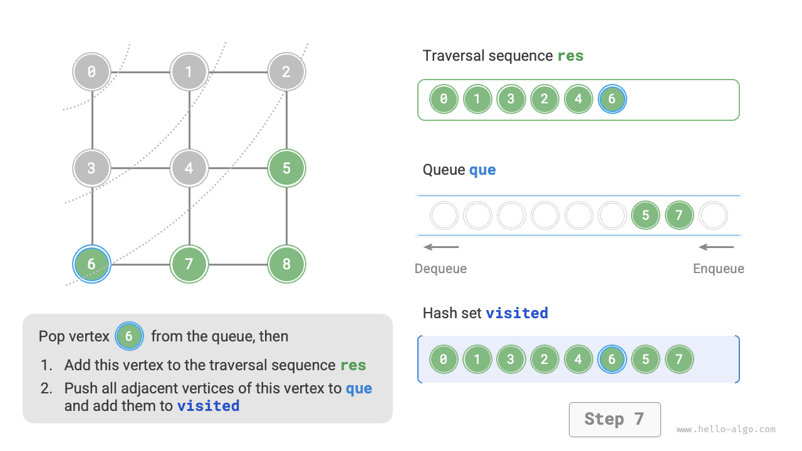

=== "<8>"
    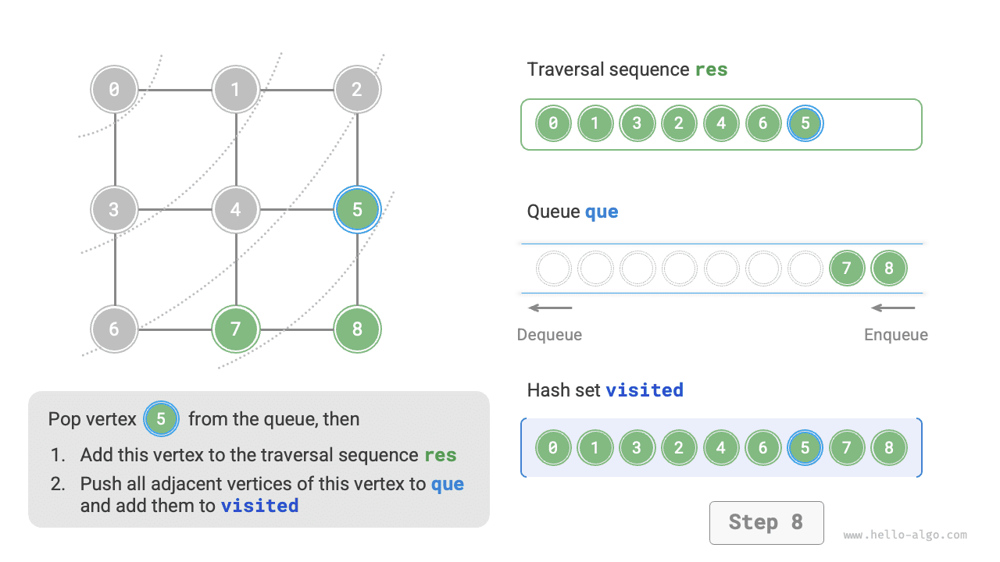

=== "<9>"
    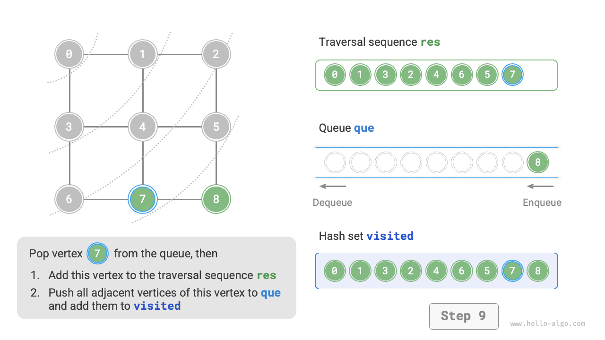

=== "<10>"
    

=== "<11>"
    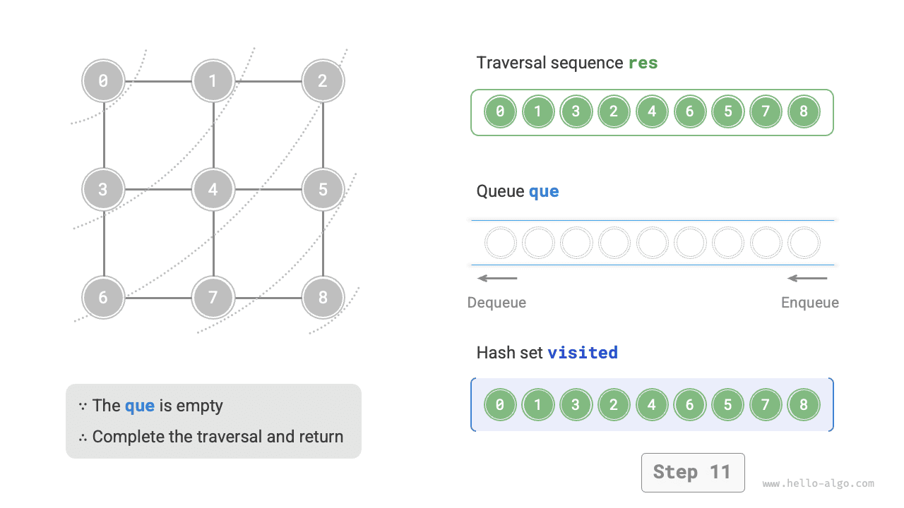

!!! question "Является ли последовательность обхода в ширину единственной?"

    Нет. Обход в ширину требует только соблюдения порядка "от близкого к далекому", **а порядок обхода нескольких вершин на одинаковом расстоянии может произвольно меняться**. Например, на рисунке выше можно поменять местами порядок посещения вершин $1$ и $3$ , а также в произвольном порядке переставить вершины $2$, $4$, $6$ .

### Анализ сложности

**Временная сложность**: все вершины по одному разу помещаются в очередь и извлекаются из нее, что требует $O(|V|)$ времени; при обходе смежных вершин, поскольку граф неориентированный, все ребра будут посещены по $2$ раза, что требует $O(2|E|)$ времени; в сумме получается $O(|V| + |E|)$ .

**Пространственная сложность**: список `res` , хеш-набор `visited` и очередь `que` в худшем случае могут содержать до $|V|$ вершин, поэтому требуется $O(|V|)$ памяти.

## Обход в глубину

**Обход в глубину - это способ обхода, при котором сначала идут до самого конца, а когда дальше идти нельзя, откатываются назад**. Как показано на рисунке ниже, начиная с вершины в левом верхнем углу, мы выбираем некоторую смежную вершину текущей вершины, идем до упора, затем возвращаемся назад, снова идем до упора и так далее, пока не будут посещены все вершины.


### Реализация алгоритма

Такой алгоритмический шаблон "дойти до конца и вернуться" обычно реализуется через рекурсию. Подобно обходу в ширину, в обходе в глубину мы также используем хеш-набор `visited` для записи уже посещенных вершин и тем самым избегаем повторного посещения.

```src
[file]{graph_dfs}-[class]{}-[func]{graph_dfs}
```

Алгоритмический процесс обхода в глубину показан на рисунках ниже.

- **Прямая пунктирная линия обозначает нисходящее рекурсивное развертывание** , то есть запуск нового рекурсивного метода для посещения новой вершины.
- **Изогнутая пунктирная линия обозначает обратный возврат по рекурсии** , то есть данный рекурсивный метод завершился и управление вернулось туда, откуда он был вызван.

Чтобы лучше понять алгоритм, рекомендуется совместить рисунки ниже с кодом и мысленно проследить весь процесс DFS, включая моменты запуска и возврата каждого рекурсивного вызова.

=== "<1>"
    

=== "<2>"
    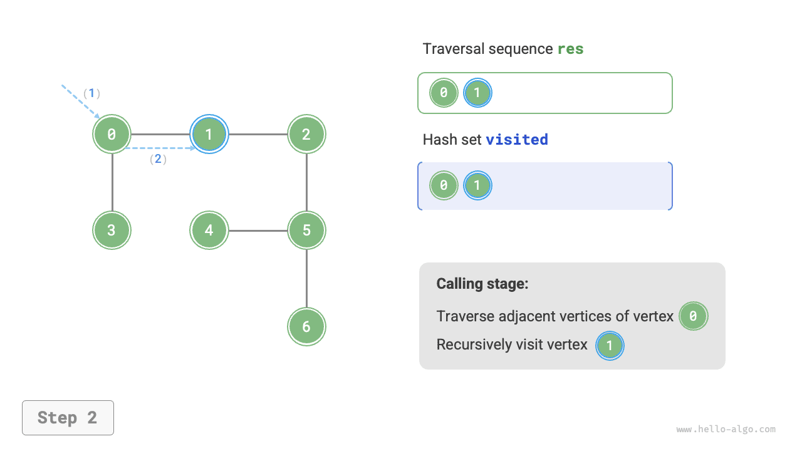

=== "<3>"
    

=== "<4>"
    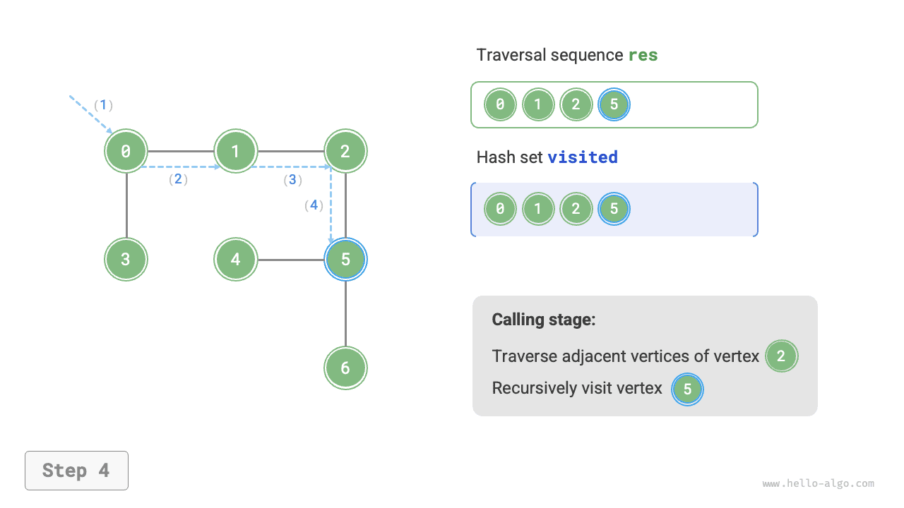

=== "<5>"
    

=== "<6>"
    

=== "<7>"
    

=== "<8>"
    

=== "<9>"
    

=== "<10>"
    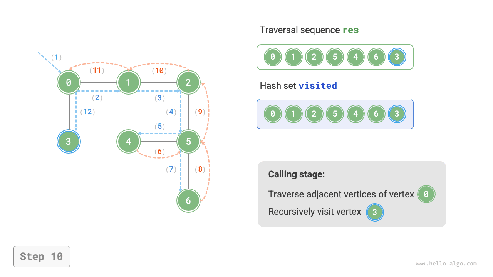

=== "<11>"
    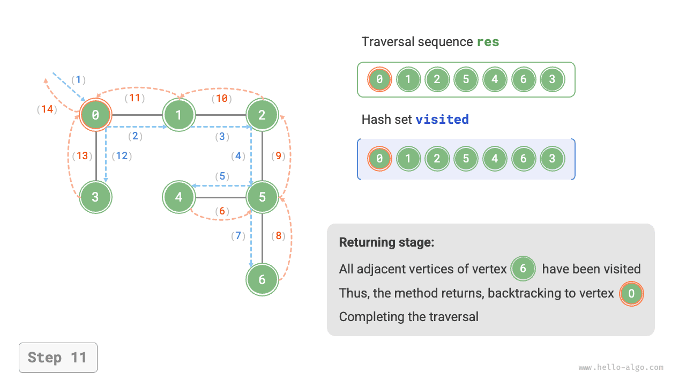

!!! question "Является ли последовательность обхода в глубину единственной?"

    Как и в случае обхода в ширину, последовательность DFS тоже не является единственной. Для заданной вершины допустимо сначала углубиться в любое направление, то есть порядок смежных вершин может быть произвольным, и все такие варианты будут корректными обходами в глубину.
    
    Если взять в качестве примера обход дерева, то варианты "корень $\rightarrow$ лево $\rightarrow$ право", "лево $\rightarrow$ корень $\rightarrow$ право" и "лево $\rightarrow$ право $\rightarrow$ корень" соответствуют прямому, симметричному и обратному обходам соответственно. Они показывают три разных приоритета обхода, но все они относятся к обходу в глубину.

### Анализ сложности

**Временная сложность**: все вершины будут посещены по $1$ разу, что требует $O(|V|)$ времени; все ребра будут посещены по $2$ раза, что требует $O(2|E|)$ времени; суммарно получается $O(|V| + |E|)$ .

**Пространственная сложность**: число вершин в списке `res` и хеш-наборе `visited` в худшем случае достигает $|V|$ , максимальная глубина рекурсии тоже равна $|V|$ , поэтому требуется $O(|V|)$ памяти.
