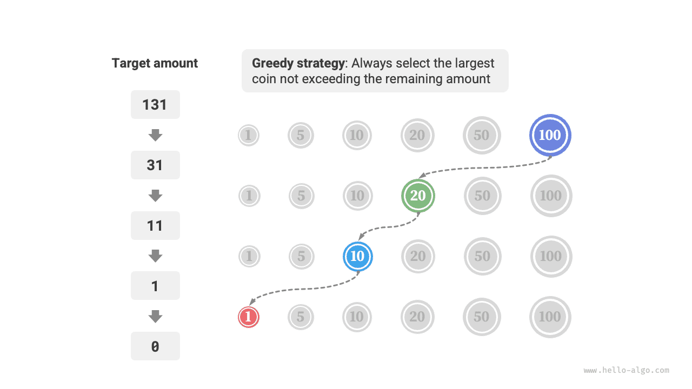

# Жадный алгоритм

<u>Жадный алгоритм (greedy algorithm)</u> - это распространенный подход к решению задач оптимизации. Его основная идея состоит в том, чтобы на каждом этапе принятия решения выбирать вариант, который выглядит наилучшим прямо сейчас, то есть жадно принимать локально оптимальные решения в надежде получить глобально оптимальный результат. Жадные алгоритмы лаконичны и эффективны, поэтому широко применяются во многих практических задачах.

Жадные алгоритмы и динамическое программирование часто используются для решения задач оптимизации. У них есть некоторое сходство, например оба опираются на свойство оптимальной подструктуры, но принципы работы различаются.

- Динамическое программирование учитывает все решения предыдущих этапов при выборе текущего решения и использует ответы для прошлых подзадач, чтобы построить ответ для текущей подзадачи.
- Жадный алгоритм не учитывает прошлые решения, а просто движется вперед, каждый раз делая жадный выбор, постепенно сужая область задачи, пока она не будет решена.

Сначала разберем принцип работы жадного алгоритма на примере задачи «размен монет». Эта задача уже встречалась в разделе «задача о полном рюкзаке», поэтому она наверняка вам знакома.

!!! question

    Дано $n$ видов монет. Номинал монеты $i$ равен $coins[i - 1]$, целевая сумма равна $amt$, причем каждую монету можно брать неограниченное число раз. Требуется найти минимальное число монет, которыми можно набрать целевую сумму. Если набрать сумму невозможно, верните $-1$.

Жадная стратегия для этой задачи показана на рисунке ниже. Для заданной целевой суммы **мы жадно выбираем монету, которая не превышает ее и находится к ней ближе всего**, и повторяем этот шаг, пока не получим нужную сумму.



Код реализации выглядит следующим образом:

```src
[file]{coin_change_greedy}-[class]{}-[func]{coin_change_greedy}
```

У вас может невольно вырваться: So clean! Жадный алгоритм решает задачу размена монет всего примерно десятью строками кода.

## Преимущества и ограничения жадного алгоритма

**Жадный алгоритм не только прост в действиях и реализации, но и обычно очень эффективен**. В приведенном выше коде обозначим минимальный номинал монеты через $\min(coins)$, тогда жадный выбор выполняется не более чем $amt / \min(coins)$ раз, а временная сложность равна $O(amt / \min(coins))$. Это на порядок меньше, чем временная сложность решения через динамическое программирование $O(n \times amt)$.

Однако **для некоторых наборов номиналов монет жадный алгоритм не может найти оптимальный ответ**. Ниже показаны два примера.

- **Положительный пример $coins = [1, 5, 10, 20, 50, 100]$**: для такого набора монет при любом $amt$ жадный алгоритм находит оптимальное решение.
- **Отрицательный пример $coins = [1, 20, 50]$**: пусть $amt = 60$. Жадный алгоритм найдет только комбинацию $50 + 1 \times 10$, то есть всего $11$ монет, тогда как динамическое программирование находит оптимум $20 + 20 + 20$, где требуется лишь $3$ монеты.
- **Отрицательный пример $coins = [1, 49, 50]$**: пусть $amt = 98$. Жадный алгоритм найдет только комбинацию $50 + 1 \times 48$, то есть всего $49$ монет, тогда как динамическое программирование находит оптимум $49 + 49$, где требуется лишь $2$ монеты.


Иными словами, в задаче о размене монет жадный алгоритм не гарантирует нахождение глобально оптимального решения и иногда может приводить к очень плохому ответу. Для этой задачи больше подходит динамическое программирование.

В общем случае жадный алгоритм применим в двух следующих ситуациях.

1. **Можно гарантировать нахождение оптимального решения**: в таком случае жадный алгоритм часто является лучшим выбором, поскольку обычно он эффективнее, чем поиск с возвратом и динамическое программирование.
2. **Можно найти приближенно оптимальное решение**: в таком случае жадный алгоритм тоже полезен. Для многих сложных задач поиск глобального оптимума очень труден, и возможность быстро найти субоптимальный ответ уже весьма ценна.

## Свойства жадного алгоритма

Тогда возникает вопрос: какие задачи подходят для решения жадным алгоритмом? Или, другими словами, в каких случаях жадный алгоритм может гарантировать оптимальный ответ?

По сравнению с динамическим программированием условия применения жадного алгоритма строже. В основном нас интересуют два свойства задачи.

- **Свойство жадного выбора**: только когда локально оптимальный выбор всегда может привести к глобально оптимальному решению, жадный алгоритм способен гарантировать оптимум.
- **Оптимальная подструктура**: оптимальное решение исходной задачи содержит оптимальные решения подзадач.

Оптимальная подструктура уже обсуждалась в главе «Динамическое программирование», поэтому здесь не будем повторяться. Стоит отметить, что у некоторых задач оптимальная подструктура не столь очевидна, но их все равно можно решать жадным алгоритмом.

Основное внимание мы уделяем тому, как определить свойство жадного выбора. Хотя формулировка выглядит довольно простой, **на практике для многих задач доказать свойство жадного выбора совсем не легко**.

Например, в задаче о размене монет легко привести контрпример и опровергнуть свойство жадного выбора, но вот доказать его истинность намного сложнее. Если спросить: **для каких наборов монет можно использовать жадный алгоритм**? - обычно удается дать лишь интуитивный или примерный ответ, а не строгое математическое доказательство.

!!! quote

    Существует статья, в которой приводится алгоритм со временной сложностью $O(n^3)$ для определения того, можно ли с помощью жадного алгоритма находить оптимальный размен для любой суммы в заданной системе монет.

    Pearson, D. A polynomial-time algorithm for the change-making problem[J]. Operations Research Letters, 2005, 33(3): 231-234.

## Этапы решения задач жадным алгоритмом

В общем виде процесс решения жадной задачи можно разбить на три шага.

1. **Анализ задачи**: разобраться в свойствах задачи, включая определение состояний, целевой функции и ограничений. Этот этап присутствует и в поиске с возвратом, и в динамическом программировании.
2. **Определение жадной стратегии**: определить, какой жадный выбор следует делать на каждом шаге. Эта стратегия должна уменьшать размер задачи на каждом этапе и в итоге привести к решению всей задачи.
3. **Доказательство корректности**: обычно требуется доказать, что задача обладает свойством жадного выбора и оптимальной подструктурой. На этом этапе может понадобиться математическое доказательство, например индукция или доказательство от противного.

Определение жадной стратегии - это ключевой этап решения, но на практике он часто оказывается непростым по следующим причинам.

- **Жадные стратегии для разных задач сильно различаются**. Для многих задач стратегия довольно очевидна, и до нее можно дойти за счет общих рассуждений и нескольких проб. Но в более сложных задачах жадная стратегия может быть очень скрытой, и тут уже многое зависит от опыта решения задач и алгоритмической подготовки.
- **Некоторые жадные стратегии выглядят убедительно, но оказываются обманчивыми**. Бывает, что мы с уверенностью придумали жадную стратегию, написали код и отправили его на проверку, а часть тестов не проходит. Причина в том, что спроектированная стратегия лишь «частично верна», и описанная выше задача о размене монет - типичный пример.

Чтобы гарантировать корректность, нужно дать строгое математическое доказательство жадной стратегии, **обычно с использованием доказательства от противного или математической индукции**.

Однако и доказательство корректности может оказаться непростой задачей. Если идей нет, мы обычно начинаем отлаживать код на тестовых примерах, постепенно меняя и проверяя жадную стратегию.

## Типичные задачи для жадного алгоритма

Жадные алгоритмы часто применяются в задачах оптимизации, которые обладают свойством жадного выбора и оптимальной подструктурой. Ниже приведены некоторые типичные задачи, решаемые жадным подходом.

- **Задача о размене монет**: при некоторых системах монет жадный алгоритм всегда дает оптимальный ответ.
- **Задача о расписании интервалов**: пусть есть несколько задач, каждая выполняется в некотором временном интервале, и требуется завершить как можно больше задач. Если каждый раз выбирать задачу с самым ранним временем окончания, то жадный алгоритм дает оптимальный ответ.
- **Задача о дробном рюкзаке**: дана группа предметов и грузоподъемность. Требуется выбрать предметы так, чтобы их общий вес не превышал ограничение, а общая ценность была максимальной. Если каждый раз выбирать предмет с наилучшим отношением стоимости к весу, то в некоторых случаях жадный алгоритм дает оптимальный ответ.
- **Задача о покупке и продаже акций**: дана история цен акции. Можно совершать несколько сделок, но если акция уже куплена, то до продажи покупать снова нельзя. Цель - получить максимальную прибыль.
- **Код Хаффмана**: это жадный алгоритм для сжатия данных без потерь. Построив дерево Хаффмана и каждый раз объединяя два узла с наименьшей частотой, мы получаем дерево с минимальной взвешенной длиной пути, то есть минимальной длиной кодирования.
- **Алгоритм Дейкстры**: это жадный алгоритм решения задачи о кратчайших путях от заданной исходной вершины до всех остальных вершин.
