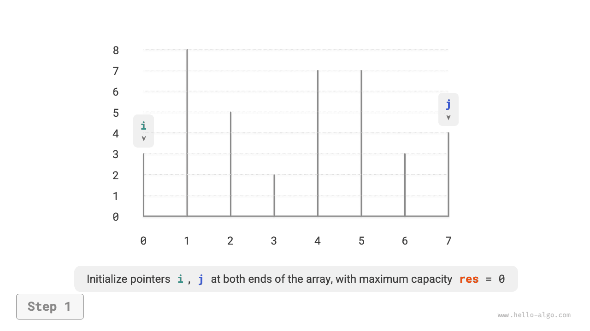
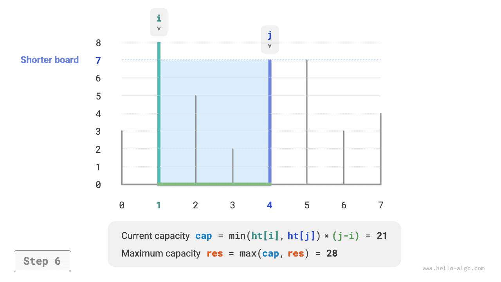
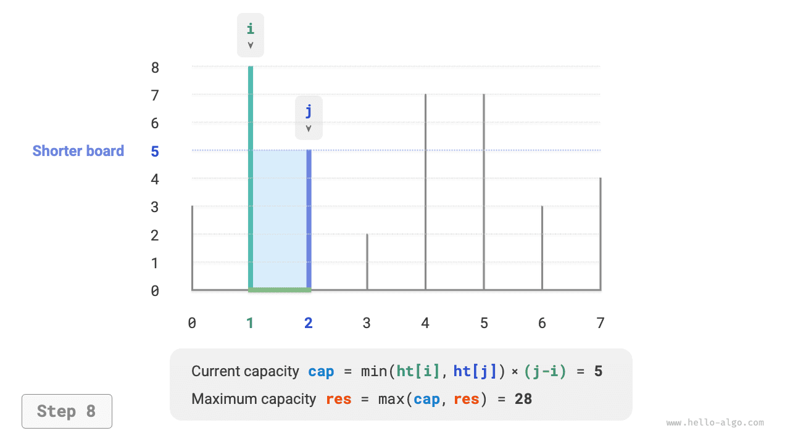
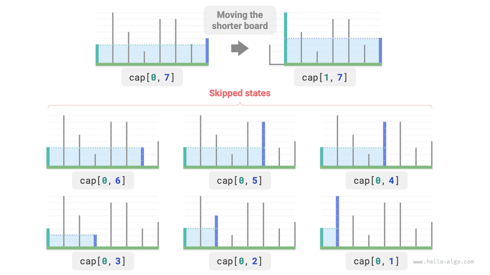

# Задача о максимальной вместимости

!!! question

    Дан массив $ht$, где каждый элемент обозначает высоту вертикальной перегородки. Любые две перегородки в массиве вместе с пространством между ними образуют контейнер.
    
    Вместимость контейнера равна произведению высоты и ширины (площади), где высота определяется более короткой перегородкой, а ширина - разностью индексов двух перегородок в массиве.
    
    Требуется выбрать две перегородки так, чтобы образованный ими контейнер имел максимальную вместимость. Пример показан на рисунке ниже.


Контейнер образуется произвольными двумя перегородками, **поэтому состоянием задачи служит пара индексов этих перегородок, обозначим ее как $[i, j]$**.

Согласно условию, вместимость равна произведению высоты на ширину, где высота определяется короткой перегородкой, а ширина - разностью индексов двух перегородок. Обозначим вместимость через $cap[i, j]$, тогда формула принимает вид:

$$
cap[i, j] = \min(ht[i], ht[j]) \times (j - i)
$$

Пусть длина массива равна $n$. Тогда число пар перегородок, то есть общее число состояний, равно $C_n^2 = \frac{n(n - 1)}{2}$. Самый прямолинейный подход - **перебрать все состояния**, после чего найти максимальную вместимость. Его временная сложность равна $O(n^2)$.

### Определение жадной стратегии

У этой задачи есть и более эффективное решение. Как показано на рисунке ниже, рассмотрим состояние $[i, j]$, где индексы удовлетворяют $i < j$, а высоты - условию $ht[i] < ht[j]$, то есть $i$ - короткая перегородка, а $j$ - длинная.


Как показано на рисунке ниже, **если в этот момент сдвинуть длинную перегородку $j$ ближе к короткой перегородке $i$, то вместимость обязательно уменьшится**.

Причина в том, что после смещения длинной перегородки $j$ ширина $j-i$ обязательно станет меньше, а высота определяется короткой перегородкой, поэтому высота либо останется прежней (если $i$ останется короткой перегородкой), либо уменьшится (если сдвинутая $j$ станет короткой перегородкой).


Рассуждая в обратную сторону, **только сдвигая короткую перегородку $i$ внутрь, мы можем получить шанс увеличить вместимость**. Хотя ширина при этом обязательно уменьшится, **высота может возрасти** (если после перемещения короткая перегородка $i$ станет выше). Например, на рисунке ниже после перемещения короткой перегородки площадь увеличивается.


Отсюда и выводится жадная стратегия для этой задачи: инициализировать два указателя по краям контейнера и на каждом шаге сдвигать внутрь указатель, соответствующий короткой перегородке, пока указатели не встретятся.

На рисунках ниже показан процесс выполнения этой жадной стратегии.

1. В начальном состоянии указатели $i$ и $j$ стоят на двух концах массива.
2. Вычислить вместимость текущего состояния $cap[i, j]$ и обновить максимальную вместимость.
3. Сравнить высоты перегородок $i$ и $j$, после чего сдвинуть короткую перегородку на одну позицию внутрь.
4. Повторять шаги `2.` и `3.` до тех пор, пока $i$ и $j$ не встретятся.

=== "<1>"
    

=== "<2>"
    

=== "<3>"
    

=== "<4>"
    

=== "<5>"
    

=== "<6>"
    

=== "<7>"
    

=== "<8>"
    

=== "<9>"
    

### Код реализации

Цикл в коде выполняется не более $n$ раз, **поэтому временная сложность равна $O(n)$**.

Переменные $i$, $j$, $res$ используют дополнительную память постоянного размера, **поэтому пространственная сложность равна $O(1)$**.

```src
[file]{max_capacity}-[class]{}-[func]{max_capacity}
```

### Доказательство корректности

Жадный алгоритм быстрее полного перебора именно потому, что каждый жадный шаг «пропускает» часть состояний.

Например, в состоянии $cap[i, j]$ перегородка $i$ является короткой, а $j$ - длинной. Если жадно сдвинуть короткую перегородку $i$ на одну позицию внутрь, то состояния, показанные на рисунке ниже, будут «пропущены». **Это означает, что позже мы уже не сможем проверить вместимость этих состояний**.

$$
cap[i, i+1], cap[i, i+2], \dots, cap[i, j-2], cap[i, j-1]
$$



Нетрудно заметить, что **эти пропущенные состояния на самом деле и есть все состояния, в которых длинная перегородка $j$ сдвигается внутрь**. Ранее мы уже доказали, что перемещение длинной перегородки внутрь обязательно уменьшает вместимость. Иными словами, пропущенные состояния не могут быть оптимальным решением, **поэтому их пропуск не приводит к потере оптимума**.

Приведенный анализ показывает, что операция перемещения короткой перегородки является «безопасной», а жадная стратегия действительно эффективна.
