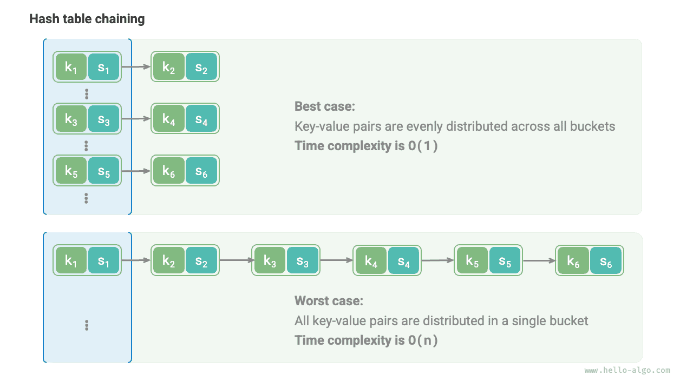

# Алгоритмы хеширования

В двух предыдущих разделах мы рассмотрели принципы работы хеш-таблицы и способы обработки хеш-коллизий. Однако и открытая адресация, и метод цепочек **лишь позволяют хеш-таблице корректно работать при возникновении коллизий, но не уменьшают вероятность появления самих коллизий**.

Если хеш-коллизии происходят слишком часто, производительность хеш-таблицы резко деградирует. Как показано на рисунке ниже, для хеш-таблицы с методом цепочек в идеальном случае пары ключ-значение равномерно распределены по всем бакетам, и это дает наилучшую эффективность поиска; в худшем же случае все пары ключ-значение оказываются в одном бакете, и временная сложность вырождается до $O(n)$ .



**Распределение пар ключ-значение определяется хеш-функцией**. Вспомним этапы вычисления хеш-функции: сначала вычисляется хеш-значение, затем оно берется по модулю длины массива:

```shell
index = hash(key) % capacity
```

Из этой формулы видно: при фиксированной емкости хеш-таблицы `capacity` **выходное значение определяет именно хеш-алгоритм `hash()` **, а значит, именно он определяет распределение пар ключ-значение в хеш-таблице.

Это означает, что для уменьшения вероятности хеш-коллизий нам следует сосредоточиться на проектировании хеш-алгоритма `hash()` .

## Цели хеш-алгоритма

Чтобы получить структуру данных хеш-таблицы, которая будет одновременно "быстрой и надежной", хеш-алгоритм должен обладать следующими свойствами.

- **Детерминированность**: для одинакового входа хеш-алгоритм всегда должен выдавать одинаковый результат. Только так хеш-таблица остается надежной.
- **Высокая эффективность**: вычисление хеш-значения должно быть достаточно быстрым. Чем меньше вычислительные затраты, тем выше практическая ценность хеш-таблицы.
- **Равномерное распределение**: хеш-алгоритм должен стараться распределять пары ключ-значение в хеш-таблице равномерно. Чем равномернее распределение, тем ниже вероятность хеш-коллизий.

На практике хеш-алгоритмы используются не только для реализации хеш-таблиц, но и во многих других областях.

- **Хранение паролей**: чтобы защищать пароли пользователей, система обычно хранит не сами пароли в открытом виде, а их хеш-значения. Когда пользователь вводит пароль, система вычисляет хеш-значение введенного пароля и сравнивает его с сохраненным значением. Если они совпадают, пароль считается правильным.
- **Проверка целостности данных**: отправитель может вычислить хеш-значение данных и отправить его вместе с самими данными; получатель затем вычисляет хеш-значение повторно и сравнивает его с полученным. Если они совпадают, данные считаются целостными.

Для приложений, связанных с криптографией, чтобы не допустить восстановления исходного пароля по хеш-значению и иных форм обратного анализа, хеш-алгоритм должен обладать более строгими свойствами безопасности.

- **Односторонность**: по хеш-значению нельзя восстановить какую-либо информацию о входных данных.
- **Устойчивость к коллизиям**: должно быть крайне трудно найти два разных входа, имеющих одинаковое хеш-значение.
- **Эффект лавины**: даже небольшое изменение во входных данных должно приводить к заметному и непредсказуемому изменению результата.

Обрати внимание: **"равномерное распределение" и "устойчивость к коллизиям" - это два независимых понятия** , и выполнение первого не означает автоматического выполнения второго. Например, при случайном распределении входных `key` хеш-функция `key % 100` может выдавать достаточно равномерное распределение. Однако этот хеш-алгоритм слишком прост: все `key` с одинаковыми двумя последними цифрами будут иметь одинаковый результат, а значит, по хеш-значению можно легко подобрать подходящие `key` и, например, взломать пароль.

## Проектирование хеш-алгоритма

Разработка хеш-алгоритма - это сложная задача, в которой нужно учитывать множество факторов. Однако для некоторых нетребовательных сценариев мы можем спроектировать и несколько простых хеш-алгоритмов.

- **Аддитивный хеш**: складываем ASCII-коды всех символов входной строки и используем полученную сумму как хеш-значение.
- **Мультипликативный хеш**: используем "некоррелированность" умножения; на каждом шаге умножаем текущее значение на константу и добавляем ASCII-код очередного символа.
- **XOR-хеш**: последовательно накапливаем элементы входных данных в одном хеш-значении через операцию XOR.
- **Ротационный хеш**: последовательно накапливаем ASCII-коды символов, причем перед каждым накоплением выполняем циклический сдвиг хеш-значения.

```src
[file]{simple_hash}-[class]{}-[func]{rot_hash}
```

Нетрудно заметить, что последний шаг каждого из этих хеш-алгоритмов - взятие по модулю большого простого числа $1000000007$ , чтобы гарантировать, что хеш-значение остается в разумных границах. Стоит задуматься: почему подчеркивается именно взятие по модулю простого числа, и какие недостатки возникают при использовании составного модуля? Это интересный вопрос.

Сначала дадим вывод: **использование большого простого числа в качестве модуля позволяет в максимальной степени обеспечивать равномерное распределение хеш-значений**. Поскольку простое число не имеет общих делителей с другими числами, это помогает уменьшить периодические закономерности, возникающие из-за операции взятия остатка, и тем самым снизить число хеш-коллизий.

Рассмотрим пример. Предположим, мы выбрали составное число $9$ в качестве модуля. Оно делится на $3$ , поэтому все `key` , которые делятся на $3$ , будут отображаться только в три хеш-значения: $0$ , $3$ , $6$ .

$$
\begin{aligned}
\text{modulus} & = 9 \newline
\text{key} & = \{ 0, 3, 6, 9, 12, 15, 18, 21, 24, 27, 30, 33, \dots \} \newline
\text{hash} & = \{ 0, 3, 6, 0, 3, 6, 0, 3, 6, 0, 3, 6,\dots \}
\end{aligned}
$$

Если входные `key` как раз удовлетворяют такому распределению в виде арифметической прогрессии, то хеш-значения начнут скучиваться, а это усугубит хеш-коллизии. Теперь предположим, что мы заменили `modulus` на простое число $13$ ; поскольку между `key` и `modulus` нет общих делителей, равномерность распределения хеш-значений заметно улучшится.

$$
\begin{aligned}
\text{modulus} & = 13 \newline
\text{key} & = \{ 0, 3, 6, 9, 12, 15, 18, 21, 24, 27, 30, 33, \dots \} \newline
\text{hash} & = \{ 0, 3, 6, 9, 12, 2, 5, 8, 11, 1, 4, 7, \dots \}
\end{aligned}
$$

Следует отметить: если можно гарантировать, что `key` распределены случайно и равномерно, то выбор простого или составного числа в качестве модуля не так важен - оба варианта способны дать равномерное распределение хеш-значений. Но если в распределении `key` присутствует периодичность, то взятие по модулю составного числа гораздо легче приводит к кластеризации.

Итак, на практике мы обычно выбираем простое число в качестве модуля, причем это простое число желательно брать достаточно большим, чтобы по возможности убрать периодические закономерности и повысить устойчивость хеш-алгоритма.

## Распространенные хеш-алгоритмы

Нетрудно заметить, что описанные выше простые хеш-алгоритмы довольно "хрупкие" и далеки от поставленных целей. Например, сложение и XOR подчиняются коммутативному закону, поэтому аддитивный хеш и XOR-хеш не различают строки, состоящие из одних и тех же символов, но в разном порядке. Это может усиливать хеш-коллизии и даже создавать некоторые проблемы безопасности.

На практике мы обычно используем стандартные хеш-алгоритмы, такие как MD5, SHA-1, SHA-2 и SHA-3. Они могут отображать входные данные произвольной длины в хеш-значения фиксированной длины.

На протяжении почти ста лет хеш-алгоритмы непрерывно развивались и оптимизировались. Одни исследователи старались повысить их производительность, а другие исследователи и хакеры сосредоточивались на поиске уязвимостей в их безопасности. В таблице ниже приведены распространенные хеш-алгоритмы, которые часто встречаются в реальных приложениях.

- MD5 и SHA-1 уже многократно были успешно атакованы, поэтому они выведены из большинства сценариев, где требуется безопасность.
- SHA-256 из семейства SHA-2 является одним из самых надежных хеш-алгоритмов; на сегодняшний день не известно успешных практических атак, поэтому он широко используется в самых разных протоколах и системах безопасности.
- SHA-3 по сравнению с SHA-2 требует меньших затрат на реализацию и обеспечивает более высокую вычислительную эффективность, но на данный момент распространен слабее, чем семейство SHA-2.

<p align="center"> Таблица <id> &nbsp; Распространенные хеш-алгоритмы </p>

|          | MD5                            | SHA-1            | SHA-2                        | SHA-3               |
| -------- | ------------------------------ | ---------------- | ---------------------------- | ------------------- |
| Год появления | 1992                           | 1995             | 2002                         | 2008                |
| Длина вывода | 128 bit                        | 160 bit          | 256/512 bit                  | 224/256/384/512 bit |
| Хеш-коллизии | Частые                         | Частые           | Редкие                       | Редкие              |
| Уровень безопасности | Низкий, успешно атакован | Низкий, успешно атакован | Высокий               | Высокий             |
| Применение | Устарел, но еще используется для проверки целостности данных | Устарел         | Проверка криптовалютных транзакций, цифровые подписи и т. д. | Может использоваться как замена SHA-2    |

## Хеш-значения структур данных

Мы знаем, что `key` в хеш-таблице могут быть целыми числами, вещественными числами, строками и другими типами данных. Языки программирования обычно предоставляют встроенные хеш-алгоритмы для этих типов, чтобы вычислять индексы бакетов в хеш-таблице. Возьмем Python: в нем можно вызвать функцию `hash()` , чтобы вычислить хеш-значения для различных типов данных.

- Хеш-значение целого числа и булева значения совпадает с самим значением.
- Вычисление хеш-значений для вещественных чисел и строк устроено сложнее; интересующиеся читатели могут изучить это самостоятельно.
- Хеш-значение кортежа получается путем хеширования каждого элемента, а затем объединения этих хеш-значений в одно итоговое значение.
- Хеш-значение объекта обычно строится на основе его адреса в памяти. Если переопределить метод хеширования объекта, можно реализовать вычисление хеша по содержимому.

!!! tip

    Обрати внимание: определения и способы вычисления встроенных хеш-значений в разных языках программирования отличаются.

=== "Python"

    ```python title="built_in_hash.py"
    num = 3
    hash_num = hash(num)
    # Хеш-значение целого числа 3 равно 3

    bol = True
    hash_bol = hash(bol)
    # Хеш-значение булевого значения True равно 1

    dec = 3.14159
    hash_dec = hash(dec)
    # Хеш-значение числа 3.14159 равно 326484311674566659

    str = "Hello Algo"
    hash_str = hash(str)
    # Хеш-значение строки "Hello Algo" равно 4617003410720528961

    tup = (12836, "Сяо Ха")
    hash_tup = hash(tup)
    # Хеш-значение кортежа (12836, "Сяо Ха") равно 1029005403108185979

    obj = ListNode(0)
    hash_obj = hash(obj)
    # Хеш-значение объекта узла <ListNode object at 0x1058fd810> равно 274267521
    ```

=== "C++"

    ```cpp title="built_in_hash.cpp"
    int num = 3;
    size_t hashNum = hash<int>()(num);
    // Хеш-значение целого числа 3 равно 3

    bool bol = true;
    size_t hashBol = hash<bool>()(bol);
    // Хеш-значение булевого значения 1 равно 1

    double dec = 3.14159;
    size_t hashDec = hash<double>()(dec);
    // Хеш-значение числа 3.14159 равно 4614256650576692846

    string str = "Hello Algo";
    size_t hashStr = hash<string>()(str);
    // Хеш-значение строки "Hello Algo" равно 15466937326284535026

    // В C++ встроенный std::hash() предоставляет вычисление хеша только для базовых типов данных
    // Для массивов и объектов хеш-значение обычно приходится реализовывать самостоятельно
    ```

=== "Java"

    ```java title="built_in_hash.java"
    int num = 3;
    int hashNum = Integer.hashCode(num);
    // Хеш-значение целого числа 3 равно 3

    boolean bol = true;
    int hashBol = Boolean.hashCode(bol);
    // Хеш-значение булевого значения true равно 1231

    double dec = 3.14159;
    int hashDec = Double.hashCode(dec);
    // Хеш-значение числа 3.14159 равно -1340954729

    String str = "Hello Algo";
    int hashStr = str.hashCode();
    // Хеш-значение строки "Hello Algo" равно -727081396

    Object[] arr = { 12836, "Сяо Ха" };
    int hashTup = Arrays.hashCode(arr);
    // Хеш-значение массива [12836, Сяо Ха] равно 1151158

    ListNode obj = new ListNode(0);
    int hashObj = obj.hashCode();
    // Хеш-значение объекта узла utils.ListNode@7dc5e7b4 равно 2110121908
    ```

=== "C#"

    ```csharp title="built_in_hash.cs"
    int num = 3;
    int hashNum = num.GetHashCode();
    // Хеш-значение целого числа 3 равно 3;

    bool bol = true;
    int hashBol = bol.GetHashCode();
    // Хеш-значение булевого значения true равно 1;

    double dec = 3.14159;
    int hashDec = dec.GetHashCode();
    // Хеш-значение числа 3.14159 равно -1340954729;

    string str = "Hello Algo";
    int hashStr = str.GetHashCode();
    // Хеш-значение строки "Hello Algo" равно -586107568;

    object[] arr = [12836, "Сяо Ха"];
    int hashTup = arr.GetHashCode();
    // Хеш-значение массива [12836, Сяо Ха] равно 42931033;

    ListNode obj = new(0);
    int hashObj = obj.GetHashCode();
    // Хеш-значение объекта узла 0 равно 39053774;
    ```

=== "Go"

    ```go title="built_in_hash.go"
    // В Go нет встроенной функции hash code
    ```

=== "Swift"

    ```swift title="built_in_hash.swift"
    let num = 3
    let hashNum = num.hashValue
    // Хеш-значение целого числа 3 равно 9047044699613009734

    let bol = true
    let hashBol = bol.hashValue
    // Хеш-значение булевого значения true равно -4431640247352757451

    let dec = 3.14159
    let hashDec = dec.hashValue
    // Хеш-значение числа 3.14159 равно -2465384235396674631

    let str = "Hello Algo"
    let hashStr = str.hashValue
    // Хеш-значение строки "Hello Algo" равно -7850626797806988787

    let arr = [AnyHashable(12836), AnyHashable("Сяо Ха")]
    let hashTup = arr.hashValue
    // Хеш-значение массива [AnyHashable(12836), AnyHashable("Сяо Ха")] равно -2308633508154532996

    let obj = ListNode(x: 0)
    let hashObj = obj.hashValue
    // Хеш-значение объекта узла utils.ListNode равно -2434780518035996159
    ```

=== "JS"

    ```javascript title="built_in_hash.js"
    // В JavaScript нет встроенной функции hash code
    ```

=== "TS"

    ```typescript title="built_in_hash.ts"
    // В TypeScript нет встроенной функции hash code
    ```

=== "Dart"

    ```dart title="built_in_hash.dart"
    int num = 3;
    int hashNum = num.hashCode;
    // Хеш-значение целого числа 3 равно 34803

    bool bol = true;
    int hashBol = bol.hashCode;
    // Хеш-значение булевого значения true равно 1231

    double dec = 3.14159;
    int hashDec = dec.hashCode;
    // Хеш-значение числа 3.14159 равно 2570631074981783

    String str = "Hello Algo";
    int hashStr = str.hashCode;
    // Хеш-значение строки "Hello Algo" равно 468167534

    List arr = [12836, "Сяо Ха"];
    int hashArr = arr.hashCode;
    // Хеш-значение массива [12836, Сяо Ха] равно 976512528

    ListNode obj = new ListNode(0);
    int hashObj = obj.hashCode;
    // Хеш-значение объекта Instance of 'ListNode' равно 1033450432
    ```

=== "Rust"

    ```rust title="built_in_hash.rs"
    use std::collections::hash_map::DefaultHasher;
    use std::hash::{Hash, Hasher};

    let num = 3;
    let mut num_hasher = DefaultHasher::new();
    num.hash(&mut num_hasher);
    let hash_num = num_hasher.finish();
    // Хеш-значение целого числа 3 равно 568126464209439262

    let bol = true;
    let mut bol_hasher = DefaultHasher::new();
    bol.hash(&mut bol_hasher);
    let hash_bol = bol_hasher.finish();
    // Хеш-значение булевого значения true равно 4952851536318644461

    let dec: f32 = 3.14159;
    let mut dec_hasher = DefaultHasher::new();
    dec.to_bits().hash(&mut dec_hasher);
    let hash_dec = dec_hasher.finish();
    // Хеш-значение числа 3.14159 равно 2566941990314602357

    let str = "Hello Algo";
    let mut str_hasher = DefaultHasher::new();
    str.hash(&mut str_hasher);
    let hash_str = str_hasher.finish();
    // Хеш-значение строки "Hello Algo" равно 16092673739211250988

    let arr = (&12836, &"Сяо Ха");
    let mut tup_hasher = DefaultHasher::new();
    arr.hash(&mut tup_hasher);
    let hash_tup = tup_hasher.finish();
    // Хеш-значение кортежа (12836, "Сяо Ха") равно 1885128010422702749

    let node = ListNode::new(42);
    let mut hasher = DefaultHasher::new();
    node.borrow().val.hash(&mut hasher);
    let hash = hasher.finish();
    // Хеш-значение объекта RefCell { value: ListNode { val: 42, next: None } } равно 15387811073369036852
    ```

=== "C"

    ```c title="built_in_hash.c"
    // В C нет встроенной функции hash code
    ```

=== "Kotlin"

    ```kotlin title="built_in_hash.kt"
    val num = 3
    val hashNum = num.hashCode()
    // Хеш-значение целого числа 3 равно 3

    val bol = true
    val hashBol = bol.hashCode()
    // Хеш-значение булевого значения true равно 1231

    val dec = 3.14159
    val hashDec = dec.hashCode()
    // Хеш-значение числа 3.14159 равно -1340954729

    val str = "Hello Algo"
    val hashStr = str.hashCode()
    // Хеш-значение строки "Hello Algo" равно -727081396

    val arr = arrayOf<Any>(12836, "Сяо Ха")
    val hashTup = arr.hashCode()
    // Хеш-значение массива [12836, Сяо Ха] равно 189568618

    val obj = ListNode(0)
    val hashObj = obj.hashCode()
    // Хеш-значение объекта узла utils.ListNode@1d81eb93 равно 495053715
    ```

=== "Ruby"

    ```ruby title="built_in_hash.rb"
    num = 3
    hash_num = num.hash
    # Хеш-значение целого числа 3 равно -4385856518450339636

    bol = true
    hash_bol = bol.hash
    # Хеш-значение булевого значения true равно -1617938112149317027

    dec = 3.14159
    hash_dec = dec.hash
    # Хеш-значение числа 3.14159 равно -1479186995943067893

    str = "Hello Algo"
    hash_str = str.hash
    # Хеш-значение строки "Hello Algo" равно -4075943250025831763

    tup = [12836, 'Сяо Ха']
    hash_tup = tup.hash
    # Хеш-значение кортежа (12836, 'Сяо Ха') равно 1999544809202288822

    obj = ListNode.new(0)
    hash_obj = obj.hash
    # Хеш-значение объекта #<ListNode:0x000078133140ab70> равно 4302940560806366381
    ```

??? pythontutor "Визуализация выполнения"

    https://pythontutor.com/render.html#code=class%20ListNode%3A%0A%20%20%20%20%22%22%22%D1%81%D0%B2%D1%8F%D0%B7%D0%BD%D1%8B%D0%B9%20%D1%81%D0%BF%D0%B8%D1%81%D0%BE%D0%BA%D1%83%D0%B7%D0%B5%D0%BB%D0%BA%D0%BB%D0%B0%D1%81%D1%81%22%22%22%0A%20%20%20%20def%20__init__%28self%2C%20val%3A%20int%29%3A%0A%20%20%20%20%20%20%20%20self.val%3A%20int%20%3D%20val%20%20%23%20%D0%97%D0%BD%D0%B0%D1%87%D0%B5%D0%BD%D0%B8%D0%B5%20%D1%83%D0%B7%D0%BB%D0%B0%0A%20%20%20%20%20%20%20%20self.next%3A%20ListNode%20%7C%20None%20%3D%20None%20%20%23%20%D0%A1%D1%81%D1%8B%D0%BB%D0%BA%D0%B0%20%D0%BD%D0%B0%20%D1%81%D0%BB%D0%B5%D0%B4%D1%83%D1%8E%D1%89%D0%B8%D0%B9%20%D1%83%D0%B7%D0%B5%D0%BB%0A%0A%22%22%22Driver%20Code%22%22%22%0Aif%20__name__%20%3D%3D%20%22__main__%22%3A%0A%20%20%20%20num%20%3D%203%0A%20%20%20%20hash_num%20%3D%20hash%28num%29%0A%20%20%20%20%23%20%D0%A5%D0%B5%D1%88-%D0%B7%D0%BD%D0%B0%D1%87%D0%B5%D0%BD%D0%B8%D0%B5%20%D1%86%D0%B5%D0%BB%D0%BE%D0%B3%D0%BE%20%D1%87%D0%B8%D1%81%D0%BB%D0%B0%203%20%D1%80%D0%B0%D0%B2%D0%BD%D0%BE%203%0A%0A%20%20%20%20bol%20%3D%20True%0A%20%20%20%20hash_bol%20%3D%20hash%28bol%29%0A%20%20%20%20%23%20%D0%A5%D0%B5%D1%88-%D0%B7%D0%BD%D0%B0%D1%87%D0%B5%D0%BD%D0%B8%D0%B5%20%D0%B1%D1%83%D0%BB%D0%B5%D0%B2%D0%B0%20%D0%B7%D0%BD%D0%B0%D1%87%D0%B5%D0%BD%D0%B8%D1%8F%20True%20%D1%80%D0%B0%D0%B2%D0%BD%D0%BE%201%0A%0A%20%20%20%20dec%20%3D%203.14159%0A%20%20%20%20hash_dec%20%3D%20hash%28dec%29%0A%20%20%20%20%23%20%D0%A5%D0%B5%D1%88-%D0%B7%D0%BD%D0%B0%D1%87%D0%B5%D0%BD%D0%B8%D0%B5%20%D1%87%D0%B8%D1%81%D0%BB%D0%B0%203.14159%20%D1%80%D0%B0%D0%B2%D0%BD%D0%BE%20326484311674566659%0A%0A%20%20%20%20str%20%3D%20%22Hello%20Algo%22%0A%20%20%20%20hash_str%20%3D%20hash%28str%29%0A%20%20%20%20%23%20%D0%A5%D0%B5%D1%88-%D0%B7%D0%BD%D0%B0%D1%87%D0%B5%D0%BD%D0%B8%D0%B5%20%D1%81%D1%82%D1%80%D0%BE%D0%BA%D0%B8%20%22Hello%20Algo%22%20%D1%80%D0%B0%D0%B2%D0%BD%D0%BE%204617003410720528961%0A%0A%20%20%20%20tup%20%3D%20%2812836%2C%20%22%D0%A1%D1%8F%D0%BE%20%D0%A5%D0%B0%22%29%0A%20%20%20%20hash_tup%20%3D%20hash%28tup%29%0A%20%20%20%20%23%20%D0%A5%D0%B5%D1%88-%D0%B7%D0%BD%D0%B0%D1%87%D0%B5%D0%BD%D0%B8%D0%B5%20%D0%BA%D0%BE%D1%80%D1%82%D0%B5%D0%B6%D0%B0%20%2812836%2C%20%27%D0%A1%D1%8F%D0%BE%20%D0%A5%D0%B0%27%29%20%D1%80%D0%B0%D0%B2%D0%BD%D0%BE%201029005403108185979%0A%0A%20%20%20%20obj%20%3D%20ListNode%280%29%0A%20%20%20%20hash_obj%20%3D%20hash%28obj%29%0A%20%20%20%20%23%20%D0%A5%D0%B5%D1%88-%D0%B7%D0%BD%D0%B0%D1%87%D0%B5%D0%BD%D0%B8%D0%B5%20%D0%BE%D0%B1%D1%8A%D0%B5%D0%BA%D1%82%D0%B0%20%D1%83%D0%B7%D0%BB%D0%B0%20%3CListNode%20object%20at%200x1058fd810%3E%20%D1%80%D0%B0%D0%B2%D0%BD%D0%BE%20274267521&cumulative=false&curInstr=19&heapPrimitives=nevernest&mode=display&origin=opt-frontend.js&py=311&rawInputLstJSON=%5B%5D&textReferences=false

Во многих языках программирования **в качестве `key` хеш-таблицы можно использовать только неизменяемые объекты** . Если, например, использовать список (динамический массив) как `key` , то после изменения содержимого списка изменится и его хеш-значение, из-за чего мы уже не сможем найти прежнее `value` в хеш-таблице.

Хотя у пользовательских объектов (например, у узла связного списка) поля являются изменяемыми, сам объект все же может быть хешируемым. **Причина в том, что хеш-значение объекта обычно строится на основе адреса в памяти** : даже если содержимое объекта меняется, его адрес памяти остается прежним, а значит, и хеш-значение не меняется.

Внимательный читатель мог заметить, что при запуске программы в разных консолях выводимые хеш-значения отличаются. **Это связано с тем, что интерпретатор Python при каждом запуске добавляет в хеш-функцию строк случайную соль (salt)**. Такой подход эффективно защищает от атак типа HashDoS и повышает безопасность хеш-алгоритма.
