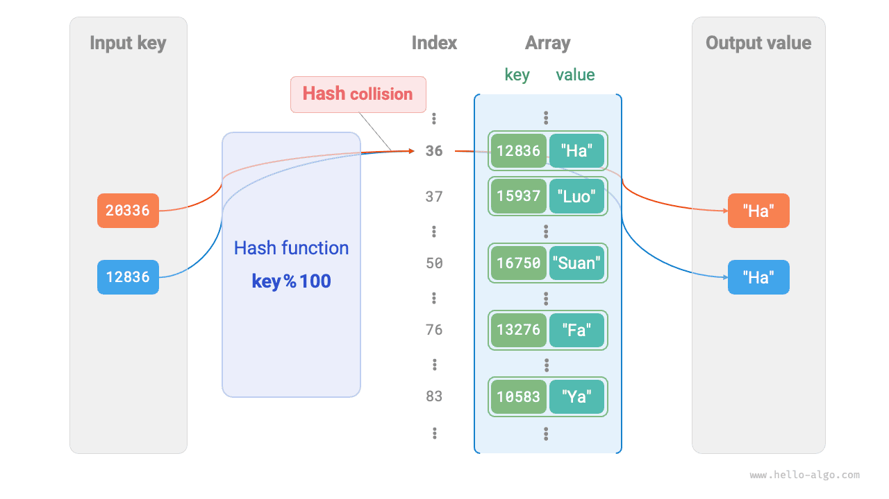

# Хеш-таблица

<u>Хеш-таблица (hash table)</u>, также называемая <u>таблицей рассеяния</u>, обеспечивает эффективный поиск элементов за счет отображения между ключом `key` и значением `value` . Иначе говоря, если передать в хеш-таблицу ключ `key` , то можно за $O(1)$ времени получить соответствующее значение `value` .

Как показано на рисунке ниже, пусть есть $n$ студентов, и у каждого из них есть два поля данных: "имя" и "номер студенческого билета". Если мы хотим реализовать запрос вида "ввести номер студенческого билета и вернуть соответствующее имя", то для этого можно использовать показанную ниже хеш-таблицу.


Помимо хеш-таблицы, функции поиска можно реализовать и через массив, и через связный список. Сравнение их эффективности приведено в таблице ниже.

- **Добавление элемента**: нужно лишь добавить элемент в конец массива (или списка), что занимает $O(1)$ времени.
- **Поиск элемента**: так как массив (или список) неупорядочен, приходится обходить все элементы, что занимает $O(n)$ времени.
- **Удаление элемента**: сначала нужно найти элемент, затем удалить его из массива (или списка), что занимает $O(n)$ времени.

<p align="center"> Таблица <id> &nbsp; Сравнение эффективности поиска элементов </p>

|          | Массив | Связный список | Хеш-таблица |
| -------- | ------ | -------------- | ----------- |
| Поиск элемента | $O(n)$ | $O(n)$ | $O(1)$ |
| Добавление элемента | $O(1)$ | $O(1)$ | $O(1)$ |
| Удаление элемента | $O(n)$ | $O(n)$ | $O(1)$ |

Нетрудно заметить, что **операции чтения, добавления, удаления и обновления в хеш-таблице имеют временную сложность $O(1)$** , то есть выполняются очень эффективно.

## Основные операции с хеш-таблицей

К базовым операциям хеш-таблицы относятся инициализация, поиск, добавление пар ключ-значение и удаление пар ключ-значение. Пример кода приведен ниже:

=== "Python"

    ```python title="hash_map.py"
    # Инициализация хеш-таблицы
    hmap: dict = {}

    # Операция добавления
    # Добавить пару ключ-значение (key, value) в хеш-таблицу
    hmap[12836] = "Сяо Ха"
    hmap[15937] = "Сяо Ло"
    hmap[16750] = "Сяо Суань"
    hmap[13276] = "Сяо Фа"
    hmap[10583] = "Сяо Я"

    # Операция поиска
    # Передать в хеш-таблицу ключ key и получить значение value
    name: str = hmap[15937]

    # Операция удаления
    # Удалить пару ключ-значение (key, value) из хеш-таблицы
    hmap.pop(10583)
    ```

=== "C++"

    ```cpp title="hash_map.cpp"
    /* Инициализация хеш-таблицы */
    unordered_map<int, string> map;

    /* Операция добавления */
    // Добавить пару ключ-значение (key, value) в хеш-таблицу
    map[12836] = "Сяо Ха";
    map[15937] = "Сяо Ло";
    map[16750] = "Сяо Суань";
    map[13276] = "Сяо Фа";
    map[10583] = "Сяо Я";

    /* Операция поиска */
    // Передать в хеш-таблицу ключ key и получить значение value
    string name = map[15937];

    /* Операция удаления */
    // Удалить пару ключ-значение (key, value) из хеш-таблицы
    map.erase(10583);
    ```

=== "Java"

    ```java title="hash_map.java"
    /* Инициализация хеш-таблицы */
    Map<Integer, String> map = new HashMap<>();

    /* Операция добавления */
    // Добавить пару ключ-значение (key, value) в хеш-таблицу
    map.put(12836, "Сяо Ха");
    map.put(15937, "Сяо Ло");
    map.put(16750, "Сяо Суань");
    map.put(13276, "Сяо Фа");
    map.put(10583, "Сяо Я");

    /* Операция поиска */
    // Передать в хеш-таблицу ключ key и получить значение value
    String name = map.get(15937);

    /* Операция удаления */
    // Удалить пару ключ-значение (key, value) из хеш-таблицы
    map.remove(10583);
    ```

=== "C#"

    ```csharp title="hash_map.cs"
    /* Инициализация хеш-таблицы */
    Dictionary<int, string> map = new() {
        /* Операция добавления */
        // Добавить пару ключ-значение (key, value) в хеш-таблицу
        { 12836, "Сяо Ха" },
        { 15937, "Сяо Ло" },
        { 16750, "Сяо Суань" },
        { 13276, "Сяо Фа" },
        { 10583, "Сяо Я" }
    };

    /* Операция поиска */
    // Передать в хеш-таблицу ключ key и получить значение value
    string name = map[15937];

    /* Операция удаления */
    // Удалить пару ключ-значение (key, value) из хеш-таблицы
    map.Remove(10583);
    ```

=== "Go"

    ```go title="hash_map_test.go"
    /* Инициализация хеш-таблицы */
    hmap := make(map[int]string)

    /* Операция добавления */
    // Добавить пару ключ-значение (key, value) в хеш-таблицу
    hmap[12836] = "Сяо Ха"
    hmap[15937] = "Сяо Ло"
    hmap[16750] = "Сяо Суань"
    hmap[13276] = "Сяо Фа"
    hmap[10583] = "Сяо Я"

    /* Операция поиска */
    // Передать в хеш-таблицу ключ key и получить значение value
    name := hmap[15937]

    /* Операция удаления */
    // Удалить пару ключ-значение (key, value) из хеш-таблицы
    delete(hmap, 10583)
    ```

=== "Swift"

    ```swift title="hash_map.swift"
    /* Инициализация хеш-таблицы */
    var map: [Int: String] = [:]

    /* Операция добавления */
    // Добавить пару ключ-значение (key, value) в хеш-таблицу
    map[12836] = "Сяо Ха"
    map[15937] = "Сяо Ло"
    map[16750] = "Сяо Суань"
    map[13276] = "Сяо Фа"
    map[10583] = "Сяо Я"

    /* Операция поиска */
    // Передать в хеш-таблицу ключ key и получить значение value
    let name = map[15937]!

    /* Операция удаления */
    // Удалить пару ключ-значение (key, value) из хеш-таблицы
    map.removeValue(forKey: 10583)
    ```

=== "JS"

    ```javascript title="hash_map.js"
    /* Инициализация хеш-таблицы */
    const map = new Map();
    /* Операция добавления */
    // Добавить пару ключ-значение (key, value) в хеш-таблицу
    map.set(12836, 'Сяо Ха');
    map.set(15937, 'Сяо Ло');
    map.set(16750, 'Сяо Суань');
    map.set(13276, 'Сяо Фа');
    map.set(10583, 'Сяо Я');

    /* Операция поиска */
    // Передать в хеш-таблицу ключ key и получить значение value
    let name = map.get(15937);

    /* Операция удаления */
    // Удалить пару ключ-значение (key, value) из хеш-таблицы
    map.delete(10583);
    ```

=== "TS"

    ```typescript title="hash_map.ts"
    /* Инициализация хеш-таблицы */
    const map = new Map<number, string>();
    /* Операция добавления */
    // Добавить пару ключ-значение (key, value) в хеш-таблицу
    map.set(12836, 'Сяо Ха');
    map.set(15937, 'Сяо Ло');
    map.set(16750, 'Сяо Суань');
    map.set(13276, 'Сяо Фа');
    map.set(10583, 'Сяо Я');
    console.info('\nПосле добавления хеш-таблица имеет вид\nKey -> Value');
    console.info(map);

    /* Операция поиска */
    // Передать в хеш-таблицу ключ key и получить значение value
    let name = map.get(15937);
    console.info('\nПо номеру 15937 найдено имя ' + name);

    /* Операция удаления */
    // Удалить пару ключ-значение (key, value) из хеш-таблицы
    map.delete(10583);
    console.info('\nПосле удаления 10583 хеш-таблица имеет вид\nKey -> Value');
    console.info(map);
    ```

=== "Dart"

    ```dart title="hash_map.dart"
    /* Инициализация хеш-таблицы */
    Map<int, String> map = {};

    /* Операция добавления */
    // Добавить пару ключ-значение (key, value) в хеш-таблицу
    map[12836] = "Сяо Ха";
    map[15937] = "Сяо Ло";
    map[16750] = "Сяо Суань";
    map[13276] = "Сяо Фа";
    map[10583] = "Сяо Я";

    /* Операция поиска */
    // Передать в хеш-таблицу ключ key и получить значение value
    String name = map[15937];

    /* Операция удаления */
    // Удалить пару ключ-значение (key, value) из хеш-таблицы
    map.remove(10583);
    ```

=== "Rust"

    ```rust title="hash_map.rs"
    use std::collections::HashMap;

    /* Инициализация хеш-таблицы */
    let mut map: HashMap<i32, String> = HashMap::new();

    /* Операция добавления */
    // Добавить пару ключ-значение (key, value) в хеш-таблицу
    map.insert(12836, "Сяо Ха".to_string());
    map.insert(15937, "Сяо Ло".to_string());
    map.insert(16750, "Сяо Суань".to_string());
    map.insert(13279, "Сяо Фа".to_string());
    map.insert(10583, "Сяо Я".to_string());

    /* Операция поиска */
    // Передать в хеш-таблицу ключ key и получить значение value
    let _name: Option<&String> = map.get(&15937);

    /* Операция удаления */
    // Удалить пару ключ-значение (key, value) из хеш-таблицы
    let _removed_value: Option<String> = map.remove(&10583);
    ```

=== "C"

    ```c title="hash_map.c"
    // В C нет встроенной хеш-таблицы
    ```

=== "Kotlin"

    ```kotlin title="hash_map.kt"
    /* Инициализация хеш-таблицы */
    val map = HashMap<Int,String>()

    /* Операция добавления */
    // Добавить пару ключ-значение (key, value) в хеш-таблицу
    map[12836] = "Сяо Ха"
    map[15937] = "Сяо Ло"
    map[16750] = "Сяо Суань"
    map[13276] = "Сяо Фа"
    map[10583] = "Сяо Я"

    /* Операция поиска */
    // Передать в хеш-таблицу ключ key и получить значение value
    val name = map[15937]

    /* Операция удаления */
    // Удалить пару ключ-значение (key, value) из хеш-таблицы
    map.remove(10583)
    ```

=== "Ruby"

    ```ruby title="hash_map.rb"
    # Инициализация хеш-таблицы
    hmap = {}

    # Операция добавления
    # Добавить пару ключ-значение (key, value) в хеш-таблицу
    hmap[12836] = "Сяо Ха"
    hmap[15937] = "Сяо Ло"
    hmap[16750] = "Сяо Суань"
    hmap[13276] = "Сяо Фа"
    hmap[10583] = "Сяо Я"

    # Операция поиска
    # Передать в хеш-таблицу ключ key и получить значение value
    name = hmap[15937]

    # Операция удаления
    # Удалить пару ключ-значение (key, value) из хеш-таблицы
    hmap.delete(10583)
    ```

??? pythontutor "Визуализация выполнения"

    https://pythontutor.com/render.html#code=%22%22%22Driver%20Code%22%22%22%0Aif%20__name__%20%3D%3D%20%22__main__%22%3A%0A%20%20%20%20%23%20%D0%98%D0%BD%D0%B8%D1%86%D0%B8%D0%B0%D0%BB%D0%B8%D0%B7%D0%B8%D1%80%D0%BE%D0%B2%D0%B0%D1%82%D1%8C%20%D1%85%D0%B5%D1%88-%D1%82%D0%B0%D0%B1%D0%BB%D0%B8%D1%86%D1%83%0A%20%20%20%20hmap%20%3D%20%7B%7D%0A%20%20%20%20%0A%20%20%20%20%23%20%D0%9E%D0%BF%D0%B5%D1%80%D0%B0%D1%86%D0%B8%D1%8F%20%D0%B4%D0%BE%D0%B1%D0%B0%D0%B2%D0%BB%D0%B5%D0%BD%D0%B8%D1%8F%0A%20%20%20%20%23%20%D0%94%D0%BE%D0%B1%D0%B0%D0%B2%D0%B8%D1%82%D1%8C%20%D0%B2%20%D1%85%D0%B5%D1%88-%D1%82%D0%B0%D0%B1%D0%BB%D0%B8%D1%86%D1%83%20%D0%BF%D0%B0%D1%80%D1%83%20%D0%BA%D0%BB%D1%8E%D1%87-%D0%B7%D0%BD%D0%B0%D1%87%D0%B5%D0%BD%D0%B8%D0%B5%20%28key%2C%20value%29%0A%20%20%20%20hmap%5B12836%5D%20%3D%20%22%D0%A1%D1%8F%D0%BE%20%D0%A5%D0%B0%22%0A%20%20%20%20hmap%5B15937%5D%20%3D%20%22%D0%A1%D1%8F%D0%BE%20%D0%9B%D0%BE%22%0A%20%20%20%20hmap%5B16750%5D%20%3D%20%22%D0%A1%D1%8F%D0%BE%20%D0%A1%D1%83%D0%B0%D0%BD%D1%8C%22%0A%20%20%20%20hmap%5B13276%5D%20%3D%20%22%D0%A1%D1%8F%D0%BE%20%D0%A4%D0%B0%22%0A%20%20%20%20hmap%5B10583%5D%20%3D%20%22%D0%A3%D1%82%D0%B5%D0%BD%D0%BE%D0%BA%22%0A%20%20%20%20%0A%20%20%20%20%23%20%D0%9E%D0%BF%D0%B5%D1%80%D0%B0%D1%86%D0%B8%D1%8F%20%D0%BF%D0%BE%D0%B8%D1%81%D0%BA%D0%B0%0A%20%20%20%20%23%20%D0%9F%D0%B5%D1%80%D0%B5%D0%B4%D0%B0%D1%82%D1%8C%20%D0%BA%D0%BB%D1%8E%D1%87%20key%20%D0%B2%20%D1%85%D0%B5%D1%88-%D1%82%D0%B0%D0%B1%D0%BB%D0%B8%D1%86%D1%83%20%D0%B8%20%D0%BF%D0%BE%D0%BB%D1%83%D1%87%D0%B8%D1%82%D1%8C%20%D0%B7%D0%BD%D0%B0%D1%87%D0%B5%D0%BD%D0%B8%D0%B5%20value%0A%20%20%20%20name%20%3D%20hmap%5B15937%5D%0A%20%20%20%20%0A%20%20%20%20%23%20%D0%9E%D0%BF%D0%B5%D1%80%D0%B0%D1%86%D0%B8%D1%8F%20%D1%83%D0%B4%D0%B0%D0%BB%D0%B5%D0%BD%D0%B8%D1%8F%0A%20%20%20%20%23%20%D0%A3%D0%B4%D0%B0%D0%BB%D0%B8%D1%82%D1%8C%20%D0%B8%D0%B7%20%D1%85%D0%B5%D1%88-%D1%82%D0%B0%D0%B1%D0%BB%D0%B8%D1%86%D1%8B%20%D0%BF%D0%B0%D1%80%D1%83%20%D0%BA%D0%BB%D1%8E%D1%87-%D0%B7%D0%BD%D0%B0%D1%87%D0%B5%D0%BD%D0%B8%D0%B5%20%28key%2C%20value%29%0A%20%20%20%20hmap.pop%2810583%29&cumulative=false&curInstr=2&heapPrimitives=nevernest&mode=display&origin=opt-frontend.js&py=311&rawInputLstJSON=%5B%5D&textReferences=false

У хеш-таблицы есть три распространенных способа обхода: обход пар ключ-значение, обход ключей и обход значений. Примеры кода приведены ниже:

=== "Python"

    ```python title="hash_map.py"
    # Обход хеш-таблицы
    # Обход пар ключ-значение key->value
    for key, value in hmap.items():
        print(key, "->", value)
    # Обход только ключей key
    for key in hmap.keys():
        print(key)
    # Обход только значений value
    for value in hmap.values():
        print(value)
    ```

=== "C++"

    ```cpp title="hash_map.cpp"
    /* Обход хеш-таблицы */
    // Обход пар ключ-значение key->value
    for (auto kv: map) {
        cout << kv.first << " -> " << kv.second << endl;
    }
    // Обход key->value с помощью итератора
    for (auto iter = map.begin(); iter != map.end(); iter++) {
        cout << iter->first << "->" << iter->second << endl;
    }
    ```

=== "Java"

    ```java title="hash_map.java"
    /* Обход хеш-таблицы */
    // Обход пар ключ-значение key->value
    for (Map.Entry <Integer, String> kv: map.entrySet()) {
        System.out.println(kv.getKey() + " -> " + kv.getValue());
    }
    // Обход только ключей key
    for (int key: map.keySet()) {
        System.out.println(key);
    }
    // Обход только значений value
    for (String val: map.values()) {
        System.out.println(val);
    }
    ```

=== "C#"

    ```csharp title="hash_map.cs"
    /* Обход хеш-таблицы */
    // Обход пар ключ-значение Key->Value
    foreach (var kv in map) {
        Console.WriteLine(kv.Key + " -> " + kv.Value);
    }
    // Обход только ключей key
    foreach (int key in map.Keys) {
        Console.WriteLine(key);
    }
    // Обход только значений value
    foreach (string val in map.Values) {
        Console.WriteLine(val);
    }
    ```

=== "Go"

    ```go title="hash_map_test.go"
    /* Обход хеш-таблицы */
    // Обход пар ключ-значение key->value
    for key, value := range hmap {
        fmt.Println(key, "->", value)
    }
    // Обход только ключей key
    for key := range hmap {
        fmt.Println(key)
    }
    // Обход только значений value
    for _, value := range hmap {
        fmt.Println(value)
    }
    ```

=== "Swift"

    ```swift title="hash_map.swift"
    /* Обход хеш-таблицы */
    // Обход пар ключ-значение Key->Value
    for (key, value) in map {
        print("\(key) -> \(value)")
    }
    // Обход только ключей Key
    for key in map.keys {
        print(key)
    }
    // Обход только значений Value
    for value in map.values {
        print(value)
    }
    ```

=== "JS"

    ```javascript title="hash_map.js"
    /* Обход хеш-таблицы */
    console.info('\nОбход пар ключ-значение Key->Value');
    for (const [k, v] of map.entries()) {
        console.info(k + ' -> ' + v);
    }
    console.info('\nОбход только ключей Key');
    for (const k of map.keys()) {
        console.info(k);
    }
    console.info('\nОбход только значений Value');
    for (const v of map.values()) {
        console.info(v);
    }
    ```

=== "TS"

    ```typescript title="hash_map.ts"
    /* Обход хеш-таблицы */
    console.info('\nОбход пар ключ-значение Key->Value');
    for (const [k, v] of map.entries()) {
        console.info(k + ' -> ' + v);
    }
    console.info('\nОбход только ключей Key');
    for (const k of map.keys()) {
        console.info(k);
    }
    console.info('\nОбход только значений Value');
    for (const v of map.values()) {
        console.info(v);
    }
    ```

=== "Dart"

    ```dart title="hash_map.dart"
    /* Обход хеш-таблицы */
    // Обход пар ключ-значение Key->Value
    map.forEach((key, value) {
      print('$key -> $value');
    });

    // Обход только ключей Key
    map.keys.forEach((key) {
      print(key);
    });

    // Обход только значений Value
    map.values.forEach((value) {
      print(value);
    });
    ```

=== "Rust"

    ```rust title="hash_map.rs"
    /* Обход хеш-таблицы */
    // Обход пар ключ-значение Key->Value
    for (key, value) in &map {
        println!("{key} -> {value}");
    }

    // Обход только ключей Key
    for key in map.keys() {
        println!("{key}");
    }

    // Обход только значений Value
    for value in map.values() {
        println!("{value}");
    }
    ```

=== "C"

    ```c title="hash_map.c"
    // В C нет встроенной хеш-таблицы
    ```

=== "Kotlin"

    ```kotlin title="hash_map.kt"
    /* Обход хеш-таблицы */
    // Обход пар ключ-значение key->value
    for ((key, value) in map) {
        println("$key -> $value")
    }
    // Обход только ключей key
    for (key in map.keys) {
        println(key)
    }
    // Обход только значений value
    for (_val in map.values) {
        println(_val)
    }
    ```

=== "Ruby"

    ```ruby title="hash_map.rb"
    # Обход хеш-таблицы
    # Обход пар ключ-значение key->value
    hmap.entries.each { |key, value| puts "#{key} -> #{value}" }

    # Обход только ключей key
    hmap.keys.each { |key| puts key }

    # Обход только значений value
    hmap.values.each { |val| puts val }
    ```

??? pythontutor "Визуализация выполнения"

    https://pythontutor.com/render.html#code=%22%22%22Driver%20Code%22%22%22%0Aif%20__name__%20%3D%3D%20%22__main__%22%3A%0A%20%20%20%20%23%20%D0%98%D0%BD%D0%B8%D1%86%D0%B8%D0%B0%D0%BB%D0%B8%D0%B7%D0%B8%D1%80%D0%BE%D0%B2%D0%B0%D1%82%D1%8C%20%D1%85%D0%B5%D1%88-%D1%82%D0%B0%D0%B1%D0%BB%D0%B8%D1%86%D1%83%0A%20%20%20%20hmap%20%3D%20%7B%7D%0A%20%20%20%20%0A%20%20%20%20%23%20%D0%9E%D0%BF%D0%B5%D1%80%D0%B0%D1%86%D0%B8%D1%8F%20%D0%B4%D0%BE%D0%B1%D0%B0%D0%B2%D0%BB%D0%B5%D0%BD%D0%B8%D1%8F%0A%20%20%20%20%23%20%D0%94%D0%BE%D0%B1%D0%B0%D0%B2%D0%B8%D1%82%D1%8C%20%D0%B2%20%D1%85%D0%B5%D1%88-%D1%82%D0%B0%D0%B1%D0%BB%D0%B8%D1%86%D1%83%20%D0%BF%D0%B0%D1%80%D1%83%20%D0%BA%D0%BB%D1%8E%D1%87-%D0%B7%D0%BD%D0%B0%D1%87%D0%B5%D0%BD%D0%B8%D0%B5%20%28key%2C%20value%29%0A%20%20%20%20hmap%5B12836%5D%20%3D%20%22%D0%A1%D1%8F%D0%BE%20%D0%A5%D0%B0%22%0A%20%20%20%20hmap%5B15937%5D%20%3D%20%22%D0%A1%D1%8F%D0%BE%20%D0%9B%D0%BE%22%0A%20%20%20%20hmap%5B16750%5D%20%3D%20%22%D0%A1%D1%8F%D0%BE%20%D0%A1%D1%83%D0%B0%D0%BD%D1%8C%22%0A%20%20%20%20hmap%5B13276%5D%20%3D%20%22%D0%A1%D1%8F%D0%BE%20%D0%A4%D0%B0%22%0A%20%20%20%20hmap%5B10583%5D%20%3D%20%22%D0%A3%D1%82%D0%B5%D0%BD%D0%BE%D0%BA%22%0A%20%20%20%20%0A%20%20%20%20%23%20%D0%9F%D0%B5%D1%80%D0%B5%D0%B1%D1%80%D0%B0%D1%82%D1%8C%20%D1%85%D0%B5%D1%88-%D1%82%D0%B0%D0%B1%D0%BB%D0%B8%D1%86%D1%83%0A%20%20%20%20%23%20%D0%9E%D0%B1%D0%BE%D0%B9%D1%82%D0%B8%D0%BF%D0%B0%D1%80%D0%B0%20%D0%BA%D0%BB%D1%8E%D1%87-%D0%B7%D0%BD%D0%B0%D1%87%D0%B5%D0%BD%D0%B8%D0%B5%20key-%3Evalue%0A%20%20%20%20for%20key%2C%20value%20in%20hmap.items%28%29%3A%0A%20%20%20%20%20%20%20%20print%28key%2C%20%22-%3E%22%2C%20value%29%0A%20%20%20%20%23%20%D0%BE%D1%82%D0%B4%D0%B5%D0%BB%D1%8C%D0%BD%D0%BE%D0%9E%D0%B1%D0%BE%D0%B9%D1%82%D0%B8%D0%BA%D0%BB%D1%8E%D1%87%20key%0A%20%20%20%20for%20key%20in%20hmap.keys%28%29%3A%0A%20%20%20%20%20%20%20%20print%28key%29%0A%20%20%20%20%23%20%D0%BE%D1%82%D0%B4%D0%B5%D0%BB%D1%8C%D0%BD%D0%BE%D0%9E%D0%B1%D0%BE%D0%B9%D1%82%D0%B8%D0%B7%D0%BD%D0%B0%D1%87%D0%B5%D0%BD%D0%B8%D0%B5%20value%0A%20%20%20%20for%20value%20in%20hmap.values%28%29%3A%0A%20%20%20%20%20%20%20%20print%28value%29&cumulative=false&curInstr=8&heapPrimitives=nevernest&mode=display&origin=opt-frontend.js&py=311&rawInputLstJSON=%5B%5D&textReferences=false

## Простая реализация хеш-таблицы

Сначала рассмотрим самый простой случай: **реализуем хеш-таблицу только с помощью одного массива**. В хеш-таблице каждую пустую ячейку массива мы называем <u>бакетом (bucket)</u>, и каждый бакет может хранить одну пару ключ-значение. Следовательно, операция поиска сводится к тому, чтобы найти бакет, соответствующий `key` , и получить из него `value` .

Но как определить бакет, соответствующий заданному `key` ? Это делается с помощью <u>хеш-функции (hash function)</u>. Назначение хеш-функции - отображать большое входное пространство в меньшее выходное пространство. В хеш-таблице входным пространством являются все `key` , а выходным - все бакеты (индексы массива). Иначе говоря, передав `key` на вход, **мы можем через хеш-функцию получить позицию хранения соответствующей пары ключ-значение в массиве**.

Процесс вычисления хеш-функции для одного `key` включает два шага.

1. Сначала с помощью некоторого хеш-алгоритма `hash()` вычисляется хеш-значение.
2. Затем хеш-значение берется по модулю числа бакетов (длины массива) `capacity` , чтобы получить бакет (индекс массива) `index` , соответствующий этому `key` .

```shell
index = hash(key) % capacity
```

После этого можно использовать `index` для доступа к соответствующему бакету в хеш-таблице и получения `value` .

Пусть длина массива `capacity = 100` , а хеш-алгоритм `hash(key) = key` . Тогда легко получить хеш-функцию `key % 100` . На рисунке ниже на примере `key` "номер студенческого билета" и `value` "имя" показан принцип работы хеш-функции.


Ниже приведен код простой реализации хеш-таблицы. В нем мы инкапсулируем `key` и `value` в класс `Pair` , чтобы представить пару ключ-значение.

```src
[file]{array_hash_map}-[class]{array_hash_map}-[func]{}
```

## Хеш-коллизии и расширение

По сути, хеш-функция отображает входное пространство, состоящее из всех `key` , в выходное пространство, состоящее из всех индексов массива, а входное пространство обычно значительно больше выходного. Поэтому **теоретически неизбежно существование ситуации "несколько входов соответствуют одному выходу"**.

Для хеш-функции из приведенного выше примера, если последние две цифры `key` совпадают, то совпадает и результат хеш-функции. Например, если искать студентов с номерами 12836 и 20336, то получим:

```shell
12836 % 100 = 36
20336 % 100 = 36
```

Как показано на рисунке ниже, два номера указывают на одно и то же имя, что, очевидно, неверно. Такую ситуацию, когда нескольким входам соответствует один и тот же выход, называют <u>хеш-коллизией (hash collision)</u>.



Легко понять, что чем больше емкость хеш-таблицы $n$ , тем ниже вероятность того, что несколько `key` попадут в один и тот же бакет, а значит, тем меньше коллизий. Поэтому **мы можем уменьшать число хеш-коллизий путем расширения хеш-таблицы**.

Как показано на рисунке ниже, до расширения пары ключ-значение `(136, A)` и `(236, D)` конфликтовали, а после расширения коллизия исчезла.


Подобно расширению массива, расширение хеш-таблицы требует перенести все пары ключ-значение из старой таблицы в новую, а это очень затратно по времени; кроме того, поскольку емкость хеш-таблицы `capacity` изменилась, нам приходится с помощью хеш-функции заново вычислять позиции хранения всех пар ключ-значение, что дополнительно увеличивает вычислительные расходы процесса расширения. Поэтому языки программирования обычно заранее резервируют достаточно большую емкость хеш-таблицы, чтобы избежать частых расширений.

<u>Коэффициент загрузки (load factor)</u> - важное понятие хеш-таблицы. Он определяется как отношение числа элементов в хеш-таблице к числу бакетов и используется для оценки степени серьезности хеш-коллизий, **а также часто служит условием срабатывания расширения хеш-таблицы**. Например, в Java, когда коэффициент загрузки превышает $0.75$ , система расширяет хеш-таблицу до $2$ раз от исходной емкости.
