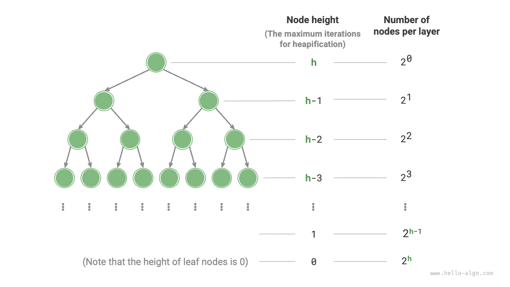

# Построение кучи

В некоторых случаях мы хотим построить кучу, используя сразу все элементы списка. Этот процесс называется "построением кучи".

## Реализация через операцию добавления в кучу

Сначала мы создаем пустую кучу, затем обходим список и для каждого элемента по очереди выполняем "операцию добавления в кучу": сначала помещаем элемент в хвост кучи, а затем выполняем для него упорядочивание "снизу вверх".

Каждый раз, когда элемент добавляется в кучу, ее длина увеличивается на единицу. Поскольку узлы последовательно добавляются в двоичное дерево сверху вниз, куча строится "сверху вниз".

Пусть число элементов равно $n$ ; так как каждая операция добавления требует $O(\log{n})$ времени, временная сложность такого построения кучи составляет $O(n \log n)$ .

## Реализация через обход и упорядочивание

На самом деле можно реализовать и более эффективный способ построения кучи, который состоит из двух шагов.

1. Без изменений добавить все элементы списка в кучу; в этот момент свойства кучи еще не выполняются.
2. Обойти кучу в обратном порядке, то есть в порядке, обратном обходу по уровням, и по очереди выполнить упорядочивание "сверху вниз" для каждого нелистового узла.

**После того как некоторый узел был упорядочен, поддерево с этим узлом в качестве корня становится корректной подкучей**. А поскольку обход выполняется в обратном порядке, куча строится "снизу вверх".

Причина выбора обратного обхода в том, что он гарантирует: поддеревья ниже текущего узла уже являются корректными подкучами, а значит, упорядочивание текущего узла действительно будет эффективным.

Стоит отметить, что **листовые узлы не имеют дочерних узлов, поэтому они естественным образом являются корректными подкучами и не требуют упорядочивания**. Как показано в коде ниже, последний нелистовой узел является родителем последнего узла, и именно с него мы начинаем обратный обход и упорядочивание:

```src
[file]{my_heap}-[class]{max_heap}-[func]{__init__}
```

## Анализ сложности

Теперь попробуем оценить временную сложность второго способа построения кучи.

- Пусть число узлов полного двоичного дерева равно $n$ , тогда число листовых узлов равно $(n + 1) / 2$ , где $/$ означает целочисленное деление вниз. Следовательно, число узлов, которые нужно упорядочивать, равно $(n - 1) / 2$ .
- В процессе упорядочивания сверху вниз каждый узел в худшем случае может просеяться до листа, поэтому максимальное число итераций равно высоте двоичного дерева $\log n$ .

Перемножив эти два значения, можно получить временную сложность построения кучи $O(n \log n)$ . **Но эта оценка неточна, потому что мы не учли свойство двоичного дерева: на нижних уровнях узлов гораздо больше, чем на верхних**.

Далее выполним более точный расчет. Чтобы упростить вычисления, предположим, что дано "идеальное двоичное дерево" высоты $h$ с числом узлов $n$ ; это предположение не повлияет на корректность результата.



Как показано на рисунке выше, максимальное число итераций упорядочивания "сверху вниз" для некоторого узла равно расстоянию от этого узла до листового узла, а это расстояние как раз и есть "высота узла". Поэтому мы можем просуммировать для каждого уровня выражение "число узлов $\times$ высота узла" и **получить суммарное число итераций упорядочивания для всех узлов**.

$$
T(h) = 2^0h + 2^1(h-1) + 2^2(h-2) + \dots + 2^{(h-1)}\times1
$$

Чтобы упростить это выражение, воспользуемся школьными знаниями о последовательностях и сначала умножим $T(h)$ на $2$ :

$$
\begin{aligned}
T(h) & = 2^0h + 2^1(h-1) + 2^2(h-2) + \dots + 2^{h-1}\times1 \newline
2 T(h) & = 2^1h + 2^2(h-1) + 2^3(h-2) + \dots + 2^{h}\times1 \newline
\end{aligned}
$$

Используя метод вычитания со сдвигом, вычтем из нижней строки $2 T(h)$ верхнюю строку $T(h)$ , тогда получим:

$$
2T(h) - T(h) = T(h) = -2^0h + 2^1 + 2^2 + \dots + 2^{h-1} + 2^h
$$

Из этого выражения видно, что $T(h)$ представляет собой геометрическую прогрессию, поэтому можно напрямую применить формулу суммы и получить временную сложность:

$$
\begin{aligned}
T(h) & = 2 \frac{1 - 2^h}{1 - 2} - h \newline
& = 2^{h+1} - h - 2 \newline
& = O(2^h)
\end{aligned}
$$

Далее, число узлов идеального двоичного дерева высоты $h$ равно $n = 2^{h+1} - 1$ , поэтому несложно получить сложность $O(2^h) = O(n)$ . Из этого вывода следует, что **построение кучи из входного списка имеет временную сложность $O(n)$ , что очень эффективно**.
