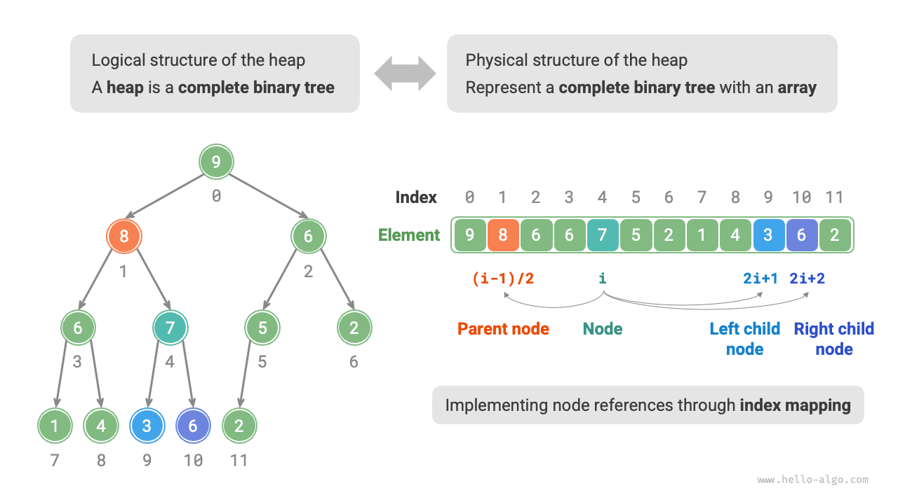
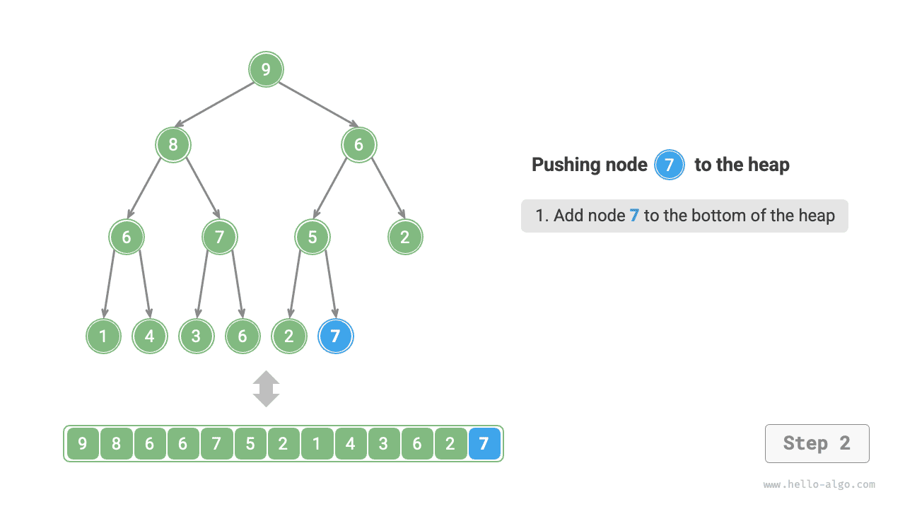
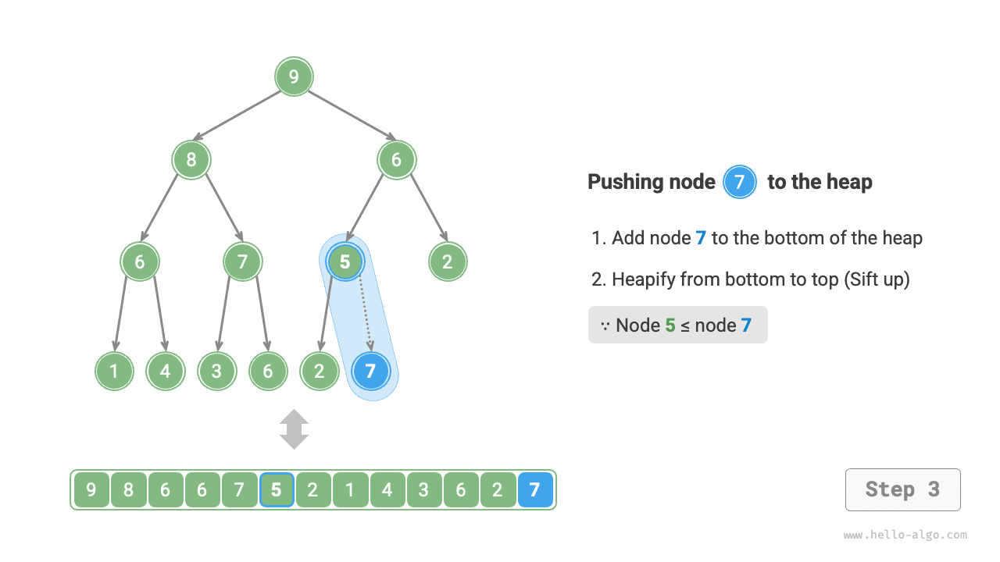
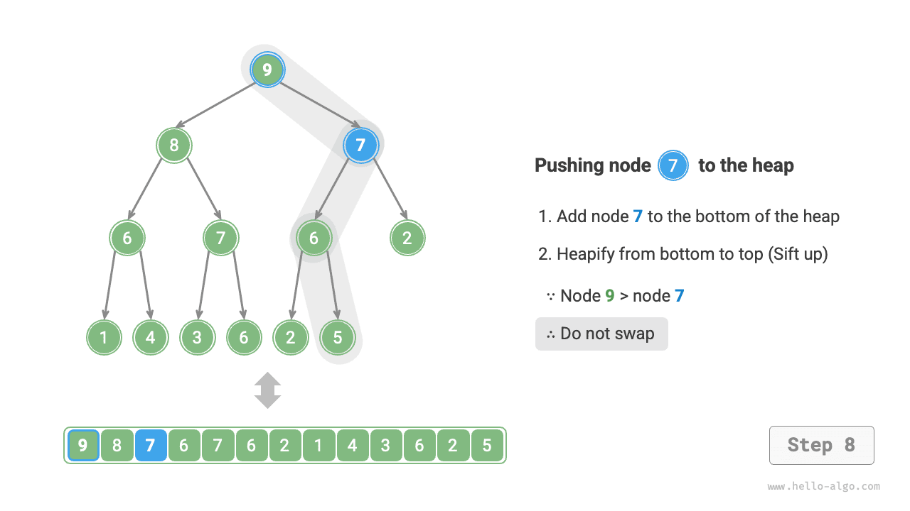
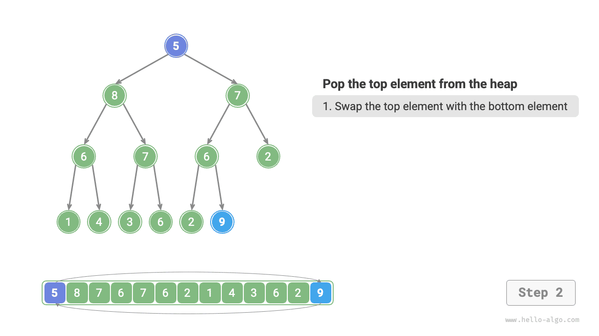
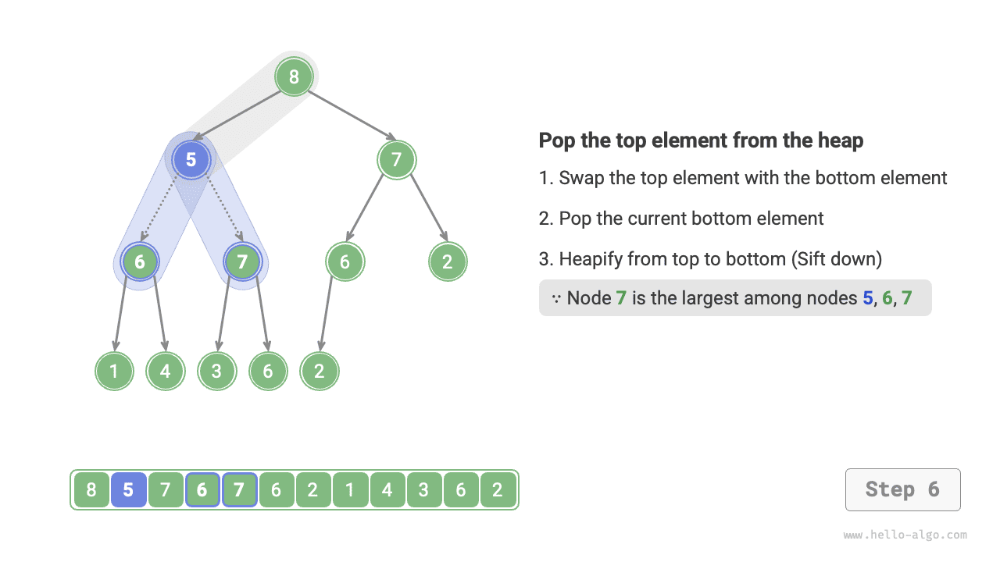
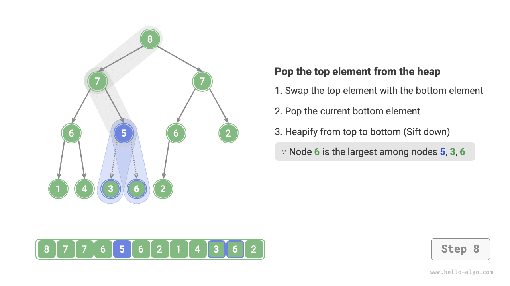

# Куча

<u>Куча (heap)</u> - это полное двоичное дерево, удовлетворяющее определенным условиям. Основных типов кучи два, как показано на рисунке ниже.

- <u>Минимальная куча (min heap)</u>: значение любого узла $\leq$ значения его дочерних узлов.
- <u>Максимальная куча (max heap)</u>: значение любого узла $\geq$ значения его дочерних узлов.


Куча, являясь частным случаем полного двоичного дерева, обладает следующими свойствами.

- Узлы самого нижнего уровня заполняются слева, а все остальные уровни заполнены полностью.
- Корневой узел двоичного дерева мы называем "вершиной кучи", а самый правый узел нижнего уровня - "основанием кучи".
- Для максимальной (минимальной) кучи значение элемента на вершине, то есть у корневого узла, является максимальным (минимальным).

## Распространенные операции с кучей

Нужно отметить, что многие языки программирования предоставляют не саму кучу, а <u>очередь с приоритетом (priority queue)</u> - абстрактную структуру данных, определяемую как очередь, в которой элементы извлекаются в соответствии с приоритетом.

На практике **куча обычно используется для реализации очереди с приоритетом, а максимальная куча эквивалентна очереди с приоритетом, в которой элементы извлекаются по убыванию**. С точки зрения использования "очередь с приоритетом" и "куча" можно считать эквивалентными структурами данных. Поэтому в этой книге мы не будем специально различать их и в дальнейшем будем единообразно называть "кучей".

Распространенные операции с кучей приведены в таблице ниже. Конкретные имена методов зависят от языка программирования.

<p align="center"> Таблица <id> &nbsp; Эффективность операций с кучей </p>

| Имя метода  | Описание                                         | Временная сложность |
| ----------- | ------------------------------------------------ | ------------------- |
| `push()`    | Поместить элемент в кучу                         | $O(\log n)$         |
| `pop()`     | Извлечь элемент с вершины кучи                   | $O(\log n)$         |
| `peek()`    | Получить доступ к вершине кучи (для max / min кучи это соответственно максимум / минимум) | $O(1)$ |
| `size()`    | Получить число элементов в куче                  | $O(1)$              |
| `isEmpty()` | Проверить, пуста ли куча                         | $O(1)$              |

В реальных приложениях мы можем напрямую использовать классы кучи, предоставляемые языком программирования, или классы очереди с приоритетом.

Подобно сортировкам "по возрастанию" и "по убыванию", мы можем переключаться между "минимальной кучей" и "максимальной кучей", изменяя `flag` или модифицируя `Comparator` . Код приведен ниже:

=== "Python"

    ```python title="heap.py"
    # Инициализация минимальной кучи
    min_heap, flag = [], 1
    # Инициализация максимальной кучи
    max_heap, flag = [], -1

    # Модуль heapq в Python по умолчанию реализует минимальную кучу
    # Если инвертировать знак элемента перед добавлением, то отношение порядка перевернется и так реализуется максимальная куча
    # В этом примере flag = 1 соответствует минимальной куче, а flag = -1 - максимальной

    # Добавление элементов в кучу
    heapq.heappush(max_heap, flag * 1)
    heapq.heappush(max_heap, flag * 3)
    heapq.heappush(max_heap, flag * 2)
    heapq.heappush(max_heap, flag * 5)
    heapq.heappush(max_heap, flag * 4)

    # Получение элемента на вершине кучи
    peek: int = flag * max_heap[0] # 5

    # Извлечение элемента с вершины кучи
    # Извлеченные элементы образуют последовательность по убыванию
    val = flag * heapq.heappop(max_heap) # 5
    val = flag * heapq.heappop(max_heap) # 4
    val = flag * heapq.heappop(max_heap) # 3
    val = flag * heapq.heappop(max_heap) # 2
    val = flag * heapq.heappop(max_heap) # 1

    # Получение размера кучи
    size: int = len(max_heap)

    # Проверка, пуста ли куча
    is_empty: bool = not max_heap

    # Построение кучи из входного списка
    min_heap: list[int] = [1, 3, 2, 5, 4]
    heapq.heapify(min_heap)
    ```

=== "C++"

    ```cpp title="heap.cpp"
    /* Инициализация кучи */
    // Инициализация минимальной кучи
    priority_queue<int, vector<int>, greater<int>> minHeap;
    // Инициализация максимальной кучи
    priority_queue<int, vector<int>, less<int>> maxHeap;

    /* Добавление элементов в кучу */
    maxHeap.push(1);
    maxHeap.push(3);
    maxHeap.push(2);
    maxHeap.push(5);
    maxHeap.push(4);

    /* Получение элемента на вершине кучи */
    int peek = maxHeap.top(); // 5

    /* Извлечение элемента с вершины кучи */
    // Извлеченные элементы образуют последовательность по убыванию
    maxHeap.pop(); // 5
    maxHeap.pop(); // 4
    maxHeap.pop(); // 3
    maxHeap.pop(); // 2
    maxHeap.pop(); // 1

    /* Получение размера кучи */
    int size = maxHeap.size();

    /* Проверка, пуста ли куча */
    bool isEmpty = maxHeap.empty();

    /* Построение кучи из входного списка */
    vector<int> input{1, 3, 2, 5, 4};
    priority_queue<int, vector<int>, greater<int>> minHeap(input.begin(), input.end());
    ```

=== "Java"

    ```java title="heap.java"
    /* Инициализация кучи */
    // Инициализация минимальной кучи
    Queue<Integer> minHeap = new PriorityQueue<>();
    // Инициализация максимальной кучи (достаточно изменить Comparator через lambda)
    Queue<Integer> maxHeap = new PriorityQueue<>((a, b) -> b - a);

    /* Добавление элементов в кучу */
    maxHeap.offer(1);
    maxHeap.offer(3);
    maxHeap.offer(2);
    maxHeap.offer(5);
    maxHeap.offer(4);

    /* Получение элемента на вершине кучи */
    int peek = maxHeap.peek(); // 5

    /* Извлечение элемента с вершины кучи */
    // Извлеченные элементы образуют последовательность по убыванию
    peek = maxHeap.poll(); // 5
    peek = maxHeap.poll(); // 4
    peek = maxHeap.poll(); // 3
    peek = maxHeap.poll(); // 2
    peek = maxHeap.poll(); // 1

    /* Получение размера кучи */
    int size = maxHeap.size();

    /* Проверка, пуста ли куча */
    boolean isEmpty = maxHeap.isEmpty();

    /* Построение кучи из входного списка */
    minHeap = new PriorityQueue<>(Arrays.asList(1, 3, 2, 5, 4));
    ```

=== "C#"

    ```csharp title="heap.cs"
    /* Инициализация кучи */
    // Инициализация минимальной кучи
    PriorityQueue<int, int> minHeap = new();
    // Инициализация максимальной кучи (достаточно изменить Comparer через lambda)
    PriorityQueue<int, int> maxHeap = new(Comparer<int>.Create((x, y) => y.CompareTo(x)));

    /* Добавление элементов в кучу */
    maxHeap.Enqueue(1, 1);
    maxHeap.Enqueue(3, 3);
    maxHeap.Enqueue(2, 2);
    maxHeap.Enqueue(5, 5);
    maxHeap.Enqueue(4, 4);

    /* Получение элемента на вершине кучи */
    int peek = maxHeap.Peek();//5

    /* Извлечение элемента с вершины кучи */
    // Извлеченные элементы образуют последовательность по убыванию
    peek = maxHeap.Dequeue();  // 5
    peek = maxHeap.Dequeue();  // 4
    peek = maxHeap.Dequeue();  // 3
    peek = maxHeap.Dequeue();  // 2
    peek = maxHeap.Dequeue();  // 1

    /* Получение размера кучи */
    int size = maxHeap.Count;

    /* Проверка, пуста ли куча */
    bool isEmpty = maxHeap.Count == 0;

    /* Построение кучи из входного списка */
    minHeap = new PriorityQueue<int, int>([(1, 1), (3, 3), (2, 2), (5, 5), (4, 4)]);
    ```

=== "Go"

    ```go title="heap.go"
    // В Go можно построить целочисленную максимальную кучу, реализовав heap.Interface
    // Для реализации heap.Interface также нужно реализовать sort.Interface
    type intHeap []any

    // Метод Push из heap.Interface, реализует добавление элемента в кучу
    func (h *intHeap) Push(x any) {
        // Push и Pop используют pointer receiver
        // Потому что они не только изменяют содержимое среза, но и его длину
        *h = append(*h, x.(int))
    }

    // Метод Pop из heap.Interface, реализует извлечение элемента с вершины кучи
    func (h *intHeap) Pop() any {
        // Извлекаемый элемент хранится в конце
        last := (*h)[len(*h)-1]
        *h = (*h)[:len(*h)-1]
        return last
    }

    // Метод Len из sort.Interface
    func (h *intHeap) Len() int {
        return len(*h)
    }

    // Метод Less из sort.Interface
    func (h *intHeap) Less(i, j int) bool {
        // Для минимальной кучи здесь нужно заменить сравнение на <
        return (*h)[i].(int) > (*h)[j].(int)
    }

    // Метод Swap из sort.Interface
    func (h *intHeap) Swap(i, j int) {
        (*h)[i], (*h)[j] = (*h)[j], (*h)[i]
    }

    // Top получает элемент на вершине кучи
    func (h *intHeap) Top() any {
        return (*h)[0]
    }

    /* Driver Code */
    func TestHeap(t *testing.T) {
        /* Инициализация кучи */
        // Инициализация максимальной кучи
        maxHeap := &intHeap{}
        heap.Init(maxHeap)
        /* Добавление элементов в кучу */
        // Вызываем методы heap.Interface для добавления элементов
        heap.Push(maxHeap, 1)
        heap.Push(maxHeap, 3)
        heap.Push(maxHeap, 2)
        heap.Push(maxHeap, 4)
        heap.Push(maxHeap, 5)

        /* Получение элемента на вершине кучи */
        top := maxHeap.Top()
        fmt.Printf("Элемент на вершине кучи: %d\n", top)

        /* Извлечение элемента с вершины кучи */
        // Вызываем методы heap.Interface для удаления элементов
        heap.Pop(maxHeap) // 5
        heap.Pop(maxHeap) // 4
        heap.Pop(maxHeap) // 3
        heap.Pop(maxHeap) // 2
        heap.Pop(maxHeap) // 1

        /* Получение размера кучи */
        size := len(*maxHeap)
        fmt.Printf("Число элементов в куче: %d\n", size)

        /* Проверка, пуста ли куча */
        isEmpty := len(*maxHeap) == 0
        fmt.Printf("Пуста ли куча: %t\n", isEmpty)
    }
    ```

=== "Swift"

    ```swift title="heap.swift"
    /* Инициализация кучи */
    // Тип Heap в Swift поддерживает и max-heap, и min-heap, но требует swift-collections
    var heap = Heap<Int>()

    /* Добавление элементов в кучу */
    heap.insert(1)
    heap.insert(3)
    heap.insert(2)
    heap.insert(5)
    heap.insert(4)

    /* Получение элемента на вершине кучи */
    var peek = heap.max()!

    /* Извлечение элемента с вершины кучи */
    peek = heap.removeMax() // 5
    peek = heap.removeMax() // 4
    peek = heap.removeMax() // 3
    peek = heap.removeMax() // 2
    peek = heap.removeMax() // 1

    /* Получение размера кучи */
    let size = heap.count

    /* Проверка, пуста ли куча */
    let isEmpty = heap.isEmpty

    /* Построение кучи из входного списка */
    let heap2 = Heap([1, 3, 2, 5, 4])
    ```

=== "JS"

    ```javascript title="heap.js"
    // В JavaScript нет встроенного класса Heap
    ```

=== "TS"

    ```typescript title="heap.ts"
    // В TypeScript нет встроенного класса Heap
    ```

=== "Dart"

    ```dart title="heap.dart"
    // В Dart нет встроенного класса Heap
    ```

=== "Rust"

    ```rust title="heap.rs"
    use std::collections::BinaryHeap;
    use std::cmp::Reverse;

    /* Инициализация кучи */
    // Инициализация минимальной кучи
    let mut min_heap = BinaryHeap::<Reverse<i32>>::new();
    // Инициализация максимальной кучи
    let mut max_heap = BinaryHeap::new();

    /* Добавление элементов в кучу */
    max_heap.push(1);
    max_heap.push(3);
    max_heap.push(2);
    max_heap.push(5);
    max_heap.push(4);

    /* Получение элемента на вершине кучи */
    let peek = max_heap.peek().unwrap();  // 5

    /* Извлечение элемента с вершины кучи */
    // Извлеченные элементы образуют последовательность по убыванию
    let peek = max_heap.pop().unwrap();   // 5
    let peek = max_heap.pop().unwrap();   // 4
    let peek = max_heap.pop().unwrap();   // 3
    let peek = max_heap.pop().unwrap();   // 2
    let peek = max_heap.pop().unwrap();   // 1

    /* Получение размера кучи */
    let size = max_heap.len();

    /* Проверка, пуста ли куча */
    let is_empty = max_heap.is_empty();

    /* Построение кучи из входного списка */
    let min_heap = BinaryHeap::from(vec![Reverse(1), Reverse(3), Reverse(2), Reverse(5), Reverse(4)]);
    ```

=== "C"

    ```c title="heap.c"
    // В C нет встроенного класса Heap
    ```

=== "Kotlin"

    ```kotlin title="heap.kt"
    /* Инициализация кучи */
    // Инициализация минимальной кучи
    var minHeap = PriorityQueue<Int>()
    // Инициализация максимальной кучи (достаточно изменить Comparator через lambda)
    val maxHeap = PriorityQueue { a: Int, b: Int -> b - a }

    /* Добавление элементов в кучу */
    maxHeap.offer(1)
    maxHeap.offer(3)
    maxHeap.offer(2)
    maxHeap.offer(5)
    maxHeap.offer(4)

    /* Получение элемента на вершине кучи */
    var peek = maxHeap.peek() // 5

    /* Извлечение элемента с вершины кучи */
    // Извлеченные элементы образуют последовательность по убыванию
    peek = maxHeap.poll() // 5
    peek = maxHeap.poll() // 4
    peek = maxHeap.poll() // 3
    peek = maxHeap.poll() // 2
    peek = maxHeap.poll() // 1

    /* Получение размера кучи */
    val size = maxHeap.size

    /* Проверка, пуста ли куча */
    val isEmpty = maxHeap.isEmpty()

    /* Построение кучи из входного списка */
    minHeap = PriorityQueue(mutableListOf(1, 3, 2, 5, 4))
    ```

=== "Ruby"

    ```ruby title="heap.rb"
    # В Ruby нет встроенного класса Heap
    ```

??? pythontutor "Визуализация выполнения"

    https://pythontutor.com/render.html#code=import%20heapq%0A%0A%22%22%22Driver%20Code%22%22%22%0Aif%20__name__%20%3D%3D%20%22__main__%22%3A%0A%20%20%20%20%23%20%E5%88%9D%E5%A7%8B%E5%8C%96%E5%B0%8F%E9%A1%B6%E5%A0%86%0A%20%20%20%20min_heap,%20flag%20%3D%20%5B%5D,%201%0A%20%20%20%20%23%20%E5%88%9D%E5%A7%8B%E5%8C%96%E5%A4%A7%E9%A1%B6%E5%A0%86%0A%20%20%20%20max_heap,%20flag%20%3D%20%5B%5D,%20-1%0A%20%20%20%20%0A%20%20%20%20%23%20Python%20%E7%9A%84%20heapq%20%E6%A8%A1%E5%9D%97%E9%BB%98%E8%AE%A4%E5%AE%9E%E7%8E%B0%E5%B0%8F%E9%A1%B6%E5%A0%86%0A%20%20%20%20%23%20%E8%80%83%E8%99%91%E5%B0%86%E2%80%9C%E5%85%83%E7%B4%A0%E5%8F%96%E8%B4%9F%E2%80%9D%E5%90%8E%E5%86%8D%E5%85%A5%E5%A0%86%EF%BC%8C%E8%BF%99%E6%A0%B7%E5%B0%B1%E5%8F%AF%E4%BB%A5%E5%B0%86%E5%A4%A7%E5%B0%8F%E5%85%B3%E7%B3%BB%E9%A2%A0%E5%80%92%EF%BC%8C%E4%BB%8E%E8%80%8C%E5%AE%9E%E7%8E%B0%E5%A4%A7%E9%A1%B6%E5%A0%86%0A%20%20%20%20%23%20%E5%9C%A8%E6%9C%AC%E7%A4%BA%E4%BE%8B%E4%B8%AD%EF%BC%8Cflag%20%3D%201%20%E6%97%B6%E5%AF%B9%E5%BA%94%E5%B0%8F%E9%A1%B6%E5%A0%86%EF%BC%8Cflag%20%3D%20-1%20%E6%97%B6%E5%AF%B9%E5%BA%94%E5%A4%A7%E9%A1%B6%E5%A0%86%0A%20%20%20%20%0A%20%20%20%20%23%20%E5%85%83%E7%B4%A0%E5%85%A5%E5%A0%86%0A%20%20%20%20heapq.heappush%28max_heap,%20flag%20*%201%29%0A%20%20%20%20heapq.heappush%28max_heap,%20flag%20*%203%29%0A%20%20%20%20heapq.heappush%28max_heap,%20flag%20*%202%29%0A%20%20%20%20heapq.heappush%28max_heap,%20flag%20*%205%29%0A%20%20%20%20heapq.heappush%28max_heap,%20flag%20*%204%29%0A%20%20%20%20%0A%20%20%20%20%23%20%E8%8E%B7%E5%8F%96%E5%A0%86%E9%A1%B6%E5%85%83%E7%B4%A0%0A%20%20%20%20peek%20%3D%20flag%20*%20max_heap%5B0%5D%20%23%205%0A%20%20%20%20%0A%20%20%20%20%23%20%E5%A0%86%E9%A1%B6%E5%85%83%E7%B4%A0%E5%87%BA%E5%A0%86%0A%20%20%20%20%23%20%E5%87%BA%E5%A0%86%E5%85%83%E7%B4%A0%E4%BC%9A%E5%BD%A2%E6%88%90%E4%B8%80%E4%B8%AA%E4%BB%8E%E5%A4%A7%E5%88%B0%E5%B0%8F%E7%9A%84%E5%BA%8F%E5%88%97%0A%20%20%20%20val%20%3D%20flag%20*%20heapq.heappop%28max_heap%29%20%23%205%0A%20%20%20%20val%20%3D%20flag%20*%20heapq.heappop%28max_heap%29%20%23%204%0A%20%20%20%20val%20%3D%20flag%20*%20heapq.heappop%28max_heap%29%20%23%203%0A%20%20%20%20val%20%3D%20flag%20*%20heapq.heappop%28max_heap%29%20%23%202%0A%20%20%20%20val%20%3D%20flag%20*%20heapq.heappop%28max_heap%29%20%23%201%0A%20%20%20%20%0A%20%20%20%20%23%20%E8%8E%B7%E5%8F%96%E5%A0%86%E5%A4%A7%E5%B0%8F%0A%20%20%20%20size%20%3D%20len%28max_heap%29%0A%20%20%20%20%0A%20%20%20%20%23%20%E5%88%A4%E6%96%AD%E5%A0%86%E6%98%AF%E5%90%A6%E4%B8%BA%E7%A9%BA%0A%20%20%20%20is_empty%20%3D%20not%20max_heap%0A%20%20%20%20%0A%20%20%20%20%23%20%E8%BE%93%E5%85%A5%E5%88%97%E8%A1%A8%E5%B9%B6%E5%BB%BA%E5%A0%86%0A%20%20%20%20min_heap%20%3D%20%5B1,%203,%202,%205,%204%5D%0A%20%20%20%20heapq.heapify%28min_heap%29&cumulative=false&curInstr=3&heapPrimitives=nevernest&mode=display&origin=opt-frontend.js&py=311&rawInputLstJSON=%5B%5D&textReferences=false

## Реализация кучи

Ниже реализуется максимальная куча. Чтобы преобразовать ее в минимальную кучу, достаточно инвертировать всю логику сравнений по величине, например заменить $\geq$ на $\leq$ . Заинтересованные читатели могут попробовать реализовать это самостоятельно.

### Хранение и представление кучи

В разделе "Двоичные деревья" мы уже говорили, что полное двоичное дерево очень удобно представлять массивом. Поскольку куча как раз и является полным двоичным деревом, **для хранения кучи мы также будем использовать массив**.

Когда двоичное дерево представляется массивом, элементы массива соответствуют значениям узлов, а индексы - положениям этих узлов в двоичном дереве. **Указатели на узлы реализуются через формулы отображения индексов**.

Как показано на рисунке ниже, для заданного индекса $i$ индекс левого дочернего узла равен $2i + 1$ , правого дочернего узла - $2i + 2$ , а родительского узла - $(i - 1) / 2$ с округлением вниз. Если индекс выходит за допустимые границы, это означает пустой узел или отсутствие узла.



Мы можем инкапсулировать формулы отображения индексов в функции, чтобы потом было удобнее ими пользоваться:

```src
[file]{my_heap}-[class]{max_heap}-[func]{parent}
```

### Доступ к элементу на вершине кучи

Элемент на вершине кучи - это корневой узел двоичного дерева, то есть первый элемент списка:

```src
[file]{my_heap}-[class]{max_heap}-[func]{peek}
```

### Добавление элемента в кучу

Пусть дан элемент `val` . Сначала мы помещаем его в основание кучи. После добавления свойства кучи могут нарушиться, потому что `val` может оказаться больше, чем другие элементы в куче. **Поэтому необходимо восстановить порядок на пути от вставленного узла к корню** ; эта операция называется <u>heapify</u>, то есть упорядочиванием кучи.

Рассмотрим ситуацию, когда упорядочивание выполняется **снизу вверх**, начиная от только что вставленного узла. Как показано на рисунках ниже, мы сравниваем значение вставленного узла со значением его родителя; если вставленный узел больше, то меняем их местами. Затем продолжаем выполнять ту же операцию и последовательно восстанавливать корректность всех узлов по пути снизу вверх, пока не выйдем за корень или не встретим узел, для которого обмен не требуется.

=== "<1>"
    

=== "<2>"
    

=== "<3>"
    

=== "<4>"
    

=== "<5>"
    

=== "<6>"
    

=== "<7>"
    

=== "<8>"
    

=== "<9>"
    

Пусть общее число узлов равно $n$ , тогда высота дерева равна $O(\log n)$ . Следовательно, максимальное число итераций операции heapify тоже не превышает $O(\log n)$ . Отсюда **временная сложность добавления элемента в кучу равна $O(\log n)$** . Код приведен ниже:

```src
[file]{my_heap}-[class]{max_heap}-[func]{sift_up}
```

### Извлечение элемента с вершины кучи

Элемент на вершине кучи - это корневой узел двоичного дерева, то есть первый элемент списка. Если просто удалить первый элемент списка, то индексы всех узлов двоичного дерева изменятся, и это сильно затруднит последующее восстановление структуры при помощи heapify. Чтобы по возможности минимизировать изменение индексов элементов, мы используем следующий порядок действий.

1. Поменять местами элемент на вершине кучи и элемент у основания кучи, то есть поменять корневой узел с самым правым листовым узлом.
2. После обмена удалить основание кучи из списка. Обрати внимание: поскольку обмен уже выполнен, фактически удаляется исходный элемент вершины кучи.
3. Начиная от корневого узла, **выполнить heapify сверху вниз**.

Как показано на рисунках ниже, **направление операции "heapify сверху вниз" противоположно операции "heapify снизу вверх"**. Мы сравниваем значение корневого узла со значениями двух дочерних узлов, выбираем больший дочерний узел и меняем его местами с корневым узлом. Затем циклически повторяем ту же операцию, пока не выйдем за листовой узел или не встретим узел, который уже не требует обмена.

=== "<1>"
    

=== "<2>"
    

=== "<3>"
    

=== "<4>"
    

=== "<5>"
    

=== "<6>"
    

=== "<7>"
    

=== "<8>"
    

=== "<9>"
    

=== "<10>"
    

Как и операция добавления в кучу, операция извлечения элемента с вершины кучи также имеет временную сложность $O(\log n)$ . Код приведен ниже:

```src
[file]{my_heap}-[class]{max_heap}-[func]{sift_down}
```

## Типичные применения кучи

- **Очередь с приоритетом**: куча обычно является предпочтительной структурой данных для реализации очереди с приоритетом; добавление и извлечение элементов имеют временную сложность $O(\log n)$ , а построение кучи - $O(n)$ , и все эти операции выполняются очень эффективно.
- **Пирамидальная сортировка**: для заданного набора данных можно построить кучу, а затем непрерывно извлекать из нее элементы, получая отсортированные данные. Однако на практике мы обычно используем более изящную реализацию пирамидальной сортировки; подробности см. в разделе "Пирамидальная сортировка".
- **Получение наибольших $k$ элементов**: это классическая алгоритмическая задача и одновременно типичное применение кучи. Например, выбор 10 самых горячих новостей для списка популярных тем или выбор 10 самых продаваемых товаров.
