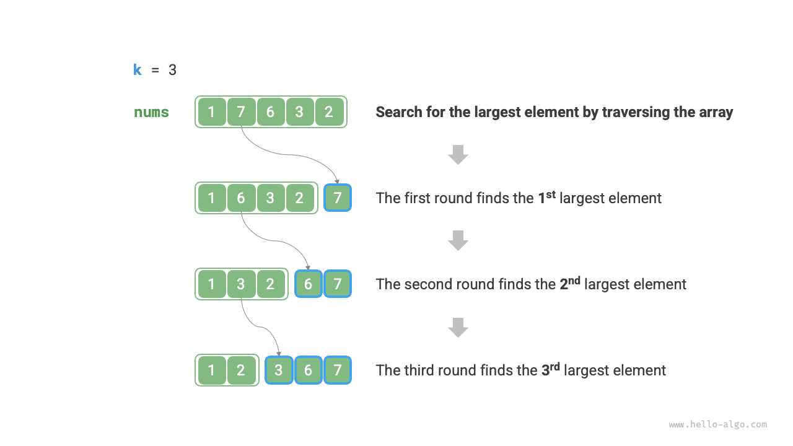
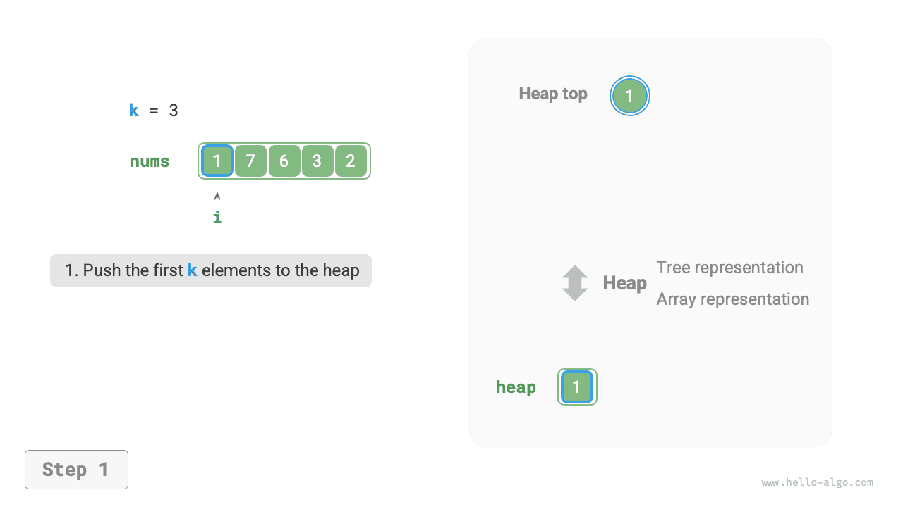
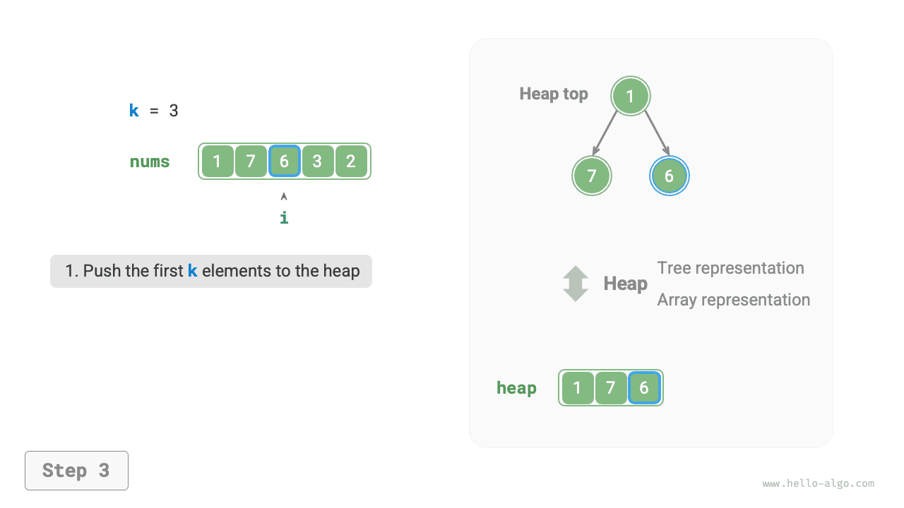
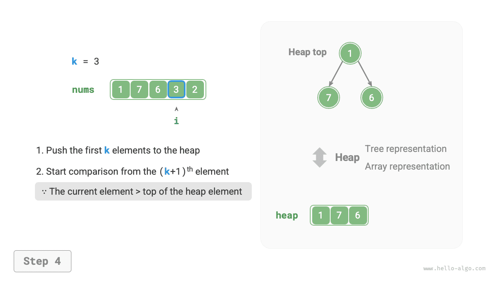
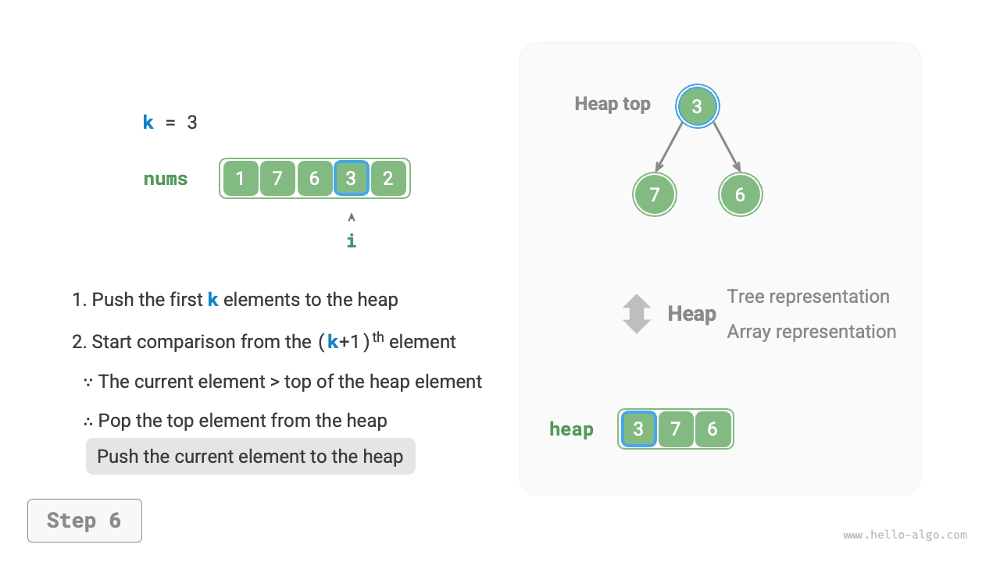

# Задача Top-k

!!! question

    Дан неупорядоченный массив `nums` длины $n$ . Требуется вернуть наибольшие $k$ элементов массива.

Для этой задачи мы сначала покажем два относительно прямолинейных способа решения, а затем более эффективный способ на основе кучи.

## Метод 1: выбор через обход

Как показано на рисунке ниже, можно выполнить $k$ проходов по массиву и на каждом проходе извлекать соответственно $1$-й, $2$-й, $\dots$ , $k$-й по величине элемент; временная сложность такого подхода равна $O(nk)$ .

Этот метод подходит только для случая $k \ll n$ , потому что когда $k$ приближается к $n$ , его временная сложность стремится к $O(n^2)$ , а это уже очень затратно.



!!! tip

    Когда $k = n$ , мы получаем полную упорядоченную последовательность, и в этот момент задача становится эквивалентной алгоритму "сортировка выбором".

## Метод 2: сортировка

Как показано на рисунке ниже, можно сначала отсортировать массив `nums` , а затем вернуть его крайние правые $k$ элементов; временная сложность такого метода равна $O(n \log n)$ .

Очевидно, что этот способ "делает слишком много", потому что нам нужно только найти наибольшие $k$ элементов, а сортировать остальные элементы совсем не обязательно.


## Метод 3: куча

Задачу Top-k можно решить гораздо эффективнее с помощью кучи, как показано на рисунках ниже.

1. Инициализировать минимальную кучу, у которой вершина содержит наименьший элемент.
2. Сначала по очереди поместить в кучу первые $k$ элементов массива.
3. Начиная с элемента номер $k + 1$ , если текущий элемент больше элемента на вершине кучи, то извлечь вершину кучи и поместить в кучу текущий элемент.
4. После завершения обхода в куче будут храниться как раз наибольшие $k$ элементов.

=== "<1>"
    

=== "<2>"
    

=== "<3>"
    

=== "<4>"
    

=== "<5>"
    

=== "<6>"
    

=== "<7>"
    

=== "<8>"
    

=== "<9>"
    

Пример кода приведен ниже:

```src
[file]{top_k}-[class]{}-[func]{top_k_heap}
```

Всего выполняется $n$ операций добавления и извлечения из кучи, а максимальная длина кучи равна $k$ , поэтому временная сложность равна $O(n \log k)$ . Этот метод очень эффективен: когда $k$ мало, временная сложность стремится к $O(n)$ ; когда $k$ велико, она все равно не превышает $O(n \log n)$ .

Кроме того, этот метод подходит и для сценариев с динамическим потоком данных. При непрерывном поступлении новых данных мы можем продолжать поддерживать содержимое кучи, тем самым динамически обновляя наибольшие $k$ элементов.
