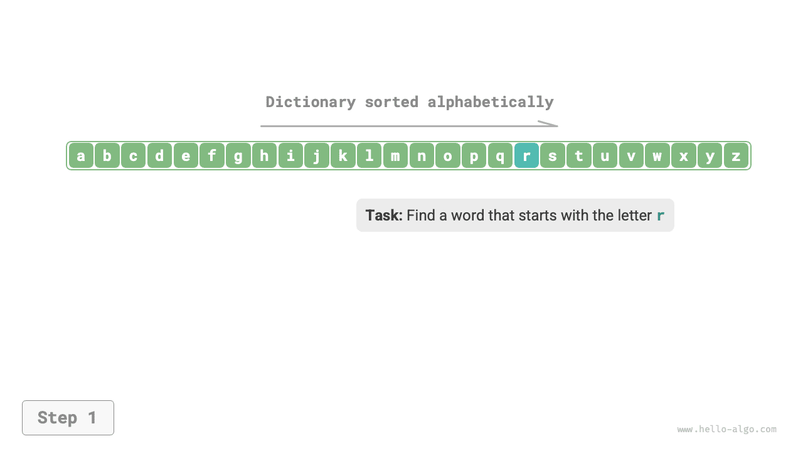
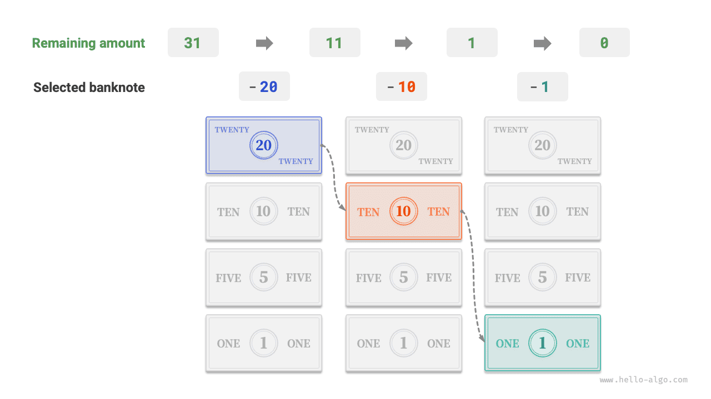

# Алгоритмы повсюду

Когда мы слышим слово "алгоритм", мы естественным образом думаем о математике. Однако на деле многие алгоритмы не связаны со сложной математикой, а в гораздо большей степени опираются на базовую логику, которую можно увидеть повсюду в повседневной жизни.

Прежде чем официально перейти к разговору об алгоритмах, стоит поделиться одним любопытным фактом: **ты уже незаметно для себя освоил множество алгоритмов и привык применять их в повседневной жизни**. Ниже я приведу несколько конкретных примеров, чтобы это показать.

**Пример 1: поиск в словаре**. В английском словаре слова расположены в алфавитном порядке. Предположим, нам нужно найти слово, начинающееся на букву $r$; обычно это делается так, как показано ниже.

1. Открой словарь примерно посередине и посмотри, с какой буквы начинается страница; предположим, это буква $m$.
2. Поскольку в алфавите $r$ идет после $m$, первую половину словаря можно отбросить, и область поиска сузится до второй половины.
3. Повторяй шаги `1.` и `2.` до тех пор, пока не найдешь страницу, на которой слово начинается с буквы $r$.

=== "<1>"
    

=== "<2>"
    

=== "<3>"
    

=== "<4>"
    

=== "<5>"
    

Поиск в словаре, обязательный навык для школьников, на самом деле и есть знаменитый алгоритм "двоичного поиска". С точки зрения структур данных словарь можно рассматривать как отсортированный "массив"; с точки зрения алгоритмов последовательность действий при поиске слова в словаре можно считать алгоритмом "двоичного поиска".

**Пример 2: упорядочивание карт**. Во время игры в карты нам нужно раскладывать карты в руке по возрастанию; процесс выглядит так, как показано ниже.

1. Раздели карты на "упорядоченную" и "неупорядоченную" части и предположи, что в начальный момент самая левая карта уже стоит на правильном месте.
2. Возьми одну карту из неупорядоченной части и вставь ее в правильную позицию внутри упорядоченной части; после этого две самые левые карты уже будут упорядочены.
3. Повторяй шаг `2.` , каждый раз перенося одну карту из неупорядоченной части в упорядоченную, пока все карты не окажутся в порядке.

Описанный выше способ раскладывать карты по сути является алгоритмом "сортировки вставками", который очень эффективен на небольших наборах данных. Во многих языках программирования во встроенных функциях сортировки тоже можно увидеть этот алгоритм.

**Пример 3: выдача сдачи**. Предположим, в супермаркете мы купили товар на $69$ и дали кассиру $100$, поэтому он должен вернуть нам $31$ сдачи. Этот процесс можно наглядно представить так, как показано на рисунке ниже.

1. Доступные варианты - это купюры достоинством меньше $31$, например $1$, $5$, $10$ и $20$.
2. Возьми самую большую купюру из доступных, то есть $20$, тогда останется $31 - 20 = 11$.
3. Возьми самую большую купюру из оставшихся, то есть $10$, тогда останется $11 - 10 = 1$.
4. Возьми самую большую купюру из оставшихся, то есть $1$, тогда останется $1 - 1 = 0$.
5. Выдача сдачи завершена, итоговая комбинация: $20 + 10 + 1 = 31$.

В описанных шагах на каждом этапе выбирается наилучший вариант из доступных в текущий момент, то есть используется купюра наибольшего номинала; в результате получается рабочая схема выдачи сдачи. С точки зрения структур данных и алгоритмов такой подход называется "жадным" алгоритмом.

От приготовления еды до межзвездных путешествий почти любое решение задачи связано с алгоритмами. Появление компьютеров позволило нам хранить структуры данных в памяти и писать код, который вызывает CPU и GPU для выполнения алгоритмов. Благодаря этому мы можем переносить реальные задачи в компьютер и решать самые разные сложные проблемы более эффективно.

!!! tip

    Если ты все еще смутно представляешь себе такие понятия, как структуры данных, алгоритмы, массивы и двоичный поиск, просто продолжай читать. Эта книга постепенно введет тебя в мир понимания структур данных и алгоритмов.
