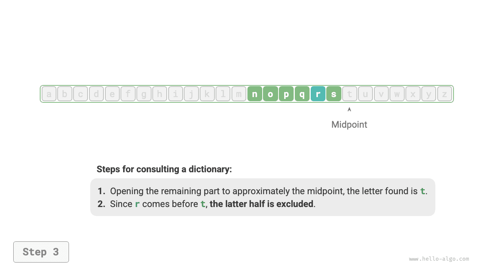
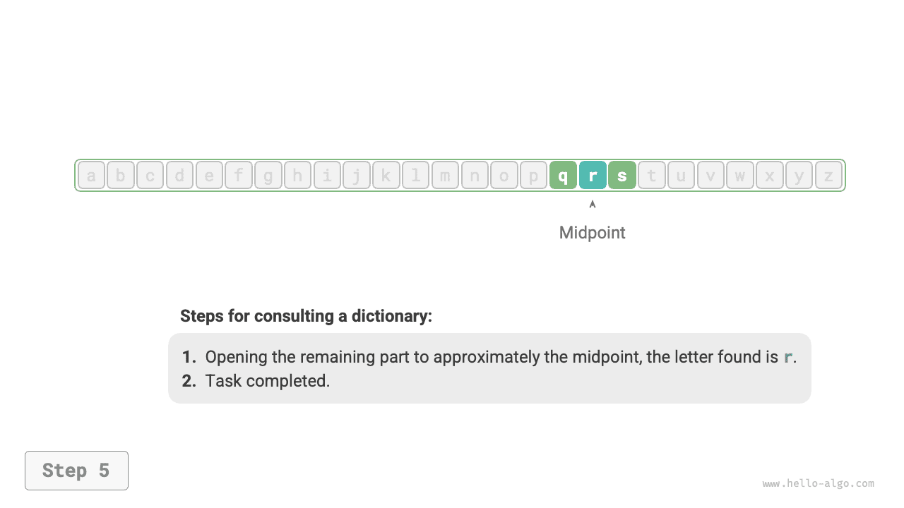
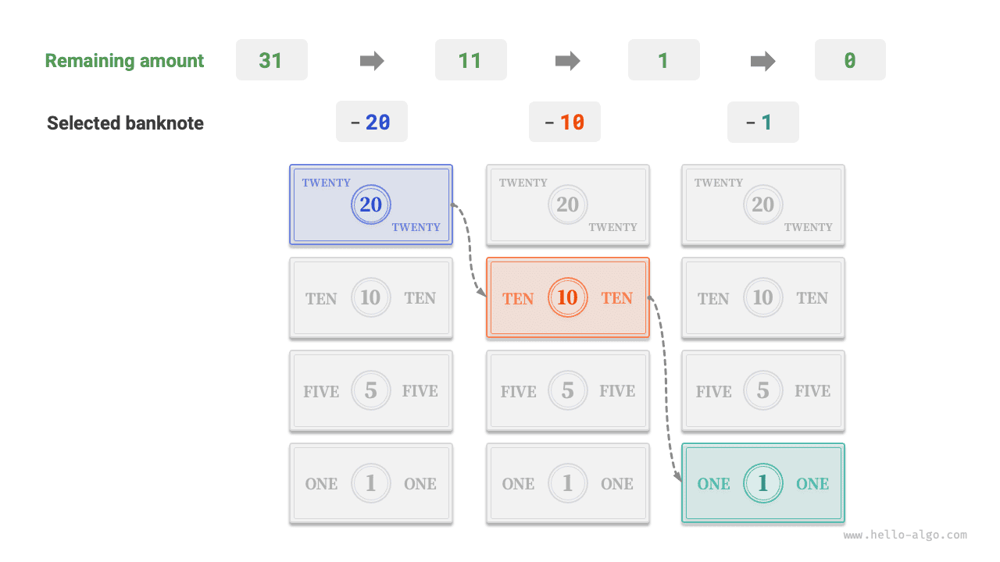

# Алгоритмы повсюду

Говоря об алгоритмах, естественно вспомнить о математике. Однако на самом деле многие алгоритмы не связаны со сложной математикой, а больше полагаются на базовую логику, которая повсеместно встречается в нашей повседневной жизни.

Прежде чем углубиться в обсуждение алгоритмов, стоит упомянуть интересный факт: **вы уже точно освоили множество алгоритмов и привыкли применять их в повседневной жизни**. Далее приведем несколько конкретных примеров, чтобы подтвердить этот факт.

**Пример 1: поиск в словаре**. В словаре все слова упорядочены по алфавиту. Предположим, нам нужно найти слово, начинающееся на букву «r». Обычно для этого нужно выполнить следующие действия. (см. рис. 1.1):

1. открыть словарь примерно на половине страниц и посмотреть, какая буква является первой на этой странице; предположим, это буква «m».
2. поскольку в алфавите буква «r» идет после «m», исключаем первую половину словаря, и область поиска сужается до второй половины.
3. продолжаем повторять шаги `1.` и `2.` , пока не найдем страницу, где первой буквой слов будет «r».

【comments from yuyan】以下为该章节的通病，后续不再赘述
1.俄语中通常用«»表示引号，在书籍版本中用了该形式没有用斜体。俄语中的斜体通常用于大段的文学引文，很少用于单个字母，建议按照俄语读者习惯修改，且建议取消斜体
2.俄语中分号用的非常少，一般句子完整直接用句号结尾，书籍版本基本都处理成了句号，例如上述。
3.书籍版本中添加了(см. рис. 1.1)，电子版中没有，意思是如图1.1，符合俄语写作规范，但是不一定需要加，不是必须
4.открытьAI改成了откройте是祈使句的两种表达，AI版本更加客气，类似于加了“请”
5.书籍版本1.2.3.开头没有大写，电子版大写了，根据学术规范是不需要大写的。
6.第三步因为表达方式不同变位稍有不同，书籍版更合理。
7.脚注Рисунок 1-1 不符合学术规范，应该统一成书籍版本，Рис. 1.1.。且电子版是1-5组合在一个位置，应该是Рис. 1.1. Этапы поиска в словаре. Шаг 1-5，这个脚注我在网页上看到了，这个VSCODE系统我没看到

=== "<1>"
    

=== "<2>"
    

=== "<3>"
    

=== "<4>"
    

=== "<5>"
    

Навык поиска в словаре, которым владеет каждый школьник, на самом деле является известным алгоритмом двоичного поиска. С точки зрения структуры данных словарь можно рассматривать как отсортированный массив. С точки зрения алгоритма последовательность операций по поиску в словаре можно считать двоичным поиском.

**Пример 2: упорядочивание карт**. Во время игры в карты необходимо каждый раз упорядочивать карты в руке от меньшего к большему. Для этого нужно выполнить следующие действия. (см. рис. 1.2):

1. разделить карты на упорядоченную и неупорядоченную части, предполагая, что изначально самая левая карта уже упорядочена;
2. из неупорядоченной части извлечь одну карту и вставить ее в правильное место в упорядоченной части. После этого две самые левые карты станут упорядоченными;
3. повторять шаг `2.` , каждый раз перемещая одну карту из неупорядоченной части в упорядоченную, пока все карты не станут упорядоченными.

Метод упорядочивания карт по своей сути является алгоритмом сортировки вставками, который весьма эффективен при обработке небольших наборов данных. Многие функции сортировки в библиотеках программирования используют именно этот алгоритм.

**Пример 3: сдача**. Предположим, что в супермаркете мы купили товар стоимостью $69$ руб. и дали кассиру купюру в $100$ руб. Кассир должен вернуть нам $31$ руб. Для этого ему нужно выполнить действия, показанные на рис. 1.3.
【comments from yuyan】此处有语义微调，意思大体相同，书籍版本强调了是1.3中展示的步骤，电子版没有强调，只说接下来的步骤

1. Варианты выбора – это купюры номиналом меньше $31$ руб. Пусть у нас имеются номиналы $1$ , $5$ , $10$ и $20$ руб.
2. Взять самую крупную доступную купюру в $20$ руб. Остаток сдачи составит $31 - 20 = 11$ руб.
3. Взять самую крупную из оставшихся купюр в $10$ руб. Остаток составит $11 - 10 = 1$ руб.
4. Взять самую крупную из оставшихся купюр в $1$ руб. Остаток составит $1 - 1 = 0$ руб.
5. Завершить выдачу сдачи, схема: $20 + 10 + 1 = 31$ руб.
【comments from yuyan】–这个符号作为俄语的破折号经常出现在行文中，输入法和长度比较特殊，不是英文的-，也不是汉语的——。如果细致改动建议让AI直接使用替换

В этих шагах мы на каждом этапе выбираем наилучший вариант (используя купюры наибольшего номинала), в итоге получая оптимальную схему сдачи. С точки зрения структуры данных и алгоритмов этот метод по своей сути является жадным алгоритмом.
【comments from yuyan】
1.电子版把（尽可能用大面额的货币）改成了用逗号连接，个人认为更符合俄语表达习惯，书籍版本俄罗斯人也能理解
2.书籍版本оптимальную反而没有рабочую符合“可行的”这个意思

От приготовления блюда до межзвездных путешествий – решение практически любой задачи неразрывно связано с алгоритмами. Появление компьютеров позволило нам с помощью программирования хранить структуры данных в памяти, а также писать код для вызовов к центральному и графическому процессору для выполнения алгоритмов. Таким образом, мы можем переносить задачи из реальной жизни в компьютер, решая различные сложные проблемы более эффективно.
【comments from yuyan】电子版漏掉了破折号，且把GPU和CPU保留了英文

!!! Совет
【Comments from Yuyan】每一章的贴士都写成了英文tip

    Если вы все еще испытываете трудности с пониманием таких понятий, как структуры данных, алгоритмы, массивы и двоичный поиск, продолжайте чтение. Эта книга проведет вас в мир знаний об этих фундаментальных понятиях.

【Comments from Yuyan】同abstract，AI没有识别出来，自己进行了翻译，此处省略掉了很多信息，不如书籍版本