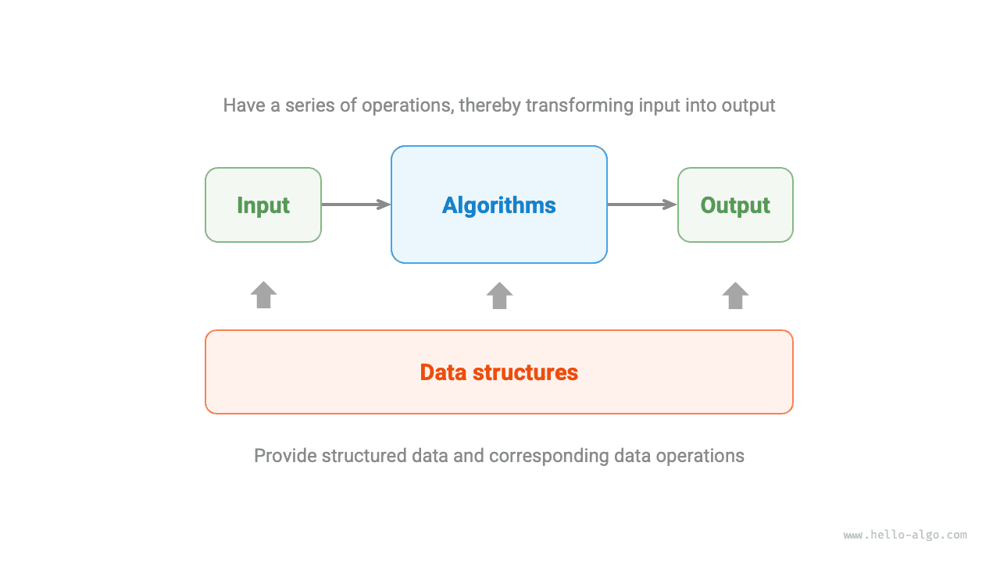

# Что такое алгоритм
【comments from yuyan】俄语序号一般是1.2./1.2.2.，在最后面还有一个点，这个能否修改出厂设置，在最后面加点，如果加不了不影响阅读

## Определение алгоритма

<u>Алгоритм (algorithm)</u> - это набор инструкций или шагов, предназначенных для решения конкретной задачи за ограниченное время, , обладающий следующими свой- ствами:
【comments from yuyan】
1.Алгоритм (algorithm)俄语一般要斜体表示专有名词，下同（Структура данных (data structure)），建议针对性修改。
2.此处属于复合句和简单句的区别，语义相同，书籍版本更加学术化规范化

- задача четко определена, включает ясные определения входных и выходных данных;
- обладает осуществимостью, может быть выполнен за ограниченное количество шагов, времени и памяти;
- каждый шаг имеет определенное значение, при одинаковых входных данных и условиях выполнения результат всегда будет одинаковым.

## Определение структуры данных

<u>Структура данных (data structure)</u> - это способ организации и хранения данных, включающий содержимое данных, их взаимосвязи и методы операций с ними. Структура данных преследует следующие цели.

- минимизацию занимаемого пространства для экономии памяти ком- пьютера;
- максимально быструю обработку данных, включая доступ, добавление, удаление и обновление данных;
- обеспечение простого представления данных и логической информации для эффективного выполнения алгоритмов.
【comments from yuyan】此处电子版是动词结构，书籍是名词结构，结构差别较大，但是不影响阅读

**Проектирование структуры данных – это процесс, полный компромиссов**. Если вы хотите улучшить один аспект, часто приходится идти на уступки в другом. Приведем два примера.

- Связный список, по сравнению с массивом, более удобен для добавления и удаления данных, но имеет проблемы со скоростью доступа к данным.
- Граф, по сравнению со связным списком, предоставляет более богатую логическую информацию, но требует большего объема памяти.

## Взаимосвязь структур данных и алгоритмов
【comments from yuyan】翻译有明显出入，书籍版本翻译得更好，连带着图片注释错误

Cтруктуры данных и алгоритмы тесно взаимосвязаны, что проявляется в следующих трех аспектах (см. рис. 1.4):

- структуры данных являются основой алгоритмов. Они обеспечивают структурированное хранение данных и методы их обработки.
- алгоритмы оживляют структуры данных. Сами по себе структуры данных лишь хранят информацию, но в сочетании с алгоритмами они позволяют решать конкретные задачи.
- алгоритмы можно реализовать на основе различных структур данных, однако эффективность их выполнения может значительно различаться. Поэтому выбор подходящей структуры данных является ключевым фактором.

Структуры данных и алгоритмы подобны конструктору, как показано на рис. 1.5. Комплект конструктора, помимо множества деталей, содержит также подробную инструкцию по сборке. Следуя этой инструкции шаг за шагом, можно собрать красивую модель.

Подробное описание аналогии с конструктором представлено в табл. 1.1.
【comments from yuyan】同之前，рис.和табл.是更加学术化的表达，且把几点几都写清楚了，书籍版本更好；表格注释Таблица 1.1.是比较规范的表达，能不能修改出厂设置匹配起来，如若不能不影响阅读

 Таблица <id> &nbsp; Сравнение структур данных и алгоритмов с конструктором 

| Структуры данных и алгоритмы | Конструктор |
| ---------------------------- | ----------- |
| Входные данные               | Несобранные детали конструктора |
| Структура данных             | Организация деталей конструктора, включая форму, размер, способы соединения и т. д. |
| Алгоритм                     | Последовательность действий по сборке деталей в целевую модель |
| Выходные данные              | Собранная модель конструктора |

Стоит отметить, что структуры данных и алгоритмы не зависят от языка программирования. Именно поэтому данная книга предлагает их реализации на различных языках.

!!! tip "Условные сокращения"

    На практике мы часто сокращаем «структуры данных и алгоритмы» до просто «алгоритмы». Например, известные задачи на платформе LeetCode на самом деле проверяют знания как структур данных, так и алгоритмов.
【Comments from Yuyan】同abstract，AI没有识别出来，自己进行了翻译，此处省略掉了很多信息，不如书籍版本