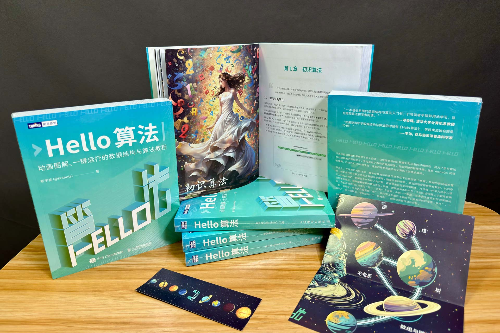
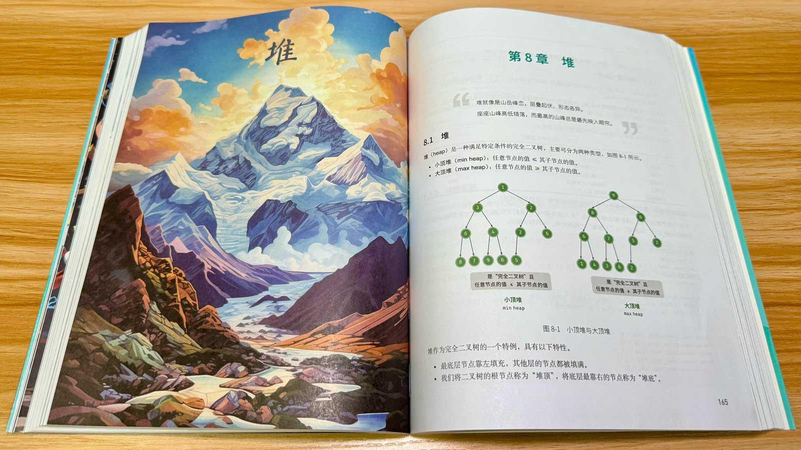
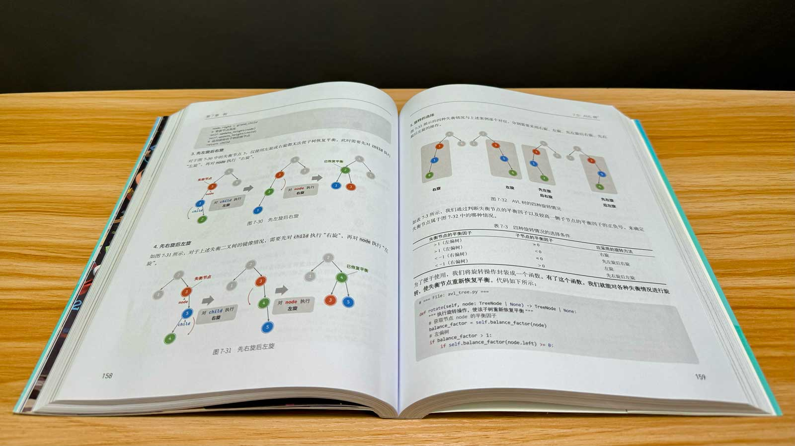
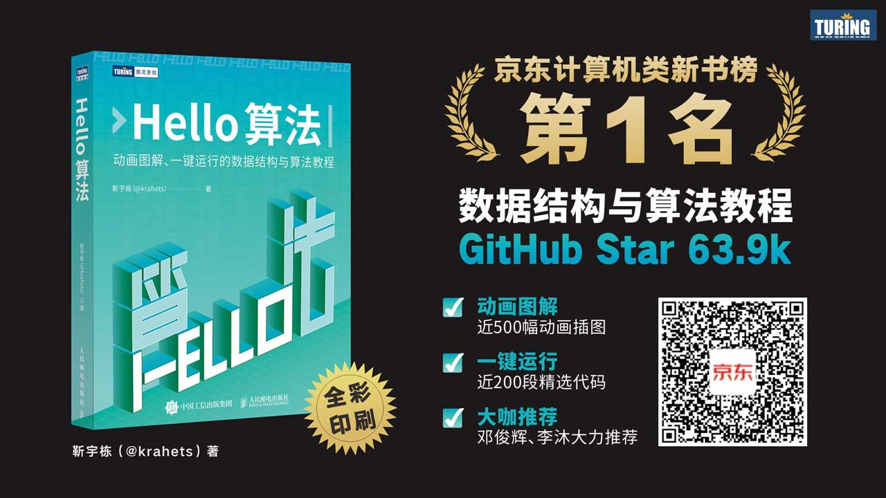

# Бумажная книга

<!-- 🔴 俄文版缺失此段落 -->
<!-- 中文原文：经过长时间的打磨，《Hello 算法》纸质书终于发布了！此时的心情可以用一句诗来形容： -->

<!-- 🔴 俄文版缺失此段落 -->
<!-- 中文原文：
追风赶月莫停留，平芜尽处是春山。
 -->

<!-- 🔴 俄文版缺失此段落 -->
<!-- 中文原文：{ class="animation-figure" } -->

<!-- 🔴 俄文版缺失此段落 -->
<!-- 中文原文：以下视频展示了纸质书，并且包含我的一些思考： -->

<!-- 🔴 俄文版缺失此段落 -->
<!-- 中文原文：- 学习数据结构与算法的重要性。 -->

<!-- 🔴 俄文版缺失此段落 -->
<!-- 中文原文：- 为什么在纸质书中选择 Python。 -->

<!-- 🔴 俄文版缺失此段落 -->
<!-- 中文原文：- 对知识分享的理解。 -->

<!-- 🔴 俄文版缺失此段落 -->
<!-- 中文原文：> 新人 UP 主，请多多关照、一键三连～谢谢！ -->

<!-- 🔴 俄文版缺失此段落 -->
<!-- 中文原文：
... -->

<!-- 🔴 俄文版缺失此段落 -->
<!-- 中文原文：附纸质书快照： -->

<!-- 🔴 俄文版缺失此段落 -->
<!-- 中文原文：{ class="animation-figure" } -->

<!-- 🔴 俄文版缺失此段落 -->
<!-- 中文原文：{ class="animation-figure" } -->

## Преимущества и недостатки

<!-- 🔴 俄文版缺失此段落 -->
<!-- 中文原文：总结一下纸质书可能会给大家带来惊喜的地方： -->

<!-- 🔴 俄文版缺失此段落 -->
<!-- 中文原文：- 采用全彩印刷，能够原汁原味地发挥出本书"动画图解"的优势。 -->

<!-- 🔴 俄文版缺失此段落 -->
<!-- 中文原文：- 考究纸张材质，既保证色彩高度还原，也保留纸质书特有的质感。 -->

<!-- 🔴 俄文版缺失此段落 -->
<!-- 中文原文：- 纸质版比网页版的格式更加规范，例如图中的公式使用斜体。 -->

<!-- 🔴 俄文版缺失此段落 -->
<!-- 中文原文：- 在不提升定价的前提下，附赠思维导图折页、书签。 -->

<!-- 🔴 俄文版缺失此段落 -->
<!-- 中文原文：- 纸质书、网页版、PDF 版内容同步，随意切换阅读。 -->

<!-- 🔴 俄文版缺失此段落 -->
<!-- 中文原文：!!! tip 由于纸质书和网页版的同步难度较大，因此可能会有一些细节上的不同，请您见谅！ -->

<!-- 🔴 俄文版缺失此段落 -->
<!-- 中文原文：当然，纸质书也有一些值得大家入手前考虑的地方： -->

<!-- 🔴 俄文版缺失此段落 -->
<!-- 中文原文：- 使用 Python 语言，可能不匹配你的主语言（可以把 Python 看作伪代码，重在理解思路）。 -->

<!-- 🔴 俄文版缺失此段落 -->
<!-- 中文原文：- 全彩印刷虽然大幅提升了图解和代码的阅读体验，但价格会比黑白印刷高一些。 -->

<!-- 🔴 俄文版缺失此段落 -->
<!-- 中文原文：!!! tip "印刷质量"和"价格"就像算法中的"时间效率"和"空间效率"，难以两全。而我认为，"印刷质量"对应的是"时间效率"，更应该被注重。 -->

## Ссылка для покупки

<!-- 🔴 俄文版缺失此段落 -->
<!-- 中文原文：如果你对纸质书感兴趣，可以考虑入手一本。我们为大家争取到了新书 5 折优惠，请见[此链接](https://3.cn/1X-qmTD3)或扫描以下二维码： -->

<!-- 🔴 俄文版缺失此段落 -->
<!-- 中文原文：{ class="animation-figure" } -->

## Послесловие

<!-- 🔴 俄文版缺失此段落 -->
<!-- 中文原文：起初，我低估了纸质书出版的工作量，以为只要维护好了开源项目，纸质版就可以通过某些自动化手段生成出来。实践证明，纸质书的生产流程与开源项目的更新机制存在很大的不同，两者之间的转化需要做许多额外工作。 -->

<!-- 🔴 俄文版缺失此段落 -->
<!-- 中文原文：一本书的初稿与达到出版标准的定稿之间仍有较长距离，需要出版社（策划、编辑、设计、市场等）与作者的通力合作、长期雕琢。在此感谢图灵策划编辑王军花、以及人民邮电出版社和图灵社区每位参与本书出版流程的工作人员！ -->

<!-- 🔴 俄文版缺失此段落 -->
<!-- 中文原文：希望这本书能够帮助到你！ -->
