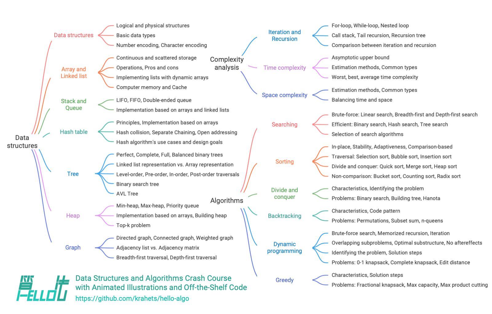

# Об этой книге

Этот проект направлен на создание открытого, бесплатного и дружелюбного к новичкам вводного пособия по структурам данных и алгоритмам.

- Вся книга построена на анимированных иллюстрациях: материал изложен ясно и последовательно, а кривая обучения остается плавной, помогая начинающим постепенно увидеть карту знаний по структурам данных и алгоритмам.
- Исходный код можно запускать одним нажатием, что помогает читателю через практику развивать навыки программирования и понимать, как работают алгоритмы и как устроены структуры данных на базовом уровне.
- Мы призываем читателей учиться друг у друга: задавайте вопросы и делитесь своими наблюдениями в комментариях, чтобы вместе продвигаться вперед через обсуждение и обмен идеями.

## Целевая аудитория

Если ты только начинаешь изучать алгоритмы, никогда раньше с ними не сталкивался или уже решал некоторые задачи, но все еще смутно представляешь себе структуры данных и алгоритмы и постоянно колеблешься между "понимаю" и "не понимаю", то эта книга создана именно для тебя!

Если у тебя уже накопился определенный опыт решения задач и ты знаком с большинством типовых вопросов, книга поможет тебе системно повторить и упорядочить знания об алгоритмах, а исходный код из репозитория можно использовать как "инструментарий для решения задач" или как "алгоритмический словарь".

Если же ты уже настоящий "гуру" алгоритмов, мы будем рады получить твои ценные замечания или [создавать книгу вместе](https://www.hello-algo.com/chapter_appendix/contribution/).

!!! success "Предварительные требования"

    Тебе нужна хотя бы базовая подготовка в одном из языков программирования, чтобы читать и писать простой код.

## Структура содержания

Основное содержание книги показано на рисунке ниже.

- **Анализ сложности**: измерения и методы оценки структур данных и алгоритмов. Способы вычисления временной и пространственной сложности, распространенные типы, примеры и т. д.
- **Структуры данных**: способы классификации базовых типов данных и структур данных. Определения, достоинства и недостатки, основные операции, распространенные разновидности, типичные применения и методы реализации массивов, связных списков, стеков, очередей, хеш-таблиц, деревьев, куч, графов и других структур.
- **Алгоритмы**: определения, достоинства и недостатки, эффективность, области применения, этапы решения и примеры задач для поиска, сортировки, разделяй-и-властвуй, поиска с возвратом, динамического программирования и жадных алгоритмов.

## Благодарности

Эта книга непрерывно совершенствуется благодаря совместным усилиям множества участников сообщества open source. Спасибо каждому автору, который вложил свое время и силы; их имена перечислены в порядке, автоматически сгенерированном GitHub: krahets, coderonion, Gonglja, nuomi1, Reanon, justin-tse, hpstory, danielsss, curtishd, night-cruise, S-N-O-R-L-A-X, rongyi, msk397, gvenusleo, khoaxuantu, rivertwilight, K3v123, gyt95, zhuoqinyue, yuelinxin, Zuoxun, mingXta, Phoenix0415, FangYuan33, GN-Yu, longsizhuo, IsChristina, xBLACKICEx, guowei-gong, Cathay-Chen, pengchzn, QiLOL, magentaqin, hello-ikun, JoseHung, qualifier1024, thomasq0, sunshinesDL, L-Super, Guanngxu, Transmigration-zhou, WSL0809, Slone123c, lhxsm, yuan0221, what-is-me, Shyam-Chen, theNefelibatas, longranger2, codeberg-user, xiongsp, JeffersonHuang, prinpal, seven1240, Wonderdch, malone6, xiaomiusa87, gaofer, bluebean-cloud, a16su, SamJin98, hongyun-robot, nanlei, XiaChuerwu, yd-j, iron-irax, mgisr, steventimes, junminhong, heshuyue, danny900714, MolDuM, Nigh, Dr-XYZ, XC-Zero, reeswell, PXG-XPG, NI-SW, Horbin-Magician, Enlightenus, YangXuanyi, beatrix-chan, DullSword, xjr7670, jiaxianhua, qq909244296, iStig, boloboloda, hts0000, gledfish, wenjianmin, keshida, kilikilikid, lclc6, lwbaptx, linyejoe2, liuxjerry, llql1211, fbigm, echo1937, szu17dmy, dshlstarr, Yucao-cy, coderlef, czruby, bongbongbakudan, beintentional, ZongYangL, ZhongYuuu, ZhongGuanbin, hezhizhen, linzeyan, ZJKung, luluxia, xb534, ztkuaikuai, yw-1021, ElaBosak233, baagod, zhouLion, yishangzhang, yi427, yanedie, yabo083, weibk, wangwang105, th1nk3r-ing, tao363, 4yDX3906, syd168, sslmj2020, smilelsb, siqyka, selear, sdshaoda, Xi-Row, popozhu, nuquist19, noobcodemaker, XiaoK29, chadyi, lyl625760, lucaswangdev, 0130w, shanghai-Jerry, EJackYang, Javesun99, eltociear, lipusheng, KNChiu, BlindTerran, ShiMaRing, lovelock, FreddieLi, FloranceYeh, fanchenggang, gltianwen, goerll, nedchu, curly210102, CuB3y0nd, KraHsu, CarrotDLaw, youshaoXG, bubble9um, Asashishi, Asa0oo0o0o, fanenr, eagleanurag, akshiterate, 52coder, foursevenlove, KorsChen, GaochaoZhu, hopkings2008, yang-le, realwujing, Evilrabbit520, Umer-Jahangir, Turing-1024-Lee, Suremotoo, paoxiaomooo, Chieko-Seren, Allen-Scai, ymmmas, Risuntsy, Richard-Zhang1019, RafaelCaso, qingpeng9802, primexiao, Urbaner3, zhongfq, nidhoggfgg, MwumLi, CreatorMetaSky, martinx, ZnYang2018, hugtyftg, logan-qiu, psychelzh, Keynman, KeiichiKasai и KawaiiAsh.

Рецензирование кода для этой книги выполнили coderonion, curtishd, Gonglja, gvenusleo, hpstory, justin-tse, khoaxuantu, krahets, night-cruise, nuomi1, Reanon и rongyi (в алфавитном порядке). Спасибо им за время и силы: именно они обеспечили единообразие и стандартизацию кода на разных языках.

Традиционную китайскую версию книги вычитали Shyam-Chen и Dr-XYZ, английскую версию - yuelinxin, K3v123, QiLOL, Phoenix0415, SamJin98, yanedie, RafaelCaso, pengchzn, thomasq0 и magentaqin, а японскую версию - eltociear. Именно благодаря их постоянному вкладу эта книга может быть полезна более широкому кругу читателей, и мы искренне благодарим их.

Инструмент генерации ePub-версии этой книги разработал zhongfq. Благодарим его за вклад, который дал читателям более гибкий способ чтения.

Во время работы над этой книгой мне помогало очень много людей.

- Спасибо моему наставнику в компании, доктору Ли Си: в одной из бесед ты подтолкнул меня "быстрее начать", и это укрепило мою решимость написать эту книгу;
- Спасибо моей девушке Bubble, первому читателю этой книги: с позиции новичка в алгоритмах ты дала много ценных замечаний, благодаря которым книга стала понятнее для начинающих;
- Спасибо Tengbao, Qibao и Feibao за придуманное ими креативное название книги, которое возвращает нас к теплому воспоминанию о первой строке кода "Hello World!";
- Спасибо Xiaoquan за профессиональную помощь по вопросам интеллектуальной собственности: она сыграла важную роль в совершенствовании этой открытой книги;
- Спасибо Sutong за прекрасный дизайн обложки и логотипа, а также за терпеливые многочисленные правки, на которые тебя вдохновлял мой перфекционизм;
- Спасибо @squidfunk за советы по верстке и за созданную им открытую тему документации [Material-for-MkDocs](https://github.com/squidfunk/mkdocs-material/tree/master).

Во время написания книги я прочитал множество учебников и статей по структурам данных и алгоритмам. Эти работы стали для книги прекрасными образцами и помогли обеспечить точность и качество материала. Я искренне благодарю всех преподавателей и предшественников за их выдающийся вклад!

Эта книга пропагандирует способ обучения, в котором работают и руки, и голова; в этом отношении на меня сильно повлияла [Dive into Deep Learning](https://github.com/d2l-ai/d2l-zh). Я горячо рекомендую эту замечательную работу всем читателям.

**От всего сердца благодарю моих родителей: именно ваша постоянная поддержка и ободрение дали мне возможность заниматься этим интересным делом**.
