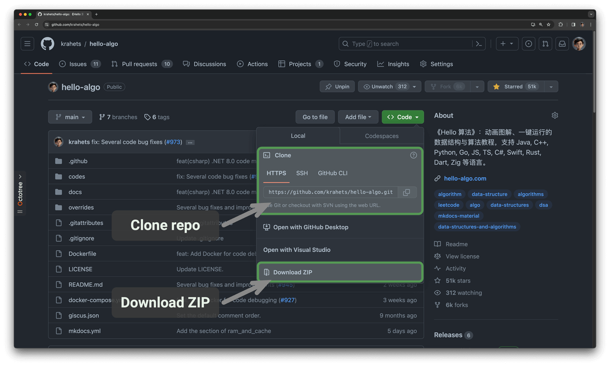
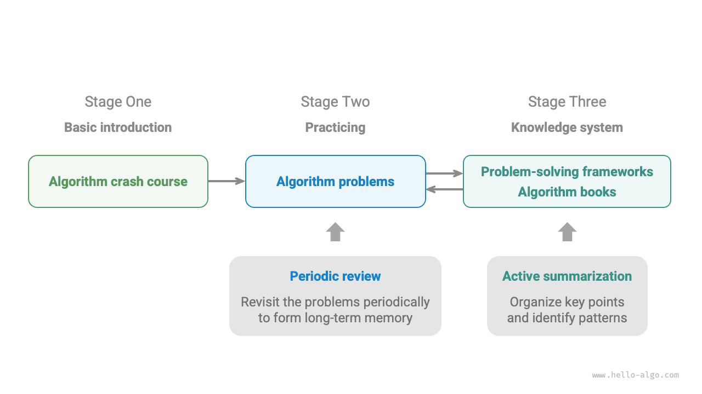

# Как пользоваться этой книгой

!!! tip

    Чтобы получить наилучший опыт чтения, рекомендуется полностью прочитать этот раздел.

## Соглашения о стиле изложения

- Разделы, помеченные `*` в заголовке, являются дополнительными и сравнительно более сложными. Если времени мало, их можно пока пропустить.
- Технические термины будут выделяться полужирным шрифтом (в бумажной и PDF-версиях) или подчеркиванием (в веб-версии), например <u>массив (array)</u>. Рекомендуется запоминать их, чтобы легче читать техническую литературу.
- Ключевое содержание и итоговые формулировки будут **выделяться полужирным**, и на такие фрагменты стоит обращать особое внимание.
- Слова и выражения со специальным смыслом будут отмечаться "кавычками", чтобы избежать неоднозначности.
- Когда названия различаются между языками программирования, эта книга ориентируется на Python; например, для обозначения "пустого" значения используется `None`.
- В книге частично отказались от строгих правил оформления комментариев в языках программирования ради более компактной верстки. Комментарии в основном делятся на три типа: комментарии-заголовки, содержательные комментарии и многострочные комментарии.

=== "Python"

    ```python title=""
    """Комментарий-заголовок: используется для обозначения функций, классов, тестовых примеров и т. п."""
    
    # Содержательный комментарий: подробно поясняет код
    
    """
    Многострочный
    комментарий
    """
    ```

=== "C++"

    ```cpp title=""
    /* Комментарий-заголовок: используется для обозначения функций, классов, тестовых примеров и т. п. */
    
    // Содержательный комментарий: подробно поясняет код
    
    /**
     * Многострочный
     * комментарий
     */
    ```

=== "Java"

    ```java title=""
    /* Комментарий-заголовок: используется для обозначения функций, классов, тестовых примеров и т. п. */
    
    // Содержательный комментарий: подробно поясняет код
    
    /**
     * Многострочный
     * комментарий
     */
    ```

=== "C#"

    ```csharp title=""
    /* Комментарий-заголовок: используется для обозначения функций, классов, тестовых примеров и т. п. */
    
    // Содержательный комментарий: подробно поясняет код
    
    /**
     * Многострочный
     * комментарий
     */
    ```

=== "Go"

    ```go title=""
    /* Комментарий-заголовок: используется для обозначения функций, классов, тестовых примеров и т. п. */
    
    // Содержательный комментарий: подробно поясняет код
    
    /**
     * Многострочный
     * комментарий
     */
    ```

=== "Swift"

    ```swift title=""
    /* Комментарий-заголовок: используется для обозначения функций, классов, тестовых примеров и т. п. */
    
    // Содержательный комментарий: подробно поясняет код
    
    /**
     * Многострочный
     * комментарий
     */
    ```

=== "JS"

    ```javascript title=""
    /* Комментарий-заголовок: используется для обозначения функций, классов, тестовых примеров и т. п. */
    
    // Содержательный комментарий: подробно поясняет код
    
    /**
     * Многострочный
     * комментарий
     */
    ```

=== "TS"

    ```typescript title=""
    /* Комментарий-заголовок: используется для обозначения функций, классов, тестовых примеров и т. п. */
    
    // Содержательный комментарий: подробно поясняет код
    
    /**
     * Многострочный
     * комментарий
     */
    ```

=== "Dart"

    ```dart title=""
    /* Комментарий-заголовок: используется для обозначения функций, классов, тестовых примеров и т. п. */
    
    // Содержательный комментарий: подробно поясняет код
    
    /**
     * Многострочный
     * комментарий
     */
    ```

=== "Rust"

    ```rust title=""
    /* Комментарий-заголовок: используется для обозначения функций, классов, тестовых примеров и т. п. */

    // Содержательный комментарий: подробно поясняет код
    
    /**
     * Многострочный
     * комментарий
     */
    ```

=== "C"

    ```c title=""
    /* Комментарий-заголовок: используется для обозначения функций, классов, тестовых примеров и т. п. */
    
    // Содержательный комментарий: подробно поясняет код
    
    /**
     * Многострочный
     * комментарий
     */
    ```

=== "Kotlin"

    ```kotlin title=""
    /* Комментарий-заголовок: используется для обозначения функций, классов, тестовых примеров и т. п. */
    
    // Содержательный комментарий: подробно поясняет код
    
    /**
     * Многострочный
     * комментарий
     */
    ```

=== "Ruby"

    ```ruby title=""
    ### Комментарий-заголовок: используется для обозначения функций, классов, тестовых примеров и т. п. ###

    # Содержательный комментарий: подробно поясняет код
    
    # Многострочный
    # комментарий
    ```

## Эффективное обучение с помощью анимированных иллюстраций

По сравнению с текстом видео и изображения обладают большей информационной плотностью и более четкой структурой, поэтому их легче воспринимать. В этой книге **ключевые и сложные идеи в основном будут показываться в виде анимированных иллюстраций**, а текст будет играть роль пояснения и дополнения.

Если во время чтения ты встречаешь фрагмент с анимированной иллюстрацией, как на рисунке ниже, **в первую очередь ориентируйся на изображение, а текст используй как дополнение**, соединяя оба источника для понимания материала.


## Углубление понимания через практику кода

Сопроводительный код этой книги размещен в [репозитории GitHub](https://github.com/krahets/hello-algo). Как показано ниже, **исходный код снабжен тестовыми примерами и может запускаться одним нажатием**.

Если позволяет время, **рекомендуется самостоятельно перепечатать код**. Если времени на обучение мало, то хотя бы полностью прочитай и запусти весь код.

По сравнению с простым чтением кода сам процесс его написания обычно дает больше пользы. **Учиться на практике - значит учиться по-настоящему**.


Подготовка к запуску кода в основном состоит из трех шагов.

**Шаг 1: установить локальную среду программирования**. Воспользуйся [руководством](https://www.hello-algo.com/chapter_appendix/installation/) из приложения. Если среда уже установлена, этот шаг можно пропустить.

**Шаг 2: клонировать или скачать репозиторий с кодом**. Перейди в [репозиторий GitHub](https://github.com/krahets/hello-algo). Если у тебя уже установлен [Git](https://git-scm.com/downloads), репозиторий можно клонировать следующей командой:

```shell
git clone https://github.com/krahets/hello-algo.git
```

Конечно, можно также нажать кнопку "Download ZIP" в месте, показанном на рисунке ниже, напрямую скачать архив с кодом и затем распаковать его локально.



**Шаг 3: запустить исходный код**. Как показано на рисунке ниже, для блоков кода, у которых сверху указано имя файла, соответствующий исходный файл можно найти в папке `codes` репозитория. Эти файлы запускаются одним нажатием, что помогает не тратить лишнее время на отладку и сосредоточиться на изучении материала.


Помимо локального запуска, **веб-версия также поддерживает визуальный запуск Python-кода** (на базе [pythontutor](https://pythontutor.com/)). Как показано ниже, можно нажать "Визуализировать выполнение" под блоком кода, чтобы раскрыть окно и наблюдать за выполнением алгоритма; также можно нажать "Полноэкранный режим", чтобы получить более удобный просмотр.


## Совместный рост через вопросы и обсуждения

Во время чтения книги не стоит легко пропускать те места, которые остались непонятными. **Смело задавай свои вопросы в разделе комментариев**: я и мои друзья постараемся ответить тебе как можно тщательнее, обычно в течение двух дней.

Как показано на рисунке ниже, в веб-версии у каждой главы внизу есть раздел комментариев. Надеюсь, ты будешь чаще обращать внимание на его содержание. С одной стороны, это поможет увидеть, с какими трудностями сталкиваются другие читатели, восполнить пробелы и подтолкнуть себя к более глубоким размышлениям. С другой стороны, буду рад, если ты щедро ответишь на вопросы других участников, поделишься своими наблюдениями и поможешь им продвинуться вперед.


## Дорожная карта изучения алгоритмов

В целом процесс изучения структур данных и алгоритмов можно разделить на три этапа.

1. **Этап 1: введение в алгоритмы**. Нужно познакомиться с особенностями и способами применения разных структур данных, а также изучить принципы, ход работы, назначение и эффективность различных алгоритмов.
2. **Этап 2: решение алгоритмических задач**. Рекомендуется начинать с популярных задач и сначала накопить не менее 100 решенных примеров, чтобы познакомиться с основными типами алгоритмических проблем. На первых порах "забывание знаний" может стать испытанием, но это нормально. Мы можем повторять задачи по "кривой забывания Эббингауза", и обычно после 3-5 циклов повторения материал прочно закрепляется. Рекомендуемые списки задач и планы практики см. в этом [репозитории GitHub](https://github.com/krahets/LeetCode-Book).
3. **Этап 3: построение системы знаний**. В учебной части можно читать статьи по алгоритмам, разбирать каркасы решений и учебники, чтобы постоянно обогащать свою систему знаний. В практической части можно пробовать более продвинутые стратегии, например классификацию по темам, несколько решений одной задачи или одно решение для нескольких задач; соответствующий опыт можно найти в разных сообществах.

Как показано на рисунке ниже, содержание этой книги в основном покрывает "этап 1" и призвано помочь тебе более эффективно перейти к обучению на этапах 2 и 3.


