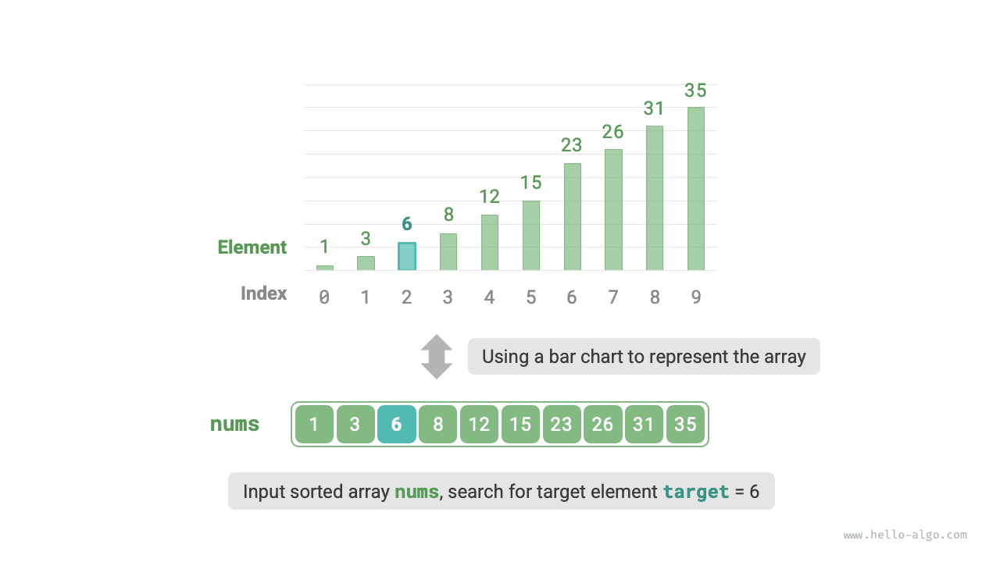
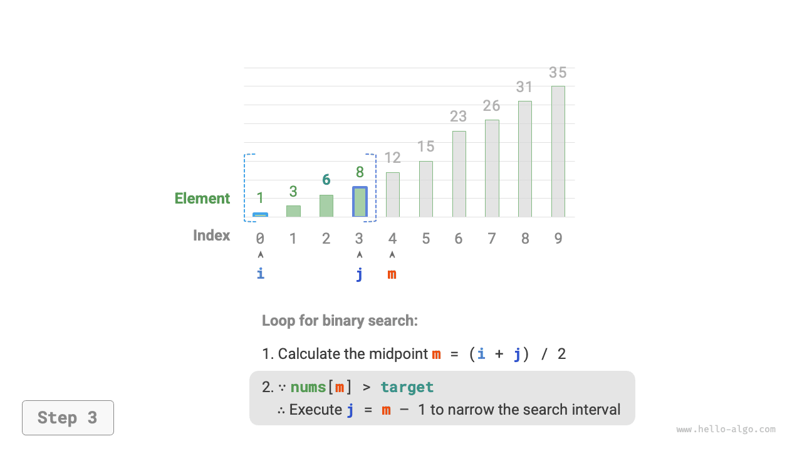
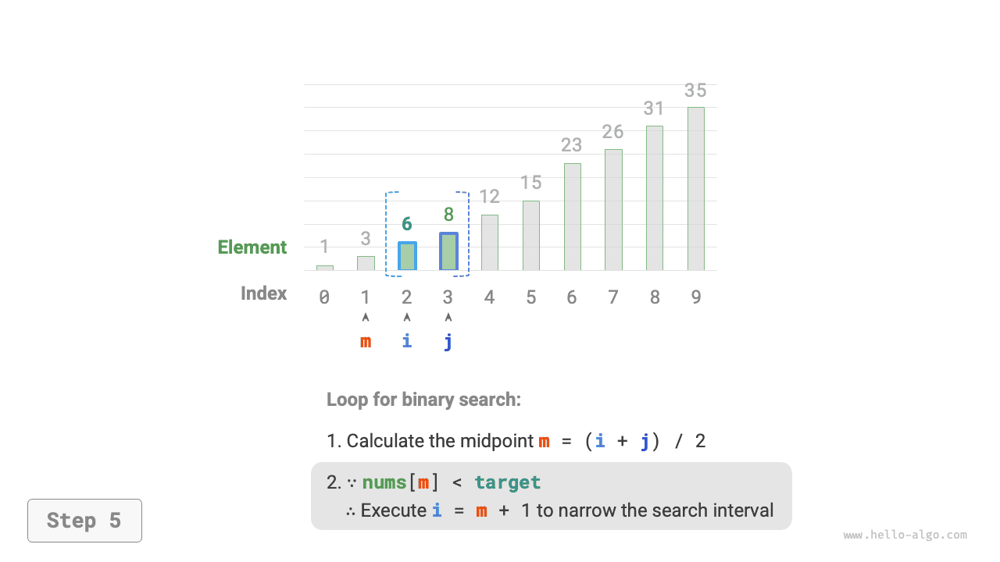
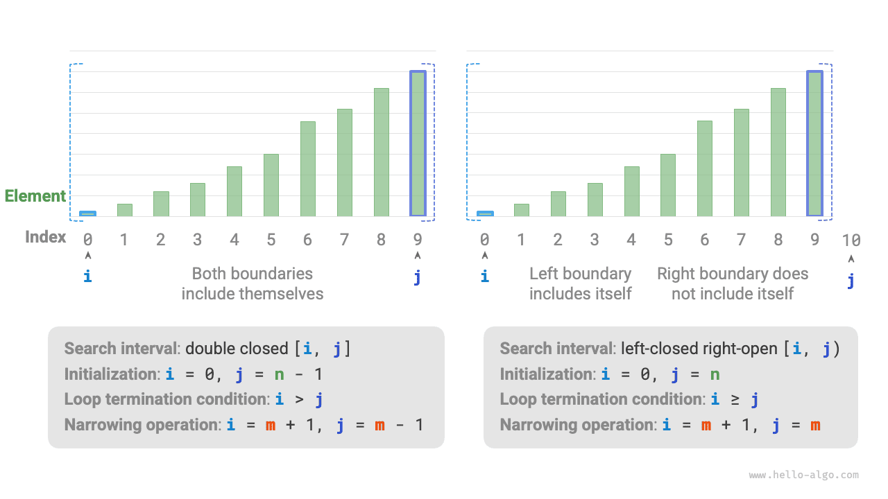

# Двоичный поиск

<u>Двоичный поиск (binary search)</u> - это эффективный алгоритм поиска, основанный на стратегии "разделяй и властвуй". Он использует упорядоченность данных и на каждом шаге сокращает область поиска вдвое, пока не найдет целевой элемент или пока интервал поиска не опустеет.

!!! question

    Дан массив `nums` длины $n$, элементы которого расположены в порядке возрастания и не повторяются. Найдите и верните индекс элемента `target` в этом массиве. Если массив не содержит этого элемента, верните $-1$ . Пример показан на рисунке ниже.



Как показано на рисунке ниже, сначала инициализируем указатели $i = 0$ и $j = n - 1$ , которые указывают на первый и последний элементы массива и задают интервал поиска $[0, n - 1]$ . Обратите внимание: квадратные скобки обозначают замкнутый интервал и включают граничные значения.

Далее в цикле выполняются следующие два шага.

1. Вычислить индекс середины $m = \lfloor {(i + j) / 2} \rfloor$ , где $\lfloor \: \rfloor$ означает операцию округления вниз.
2. Сравнить `nums[m]` и `target` , после чего возможны три случая.
    1. Если `nums[m] < target` , это означает, что `target` находится в интервале $[m + 1, j]$ , поэтому выполняется $i = m + 1$ .
    2. Если `nums[m] > target` , это означает, что `target` находится в интервале $[i, m - 1]$ , поэтому выполняется $j = m - 1$ .
    3. Если `nums[m] = target` , значит, элемент `target` найден, поэтому возвращается индекс $m$ .

Если массив не содержит целевой элемент, область поиска в итоге сузится до пустого интервала. В этом случае возвращается $-1$ .

=== "<1>"
    

=== "<2>"
    

=== "<3>"
    

=== "<4>"
    

=== "<5>"
    

=== "<6>"
    

=== "<7>"
    

Стоит отметить, что поскольку и $i$ , и $j$ имеют тип `int` , **то сумма $i + j$ может выйти за пределы диапазона типа `int`**. Чтобы избежать переполнения, обычно используют формулу $m = \lfloor {i + (j - i) / 2} \rfloor$ для вычисления середины.

Код приведен ниже:

```src
[file]{binary_search}-[class]{}-[func]{binary_search}
```

**Временная сложность равна $O(\log n)$** : в цикле двоичного поиска интервал каждый раз сокращается вдвое, поэтому число итераций равно $\log_2 n$ .

**Пространственная сложность равна $O(1)$** : указатели $i$ и $j$ занимают константный объем памяти.

## Методы представления интервалов

Помимо описанного выше двойного замкнутого интервала, часто используется и интервал "слева закрыт, справа открыт", который задается как $[0, n)$ , то есть левая граница включается, а правая - нет. В этом представлении интервал $[i, j)$ пуст, когда $i = j$ .

На основе этого представления можно реализовать двоичный поиск с той же функциональностью:

```src
[file]{binary_search}-[class]{}-[func]{binary_search_lcro}
```

Как показано на рисунке ниже, в этих двух вариантах представления интервала различаются инициализация, условие цикла и операция сужения интервала в алгоритме двоичного поиска.

Поскольку в записи "двойной замкнутый интервал" обе границы являются закрытыми, операции сужения интервала при помощи указателей $i$ и $j$ тоже получаются симметричными. Из-за этого в таком варианте сложнее допустить ошибку, **поэтому обычно рекомендуется использовать именно запись "двойной замкнутый интервал"**.



## Преимущества и ограничения

Двоичный поиск показывает хорошие результаты и по времени, и по памяти.

- Двоичный поиск очень эффективен по времени. На больших объемах данных логарифмическая временная сложность дает заметное преимущество. Например, когда размер данных $n = 2^{20}$ , линейный поиск потребует $2^{20} = 1048576$ итераций, тогда как двоичный поиск выполнится всего за $\log_2 2^{20} = 20$ итераций.
- Двоичный поиск не требует дополнительной памяти. По сравнению с алгоритмами поиска, которым нужно внешнее пространство (например, с хеш-поиском), двоичный поиск заметно экономнее по памяти.

Однако двоичный поиск подходит не для всех ситуаций, и основные причины таковы.

- Двоичный поиск применим только к упорядоченным данным. Если входные данные неупорядочены, специально сортировать их ради двоичного поиска невыгодно. Это связано с тем, что временная сложность алгоритмов сортировки обычно составляет $O(n \log n)$ , что выше, чем у линейного и двоичного поиска. Если элементы приходится часто вставлять, то для сохранения порядка в массиве их нужно помещать в конкретные позиции, а это требует $O(n)$ времени и тоже обходится дорого.
- Двоичный поиск применим только к массивам. Для него нужен скачкообразный доступ к элементам, а в связном списке такой доступ малоэффективен, поэтому двоичный поиск не подходит для списков и структур данных, построенных на их основе.
- При малом объеме данных линейный поиск работает лучше. В линейном поиске на каждом шаге нужна всего одна операция сравнения; в двоичном поиске требуется 1 сложение, 1 деление, от 1 до 3 сравнений и еще 1 сложение или вычитание, то есть всего от 4 до 6 элементарных операций. Поэтому при небольшом $n$ линейный поиск может оказаться быстрее двоичного.
