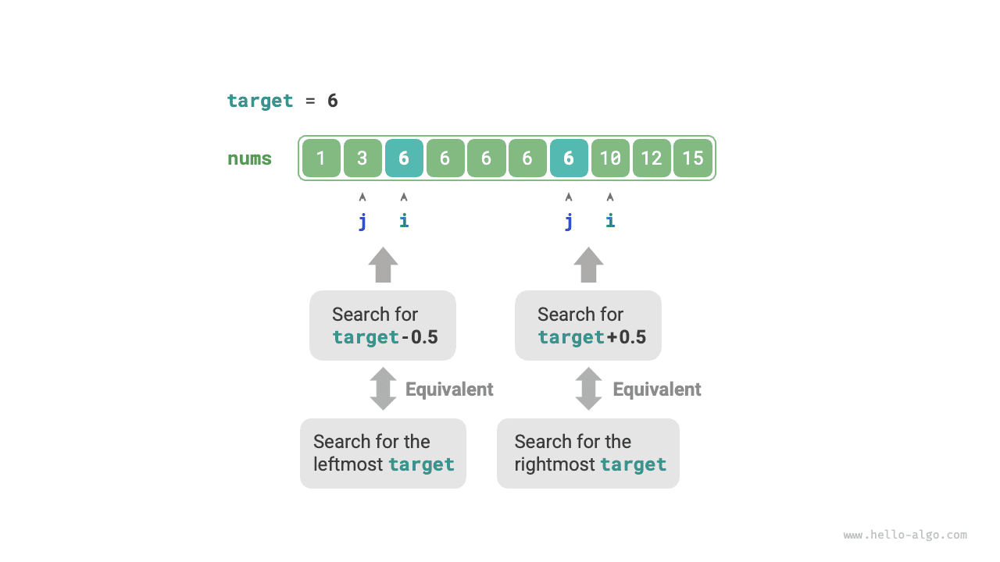

# Двоичный поиск границ

## Поиск левой границы

!!! question

    Дан упорядоченный массив `nums` длины $n$, который может содержать повторяющиеся элементы. Верните индекс самого левого элемента `target` в массиве. Если массив не содержит этот элемент, верните $-1$ .

Вспомним метод поиска точки вставки при двоичном поиске: после завершения поиска указатель $i$ указывает на самый левый `target` , **поэтому поиск точки вставки по сути и есть поиск индекса самого левого `target`**.

Рассмотрим реализацию поиска левой границы через функцию поиска точки вставки. Обратите внимание: массив может не содержать `target` , и тогда возможны две ситуации.

- Индекс точки вставки $i$ выходит за границы массива.
- Элемент `nums[i]` не равен `target` .

Если возникает любая из этих ситуаций, достаточно сразу вернуть $-1$ . Код приведен ниже:

```src
[file]{binary_search_edge}-[class]{}-[func]{binary_search_left_edge}
```

## Поиск правой границы

Как тогда найти самый правый `target` ? Самый прямой способ - изменить код, заменив операцию сужения указателя в случае `nums[m] == target` . Мы не будем приводить этот код, заинтересованные читатели могут реализовать его самостоятельно.

Ниже представлены два более изящных способа.

### Повторное использование поиска левой границы

На самом деле функцию поиска самого левого элемента можно использовать и для поиска самого правого элемента. Конкретная идея такова: **преобразовать поиск самого правого `target` в поиск самого левого `target + 1`**.

Как показано на рисунке ниже, после завершения поиска указатель $i$ указывает на самый левый `target + 1` (если он существует), а указатель $j$ указывает на самый правый `target` , **поэтому достаточно вернуть $j$**.


Обратите внимание: функция возвращает точку вставки $i$ , поэтому из нее нужно вычесть $1$ , чтобы получить $j$ :

```src
[file]{binary_search_edge}-[class]{}-[func]{binary_search_right_edge}
```

### Преобразование в поиск элемента

Мы знаем, что если массив не содержит `target` , то в конце поиска указатели $i$ и $j$ будут указывать соответственно на первый элемент, больший `target` , и на первый элемент, меньший `target` .

Следовательно, как показано на рисунке ниже, для поиска левой и правой границы можно сконструировать элемент, которого нет в массиве.

- Поиск самого левого `target` : можно преобразовать в поиск `target - 0.5` и вернуть указатель $i$ .
- Поиск самого правого `target` : можно преобразовать в поиск `target + 0.5` и вернуть указатель $j$ .



Код здесь опущен, но стоит обратить внимание на два момента.

- По условию массив не содержит дробных чисел, поэтому нам не нужно беспокоиться о том, как обрабатывать случай равенства другим элементам массива.
- Поскольку этот метод вводит дробные числа, переменную `target` в функции нужно изменить на тип с плавающей запятой (в Python менять ничего не требуется).
