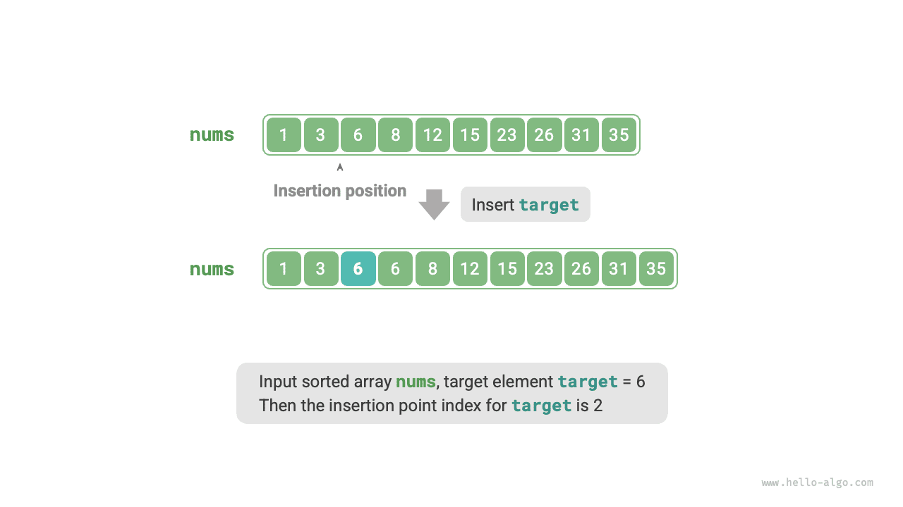
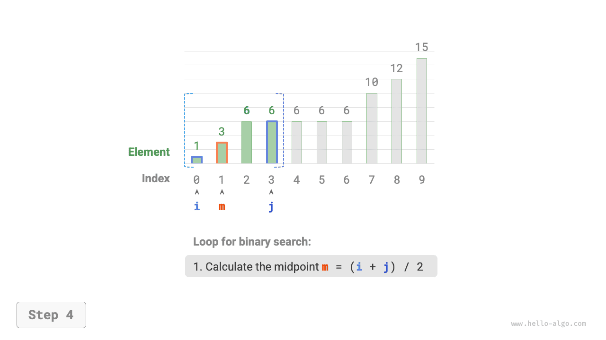
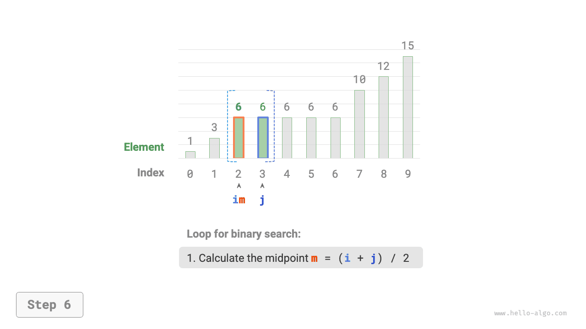
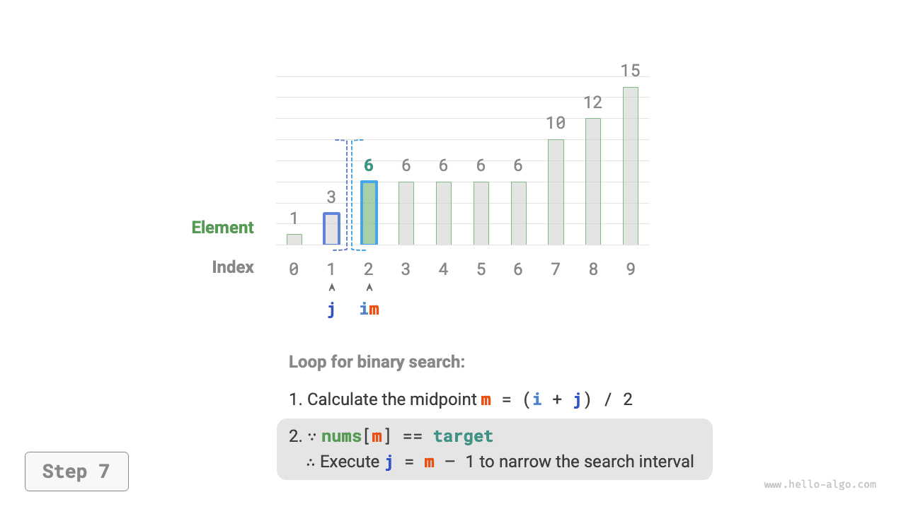

# Точка вставки при двоичном поиске

Двоичный поиск можно использовать не только для поиска целевого элемента, но и для решения многих вариаций задачи, например для поиска позиции вставки целевого элемента.

## Случай без повторяющихся элементов

!!! question

    Дан упорядоченный массив `nums` длины $n$ и элемент `target` , причем в массиве нет повторяющихся элементов. Нужно вставить `target` в массив `nums` , сохранив порядок. Если элемент `target` уже присутствует в массиве, вставьте его слева от него. Верните индекс, который будет иметь `target` после вставки. Пример показан на рисунке ниже.



Если мы хотим переиспользовать код двоичного поиска из предыдущего раздела, нужно ответить на два вопроса.

**Вопрос 1**: если массив содержит `target` , будет ли индекс вставки совпадать с индексом этого элемента?

По условию `target` нужно вставить слева от равного элемента, а это означает, что новый `target` занимает место старого `target` . Иначе говоря, **если массив содержит `target` , то индекс вставки совпадает с индексом этого `target`**.

**Вопрос 2**: если массив не содержит `target` , индекс какого элемента будет точкой вставки?

Рассмотрим процесс двоичного поиска подробнее: когда `nums[m] < target` , указатель $i$ сдвигается, а значит, приближается к элементу, который больше либо равен `target` . Аналогично указатель $j$ все время приближается к элементу, который меньше либо равен `target` .

Следовательно, после завершения двоичного поиска обязательно выполняется следующее: указатель $i$ указывает на первый элемент, больший `target` , а указатель $j$ указывает на первый элемент, меньший `target` . **Нетрудно сделать вывод, что если массив не содержит `target` , то индекс вставки равен $i$** . Код приведен ниже:

```src
[file]{binary_search_insertion}-[class]{}-[func]{binary_search_insertion_simple}
```

## Случай с повторяющимися элементами

!!! question

    В предыдущей задаче теперь допускается, что массив может содержать повторяющиеся элементы, а все остальные условия остаются без изменений.

Если в массиве есть несколько элементов `target` , то обычный двоичный поиск сможет вернуть индекс только одного из них, **но не позволит определить, сколько элементов `target` находится слева и справа от него**.

По условию целевой элемент нужно вставить в самую левую позицию, **поэтому нам нужно найти индекс самого левого `target` в массиве**. На первом этапе можно рассмотреть решение, показанное на рисунке ниже.

1. Выполнить двоичный поиск и получить индекс любого элемента `target` , обозначив его как $k$ .
2. Начиная с индекса $k$ , линейно двигаться влево и вернуть результат, когда будет найден самый левый `target` .


Этот метод применим на практике, однако в нем есть линейный поиск, поэтому его временная сложность равна $O(n)$ . Когда в массиве имеется много повторяющихся `target` , такой подход работает неэффективно.

Теперь рассмотрим расширение кода двоичного поиска. Как показано на рисунке ниже, общий процесс остается прежним: на каждом шаге мы сначала вычисляем индекс середины $m$ , а затем сравниваем `target` и `nums[m]` , после чего возможны следующие случаи.

- Когда `nums[m] < target` или `nums[m] > target` , это означает, что `target` еще не найден, поэтому используется стандартная операция сужения интервала в двоичном поиске, **благодаря чему указатели $i$ и $j$ приближаются к `target`**.
- Когда `nums[m] == target` , это означает, что элементы меньше `target` находятся в интервале $[i, m - 1]$ , поэтому мы используем $j = m - 1$ для сужения интервала, **тем самым приближая указатель $j$ к элементам, меньшим `target`**.

После завершения цикла указатель $i$ будет указывать на самый левый `target` , а указатель $j$ - на первый элемент, меньший `target` , **поэтому индекс $i$ и является точкой вставки**.

=== "<1>"
    

=== "<2>"
    

=== "<3>"
    

=== "<4>"
    

=== "<5>"
    

=== "<6>"
    

=== "<7>"
    

=== "<8>"
    

Если посмотреть на следующий код, то видно, что операции в ветвях `nums[m] > target` и `nums[m] == target` совпадают, поэтому эти две ветви можно объединить.

Даже в этом случае можно оставить условия развернутыми, потому что так логика выглядит более ясной и код легче читать.

```src
[file]{binary_search_insertion}-[class]{}-[func]{binary_search_insertion}
```

!!! tip

    Код в этом разделе записан в стиле "двойного замкнутого интервала". При желании можно самостоятельно реализовать вариант "слева закрыт, справа открыт".

Если смотреть в целом, суть двоичного поиска сводится к тому, что для указателей $i$ и $j$ заранее задаются цели поиска; целью может быть конкретный элемент (например, `target` ), а может быть и диапазон элементов (например, элементы, меньшие `target` ).

В ходе непрерывного двоичного деления указатели $i$ и $j$ постепенно приближаются к заранее заданной цели. В конце они либо успешно находят ответ, либо останавливаются после выхода за границы.
