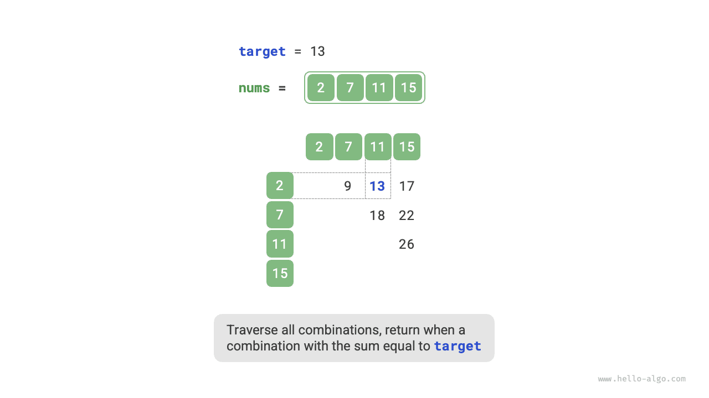

# Стратегии хеш-оптимизации

В алгоритмических задачах **мы часто заменяем линейный поиск на хеш-поиск, чтобы уменьшить временную сложность алгоритма**. Разберем одну задачу, чтобы лучше понять этот прием.

!!! question

    Дан массив целых чисел `nums` и целевой элемент `target` . Найдите в массиве два элемента, сумма которых равна `target` , и верните их индексы. Подойдет любой корректный ответ.

## Линейный поиск: обмен времени на пространство

Рассмотрим прямой перебор всех возможных комбинаций. Как показано на рисунке ниже, мы запускаем два вложенных цикла и на каждом шаге проверяем, равна ли сумма двух целых чисел `target` ; если да, то возвращаем их индексы.



Код приведен ниже:

```src
[file]{two_sum}-[class]{}-[func]{two_sum_brute_force}
```

Временная сложность этого метода равна $O(n^2)$ , а пространственная сложность равна $O(1)$ , поэтому на больших объемах данных он очень медленный.

## Хеш-поиск: обмен пространства на время

Рассмотрим вариант с использованием хеш-таблицы, где ключами и значениями будут элементы массива и их индексы. При циклическом обходе массива на каждом шаге выполняются действия, показанные на рисунке ниже.

1. Проверить, находится ли число `target - nums[i]` в хеш-таблице; если да, то сразу вернуть индексы этих двух элементов.
2. Добавить в хеш-таблицу пару из ключа `nums[i]` и индекса `i` .

=== "<1>"
    

=== "<2>"
    

=== "<3>"
    

Код реализации показан ниже, и для него достаточно одного цикла:

```src
[file]{two_sum}-[class]{}-[func]{two_sum_hash_table}
```

Благодаря хеш-поиску этот метод снижает временную сложность с $O(n^2)$ до $O(n)$ , существенно повышая эффективность работы.

Поскольку требуется поддерживать дополнительную хеш-таблицу, пространственная сложность составляет $O(n)$ . **Несмотря на это, в целом данный метод лучше сбалансирован по времени и памяти, поэтому именно он является оптимальным решением этой задачи**.
