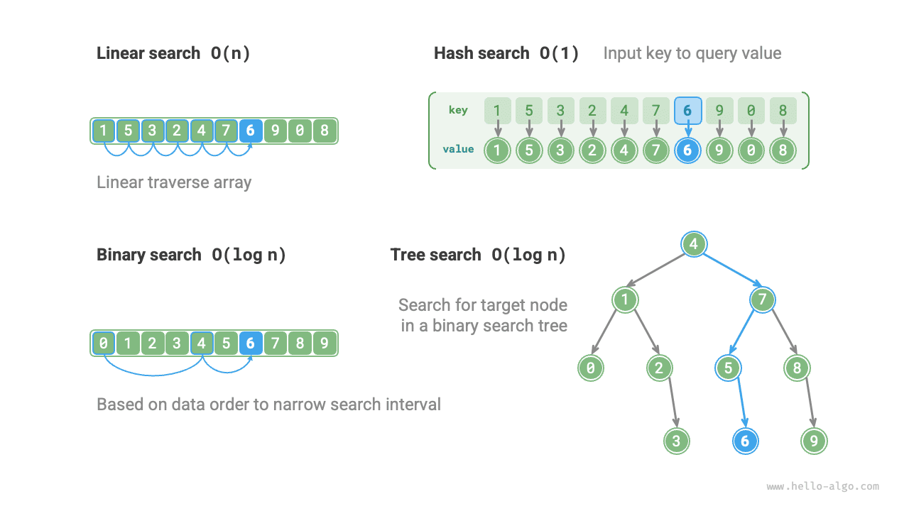

# Переосмысление алгоритмов поиска

<u>Алгоритмы поиска (searching algorithm)</u> используются для того, чтобы находить один или несколько элементов, удовлетворяющих определенным условиям, в структурах данных, таких как массивы, списки, деревья или графы.

Алгоритмы поиска можно разделить на две категории по способу реализации.

- **Поиск целевого элемента путем обхода структуры данных**, например обход массива, списка, дерева или графа.
- **Эффективный поиск элементов с использованием структуры организации данных или априорной информации**, например двоичный поиск, хеш-поиск и поиск в двоичном дереве поиска.

Нетрудно заметить, что эти темы уже рассматривались в предыдущих главах, поэтому алгоритмы поиска нам уже знакомы. В этом разделе мы еще раз посмотрим на них, но уже более системно.

## Полный перебор

Полный перебор заключается в том, что мы обходим каждый элемент структуры данных, чтобы найти целевой элемент.

- "Линейный поиск" применяется к линейным структурам данных, таким как массивы и списки. Он начинается с одного конца структуры данных и последовательно проверяет элементы, пока не найдет целевой элемент или пока не достигнет другого конца структуры данных.
- "Поиск в ширину" и "поиск в глубину" - это две стратегии обхода графов и деревьев. Поиск в ширину стартует из начального узла и исследует все узлы текущего уровня, прежде чем переходить к следующему. Поиск в глубину стартует из начального узла, проходит один путь до конца, затем возвращается назад и пробует другие пути, пока не будет полностью пройдена вся структура данных.

Преимущество полного перебора состоит в его простоте и универсальности, **поскольку он не требует предварительной обработки данных и использования дополнительных структур данных**.

Однако **временная сложность таких алгоритмов равна $O(n)$** , где $n$ - число элементов, поэтому при больших объемах данных их производительность невысока.

## Адаптивный поиск

Адаптивный поиск использует специфические свойства данных (например, упорядоченность), чтобы оптимизировать процесс поиска и тем самым эффективнее находить целевой элемент.

- "Двоичный поиск" использует упорядоченность данных для эффективного поиска и применим только к массивам.
- "Хеш-поиск" использует хеш-таблицу для построения отображения между поисковыми данными и целевыми данными, благодаря чему запросы выполняются эффективно.
- "Поиск в дереве" ведется в конкретной древовидной структуре (например, в двоичном дереве поиска) и позволяет быстро отсекать узлы на основе сравнения значений, чтобы найти цель.

Преимущество этих алгоритмов в высокой эффективности, **их временная сложность может достигать $O(\log n)$ и даже $O(1)$** .

Однако **для использования таких алгоритмов обычно требуется предварительная обработка данных**. Например, для двоичного поиска нужно заранее отсортировать массив, а хеш-поиск и поиск в дереве требуют дополнительных структур данных, поддержание которых тоже отнимает время и память.

!!! tip

    Адаптивные алгоритмы поиска часто называют алгоритмами поиска в узком смысле, **поскольку они в основном предназначены для быстрого поиска целевого элемента в конкретной структуре данных**.

## Выбор метода поиска

Для поиска целевого элемента в наборе данных размера $n$ можно использовать линейный поиск, двоичный поиск, поиск в дереве, хеш-поиск и другие методы. Принципы работы этих методов показаны на рисунке ниже.

Эффективность и особенности перечисленных методов приведены в таблице ниже.

 Таблица <id> &nbsp; Сравнение эффективности алгоритмов поиска 

|                              | Линейный поиск | Двоичный поиск      | Поиск в дереве      | Хеш-поиск           |
| ---------------------------- | -------------- | ------------------- | ------------------- | ------------------- |
| Поиск элемента               | $O(n)$         | $O(\log n)$         | $O(\log n)$         | $O(1)$              |
| Вставка элемента             | $O(1)$         | $O(n)$              | $O(\log n)$         | $O(1)$              |
| Удаление элемента            | $O(n)$         | $O(n)$              | $O(\log n)$         | $O(1)$              |
| Дополнительное пространство  | $O(1)$         | $O(1)$              | $O(n)$              | $O(n)$              |
| Предварительная обработка    | /              | Сортировка $O(n \log n)$ | Построение дерева $O(n \log n)$ | Построение хеш-таблицы $O(n)$ |
| Упорядоченность данных       | Не требуется   | Требуется           | Требуется           | Не требуется        |

Выбор алгоритма поиска также зависит от масштаба данных, требований к производительности поиска, а также частоты запросов и обновлений данных.

**Линейный поиск**

- Обладает хорошей универсальностью и не требует никакой предварительной обработки данных. Если нужно выполнить только один запрос, то время предварительной обработки для остальных трех методов окажется больше, чем время линейного поиска.
- Подходит для небольших объемов данных, потому что в этом случае влияние временной сложности на эффективность невелико.
- Подходит для сценариев с высокой частотой обновления данных, поскольку этот метод не требует никакого дополнительного обслуживания данных.

**Двоичный поиск**

- Подходит для больших наборов данных и демонстрирует стабильную эффективность; его худшая временная сложность равна $O(\log n)$ .
- Объем данных не должен быть слишком большим, потому что массив требует непрерывного участка памяти.
- Не подходит для сценариев с частыми вставками и удалениями данных, так как поддержание массива в отсортированном виде требует больших затрат.

**Хеш-поиск**

- Подходит для сценариев, в которых требования к скорости запросов очень высоки; средняя временная сложность равна $O(1)$ .
- Не подходит для сценариев, где требуется упорядоченность данных или поиск по диапазону, потому что хеш-таблица не умеет поддерживать порядок данных.
- Сильно зависит от хеш-функции и стратегии обработки коллизий, поэтому риск деградации производительности сравнительно велик.
- Не подходит для слишком больших объемов данных, так как хеш-таблице требуется дополнительное пространство, чтобы максимально снизить число коллизий и обеспечить хорошую производительность поиска.

**Поиск в дереве**

- Подходит для очень больших объемов данных, потому что узлы дерева распределены в памяти и не требуют непрерывного хранения.
- Подходит для сценариев, где нужно поддерживать упорядоченные данные или выполнять поиск по диапазону.
- В процессе постоянных вставок и удалений узлов двоичное дерево поиска может перекоситься, и тогда временная сложность деградирует до $O(n)$ .
- Если использовать AVL-дерево или красно-черное дерево, то все операции могут стабильно выполняться за $O(\log n)$ , но поддержание баланса дерева увеличивает дополнительные накладные расходы.
