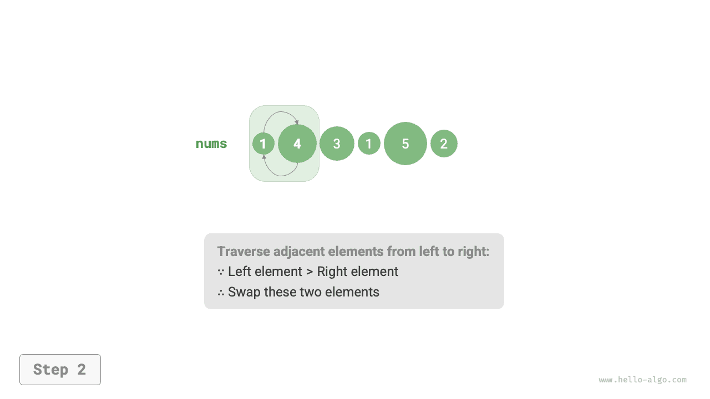
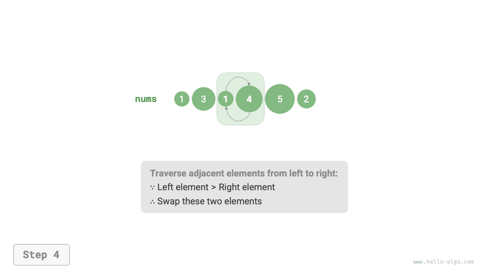

# Сортировка пузырьком

<u>Сортировка пузырьком (bubble sort)</u> сортирует массив за счет непрерывного сравнения и обмена соседних элементов. Этот процесс напоминает всплытие пузырьков снизу вверх, откуда и произошло название алгоритма.

Как показано на рисунке ниже, процесс "всплытия" можно смоделировать через операцию обмена элементов: начиная от левого края массива и двигаясь вправо, мы последовательно сравниваем соседние элементы и, если "левый элемент > правый элемент", меняем их местами. После завершения прохода максимальный элемент будет перемещен в самый правый конец массива.

=== "<1>"
    

=== "<2>"
    

=== "<3>"
    

=== "<4>"
    

=== "<5>"
    

=== "<6>"
    

=== "<7>"
    

## Алгоритм

Пусть длина массива равна $n$ ; тогда шаги сортировки пузырьком показаны на рисунке ниже.

1. Сначала выполнить один проход "всплытия" по $n$ элементам, **переместив максимальный элемент массива на правильную позицию**.
2. Затем выполнить "всплытие" по оставшимся $n - 1$ элементам, **переместив второй по величине элемент на правильную позицию**.
3. Продолжать по аналогии; после $n - 1$ раундов "всплытия" **первые $n - 1$ по величине элементы окажутся на правильных позициях**.
4. Оставшийся единственный элемент обязательно является минимальным, сортировать его уже не нужно, поэтому сортировка завершена.


Пример кода:

```src
[file]{bubble_sort}-[class]{}-[func]{bubble_sort}
```

## Оптимизация эффективности

Мы замечаем, что если в каком-либо раунде "всплытия" не произошло ни одного обмена, значит, массив уже отсортирован и можно сразу вернуть результат. Поэтому можно добавить флаг `flag` для отслеживания этой ситуации и немедленного выхода.

После такой оптимизации худшая и средняя временные сложности сортировки пузырьком по-прежнему равны $O(n^2)$ ; однако если входной массив уже полностью упорядочен, достигается лучшая временная сложность $O(n)$ .

```src
[file]{bubble_sort}-[class]{}-[func]{bubble_sort_with_flag}
```

## Характеристики алгоритма

- **Временная сложность равна $O(n^2)$, алгоритм адаптивен**: длины диапазонов, проходящих "всплытие" в разных раундах, последовательно равны $n - 1$, $n - 2$, $\dots$, $2$, $1$ , а их сумма равна $(n - 1) n / 2$ . После добавления оптимизации с `flag` лучшая временная сложность может достигать $O(n)$ .
- **Пространственная сложность равна $O(1)$, сортировка выполняется на месте**: указатели $i$ и $j$ используют константный объем дополнительной памяти.
- **Стабильная сортировка**: поскольку при "всплытии" равные элементы не обмениваются местами.
