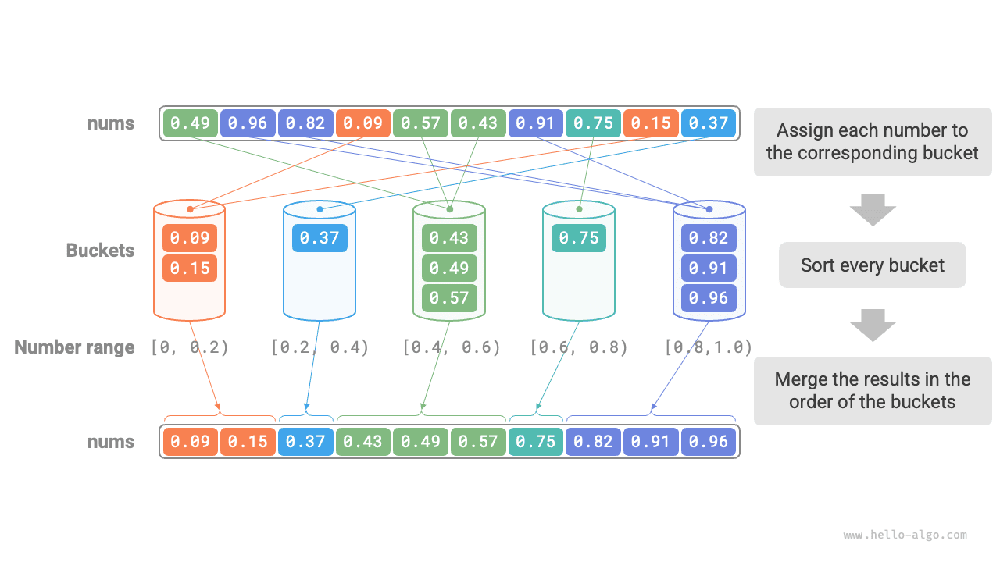
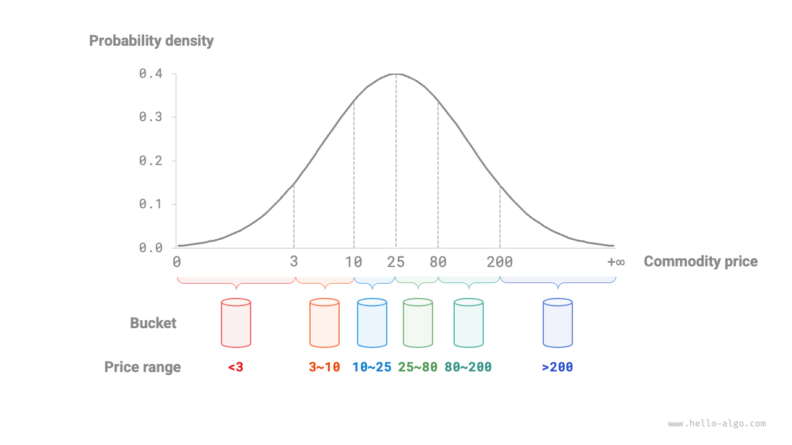

# Блочная сортировка

Рассмотренные выше алгоритмы сортировки относятся к "сортировкам на основе сравнений": они упорядочивают данные, сравнивая элементы друг с другом. Временная сложность таких алгоритмов не может быть лучше $O(n \log n)$ . Далее мы рассмотрим несколько "сортировок без сравнений", чья временная сложность может достигать линейного порядка.

<u>Блочная сортировка (bucket sort)</u> является типичным применением стратегии "разделяй и властвуй". Она задает несколько упорядоченных по диапазонам блоков, каждый блок соответствует некоторому диапазону значений; затем данные равномерно распределяются по блокам, внутри каждого блока выполняется сортировка, а в конце результаты блоков объединяются по порядку.

## Алгоритм

Рассмотрим массив длины $n$, элементы которого являются числами с плавающей запятой из диапазона $[0, 1)$ . Процесс блочной сортировки показан на рисунке ниже.

1. Инициализировать $k$ блоков и распределить $n$ элементов по этим $k$ блокам.
2. Отсортировать каждый блок по отдельности (здесь используется встроенная функция сортировки языка программирования).
3. Объединить результаты в порядке следования блоков от меньшего к большему.



Код приведен ниже:

```src
[file]{bucket_sort}-[class]{}-[func]{bucket_sort}
```

## Характеристики алгоритма

Блочная сортировка подходит для обработки очень больших объемов данных. Например, если вход содержит 1 миллион элементов и из-за ограничений памяти система не может загрузить их все сразу, можно разбить данные на 1000 блоков, отсортировать каждый блок отдельно, а затем объединить результаты.

- **Временная сложность равна $O(n + k)$** : если элементы распределены по блокам равномерно, то в каждом блоке будет $\frac{n}{k}$ элементов. Если сортировка одного блока требует $O(\frac{n}{k} \log\frac{n}{k})$ времени, то сортировка всех блоков потребует $O(n \log\frac{n}{k})$ времени. **Когда число блоков $k$ достаточно велико, временная сложность приближается к $O(n)$** . На объединение результатов требуется $O(n + k)$ времени, потому что нужно пройти по всем блокам и элементам. В худшем случае все данные попадут в один блок, и если сортировка этого блока использует $O(n^2)$ времени, общая сложность также станет $O(n^2)$ .
- **Пространственная сложность равна $O(n + k)$, сортировка не выполняется на месте**: требуются дополнительные блоки в количестве $k$ и место для всех $n$ элементов внутри них.
- Является ли блочная сортировка стабильной, зависит от того, стабилен ли алгоритм сортировки внутри каждого блока.

## Как добиться равномерного распределения

Теоретически временная сложность блочной сортировки может достигать $O(n)$ ; **ключ к этому - как можно более равномерно распределить элементы по блокам**. На практике данные часто распределены неравномерно. Например, если нужно распределить все товары на Taobao по 10 блокам цен, количество товаров дешевле 100 юаней может быть очень большим, а товаров дороже 1000 юаней - очень маленьким. Если просто разбить диапазон цен на 10 равных частей, число товаров в каждом блоке будет сильно различаться.

Чтобы добиться более равномерного распределения, можно сначала задать грубую линию раздела и приблизительно распределить данные по 3 блокам. **После этого блоки с большим числом товаров можно снова делить на 3 блока и продолжать процесс до тех пор, пока число элементов в каждом блоке не станет примерно одинаковым**.

Как показано на рисунке ниже, по сути этот метод строит рекурсивное дерево, цель которого - сделать значения в листьях как можно более равномерными. Конечно, совсем не обязательно каждый раз делить данные именно на 3 блока; конкретную схему разбиения можно выбирать в зависимости от свойств данных.


Если нам заранее известна вероятностная модель распределения цен товаров, **то границы каждого блока можно задавать в соответствии с этим распределением**. Важно отметить, что фактическое распределение данных не обязательно специально измерять - его можно приблизить некоторой вероятностной моделью исходя из свойств данных.

Как показано на рисунке ниже, если предположить, что цены товаров подчиняются нормальному распределению, то можно разумно задать интервалы цен и тем самым распределить товары по блокам достаточно равномерно.


