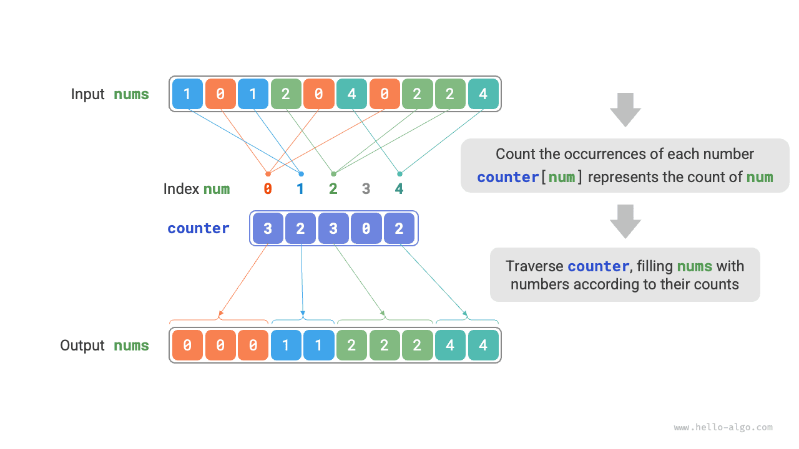
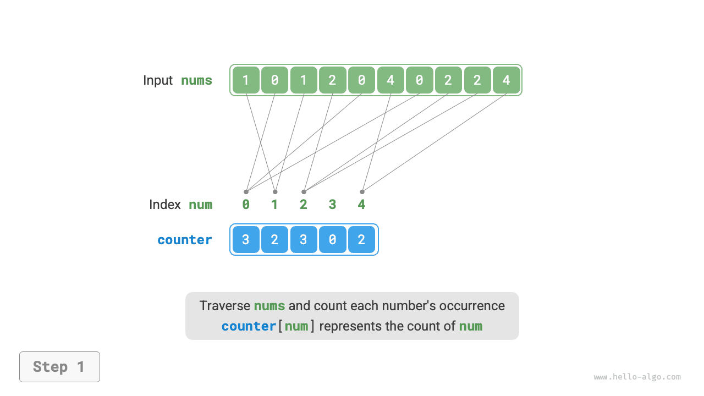
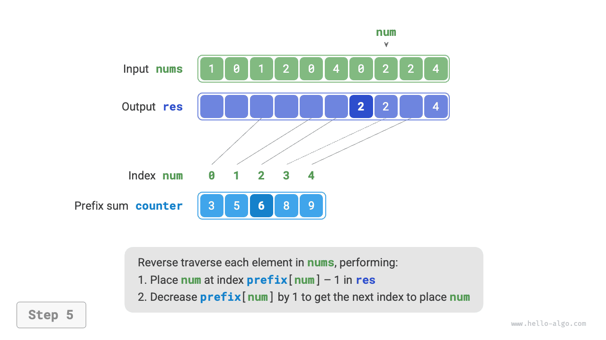

# Сортировка подсчетом

<u>Сортировка подсчетом (counting sort)</u> реализует сортировку за счет подсчета количества элементов и обычно используется для массивов целых чисел.

## Простая реализация

Сначала рассмотрим простой пример. Дан массив `nums` длины $n$ , элементы которого являются "неотрицательными целыми числами". Общий процесс сортировки подсчетом показан на рисунке ниже.

1. Пройти по массиву, найти в нем максимальное число, обозначить его как $m$ , а затем создать вспомогательный массив `counter` длины $m + 1$ .
2. **С помощью `counter` подсчитать, сколько раз каждое число встречается в `nums`**; при этом `counter[num]` хранит число вхождений значения `num` . Делается это просто: достаточно пройти по `nums` (пусть текущее число равно `num` ) и на каждом шаге увеличить `counter[num]` на $1$ .
3. **Поскольку индексы массива `counter` изначально упорядочены, можно считать, что все числа уже отсортированы**. Далее остается пройти по `counter` и в соответствии с числом вхождений записать значения обратно в `nums` в порядке возрастания.



Код приведен ниже:

```src
[file]{counting_sort}-[class]{}-[func]{counting_sort_naive}
```

!!! note "Связь между сортировкой подсчетом и блочной сортировкой"

    Если посмотреть на сортировку подсчетом с точки зрения блочной сортировки, то каждый индекс массива `counter` можно рассматривать как отдельный блок, а процесс подсчета - как распределение элементов по соответствующим блокам. По сути, сортировка подсчетом является частным случаем блочной сортировки для целочисленных данных.

## Полная реализация

Внимательный читатель мог заметить, что **если входные данные представлены объектами, то описанный выше шаг `3.` перестает работать**. Например, если входными данными являются объекты товаров и мы хотим отсортировать их по цене (полю класса), то описанный алгоритм сможет выдать только отсортированный ряд цен, но не исходные объекты в нужном порядке.

Как же получить корректный порядок исходных данных? Сначала вычислим "префиксную сумму" массива `counter` . Как следует из названия, префиксная сумма в индексе `i` , обозначаемая как `prefix[i]` , равна сумме первых `i` элементов массива:

$$
\text{prefix}[i] = \sum_{j=0}^i \text{counter[j]}
$$

**Префиксная сумма имеет четкий смысл: `prefix[num] - 1` обозначает индекс последнего вхождения элемента `num` в результирующем массиве `res`**. Это очень важная информация, потому что она указывает, в какую позицию результирующего массива должен попасть каждый элемент. Далее мы проходим исходный массив `nums` в обратном порядке и на каждой итерации для очередного элемента `num` выполняем два действия.

1. Записать `num` в массив `res` по индексу `prefix[num] - 1` .
2. Уменьшить префиксную сумму `prefix[num]` на $1$ , чтобы получить индекс следующего размещения элемента `num` .

После завершения прохода массив `res` будет содержать отсортированный результат; остается только переписать `res` обратно в `nums` . Полный процесс сортировки подсчетом показан на рисунке ниже.

=== "<1>"
    

=== "<2>"
    

=== "<3>"
    

=== "<4>"
    

=== "<5>"
    

=== "<6>"
    

=== "<7>"
    

=== "<8>"
    

Код реализации сортировки подсчетом приведен ниже:

```src
[file]{counting_sort}-[class]{}-[func]{counting_sort}
```

## Характеристики алгоритма

- **Временная сложность равна $O(n + m)$, алгоритм не является адаптивным** : необходимо пройти по `nums` и по `counter` , а оба этих прохода занимают линейное время. Обычно выполняется $n \gg m$ , поэтому временная сложность стремится к $O(n)$ .
- **Пространственная сложность равна $O(n + m)$, сортировка не выполняется на месте**: используются массивы `res` и `counter` длины $n$ и $m$ соответственно.
- **Стабильная сортировка**: порядок заполнения `res` идет "справа налево", поэтому обратный проход по `nums` позволяет сохранить относительный порядок равных элементов и тем самым реализовать стабильную сортировку. Вообще говоря, прямой проход по `nums` тоже даст правильный результат сортировки, но он будет нестабильным.

## Ограничения

На этом этапе сортировка подсчетом может показаться очень изящной: она позволяет эффективно сортировать данные, опираясь только на подсчет числа вхождений. Однако условия ее применения довольно строгие.

**Сортировка подсчетом применима только к неотрицательным целым числам**. Чтобы использовать ее для других типов данных, нужно убедиться, что эти данные можно преобразовать в неотрицательные целые числа и что при преобразовании относительный порядок элементов не изменится. Например, для массива целых чисел с отрицательными значениями можно сначала прибавить ко всем числам константу, превратив их в положительные, затем выполнить сортировку и после этого преобразовать значения обратно.

**Сортировка подсчетом подходит для случаев, когда объем данных велик, но диапазон значений невелик**. Например, в приведенном выше примере $m$ не должно быть слишком большим, иначе будет занято слишком много памяти. А когда $n \ll m$ , сортировка подсчетом использует $O(m)$ времени и может оказаться медленнее, чем алгоритмы сортировки с $O(n \log n)$ .
