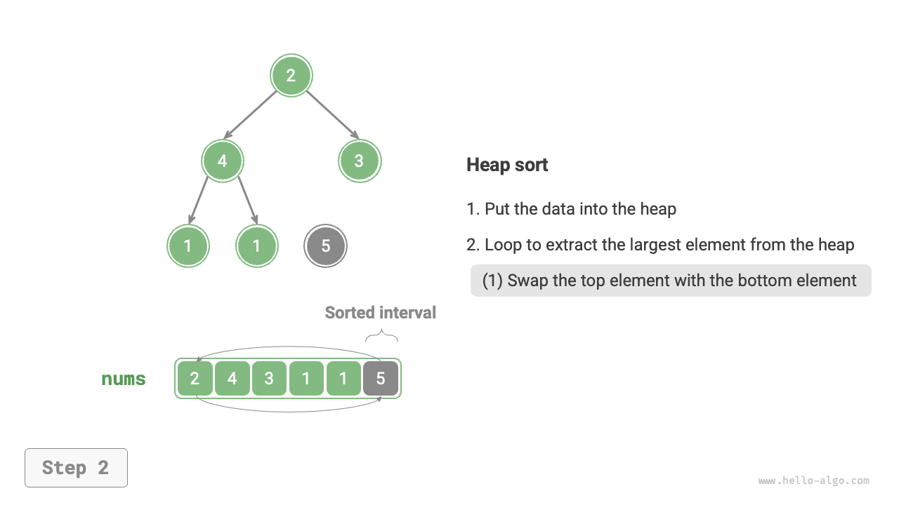
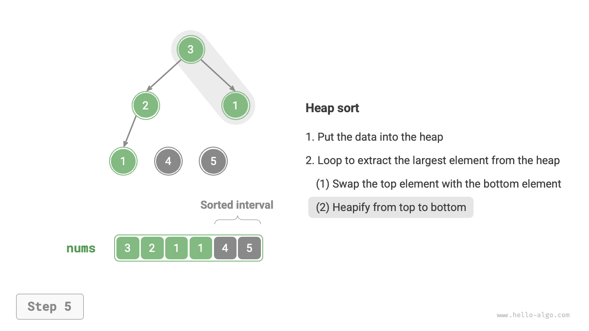
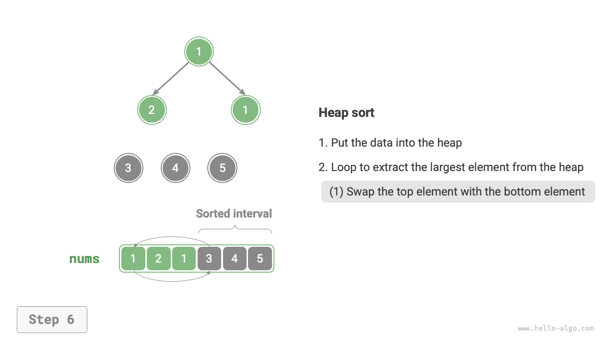
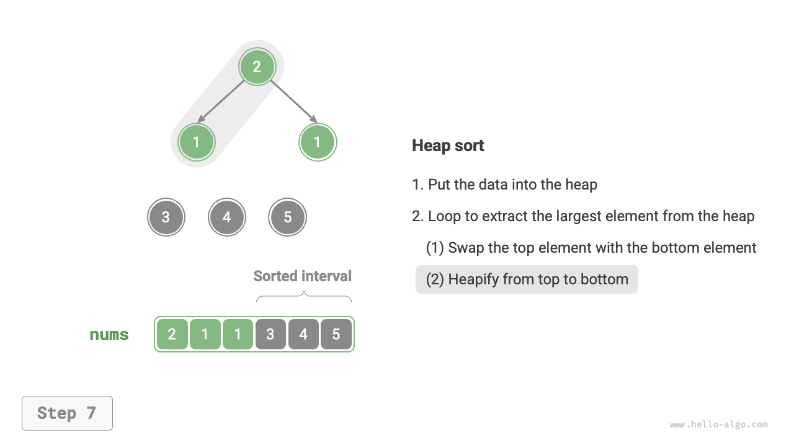
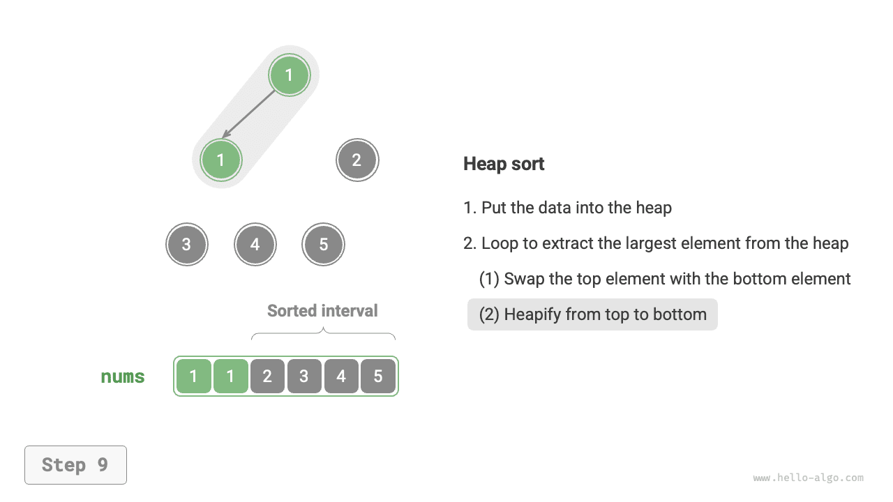
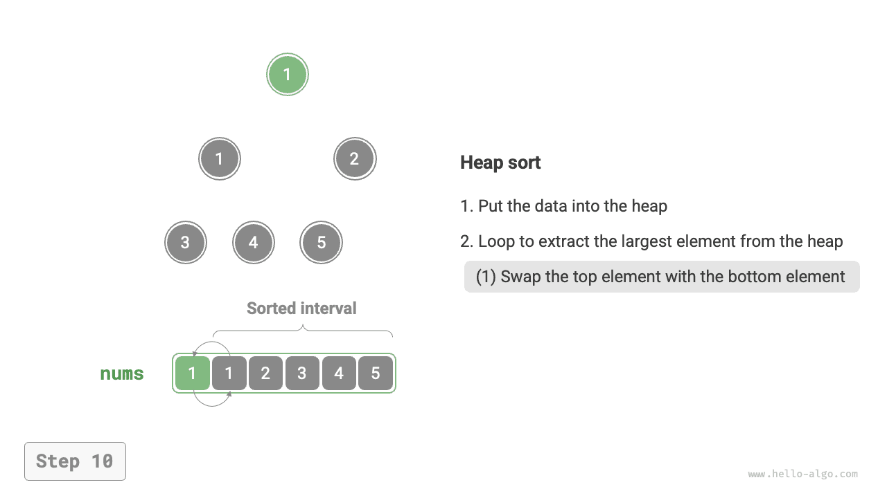
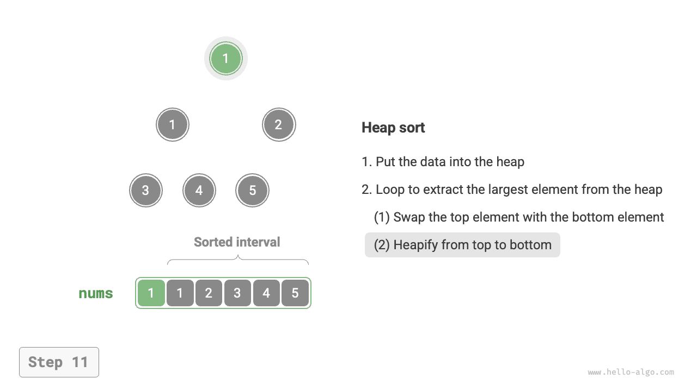
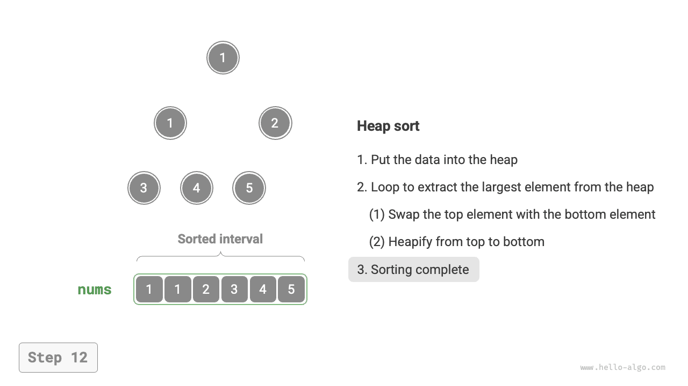

# Пирамидальная сортировка

!!! tip

    Перед чтением этого раздела убедитесь, что вы уже изучили главу "Куча".

<u>Пирамидальная сортировка (heap sort)</u> - это эффективный алгоритм сортировки, основанный на структуре данных "куча". Для его реализации можно использовать уже изученные нами "построение кучи" и "извлечение элементов из кучи".

1. Подать на вход массив и построить из него мин-кучу; в этот момент минимальный элемент будет находиться в вершине кучи.
2. Непрерывно выполнять извлечение из кучи и по порядку записывать извлеченные элементы - так получится последовательность, отсортированная по возрастанию.

Хотя этот метод работоспособен, он требует дополнительного массива для хранения извлеченных элементов и потому расходует лишнюю память. На практике обычно используют более изящную реализацию.

## Алгоритм

Пусть длина массива равна $n$ ; тогда процесс пирамидальной сортировки показан на рисунке ниже.

1. Подать на вход массив и построить из него макс-кучу. После этого максимальный элемент окажется в вершине кучи.
2. Обменять элемент в вершине кучи (первый элемент) с элементом внизу кучи (последний элемент). После обмена длина кучи уменьшается на $1$ , а число уже отсортированных элементов увеличивается на $1$ .
3. Начиная с вершины, выполнить просеивание вниз (sift down) сверху вниз. После этого свойство кучи будет восстановлено.
4. Циклически повторять шаг `2.` и шаг `3.` . После $n - 1$ раундов массив будет полностью отсортирован.

!!! tip

    На самом деле операция извлечения из кучи тоже включает шаг `2.` и шаг `3.` , только дополнительно содержит действие по удалению элемента.

=== "<1>"
    

=== "<2>"
    

=== "<3>"
    

=== "<4>"
    

=== "<5>"
    

=== "<6>"
    

=== "<7>"
    

=== "<8>"
    

=== "<9>"
    

=== "<10>"
    

=== "<11>"
    

=== "<12>"
    

В реализации кода используется та же функция просеивания сверху вниз `sift_down()`, что и в главе "Куча". Важно помнить, что длина кучи уменьшается по мере извлечения максимального элемента, поэтому функции `sift_down()` нужно передавать параметр длины $n$ , чтобы указать текущую эффективную длину кучи. Код приведен ниже:

```src
[file]{heap_sort}-[class]{}-[func]{heap_sort}
```

## Характеристики алгоритма

- **Временная сложность равна $O(n \log n)$, алгоритм не является адаптивным**: построение кучи занимает $O(n)$ времени. Извлечение максимального элемента из кучи имеет временную сложность $O(\log n)$ и выполняется $n - 1$ раз.
- **Пространственная сложность равна $O(1)$, сортировка выполняется на месте**: несколько переменных-указателей используют $O(1)$ памяти. Обмен элементов и операции просеивания выполняются прямо в исходном массиве.
- **Нестабильная сортировка**: при обмене вершины кучи и нижнего элемента относительный порядок равных элементов может измениться.
