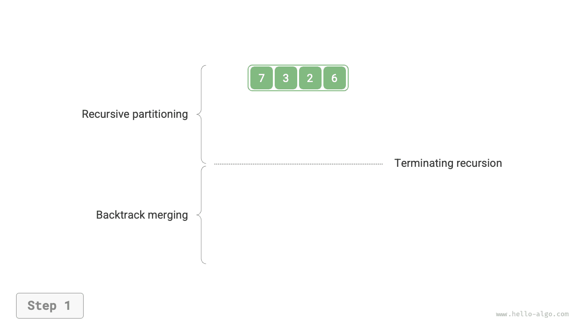
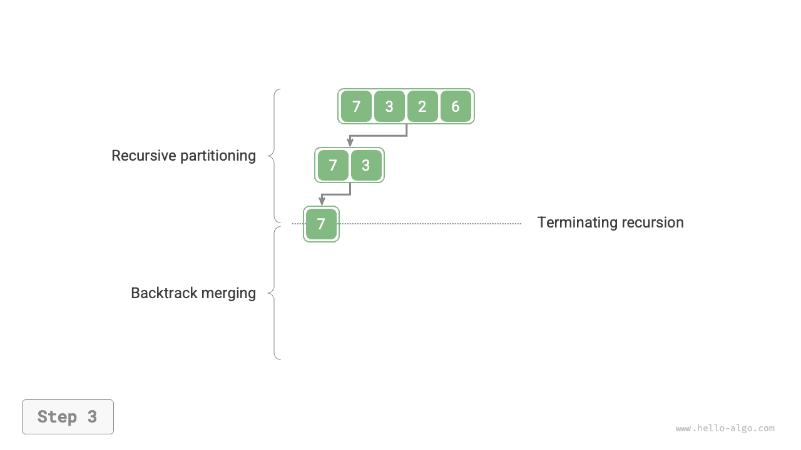
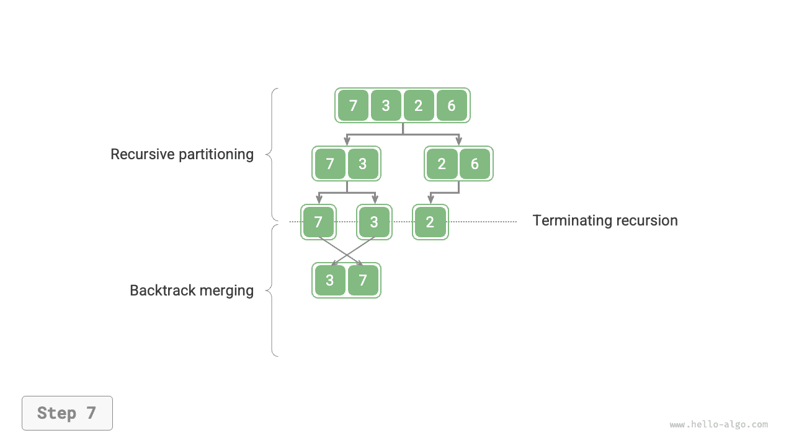

# Сортировка слиянием

<u>Сортировка слиянием (merge sort)</u> - это алгоритм сортировки на основе стратегии "разделяй и властвуй", который включает этапы "разделения" и "слияния", показанные на рисунке ниже.

1. **Этап разделения**: массив рекурсивно разбивается от середины, и задача сортировки длинного массива превращается в задачи сортировки более коротких массивов.
2. **Этап слияния**: когда длина подмассива становится равной 1, разделение завершается и начинается слияние; левые и правые короткие упорядоченные массивы непрерывно объединяются в более длинный упорядоченный массив, пока процесс не завершится.


## Алгоритм

Как показано на рисунке ниже, на этапе "разделения" массив рекурсивно разбивается сверху вниз по середине на два подмассива.

1. Вычислить середину массива `mid` и рекурсивно разделить левый подмассив (интервал `[left, mid]` ) и правый подмассив (интервал `[mid + 1, right]` ).
2. Рекурсивно повторять шаг `1.` , пока длина подмассива не станет равной 1.

Этап "слияния" снизу вверх объединяет левый и правый подмассивы в один упорядоченный массив. Следует заметить, что начиная с подмассивов длины 1, каждый подмассив в фазе слияния уже является упорядоченным.

=== "<1>"
    

=== "<2>"
    

=== "<3>"
    

=== "<4>"
    

=== "<5>"
    

=== "<6>"
    

=== "<7>"
    

=== "<8>"
    

=== "<9>"
    

=== "<10>"
    

Нетрудно заметить, что порядок рекурсии в сортировке слиянием совпадает с порядком рекурсии при постфиксном обходе бинарного дерева.

- **Постфиксный обход**: сначала рекурсивно обходится левое поддерево, затем правое поддерево, а в конце обрабатывается корневой узел.
- **Сортировка слиянием**: сначала рекурсивно обрабатывается левый подмассив, затем правый подмассив, а в конце выполняется слияние.

Реализация сортировки слиянием показана в коде ниже. Обратите внимание: в `nums` объединяемый интервал равен `[left, right]` , а соответствующий интервал в `tmp` равен `[0, right - left]` .

```src
[file]{merge_sort}-[class]{}-[func]{merge_sort}
```

## Характеристики алгоритма

- **Временная сложность равна $O(n \log n)$, алгоритм не является адаптивным**: этап разделения создает дерево рекурсии высоты $\log n$ , а суммарное число операций слияния на каждом уровне равно $n$ , поэтому общая временная сложность составляет $O(n \log n)$ .
- **Пространственная сложность равна $O(n)$, сортировка не выполняется на месте**: глубина рекурсии равна $\log n$ , из-за чего требуется $O(\log n)$ памяти под стек вызовов. Для этапа слияния нужен вспомогательный массив, поэтому дополнительно используется $O(n)$ памяти.
- **Стабильная сортировка**: в процессе слияния относительный порядок равных элементов не меняется.

## Сортировка связного списка

Для связных списков сортировка слиянием имеет заметное преимущество перед другими алгоритмами сортировки: **пространственную сложность задачи сортировки списка можно оптимизировать до $O(1)$**.

- **Этап разделения**: работу по разбиению списка можно реализовать с помощью "итерации" вместо "рекурсии", тем самым устранив расход памяти на стек вызовов.
- **Этап слияния**: в связном списке добавление и удаление узлов требует только изменения ссылок (указателей), поэтому при слиянии двух коротких упорядоченных списков в один длинный упорядоченный список не нужно создавать дополнительный список.

Детали реализации достаточно сложны; заинтересованные читатели могут изучить соответствующие материалы самостоятельно.
