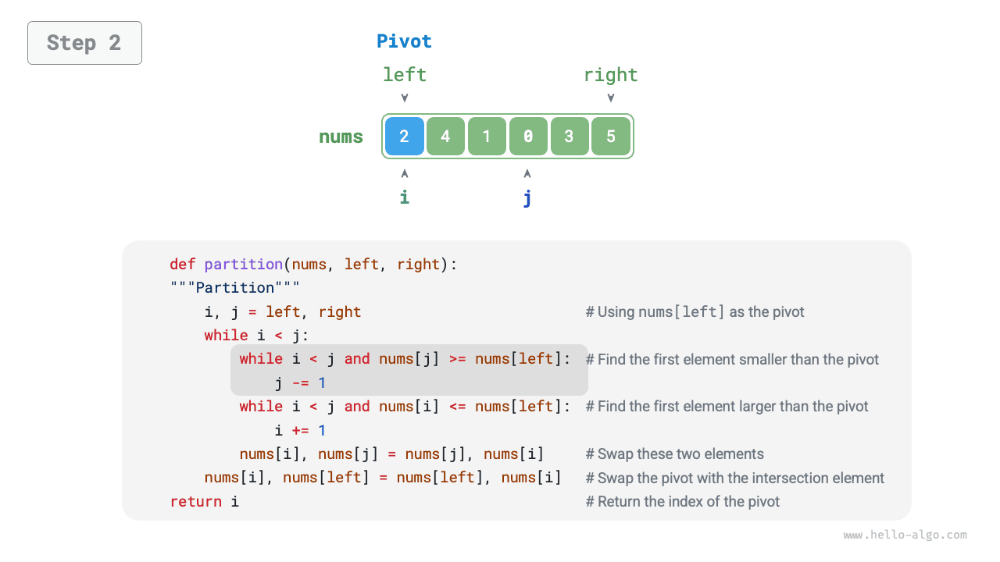
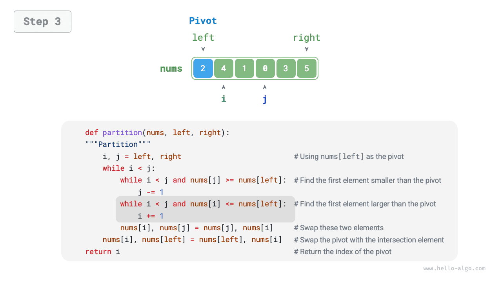
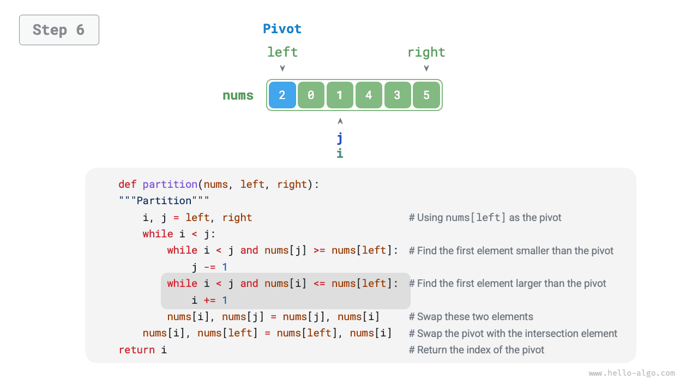
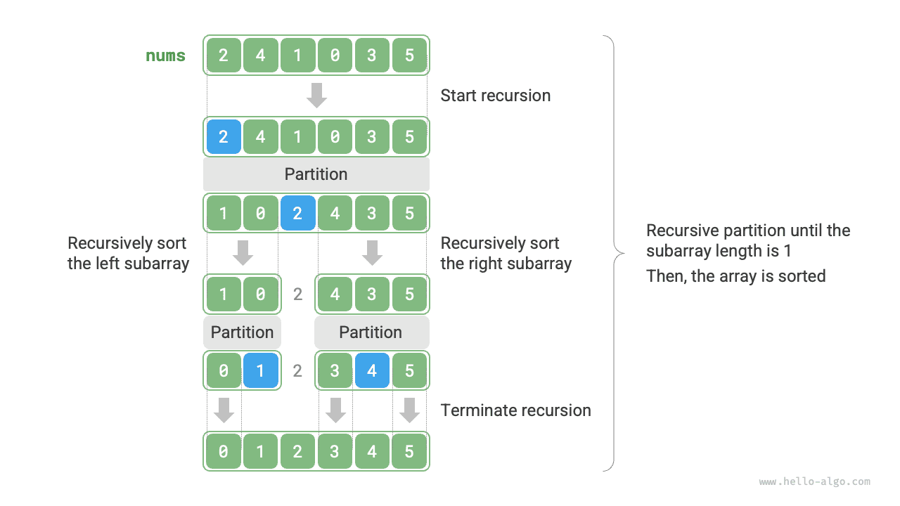

# Быстрая сортировка

<u>Быстрая сортировка (quick sort)</u> - это алгоритм сортировки, основанный на стратегии "разделяй и властвуй"; он работает эффективно и применяется очень широко.

Ключевая операция быстрой сортировки - это "разделение с опорным элементом". Ее цель такова: выбрать некоторый элемент массива в качестве "опорного" и переместить все элементы меньше опорного влево от него, а все элементы больше опорного - вправо. Конкретный процесс показан на рисунке ниже.

1. Выбрать самый левый элемент массива как опорный и инициализировать два указателя `i` и `j` , направленные на левую и правую границы массива.
2. Запустить цикл, в котором `i` и `j` ищут соответственно первый элемент, больший опорного, и первый элемент, меньший опорного, после чего эти два элемента меняются местами.
3. Повторять шаг `2.` , пока указатели `i` и `j` не встретятся, а затем обменять опорный элемент с элементом на границе двух подмассивов.

=== "<1>"
    

=== "<2>"
    

=== "<3>"
    

=== "<4>"
    

=== "<5>"
    

=== "<6>"
    

=== "<7>"
    

=== "<8>"
    

=== "<9>"
    

После завершения разделения исходный массив разбивается на три части: левый подмассив, опорный элемент и правый подмассив; при этом выполняется условие "любой элемент левого подмассива $\leq$ опорный элемент $\leq$ любой элемент правого подмассива". Следовательно, далее нам нужно лишь отсортировать эти два подмассива.

!!! note "Стратегия divide and conquer в быстрой сортировке"

    По сути, разделение с опорным элементом сводит задачу сортировки длинного массива к двум задачам сортировки более коротких массивов.

```src
[file]{quick_sort}-[class]{quick_sort}-[func]{partition}
```

## Алгоритм

Общий процесс быстрой сортировки показан на рисунке ниже.

1. Сначала выполнить "разделение с опорным элементом" для исходного массива и получить неотсортированные левый и правый подмассивы.
2. Затем рекурсивно выполнить "разделение с опорным элементом" для левого и правого подмассивов.
3. Продолжать рекурсию до тех пор, пока длина подмассива не станет равной 1; после этого сортировка всего массива будет завершена.



```src
[file]{quick_sort}-[class]{quick_sort}-[func]{quick_sort}
```

## Характеристики алгоритма

- **Временная сложность равна $O(n \log n)$, алгоритм не является адаптивным**: в среднем глубина рекурсии при разделении равна $\log n$ , а суммарное число циклов на каждом уровне равно $n$ , поэтому общая сложность составляет $O(n \log n)$ . В худшем случае каждое разделение делит массив длины $n$ на подмассивы длины $0$ и $n - 1$ ; тогда глубина рекурсии достигает $n$ , на каждом уровне выполняется $n$ операций, и общая временная сложность вырождается в $O(n^2)$ .
- **Пространственная сложность равна $O(n)$, сортировка выполняется на месте**: если входной массив полностью отсортирован в обратном порядке, глубина рекурсии достигает худшего случая $n$ , что требует $O(n)$ памяти под стек вызовов. При этом сама сортировка выполняется в исходном массиве без дополнительного массива.
- **Нестабильная сортировка**: на последнем шаге разделения опорный элемент может быть обменян вправо от равного ему элемента.

## Почему быстрая сортировка быстрая

Уже по названию понятно, что быстрая сортировка должна иметь преимущества по эффективности. Хотя ее средняя временная сложность совпадает со сложностью "сортировки слиянием" и "пирамидальной сортировки", на практике быстрая сортировка обычно работает быстрее. Основные причины таковы.

- **Вероятность худшего случая очень мала**: хотя худшая временная сложность быстрой сортировки равна $O(n^2)$ и она не так стабильна, как сортировка слиянием, в подавляющем большинстве случаев она работает за $O(n \log n)$ .
- **Высокая эффективность использования кэша**: при выполнении разделения система может загрузить весь подмассив в кэш, поэтому доступ к элементам оказывается быстрым. Алгоритмы вроде "пирамидальной сортировки" требуют скачкообразного доступа к элементам и таким свойством не обладают.
- **Небольшой константный множитель в сложности**: среди трех перечисленных алгоритмов у быстрой сортировки обычно меньше всего сравнений, присваиваний и обменов. Это похоже на причину, по которой "сортировка вставками" часто быстрее "сортировки пузырьком".

## Оптимизация выбора опорного элемента

**На некоторых входных данных временная эффективность быстрой сортировки может ухудшаться**. Рассмотрим крайний случай: входной массив полностью отсортирован в обратном порядке. Поскольку в качестве опорного мы выбираем самый левый элемент, после разделения он будет обменян в самый правый конец массива, из-за чего длина левого подмассива станет $n - 1$ , а длина правого - $0$ . Если рекурсия будет продолжаться таким образом, то после каждого разделения один из подмассивов будет иметь длину $0$ , стратегия divide and conquer потеряет смысл, а быстрая сортировка выродится в нечто близкое к "сортировке пузырьком".

Чтобы по возможности избежать такого сценария, **мы можем улучшить стратегию выбора опорного элемента в процедуре разделения**. Например, можно выбирать случайный элемент массива как опорный. Однако если не повезет и каждый раз будет выбираться неудачный опорный элемент, производительность все равно останется неудовлетворительной.

Нужно учитывать, что языки программирования обычно генерируют "псевдослучайные числа". Если специально построить тестовый пример под такую последовательность, эффективность быстрой сортировки все равно может деградировать.

Чтобы улучшить ситуацию, можно взять три кандидата (обычно первый, последний и средний элементы массива) и **использовать медиану этих трех значений как опорный элемент**. Благодаря этому вероятность того, что опорный элемент окажется "не слишком маленьким и не слишком большим", заметно возрастает. Конечно, можно брать и большее число кандидатов, чтобы еще сильнее повысить устойчивость алгоритма. После этого вероятность деградации временной сложности до $O(n^2)$ существенно уменьшается.

Пример кода:

```src
[file]{quick_sort}-[class]{quick_sort_median}-[func]{partition}
```

## Оптимизация глубины рекурсии

**На некоторых входных данных быстрая сортировка может занимать слишком много памяти**. Рассмотрим полностью отсортированный входной массив. Пусть длина текущего подмассива в рекурсии равна $m$ ; тогда после каждого разделения будут получаться левый подмассив длины $0$ и правый подмассив длины $m - 1$ . Это означает, что на каждом уровне размер задачи уменьшается совсем немного (лишь на один элемент), а высота дерева рекурсии достигает $n - 1$ , поэтому требуется $O(n)$ памяти под стек вызовов.

Чтобы избежать накопления стековых кадров, после каждого разделения можно сравнивать длины двух подмассивов и **рекурсивно обрабатывать только более короткий из них**. Поскольку длина короткого подмассива не превысит $n / 2$ , такой подход гарантирует, что глубина рекурсии не превысит $\log n$ , а худшая пространственная сложность будет оптимизирована до $O(\log n)$ . Код приведен ниже:

```src
[file]{quick_sort}-[class]{quick_sort_tail_call}-[func]{quick_sort}
```
