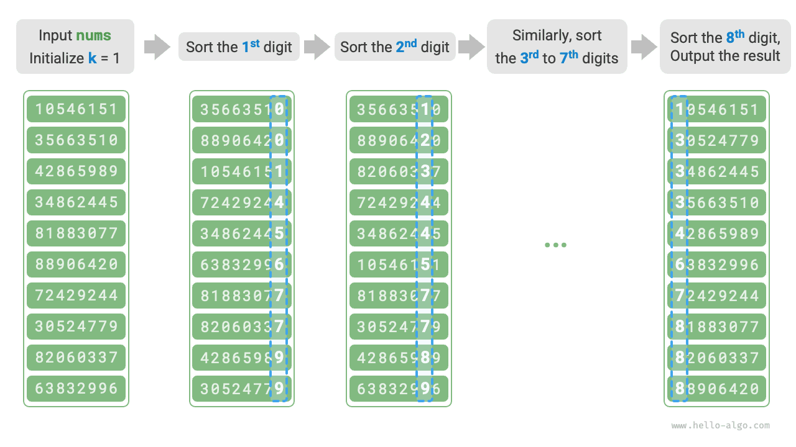

# Поразрядная сортировка

В предыдущем разделе мы познакомились с сортировкой подсчетом: она подходит для случаев, когда объем данных $n$ велик, а диапазон значений $m$ сравнительно мал. Предположим теперь, что нужно отсортировать $n = 10^6$ студенческих идентификаторов, причем каждый идентификатор является $8$-значным числом. Тогда диапазон данных $m = 10^8$ оказывается очень большим; сортировка подсчетом потребует огромного объема памяти, а поразрядная сортировка позволяет этого избежать.

<u>Поразрядная сортировка (radix sort)</u> по своей основной идее совпадает с сортировкой подсчетом и тоже реализует сортировку через подсчет количества. Поверх этого поразрядная сортировка использует иерархию разрядов числа и последовательно сортирует данные по каждому разряду, получая итоговый упорядоченный результат.

## Алгоритм

Рассмотрим пример со студенческими номерами: будем считать, что младший разряд имеет номер $1$ , а старший - номер $8$ . Тогда процесс поразрядной сортировки показан на рисунке ниже.

1. Инициализировать номер разряда $k = 1$ .
2. Выполнить "сортировку подсчетом" по $k$-му разряду студенческого номера. После этого данные будут упорядочены по $k$-му разряду по возрастанию.
3. Увеличить $k$ на $1$ и вернуться к шагу `2.` , продолжая процесс, пока сортировка не будет выполнена для всех разрядов.



Ниже разберем реализацию кода. Для числа $x$ в системе счисления с основанием $d$ получить его $k$-й разряд $x_k$ можно по формуле:

$$
x_k = \lfloor\frac{x}{d^{k-1}}\rfloor \bmod d
$$

где $\lfloor a \rfloor$ обозначает округление числа $a$ вниз, а $\bmod \: d$ означает взятие остатка по модулю $d$ . Для студенческих идентификаторов выполняется $d = 10$ и $k \in [1, 8]$ .

Кроме того, нам нужно слегка изменить код сортировки подсчетом, чтобы он мог сортировать числа по их $k$-му разряду:

```src
[file]{radix_sort}-[class]{}-[func]{radix_sort}
```

!!! question "Почему сортировка выполняется от младшего разряда к старшему?"

    В последовательных раундах сортировки результаты более позднего раунда перекрывают результаты предыдущего. Например, если после первого раунда получилось $a < b$ , а после второго - $a > b$ , то именно результат второго раунда станет окончательным. Поскольку старшие разряды имеют более высокий приоритет, сначала нужно сортировать по младшим разрядам, а затем по старшим.

## Характеристики алгоритма

По сравнению с сортировкой подсчетом поразрядная сортировка подходит для случаев с большим диапазоном чисел, **но только при условии, что данные можно представить в виде чисел фиксированной длины и число разрядов не слишком велико**. Например, числа с плавающей запятой плохо подходят для поразрядной сортировки, потому что число разрядов $k$ слишком велико и может привести к ситуации $O(nk) \gg O(n^2)$ .

- **Временная сложность равна $O(nk)$, алгоритм не является адаптивным**: пусть объем данных равен $n$ , числа записаны в системе счисления с основанием $d$ , а максимальное число разрядов равно $k$ . Тогда выполнение сортировки подсчетом для одного разряда требует $O(n + d)$ времени, а сортировка по всем $k$ разрядам требует $O((n + d)k)$ времени. Обычно $d$ и $k$ сравнительно малы, поэтому временная сложность стремится к $O(n)$ .
- **Пространственная сложность равна $O(n + d)$, сортировка не выполняется на месте**: как и в сортировке подсчетом, здесь требуются массивы `res` и `counter` длины $n$ и $d$ .
- **Стабильная сортировка**: если сортировка подсчетом стабильна, то и поразрядная сортировка стабильна; если же сортировка подсчетом нестабильна, поразрядная сортировка не может гарантировать корректный результат.
