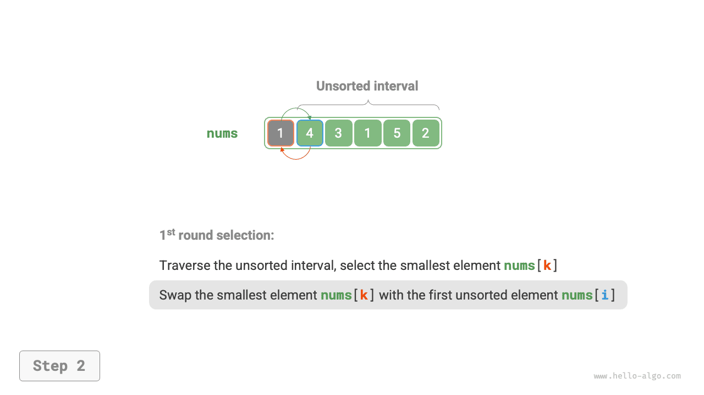
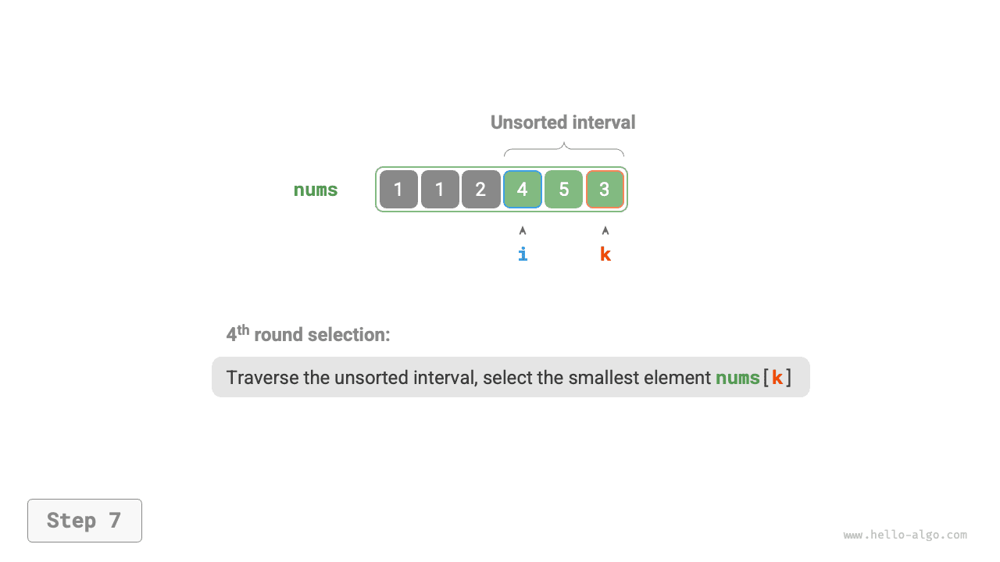
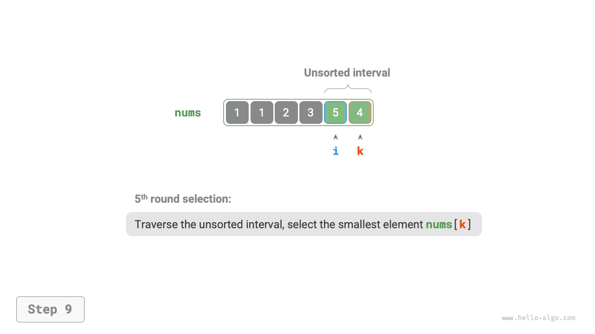
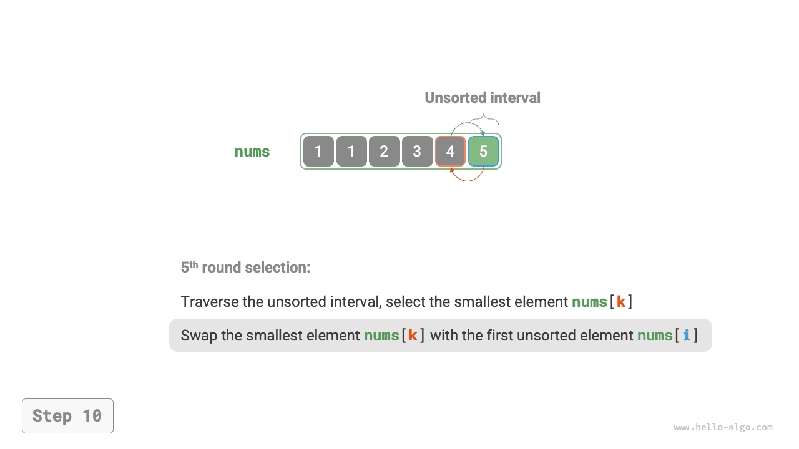
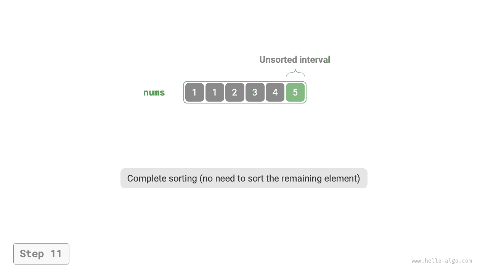

# Сортировка выбором

<u>Сортировка выбором (selection sort)</u> работает очень просто: запускается цикл, и на каждом шаге из неотсортированного диапазона выбирается минимальный элемент, после чего он переносится в конец уже отсортированного диапазона.

Пусть длина массива равна $n$ ; тогда процесс сортировки выбором выглядит так, как показано на рисунке ниже.

1. В начальном состоянии все элементы не отсортированы, то есть неотсортированный диапазон индексов равен $[0, n-1]$ .
2. Выбрать минимальный элемент из диапазона $[0, n-1]$ и поменять его местами с элементом в позиции $0$ . После этого первые 1 элементов массива отсортированы.
3. Выбрать минимальный элемент из диапазона $[1, n-1]$ и поменять его местами с элементом в позиции $1$ . После этого первые 2 элементов массива отсортированы.
4. Продолжать по аналогии. После $n - 1$ раундов выбора и обмена первые $n - 1$ элементов массива будут отсортированы.
5. Оставшийся элемент обязательно является максимальным, сортировать его не нужно, поэтому массив считается отсортированным.

=== "<1>"
    

=== "<2>"
    

=== "<3>"
    

=== "<4>"
    

=== "<5>"
    

=== "<6>"
    

=== "<7>"
    

=== "<8>"
    

=== "<9>"
    

=== "<10>"
    

=== "<11>"
    

В коде мы используем $k$ для записи минимального элемента в пределах неотсортированного диапазона:

```src
[file]{selection_sort}-[class]{}-[func]{selection_sort}
```

## Характеристики алгоритма

- **Временная сложность равна $O(n^2)$, сортировка не является адаптивной**: внешний цикл выполняется $n - 1$ раз; в первом раунде длина неотсортированного диапазона равна $n$ , а в последнем - $2$ , то есть отдельные раунды содержат $n$, $n - 1$, $\dots$, $3$, $2$ проходов внутреннего цикла, их сумма равна $\frac{(n - 1)(n + 2)}{2}$ .
- **Пространственная сложность равна $O(1)$, сортировка выполняется на месте**: указатели $i$ и $j$ используют константный объем дополнительной памяти.
- **Нестабильная сортировка**: как показано на рисунке ниже, элемент `nums[i]` может быть переставлен вправо от другого равного ему элемента, из-за чего их относительный порядок изменится.


