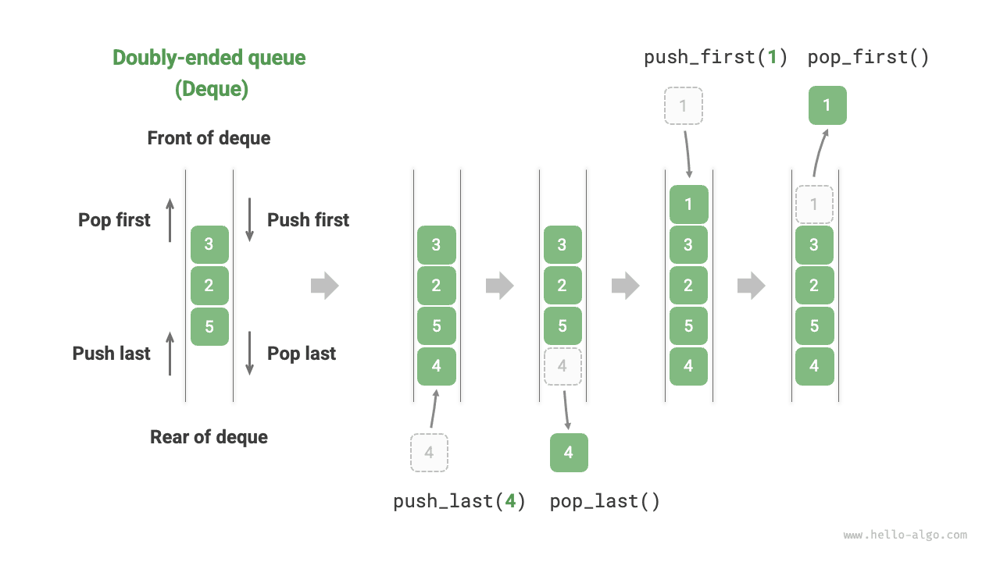
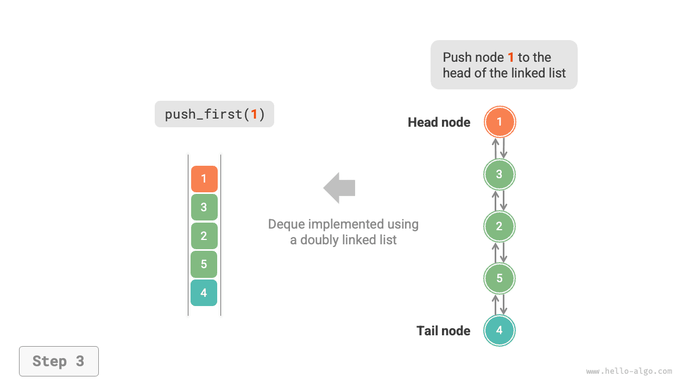
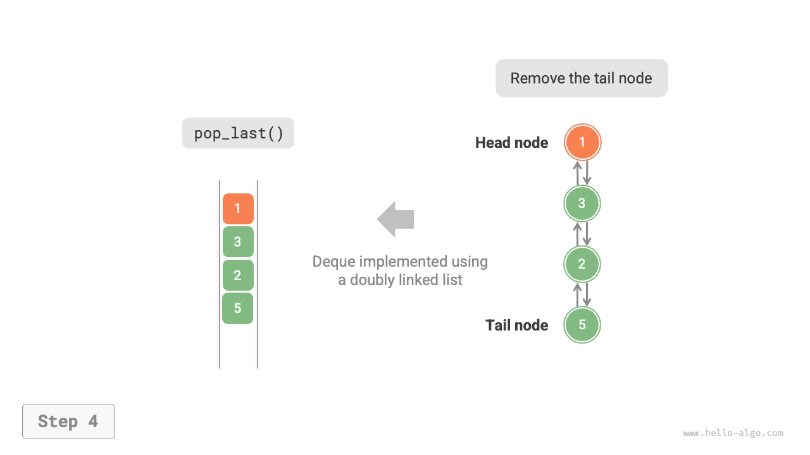
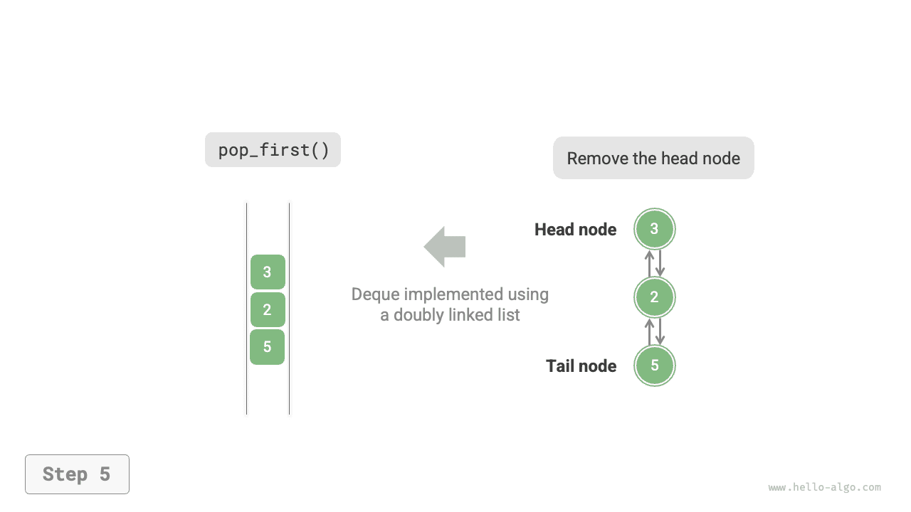
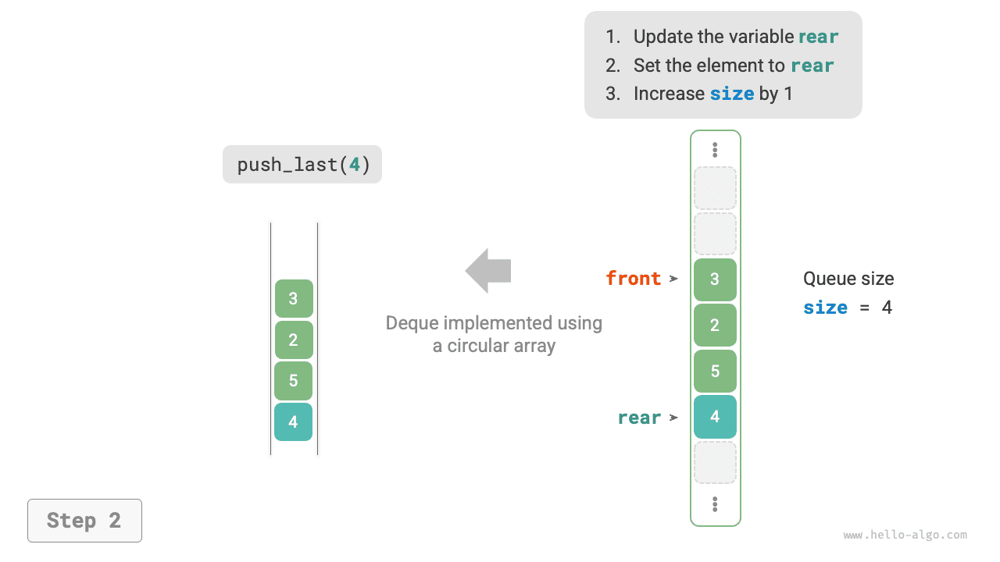
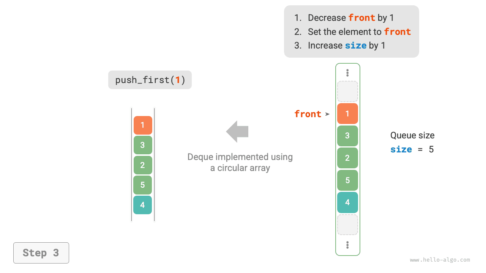

# Двусторонняя очередь

В очереди мы можем удалять элементы только из головы или добавлять их только в хвост. Как показано на рисунке ниже, <u>двусторонняя очередь (double-ended queue)</u> обеспечивает более высокую гибкость и позволяет выполнять добавление и удаление элементов как с головы, так и с хвоста.



## Основные операции с двусторонней очередью

Распространенные операции двусторонней очереди приведены в таблице ниже. Конкретные названия методов зависят от используемого языка программирования.

<p align="center"> Таблица <id> &nbsp; Эффективность операций двусторонней очереди </p>

| Имя метода   | Описание                         | Временная сложность |
| ------------ | -------------------------------- | ------------------- |
| `push_first()` | Добавить элемент в голову очереди | $O(1)$     |
| `push_last()`  | Добавить элемент в хвост очереди  | $O(1)$     |
| `pop_first()`  | Удалить элемент из головы очереди | $O(1)$     |
| `pop_last()`   | Удалить элемент из хвоста очереди | $O(1)$     |
| `peek_first()` | Просмотреть элемент в голове очереди | $O(1)$  |
| `peek_last()`  | Просмотреть элемент в хвосте очереди | $O(1)$  |

Точно так же мы можем напрямую использовать уже реализованные в языках программирования классы двусторонней очереди:

=== "Python"

    ```python title="deque.py"
    from collections import deque

    # Инициализация двусторонней очереди
    deq: deque[int] = deque()

    # Поместить элементы в очередь
    deq.append(2)      # Добавить в хвост
    deq.append(5)
    deq.append(4)
    deq.appendleft(3)  # Добавить в голову
    deq.appendleft(1)

    # Просмотреть элементы
    front: int = deq[0]  # Элемент в голове
    rear: int = deq[-1]  # Элемент в хвосте

    # Извлечь элементы из очереди
    pop_front: int = deq.popleft()  # Извлечь элемент из головы
    pop_rear: int = deq.pop()       # Извлечь элемент из хвоста

    # Получить длину двусторонней очереди
    size: int = len(deq)

    # Проверить, пуста ли двусторонняя очередь
    is_empty: bool = len(deq) == 0
    ```

=== "C++"

    ```cpp title="deque.cpp"
    /* Инициализация двусторонней очереди */
    deque<int> deque;

    /* Поместить элементы в очередь */
    deque.push_back(2);   // Добавить в хвост
    deque.push_back(5);
    deque.push_back(4);
    deque.push_front(3);  // Добавить в голову
    deque.push_front(1);

    /* Просмотреть элементы */
    int front = deque.front(); // Элемент в голове
    int back = deque.back();   // Элемент в хвосте

    /* Извлечь элементы из очереди */
    deque.pop_front();  // Извлечь элемент из головы
    deque.pop_back();   // Извлечь элемент из хвоста

    /* Получить длину двусторонней очереди */
    int size = deque.size();

    /* Проверить, пуста ли двусторонняя очередь */
    bool empty = deque.empty();
    ```

=== "Java"

    ```java title="deque.java"
    /* Инициализация двусторонней очереди */
    Deque<Integer> deque = new LinkedList<>();

    /* Поместить элементы в очередь */
    deque.offerLast(2);   // Добавить в хвост
    deque.offerLast(5);
    deque.offerLast(4);
    deque.offerFirst(3);  // Добавить в голову
    deque.offerFirst(1);

    /* Просмотреть элементы */
    int peekFirst = deque.peekFirst();  // Элемент в голове
    int peekLast = deque.peekLast();    // Элемент в хвосте

    /* Извлечь элементы из очереди */
    int popFirst = deque.pollFirst();  // Извлечь элемент из головы
    int popLast = deque.pollLast();    // Извлечь элемент из хвоста

    /* Получить длину двусторонней очереди */
    int size = deque.size();

    /* Проверить, пуста ли двусторонняя очередь */
    boolean isEmpty = deque.isEmpty();
    ```

=== "C#"

    ```csharp title="deque.cs"
    /* Инициализация двусторонней очереди */
    // В C# двустороннюю очередь обычно моделируют через связный список LinkedList
    LinkedList<int> deque = new();

    /* Поместить элементы в очередь */
    deque.AddLast(2);   // Добавить в хвост
    deque.AddLast(5);
    deque.AddLast(4);
    deque.AddFirst(3);  // Добавить в голову
    deque.AddFirst(1);

    /* Просмотреть элементы */
    int peekFirst = deque.First.Value;  // Элемент в голове
    int peekLast = deque.Last.Value;    // Элемент в хвосте

    /* Извлечь элементы из очереди */
    deque.RemoveFirst();  // Извлечь элемент из головы
    deque.RemoveLast();   // Извлечь элемент из хвоста

    /* Получить длину двусторонней очереди */
    int size = deque.Count;

    /* Проверить, пуста ли двусторонняя очередь */
    bool isEmpty = deque.Count == 0;
    ```

=== "Go"

    ```go title="deque_test.go"
    /* Инициализация двусторонней очереди */
    // В Go list обычно используется как двусторонняя очередь
    deque := list.New()

    /* Поместить элементы в очередь */
    deque.PushBack(2)      // Добавить в хвост
    deque.PushBack(5)
    deque.PushBack(4)
    deque.PushFront(3)     // Добавить в голову
    deque.PushFront(1)

    /* Просмотреть элементы */
    front := deque.Front() // Элемент в голове
    rear := deque.Back()   // Элемент в хвосте

    /* Извлечь элементы из очереди */
    deque.Remove(front)    // Извлечь элемент из головы
    deque.Remove(rear)     // Извлечь элемент из хвоста

    /* Получить длину двусторонней очереди */
    size := deque.Len()

    /* Проверить, пуста ли двусторонняя очередь */
    isEmpty := deque.Len() == 0
    ```

=== "Swift"

    ```swift title="deque.swift"
    /* Инициализация двусторонней очереди */
    // В Swift нет встроенного класса двусторонней очереди, поэтому можно использовать Array как двустороннюю очередь
    var deque: [Int] = []

    /* Поместить элементы в очередь */
    deque.append(2) // Добавить в хвост
    deque.append(5)
    deque.append(4)
    deque.insert(3, at: 0) // Добавить в голову
    deque.insert(1, at: 0)

    /* Просмотреть элементы */
    let peekFirst = deque.first! // Элемент в голове
    let peekLast = deque.last! // Элемент в хвосте

    /* Извлечь элементы из очереди */
    // При моделировании через Array сложность popFirst равна O(n)
    let popFirst = deque.removeFirst() // Извлечь элемент из головы
    let popLast = deque.removeLast() // Извлечь элемент из хвоста

    /* Получить длину двусторонней очереди */
    let size = deque.count

    /* Проверить, пуста ли двусторонняя очередь */
    let isEmpty = deque.isEmpty
    ```

=== "JS"

    ```javascript title="deque.js"
    /* Инициализация двусторонней очереди */
    // В JavaScript нет встроенной двусторонней очереди, поэтому можно использовать Array как двустороннюю очередь
    const deque = [];

    /* Поместить элементы в очередь */
    deque.push(2);
    deque.push(5);
    deque.push(4);
    // Обрати внимание: поскольку это массив, метод unshift() имеет сложность O(n)
    deque.unshift(3);
    deque.unshift(1);

    /* Просмотреть элементы */
    const peekFirst = deque[0];
    const peekLast = deque[deque.length - 1];

    /* Извлечь элементы из очереди */
    // Обрати внимание: поскольку это массив, метод shift() имеет сложность O(n)
    const popFront = deque.shift();
    const popBack = deque.pop();

    /* Получить длину двусторонней очереди */
    const size = deque.length;

    /* Проверить, пуста ли двусторонняя очередь */
    const isEmpty = size === 0;
    ```

=== "TS"

    ```typescript title="deque.ts"
    /* Инициализация двусторонней очереди */
    // В TypeScript нет встроенной двусторонней очереди, поэтому можно использовать Array как двустороннюю очередь
    const deque: number[] = [];

    /* Поместить элементы в очередь */
    deque.push(2);
    deque.push(5);
    deque.push(4);
    // Обрати внимание: поскольку это массив, метод unshift() имеет сложность O(n)
    deque.unshift(3);
    deque.unshift(1);

    /* Просмотреть элементы */
    const peekFirst: number = deque[0];
    const peekLast: number = deque[deque.length - 1];

    /* Извлечь элементы из очереди */
    // Обрати внимание: поскольку это массив, метод shift() имеет сложность O(n)
    const popFront: number = deque.shift() as number;
    const popBack: number = deque.pop() as number;

    /* Получить длину двусторонней очереди */
    const size: number = deque.length;

    /* Проверить, пуста ли двусторонняя очередь */
    const isEmpty: boolean = size === 0;
    ```

=== "Dart"

    ```dart title="deque.dart"
    /* Инициализация двусторонней очереди */
    // В Dart Queue определена как двусторонняя очередь
    Queue<int> deque = Queue<int>();

    /* Поместить элементы в очередь */
    deque.addLast(2);  // Добавить в хвост
    deque.addLast(5);
    deque.addLast(4);
    deque.addFirst(3); // Добавить в голову
    deque.addFirst(1);

    /* Просмотреть элементы */
    int peekFirst = deque.first; // Элемент в голове
    int peekLast = deque.last;   // Элемент в хвосте

    /* Извлечь элементы из очереди */
    int popFirst = deque.removeFirst(); // Извлечь элемент из головы
    int popLast = deque.removeLast();   // Извлечь элемент из хвоста

    /* Получить длину двусторонней очереди */
    int size = deque.length;

    /* Проверить, пуста ли двусторонняя очередь */
    bool isEmpty = deque.isEmpty;
    ```

=== "Rust"

    ```rust title="deque.rs"
    /* Инициализация двусторонней очереди */
    let mut deque: VecDeque<u32> = VecDeque::new();

    /* Поместить элементы в очередь */
    deque.push_back(2);  // Добавить в хвост
    deque.push_back(5);
    deque.push_back(4);
    deque.push_front(3); // Добавить в голову
    deque.push_front(1);

    /* Просмотреть элементы */
    if let Some(front) = deque.front() { // Элемент в голове
    }
    if let Some(rear) = deque.back() {   // Элемент в хвосте
    }

    /* Извлечь элементы из очереди */
    if let Some(pop_front) = deque.pop_front() { // Извлечь элемент из головы
    }
    if let Some(pop_rear) = deque.pop_back() {   // Извлечь элемент из хвоста
    }

    /* Получить длину двусторонней очереди */
    let size = deque.len();

    /* Проверить, пуста ли двусторонняя очередь */
    let is_empty = deque.is_empty();
    ```

=== "C"

    ```c title="deque.c"
    // В C нет встроенной двусторонней очереди
    ```

=== "Kotlin"

    ```kotlin title="deque.kt"
    /* Инициализация двусторонней очереди */
    val deque = LinkedList<Int>()

    /* Поместить элементы в очередь */
    deque.offerLast(2)  // Добавить в хвост
    deque.offerLast(5)
    deque.offerLast(4)
    deque.offerFirst(3) // Добавить в голову
    deque.offerFirst(1)

    /* Просмотреть элементы */
    val peekFirst = deque.peekFirst() // Элемент в голове
    val peekLast = deque.peekLast()   // Элемент в хвосте

    /* Извлечь элементы из очереди */
    val popFirst = deque.pollFirst() // Извлечь элемент из головы
    val popLast = deque.pollLast()   // Извлечь элемент из хвоста

    /* Получить длину двусторонней очереди */
    val size = deque.size

    /* Проверить, пуста ли двусторонняя очередь */
    val isEmpty = deque.isEmpty()
    ```

=== "Ruby"

    ```ruby title="deque.rb"
    # Инициализация двусторонней очереди
    # В Ruby нет встроенной двусторонней очереди, поэтому можно использовать Array как двустороннюю очередь
    deque = []

    # Поместить элементы в очередь
    deque << 2
    deque << 5
    deque << 4
    # Обрати внимание: поскольку это массив, метод Array#unshift имеет сложность O(n)
    deque.unshift(3)
    deque.unshift(1)

    # Просмотреть элементы
    peek_first = deque.first
    peek_last = deque.last

    # Извлечь элементы из очереди
    # Обрати внимание: поскольку это массив, метод Array#shift имеет сложность O(n)
    pop_front = deque.shift
    pop_back = deque.pop

    # Получить длину двусторонней очереди
    size = deque.length

    # Проверить, пуста ли двусторонняя очередь
    is_empty = size.zero?
    ```

??? pythontutor "Визуализация выполнения"

    https://pythontutor.com/render.html#code=from%20collections%20import%20deque%0A%0A%22%22%22Driver%20Code%22%22%22%0Aif%20__name__%20%3D%3D%20%22__main__%22%3A%0A%20%20%20%20%23%20%D0%98%D0%BD%D0%B8%D1%86%D0%B8%D0%B0%D0%BB%D0%B8%D0%B7%D0%B8%D1%80%D0%BE%D0%B2%D0%B0%D1%82%D1%8C%20%D0%B4%D0%B2%D1%83%D1%81%D1%82%D0%BE%D1%80%D0%BE%D0%BD%D0%BD%D1%8E%D1%8E%20%D0%BE%D1%87%D0%B5%D1%80%D0%B5%D0%B4%D1%8C%0A%20%20%20%20deq%20%3D%20deque%28%29%0A%0A%20%20%20%20%23%20%D0%9F%D0%BE%D0%BC%D0%B5%D1%81%D1%82%D0%B8%D1%82%D1%8C%20%D1%8D%D0%BB%D0%B5%D0%BC%D0%B5%D0%BD%D1%82%20%D0%B2%20%D0%BE%D1%87%D0%B5%D1%80%D0%B5%D0%B4%D1%8C%0A%20%20%20%20deq.append%282%29%20%20%23%20%D0%94%D0%BE%D0%B1%D0%B0%D0%B2%D0%B8%D1%82%D1%8C%20%D0%B2%20%D1%85%D0%B2%D0%BE%D1%81%D1%82%20%D0%BE%D1%87%D0%B5%D1%80%D0%B5%D0%B4%D0%B8%0A%20%20%20%20deq.append%285%29%0A%20%20%20%20deq.append%284%29%0A%20%20%20%20deq.appendleft%283%29%20%20%23%20%D0%94%D0%BE%D0%B1%D0%B0%D0%B2%D0%B8%D1%82%D1%8C%20%D0%B2%20%D0%B3%D0%BE%D0%BB%D0%BE%D0%B2%D1%83%20%D0%BE%D1%87%D0%B5%D1%80%D0%B5%D0%B4%D0%B8%0A%20%20%20%20deq.appendleft%281%29%0A%20%20%20%20print%28%22%D0%B4%D0%B2%D1%83%D1%81%D1%82%D0%BE%D1%80%D0%BE%D0%BD%D0%BD%D1%8F%D1%8F%20%D0%BE%D1%87%D0%B5%D1%80%D0%B5%D0%B4%D1%8C%20deque%20%3D%22%2C%20deq%29%0A%0A%20%20%20%20%23%20%D0%9F%D0%BE%D0%BB%D1%83%D1%87%D0%B8%D1%82%D1%8C%20%D0%B4%D0%BE%D1%81%D1%82%D1%83%D0%BF%20%D0%BA%20%D1%8D%D0%BB%D0%B5%D0%BC%D0%B5%D0%BD%D1%82%D1%83%0A%20%20%20%20front%20%3D%20deq%5B0%5D%20%20%23%20%D1%8D%D0%BB%D0%B5%D0%BC%D0%B5%D0%BD%D1%82%20%D0%B2%20%D0%B3%D0%BE%D0%BB%D0%BE%D0%B2%D0%B5%20%D0%BE%D1%87%D0%B5%D1%80%D0%B5%D0%B4%D0%B8%0A%20%20%20%20print%28%22%D0%AD%D0%BB%D0%B5%D0%BC%D0%B5%D0%BD%D1%82%20%D0%B2%20%D0%BD%D0%B0%D1%87%D0%B0%D0%BB%D0%B5%20%D0%BE%D1%87%D0%B5%D1%80%D0%B5%D0%B4%D0%B8%20front%20%3D%22%2C%20front%29%0A%20%20%20%20rear%20%3D%20deq%5B-1%5D%20%20%23%20%D1%8D%D0%BB%D0%B5%D0%BC%D0%B5%D0%BD%D1%82%20%D0%B2%20%D1%85%D0%B2%D0%BE%D1%81%D1%82%D0%B5%20%D0%BE%D1%87%D0%B5%D1%80%D0%B5%D0%B4%D0%B8%0A%20%20%20%20print%28%22%D1%8D%D0%BB%D0%B5%D0%BC%D0%B5%D0%BD%D1%82%20%D0%B2%20%D1%85%D0%B2%D0%BE%D1%81%D1%82%D0%B5%20%D0%BE%D1%87%D0%B5%D1%80%D0%B5%D0%B4%D0%B8%20rear%20%3D%22%2C%20rear%29%0A%0A%20%20%20%20%23%20%D0%98%D0%B7%D0%B2%D0%BB%D0%B5%D1%87%D1%8C%20%D1%8D%D0%BB%D0%B5%D0%BC%D0%B5%D0%BD%D1%82%20%D0%B8%D0%B7%20%D0%BE%D1%87%D0%B5%D1%80%D0%B5%D0%B4%D0%B8%0A%20%20%20%20pop_front%20%3D%20deq.popleft%28%29%20%20%23%20%D0%B3%D0%BE%D0%BB%D0%BE%D0%B2%D0%B0%20%D0%BE%D1%87%D0%B5%D1%80%D0%B5%D0%B4%D0%B8%D0%98%D0%B7%D0%B2%D0%BB%D0%B5%D1%87%D1%8C%20%D1%8D%D0%BB%D0%B5%D0%BC%D0%B5%D0%BD%D1%82%20%D0%B8%D0%B7%20%D0%BE%D1%87%D0%B5%D1%80%D0%B5%D0%B4%D0%B8%0A%20%20%20%20print%28%22%D0%AD%D0%BB%D0%B5%D0%BC%D0%B5%D0%BD%D1%82%2C%20%D0%B8%D0%B7%D0%B2%D0%BB%D0%B5%D1%87%D0%B5%D0%BD%D0%BD%D1%8B%D0%B9%20%D0%B8%D0%B7%20%D0%B3%D0%BE%D0%BB%D0%BE%D0%B2%D1%8B%20%D0%BE%D1%87%D0%B5%D1%80%D0%B5%D0%B4%D0%B8%2C%20pop_front%20%3D%22%2C%20pop_front%29%0A%20%20%20%20print%28%22deque%20%D0%BF%D0%BE%D1%81%D0%BB%D0%B5%20%D0%B8%D0%B7%D0%B2%D0%BB%D0%B5%D1%87%D0%B5%D0%BD%D0%B8%D1%8F%20%D0%B8%D0%B7%20%D0%B3%D0%BE%D0%BB%D0%BE%D0%B2%D1%8B%20%3D%22%2C%20deq%29%0A%20%20%20%20pop_rear%20%3D%20deq.pop%28%29%20%20%23%20%D1%85%D0%B2%D0%BE%D1%81%D1%82%20%D0%BE%D1%87%D0%B5%D1%80%D0%B5%D0%B4%D0%B8%D0%98%D0%B7%D0%B2%D0%BB%D0%B5%D1%87%D1%8C%20%D1%8D%D0%BB%D0%B5%D0%BC%D0%B5%D0%BD%D1%82%20%D0%B8%D0%B7%20%D0%BE%D1%87%D0%B5%D1%80%D0%B5%D0%B4%D0%B8%0A%20%20%20%20print%28%22%D0%AD%D0%BB%D0%B5%D0%BC%D0%B5%D0%BD%D1%82%2C%20%D0%B8%D0%B7%D0%B2%D0%BB%D0%B5%D1%87%D0%B5%D0%BD%D0%BD%D1%8B%D0%B9%20%D0%B8%D0%B7%20%D1%85%D0%B2%D0%BE%D1%81%D1%82%D0%B0%20%D0%BE%D1%87%D0%B5%D1%80%D0%B5%D0%B4%D0%B8%2C%20pop_rear%20%3D%22%2C%20pop_rear%29%0A%20%20%20%20print%28%22deque%20%D0%BF%D0%BE%D1%81%D0%BB%D0%B5%20%D0%B8%D0%B7%D0%B2%D0%BB%D0%B5%D1%87%D0%B5%D0%BD%D0%B8%D1%8F%20%D0%B8%D0%B7%20%D1%85%D0%B2%D0%BE%D1%81%D1%82%D0%B0%20%3D%22%2C%20deq%29%0A%0A%20%20%20%20%23%20%D0%9F%D0%BE%D0%BB%D1%83%D1%87%D0%B8%D1%82%D1%8C%20%D0%B4%D0%BB%D0%B8%D0%BD%D1%83%20%D0%B4%D0%B2%D1%83%D1%81%D1%82%D0%BE%D1%80%D0%BE%D0%BD%D0%BD%D0%B5%D0%B9%20%D0%BE%D1%87%D0%B5%D1%80%D0%B5%D0%B4%D0%B8%0A%20%20%20%20size%20%3D%20len%28deq%29%0A%20%20%20%20print%28%22%D0%94%D0%BB%D0%B8%D0%BD%D0%B0%20%D0%B4%D0%B2%D1%83%D1%81%D1%82%D0%BE%D1%80%D0%BE%D0%BD%D0%BD%D0%B5%D0%B9%20%D0%BE%D1%87%D0%B5%D1%80%D0%B5%D0%B4%D0%B8%20size%20%3D%22%2C%20size%29%0A%0A%20%20%20%20%23%20%D0%9F%D1%80%D0%BE%D0%B2%D0%B5%D1%80%D0%B8%D1%82%D1%8C%2C%20%D0%BF%D1%83%D1%81%D1%82%D0%B0%20%D0%BB%D0%B8%20%D0%B4%D0%B2%D1%83%D1%81%D1%82%D0%BE%D1%80%D0%BE%D0%BD%D0%BD%D1%8F%D1%8F%20%D0%BE%D1%87%D0%B5%D1%80%D0%B5%D0%B4%D1%8C%0A%20%20%20%20is_empty%20%3D%20len%28deq%29%20%3D%3D%200%0A%20%20%20%20print%28%22%D0%9F%D1%83%D1%81%D1%82%D0%B0%20%D0%BB%D0%B8%20%D0%B4%D0%B2%D1%83%D1%81%D1%82%D0%BE%D1%80%D0%BE%D0%BD%D0%BD%D1%8F%D1%8F%20%D0%BE%D1%87%D0%B5%D1%80%D0%B5%D0%B4%D1%8C%20%3D%22%2C%20is_empty%29&cumulative=false&curInstr=3&heapPrimitives=nevernest&mode=display&origin=opt-frontend.js&py=311&rawInputLstJSON=%5B%5D&textReferences=false

## Реализация двусторонней очереди *

Реализация двусторонней очереди похожа на реализацию обычной очереди: в качестве базовой структуры данных можно выбрать связный список или массив.

### Реализация на основе двусвязного списка

Вспомним предыдущий раздел: там мы использовали обычный односвязный список для реализации очереди, потому что он позволяет удобно удалять головной узел (это соответствует операции dequeue) и добавлять новый узел после хвостового узла (это соответствует операции enqueue).

Для двусторонней очереди и голова, и хвост допускают операции добавления и удаления элементов. Иначе говоря, двусторонняя очередь требует реализации еще одного симметричного направления операций. Поэтому в качестве базовой структуры данных двусторонней очереди мы используем "двусвязный список".

Как показано на рисунках ниже, мы рассматриваем головной и хвостовой узлы двусвязного списка как голову и хвост двусторонней очереди и одновременно реализуем функции добавления и удаления узлов с обеих сторон.

=== "LinkedListDeque"
    

=== "push_last()"
    

=== "push_first()"
    

=== "pop_last()"
    

=== "pop_first()"
    

Код реализации приведен ниже:

```src
[file]{linkedlist_deque}-[class]{linked_list_deque}-[func]{}
```

### Реализация на основе массива

Как показано на рисунках ниже, аналогично реализации очереди на массиве мы также можем использовать кольцевой массив для реализации двусторонней очереди.

=== "ArrayDeque"
    

=== "push_last()"
    

=== "push_first()"
    

=== "pop_last()"
    

=== "pop_first()"
    

На основе реализации обычной очереди нужно лишь добавить методы "enqueue в голову" и "dequeue из хвоста":

```src
[file]{array_deque}-[class]{array_deque}-[func]{}
```

## Применение двусторонней очереди

Двусторонняя очередь сочетает в себе логику стека и очереди, **поэтому она может покрыть все сценарии применения обеих структур и при этом предоставляет более высокую степень свободы**.

Мы знаем, что функция "undo" в программном обеспечении обычно реализуется с помощью стека: система `push`-ит каждое изменение в стек, а затем использует `pop` для отмены. Однако, учитывая ограниченность системных ресурсов, программы обычно ограничивают число шагов отмены (например, разрешают хранить только $50$ шагов). Когда длина стека превышает $50$, программе нужно удалить элемент с дна стека (то есть с головы очереди). **Но стек не может реализовать такую операцию, и в этом случае его приходится заменять двусторонней очередью**. Обрати внимание: основная логика "undo" по-прежнему следует стековому правилу LIFO, просто двусторонняя очередь позволяет более гибко реализовать некоторые дополнительные механизмы.
