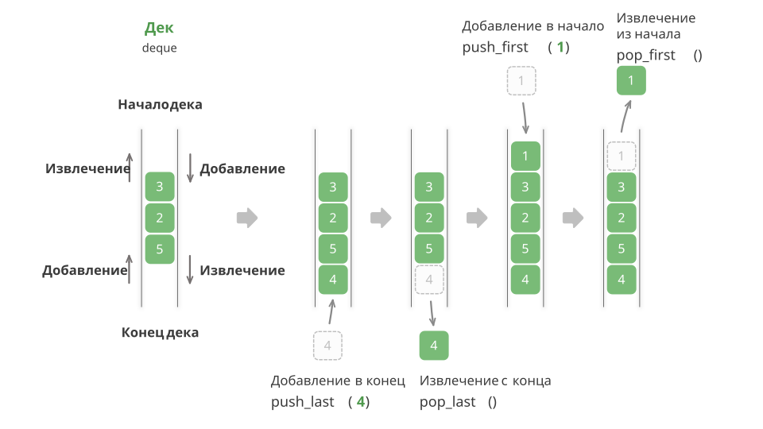
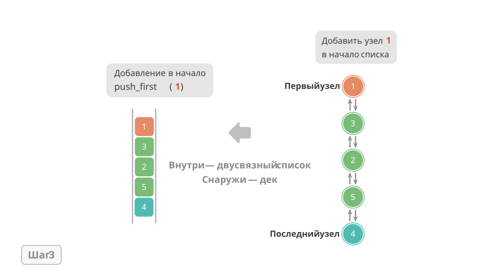
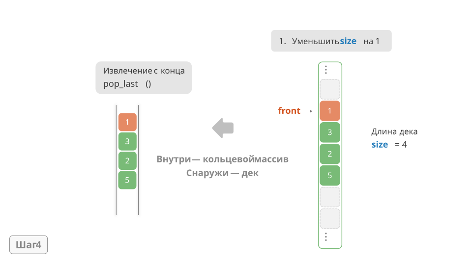
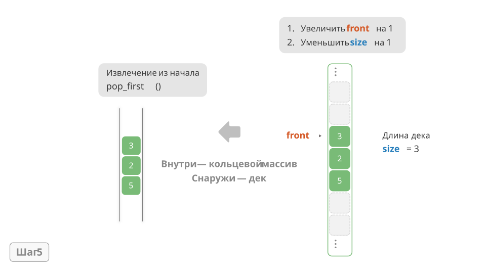

# 5.3 &nbsp; Двусторонняя очередь

В обычной очереди удалять элементы можно только из начала, а добавлять — только в конец. Как показано на рисунке 5-7, <u>двусторонняя очередь (дек, double-ended queue)</u> устроена гибче: на каждом из двух концов элементы можно и добавлять, и удалять.

{ class="animation-figure" }

<p align="center"> Рисунок 5-7 &nbsp; Операции с двусторонней очередью </p>

## 5.3.1 &nbsp; Основные операции с деком

В таблице ниже приведены основные операции с деком. Имена методов зависят от языка программирования.

<p align="center">Таблица <id>&nbsp; Временная сложность операций с деком</p>

<div class="center-table" markdown>

| Имя метода         | Описание             | Временная сложность |
| -------------- | ---------------- | ---------- |
| `push_first()` | Добавить элемент в начало дека | $O(1)$     |
| `push_last()`  | Добавить элемент в конец дека | $O(1)$     |
| `pop_first()`  | Удалить первый элемент дека     | $O(1)$     |
| `pop_last()`   | Удалить последний элемент дека     | $O(1)$     |
| `peek_first()` | Посмотреть первый элемент дека     | $O(1)$     |
| `peek_last()`  | Посмотреть последний элемент дека     | $O(1)$     |

</div>

Как и в случае с обычной очередью, можно воспользоваться готовым классом двусторонней очереди в выбранном языке программирования.

=== "Python"

    ```python title="deque.py"
    from collections import deque

    # Инициализировать дек
    deq: deque[int] = deque()

    # Добавить элементы в дек
    deq.append(2)  # Добавить в конец дека
    deq.append(5)
    deq.append(4)
    deq.appendleft(3)  # Добавить в начало дека
    deq.appendleft(1)

    # Посмотреть первый и последний элементы
    front: int = deq[0]  # Первый элемент дека
    rear: int = deq[-1]  # Последний элемент дека

    # Извлечь элементы из дека
    pop_front: int = deq.popleft()  # Извлечь элемент из начала дека
    pop_rear: int = deq.pop()  # Извлечь элемент из конца дека

    # Получить длину дека
    size: int = len(deq)

    # Проверить, пуст ли дек
    is_empty: bool = len(deq) == 0
    ```

=== "C++"

    ```cpp title="deque.cpp"
    /* Инициализировать дек */
    deque<int> deque;

    /* Добавить элементы в дек */
    deque.push_back(2); // Добавить в конец дека
    deque.push_back(5);
    deque.push_back(4);
    deque.push_front(3); // Добавить в начало дека
    deque.push_front(1);

    /* Посмотреть первый и последний элементы */
    int front = deque.front(); // Первый элемент дека
    int back = deque.back(); // Последний элемент дека

    /* Извлечь элементы из дека */
    deque.pop_front(); // Извлечь элемент из начала дека
    deque.pop_back(); // Извлечь элемент из конца дека

    /* Получить длину дека */
    int size = deque.size();

    /* Проверить, пуст ли дек */
    bool empty = deque.empty();
    ```

=== "Java"

    ```java title="deque.java"
    /* Инициализировать дек */
    Deque<Integer> deque = new LinkedList<>();

    /* Добавить элементы в дек */
    deque.offerLast(2); // Добавить в конец дека
    deque.offerLast(5);
    deque.offerLast(4);
    deque.offerFirst(3); // Добавить в начало дека
    deque.offerFirst(1);

    /* Посмотреть первый и последний элементы */
    int peekFirst = deque.peekFirst(); // Первый элемент дека
    int peekLast = deque.peekLast(); // Последний элемент дека

    /* Извлечь элементы из дека */
    int popFirst = deque.pollFirst(); // Извлечь элемент из начала дека
    int popLast = deque.pollLast(); // Извлечь элемент из конца дека

    /* Получить длину дека */
    int size = deque.size();

    /* Проверить, пуст ли дек */
    boolean isEmpty = deque.isEmpty();
    ```

=== "C#"

    ```csharp title="deque.cs"
    /* Инициализировать дек */
    // В C# в качестве дека используется связный список LinkedList
    LinkedList<int> deque = new();

    /* Добавить элементы в дек */
    deque.AddLast(2);   // Добавить в конец дека
    deque.AddLast(5);
    deque.AddLast(4);
    deque.AddFirst(3);  // Добавить в начало дека
    deque.AddFirst(1);

    /* Посмотреть первый и последний элементы */
    int? peekFirst = deque.First?.Value;  // Первый элемент дека
    int? peekLast = deque.Last?.Value;    // Последний элемент дека

    /* Извлечь элементы из дека */
    deque.RemoveFirst();  // Извлечь элемент из начала дека
    deque.RemoveLast();   // Извлечь элемент из конца дека

    /* Получить длину дека */
    int size = deque.Count;

    /* Проверить, пуст ли дек */
    bool isEmpty = deque.Count == 0;
    ```

=== "Go"

    ```go title="deque_test.go"
    /* Инициализировать дек */
    // В Go в качестве дека используется список из пакета list
    deque := list.New()

    /* Добавить элементы в дек */
    deque.PushBack(2) // Добавить в конец дека
    deque.PushBack(5)
    deque.PushBack(4)
    deque.PushFront(3) // Добавить в начало дека
    deque.PushFront(1)

    /* Посмотреть первый и последний элементы */
    front := deque.Front() // Первый элемент дека
    rear := deque.Back() // Последний элемент дека

    /* Извлечь элементы из дека */
    deque.Remove(front) // Извлечь элемент из начала дека
    deque.Remove(rear) // Извлечь элемент из конца дека

    /* Получить длину дека */
    size := deque.Len()

    /* Проверить, пуст ли дек */
    isEmpty := deque.Len() == 0
    ```

=== "Swift"

    ```swift title="deque.swift"
    /* Инициализировать дек */
    // В Swift нет встроенного класса дека, поэтому в качестве дека можно использовать Array
    var deque: [Int] = []

    /* Добавить элементы в дек */
    deque.append(2) // Добавить в конец дека
    deque.append(5)
    deque.append(4)
    deque.insert(3, at: 0) // Добавить в начало дека
    deque.insert(1, at: 0)

    /* Посмотреть первый и последний элементы */
    let peekFirst = deque.first! // Первый элемент дека
    let peekLast = deque.last! // Последний элемент дека

    /* Извлечь элементы из дека */
    // При реализации на основе Array сложность removeFirst составляет O(n)
    let popFirst = deque.removeFirst() // Извлечь элемент из начала дека
    let popLast = deque.removeLast() // Извлечь элемент из конца дека

    /* Получить длину дека */
    let size = deque.count

    /* Проверить, пуст ли дек */
    let isEmpty = deque.isEmpty
    ```

=== "JS"

    ```javascript title="deque.js"
    /* Инициализировать дек */
    // В JavaScript нет встроенного дека, поэтому его приходится реализовывать с помощью Array
    const deque = [];

    /* Добавить элементы в дек */
    deque.push(2);
    deque.push(5);
    deque.push(4);
    // Поскольку используется массив, временная сложность метода unshift() составляет O(n)
    deque.unshift(3);
    deque.unshift(1);

    /* Посмотреть первый и последний элементы */
    const peekFirst = deque[0];
    const peekLast = deque[deque.length - 1];

    /* Извлечь элементы из дека */
    // Поскольку используется массив, временная сложность метода shift() составляет O(n)
    const popFront = deque.shift();
    const popBack = deque.pop();

    /* Получить длину дека */
    const size = deque.length;

    /* Проверить, пуст ли дек */
    const isEmpty = size === 0;
    ```

=== "TS"

    ```typescript title="deque.ts"
    /* Инициализировать дек */
    // В TypeScript нет встроенного дека, поэтому его приходится реализовывать с помощью Array
    const deque: number[] = [];

    /* Добавить элементы в дек */
    deque.push(2);
    deque.push(5);
    deque.push(4);
    // Поскольку используется массив, временная сложность метода unshift() составляет O(n)
    deque.unshift(3);
    deque.unshift(1);

    /* Посмотреть первый и последний элементы */
    const peekFirst: number = deque[0];
    const peekLast: number = deque[deque.length - 1];

    /* Извлечь элементы из дека */
    // Поскольку используется массив, временная сложность метода shift() составляет O(n)
    const popFront: number = deque.shift() as number;
    const popBack: number = deque.pop() as number;

    /* Получить длину дека */
    const size: number = deque.length;

    /* Проверить, пуст ли дек */
    const isEmpty: boolean = size === 0;
    ```

=== "Dart"

    ```dart title="deque.dart"
    /* Инициализировать дек */
    // В Dart класс Queue представляет собой двустороннюю очередь
    final Queue<int> deque = Queue();

    /* Добавить элементы в дек */
    deque.addLast(2); // Добавить в конец дека
    deque.addLast(5);
    deque.addLast(4);
    deque.addFirst(3); // Добавить в начало дека
    deque.addFirst(1);

    /* Посмотреть первый и последний элементы */
    final int peekFirst = deque.first; // Первый элемент дека
    final int peekLast = deque.last; // Последний элемент дека

    /* Извлечь элементы из дека */
    final int popFirst = deque.removeFirst(); // Извлечь элемент из начала дека
    final int popLast = deque.removeLast(); // Извлечь элемент из конца дека

    /* Получить длину дека */
    final int size = deque.length;

    /* Проверить, пуст ли дек */
    final bool isEmpty = deque.isEmpty;
    ```

=== "Rust"

    ```rust title="deque.rs"
    // Инициализировать дек
    let mut deque: VecDeque<i32> = VecDeque::new();

    /* Добавить элементы в дек */
    deque.push_back(2); // Добавить в конец дека
    deque.push_back(5);
    deque.push_back(4);
    deque.push_front(3); // Добавить в начало дека
    deque.push_front(1);

    // Посмотреть первый и последний элементы
    let peek_first = deque.front().unwrap(); // Первый элемент дека
    let peek_last = deque.back().unwrap(); // Последний элемент дека

    // Извлечь элементы из дека
    let pop_first = deque.pop_front().unwrap(); // Извлечь элемент из начала дека
    let pop_last = deque.pop_back().unwrap(); // Извлечь элемент из конца дека

    // Получить длину дека
    let size = deque.len();

    // Проверить, пуст ли дек
    let is_empty = deque.is_empty();
    ```

=== "C"

    ```c title="deque.c"
    // В C нет встроенного дека
    ```

=== "Kotlin"

    ```kotlin title="deque.kt"
    /* Инициализировать дек */
    val deque = LinkedList<Int>()

    /* Добавить элементы в дек */
    deque.offerLast(2) // Добавить в конец дека
    deque.offerLast(5)
    deque.offerLast(4)
    deque.offerFirst(3) // Добавить в начало дека
    deque.offerFirst(1)

    /* Посмотреть первый и последний элементы */
    val peekFirst = deque.peekFirst() // Первый элемент дека
    val peekLast = deque.peekLast() // Последний элемент дека

    /* Извлечь элементы из дека */
    val popFirst = deque.pollFirst() // Извлечь элемент из начала дека
    val popLast = deque.pollLast() // Извлечь элемент из конца дека

    /* Получить длину дека */
    val size = deque.size

    /* Проверить, пуст ли дек */
    val isEmpty = deque.isEmpty()
    ```

=== "Ruby"

    ```ruby title="deque.rb"
    # Инициализировать дек
    # В Ruby нет встроенного дека, поэтому его приходится реализовывать с помощью Array
    deque = []

    # Добавить элементы в дек
    deque << 2
    deque << 5
    deque << 4
    # Поскольку Array — массив, временная сложность метода Array#unshift составляет O(n)
    deque.unshift(3)
    deque.unshift(1)

    # Посмотреть первый и последний элементы
    peek_first = deque.first
    peek_last = deque.last

    # Извлечь элементы из дека
    # Поскольку Array — массив, временная сложность метода Array#shift составляет O(n)
    pop_front = deque.shift
    pop_back = deque.pop

    # Получить длину дека
    size = deque.length

    # Проверить, пуст ли дек
    is_empty = size.zero?
    ```

??? pythontutor "Визуализация выполнения"

    <div style="height: 549px; width: 100%;"><iframe class="pythontutor-iframe" title="Визуализация выполнения" src="https://pythontutor.com/iframe-embed.html#code=from%20collections%20import%20deque%0A%0A%22%22%22Driver%20Code%22%22%22%0Aif%20__name__%20%3D%3D%20%22__main__%22%3A%0A%20%20%20%20%23%20%D0%A1%D0%BE%D0%B7%D0%B4%D0%B0%D1%91%D0%BC%20%D0%B4%D0%B5%D0%BA%0A%20%20%20%20deq%20%3D%20deque%28%29%0A%0A%20%20%20%20%23%20%D0%94%D0%BE%D0%B1%D0%B0%D0%B2%D0%BB%D1%8F%D0%B5%D0%BC%20%D1%8D%D0%BB%D0%B5%D0%BC%D0%B5%D0%BD%D1%82%D1%8B%20%D0%B2%20%D0%B4%D0%B5%D0%BA%0A%20%20%20%20deq.append%282%29%20%20%23%20%D0%94%D0%BE%D0%B1%D0%B0%D0%B2%D0%BB%D1%8F%D0%B5%D0%BC%20%D0%B2%20%D0%BA%D0%BE%D0%BD%D0%B5%D1%86%0A%20%20%20%20deq.append%285%29%0A%20%20%20%20deq.append%284%29%0A%20%20%20%20deq.appendleft%283%29%20%20%23%20%D0%94%D0%BE%D0%B1%D0%B0%D0%B2%D0%BB%D1%8F%D0%B5%D0%BC%20%D0%B2%20%D0%BD%D0%B0%D1%87%D0%B0%D0%BB%D0%BE%0A%20%20%20%20deq.appendleft%281%29%0A%20%20%20%20print%28%22%D0%94%D0%B5%D0%BA%20deque%20%3D%22,%20deq%29%0A%0A%20%20%20%20%23%20%D0%A7%D0%B8%D1%82%D0%B0%D0%B5%D0%BC%20%D1%8D%D0%BB%D0%B5%D0%BC%D0%B5%D0%BD%D1%82%D1%8B%0A%20%20%20%20front%20%3D%20deq%5B0%5D%20%20%23%20%D0%9F%D0%B5%D1%80%D0%B2%D1%8B%D0%B9%20%D1%8D%D0%BB%D0%B5%D0%BC%D0%B5%D0%BD%D1%82%0A%20%20%20%20print%28%22%D0%9F%D0%B5%D1%80%D0%B2%D1%8B%D0%B9%20%D1%8D%D0%BB%D0%B5%D0%BC%D0%B5%D0%BD%D1%82%20front%20%3D%22,%20front%29%0A%20%20%20%20rear%20%3D%20deq%5B-1%5D%20%20%23%20%D0%9F%D0%BE%D1%81%D0%BB%D0%B5%D0%B4%D0%BD%D0%B8%D0%B9%20%D1%8D%D0%BB%D0%B5%D0%BC%D0%B5%D0%BD%D1%82%0A%20%20%20%20print%28%22%D0%9F%D0%BE%D1%81%D0%BB%D0%B5%D0%B4%D0%BD%D0%B8%D0%B9%20%D1%8D%D0%BB%D0%B5%D0%BC%D0%B5%D0%BD%D1%82%20rear%20%3D%22,%20rear%29%0A%0A%20%20%20%20%23%20%D0%98%D0%B7%D0%B2%D0%BB%D0%B5%D0%BA%D0%B0%D0%B5%D0%BC%20%D1%8D%D0%BB%D0%B5%D0%BC%D0%B5%D0%BD%D1%82%D1%8B%0A%20%20%20%20pop_front%20%3D%20deq.popleft%28%29%20%20%23%20%D0%98%D0%B7%D0%B2%D0%BB%D0%B5%D0%BA%D0%B0%D0%B5%D0%BC%20%D0%BF%D0%B5%D1%80%D0%B2%D1%8B%D0%B9%20%D1%8D%D0%BB%D0%B5%D0%BC%D0%B5%D0%BD%D1%82%0A%20%20%20%20print%28%22%D0%98%D0%B7%D0%B2%D0%BB%D0%B5%D1%87%D1%91%D0%BD%D0%BD%D1%8B%D0%B9%20%D0%BF%D0%B5%D1%80%D0%B2%D1%8B%D0%B9%20%D1%8D%D0%BB%D0%B5%D0%BC%D0%B5%D0%BD%D1%82%20pop_front%20%3D%22,%20pop_front%29%0A%20%20%20%20print%28%22%D0%9F%D0%BE%D1%81%D0%BB%D0%B5%20%D0%B8%D0%B7%D0%B2%D0%BB%D0%B5%D1%87%D0%B5%D0%BD%D0%B8%D1%8F%20%D0%BF%D0%B5%D1%80%D0%B2%D0%BE%D0%B3%D0%BE%20%D1%8D%D0%BB%D0%B5%D0%BC%D0%B5%D0%BD%D1%82%D0%B0%20deque%20%3D%22,%20deq%29%0A%20%20%20%20pop_rear%20%3D%20deq.pop%28%29%20%20%23%20%D0%98%D0%B7%D0%B2%D0%BB%D0%B5%D0%BA%D0%B0%D0%B5%D0%BC%20%D0%BF%D0%BE%D1%81%D0%BB%D0%B5%D0%B4%D0%BD%D0%B8%D0%B9%20%D1%8D%D0%BB%D0%B5%D0%BC%D0%B5%D0%BD%D1%82%0A%20%20%20%20print%28%22%D0%98%D0%B7%D0%B2%D0%BB%D0%B5%D1%87%D1%91%D0%BD%D0%BD%D1%8B%D0%B9%20%D0%BF%D0%BE%D1%81%D0%BB%D0%B5%D0%B4%D0%BD%D0%B8%D0%B9%20%D1%8D%D0%BB%D0%B5%D0%BC%D0%B5%D0%BD%D1%82%20pop_rear%20%3D%22,%20pop_rear%29%0A%20%20%20%20print%28%22%D0%9F%D0%BE%D1%81%D0%BB%D0%B5%20%D0%B8%D0%B7%D0%B2%D0%BB%D0%B5%D1%87%D0%B5%D0%BD%D0%B8%D1%8F%20%D0%BF%D0%BE%D1%81%D0%BB%D0%B5%D0%B4%D0%BD%D0%B5%D0%B3%D0%BE%20%D1%8D%D0%BB%D0%B5%D0%BC%D0%B5%D0%BD%D1%82%D0%B0%20deque%20%3D%22,%20deq%29%0A%0A%20%20%20%20%23%20%D0%A3%D0%B7%D0%BD%D0%B0%D1%91%D0%BC%20%D0%B4%D0%BB%D0%B8%D0%BD%D1%83%20%D0%B4%D0%B5%D0%BA%D0%B0%0A%20%20%20%20size%20%3D%20len%28deq%29%0A%20%20%20%20print%28%22%D0%94%D0%BB%D0%B8%D0%BD%D0%B0%20%D0%B4%D0%B5%D0%BA%D0%B0%20size%20%3D%22,%20size%29%0A%0A%20%20%20%20%23%20%D0%9F%D1%80%D0%BE%D0%B2%D0%B5%D1%80%D1%8F%D0%B5%D0%BC,%20%D0%BF%D1%83%D1%81%D1%82%20%D0%BB%D0%B8%20%D0%B4%D0%B5%D0%BA%0A%20%20%20%20is_empty%20%3D%20len%28deq%29%20%3D%3D%200%0A%20%20%20%20print%28%22%D0%94%D0%B5%D0%BA%20%D0%BF%D1%83%D1%81%D1%82%20%3D%22,%20is_empty%29&codeDivHeight=472&codeDivWidth=350&cumulative=false&curInstr=3&heapPrimitives=nevernest&origin=opt-frontend.js&py=311&rawInputLstJSON=%5B%5D&textReferences=false"> </iframe></div>
    <div style="margin-top: 5px;"><a href="https://pythontutor.com/iframe-embed.html#code=from%20collections%20import%20deque%0A%0A%22%22%22Driver%20Code%22%22%22%0Aif%20__name__%20%3D%3D%20%22__main__%22%3A%0A%20%20%20%20%23%20%D0%A1%D0%BE%D0%B7%D0%B4%D0%B0%D1%91%D0%BC%20%D0%B4%D0%B5%D0%BA%0A%20%20%20%20deq%20%3D%20deque%28%29%0A%0A%20%20%20%20%23%20%D0%94%D0%BE%D0%B1%D0%B0%D0%B2%D0%BB%D1%8F%D0%B5%D0%BC%20%D1%8D%D0%BB%D0%B5%D0%BC%D0%B5%D0%BD%D1%82%D1%8B%20%D0%B2%20%D0%B4%D0%B5%D0%BA%0A%20%20%20%20deq.append%282%29%20%20%23%20%D0%94%D0%BE%D0%B1%D0%B0%D0%B2%D0%BB%D1%8F%D0%B5%D0%BC%20%D0%B2%20%D0%BA%D0%BE%D0%BD%D0%B5%D1%86%0A%20%20%20%20deq.append%285%29%0A%20%20%20%20deq.append%284%29%0A%20%20%20%20deq.appendleft%283%29%20%20%23%20%D0%94%D0%BE%D0%B1%D0%B0%D0%B2%D0%BB%D1%8F%D0%B5%D0%BC%20%D0%B2%20%D0%BD%D0%B0%D1%87%D0%B0%D0%BB%D0%BE%0A%20%20%20%20deq.appendleft%281%29%0A%20%20%20%20print%28%22%D0%94%D0%B5%D0%BA%20deque%20%3D%22,%20deq%29%0A%0A%20%20%20%20%23%20%D0%A7%D0%B8%D1%82%D0%B0%D0%B5%D0%BC%20%D1%8D%D0%BB%D0%B5%D0%BC%D0%B5%D0%BD%D1%82%D1%8B%0A%20%20%20%20front%20%3D%20deq%5B0%5D%20%20%23%20%D0%9F%D0%B5%D1%80%D0%B2%D1%8B%D0%B9%20%D1%8D%D0%BB%D0%B5%D0%BC%D0%B5%D0%BD%D1%82%0A%20%20%20%20print%28%22%D0%9F%D0%B5%D1%80%D0%B2%D1%8B%D0%B9%20%D1%8D%D0%BB%D0%B5%D0%BC%D0%B5%D0%BD%D1%82%20front%20%3D%22,%20front%29%0A%20%20%20%20rear%20%3D%20deq%5B-1%5D%20%20%23%20%D0%9F%D0%BE%D1%81%D0%BB%D0%B5%D0%B4%D0%BD%D0%B8%D0%B9%20%D1%8D%D0%BB%D0%B5%D0%BC%D0%B5%D0%BD%D1%82%0A%20%20%20%20print%28%22%D0%9F%D0%BE%D1%81%D0%BB%D0%B5%D0%B4%D0%BD%D0%B8%D0%B9%20%D1%8D%D0%BB%D0%B5%D0%BC%D0%B5%D0%BD%D1%82%20rear%20%3D%22,%20rear%29%0A%0A%20%20%20%20%23%20%D0%98%D0%B7%D0%B2%D0%BB%D0%B5%D0%BA%D0%B0%D0%B5%D0%BC%20%D1%8D%D0%BB%D0%B5%D0%BC%D0%B5%D0%BD%D1%82%D1%8B%0A%20%20%20%20pop_front%20%3D%20deq.popleft%28%29%20%20%23%20%D0%98%D0%B7%D0%B2%D0%BB%D0%B5%D0%BA%D0%B0%D0%B5%D0%BC%20%D0%BF%D0%B5%D1%80%D0%B2%D1%8B%D0%B9%20%D1%8D%D0%BB%D0%B5%D0%BC%D0%B5%D0%BD%D1%82%0A%20%20%20%20print%28%22%D0%98%D0%B7%D0%B2%D0%BB%D0%B5%D1%87%D1%91%D0%BD%D0%BD%D1%8B%D0%B9%20%D0%BF%D0%B5%D1%80%D0%B2%D1%8B%D0%B9%20%D1%8D%D0%BB%D0%B5%D0%BC%D0%B5%D0%BD%D1%82%20pop_front%20%3D%22,%20pop_front%29%0A%20%20%20%20print%28%22%D0%9F%D0%BE%D1%81%D0%BB%D0%B5%20%D0%B8%D0%B7%D0%B2%D0%BB%D0%B5%D1%87%D0%B5%D0%BD%D0%B8%D1%8F%20%D0%BF%D0%B5%D1%80%D0%B2%D0%BE%D0%B3%D0%BE%20%D1%8D%D0%BB%D0%B5%D0%BC%D0%B5%D0%BD%D1%82%D0%B0%20deque%20%3D%22,%20deq%29%0A%20%20%20%20pop_rear%20%3D%20deq.pop%28%29%20%20%23%20%D0%98%D0%B7%D0%B2%D0%BB%D0%B5%D0%BA%D0%B0%D0%B5%D0%BC%20%D0%BF%D0%BE%D1%81%D0%BB%D0%B5%D0%B4%D0%BD%D0%B8%D0%B9%20%D1%8D%D0%BB%D0%B5%D0%BC%D0%B5%D0%BD%D1%82%0A%20%20%20%20print%28%22%D0%98%D0%B7%D0%B2%D0%BB%D0%B5%D1%87%D1%91%D0%BD%D0%BD%D1%8B%D0%B9%20%D0%BF%D0%BE%D1%81%D0%BB%D0%B5%D0%B4%D0%BD%D0%B8%D0%B9%20%D1%8D%D0%BB%D0%B5%D0%BC%D0%B5%D0%BD%D1%82%20pop_rear%20%3D%22,%20pop_rear%29%0A%20%20%20%20print%28%22%D0%9F%D0%BE%D1%81%D0%BB%D0%B5%20%D0%B8%D0%B7%D0%B2%D0%BB%D0%B5%D1%87%D0%B5%D0%BD%D0%B8%D1%8F%20%D0%BF%D0%BE%D1%81%D0%BB%D0%B5%D0%B4%D0%BD%D0%B5%D0%B3%D0%BE%20%D1%8D%D0%BB%D0%B5%D0%BC%D0%B5%D0%BD%D1%82%D0%B0%20deque%20%3D%22,%20deq%29%0A%0A%20%20%20%20%23%20%D0%A3%D0%B7%D0%BD%D0%B0%D1%91%D0%BC%20%D0%B4%D0%BB%D0%B8%D0%BD%D1%83%20%D0%B4%D0%B5%D0%BA%D0%B0%0A%20%20%20%20size%20%3D%20len%28deq%29%0A%20%20%20%20print%28%22%D0%94%D0%BB%D0%B8%D0%BD%D0%B0%20%D0%B4%D0%B5%D0%BA%D0%B0%20size%20%3D%22,%20size%29%0A%0A%20%20%20%20%23%20%D0%9F%D1%80%D0%BE%D0%B2%D0%B5%D1%80%D1%8F%D0%B5%D0%BC,%20%D0%BF%D1%83%D1%81%D1%82%20%D0%BB%D0%B8%20%D0%B4%D0%B5%D0%BA%0A%20%20%20%20is_empty%20%3D%20len%28deq%29%20%3D%3D%200%0A%20%20%20%20print%28%22%D0%94%D0%B5%D0%BA%20%D0%BF%D1%83%D1%81%D1%82%20%3D%22,%20is_empty%29&codeDivHeight=800&codeDivWidth=600&cumulative=false&curInstr=3&heapPrimitives=nevernest&origin=opt-frontend.js&py=311&rawInputLstJSON=%5B%5D&textReferences=false" target="_blank" rel="noopener noreferrer">Во весь экран ></a></div>

## 5.3.2 &nbsp; Реализация дека *

Как и обычную очередь, дек можно построить на основе связного списка или массива.

### 1. &nbsp; Реализация на основе двусвязного списка

В предыдущем разделе мы реализовали очередь с помощью обычного односвязного списка. В нём удобно удалять первый узел (извлекать элемент из очереди) и вставлять новый узел после последнего (добавлять элемент в очередь).

У дека и добавление, и извлечение возможны с каждого конца. Значит, для каждой операции обычной очереди понадобится симметричная операция на противоположном конце. Поэтому в качестве основы для дека возьмём двусвязный список.

Как показано на рисунке 5-8, первый и последний узлы двусвязного списка соответствуют началу и концу дека. Реализуем добавление и удаление узлов с обоих концов.

=== "<1>"
    { class="animation-figure" }

=== "<2>"
    { class="animation-figure" }

=== "<3>"
    { class="animation-figure" }

=== "<4>"
    { class="animation-figure" }

=== "<5>"
    { class="animation-figure" }

<p align="center"> Рисунок 5-8 &nbsp; Добавление и извлечение элементов в деке на основе связного списка </p>

Код реализации приведён ниже.

=== "Python"

    ```python title="linkedlist_deque.py"
    class ListNode:
        """Узел двусвязного списка"""

        def __init__(self, val: int):
            """Конструктор"""
            self.val: int = val
            self.next: ListNode | None = None  # Ссылка на следующий узел
            self.prev: ListNode | None = None  # Ссылка на предыдущий узел

    class LinkedListDeque:
        """Двусторонняя очередь (дек) на основе двусвязного списка"""

        def __init__(self):
            """Конструктор"""
            self._front: ListNode | None = None  # Первый узел front
            self._rear: ListNode | None = None  # Последний узел rear
            self._size: int = 0  # Длина дека

        def size(self) -> int:
            """Получить длину дека"""
            return self._size

        def is_empty(self) -> bool:
            """Проверить, пуст ли дек"""
            return self._size == 0

        def push(self, num: int, is_front: bool):
            """Добавить элемент в дек"""
            node = ListNode(num)
            # Если связный список пуст, установить front и rear так, чтобы они указывали на node
            if self.is_empty():
                self._front = self._rear = node
            # Добавить элемент в начало дека
            elif is_front:
                # Добавить node в начало связного списка
                self._front.prev = node
                node.next = self._front
                self._front = node  # Обновить ссылку на первый узел
            # Добавить элемент в конец дека
            else:
                # Добавить node в конец связного списка
                self._rear.next = node
                node.prev = self._rear
                self._rear = node  # Обновить ссылку на последний узел
            self._size += 1  # Обновить длину дека

        def push_first(self, num: int):
            """Добавить элемент в начало дека"""
            self.push(num, True)

        def push_last(self, num: int):
            """Добавить элемент в конец дека"""
            self.push(num, False)

        def pop(self, is_front: bool) -> int:
            """Извлечь элемент из дека"""
            if self.is_empty():
                raise IndexError("Дек пуст")
            # Если длина дека равна 1, ссылки на первый и последний узлы указывают на один и тот же узел
            if self._size == 1:
                val: int = self._front.val
                self._front = None
                self._rear = None
            # Извлечь элемент из начала дека
            elif is_front:
                val: int = self._front.val  # Временно сохранить значение первого узла
                # Удалить первый узел
                fnext: ListNode | None = self._front.next
                fnext.prev = None
                self._front.next = None
                self._front = fnext  # Обновить ссылку на первый узел
            # Извлечь элемент из конца дека
            else:
                val: int = self._rear.val  # Временно сохранить значение последнего узла
                # Удалить последний узел
                rprev: ListNode | None = self._rear.prev
                rprev.next = None
                self._rear.prev = None
                self._rear = rprev  # Обновить ссылку на последний узел
            self._size -= 1  # Обновить длину дека
            return val

        def pop_first(self) -> int:
            """Извлечь элемент из начала дека"""
            return self.pop(True)

        def pop_last(self) -> int:
            """Извлечь элемент из конца дека"""
            return self.pop(False)

        def peek_first(self) -> int:
            """Посмотреть первый элемент дека"""
            if self.is_empty():
                raise IndexError("Дек пуст")
            return self._front.val

        def peek_last(self) -> int:
            """Посмотреть последний элемент дека"""
            if self.is_empty():
                raise IndexError("Дек пуст")
            return self._rear.val

        def to_array(self) -> list[int]:
            """Вернуть список для вывода"""
            node = self._front
            res = [0] * self.size()
            for i in range(self.size()):
                res[i] = node.val
                node = node.next
            return res
    ```

=== "C++"

    ```cpp title="linkedlist_deque.cpp"
    /* Узел двусвязного списка */
    struct DoublyListNode {
        int val;              // Значение узла
        DoublyListNode *next; // Указатель на следующий узел
        DoublyListNode *prev; // Указатель на предыдущий узел
        DoublyListNode(int val) : val(val), prev(nullptr), next(nullptr) {
        }
    };

    /* Двусторонняя очередь (дек) на основе двусвязного списка */
    class LinkedListDeque {
      private:
        DoublyListNode *front, *rear; // front — первый узел, rear — последний
        int queSize = 0;              // Длина дека

      public:
        /* Конструктор */
        LinkedListDeque() : front(nullptr), rear(nullptr) {
        }

        /* Деструктор */
        ~LinkedListDeque() {
            // Пройти по связному списку и удалить узлы, освободив память
            DoublyListNode *pre, *cur = front;
            while (cur != nullptr) {
                pre = cur;
                cur = cur->next;
                delete pre;
            }
        }

        /* Получить длину дека */
        int size() {
            return queSize;
        }

        /* Проверить, пуст ли дек */
        bool isEmpty() {
            return size() == 0;
        }

        /* Добавить элемент в дек */
        void push(int num, bool isFront) {
            DoublyListNode *node = new DoublyListNode(num);
            // Если связный список пуст, присвоить обоим указателям, front и rear, значение node
            if (isEmpty())
                front = rear = node;
            // Добавить элемент в начало дека
            else if (isFront) {
                // Добавить node в начало связного списка
                front->prev = node;
                node->next = front;
                front = node; // Обновить ссылку на первый узел
            // Добавить элемент в конец дека
            } else {
                // Добавить node в конец связного списка
                rear->next = node;
                node->prev = rear;
                rear = node; // Обновить ссылку на последний узел
            }
            queSize++; // Обновить длину дека
        }

        /* Добавить элемент в начало дека */
        void pushFirst(int num) {
            push(num, true);
        }

        /* Добавить элемент в конец дека */
        void pushLast(int num) {
            push(num, false);
        }

        /* Извлечь элемент из дека */
        int pop(bool isFront) {
            if (isEmpty())
                throw out_of_range("Дек пуст");
            int val;
            // Если длина дека равна 1, ссылки на первый и последний узлы указывают на один и тот же узел
            if (queSize == 1) {
                val = front->val;
                delete front; // Оба указателя ссылаются на один узел, поэтому достаточно освободить его один раз
                front = nullptr;
                rear = nullptr;
            }
            // Извлечь элемент из начала дека
            else if (isFront) {
                val = front->val; // Временно сохранить значение первого узла
                // Удалить первый узел
                DoublyListNode *fNext = front->next;
                fNext->prev = nullptr;
                front->next = nullptr;
                delete front;
                front = fNext; // Обновить ссылку на первый узел
            // Извлечь элемент из конца дека
            } else {
                val = rear->val; // Временно сохранить значение последнего узла
                // Удалить последний узел
                DoublyListNode *rPrev = rear->prev;
                rPrev->next = nullptr;
                rear->prev = nullptr;
                delete rear;
                rear = rPrev; // Обновить ссылку на последний узел
            }
            queSize--; // Обновить длину дека
            return val;
        }

        /* Извлечь элемент из начала дека */
        int popFirst() {
            return pop(true);
        }

        /* Извлечь элемент из конца дека */
        int popLast() {
            return pop(false);
        }

        /* Посмотреть первый элемент дека */
        int peekFirst() {
            if (isEmpty())
                throw out_of_range("Дек пуст");
            return front->val;
        }

        /* Посмотреть последний элемент дека */
        int peekLast() {
            if (isEmpty())
                throw out_of_range("Дек пуст");
            return rear->val;
        }

        /* Вернуть динамический массив для вывода */
        vector<int> toVector() {
            DoublyListNode *node = front;
            vector<int> res(size());
            for (int i = 0; i < res.size(); i++) {
                res[i] = node->val;
                node = node->next;
            }
            return res;
        }
    };
    ```

=== "Java"

    ```java title="linkedlist_deque.java"
    /* Узел двусвязного списка */
    class ListNode {
        int val; // Значение узла
        ListNode next; // Ссылка на следующий узел
        ListNode prev; // Ссылка на предыдущий узел

        ListNode(int val) {
            this.val = val;
            prev = next = null;
        }
    }

    /* Двусторонняя очередь (дек) на основе двусвязного списка */
    class LinkedListDeque {
        private ListNode front, rear; // front — первый узел, rear — последний
        private int queSize = 0; // Длина дека

        public LinkedListDeque() {
            front = rear = null;
        }

        /* Получить длину дека */
        public int size() {
            return queSize;
        }

        /* Проверить, пуст ли дек */
        public boolean isEmpty() {
            return size() == 0;
        }

        /* Добавить элемент в дек */
        private void push(int num, boolean isFront) {
            ListNode node = new ListNode(num);
            // Если связный список пуст, установить front и rear так, чтобы они указывали на node
            if (isEmpty())
                front = rear = node;
            // Добавить элемент в начало дека
            else if (isFront) {
                // Добавить node в начало связного списка
                front.prev = node;
                node.next = front;
                front = node; // Обновить ссылку на первый узел
            // Добавить элемент в конец дека
            } else {
                // Добавить node в конец связного списка
                rear.next = node;
                node.prev = rear;
                rear = node; // Обновить ссылку на последний узел
            }
            queSize++; // Обновить длину дека
        }

        /* Добавить элемент в начало дека */
        public void pushFirst(int num) {
            push(num, true);
        }

        /* Добавить элемент в конец дека */
        public void pushLast(int num) {
            push(num, false);
        }

        /* Извлечь элемент из дека */
        private int pop(boolean isFront) {
            if (isEmpty())
                throw new IndexOutOfBoundsException();
            int val;
            // Если длина дека равна 1, ссылки на первый и последний узлы указывают на один и тот же узел
            if (queSize == 1) {
                val = front.val;
                front = null;
                rear = null;
            }
            // Извлечь элемент из начала дека
            else if (isFront) {
                val = front.val; // Временно сохранить значение первого узла
                // Удалить первый узел
                ListNode fNext = front.next;
                fNext.prev = null;
                front.next = null;
                front = fNext; // Обновить ссылку на первый узел
            // Извлечь элемент из конца дека
            } else {
                val = rear.val; // Временно сохранить значение последнего узла
                // Удалить последний узел
                ListNode rPrev = rear.prev;
                rPrev.next = null;
                rear.prev = null;
                rear = rPrev; // Обновить ссылку на последний узел
            }
            queSize--; // Обновить длину дека
            return val;
        }

        /* Извлечь элемент из начала дека */
        public int popFirst() {
            return pop(true);
        }

        /* Извлечь элемент из конца дека */
        public int popLast() {
            return pop(false);
        }

        /* Посмотреть первый элемент дека */
        public int peekFirst() {
            if (isEmpty())
                throw new IndexOutOfBoundsException();
            return front.val;
        }

        /* Посмотреть последний элемент дека */
        public int peekLast() {
            if (isEmpty())
                throw new IndexOutOfBoundsException();
            return rear.val;
        }

        /* Вернуть массив для вывода */
        public int[] toArray() {
            ListNode node = front;
            int[] res = new int[size()];
            for (int i = 0; i < res.length; i++) {
                res[i] = node.val;
                node = node.next;
            }
            return res;
        }
    }
    ```

=== "C#"

    ```csharp title="linkedlist_deque.cs"
    /* Узел двусвязного списка */
    class ListNode(int val) {
        public int val = val;       // Значение узла
        public ListNode? next = null; // Ссылка на следующий узел
        public ListNode? prev = null; // Ссылка на предыдущий узел
    }

    /* Двусторонняя очередь (дек) на основе двусвязного списка */
    class LinkedListDeque {
        ListNode? front, rear; // front — первый узел, rear — последний
        int queSize = 0;      // Длина дека

        public LinkedListDeque() {
            front = null;
            rear = null;
        }

        /* Получить длину дека */
        public int Size() {
            return queSize;
        }

        /* Проверить, пуст ли дек */
        public bool IsEmpty() {
            return Size() == 0;
        }

        /* Добавить элемент в дек */
        void Push(int num, bool isFront) {
            ListNode node = new(num);
            // Если связный список пуст, установить front и rear так, чтобы они указывали на node
            if (IsEmpty()) {
                front = node;
                rear = node;
            }
            // Добавить элемент в начало дека
            else if (isFront) {
                // Добавить node в начало связного списка
                front!.prev = node;
                node.next = front;
                front = node; // Обновить ссылку на первый узел                           
            }
            // Добавить элемент в конец дека
            else {
                // Добавить node в конец связного списка
                rear!.next = node;
                node.prev = rear;
                rear = node;  // Обновить ссылку на последний узел
            }

            queSize++; // Обновить длину дека
        }

        /* Добавить элемент в начало дека */
        public void PushFirst(int num) {
            Push(num, true);
        }

        /* Добавить элемент в конец дека */
        public void PushLast(int num) {
            Push(num, false);
        }

        /* Извлечь элемент из дека */
        int? Pop(bool isFront) {
            if (IsEmpty())
                throw new Exception();
            int? val;
            // Если длина дека равна 1, ссылки на первый и последний узлы указывают на один и тот же узел
            if (queSize == 1) {
                val = front!.val;
                front = null;
                rear = null;
            }
            // Извлечь элемент из начала дека
            else if (isFront) {
                val = front!.val; // Временно сохранить значение первого узла
                // Удалить первый узел
                ListNode? fNext = front?.next;
                fNext!.prev = null;
                front.next = null;
                front = fNext;   // Обновить ссылку на первый узел
            }
            // Извлечь элемент из конца дека
            else {
                val = rear!.val;  // Временно сохранить значение последнего узла
                // Удалить последний узел
                ListNode? rPrev = rear?.prev;
                rPrev!.next = null;
                rear.prev = null;
                rear = rPrev;    // Обновить ссылку на последний узел
            }

            queSize--; // Обновить длину дека
            return val;
        }

        /* Извлечь элемент из начала дека */
        public int? PopFirst() {
            return Pop(true);
        }

        /* Извлечь элемент из конца дека */
        public int? PopLast() {
            return Pop(false);
        }

        /* Посмотреть первый элемент дека */
        public int? PeekFirst() {
            if (IsEmpty())
                throw new Exception();
            return front?.val;
        }

        /* Посмотреть последний элемент дека */
        public int? PeekLast() {
            if (IsEmpty())
                throw new Exception();
            return rear?.val;
        }

        /* Вернуть массив для вывода */
        public int?[] ToArray() {
            ListNode? node = front;
            int?[] res = new int?[Size()];
            for (int i = 0; i < res.Length; i++) {
                res[i] = node?.val;
                node = node?.next;
            }

            return res;
        }
    }
    ```

=== "Go"

    ```go title="linkedlist_deque.go"
    /* Двусторонняя очередь (дек) на основе двусвязного списка */
    type linkedListDeque struct {
        // Использовать стандартный пакет list
        data *list.List
    }

    /* Инициализировать дек */
    func newLinkedListDeque() *linkedListDeque {
        return &linkedListDeque{
            data: list.New(),
        }
    }

    /* Добавить элемент в начало дека */
    func (s *linkedListDeque) pushFirst(value any) {
        s.data.PushFront(value)
    }

    /* Добавить элемент в конец дека */
    func (s *linkedListDeque) pushLast(value any) {
        s.data.PushBack(value)
    }

    /* Извлечь элемент из начала дека */
    func (s *linkedListDeque) popFirst() any {
        if s.isEmpty() {
            return nil
        }
        e := s.data.Front()
        s.data.Remove(e)
        return e.Value
    }

    /* Извлечь элемент из конца дека */
    func (s *linkedListDeque) popLast() any {
        if s.isEmpty() {
            return nil
        }
        e := s.data.Back()
        s.data.Remove(e)
        return e.Value
    }

    /* Посмотреть первый элемент дека */
    func (s *linkedListDeque) peekFirst() any {
        if s.isEmpty() {
            return nil
        }
        e := s.data.Front()
        return e.Value
    }

    /* Посмотреть последний элемент дека */
    func (s *linkedListDeque) peekLast() any {
        if s.isEmpty() {
            return nil
        }
        e := s.data.Back()
        return e.Value
    }

    /* Получить длину дека */
    func (s *linkedListDeque) size() int {
        return s.data.Len()
    }

    /* Проверить, пуст ли дек */
    func (s *linkedListDeque) isEmpty() bool {
        return s.data.Len() == 0
    }

    /* Получить список для вывода */
    func (s *linkedListDeque) toList() *list.List {
        return s.data
    }
    ```

=== "Swift"

    ```swift title="linkedlist_deque.swift"
    /* Узел двусвязного списка */
    class ListNode {
        var val: Int // Значение узла
        var next: ListNode? // Ссылка на следующий узел
        weak var prev: ListNode? // Ссылка на предыдущий узел

        init(val: Int) {
            self.val = val
        }
    }

    /* Двусторонняя очередь (дек) на основе двусвязного списка */
    class LinkedListDeque {
        private var front: ListNode? // Первый узел front
        private var rear: ListNode? // Последний узел rear
        private var _size: Int // Длина дека

        init() {
            _size = 0
        }

        /* Получить длину дека */
        func size() -> Int {
            _size
        }

        /* Проверить, пуст ли дек */
        func isEmpty() -> Bool {
            size() == 0
        }

        /* Добавить элемент в дек */
        private func push(num: Int, isFront: Bool) {
            let node = ListNode(val: num)
            // Если связный список пуст, установить front и rear так, чтобы они указывали на node
            if isEmpty() {
                front = node
                rear = node
            }
            // Добавить элемент в начало дека
            else if isFront {
                // Добавить node в начало связного списка
                front?.prev = node
                node.next = front
                front = node // Обновить ссылку на первый узел
            }
            // Добавить элемент в конец дека
            else {
                // Добавить node в конец связного списка
                rear?.next = node
                node.prev = rear
                rear = node // Обновить ссылку на последний узел
            }
            _size += 1 // Обновить длину дека
        }

        /* Добавить элемент в начало дека */
        func pushFirst(num: Int) {
            push(num: num, isFront: true)
        }

        /* Добавить элемент в конец дека */
        func pushLast(num: Int) {
            push(num: num, isFront: false)
        }

        /* Извлечь элемент из дека */
        private func pop(isFront: Bool) -> Int {
            if isEmpty() {
                fatalError("Дек пуст")
            }
            let val: Int
            // Если длина дека равна 1, ссылки на первый и последний узлы указывают на один и тот же узел
            if _size == 1 {
                val = front!.val
                front = nil
                rear = nil
            }
            // Извлечь элемент из начала дека
            else if isFront {
                val = front!.val // Временно сохранить значение первого узла
                // Удалить первый узел
                let fNext = front?.next
                fNext?.prev = nil
                front?.next = nil
                front = fNext // Обновить ссылку на первый узел
            }
            // Извлечь элемент из конца дека
            else {
                val = rear!.val // Временно сохранить значение последнего узла
                // Удалить последний узел
                let rPrev = rear?.prev
                rPrev?.next = nil
                rear?.prev = nil
                rear = rPrev // Обновить ссылку на последний узел
            }
            _size -= 1 // Обновить длину дека
            return val
        }

        /* Извлечь элемент из начала дека */
        func popFirst() -> Int {
            pop(isFront: true)
        }

        /* Извлечь элемент из конца дека */
        func popLast() -> Int {
            pop(isFront: false)
        }

        /* Посмотреть первый элемент дека */
        func peekFirst() -> Int {
            if isEmpty() {
                fatalError("Дек пуст")
            }
            return front!.val
        }

        /* Посмотреть последний элемент дека */
        func peekLast() -> Int {
            if isEmpty() {
                fatalError("Дек пуст")
            }
            return rear!.val
        }

        /* Вернуть массив для вывода */
        func toArray() -> [Int] {
            var node = front
            var res = Array(repeating: 0, count: size())
            for i in res.indices {
                res[i] = node!.val
                node = node?.next
            }
            return res
        }
    }
    ```

=== "JS"

    ```javascript title="linkedlist_deque.js"
    /* Узел двусвязного списка */
    class ListNode {
        prev; // Ссылка (указатель) на предыдущий узел
        next; // Ссылка (указатель) на следующий узел
        val; // Значение узла

        constructor(val) {
            this.val = val;
            this.next = null;
            this.prev = null;
        }
    }

    /* Двусторонняя очередь (дек) на основе двусвязного списка */
    class LinkedListDeque {
        #front; // Первый узел front
        #rear; // Последний узел rear
        #queSize; // Длина дека

        constructor() {
            this.#front = null;
            this.#rear = null;
            this.#queSize = 0;
        }

        /* Добавить элемент в конец дека */
        pushLast(val) {
            const node = new ListNode(val);
            // Если связный список пуст, установить front и rear так, чтобы они указывали на node
            if (this.#queSize === 0) {
                this.#front = node;
                this.#rear = node;
            } else {
                // Добавить node в конец связного списка
                this.#rear.next = node;
                node.prev = this.#rear;
                this.#rear = node; // Обновить ссылку на последний узел
            }
            this.#queSize++;
        }

        /* Добавить элемент в начало дека */
        pushFirst(val) {
            const node = new ListNode(val);
            // Если связный список пуст, установить front и rear так, чтобы они указывали на node
            if (this.#queSize === 0) {
                this.#front = node;
                this.#rear = node;
            } else {
                // Добавить node в начало связного списка
                this.#front.prev = node;
                node.next = this.#front;
                this.#front = node; // Обновить ссылку на первый узел
            }
            this.#queSize++;
        }

        /* Извлечь элемент из конца дека */
        popLast() {
            if (this.#queSize === 0) {
                return null;
            }
            const value = this.#rear.val; // Сохранить значение последнего узла
            // Если длина дека равна 1, ссылки на первый и последний узлы указывают на один и тот же узел
            if (this.#queSize === 1) {
                this.#front = null;
                this.#rear = null;
            }
            // Удалить последний узел
            else {
                let temp = this.#rear.prev;
                temp.next = null;
                this.#rear.prev = null;
                this.#rear = temp; // Обновить ссылку на последний узел
            }
            this.#queSize--;
            return value;
        }

        /* Извлечь элемент из начала дека */
        popFirst() {
            if (this.#queSize === 0) {
                return null;
            }
            const value = this.#front.val; // Сохранить значение первого узла
            // Если длина дека равна 1, ссылки на первый и последний узлы указывают на один и тот же узел
            if (this.#queSize === 1) {
                this.#front = null;
                this.#rear = null;
            }
            // Удалить первый узел
            else {
                let temp = this.#front.next;
                temp.prev = null;
                this.#front.next = null;
                this.#front = temp; // Обновить ссылку на первый узел
            }
            this.#queSize--;
            return value;
        }

        /* Посмотреть последний элемент дека */
        peekLast() {
            return this.#queSize === 0 ? null : this.#rear.val;
        }

        /* Посмотреть первый элемент дека */
        peekFirst() {
            return this.#queSize === 0 ? null : this.#front.val;
        }

        /* Получить длину дека */
        size() {
            return this.#queSize;
        }

        /* Проверить, пуст ли дек */
        isEmpty() {
            return this.#queSize === 0;
        }

        /* Вывести дек */
        print() {
            const arr = [];
            let temp = this.#front;
            while (temp !== null) {
                arr.push(temp.val);
                temp = temp.next;
            }
            console.log('[' + arr.join(', ') + ']');
        }
    }
    ```

=== "TS"

    ```typescript title="linkedlist_deque.ts"
    /* Узел двусвязного списка */
    class ListNode {
        prev: ListNode | null; // Ссылка (указатель) на предыдущий узел
        next: ListNode | null; // Ссылка (указатель) на следующий узел
        val: number; // Значение узла

        constructor(val: number) {
            this.val = val;
            this.next = null;
            this.prev = null;
        }
    }

    /* Двусторонняя очередь (дек) на основе двусвязного списка */
    class LinkedListDeque {
        private front: ListNode; // Первый узел front
        private rear: ListNode; // Последний узел rear
        private queSize: number; // Длина дека

        constructor() {
            this.front = null;
            this.rear = null;
            this.queSize = 0;
        }

        /* Добавить элемент в конец дека */
        pushLast(val: number): void {
            const node: ListNode = new ListNode(val);
            // Если связный список пуст, установить front и rear так, чтобы они указывали на node
            if (this.queSize === 0) {
                this.front = node;
                this.rear = node;
            } else {
                // Добавить node в конец связного списка
                this.rear.next = node;
                node.prev = this.rear;
                this.rear = node; // Обновить ссылку на последний узел
            }
            this.queSize++;
        }

        /* Добавить элемент в начало дека */
        pushFirst(val: number): void {
            const node: ListNode = new ListNode(val);
            // Если связный список пуст, установить front и rear так, чтобы они указывали на node
            if (this.queSize === 0) {
                this.front = node;
                this.rear = node;
            } else {
                // Добавить node в начало связного списка
                this.front.prev = node;
                node.next = this.front;
                this.front = node; // Обновить ссылку на первый узел
            }
            this.queSize++;
        }

        /* Извлечь элемент из конца дека */
        popLast(): number {
            if (this.queSize === 0) {
                return null;
            }
            const value: number = this.rear!.val; // Сохранить значение последнего узла
            // Если длина дека равна 1, ссылки на первый и последний узлы указывают на один и тот же узел
            if (this.queSize === 1) {
                this.front = null;
                this.rear = null;
            }
            // Удалить последний узел
            else {
                let temp: ListNode = this.rear!.prev;
                temp!.next = null;
                this.rear!.prev = null;
                this.rear = temp; // Обновить ссылку на последний узел
            }
            this.queSize--;
            return value;
        }

        /* Извлечь элемент из начала дека */
        popFirst(): number {
            if (this.queSize === 0) {
                return null;
            }
            const value: number = this.front.val; // Сохранить значение первого узла
            // Если длина дека равна 1, ссылки на первый и последний узлы указывают на один и тот же узел
            if (this.queSize === 1) {
                this.front = null;
                this.rear = null;
            }
            // Удалить первый узел
            else {
                let temp: ListNode = this.front!.next;
                temp!.prev = null;
                this.front!.next = null;
                this.front = temp; // Обновить ссылку на первый узел
            }
            this.queSize--;
            return value;
        }

        /* Посмотреть последний элемент дека */
        peekLast(): number {
            return this.queSize === 0 ? null : this.rear.val;
        }

        /* Посмотреть первый элемент дека */
        peekFirst(): number {
            return this.queSize === 0 ? null : this.front.val;
        }

        /* Получить длину дека */
        size(): number {
            return this.queSize;
        }

        /* Проверить, пуст ли дек */
        isEmpty(): boolean {
            return this.queSize === 0;
        }

        /* Вывести дек */
        print(): void {
            const arr: number[] = [];
            let temp: ListNode = this.front;
            while (temp !== null) {
                arr.push(temp.val);
                temp = temp.next;
            }
            console.log('[' + arr.join(', ') + ']');
        }
    }
    ```

=== "Dart"

    ```dart title="linkedlist_deque.dart"
    /* Узел двусвязного списка */
    class ListNode {
      int val; // Значение узла
      ListNode? next; // Ссылка на следующий узел
      ListNode? prev; // Ссылка на предыдущий узел

      ListNode(this.val, {this.next, this.prev});
    }

    /* Двусторонняя очередь (дек) на основе двусвязного списка */
    class LinkedListDeque {
      late ListNode? _front; // Первый узел _front
      late ListNode? _rear; // Последний узел _rear
      int _queSize = 0; // Длина дека

      LinkedListDeque() {
        this._front = null;
        this._rear = null;
      }

      /* Получить длину дека */
      int size() {
        return this._queSize;
      }

      /* Проверить, пуст ли дек */
      bool isEmpty() {
        return size() == 0;
      }

      /* Добавить элемент в дек */
      void push(int _num, bool isFront) {
        final ListNode node = ListNode(_num);
        if (isEmpty()) {
          // Если связный список пуст, установить _front и _rear так, чтобы они указывали на node
          _front = _rear = node;
        } else if (isFront) {
          // Добавить элемент в начало дека
          // Добавить node в начало связного списка
          _front!.prev = node;
          node.next = _front;
          _front = node; // Обновить ссылку на первый узел
        } else {
          // Добавить элемент в конец дека
          // Добавить node в конец связного списка
          _rear!.next = node;
          node.prev = _rear;
          _rear = node; // Обновить ссылку на последний узел
        }
        _queSize++; // Обновить длину дека
      }

      /* Добавить элемент в начало дека */
      void pushFirst(int _num) {
        push(_num, true);
      }

      /* Добавить элемент в конец дека */
      void pushLast(int _num) {
        push(_num, false);
      }

      /* Извлечь элемент из дека */
      int? pop(bool isFront) {
        // Если дек пуст, сразу вернуть null
        if (isEmpty()) {
          return null;
        }
        final int val;
        // Если длина дека равна 1, ссылки на первый и последний узлы указывают на один и тот же узел
        if (_queSize == 1) {
          val = _front!.val;
          _front = null;
          _rear = null;
        }
        // Извлечь элемент из начала дека
        else if (isFront) {
          val = _front!.val; // Временно сохранить значение первого узла
          // Удалить первый узел
          ListNode? fNext = _front!.next;
          fNext!.prev = null;
          _front!.next = null;
          _front = fNext; // Обновить ссылку на первый узел
        // Извлечь элемент из конца дека
        } else {
          val = _rear!.val; // Временно сохранить значение последнего узла
          // Удалить последний узел
          ListNode? rPrev = _rear!.prev;
          rPrev!.next = null;
          _rear!.prev = null;
          _rear = rPrev; // Обновить ссылку на последний узел
        }
        _queSize--; // Обновить длину дека
        return val;
      }

      /* Извлечь элемент из начала дека */
      int? popFirst() {
        return pop(true);
      }

      /* Извлечь элемент из конца дека */
      int? popLast() {
        return pop(false);
      }

      /* Посмотреть первый элемент дека */
      int? peekFirst() {
        return _front?.val;
      }

      /* Посмотреть последний элемент дека */
      int? peekLast() {
        return _rear?.val;
      }

      /* Вернуть список для вывода */
      List<int> toArray() {
        ListNode? node = _front;
        final List<int> res = [];
        for (int i = 0; i < _queSize; i++) {
          res.add(node!.val);
          node = node.next;
        }
        return res;
      }
    }
    ```

=== "Rust"

    ```rust title="linkedlist_deque.rs"
    /* Узел двусвязного списка */
    pub struct ListNode<T> {
        pub val: T,                                 // Значение узла
        pub next: Option<Rc<RefCell<ListNode<T>>>>, // Умный указатель на следующий узел
        pub prev: Option<Rc<RefCell<ListNode<T>>>>, // Умный указатель на предыдущий узел
    }

    impl<T> ListNode<T> {
        pub fn new(val: T) -> Rc<RefCell<ListNode<T>>> {
            Rc::new(RefCell::new(ListNode {
                val,
                next: None,
                prev: None,
            }))
        }
    }

    /* Двусторонняя очередь (дек) на основе двусвязного списка */
    #[allow(dead_code)]
    pub struct LinkedListDeque<T> {
        front: Option<Rc<RefCell<ListNode<T>>>>, // Первый узел front
        rear: Option<Rc<RefCell<ListNode<T>>>>,  // Последний узел rear
        que_size: usize,                         // Длина дека
    }

    impl<T: Copy> LinkedListDeque<T> {
        pub fn new() -> Self {
            Self {
                front: None,
                rear: None,
                que_size: 0,
            }
        }

        /* Получить длину дека */
        pub fn size(&self) -> usize {
            return self.que_size;
        }

        /* Проверить, пуст ли дек */
        pub fn is_empty(&self) -> bool {
            return self.que_size == 0;
        }

        /* Добавить элемент в дек */
        fn push(&mut self, num: T, is_front: bool) {
            let node = ListNode::new(num);
            // Добавить элемент в начало дека
            if is_front {
                match self.front.take() {
                    // Если связный список пуст, установить front и rear так, чтобы они указывали на node
                    None => {
                        self.rear = Some(node.clone());
                        self.front = Some(node);
                    }
                    // Добавить node в начало связного списка
                    Some(old_front) => {
                        old_front.borrow_mut().prev = Some(node.clone());
                        node.borrow_mut().next = Some(old_front);
                        self.front = Some(node); // Обновить ссылку на первый узел
                    }
                }
            }
            // Добавить элемент в конец дека
            else {
                match self.rear.take() {
                    // Если связный список пуст, установить front и rear так, чтобы они указывали на node
                    None => {
                        self.front = Some(node.clone());
                        self.rear = Some(node);
                    }
                    // Добавить node в конец связного списка
                    Some(old_rear) => {
                        old_rear.borrow_mut().next = Some(node.clone());
                        node.borrow_mut().prev = Some(old_rear);
                        self.rear = Some(node); // Обновить ссылку на последний узел
                    }
                }
            }
            self.que_size += 1; // Обновить длину дека
        }

        /* Добавить элемент в начало дека */
        pub fn push_first(&mut self, num: T) {
            self.push(num, true);
        }

        /* Добавить элемент в конец дека */
        pub fn push_last(&mut self, num: T) {
            self.push(num, false);
        }

        /* Извлечь элемент из дека */
        fn pop(&mut self, is_front: bool) -> Option<T> {
            // Если дек пуст, сразу вернуть None
            if self.is_empty() {
                return None;
            };
            // Извлечь элемент из начала дека
            if is_front {
                self.front.take().map(|old_front| {
                    match old_front.borrow_mut().next.take() {
                        Some(new_front) => {
                            new_front.borrow_mut().prev.take();
                            self.front = Some(new_front); // Обновить ссылку на первый узел
                        }
                        None => {
                            self.rear.take();
                        }
                    }
                    self.que_size -= 1; // Обновить длину дека
                    old_front.borrow().val
                })
            }
            // Извлечь элемент из конца дека
            else {
                self.rear.take().map(|old_rear| {
                    match old_rear.borrow_mut().prev.take() {
                        Some(new_rear) => {
                            new_rear.borrow_mut().next.take();
                            self.rear = Some(new_rear); // Обновить ссылку на последний узел
                        }
                        None => {
                            self.front.take();
                        }
                    }
                    self.que_size -= 1; // Обновить длину дека
                    old_rear.borrow().val
                })
            }
        }

        /* Извлечь элемент из начала дека */
        pub fn pop_first(&mut self) -> Option<T> {
            return self.pop(true);
        }

        /* Извлечь элемент из конца дека */
        pub fn pop_last(&mut self) -> Option<T> {
            return self.pop(false);
        }

        /* Посмотреть первый элемент дека */
        pub fn peek_first(&self) -> Option<&Rc<RefCell<ListNode<T>>>> {
            self.front.as_ref()
        }

        /* Посмотреть последний элемент дека */
        pub fn peek_last(&self) -> Option<&Rc<RefCell<ListNode<T>>>> {
            self.rear.as_ref()
        }

        /* Вернуть динамический массив для вывода */
        pub fn to_array(&self, head: Option<&Rc<RefCell<ListNode<T>>>>) -> Vec<T> {
            let mut res: Vec<T> = Vec::new();
            fn recur<T: Copy>(cur: Option<&Rc<RefCell<ListNode<T>>>>, res: &mut Vec<T>) {
                if let Some(cur) = cur {
                    res.push(cur.borrow().val);
                    recur(cur.borrow().next.as_ref(), res);
                }
            }

            recur(head, &mut res);
            res
        }
    }
    ```

=== "C"

    ```c title="linkedlist_deque.c"
    /* Узел двусвязного списка */
    typedef struct DoublyListNode {
        int val;                     // Значение узла
        struct DoublyListNode *next; // Следующий узел
        struct DoublyListNode *prev; // Предыдущий узел
    } DoublyListNode;

    /* Конструктор */
    DoublyListNode *newDoublyListNode(int num) {
        DoublyListNode *new = (DoublyListNode *)malloc(sizeof(DoublyListNode));
        new->val = num;
        new->next = NULL;
        new->prev = NULL;
        return new;
    }

    /* Деструктор */
    void delDoublyListNode(DoublyListNode *node) {
        free(node);
    }

    /* Двусторонняя очередь (дек) на основе двусвязного списка */
    typedef struct {
        DoublyListNode *front, *rear; // front — первый узел, rear — последний
        int queSize;                  // Длина дека
    } LinkedListDeque;

    /* Конструктор */
    LinkedListDeque *newLinkedListDeque() {
        LinkedListDeque *deque = (LinkedListDeque *)malloc(sizeof(LinkedListDeque));
        deque->front = NULL;
        deque->rear = NULL;
        deque->queSize = 0;
        return deque;
    }

    /* Деструктор */
    void delLinkedListdeque(LinkedListDeque *deque) {
        // Освободить память, занятую всеми узлами
        for (int i = 0; i < deque->queSize && deque->front != NULL; i++) {
            DoublyListNode *tmp = deque->front;
            deque->front = deque->front->next;
            free(tmp);
        }
        // Освободить память структуры deque
        free(deque);
    }

    /* Получить длину дека */
    int size(LinkedListDeque *deque) {
        return deque->queSize;
    }

    /* Проверить, пуст ли дек */
    bool empty(LinkedListDeque *deque) {
        return (size(deque) == 0);
    }

    /* Добавить элемент в дек */
    void push(LinkedListDeque *deque, int num, bool isFront) {
        DoublyListNode *node = newDoublyListNode(num);
        // Если связный список пуст, установить front и rear так, чтобы оба указателя указывали на node
        if (empty(deque)) {
            deque->front = deque->rear = node;
        }
        // Добавить элемент в начало дека
        else if (isFront) {
            // Добавить node в начало связного списка
            deque->front->prev = node;
            node->next = deque->front;
            deque->front = node; // Обновить ссылку на первый узел
        }
        // Добавить элемент в конец дека
        else {
            // Добавить node в конец связного списка
            deque->rear->next = node;
            node->prev = deque->rear;
            deque->rear = node;
        }
        deque->queSize++; // Обновить длину дека
    }

    /* Добавить элемент в начало дека */
    void pushFirst(LinkedListDeque *deque, int num) {
        push(deque, num, true);
    }

    /* Добавить элемент в конец дека */
    void pushLast(LinkedListDeque *deque, int num) {
        push(deque, num, false);
    }

    /* Посмотреть первый элемент дека */
    int peekFirst(LinkedListDeque *deque) {
        assert(size(deque) && deque->front);
        return deque->front->val;
    }

    /* Посмотреть последний элемент дека */
    int peekLast(LinkedListDeque *deque) {
        assert(size(deque) && deque->rear);
        return deque->rear->val;
    }

    /* Извлечь элемент из дека */
    int pop(LinkedListDeque *deque, bool isFront) {
        if (empty(deque))
            return -1;
        int val;
        // Если длина дека равна 1, ссылки на первый и последний узлы указывают на один и тот же узел
        if (deque->queSize == 1) {
            val = deque->front->val;
            delDoublyListNode(deque->front); // Оба указателя ссылаются на один узел, поэтому достаточно освободить его один раз
            deque->front = NULL;
            deque->rear = NULL;
        }
        // Извлечь элемент из начала дека
        else if (isFront) {
            val = peekFirst(deque); // Временно сохранить значение первого узла
            DoublyListNode *fNext = deque->front->next;
            fNext->prev = NULL;
            deque->front->next = NULL;
            delDoublyListNode(deque->front);
            deque->front = fNext; // Обновить ссылку на первый узел
        }
        // Извлечь элемент из конца дека
        else {
            val = peekLast(deque); // Временно сохранить значение последнего узла
            DoublyListNode *rPrev = deque->rear->prev;
            rPrev->next = NULL;
            deque->rear->prev = NULL;
            delDoublyListNode(deque->rear);
            deque->rear = rPrev; // Обновить ссылку на последний узел
        }
        deque->queSize--; // Обновить длину дека
        return val;
    }

    /* Извлечь элемент из начала дека */
    int popFirst(LinkedListDeque *deque) {
        return pop(deque, true);
    }

    /* Извлечь элемент из конца дека */
    int popLast(LinkedListDeque *deque) {
        return pop(deque, false);
    }

    /* Вывести дек */
    void printLinkedListDeque(LinkedListDeque *deque) {
        int *arr = malloc(sizeof(int) * deque->queSize);
        // Скопировать данные из связного списка в массив
        int i;
        DoublyListNode *node;
        for (i = 0, node = deque->front; i < deque->queSize; i++) {
            arr[i] = node->val;
            node = node->next;
        }
        printArray(arr, deque->queSize);
        free(arr);
    }
    ```

=== "Kotlin"

    ```kotlin title="linkedlist_deque.kt"
    /* Узел двусвязного списка */
    class ListNode(var _val: Int) {
        // Значение узла
        var next: ListNode? = null // Ссылка на следующий узел
        var prev: ListNode? = null // Ссылка на предыдущий узел
    }

    /* Двусторонняя очередь (дек) на основе двусвязного списка */
    class LinkedListDeque {
        private var front: ListNode? = null // Первый узел front
        private var rear: ListNode? = null // Последний узел rear
        private var queSize: Int = 0 // Длина дека

        /* Получить длину дека */
        fun size(): Int {
            return queSize
        }

        /* Проверить, пуст ли дек */
        fun isEmpty(): Boolean {
            return size() == 0
        }

        /* Добавить элемент в дек */
        fun push(num: Int, isFront: Boolean) {
            val node = ListNode(num)
            // Если связный список пуст, установить front и rear так, чтобы они указывали на node
            if (isEmpty()) {
                rear = node
                front = rear
                // Добавить элемент в начало дека
            } else if (isFront) {
                // Добавить node в начало связного списка
                front?.prev = node
                node.next = front
                front = node // Обновить ссылку на первый узел
                // Добавить элемент в конец дека
            } else {
                // Добавить node в конец связного списка
                rear?.next = node
                node.prev = rear
                rear = node // Обновить ссылку на последний узел
            }
            queSize++ // Обновить длину дека
        }

        /* Добавить элемент в начало дека */
        fun pushFirst(num: Int) {
            push(num, true)
        }

        /* Добавить элемент в конец дека */
        fun pushLast(num: Int) {
            push(num, false)
        }

        /* Извлечь элемент из дека */
        fun pop(isFront: Boolean): Int {
            if (isEmpty()) 
                throw IndexOutOfBoundsException()
            val _val: Int
            // Если длина дека равна 1, ссылки на первый и последний узлы указывают на один и тот же узел
            if (queSize == 1) {
                _val = front!!._val
                front = null
                rear = null
            }
            // Извлечь элемент из начала дека
            else if (isFront) {
                _val = front!!._val // Временно сохранить значение первого узла
                // Удалить первый узел
                val fNext = front!!.next
                fNext!!.prev = null
                front!!.next = null
                front = fNext // Обновить ссылку на первый узел
                // Извлечь элемент из конца дека
            } else {
                _val = rear!!._val // Временно сохранить значение последнего узла
                // Удалить последний узел
                val rPrev = rear!!.prev
                rPrev!!.next = null
                rear!!.prev = null
                rear = rPrev // Обновить ссылку на последний узел
            }
            queSize-- // Обновить длину дека
            return _val
        }

        /* Извлечь элемент из начала дека */
        fun popFirst(): Int {
            return pop(true)
        }

        /* Извлечь элемент из конца дека */
        fun popLast(): Int {
            return pop(false)
        }

        /* Посмотреть первый элемент дека */
        fun peekFirst(): Int {
            if (isEmpty()) throw IndexOutOfBoundsException()
            return front!!._val
        }

        /* Посмотреть последний элемент дека */
        fun peekLast(): Int {
            if (isEmpty()) throw IndexOutOfBoundsException()
            return rear!!._val
        }

        /* Вернуть массив для вывода */
        fun toArray(): IntArray {
            var node = front
            val res = IntArray(size())
            for (i in res.indices) {
                res[i] = node!!._val
                node = node.next
            }
            return res
        }
    }
    ```

=== "Ruby"

    ```ruby title="linkedlist_deque.rb"
    ### Узел двусвязного списка ###
    class ListNode
      attr_accessor :val
      attr_accessor :next # Ссылка на следующий узел
      attr_accessor :prev # Ссылка на предыдущий узел

      ### Конструктор ###
      def initialize(val)
        @val = val
      end
    end

    ### Двусторонняя очередь (дек) на основе двусвязного списка ###
    class LinkedListDeque
      ### Получить длину дека ###
      attr_reader :size

      ### Конструктор ###
      def initialize
        @front = nil  # Первый узел front
        @rear = nil   # Последний узел rear
        @size = 0     # Длина дека
      end

      ### Проверить, пуст ли дек ###
      def is_empty?
        size.zero?
      end

      ### Добавить элемент в дек ###
      def push(num, is_front)
        node = ListNode.new(num)
        # Если связный список пуст, установить front и rear так, чтобы они указывали на node
        if is_empty?
          @front = @rear = node
        # Добавить элемент в начало дека
        elsif is_front
          # Добавить node в начало связного списка
          @front.prev = node
          node.next = @front
          @front = node # Обновить ссылку на первый узел
        # Добавить элемент в конец дека
        else
          # Добавить node в конец связного списка
          @rear.next = node
          node.prev = @rear
          @rear = node # Обновить ссылку на последний узел
        end
        @size += 1 # Обновить длину дека
      end

      ### Добавить элемент в начало дека ###
      def push_first(num)
        push(num, true)
      end

      ### Добавить элемент в конец дека ###
      def push_last(num)
        push(num, false)
      end

      ### Извлечь элемент из дека ###
      def pop(is_front)
        raise IndexError, 'Дек пуст' if is_empty?

        # Если длина дека равна 1, ссылки на первый и последний узлы указывают на один и тот же узел
        if @size == 1
          val = @front.val
          @front = nil
          @rear = nil
        # Извлечь элемент из начала дека
        elsif is_front
          val = @front.val # Временно сохранить значение первого узла
          # Удалить первый узел
          fnext = @front.next
          fnext.prev = nil
          @front.next = nil
          @front = fnext # Обновить ссылку на первый узел
        # Извлечь элемент из конца дека
        else
          val = @rear.val # Временно сохранить значение последнего узла
          # Удалить последний узел
          rprev = @rear.prev
          rprev.next = nil
          @rear.prev = nil
          @rear = rprev # Обновить ссылку на последний узел
        end
        @size -= 1 # Обновить длину дека

        val
      end

      ### Извлечь элемент из начала дека ###
      def pop_first
        pop(true)
      end

      ### Извлечь элемент из конца дека ###
      def pop_last
        pop(false)
      end

      ### Посмотреть первый элемент дека ###
      def peek_first
        raise IndexError, 'Дек пуст' if is_empty?

        @front.val
      end

      ### Посмотреть последний элемент дека ###
      def peek_last
        raise IndexError, 'Дек пуст' if is_empty?

        @rear.val
      end

      ### Вернуть массив для вывода ###
      def to_array
        node = @front
        res = Array.new(size, 0)
        for i in 0...size
          res[i] = node.val
          node = node.next
        end
        res
      end
    end
    ```

### 2. &nbsp; Реализация на основе массива

Как показано на рисунке 5-9, для реализации дека можно использовать кольцевой массив, как и для обычной очереди.

=== "<1>"
    { class="animation-figure" }

=== "<2>"
    { class="animation-figure" }

=== "<3>"
    { class="animation-figure" }

=== "<4>"
    { class="animation-figure" }

=== "<5>"
    { class="animation-figure" }

<p align="center"> Рисунок 5-9 &nbsp; Добавление и извлечение элементов в деке на основе массива </p>

К реализации обычной очереди достаточно добавить два метода: для добавления в начало и для извлечения с конца.

=== "Python"

    ```python title="array_deque.py"
    class ArrayDeque:
        """Двусторонняя очередь (дек) на основе кольцевого массива"""

        def __init__(self, capacity: int):
            """Конструктор"""
            self._nums: list[int] = [0] * capacity
            self._front: int = 0
            self._size: int = 0

        def capacity(self) -> int:
            """Получить ёмкость дека"""
            return len(self._nums)

        def size(self) -> int:
            """Получить длину дека"""
            return self._size

        def is_empty(self) -> bool:
            """Проверить, пуст ли дек"""
            return self._size == 0

        def index(self, i: int) -> int:
            """Вычислить индекс в кольцевом массиве"""
            # Операция взятия остатка связывает конец массива с его началом
            # Если индекс i выходит за конец массива, отсчёт продолжается с начала
            # Если индекс i выходит за начало массива, отсчёт продолжается с конца
            return (i + self.capacity()) % self.capacity()

        def push_first(self, num: int):
            """Добавить элемент в начало дека"""
            if self._size == self.capacity():
                print("Дек заполнен")
                return
            # Сдвинуть индекс начала дека на одну позицию влево
            # При выходе за начало массива операция взятия остатка возвращает front в конец
            self._front = self.index(self._front - 1)
            # Добавить num в начало дека
            self._nums[self._front] = num
            self._size += 1

        def push_last(self, num: int):
            """Добавить элемент в конец дека"""
            if self._size == self.capacity():
                print("Дек заполнен")
                return
            # Вычислить индекс вставки в конец дека: прибавить 1 к индексу последнего элемента с учётом перехода по кругу
            rear = self.index(self._front + self._size)
            # Добавить num в конец дека
            self._nums[rear] = num
            self._size += 1

        def pop_first(self) -> int:
            """Извлечь элемент из начала дека"""
            num = self.peek_first()
            # Сдвинуть индекс начала дека на одну позицию вперёд
            self._front = self.index(self._front + 1)
            self._size -= 1
            return num

        def pop_last(self) -> int:
            """Извлечь элемент из конца дека"""
            num = self.peek_last()
            self._size -= 1
            return num

        def peek_first(self) -> int:
            """Посмотреть первый элемент дека"""
            if self.is_empty():
                raise IndexError("Дек пуст")
            return self._nums[self._front]

        def peek_last(self) -> int:
            """Посмотреть последний элемент дека"""
            if self.is_empty():
                raise IndexError("Дек пуст")
            # Вычислить индекс последнего элемента
            last = self.index(self._front + self._size - 1)
            return self._nums[last]

        def to_array(self) -> list[int]:
            """Вернуть список для вывода"""
            # Преобразовать только те элементы, которые сейчас находятся в деке
            res = []
            for i in range(self._size):
                res.append(self._nums[self.index(self._front + i)])
            return res
    ```

=== "C++"

    ```cpp title="array_deque.cpp"
    /* Двусторонняя очередь (дек) на основе кольцевого массива */
    class ArrayDeque {
      private:
        vector<int> nums; // Массив для хранения элементов дека
        int front;        // Индекс первого элемента дека
        int queSize;      // Длина дека

      public:
        /* Конструктор */
        ArrayDeque(int capacity) {
            nums.resize(capacity);
            front = queSize = 0;
        }

        /* Получить ёмкость дека */
        int capacity() {
            return nums.size();
        }

        /* Получить длину дека */
        int size() {
            return queSize;
        }

        /* Проверить, пуст ли дек */
        bool isEmpty() {
            return queSize == 0;
        }

        /* Вычислить индекс в кольцевом массиве */
        int index(int i) {
            // Операция взятия остатка связывает конец массива с его началом
            // Если индекс i выходит за конец массива, отсчёт продолжается с начала
            // Если индекс i выходит за начало массива, отсчёт продолжается с конца
            return (i + capacity()) % capacity();
        }

        /* Добавить элемент в начало дека */
        void pushFirst(int num) {
            if (queSize == capacity()) {
                cout << "Дек заполнен" << endl;
                return;
            }
            // Сдвинуть индекс начала дека на одну позицию влево
            // При выходе за начало массива операция взятия остатка возвращает front в конец
            front = index(front - 1);
            // Добавить num в начало дека
            nums[front] = num;
            queSize++;
        }

        /* Добавить элемент в конец дека */
        void pushLast(int num) {
            if (queSize == capacity()) {
                cout << "Дек заполнен" << endl;
                return;
            }
            // Вычислить индекс вставки в конец дека: прибавить 1 к индексу последнего элемента с учётом перехода по кругу
            int rear = index(front + queSize);
            // Добавить num в конец дека
            nums[rear] = num;
            queSize++;
        }

        /* Извлечь элемент из начала дека */
        int popFirst() {
            int num = peekFirst();
            // Сдвинуть индекс начала дека на одну позицию вперёд
            front = index(front + 1);
            queSize--;
            return num;
        }

        /* Извлечь элемент из конца дека */
        int popLast() {
            int num = peekLast();
            queSize--;
            return num;
        }

        /* Посмотреть первый элемент дека */
        int peekFirst() {
            if (isEmpty())
                throw out_of_range("Дек пуст");
            return nums[front];
        }

        /* Посмотреть последний элемент дека */
        int peekLast() {
            if (isEmpty())
                throw out_of_range("Дек пуст");
            // Вычислить индекс последнего элемента
            int last = index(front + queSize - 1);
            return nums[last];
        }

        /* Вернуть динамический массив для вывода */
        vector<int> toVector() {
            // Преобразовать только те элементы, которые сейчас находятся в деке
            vector<int> res(queSize);
            for (int i = 0, j = front; i < queSize; i++, j++) {
                res[i] = nums[index(j)];
            }
            return res;
        }
    };
    ```

=== "Java"

    ```java title="array_deque.java"
    /* Двусторонняя очередь (дек) на основе кольцевого массива */
    class ArrayDeque {
        private int[] nums; // Массив для хранения элементов дека
        private int front; // Индекс первого элемента дека
        private int queSize; // Длина дека

        /* Конструктор */
        public ArrayDeque(int capacity) {
            this.nums = new int[capacity];
            front = queSize = 0;
        }

        /* Получить ёмкость дека */
        public int capacity() {
            return nums.length;
        }

        /* Получить длину дека */
        public int size() {
            return queSize;
        }

        /* Проверить, пуст ли дек */
        public boolean isEmpty() {
            return queSize == 0;
        }

        /* Вычислить индекс в кольцевом массиве */
        private int index(int i) {
            // Операция взятия остатка связывает конец массива с его началом
            // Если индекс i выходит за конец массива, отсчёт продолжается с начала
            // Если индекс i выходит за начало массива, отсчёт продолжается с конца
            return (i + capacity()) % capacity();
        }

        /* Добавить элемент в начало дека */
        public void pushFirst(int num) {
            if (queSize == capacity()) {
                System.out.println("Дек заполнен");
                return;
            }
            // Сдвинуть индекс начала дека на одну позицию влево
            // При выходе за начало массива операция взятия остатка возвращает front в конец
            front = index(front - 1);
            // Добавить num в начало дека
            nums[front] = num;
            queSize++;
        }

        /* Добавить элемент в конец дека */
        public void pushLast(int num) {
            if (queSize == capacity()) {
                System.out.println("Дек заполнен");
                return;
            }
            // Вычислить индекс вставки в конец дека: прибавить 1 к индексу последнего элемента с учётом перехода по кругу
            int rear = index(front + queSize);
            // Добавить num в конец дека
            nums[rear] = num;
            queSize++;
        }

        /* Извлечь элемент из начала дека */
        public int popFirst() {
            int num = peekFirst();
            // Сдвинуть индекс начала дека на одну позицию вперёд
            front = index(front + 1);
            queSize--;
            return num;
        }

        /* Извлечь элемент из конца дека */
        public int popLast() {
            int num = peekLast();
            queSize--;
            return num;
        }

        /* Посмотреть первый элемент дека */
        public int peekFirst() {
            if (isEmpty())
                throw new IndexOutOfBoundsException();
            return nums[front];
        }

        /* Посмотреть последний элемент дека */
        public int peekLast() {
            if (isEmpty())
                throw new IndexOutOfBoundsException();
            // Вычислить индекс последнего элемента
            int last = index(front + queSize - 1);
            return nums[last];
        }

        /* Вернуть массив для вывода */
        public int[] toArray() {
            // Преобразовать только те элементы, которые сейчас находятся в деке
            int[] res = new int[queSize];
            for (int i = 0, j = front; i < queSize; i++, j++) {
                res[i] = nums[index(j)];
            }
            return res;
        }
    }
    ```

=== "C#"

    ```csharp title="array_deque.cs"
    /* Двусторонняя очередь (дек) на основе кольцевого массива */
    class ArrayDeque {
        int[] nums;  // Массив для хранения элементов дека
        int front;   // Индекс первого элемента дека
        int queSize; // Длина дека

        /* Конструктор */
        public ArrayDeque(int capacity) {
            nums = new int[capacity];
            front = queSize = 0;
        }

        /* Получить ёмкость дека */
        int Capacity() {
            return nums.Length;
        }

        /* Получить длину дека */
        public int Size() {
            return queSize;
        }

        /* Проверить, пуст ли дек */
        public bool IsEmpty() {
            return queSize == 0;
        }

        /* Вычислить индекс в кольцевом массиве */
        int Index(int i) {
            // Операция взятия остатка связывает конец массива с его началом
            // Если индекс i выходит за конец массива, отсчёт продолжается с начала
            // Если индекс i выходит за начало массива, отсчёт продолжается с конца
            return (i + Capacity()) % Capacity();
        }

        /* Добавить элемент в начало дека */
        public void PushFirst(int num) {
            if (queSize == Capacity()) {
                Console.WriteLine("Дек заполнен");
                return;
            }
            // Сдвинуть индекс начала дека на одну позицию влево
            // При выходе за начало массива операция взятия остатка возвращает front в конец
            front = Index(front - 1);
            // Добавить num в начало дека
            nums[front] = num;
            queSize++;
        }

        /* Добавить элемент в конец дека */
        public void PushLast(int num) {
            if (queSize == Capacity()) {
                Console.WriteLine("Дек заполнен");
                return;
            }
            // Вычислить индекс вставки в конец дека: прибавить 1 к индексу последнего элемента с учётом перехода по кругу
            int rear = Index(front + queSize);
            // Добавить num в конец дека
            nums[rear] = num;
            queSize++;
        }

        /* Извлечь элемент из начала дека */
        public int PopFirst() {
            int num = PeekFirst();
            // Сдвинуть индекс начала дека на одну позицию вперёд
            front = Index(front + 1);
            queSize--;
            return num;
        }

        /* Извлечь элемент из конца дека */
        public int PopLast() {
            int num = PeekLast();
            queSize--;
            return num;
        }

        /* Посмотреть первый элемент дека */
        public int PeekFirst() {
            if (IsEmpty()) {
                throw new InvalidOperationException();
            }
            return nums[front];
        }

        /* Посмотреть последний элемент дека */
        public int PeekLast() {
            if (IsEmpty()) {
                throw new InvalidOperationException();
            }
            // Вычислить индекс последнего элемента
            int last = Index(front + queSize - 1);
            return nums[last];
        }

        /* Вернуть массив для вывода */
        public int[] ToArray() {
            // Преобразовать только те элементы, которые сейчас находятся в деке
            int[] res = new int[queSize];
            for (int i = 0, j = front; i < queSize; i++, j++) {
                res[i] = nums[Index(j)];
            }
            return res;
        }
    }
    ```

=== "Go"

    ```go title="array_deque.go"
    /* Двусторонняя очередь (дек) на основе кольцевого массива */
    type arrayDeque struct {
        nums        []int // Массив для хранения элементов дека
        front       int   // Индекс первого элемента дека
        queSize     int   // Длина дека
        queCapacity int   // Ёмкость дека (максимальное число элементов)
    }

    /* Инициализировать дек */
    func newArrayDeque(queCapacity int) *arrayDeque {
        return &arrayDeque{
            nums:        make([]int, queCapacity),
            queCapacity: queCapacity,
            front:       0,
            queSize:     0,
        }
    }

    /* Получить длину дека */
    func (q *arrayDeque) size() int {
        return q.queSize
    }

    /* Проверить, пуст ли дек */
    func (q *arrayDeque) isEmpty() bool {
        return q.queSize == 0
    }

    /* Вычислить индекс в кольцевом массиве */
    func (q *arrayDeque) index(i int) int {
        // Операция взятия остатка связывает конец массива с его началом
        // Если индекс i выходит за конец массива, отсчёт продолжается с начала
        // Если индекс i выходит за начало массива, отсчёт продолжается с конца
        return (i + q.queCapacity) % q.queCapacity
    }

    /* Добавить элемент в начало дека */
    func (q *arrayDeque) pushFirst(num int) {
        if q.queSize == q.queCapacity {
            fmt.Println("Дек заполнен")
            return
        }
        // Сдвинуть индекс начала дека на одну позицию влево
        // При выходе за начало массива операция взятия остатка возвращает front в конец
        q.front = q.index(q.front - 1)
        // Добавить num в начало дека
        q.nums[q.front] = num
        q.queSize++
    }

    /* Добавить элемент в конец дека */
    func (q *arrayDeque) pushLast(num int) {
        if q.queSize == q.queCapacity {
            fmt.Println("Дек заполнен")
            return
        }
        // Вычислить индекс вставки в конец дека: прибавить 1 к индексу последнего элемента с учётом перехода по кругу
        rear := q.index(q.front + q.queSize)
        // Добавить num в конец дека
        q.nums[rear] = num
        q.queSize++
    }

    /* Извлечь элемент из начала дека */
    func (q *arrayDeque) popFirst() any {
        num := q.peekFirst()
        if num == nil {
            return nil
        }
        // Сдвинуть индекс начала дека на одну позицию вперёд
        q.front = q.index(q.front + 1)
        q.queSize--
        return num
    }

    /* Извлечь элемент из конца дека */
    func (q *arrayDeque) popLast() any {
        num := q.peekLast()
        if num == nil {
            return nil
        }
        q.queSize--
        return num
    }

    /* Посмотреть первый элемент дека */
    func (q *arrayDeque) peekFirst() any {
        if q.isEmpty() {
            return nil
        }
        return q.nums[q.front]
    }

    /* Посмотреть последний элемент дека */
    func (q *arrayDeque) peekLast() any {
        if q.isEmpty() {
            return nil
        }
        // Вычислить индекс последнего элемента
        last := q.index(q.front + q.queSize - 1)
        return q.nums[last]
    }

    /* Получить срез для вывода */
    func (q *arrayDeque) toSlice() []int {
        // Преобразовать только те элементы, которые сейчас находятся в деке
        res := make([]int, q.queSize)
        for i, j := 0, q.front; i < q.queSize; i++ {
            res[i] = q.nums[q.index(j)]
            j++
        }
        return res
    }
    ```

=== "Swift"

    ```swift title="array_deque.swift"
    /* Двусторонняя очередь (дек) на основе кольцевого массива */
    class ArrayDeque {
        private var nums: [Int] // Массив для хранения элементов дека
        private var front: Int // Индекс первого элемента дека
        private var _size: Int // Длина дека

        /* Конструктор */
        init(capacity: Int) {
            nums = Array(repeating: 0, count: capacity)
            front = 0
            _size = 0
        }

        /* Получить ёмкость дека */
        func capacity() -> Int {
            nums.count
        }

        /* Получить длину дека */
        func size() -> Int {
            _size
        }

        /* Проверить, пуст ли дек */
        func isEmpty() -> Bool {
            size() == 0
        }

        /* Вычислить индекс в кольцевом массиве */
        private func index(i: Int) -> Int {
            // Операция взятия остатка связывает конец массива с его началом
            // Если индекс i выходит за конец массива, отсчёт продолжается с начала
            // Если индекс i выходит за начало массива, отсчёт продолжается с конца
            (i + capacity()) % capacity()
        }

        /* Добавить элемент в начало дека */
        func pushFirst(num: Int) {
            if size() == capacity() {
                print("Дек заполнен")
                return
            }
            // Сдвинуть индекс начала дека на одну позицию влево
            // При выходе за начало массива операция взятия остатка возвращает front в конец
            front = index(i: front - 1)
            // Добавить num в начало дека
            nums[front] = num
            _size += 1
        }

        /* Добавить элемент в конец дека */
        func pushLast(num: Int) {
            if size() == capacity() {
                print("Дек заполнен")
                return
            }
            // Вычислить индекс вставки в конец дека: прибавить 1 к индексу последнего элемента с учётом перехода по кругу
            let rear = index(i: front + size())
            // Добавить num в конец дека
            nums[rear] = num
            _size += 1
        }

        /* Извлечь элемент из начала дека */
        func popFirst() -> Int {
            let num = peekFirst()
            // Сдвинуть индекс начала дека на одну позицию вперёд
            front = index(i: front + 1)
            _size -= 1
            return num
        }

        /* Извлечь элемент из конца дека */
        func popLast() -> Int {
            let num = peekLast()
            _size -= 1
            return num
        }

        /* Посмотреть первый элемент дека */
        func peekFirst() -> Int {
            if isEmpty() {
                fatalError("Дек пуст")
            }
            return nums[front]
        }

        /* Посмотреть последний элемент дека */
        func peekLast() -> Int {
            if isEmpty() {
                fatalError("Дек пуст")
            }
            // Вычислить индекс последнего элемента
            let last = index(i: front + size() - 1)
            return nums[last]
        }

        /* Вернуть массив для вывода */
        func toArray() -> [Int] {
            // Преобразовать только те элементы, которые сейчас находятся в деке
            (front ..< front + size()).map { nums[index(i: $0)] }
        }
    }
    ```

=== "JS"

    ```javascript title="array_deque.js"
    /* Двусторонняя очередь (дек) на основе кольцевого массива */
    class ArrayDeque {
        #nums; // Массив для хранения элементов дека
        #front; // Индекс первого элемента дека
        #queSize; // Длина дека

        /* Конструктор */
        constructor(capacity) {
            this.#nums = new Array(capacity);
            this.#front = 0;
            this.#queSize = 0;
        }

        /* Получить ёмкость дека */
        capacity() {
            return this.#nums.length;
        }

        /* Получить длину дека */
        size() {
            return this.#queSize;
        }

        /* Проверить, пуст ли дек */
        isEmpty() {
            return this.#queSize === 0;
        }

        /* Вычислить индекс в кольцевом массиве */
        index(i) {
            // Операция взятия остатка связывает конец массива с его началом
            // Если индекс i выходит за конец массива, отсчёт продолжается с начала
            // Если индекс i выходит за начало массива, отсчёт продолжается с конца
            return (i + this.capacity()) % this.capacity();
        }

        /* Добавить элемент в начало дека */
        pushFirst(num) {
            if (this.#queSize === this.capacity()) {
                console.log('Дек заполнен');
                return;
            }
            // Сдвинуть индекс начала дека на одну позицию влево
            // При выходе за начало массива операция взятия остатка возвращает front в конец
            this.#front = this.index(this.#front - 1);
            // Добавить num в начало дека
            this.#nums[this.#front] = num;
            this.#queSize++;
        }

        /* Добавить элемент в конец дека */
        pushLast(num) {
            if (this.#queSize === this.capacity()) {
                console.log('Дек заполнен');
                return;
            }
            // Вычислить индекс вставки в конец дека: прибавить 1 к индексу последнего элемента с учётом перехода по кругу
            const rear = this.index(this.#front + this.#queSize);
            // Добавить num в конец дека
            this.#nums[rear] = num;
            this.#queSize++;
        }

        /* Извлечь элемент из начала дека */
        popFirst() {
            const num = this.peekFirst();
            // Сдвинуть индекс начала дека на одну позицию вперёд
            this.#front = this.index(this.#front + 1);
            this.#queSize--;
            return num;
        }

        /* Извлечь элемент из конца дека */
        popLast() {
            const num = this.peekLast();
            this.#queSize--;
            return num;
        }

        /* Посмотреть первый элемент дека */
        peekFirst() {
            if (this.isEmpty()) throw new Error('The Deque Is Empty.');
            return this.#nums[this.#front];
        }

        /* Посмотреть последний элемент дека */
        peekLast() {
            if (this.isEmpty()) throw new Error('The Deque Is Empty.');
            // Вычислить индекс последнего элемента
            const last = this.index(this.#front + this.#queSize - 1);
            return this.#nums[last];
        }

        /* Вернуть массив для вывода */
        toArray() {
            // Преобразовать только те элементы, которые сейчас находятся в деке
            const res = [];
            for (let i = 0, j = this.#front; i < this.#queSize; i++, j++) {
                res[i] = this.#nums[this.index(j)];
            }
            return res;
        }
    }
    ```

=== "TS"

    ```typescript title="array_deque.ts"
    /* Двусторонняя очередь (дек) на основе кольцевого массива */
    class ArrayDeque {
        private nums: number[]; // Массив для хранения элементов дека
        private front: number; // Индекс первого элемента дека
        private queSize: number; // Длина дека

        /* Конструктор */
        constructor(capacity: number) {
            this.nums = new Array(capacity);
            this.front = 0;
            this.queSize = 0;
        }

        /* Получить ёмкость дека */
        capacity(): number {
            return this.nums.length;
        }

        /* Получить длину дека */
        size(): number {
            return this.queSize;
        }

        /* Проверить, пуст ли дек */
        isEmpty(): boolean {
            return this.queSize === 0;
        }

        /* Вычислить индекс в кольцевом массиве */
        index(i: number): number {
            // Операция взятия остатка связывает конец массива с его началом
            // Если индекс i выходит за конец массива, отсчёт продолжается с начала
            // Если индекс i выходит за начало массива, отсчёт продолжается с конца
            return (i + this.capacity()) % this.capacity();
        }

        /* Добавить элемент в начало дека */
        pushFirst(num: number): void {
            if (this.queSize === this.capacity()) {
                console.log('Дек заполнен');
                return;
            }
            // Сдвинуть индекс начала дека на одну позицию влево
            // При выходе за начало массива операция взятия остатка возвращает front в конец
            this.front = this.index(this.front - 1);
            // Добавить num в начало дека
            this.nums[this.front] = num;
            this.queSize++;
        }

        /* Добавить элемент в конец дека */
        pushLast(num: number): void {
            if (this.queSize === this.capacity()) {
                console.log('Дек заполнен');
                return;
            }
            // Вычислить индекс вставки в конец дека: прибавить 1 к индексу последнего элемента с учётом перехода по кругу
            const rear: number = this.index(this.front + this.queSize);
            // Добавить num в конец дека
            this.nums[rear] = num;
            this.queSize++;
        }

        /* Извлечь элемент из начала дека */
        popFirst(): number {
            const num: number = this.peekFirst();
            // Сдвинуть индекс начала дека на одну позицию вперёд
            this.front = this.index(this.front + 1);
            this.queSize--;
            return num;
        }

        /* Извлечь элемент из конца дека */
        popLast(): number {
            const num: number = this.peekLast();
            this.queSize--;
            return num;
        }

        /* Посмотреть первый элемент дека */
        peekFirst(): number {
            if (this.isEmpty()) throw new Error('The Deque Is Empty.');
            return this.nums[this.front];
        }

        /* Посмотреть последний элемент дека */
        peekLast(): number {
            if (this.isEmpty()) throw new Error('The Deque Is Empty.');
            // Вычислить индекс последнего элемента
            const last = this.index(this.front + this.queSize - 1);
            return this.nums[last];
        }

        /* Вернуть массив для вывода */
        toArray(): number[] {
            // Преобразовать только те элементы, которые сейчас находятся в деке
            const res: number[] = [];
            for (let i = 0, j = this.front; i < this.queSize; i++, j++) {
                res[i] = this.nums[this.index(j)];
            }
            return res;
        }
    }
    ```

=== "Dart"

    ```dart title="array_deque.dart"
    /* Двусторонняя очередь (дек) на основе кольцевого массива */
    class ArrayDeque {
      late List<int> _nums; // Массив для хранения элементов дека
      late int _front; // Индекс первого элемента дека
      late int _queSize; // Длина дека

      /* Конструктор */
      ArrayDeque(int capacity) {
        this._nums = List.filled(capacity, 0);
        this._front = this._queSize = 0;
      }

      /* Получить ёмкость дека */
      int capacity() {
        return _nums.length;
      }

      /* Получить длину дека */
      int size() {
        return _queSize;
      }

      /* Проверить, пуст ли дек */
      bool isEmpty() {
        return _queSize == 0;
      }

      /* Вычислить индекс в кольцевом массиве */
      int index(int i) {
        // Операция взятия остатка связывает конец массива с его началом
        // Если индекс i выходит за конец массива, отсчёт продолжается с начала
        // Если индекс i выходит за начало массива, отсчёт продолжается с конца
        return (i + capacity()) % capacity();
      }

      /* Добавить элемент в начало дека */
      void pushFirst(int _num) {
        if (_queSize == capacity()) {
          throw Exception("Дек заполнен");
        }
        // Сдвинуть индекс начала дека на одну позицию влево
        // При выходе за начало массива операция взятия остатка возвращает _front в конец
        _front = index(_front - 1);
        // Добавить _num в начало дека
        _nums[_front] = _num;
        _queSize++;
      }

      /* Добавить элемент в конец дека */
      void pushLast(int _num) {
        if (_queSize == capacity()) {
          throw Exception("Дек заполнен");
        }
        // Вычислить индекс вставки в конец дека: прибавить 1 к индексу последнего элемента с учётом перехода по кругу
        int rear = index(_front + _queSize);
        // Добавить _num в конец дека
        _nums[rear] = _num;
        _queSize++;
      }

      /* Извлечь элемент из начала дека */
      int popFirst() {
        int _num = peekFirst();
        // Сдвинуть индекс начала дека на одну позицию вправо
        _front = index(_front + 1);
        _queSize--;
        return _num;
      }

      /* Извлечь элемент из конца дека */
      int popLast() {
        int _num = peekLast();
        _queSize--;
        return _num;
      }

      /* Посмотреть первый элемент дека */
      int peekFirst() {
        if (isEmpty()) {
          throw Exception("Дек пуст");
        }
        return _nums[_front];
      }

      /* Посмотреть последний элемент дека */
      int peekLast() {
        if (isEmpty()) {
          throw Exception("Дек пуст");
        }
        // Вычислить индекс последнего элемента
        int last = index(_front + _queSize - 1);
        return _nums[last];
      }

      /* Вернуть список для вывода */
      List<int> toArray() {
        // Преобразовать только те элементы, которые сейчас находятся в деке
        List<int> res = List.filled(_queSize, 0);
        for (int i = 0, j = _front; i < _queSize; i++, j++) {
          res[i] = _nums[index(j)];
        }
        return res;
      }
    }
    ```

=== "Rust"

    ```rust title="array_deque.rs"
    /* Двусторонняя очередь (дек) на основе кольцевого массива */
    struct ArrayDeque<T> {
        nums: Vec<T>,    // Массив для хранения элементов дека
        front: usize,    // Индекс первого элемента дека
        que_size: usize, // Длина дека
    }

    impl<T: Copy + Default> ArrayDeque<T> {
        /* Конструктор */
        pub fn new(capacity: usize) -> Self {
            Self {
                nums: vec![T::default(); capacity],
                front: 0,
                que_size: 0,
            }
        }

        /* Получить ёмкость дека */
        pub fn capacity(&self) -> usize {
            self.nums.len()
        }

        /* Получить длину дека */
        pub fn size(&self) -> usize {
            self.que_size
        }

        /* Проверить, пуст ли дек */
        pub fn is_empty(&self) -> bool {
            self.que_size == 0
        }

        /* Вычислить индекс в кольцевом массиве */
        fn index(&self, i: i32) -> usize {
            // Операция взятия остатка связывает конец массива с его началом
            // Если индекс i выходит за конец массива, отсчёт продолжается с начала
            // Если индекс i выходит за начало массива, отсчёт продолжается с конца
            ((i + self.capacity() as i32) % self.capacity() as i32) as usize
        }

        /* Добавить элемент в начало дека */
        pub fn push_first(&mut self, num: T) {
            if self.que_size == self.capacity() {
                println!("Дек заполнен");
                return;
            }
            // Сдвинуть индекс начала дека на одну позицию влево
            // При выходе за начало массива операция взятия остатка возвращает front в конец
            self.front = self.index(self.front as i32 - 1);
            // Добавить num в начало дека
            self.nums[self.front] = num;
            self.que_size += 1;
        }

        /* Добавить элемент в конец дека */
        pub fn push_last(&mut self, num: T) {
            if self.que_size == self.capacity() {
                println!("Дек заполнен");
                return;
            }
            // Вычислить индекс вставки в конец дека: прибавить 1 к индексу последнего элемента с учётом перехода по кругу
            let rear = self.index(self.front as i32 + self.que_size as i32);
            // Добавить num в конец дека
            self.nums[rear] = num;
            self.que_size += 1;
        }

        /* Извлечь элемент из начала дека */
        fn pop_first(&mut self) -> T {
            let num = self.peek_first();
            // Сдвинуть индекс начала дека на одну позицию вперёд
            self.front = self.index(self.front as i32 + 1);
            self.que_size -= 1;
            num
        }

        /* Извлечь элемент из конца дека */
        fn pop_last(&mut self) -> T {
            let num = self.peek_last();
            self.que_size -= 1;
            num
        }

        /* Посмотреть первый элемент дека */
        fn peek_first(&self) -> T {
            if self.is_empty() {
                panic!("Дек пуст")
            };
            self.nums[self.front]
        }

        /* Посмотреть последний элемент дека */
        fn peek_last(&self) -> T {
            if self.is_empty() {
                panic!("Дек пуст")
            };
            // Вычислить индекс последнего элемента
            let last = self.index(self.front as i32 + self.que_size as i32 - 1);
            self.nums[last]
        }

        /* Вернуть динамический массив для вывода */
        fn to_array(&self) -> Vec<T> {
            // Преобразовать только те элементы, которые сейчас находятся в деке
            let mut res = vec![T::default(); self.que_size];
            let mut j = self.front;
            for i in 0..self.que_size {
                res[i] = self.nums[self.index(j as i32)];
                j += 1;
            }
            res
        }
    }
    ```

=== "C"

    ```c title="array_deque.c"
    /* Двусторонняя очередь (дек) на основе кольцевого массива */
    typedef struct {
        int *nums;       // Массив для хранения элементов дека
        int front;       // Индекс первого элемента дека
        int queSize;     // Число элементов в деке
        int queCapacity; // Ёмкость дека
    } ArrayDeque;

    /* Конструктор */
    ArrayDeque *newArrayDeque(int capacity) {
        ArrayDeque *deque = (ArrayDeque *)malloc(sizeof(ArrayDeque));
        // Инициализировать массив
        deque->queCapacity = capacity;
        deque->nums = (int *)malloc(sizeof(int) * deque->queCapacity);
        deque->front = deque->queSize = 0;
        return deque;
    }

    /* Деструктор */
    void delArrayDeque(ArrayDeque *deque) {
        free(deque->nums);
        free(deque);
    }

    /* Получить ёмкость дека */
    int capacity(ArrayDeque *deque) {
        return deque->queCapacity;
    }

    /* Получить длину дека */
    int size(ArrayDeque *deque) {
        return deque->queSize;
    }

    /* Проверить, пуст ли дек */
    bool empty(ArrayDeque *deque) {
        return deque->queSize == 0;
    }

    /* Вычислить индекс в кольцевом массиве */
    int dequeIndex(ArrayDeque *deque, int i) {
        // Операция взятия остатка связывает конец массива с его началом
        // Если индекс i выходит за конец массива, отсчёт продолжается с начала
        // Если индекс i выходит за начало массива, отсчёт продолжается с конца
        return ((i + capacity(deque)) % capacity(deque));
    }

    /* Добавить элемент в начало дека */
    void pushFirst(ArrayDeque *deque, int num) {
        if (deque->queSize == capacity(deque)) {
            printf("Дек заполнен\r\n");
            return;
        }
        // Сдвинуть индекс начала дека на одну позицию влево
        // При выходе за начало массива операция взятия остатка возвращает front в конец
        deque->front = dequeIndex(deque, deque->front - 1);
        // Добавить num в начало дека
        deque->nums[deque->front] = num;
        deque->queSize++;
    }

    /* Добавить элемент в конец дека */
    void pushLast(ArrayDeque *deque, int num) {
        if (deque->queSize == capacity(deque)) {
            printf("Дек заполнен\r\n");
            return;
        }
        // Вычислить индекс вставки в конец дека: прибавить 1 к индексу последнего элемента с учётом перехода по кругу
        int rear = dequeIndex(deque, deque->front + deque->queSize);
        // Добавить num в конец дека
        deque->nums[rear] = num;
        deque->queSize++;
    }

    /* Посмотреть первый элемент дека */
    int peekFirst(ArrayDeque *deque) {
        // Ошибка доступа: дек пуст
        assert(empty(deque) == 0);
        return deque->nums[deque->front];
    }

    /* Посмотреть последний элемент дека */
    int peekLast(ArrayDeque *deque) {
        // Ошибка доступа: дек пуст
        assert(empty(deque) == 0);
        int last = dequeIndex(deque, deque->front + deque->queSize - 1);
        return deque->nums[last];
    }

    /* Извлечь элемент из начала дека */
    int popFirst(ArrayDeque *deque) {
        int num = peekFirst(deque);
        // Сдвинуть индекс начала дека на одну позицию вперёд
        deque->front = dequeIndex(deque, deque->front + 1);
        deque->queSize--;
        return num;
    }

    /* Извлечь элемент из конца дека */
    int popLast(ArrayDeque *deque) {
        int num = peekLast(deque);
        deque->queSize--;
        return num;
    }

    /* Вернуть массив для вывода */
    int *toArray(ArrayDeque *deque, int *queSize) {
        *queSize = deque->queSize;
        int *res = (int *)calloc(deque->queSize, sizeof(int));
        int j = deque->front;
        for (int i = 0; i < deque->queSize; i++) {
            res[i] = deque->nums[j % deque->queCapacity];
            j++;
        }
        return res;
    }
    ```

=== "Kotlin"

    ```kotlin title="array_deque.kt"
    /* Конструктор */
    class ArrayDeque(capacity: Int) {
        private var nums: IntArray = IntArray(capacity) // Массив для хранения элементов дека
        private var front: Int = 0 // Индекс первого элемента дека
        private var queSize: Int = 0 // Длина дека

        /* Получить ёмкость дека */
        fun capacity(): Int {
            return nums.size
        }

        /* Получить длину дека */
        fun size(): Int {
            return queSize
        }

        /* Проверить, пуст ли дек */
        fun isEmpty(): Boolean {
            return queSize == 0
        }

        /* Вычислить индекс в кольцевом массиве */
        private fun index(i: Int): Int {
            // Операция взятия остатка связывает конец массива с его началом
            // Если индекс i выходит за конец массива, отсчёт продолжается с начала
            // Если индекс i выходит за начало массива, отсчёт продолжается с конца
            return (i + capacity()) % capacity()
        }

        /* Добавить элемент в начало дека */
        fun pushFirst(num: Int) {
            if (queSize == capacity()) {
                println("Дек заполнен")
                return
            }
            // Сдвинуть индекс начала дека на одну позицию влево
            // При выходе за начало массива операция взятия остатка возвращает front в конец
            front = index(front - 1)
            // Добавить num в начало дека
            nums[front] = num
            queSize++
        }

        /* Добавить элемент в конец дека */
        fun pushLast(num: Int) {
            if (queSize == capacity()) {
                println("Дек заполнен")
                return
            }
            // Вычислить индекс вставки в конец дека: прибавить 1 к индексу последнего элемента с учётом перехода по кругу
            val rear = index(front + queSize)
            // Добавить num в конец дека
            nums[rear] = num
            queSize++
        }

        /* Извлечь элемент из начала дека */
        fun popFirst(): Int {
            val num = peekFirst()
            // Сдвинуть индекс начала дека на одну позицию вперёд
            front = index(front + 1)
            queSize--
            return num
        }

        /* Извлечь элемент из конца дека */
        fun popLast(): Int {
            val num = peekLast()
            queSize--
            return num
        }

        /* Посмотреть первый элемент дека */
        fun peekFirst(): Int {
            if (isEmpty()) throw IndexOutOfBoundsException()
            return nums[front]
        }

        /* Посмотреть последний элемент дека */
        fun peekLast(): Int {
            if (isEmpty()) throw IndexOutOfBoundsException()
            // Вычислить индекс последнего элемента
            val last = index(front + queSize - 1)
            return nums[last]
        }

        /* Вернуть массив для вывода */
        fun toArray(): IntArray {
            // Преобразовать только те элементы, которые сейчас находятся в деке
            val res = IntArray(queSize)
            var i = 0
            var j = front
            while (i < queSize) {
                res[i] = nums[index(j)]
                i++
                j++
            }
            return res
        }
    }
    ```

=== "Ruby"

    ```ruby title="array_deque.rb"
    ### Двусторонняя очередь (дек) на основе кольцевого массива ###
    class ArrayDeque
      ### Получить длину дека ###
      attr_reader :size

      ### Конструктор ###
      def initialize(capacity)
        @nums = Array.new(capacity, 0)
        @front = 0
        @size = 0
      end

      ### Получить ёмкость дека ###
      def capacity
        @nums.length
      end

      ### Проверить, пуст ли дек ###
      def is_empty?
        size.zero?
      end

      ### Добавить элемент в начало дека ###
      def push_first(num)
        if size == capacity
          puts 'Дек заполнен'
          return
        end

        # Сдвинуть индекс начала дека на одну позицию влево
        # При выходе за начало массива операция взятия остатка возвращает front в конец
        @front = index(@front - 1)
        # Добавить num в начало дека
        @nums[@front] = num
        @size += 1
      end

      ### Добавить элемент в конец дека ###
      def push_last(num)
        if size == capacity
          puts 'Дек заполнен'
          return
        end

        # Вычислить индекс вставки в конец дека: прибавить 1 к индексу последнего элемента с учётом перехода по кругу
        rear = index(@front + size)
        # Добавить num в конец дека
        @nums[rear] = num
        @size += 1
      end

      ### Извлечь элемент из начала дека ###
      def pop_first
        num = peek_first
        # Сдвинуть индекс начала дека на одну позицию вперёд
        @front = index(@front + 1)
        @size -= 1
        num
      end

      ### Извлечь элемент из конца дека ###
      def pop_last
        num = peek_last
        @size -= 1
        num
      end

      ### Посмотреть первый элемент дека ###
      def peek_first
        raise IndexError, 'Дек пуст' if is_empty?

        @nums[@front]
      end

      ### Посмотреть последний элемент дека ###
      def peek_last
        raise IndexError, 'Дек пуст' if is_empty?

        # Вычислить индекс последнего элемента
        last = index(@front + size - 1)
        @nums[last]
      end

      ### Вернуть массив для вывода ###
      def to_array
        # Преобразовать только те элементы, которые сейчас находятся в деке
        res = []
        for i in 0...size
          res << @nums[index(@front + i)]
        end
        res
      end

      private

      ### Вычислить индекс в кольцевом массиве ###
      def index(i)
        # Операция взятия остатка связывает конец массива с его началом
        # Если индекс i выходит за конец массива, отсчёт продолжается с начала
        # Если индекс i выходит за начало массива, отсчёт продолжается с конца
        (i + capacity) % capacity
      end
    end
    ```

## 5.3.3 &nbsp; Применение дека

Дек поддерживает операции и стека, и очереди, **поэтому он подходит для всех задач, в которых используются эти структуры, и даёт больше свободы**.

Для отмены действий в программах обычно используют стек. Каждое изменение помещают в стек операцией `push`, а при отмене извлекают операцией `pop`. Однако ресурсы системы ограничены, поэтому программы обычно ограничивают число доступных шагов отмены, например хранят лишь $50$ последних действий. Когда длина стека превышает $50$, нужно удалить самый старый элемент со дна стека (из начала дека). **Стек не поддерживает такую операцию, поэтому вместо него используют дек**. Сама отмена по-прежнему работает по принципу стека: первым отменяется действие, добавленное последним. Дек позволяет удобно выполнять и дополнительные операции.
