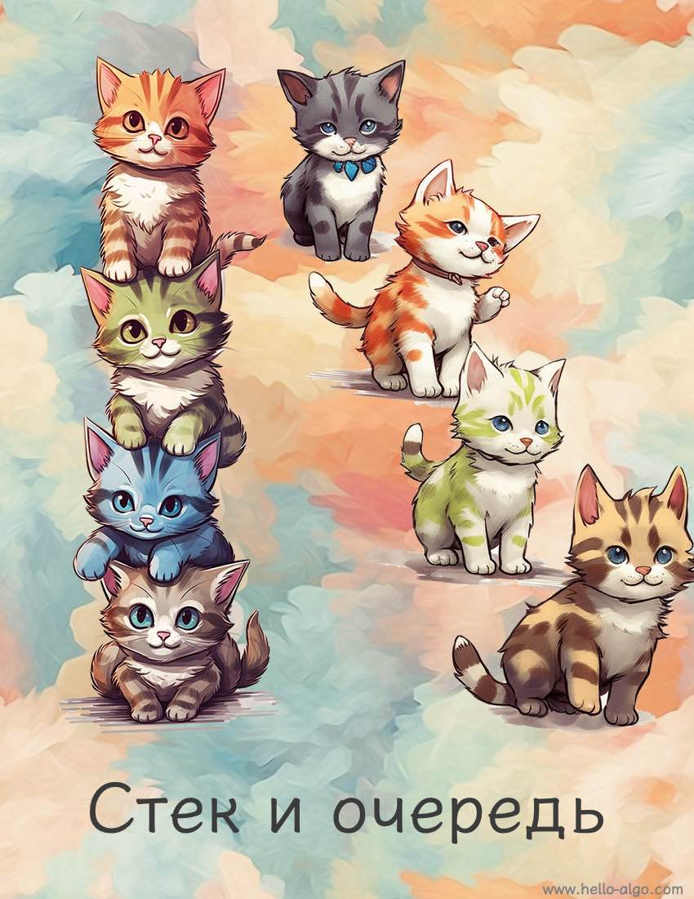

# Стек и очередь

!!! abstract

    Стек похож на стопку кошек, а очередь - на очередь из кошек.
    
    Эти две структуры соответственно представляют отношения "последним пришел - первым вышел" и "первым пришел - первым вышел".
