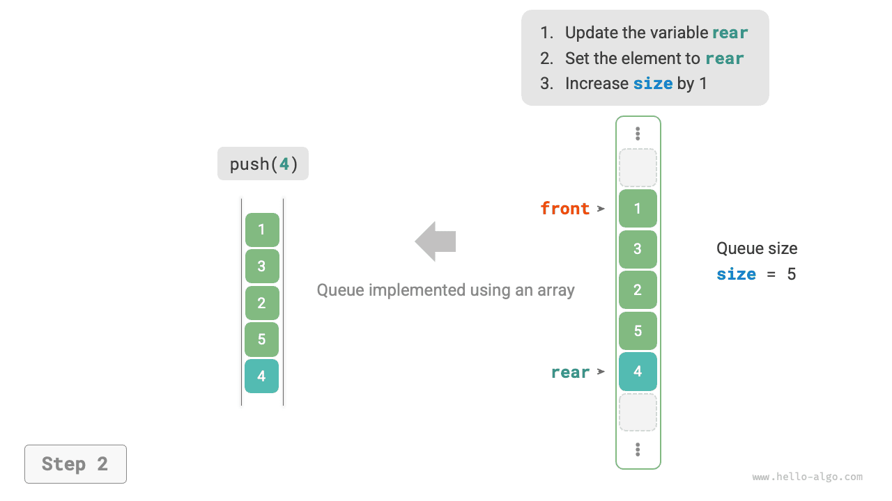

# Очередь

<u>Очередь (queue)</u> - это линейная структура данных, подчиняющаяся правилу "первым пришел - первым вышел". Как видно из названия, очередь моделирует обычную ситуацию ожидания: новые люди непрерывно присоединяются к хвосту очереди, а стоящие в начале по одному уходят.

Как показано на рисунке ниже, начало очереди называется "головой очереди", а конец - "хвостом очереди"; операцию добавления элемента в хвост называют "enqueue", а операцию удаления элемента из головы - "dequeue".


## Основные операции с очередью

Распространенные операции с очередью показаны в таблице ниже. Следует учитывать, что названия методов в разных языках могут различаться. Здесь мы используем те же названия, что и для стека.

<p align="center"> Таблица <id> &nbsp; Эффективность операций с очередью </p>

| Имя метода | Описание                                  | Временная сложность |
| ---------- | ----------------------------------------- | ------------------- |
| `push()`   | Поместить элемент в очередь, то есть добавить его в хвост | $O(1)$ |
| `pop()`    | Извлечь элемент из головы очереди         | $O(1)$              |
| `peek()`   | Просмотреть элемент в голове очереди      | $O(1)$              |

Мы можем напрямую использовать готовые классы очереди, предоставляемые языками программирования:

=== "Python"

    ```python title="queue.py"
    from collections import deque

    # Инициализация очереди
    # В Python обычно используют двустороннюю очередь deque как обычную очередь
    # Хотя queue.Queue() является "чистой" очередью, она не слишком удобна, поэтому ее не рекомендуют
    que: deque[int] = deque()

    # Поместить элементы в очередь
    que.append(1)
    que.append(3)
    que.append(2)
    que.append(5)
    que.append(4)

    # Просмотреть элемент в голове очереди
    front: int = que[0]

    # Извлечь элемент из очереди
    pop: int = que.popleft()

    # Получить длину очереди
    size: int = len(que)

    # Проверить, пуста ли очередь
    is_empty: bool = len(que) == 0
    ```

=== "C++"

    ```cpp title="queue.cpp"
    /* Инициализация очереди */
    queue<int> queue;

    /* Поместить элементы в очередь */
    queue.push(1);
    queue.push(3);
    queue.push(2);
    queue.push(5);
    queue.push(4);

    /* Просмотреть элемент в голове очереди */
    int front = queue.front();

    /* Извлечь элемент из очереди */
    queue.pop();

    /* Получить длину очереди */
    int size = queue.size();

    /* Проверить, пуста ли очередь */
    bool empty = queue.empty();
    ```

=== "Java"

    ```java title="queue.java"
    /* Инициализация очереди */
    Queue<Integer> queue = new LinkedList<>();

    /* Поместить элементы в очередь */
    queue.offer(1);
    queue.offer(3);
    queue.offer(2);
    queue.offer(5);
    queue.offer(4);

    /* Просмотреть элемент в голове очереди */
    int peek = queue.peek();

    /* Извлечь элемент из очереди */
    int pop = queue.poll();

    /* Получить длину очереди */
    int size = queue.size();

    /* Проверить, пуста ли очередь */
    boolean isEmpty = queue.isEmpty();
    ```

=== "C#"

    ```csharp title="queue.cs"
    /* Инициализация очереди */
    Queue<int> queue = new();

    /* Поместить элементы в очередь */
    queue.Enqueue(1);
    queue.Enqueue(3);
    queue.Enqueue(2);
    queue.Enqueue(5);
    queue.Enqueue(4);

    /* Просмотреть элемент в голове очереди */
    int peek = queue.Peek();

    /* Извлечь элемент из очереди */
    int pop = queue.Dequeue();

    /* Получить длину очереди */
    int size = queue.Count;

    /* Проверить, пуста ли очередь */
    bool isEmpty = queue.Count == 0;
    ```

=== "Go"

    ```go title="queue_test.go"
    /* Инициализация очереди */
    // В Go очередь обычно реализуют через list
    queue := list.New()

    /* Поместить элементы в очередь */
    queue.PushBack(1)
    queue.PushBack(3)
    queue.PushBack(2)
    queue.PushBack(5)
    queue.PushBack(4)

    /* Просмотреть элемент в голове очереди */
    peek := queue.Front()

    /* Извлечь элемент из очереди */
    pop := queue.Front()
    queue.Remove(pop)

    /* Получить длину очереди */
    size := queue.Len()

    /* Проверить, пуста ли очередь */
    isEmpty := queue.Len() == 0
    ```

=== "Swift"

    ```swift title="queue.swift"
    /* Инициализация очереди */
    // В Swift нет встроенного класса очереди, поэтому можно использовать Array как очередь
    var queue: [Int] = []

    /* Поместить элементы в очередь */
    queue.append(1)
    queue.append(3)
    queue.append(2)
    queue.append(5)
    queue.append(4)

    /* Просмотреть элемент в голове очереди */
    let peek = queue.first!

    /* Извлечь элемент из очереди */
    // Поскольку в основе лежит массив, removeFirst имеет сложность O(n)
    let pool = queue.removeFirst()

    /* Получить длину очереди */
    let size = queue.count

    /* Проверить, пуста ли очередь */
    let isEmpty = queue.isEmpty
    ```

=== "JS"

    ```javascript title="queue.js"
    /* Инициализация очереди */
    // В JavaScript нет встроенной очереди, поэтому можно использовать Array как очередь
    const queue = [];

    /* Поместить элементы в очередь */
    queue.push(1);
    queue.push(3);
    queue.push(2);
    queue.push(5);
    queue.push(4);

    /* Просмотреть элемент в голове очереди */
    const peek = queue[0];

    /* Извлечь элемент из очереди */
    // В основе лежит массив, поэтому shift() имеет сложность O(n)
    const pop = queue.shift();

    /* Получить длину очереди */
    const size = queue.length;

    /* Проверить, пуста ли очередь */
    const empty = queue.length === 0;
    ```

=== "TS"

    ```typescript title="queue.ts"
    /* Инициализация очереди */
    // В TypeScript нет встроенной очереди, поэтому можно использовать Array как очередь
    const queue: number[] = [];

    /* Поместить элементы в очередь */
    queue.push(1);
    queue.push(3);
    queue.push(2);
    queue.push(5);
    queue.push(4);

    /* Просмотреть элемент в голове очереди */
    const peek = queue[0];

    /* Извлечь элемент из очереди */
    // В основе лежит массив, поэтому shift() имеет сложность O(n)
    const pop = queue.shift();

    /* Получить длину очереди */
    const size = queue.length;

    /* Проверить, пуста ли очередь */
    const empty = queue.length === 0;
    ```

=== "Dart"

    ```dart title="queue.dart"
    /* Инициализация очереди */
    // В Dart класс Queue является двусторонней очередью и может использоваться как обычная очередь
    Queue<int> queue = Queue();

    /* Поместить элементы в очередь */
    queue.add(1);
    queue.add(3);
    queue.add(2);
    queue.add(5);
    queue.add(4);

    /* Просмотреть элемент в голове очереди */
    int peek = queue.first;

    /* Извлечь элемент из очереди */
    int pop = queue.removeFirst();

    /* Получить длину очереди */
    int size = queue.length;

    /* Проверить, пуста ли очередь */
    bool isEmpty = queue.isEmpty;
    ```

=== "Rust"

    ```rust title="queue.rs"
    /* Инициализация двусторонней очереди */
    // В Rust двусторонняя очередь может использоваться как обычная очередь
    let mut deque: VecDeque<u32> = VecDeque::new();

    /* Поместить элементы в очередь */
    deque.push_back(1);
    deque.push_back(3);
    deque.push_back(2);
    deque.push_back(5);
    deque.push_back(4);

    /* Просмотреть элемент в голове очереди */
    if let Some(front) = deque.front() {
    }

    /* Извлечь элемент из очереди */
    if let Some(pop) = deque.pop_front() {
    }

    /* Получить длину очереди */
    let size = deque.len();

    /* Проверить, пуста ли очередь */
    let is_empty = deque.is_empty();
    ```

=== "C"

    ```c title="queue.c"
    // В C нет встроенной очереди
    ```

=== "Kotlin"

    ```kotlin title="queue.kt"
    /* Инициализация очереди */
    val queue = LinkedList<Int>()

    /* Поместить элементы в очередь */
    queue.offer(1)
    queue.offer(3)
    queue.offer(2)
    queue.offer(5)
    queue.offer(4)

    /* Просмотреть элемент в голове очереди */
    val peek = queue.peek()

    /* Извлечь элемент из очереди */
    val pop = queue.poll()

    /* Получить длину очереди */
    val size = queue.size

    /* Проверить, пуста ли очередь */
    val isEmpty = queue.isEmpty()
    ```

=== "Ruby"

    ```ruby title="queue.rb"
    # Инициализация очереди
    # Встроенная очередь в Ruby (Thread::Queue) не имеет методов peek и traverse, поэтому можно использовать Array как очередь
    queue = []

    # Поместить элементы в очередь
    queue.push(1)
    queue.push(3)
    queue.push(2)
    queue.push(5)
    queue.push(4)

    # Просмотреть элемент очереди
    peek = queue.first

    # Извлечь элемент из очереди
    # Обрати внимание: поскольку это массив, метод Array#shift имеет сложность O(n)
    pop = queue.shift

    # Получить длину очереди
    size = queue.length

    # Проверить, пуста ли очередь
    is_empty = queue.empty?
    ```

??? pythontutor "Визуализация выполнения"

    https://pythontutor.com/render.html#code=from%20collections%20import%20deque%0A%0A%22%22%22Driver%20Code%22%22%22%0Aif%20__name__%20%3D%3D%20%22__main__%22%3A%0A%20%20%20%20%23%20%D0%98%D0%BD%D0%B8%D1%86%D0%B8%D0%B0%D0%BB%D0%B8%D0%B7%D0%B8%D1%80%D0%BE%D0%B2%D0%B0%D1%82%D1%8C%20%D0%BE%D1%87%D0%B5%D1%80%D0%B5%D0%B4%D1%8C%0A%20%20%20%20%23%20%D0%92%20Python%20%D0%B4%D0%B2%D1%83%D1%81%D1%82%D0%BE%D1%80%D0%BE%D0%BD%D0%BD%D1%8E%D1%8E%20%D0%BE%D1%87%D0%B5%D1%80%D0%B5%D0%B4%D1%8C%20deque%20%D0%BE%D0%B1%D1%8B%D1%87%D0%BD%D0%BE%20%D0%B8%D1%81%D0%BF%D0%BE%D0%BB%D1%8C%D0%B7%D1%83%D1%8E%D1%82%20%D0%BA%D0%B0%D0%BA%20%D0%BE%D1%87%D0%B5%D1%80%D0%B5%D0%B4%D1%8C%0A%20%20%20%20%23%20%D0%A5%D0%BE%D1%82%D1%8F%20queue.Queue%28%29%20%D1%8F%D0%B2%D0%BB%D1%8F%D0%B5%D1%82%D1%81%D1%8F%20%D0%BD%D0%B0%D1%81%D1%82%D0%BE%D1%8F%D1%89%D0%B8%D0%BC%20%D0%BA%D0%BB%D0%B0%D1%81%D1%81%D0%BE%D0%BC%20%D0%BE%D1%87%D0%B5%D1%80%D0%B5%D0%B4%D0%B8%2C%20%D0%BF%D0%BE%D0%BB%D1%8C%D0%B7%D0%BE%D0%B2%D0%B0%D1%82%D1%8C%D1%81%D1%8F%20%D0%B8%D0%BC%20%D0%BD%D0%B5%20%D1%81%D0%BB%D0%B8%D1%88%D0%BA%D0%BE%D0%BC%20%D1%83%D0%B4%D0%BE%D0%B1%D0%BD%D0%BE%0A%20%20%20%20que%20%3D%20deque%28%29%0A%0A%20%20%20%20%23%20%D0%9F%D0%BE%D0%BC%D0%B5%D1%81%D1%82%D0%B8%D1%82%D1%8C%20%D1%8D%D0%BB%D0%B5%D0%BC%D0%B5%D0%BD%D1%82%20%D0%B2%20%D0%BE%D1%87%D0%B5%D1%80%D0%B5%D0%B4%D1%8C%0A%20%20%20%20que.append%281%29%0A%20%20%20%20que.append%283%29%0A%20%20%20%20que.append%282%29%0A%20%20%20%20que.append%285%29%0A%20%20%20%20que.append%284%29%0A%20%20%20%20print%28%22%D0%BE%D1%87%D0%B5%D1%80%D0%B5%D0%B4%D1%8C%20que%20%3D%22%2C%20que%29%0A%0A%20%20%20%20%23%20%D0%9F%D0%BE%D0%BB%D1%83%D1%87%D0%B8%D1%82%D1%8C%20%D1%8D%D0%BB%D0%B5%D0%BC%D0%B5%D0%BD%D1%82%20%D0%B2%20%D0%BD%D0%B0%D1%87%D0%B0%D0%BB%D0%B5%20%D0%BE%D1%87%D0%B5%D1%80%D0%B5%D0%B4%D0%B8%0A%20%20%20%20front%20%3D%20que%5B0%5D%0A%20%20%20%20print%28%22%D0%AD%D0%BB%D0%B5%D0%BC%D0%B5%D0%BD%D1%82%20%D0%B2%20%D0%BD%D0%B0%D1%87%D0%B0%D0%BB%D0%B5%20%D0%BE%D1%87%D0%B5%D1%80%D0%B5%D0%B4%D0%B8%20front%20%3D%22%2C%20front%29%0A%0A%20%20%20%20%23%20%D0%98%D0%B7%D0%B2%D0%BB%D0%B5%D1%87%D1%8C%20%D1%8D%D0%BB%D0%B5%D0%BC%D0%B5%D0%BD%D1%82%20%D0%B8%D0%B7%20%D0%BE%D1%87%D0%B5%D1%80%D0%B5%D0%B4%D0%B8%0A%20%20%20%20pop%20%3D%20que.popleft%28%29%0A%20%20%20%20print%28%22%D0%98%D0%B7%D0%B2%D0%BB%D0%B5%D1%87%D0%B5%D0%BD%D0%BD%D1%8B%D0%B9%20%D0%B8%D0%B7%20%D0%BE%D1%87%D0%B5%D1%80%D0%B5%D0%B4%D0%B8%20%D1%8D%D0%BB%D0%B5%D0%BC%D0%B5%D0%BD%D1%82%20pop%20%3D%22%2C%20pop%29%0A%20%20%20%20print%28%22que%20%D0%BF%D0%BE%D1%81%D0%BB%D0%B5%20%D0%B8%D0%B7%D0%B2%D0%BB%D0%B5%D1%87%D0%B5%D0%BD%D0%B8%D1%8F%20%3D%22%2C%20que%29%0A%0A%20%20%20%20%23%20%D0%9F%D0%BE%D0%BB%D1%83%D1%87%D0%B8%D1%82%D1%8C%20%D0%B4%D0%BB%D0%B8%D0%BD%D1%83%20%D0%BE%D1%87%D0%B5%D1%80%D0%B5%D0%B4%D0%B8%0A%20%20%20%20size%20%3D%20len%28que%29%0A%20%20%20%20print%28%22%D0%94%D0%BB%D0%B8%D0%BD%D0%B0%20%D0%BE%D1%87%D0%B5%D1%80%D0%B5%D0%B4%D0%B8%20size%20%3D%22%2C%20size%29%0A%0A%20%20%20%20%23%20%D0%9F%D1%80%D0%BE%D0%B2%D0%B5%D1%80%D0%B8%D1%82%D1%8C%2C%20%D0%BF%D1%83%D1%81%D1%82%D0%B0%20%D0%BB%D0%B8%20%D0%BE%D1%87%D0%B5%D1%80%D0%B5%D0%B4%D1%8C%0A%20%20%20%20is_empty%20%3D%20len%28que%29%20%3D%3D%200%0A%20%20%20%20print%28%22%D0%9F%D1%83%D1%81%D1%82%D0%B0%20%D0%BB%D0%B8%20%D0%BE%D1%87%D0%B5%D1%80%D0%B5%D0%B4%D1%8C%20%3D%22%2C%20is_empty%29&cumulative=false&curInstr=3&heapPrimitives=nevernest&mode=display&origin=opt-frontend.js&py=311&rawInputLstJSON=%5B%5D&textReferences=false

## Реализация очереди

Чтобы реализовать очередь, нам нужна такая структура данных, которая позволяет добавлять элементы с одного конца и удалять их с другого; и связный список, и массив этим требованиям удовлетворяют.

### Реализация на основе связного списка

Как показано на рисунке ниже, мы можем рассматривать "головной узел" и "хвостовой узел" связного списка как "голову очереди" и "хвост очереди" соответственно, договорившись, что добавлять узлы можно только в хвост, а удалять - только из головы.

=== "LinkedListQueue"
    

=== "push()"
    

=== "pop()"
    

Ниже приведен код реализации очереди на связном списке:

```src
[file]{linkedlist_queue}-[class]{linked_list_queue}-[func]{}
```

### Реализация на основе массива

Удаление первого элемента из массива имеет временную сложность $O(n)$ , из-за чего операция dequeue оказывается неэффективной. Однако этого можно избежать с помощью следующего приема.

Мы можем использовать переменную `front` , указывающую на индекс элемента в голове очереди, и поддерживать переменную `size` , которая хранит длину очереди. Определим `rear = front + size` ; эта формула дает позицию `rear`, указывающую на ячейку сразу после хвоста очереди.

Исходя из этого, **эффективный диапазон элементов массива равен `[front, rear - 1]`**, а различные операции реализуются, как показано на рисунке ниже.

- Операция enqueue: записать входной элемент по индексу `rear` и увеличить `size` на 1.
- Операция dequeue: просто увеличить `front` на 1 и уменьшить `size` на 1.

Можно увидеть, что и enqueue, и dequeue требуют всего одной операции, а значит обе имеют временную сложность $O(1)$ .

=== "ArrayQueue"
    

=== "push()"
    

=== "pop()"
    

Ты можешь заметить еще одну проблему: при непрерывных операциях enqueue и dequeue значения `front` и `rear` оба движутся вправо, и **когда они доходят до конца массива, дальше сдвигаться уже нельзя**. Чтобы решить эту проблему, можно рассматривать массив как "кольцевой массив", у которого начало и конец соединены.

Для кольцевого массива нужно сделать так, чтобы `front` или `rear`, перешагнув конец массива, сразу возвращались к его началу и продолжали движение. Такую периодичность удобно реализовать с помощью операции взятия остатка, как показано в коде ниже:

```src
[file]{array_queue}-[class]{array_queue}-[func]{}
```

Даже такая реализация очереди остается ограниченной: ее длина неизменяема. Однако это несложно исправить, заменив массив на динамический массив и тем самым введя механизм расширения. Заинтересованные читатели могут попробовать реализовать это самостоятельно.

Выводы сравнения двух реализаций в целом такие же, как и для стека, поэтому здесь мы не будем повторяться.

## Типичные применения очереди

- **Заказы на Taobao**. После оформления заказа покупателем заказ попадает в очередь, а затем система обрабатывает заказы по порядку. Во время крупных распродаж, таких как Double 11, за короткое время возникает огромный поток заказов, и высокая конкурентная нагрузка становится ключевой инженерной проблемой.
- **Различные отложенные задачи**. Любой сценарий, где нужно реализовать принцип "кто раньше пришел, тот раньше обслуживается", например очередь заданий принтера или очередь блюд на кухне ресторана, хорошо моделируется очередью, которая эффективно поддерживает нужный порядок обработки.
