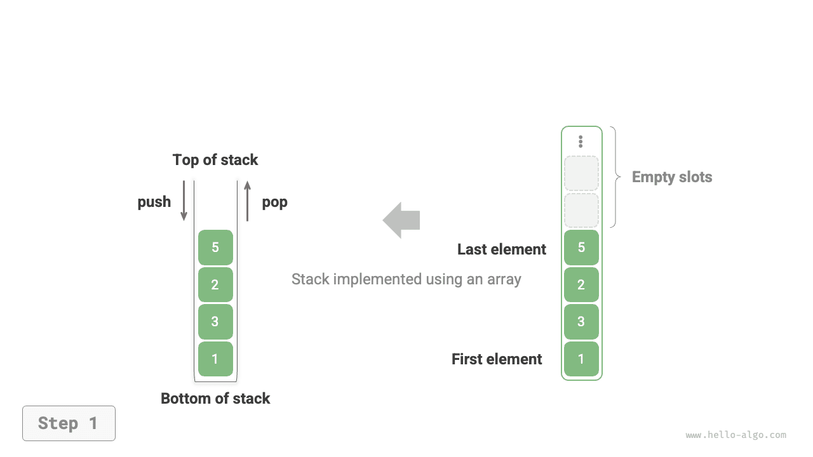

# Стек

<u>Стек (stack)</u> - это линейная структура данных, подчиняющаяся логике "последним пришел - первым вышел".

Стек можно сравнить со стопкой тарелок на столе. Если разрешено перемещать только одну тарелку за раз, то, чтобы достать тарелку снизу, сначала придется по одной убрать все тарелки сверху. Если заменить тарелки различными элементами (например целыми числами, символами, объектами и т.д.), получится структура данных "стек".

Как показано на рисунке ниже, верхнюю часть стопки элементов мы называем "вершиной стека", а нижнюю - "основанием стека". Операция добавления элемента на вершину называется "push", а операция удаления верхнего элемента - "pop".


## Основные операции со стеком

Основные операции со стеком показаны в таблице ниже. Конкретные имена методов зависят от используемого языка программирования. Здесь в качестве примера используются распространенные названия `push()` , `pop()` и `peek()` .

<p align="center"> Таблица <id> &nbsp; Эффективность операций со стеком </p>

| Метод    | Описание                          | Временная сложность |
| -------- | --------------------------------- | ------------------- |
| `push()` | Поместить элемент в стек (на вершину) | $O(1)$          |
| `pop()`  | Извлечь верхний элемент стека     | $O(1)$              |
| `peek()` | Просмотреть верхний элемент       | $O(1)$              |

Обычно мы можем просто использовать встроенный стек, предоставляемый языком программирования. Однако в некоторых языках специальный класс стека может отсутствовать. В таком случае можно использовать "массив" или "связный список" этого языка как стек и в логике программы игнорировать операции, не относящиеся к стеку.

=== "Python"

    ```python title="stack.py"
    # Инициализация стека
    # В Python нет встроенного класса стека, поэтому можно использовать list как стек
    stack: list[int] = []

    # Поместить элементы в стек
    stack.append(1)
    stack.append(3)
    stack.append(2)
    stack.append(5)
    stack.append(4)

    # Просмотреть верхний элемент
    peek: int = stack[-1]

    # Извлечь элемент
    pop: int = stack.pop()

    # Получить длину стека
    size: int = len(stack)

    # Проверить, пуст ли стек
    is_empty: bool = len(stack) == 0
    ```

=== "C++"

    ```cpp title="stack.cpp"
    /* Инициализация стека */
    stack<int> stack;

    /* Поместить элементы в стек */
    stack.push(1);
    stack.push(3);
    stack.push(2);
    stack.push(5);
    stack.push(4);

    /* Просмотреть верхний элемент */
    int top = stack.top();

    /* Извлечь элемент */
    stack.pop(); // Без возвращаемого значения

    /* Получить длину стека */
    int size = stack.size();

    /* Проверить, пуст ли стек */
    bool empty = stack.empty();
    ```

=== "Java"

    ```java title="stack.java"
    /* Инициализация стека */
    Stack<Integer> stack = new Stack<>();

    /* Поместить элементы в стек */
    stack.push(1);
    stack.push(3);
    stack.push(2);
    stack.push(5);
    stack.push(4);

    /* Просмотреть верхний элемент */
    int peek = stack.peek();

    /* Извлечь элемент */
    int pop = stack.pop();

    /* Получить длину стека */
    int size = stack.size();

    /* Проверить, пуст ли стек */
    boolean isEmpty = stack.isEmpty();
    ```

=== "C#"

    ```csharp title="stack.cs"
    /* Инициализация стека */
    Stack<int> stack = new();

    /* Поместить элементы в стек */
    stack.Push(1);
    stack.Push(3);
    stack.Push(2);
    stack.Push(5);
    stack.Push(4);

    /* Просмотреть верхний элемент */
    int peek = stack.Peek();

    /* Извлечь элемент */
    int pop = stack.Pop();

    /* Получить длину стека */
    int size = stack.Count;

    /* Проверить, пуст ли стек */
    bool isEmpty = stack.Count == 0;
    ```

=== "Go"

    ```go title="stack_test.go"
    /* Инициализация стека */
    // В Go рекомендуется использовать Slice как стек
    var stack []int

    /* Поместить элементы в стек */
    stack = append(stack, 1)
    stack = append(stack, 3)
    stack = append(stack, 2)
    stack = append(stack, 5)
    stack = append(stack, 4)

    /* Просмотреть верхний элемент */
    peek := stack[len(stack)-1]

    /* Извлечь элемент */
    pop := stack[len(stack)-1]
    stack = stack[:len(stack)-1]

    /* Получить длину стека */
    size := len(stack)

    /* Проверить, пуст ли стек */
    isEmpty := len(stack) == 0
    ```

=== "Swift"

    ```swift title="stack.swift"
    /* Инициализация стека */
    // В Swift нет встроенного класса стека, поэтому можно использовать Array как стек
    var stack: [Int] = []

    /* Поместить элементы в стек */
    stack.append(1)
    stack.append(3)
    stack.append(2)
    stack.append(5)
    stack.append(4)

    /* Просмотреть верхний элемент */
    let peek = stack.last!

    /* Извлечь элемент */
    let pop = stack.removeLast()

    /* Получить длину стека */
    let size = stack.count

    /* Проверить, пуст ли стек */
    let isEmpty = stack.isEmpty
    ```

=== "JS"

    ```javascript title="stack.js"
    /* Инициализация стека */
    // В JavaScript нет встроенного класса стека, поэтому можно использовать Array как стек
    const stack = [];

    /* Поместить элементы в стек */
    stack.push(1);
    stack.push(3);
    stack.push(2);
    stack.push(5);
    stack.push(4);

    /* Просмотреть верхний элемент */
    const peek = stack[stack.length-1];

    /* Извлечь элемент */
    const pop = stack.pop();

    /* Получить длину стека */
    const size = stack.length;

    /* Проверить, пуст ли стек */
    const is_empty = stack.length === 0;
    ```

=== "TS"

    ```typescript title="stack.ts"
    /* Инициализация стека */
    // В TypeScript нет встроенного класса стека, поэтому можно использовать Array как стек
    const stack: number[] = [];

    /* Поместить элементы в стек */
    stack.push(1);
    stack.push(3);
    stack.push(2);
    stack.push(5);
    stack.push(4);

    /* Просмотреть верхний элемент */
    const peek = stack[stack.length - 1];

    /* Извлечь элемент */
    const pop = stack.pop();

    /* Получить длину стека */
    const size = stack.length;

    /* Проверить, пуст ли стек */
    const is_empty = stack.length === 0;
    ```

=== "Dart"

    ```dart title="stack.dart"
    /* Инициализация стека */
    // В Dart нет встроенного класса стека, поэтому можно использовать List как стек
    List<int> stack = [];

    /* Поместить элементы в стек */
    stack.add(1);
    stack.add(3);
    stack.add(2);
    stack.add(5);
    stack.add(4);

    /* Просмотреть верхний элемент */
    int peek = stack.last;

    /* Извлечь элемент */
    int pop = stack.removeLast();

    /* Получить длину стека */
    int size = stack.length;

    /* Проверить, пуст ли стек */
    bool isEmpty = stack.isEmpty;
    ```

=== "Rust"

    ```rust title="stack.rs"
    /* Инициализация стека */
    // Используем Vec как стек
    let mut stack: Vec<i32> = Vec::new();

    /* Поместить элементы в стек */
    stack.push(1);
    stack.push(3);
    stack.push(2);
    stack.push(5);
    stack.push(4);

    /* Просмотреть верхний элемент */
    let top = stack.last().unwrap();

    /* Извлечь элемент */
    let pop = stack.pop().unwrap();

    /* Получить длину стека */
    let size = stack.len();

    /* Проверить, пуст ли стек */
    let is_empty = stack.is_empty();
    ```

=== "C"

    ```c title="stack.c"
    // В C нет встроенного стека
    ```

=== "Kotlin"

    ```kotlin title="stack.kt"
    /* Инициализация стека */
    val stack = Stack<Int>()

    /* Поместить элементы в стек */
    stack.push(1)
    stack.push(3)
    stack.push(2)
    stack.push(5)
    stack.push(4)

    /* Просмотреть верхний элемент */
    val peek = stack.peek()

    /* Извлечь элемент */
    val pop = stack.pop()

    /* Получить длину стека */
    val size = stack.size

    /* Проверить, пуст ли стек */
    val isEmpty = stack.isEmpty()
    ```

=== "Ruby"

    ```ruby title="stack.rb"
    # Инициализация стека
    # В Ruby нет встроенного класса стека, поэтому можно использовать Array как стек
    stack = []

    # Поместить элементы в стек
    stack << 1
    stack << 3
    stack << 2
    stack << 5
    stack << 4

    # Просмотреть верхний элемент
    peek = stack.last

    # Извлечь элемент
    pop = stack.pop

    # Получить длину стека
    size = stack.length

    # Проверить, пуст ли стек
    is_empty = stack.empty?
    ```

??? pythontutor "Визуализация выполнения"

    https://pythontutor.com/render.html#code=%22%22%22Driver%20Code%22%22%22%0Aif%20__name__%20%3D%3D%20%22__main__%22%3A%0A%20%20%20%20%23%20%D0%98%D0%BD%D0%B8%D1%86%D0%B8%D0%B0%D0%BB%D0%B8%D0%B7%D0%B8%D1%80%D0%BE%D0%B2%D0%B0%D1%82%D1%8C%20%D1%81%D1%82%D0%B5%D0%BA%0A%20%20%20%20%23%20%D0%92%20Python%20%D0%BD%D0%B5%D1%82%20%D0%B2%D1%81%D1%82%D1%80%D0%BE%D0%B5%D0%BD%D0%BD%D0%BE%D0%B3%D0%BE%20%D0%BA%D0%BB%D0%B0%D1%81%D1%81%D0%B0%20%D1%81%D1%82%D0%B5%D0%BA%D0%B0%2C%20%D0%BF%D0%BE%D1%8D%D1%82%D0%BE%D0%BC%D1%83%20list%20%D0%BC%D0%BE%D0%B6%D0%BD%D0%BE%20%D0%B8%D1%81%D0%BF%D0%BE%D0%BB%D1%8C%D0%B7%D0%BE%D0%B2%D0%B0%D1%82%D1%8C%20%D0%BA%D0%B0%D0%BA%20%D1%81%D1%82%D0%B5%D0%BA%0A%20%20%20%20stack%20%3D%20%5B%5D%0A%0A%20%20%20%20%23%20%D0%9F%D0%BE%D0%BC%D0%B5%D1%81%D1%82%D0%B8%D1%82%D1%8C%20%D1%8D%D0%BB%D0%B5%D0%BC%D0%B5%D0%BD%D1%82%20%D0%B2%20%D1%81%D1%82%D0%B5%D0%BA%0A%20%20%20%20stack.append%281%29%0A%20%20%20%20stack.append%283%29%0A%20%20%20%20stack.append%282%29%0A%20%20%20%20stack.append%285%29%0A%20%20%20%20stack.append%284%29%0A%20%20%20%20print%28%22%D1%81%D1%82%D0%B5%D0%BA%20stack%20%3D%22%2C%20stack%29%0A%0A%20%20%20%20%23%20%D0%9F%D0%BE%D0%BB%D1%83%D1%87%D0%B8%D1%82%D1%8C%20%D0%B2%D0%B5%D1%80%D1%85%D0%BD%D0%B8%D0%B9%20%D1%8D%D0%BB%D0%B5%D0%BC%D0%B5%D0%BD%D1%82%20%D1%81%D1%82%D0%B5%D0%BA%D0%B0%0A%20%20%20%20peek%20%3D%20stack%5B-1%5D%0A%20%20%20%20print%28%22%D0%92%D0%B5%D1%80%D1%85%D0%BD%D0%B8%D0%B9%20%D1%8D%D0%BB%D0%B5%D0%BC%D0%B5%D0%BD%D1%82%20%D1%81%D1%82%D0%B5%D0%BA%D0%B0%20peek%20%3D%22%2C%20peek%29%0A%0A%20%20%20%20%23%20%D0%98%D0%B7%D0%B2%D0%BB%D0%B5%D1%87%D1%8C%20%D1%8D%D0%BB%D0%B5%D0%BC%D0%B5%D0%BD%D1%82%20%D0%B8%D0%B7%20%D1%81%D1%82%D0%B5%D0%BA%D0%B0%0A%20%20%20%20pop%20%3D%20stack.pop%28%29%0A%20%20%20%20print%28%22%D0%98%D0%B7%D0%B2%D0%BB%D0%B5%D1%87%D0%B5%D0%BD%D0%BD%D1%8B%D0%B9%20%D0%B8%D0%B7%20%D1%81%D1%82%D0%B5%D0%BA%D0%B0%20%D1%8D%D0%BB%D0%B5%D0%BC%D0%B5%D0%BD%D1%82%20pop%20%3D%22%2C%20pop%29%0A%20%20%20%20print%28%22%D0%9F%D0%BE%D1%81%D0%BB%D0%B5%20%D0%B8%D0%B7%D0%B2%D0%BB%D0%B5%D1%87%D0%B5%D0%BD%D0%B8%D1%8F%20stack%20%3D%22%2C%20stack%29%0A%0A%20%20%20%20%23%20%D0%9F%D0%BE%D0%BB%D1%83%D1%87%D0%B8%D1%82%D1%8C%20%D0%B4%D0%BB%D0%B8%D0%BD%D1%83%20%D1%81%D1%82%D0%B5%D0%BA%D0%B0%0A%20%20%20%20size%20%3D%20len%28stack%29%0A%20%20%20%20print%28%22%D0%94%D0%BB%D0%B8%D0%BD%D0%B0%20%D1%81%D1%82%D0%B5%D0%BA%D0%B0%20size%20%3D%22%2C%20size%29%0A%0A%20%20%20%20%23%20%D0%9F%D1%80%D0%BE%D0%B2%D0%B5%D1%80%D0%B8%D1%82%D1%8C%2C%20%D0%BF%D1%83%D1%81%D1%82%D0%B0%20%D0%BB%D0%B8%20%D1%81%D1%82%D1%80%D1%83%D0%BA%D1%82%D1%83%D1%80%D0%B0%0A%20%20%20%20is_empty%20%3D%20len%28stack%29%20%3D%3D%200%0A%20%20%20%20print%28%22%D0%9F%D1%83%D1%81%D1%82%20%D0%BB%D0%B8%20%D1%81%D1%82%D0%B5%D0%BA%20%3D%22%2C%20is_empty%29&cumulative=false&curInstr=2&heapPrimitives=nevernest&mode=display&origin=opt-frontend.js&py=311&rawInputLstJSON=%5B%5D&textReferences=false

## Реализация стека

Чтобы глубже понять механизм работы стека, попробуем самостоятельно реализовать класс стека.

Стек подчиняется принципу LIFO, поэтому мы можем добавлять и удалять элементы только на вершине. Однако и массив, и связный список позволяют добавлять и удалять элементы в произвольном месте. **Следовательно, стек можно рассматривать как ограниченный массив или связный список**. Иными словами, мы можем "скрыть" часть нерелевантных операций массива или списка, так чтобы внешняя логика соответствовала свойствам стека.

### Реализация на основе связного списка

Если реализовывать стек на основе связного списка, то головной узел списка можно рассматривать как вершину стека, а хвостовой - как основание.

Как показано на рисунке ниже, для операции push достаточно вставить элемент в голову связного списка. Такой способ вставки называется "вставкой в голову". Для операции pop достаточно удалить головной узел из списка.

=== "LinkedListStack"
    

=== "push()"
    

=== "pop()"
    

Ниже приведен пример кода реализации стека на основе связного списка:

```src
[file]{linkedlist_stack}-[class]{linked_list_stack}-[func]{}
```

### Реализация на основе массива

Если реализовывать стек на основе массива, то хвост массива можно рассматривать как вершину стека. Как показано на рисунке ниже, операции push и pop соответствуют добавлению элемента в конец массива и удалению элемента из конца, обе имеют временную сложность $O(1)$ .

=== "ArrayStack"
    

=== "push()"
    

=== "pop()"
    

Поскольку количество элементов, помещаемых в стек, может непрерывно расти, мы можем использовать динамический массив и тем самым не заниматься расширением массива вручную. Ниже приведен пример кода:

```src
[file]{array_stack}-[class]{array_stack}-[func]{}
```

## Сравнение двух реализаций

**Поддерживаемые операции**

Обе реализации поддерживают все операции, определенные для стека. Реализация на массиве дополнительно позволяет выполнять произвольный доступ, но это уже выходит за рамки определения стека и обычно не используется.

**Временная эффективность**

В реализации на массиве и push, и pop выполняются в заранее выделенной непрерывной памяти, которая хорошо использует локальность кэша, поэтому такие операции обычно эффективнее. Однако если при push емкость массива оказывается превышена, включается механизм расширения, и временная сложность конкретно этой операции push становится $O(n)$ .

В реализации на связном списке расширение выполняется очень гибко, и проблемы падения эффективности из-за расширения массива здесь нет. Но сама операция push требует инициализации объекта-узла и изменения указателей, поэтому в среднем она немного менее эффективна. Впрочем, если помещаемые в стек элементы уже сами являются объектами-узлами, шаг инициализации можно пропустить и тем самым повысить эффективность.

Итак, когда элементами, помещаемыми и извлекаемыми из стека, являются базовые типы данных, например `int` или `double` , можно сделать следующие выводы.

- Стек на основе массива теряет в эффективности в моменты расширения, но поскольку расширение происходит редко, его средняя эффективность выше.
- Стек на основе связного списка может обеспечивать более стабильную производительность.

**Пространственная эффективность**

При инициализации списка система выделяет "начальную емкость", которая может превышать реальную потребность. Кроме того, механизм расширения обычно увеличивает емкость по некоторому коэффициенту (например в 2 раза), и расширенная емкость тоже может оказаться больше фактически необходимой. Поэтому **реализация стека на основе массива может приводить к некоторым потерям памяти**.

Однако, поскольку узлы связного списка должны дополнительно хранить указатели, **узлы списка сами по себе занимают больше пространства**.

В итоге нельзя просто сказать, какая из реализаций более экономна по памяти; это нужно анализировать в контексте конкретной задачи.

## Типичные применения стека

- **Кнопки "назад" и "вперед" в браузере, undo и redo в программах**. Каждый раз, когда мы открываем новую страницу, браузер помещает предыдущую страницу в стек, чтобы по операции "назад" можно было вернуться к ней. Операция "назад" по сути является pop. Если нужно одновременно поддерживать и "назад", и "вперед", то обычно используются два стека.
- **Управление памятью программы**. Каждый раз при вызове функции система помещает на вершину стека стековый кадр, в котором хранится контекст функции. В рекурсивной функции на этапе углубления рекурсии непрерывно выполняются push-операции, а на этапе возврата - pop-операции.
