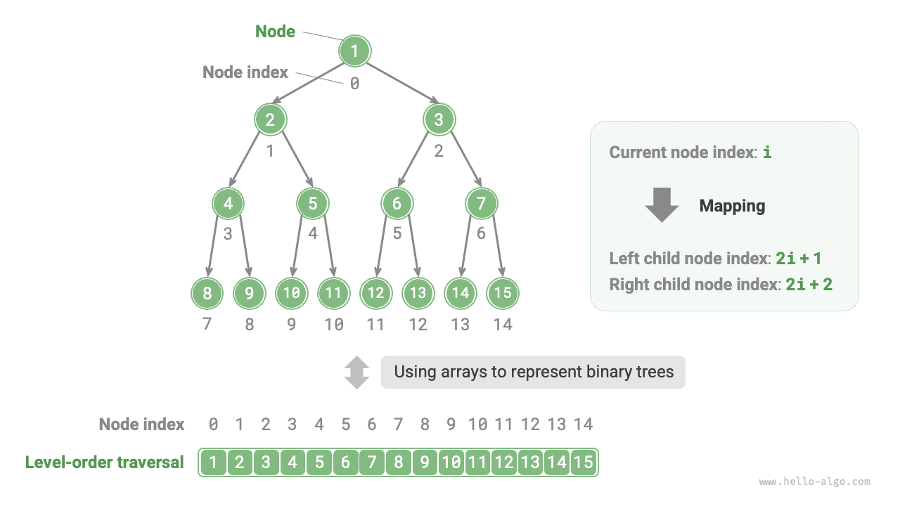

# Представление двоичного дерева массивом

В представлении через связную структуру единицей хранения двоичного дерева является узел `TreeNode` , а между узлами существуют связи через указатели. В предыдущем разделе были рассмотрены основные операции двоичного дерева в таком представлении.

Возникает вопрос: можно ли представить двоичное дерево с помощью массива? Ответ: да.

## Представление идеального двоичного дерева

Сначала разберем простой случай. Если дана идеальная двоичная структура и все ее узлы хранятся в массиве в порядке обхода по уровням, то каждому узлу будет соответствовать единственный индекс массива.

Из свойств обхода по уровням можно вывести "формулу соответствия" между индексом родителя и индексами дочерних узлов: **если индекс некоторого узла равен $i$ , то индекс его левого дочернего узла равен $2i + 1$ , а правого - $2i + 2$** . На рисунке ниже показано соответствие между индексами разных узлов.



**Эта формула соответствия играет ту же роль, что и ссылки на узлы в связной структуре** . Имея любой узел в массиве, мы можем по формуле получить доступ к его левому и правому дочерним узлам.

## Представление произвольного двоичного дерева

Идеальное двоичное дерево - лишь частный случай; в обычной двоичной структуре на промежуточных уровнях часто существует множество `None` . Поскольку последовательность обхода по уровням не содержит этих `None` , мы не можем по одной лишь этой последовательности определить их количество и расположение. **Это означает, что одному и тому же обходу по уровням может соответствовать сразу несколько различных структур двоичного дерева**.

Как показано на рисунке ниже, для неполной двоичной структуры описанный выше способ представления массивом уже перестает работать.


Чтобы решить эту проблему, **мы можем явно записывать все `None` в последовательности обхода по уровням** . Как показано на рисунке ниже, после такой обработки последовательность обхода по уровням уже сможет однозначно задавать двоичное дерево. Пример кода приведен ниже:

=== "Python"

    ```python title=""
    # Представление двоичного дерева массивом
    # Используем None для обозначения пустых позиций
    tree = [1, 2, 3, 4, None, 6, 7, 8, 9, None, None, 12, None, None, 15]
    ```

=== "C++"

    ```cpp title=""
    /* Представление двоичного дерева массивом */
    // Используем максимальное значение int, INT_MAX, для обозначения пустых позиций
    vector<int> tree = {1, 2, 3, 4, INT_MAX, 6, 7, 8, 9, INT_MAX, INT_MAX, 12, INT_MAX, INT_MAX, 15};
    ```

=== "Java"

    ```java title=""
    /* Представление двоичного дерева массивом */
    // Используя обертку Integer для int, можно применять null для обозначения пустых позиций
    Integer[] tree = { 1, 2, 3, 4, null, 6, 7, 8, 9, null, null, 12, null, null, 15 };
    ```

=== "C#"

    ```csharp title=""
    /* Представление двоичного дерева массивом */
    // Используя nullable-тип int? , можно применять null для обозначения пустых позиций
    int?[] tree = [1, 2, 3, 4, null, 6, 7, 8, 9, null, null, 12, null, null, 15];
    ```

=== "Go"

    ```go title=""
    /* Представление двоичного дерева массивом */
    // Используем срез типа any, чтобы можно было применять nil для обозначения пустых позиций
    tree := []any{1, 2, 3, 4, nil, 6, 7, 8, 9, nil, nil, 12, nil, nil, 15}
    ```

=== "Swift"

    ```swift title=""
    /* Представление двоичного дерева массивом */
    // Используя nullable-тип Int? , можно применять nil для обозначения пустых позиций
    let tree: [Int?] = [1, 2, 3, 4, nil, 6, 7, 8, 9, nil, nil, 12, nil, nil, 15]
    ```

=== "JS"

    ```javascript title=""
    /* Представление двоичного дерева массивом */
    // Используем null для обозначения пустых позиций
    let tree = [1, 2, 3, 4, null, 6, 7, 8, 9, null, null, 12, null, null, 15];
    ```

=== "TS"

    ```typescript title=""
    /* Представление двоичного дерева массивом */
    // Используем null для обозначения пустых позиций
    let tree: (number | null)[] = [1, 2, 3, 4, null, 6, 7, 8, 9, null, null, 12, null, null, 15];
    ```

=== "Dart"

    ```dart title=""
    /* Представление двоичного дерева массивом */
    // Используя nullable-тип int? , можно применять null для обозначения пустых позиций
    List<int?> tree = [1, 2, 3, 4, null, 6, 7, 8, 9, null, null, 12, null, null, 15];
    ```

=== "Rust"

    ```rust title=""
    /* Представление двоичного дерева массивом */
    // Используем None для обозначения пустых позиций
    let tree = [Some(1), Some(2), Some(3), Some(4), None, Some(6), Some(7), Some(8), Some(9), None, None, Some(12), None, None, Some(15)];
    ```

=== "C"

    ```c title=""
    /* Представление двоичного дерева массивом */
    // Используем максимальное значение int для обозначения пустых позиций, поэтому узлы не должны принимать значение INT_MAX
    int tree[] = {1, 2, 3, 4, INT_MAX, 6, 7, 8, 9, INT_MAX, INT_MAX, 12, INT_MAX, INT_MAX, 15};
    ```

=== "Kotlin"

    ```kotlin title=""
    /* Представление двоичного дерева массивом */
    // Используем null для обозначения пустых позиций
    val tree = arrayOf( 1, 2, 3, 4, null, 6, 7, 8, 9, null, null, 12, null, null, 15 )
    ```

=== "Ruby"

    ```ruby title=""
    ### Представление двоичного дерева массивом ###
    # Используем nil для обозначения пустых позиций
    tree = [1, 2, 3, 4, nil, 6, 7, 8, 9, nil, nil, 12, nil, nil, 15]
    ```


Стоит отметить, что **полное двоичное дерево очень удобно представлять массивом** . Если вспомнить определение полного двоичного дерева, то `None` появляются только на самом нижнем уровне и справа, **а значит, все `None` обязательно находятся в конце последовательности обхода по уровням**.

Это означает, что при представлении полного двоичного дерева массивом можно не хранить все `None` , что очень удобно. На рисунке ниже приведен пример.


Ниже приведен код реализации двоичного дерева, представленного массивом. Он включает следующие операции.

- Для заданного узла получить его значение, левого дочернего узла, правого дочернего узла и родительский узел.
- Получить последовательности прямого, симметричного, обратного обходов и обхода по уровням.

```src
[file]{array_binary_tree}-[class]{array_binary_tree}-[func]{}
```

## Преимущества и ограничения

Представление двоичного дерева массивом имеет в основном следующие преимущества.

- Массив хранится в непрерывной области памяти, хорошо работает с кешем и обеспечивает высокую скорость доступа и обхода.
- Не нужно хранить указатели, поэтому память расходуется экономнее.
- Разрешается произвольный доступ к узлам.

Однако у представления массивом есть и некоторые ограничения.

- Для хранения массива требуется непрерывная область памяти, поэтому такой способ не подходит для деревьев с очень большим объемом данных.
- Добавление и удаление узлов приходится реализовывать через вставку и удаление элементов массива, а это не слишком эффективно.
- Когда в двоичном дереве имеется большое число `None` , доля действительно полезных данных в массиве оказывается низкой, и эффективность использования пространства падает.
