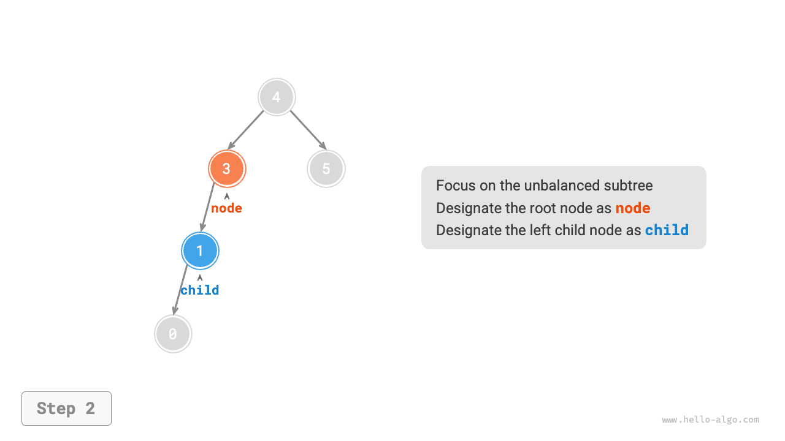
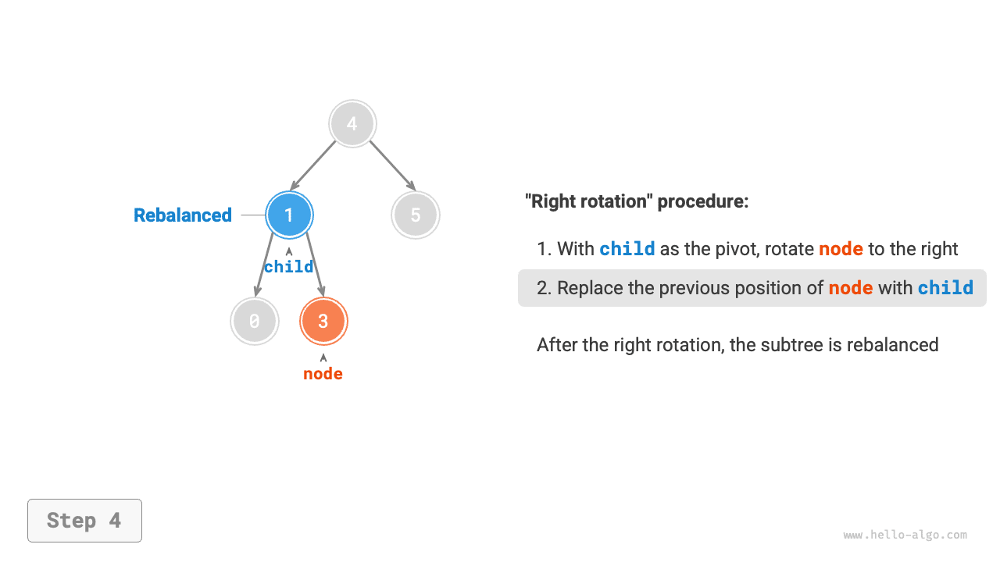
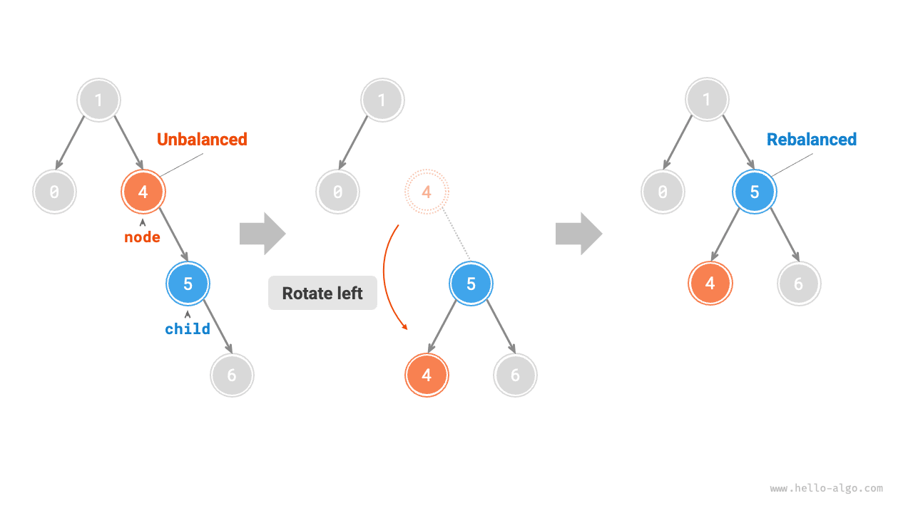
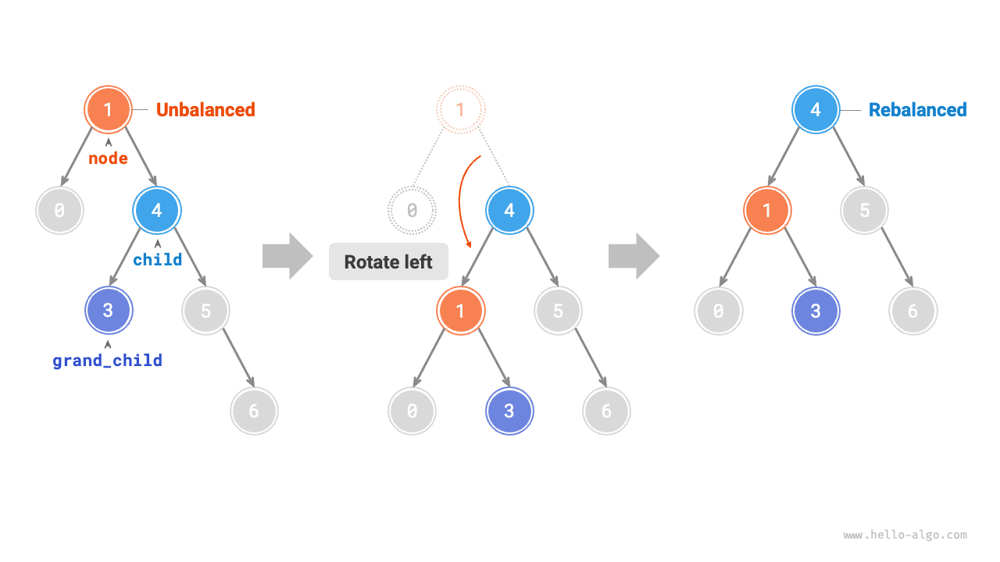
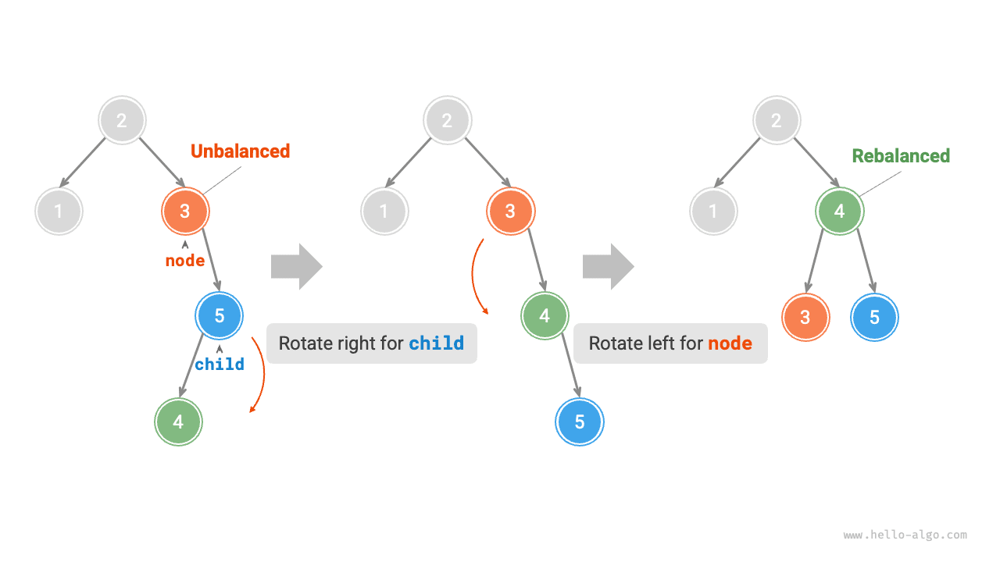
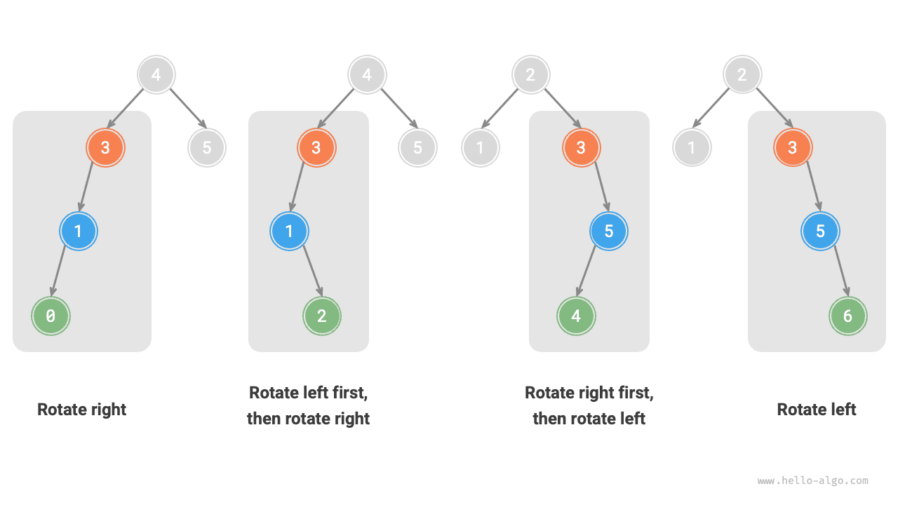

# AVL-дерево *

В разделе "Двоичное дерево поиска" мы упоминали, что после многократных операций вставки и удаления узлов двоичное дерево поиска может выродиться в связный список. В таком случае временная сложность всех операций ухудшается с $O(\log n)$ до $O(n)$ .

Как показано на рисунке ниже, после двух операций удаления узлов это двоичное дерево поиска вырождается в связный список.


Другой пример: если в идеальное двоичное дерево, показанное на рисунке ниже, вставить два узла, то дерево сильно наклонится влево, а временная сложность поиска тоже ухудшится.


В 1962 году Г. М. Adelson-Velsky и Е. М. Landis в статье "An algorithm for the organization of information" предложили <u>AVL-дерево</u>. В статье подробно описан набор операций, гарантирующий, что при непрерывном добавлении и удалении узлов AVL-дерево не вырождается, благодаря чему временная сложность различных операций сохраняется на уровне $O(\log n)$ . Иначе говоря, в сценариях, где часто выполняются вставка, удаление, поиск и изменение, AVL-дерево всегда поддерживает эффективную работу с данными и потому имеет высокую практическую ценность.

## Распространенные термины AVL-дерева

AVL-дерево одновременно является и двоичным деревом поиска, и сбалансированным двоичным деревом, то есть одновременно удовлетворяет всем свойствам обеих этих структур. Поэтому AVL-дерево является разновидностью <u>сбалансированного двоичного дерева поиска (balanced binary search tree)</u>.

### Высота узла

Поскольку операции AVL-дерева требуют получать высоту узла, нам нужно добавить в класс узла переменную `height` :

=== "Python"

    ```python title=""
    class TreeNode:
        """Класс узла AVL-дерева"""
        def __init__(self, val: int):
            self.val: int = val                 # Значение узла
            self.height: int = 0                # Высота узла
            self.left: TreeNode | None = None   # Ссылка на левого дочернего узла
            self.right: TreeNode | None = None  # Ссылка на правого дочернего узла
    ```

=== "C++"

    ```cpp title=""
    /* Класс узла AVL-дерева */
    struct TreeNode {
        int val{};          // Значение узла
        int height = 0;     // Высота узла
        TreeNode *left{};   // Левый дочерний узел
        TreeNode *right{};  // Правый дочерний узел
        TreeNode() = default;
        explicit TreeNode(int x) : val(x){}
    };
    ```

=== "Java"

    ```java title=""
    /* Класс узла AVL-дерева */
    class TreeNode {
        public int val;        // Значение узла
        public int height;     // Высота узла
        public TreeNode left;  // Левый дочерний узел
        public TreeNode right; // Правый дочерний узел
        public TreeNode(int x) { val = x; }
    }
    ```

=== "C#"

    ```csharp title=""
    /* Класс узла AVL-дерева */
    class TreeNode(int? x) {
        public int? val = x;    // Значение узла
        public int height;      // Высота узла
        public TreeNode? left;  // Ссылка на левого дочернего узла
        public TreeNode? right; // Ссылка на правого дочернего узла
    }
    ```

=== "Go"

    ```go title=""
    /* Структура узла AVL-дерева */
    type TreeNode struct {
        Val    int       // Значение узла
        Height int       // Высота узла
        Left   *TreeNode // Ссылка на левого дочернего узла
        Right  *TreeNode // Ссылка на правого дочернего узла
    }
    ```

=== "Swift"

    ```swift title=""
    /* Класс узла AVL-дерева */
    class TreeNode {
        var val: Int // Значение узла
        var height: Int // Высота узла
        var left: TreeNode? // Левый дочерний узел
        var right: TreeNode? // Правый дочерний узел

        init(x: Int) {
            val = x
            height = 0
        }
    }
    ```

=== "JS"

    ```javascript title=""
    /* Класс узла AVL-дерева */
    class TreeNode {
        val; // Значение узла
        height; // Высота узла
        left; // Указатель на левого дочернего узла
        right; // Указатель на правого дочернего узла
        constructor(val, left, right, height) {
            this.val = val === undefined ? 0 : val;
            this.height = height === undefined ? 0 : height;
            this.left = left === undefined ? null : left;
            this.right = right === undefined ? null : right;
        }
    }
    ```

=== "TS"

    ```typescript title=""
    /* Класс узла AVL-дерева */
    class TreeNode {
        val: number;            // Значение узла
        height: number;         // Высота узла
        left: TreeNode | null;  // Указатель на левого дочернего узла
        right: TreeNode | null; // Указатель на правого дочернего узла
        constructor(val?: number, height?: number, left?: TreeNode | null, right?: TreeNode | null) {
            this.val = val === undefined ? 0 : val;
            this.height = height === undefined ? 0 : height;
            this.left = left === undefined ? null : left;
            this.right = right === undefined ? null : right;
        }
    }
    ```

=== "Dart"

    ```dart title=""
    /* Класс узла AVL-дерева */
    class TreeNode {
      int val;         // Значение узла
      int height;      // Высота узла
      TreeNode? left;  // Левый дочерний узел
      TreeNode? right; // Правый дочерний узел
      TreeNode(this.val, [this.height = 0, this.left, this.right]);
    }
    ```

=== "Rust"

    ```rust title=""
    use std::rc::Rc;
    use std::cell::RefCell;

    /* Структура узла AVL-дерева */
    struct TreeNode {
        val: i32,                               // Значение узла
        height: i32,                            // Высота узла
        left: Option<Rc<RefCell<TreeNode>>>,    // Левый дочерний узел
        right: Option<Rc<RefCell<TreeNode>>>,   // Правый дочерний узел
    }

    impl TreeNode {
        /* Конструктор */
        fn new(val: i32) -> Rc<RefCell<Self>> {
            Rc::new(RefCell::new(Self {
                val,
                height: 0,
                left: None,
                right: None
            }))
        }
    }
    ```

=== "C"

    ```c title=""
    /* Структура узла AVL-дерева */
    typedef struct TreeNode {
        int val;
        int height;
        struct TreeNode *left;
        struct TreeNode *right;
    } TreeNode;

    /* Конструктор */
    TreeNode *newTreeNode(int val) {
        TreeNode *node;

        node = (TreeNode *)malloc(sizeof(TreeNode));
        node->val = val;
        node->height = 0;
        node->left = NULL;
        node->right = NULL;
        return node;
    }
    ```

=== "Kotlin"

    ```kotlin title=""
    /* Класс узла AVL-дерева */
    class TreeNode(val _val: Int) {  // Значение узла
        val height: Int = 0          // Высота узла
        val left: TreeNode? = null   // Левый дочерний узел
        val right: TreeNode? = null  // Правый дочерний узел
    }
    ```

=== "Ruby"

    ```ruby title=""
    ### Класс узла AVL-дерева ###
    class TreeNode
      attr_accessor :val    # Значение узла
      attr_accessor :height # Высота узла
      attr_accessor :left   # Ссылка на левого дочернего узла
      attr_accessor :right  # Ссылка на правого дочернего узла

      def initialize(val)
        @val = val
        @height = 0
      end
    end
    ```

"Высота узла" означает расстояние от этого узла до самого удаленного листового узла, то есть число пройденных "ребер". Особенно важно помнить, что высота листового узла равна $0$ , а высота пустого узла равна $-1$ . Мы создадим две вспомогательные функции: одну для получения высоты узла, другую для ее обновления:

```src
[file]{avl_tree}-[class]{avl_tree}-[func]{update_height}
```

### Баланс-фактор узла

<u>Баланс-фактор (balance factor)</u> узла определяется как высота левого поддерева минус высота правого поддерева; при этом баланс-фактор пустого узла считается равным $0$ . Мы также инкапсулируем получение баланс-фактора в отдельную функцию, чтобы потом было удобнее ее использовать:

```src
[file]{avl_tree}-[class]{avl_tree}-[func]{balance_factor}
```

!!! tip

    Пусть баланс-фактор равен $f$ ; тогда для любого узла AVL-дерева выполняется $-1 \le f \le 1$ .

## Вращения AVL-дерева

Особенность AVL-дерева заключается в операции "вращения", которая позволяет заново сбалансировать разбалансированный узел, не нарушая последовательность симметричного обхода двоичного дерева. Иначе говоря, **операция вращения одновременно сохраняет свойство "двоичного дерева поиска" и возвращает дерево в состояние "сбалансированного двоичного дерева"**.

Узлы, для которых абсолютное значение баланс-фактора больше $1$ , мы называем "разбалансированными узлами". В зависимости от вида разбаланса вращения делятся на четыре типа: правое вращение, левое вращение, сначала левое затем правое, и сначала правое затем левое. Ниже разберем их подробно.

### Правое вращение

Как показано на рисунках ниже, под узлом указан его баланс-фактор. Если двигаться снизу вверх, то первым разбалансированным узлом в двоичном дереве будет "узел 3". Рассмотрим поддерево с этим узлом в качестве корня, обозначим данный узел как `node` , его левого дочернего узла как `child` и выполним "правое вращение". После завершения правого вращения поддерево снова станет сбалансированным и при этом сохранит свойство двоичного дерева поиска.

=== "<1>"
    

=== "<2>"
    

=== "<3>"
    

=== "<4>"
    

Как показано на рисунке ниже, когда у узла `child` есть правый дочерний узел, который мы обозначим как `grand_child` , в правое вращение нужно добавить еще один шаг: сделать `grand_child` левым дочерним узлом `node` .


"Поворот вправо" - это лишь образное описание; в реальности он реализуется через изменение указателей узлов. Код приведен ниже:

```src
[file]{avl_tree}-[class]{avl_tree}-[func]{right_rotate}
```

### Левое вращение

Соответственно, если рассмотреть "зеркальную" версию приведенного выше разбалансированного двоичного дерева, то понадобится выполнить "левое вращение", показанное на рисунке ниже.



По той же причине, когда у узла `child` есть левый дочерний узел, который обозначим как `grand_child` , в левое вращение также требуется добавить шаг: сделать `grand_child` правым дочерним узлом `node` .



Можно заметить, что **операции правого и левого вращения логически зеркально симметричны, и два вида разбаланса, которые они исправляют, тоже симметричны**. Поэтому, опираясь на эту симметрию, достаточно заменить в коде правого вращения все `left` на `right` , а все `right` на `left` , чтобы получить реализацию левого вращения:

```src
[file]{avl_tree}-[class]{avl_tree}-[func]{left_rotate}
```

### Сначала левое, затем правое вращение

Для разбалансированного узла 3 на рисунке ниже ни одно лишь левое вращение, ни одно лишь правое вращение не способны вернуть поддерево в баланс. В этом случае нужно сначала выполнить "левое вращение" для `child` , а затем выполнить "правое вращение" для `node` .


### Сначала правое, затем левое вращение

Как показано на рисунке ниже, для зеркальной ситуации предыдущего разбалансированного двоичного дерева нужно сначала выполнить "правое вращение" для `child` , а затем "левое вращение" для `node` .



### Выбор вращения

Четыре вида разбаланса, показанные на рисунке ниже, по одному соответствуют рассмотренным выше случаям; для них соответственно требуются правое вращение, сначала левое затем правое, сначала правое затем левое и левое вращение.



Как показано в таблице ниже, мы определяем, какому из этих четырех случаев соответствует разбалансированный узел, по знаку баланс-фактора самого разбалансированного узла и по знаку баланс-фактора дочернего узла на более высокой стороне.

<p align="center"> Таблица <id> &nbsp; Условия выбора для четырех случаев вращений </p>

| Баланс-фактор разбалансированного узла | Баланс-фактор дочернего узла | Какое вращение использовать |
| -------------------------------------- | ---------------------------- | --------------------------- |
| $> 1$ (левостороннее дерево)           | $\geq 0$                     | Правое вращение             |
| $> 1$ (левостороннее дерево)           | $<0$                         | Сначала левое, затем правое |
| $< -1$ (правостороннее дерево)         | $\leq 0$                     | Левое вращение              |
| $< -1$ (правостороннее дерево)         | $>0$                         | Сначала правое, затем левое |

Для удобства мы инкапсулируем операцию вращения в отдельную функцию. **С помощью этой функции можно выполнить корректное вращение для любой ситуации разбаланса и снова привести узел в сбалансированное состояние**. Код приведен ниже:

```src
[file]{avl_tree}-[class]{avl_tree}-[func]{rotate}
```

## Распространенные операции AVL-дерева

### Вставка узла

Операция вставки узла в AVL-дерево по основному процессу похожа на вставку в двоичное дерево поиска. Единственная разница состоит в том, что после вставки в AVL-дерево на пути от вставленного узла к корню может появиться цепочка разбалансированных узлов. Поэтому **начиная от этого узла, мы должны выполнять вращения снизу вверх, чтобы вернуть в баланс все разбалансированные узлы**. Код приведен ниже:

```src
[file]{avl_tree}-[class]{avl_tree}-[func]{insert_helper}
```

### Удаление узла

Аналогично, на основе метода удаления узла из двоичного дерева поиска нужно добавить вращения снизу вверх, чтобы восстановить баланс всех разбалансированных узлов. Код приведен ниже:

```src
[file]{avl_tree}-[class]{avl_tree}-[func]{remove_helper}
```

### Поиск узла

Операция поиска узла в AVL-дереве совпадает с поиском в двоичном дереве поиска, поэтому здесь она повторно не рассматривается.

## Типичные применения AVL-дерева

- Организация и хранение больших массивов данных, особенно в сценариях с частым поиском и относительно редкими вставками и удалениями.
- Использование при построении индексных систем в базах данных.
- Красно-черное дерево тоже является распространенным видом сбалансированного двоичного дерева поиска. По сравнению с AVL-деревом условия баланса у красно-черного дерева мягче, поэтому при вставке и удалении требуется меньше вращений, а средняя эффективность операций добавления и удаления выше.
