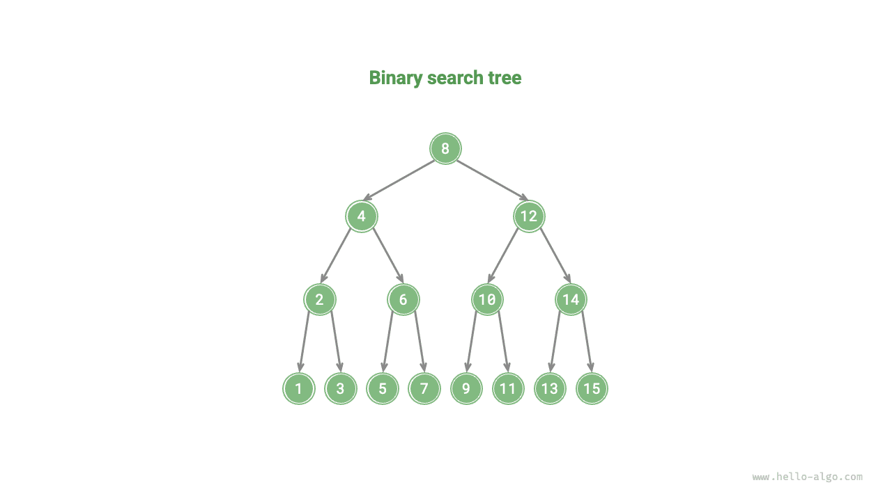
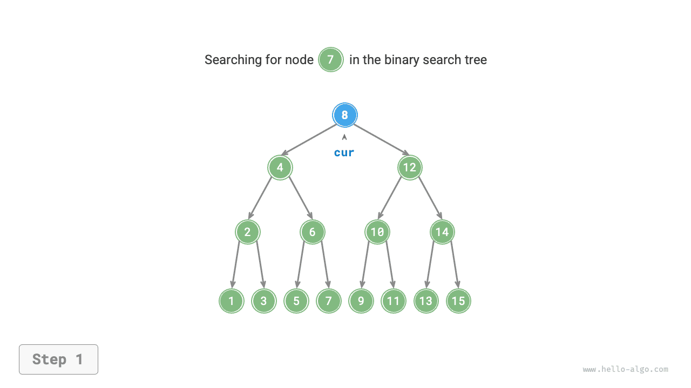
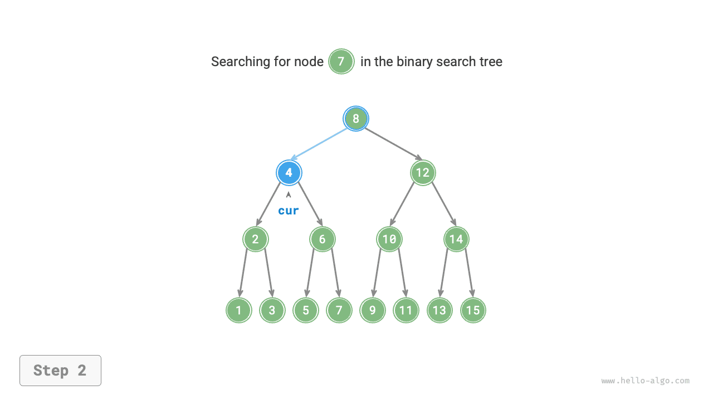
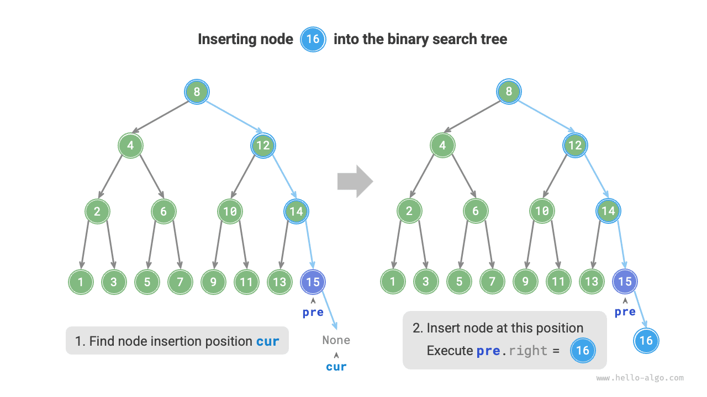
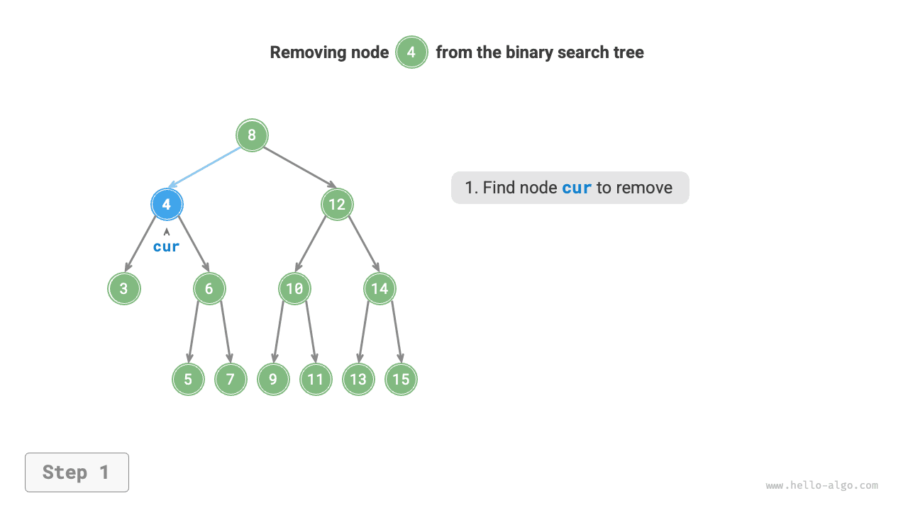
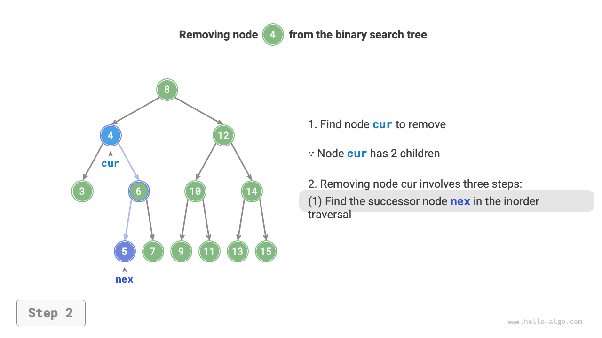
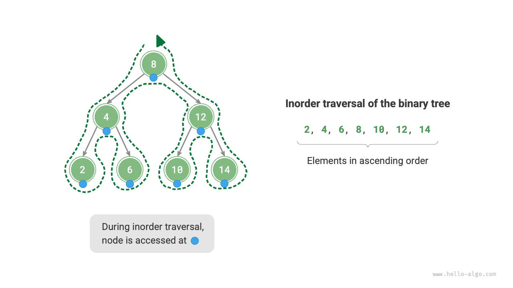

# Двоичное дерево поиска

Как показано на рисунке ниже, <u>двоичное дерево поиска (binary search tree)</u> удовлетворяет следующим условиям.

1. Для корневого узла все значения в левом поддереве меньше значения корневого узла, а все значения в правом поддереве больше значения корневого узла.
2. Левое и правое поддеревья любого узла также являются двоичными деревьями поиска, то есть тоже удовлетворяют условию `1.` .



## Операции с двоичным деревом поиска

Мы инкапсулируем двоичное дерево поиска в класс `BinarySearchTree` и объявляем переменную-член `root` , которая указывает на корневой узел дерева.

### Поиск узла

Для заданного целевого значения узла `num` можно выполнить поиск, опираясь на свойства двоичного дерева поиска. Как показано на рисунках ниже, мы объявляем узел `cur` , стартуем от корня дерева `root` и циклически сравниваем значения `cur.val` и `num` .

- Если `cur.val < num` , это означает, что целевой узел находится в правом поддереве `cur` , поэтому выполняем `cur = cur.right` .
- Если `cur.val > num` , это означает, что целевой узел находится в левом поддереве `cur` , поэтому выполняем `cur = cur.left` .
- Если `cur.val = num` , это означает, что целевой узел найден, и мы выходим из цикла, возвращая этот узел.

=== "<1>"
    

=== "<2>"
    

=== "<3>"
    

=== "<4>"
    

Операция поиска в двоичном дереве поиска работает по тому же принципу, что и бинарный поиск: на каждом шаге она отбрасывает половину вариантов. Число итераций не превосходит высоты двоичного дерева, а когда дерево сбалансировано, требуется $O(\log n)$ времени. Пример кода приведен ниже:

```src
[file]{binary_search_tree}-[class]{binary_search_tree}-[func]{search}
```

### Вставка узла

Пусть дан элемент `num` , который нужно вставить. Чтобы сохранить свойство двоичного дерева поиска "левое поддерево < корень < правое поддерево", процесс вставки выглядит следующим образом.

1. **Найти позицию для вставки**: как и в операции поиска, начиная от корня, мы циклически спускаемся вниз в зависимости от соотношения между текущим значением узла и `num` , пока не выйдем за листовой узел (то есть не дойдем до `None` ).
2. **Вставить узел в найденную позицию**: инициализировать узел `num` и поставить его на место этого `None` .



В реализации кода нужно обратить внимание на следующие два момента.

- Двоичное дерево поиска не допускает дублирующихся узлов, иначе его определение будет нарушено. Поэтому если вставляемый узел уже существует в дереве, вставка не выполняется и функция сразу возвращается.
- Чтобы реализовать вставку, нам нужно использовать узел `pre` для сохранения узла предыдущей итерации цикла. Тогда, когда обход дойдет до `None` , мы сможем получить его родителя и завершить вставку.

```src
[file]{binary_search_tree}-[class]{binary_search_tree}-[func]{insert}
```

Как и поиск узла, вставка узла требует $O(\log n)$ времени.

### Удаление узла

Сначала нужно найти в двоичном дереве целевой узел, а затем удалить его. Как и при вставке, после удаления необходимо сохранить свойство двоичного дерева поиска: "левое поддерево < корень < правое поддерево". Поэтому в зависимости от числа дочерних узлов у удаляемого узла, то есть для случаев со степенью 0, 1 и 2, выполняются разные операции удаления.

Как показано на рисунке ниже, когда степень удаляемого узла равна $0$ , это значит, что узел является листом и может быть удален напрямую.


Как показано на рисунке ниже, когда степень удаляемого узла равна $1$ , достаточно заменить удаляемый узел его дочерним узлом.


Когда степень удаляемого узла равна $2$ , мы уже не можем удалить его напрямую и должны использовать для замены другой узел. Чтобы сохранить свойство двоичного дерева поиска "левое поддерево $<$ корень $<$ правое поддерево", **этим узлом может быть минимальный узел правого поддерева или максимальный узел левого поддерева**.

Предположим, мы выбираем минимальный узел правого поддерева, то есть следующий узел в симметричном обходе. Тогда процесс удаления выглядит так.

1. Найти следующий узел в "последовательности симметричного обхода" для удаляемого узла и обозначить его как `tmp` .
2. Значением `tmp` перезаписать значение удаляемого узла, а затем рекурсивно удалить узел `tmp` из дерева.

=== "<1>"
    

=== "<2>"
    

=== "<3>"
    

=== "<4>"
    

Операция удаления узла также требует $O(\log n)$ времени, где поиск удаляемого узла стоит $O(\log n)$ , а получение следующего узла симметричного обхода также требует $O(\log n)$ . Пример кода приведен ниже:

```src
[file]{binary_search_tree}-[class]{binary_search_tree}-[func]{remove}
```

### Упорядоченность симметричного обхода

Как показано на рисунке ниже, симметричный обход двоичного дерева следует порядку "лево $\rightarrow$ корень $\rightarrow$ право", а двоичное дерево поиска удовлетворяет соотношению "левый дочерний узел $<$ корень $<$ правый дочерний узел".

Это означает, что при симметричном обходе двоичного дерева поиска мы всегда сначала будем посещать следующий минимальный узел, и отсюда получается важное свойство: **последовательность симметричного обхода двоичного дерева поиска является возрастающей**.

Используя это свойство возрастающей последовательности симметричного обхода, мы можем получить отсортированные данные из двоичного дерева поиска всего за $O(n)$ времени, без дополнительной сортировки, что очень эффективно.



## Эффективность двоичного дерева поиска

Для заданного набора данных можно рассмотреть хранение либо в массиве, либо в двоичном дереве поиска. Из таблицы ниже видно, что временная сложность операций двоичного дерева поиска имеет логарифмический порядок, поэтому его производительность стабильна и высока. Только в сценариях с очень частыми вставками и редкими поисками и удалениями массив может быть эффективнее, чем двоичное дерево поиска.

<p align="center"> Таблица <id> &nbsp; Сравнение эффективности массива и дерева поиска </p>

|          | Неупорядоченный массив | Двоичное дерево поиска |
| -------- | ---------------------- | ---------------------- |
| Поиск элемента | $O(n)$   | $O(\log n)$ |
| Вставка элемента | $O(1)$   | $O(\log n)$ |
| Удаление элемента | $O(n)$   | $O(\log n)$ |

В идеальном случае двоичное дерево поиска является "сбалансированным", и тогда любой узел можно найти за $\log n$ итераций.

Однако если в двоичное дерево поиска непрерывно вставлять и удалять узлы, оно может выродиться в связный список, как показано на рисунке ниже. Тогда временная сложность различных операций тоже вырождается до $O(n)$ .


## Типичные применения двоичного дерева поиска

- Используется как многоуровневый индекс в системах, обеспечивая эффективный поиск, вставку и удаление.
- Служит базовой структурой данных для некоторых поисковых алгоритмов.
- Применяется для хранения потока данных в отсортированном состоянии.
