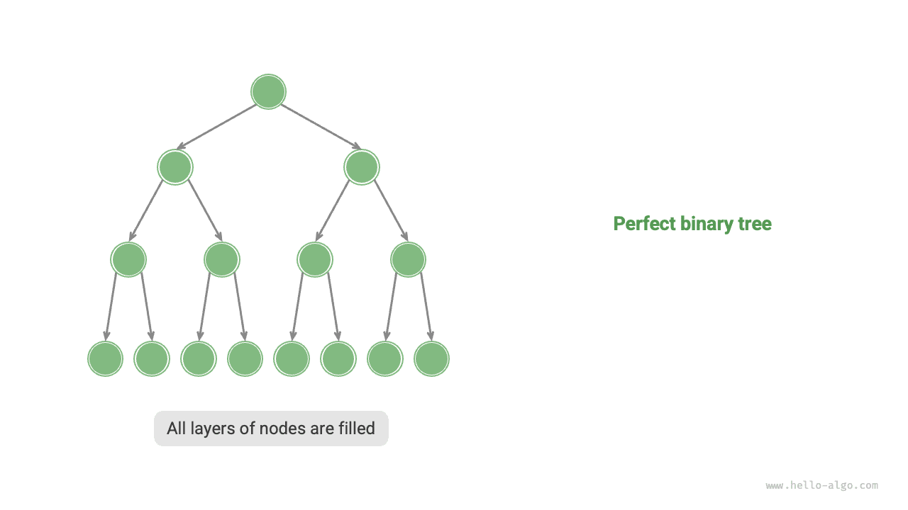
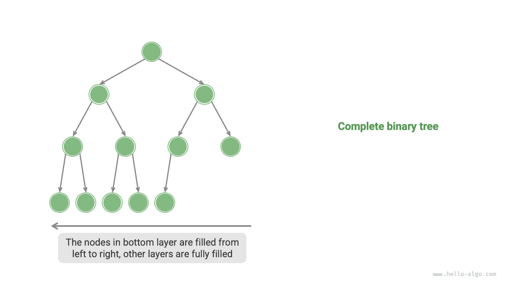
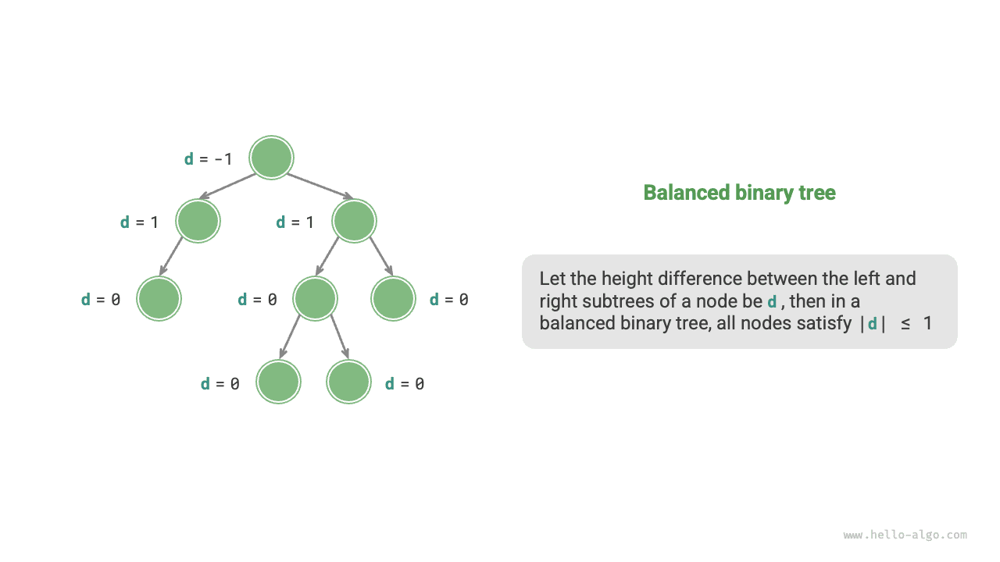

# Двоичное дерево

<u>Двоичное дерево (binary tree)</u> - это нелинейная структура данных, представляющая отношения порождения между "предками" и "потомками" и отражающая логику "разделения надвое". Подобно связному списку, базовой единицей двоичного дерева является узел; каждый узел содержит значение, ссылку на левого дочернего узла и ссылку на правого дочернего узла.

=== "Python"

    ```python title=""
    class TreeNode:
        """Класс узла двоичного дерева"""
        def __init__(self, val: int):
            self.val: int = val                # Значение узла
            self.left: TreeNode | None = None  # Ссылка на левого дочернего узла
            self.right: TreeNode | None = None # Ссылка на правого дочернего узла
    ```

=== "C++"

    ```cpp title=""
    /* Структура узла двоичного дерева */
    struct TreeNode {
        int val;          // Значение узла
        TreeNode *left;   // Указатель на левого дочернего узла
        TreeNode *right;  // Указатель на правого дочернего узла
        TreeNode(int x) : val(x), left(nullptr), right(nullptr) {}
    };
    ```

=== "Java"

    ```java title=""
    /* Класс узла двоичного дерева */
    class TreeNode {
        int val;         // Значение узла
        TreeNode left;   // Ссылка на левого дочернего узла
        TreeNode right;  // Ссылка на правого дочернего узла
        TreeNode(int x) { val = x; }
    }
    ```

=== "C#"

    ```csharp title=""
    /* Класс узла двоичного дерева */
    class TreeNode(int? x) {
        public int? val = x;    // Значение узла
        public TreeNode? left;  // Ссылка на левого дочернего узла
        public TreeNode? right; // Ссылка на правого дочернего узла
    }
    ```

=== "Go"

    ```go title=""
    /* Структура узла двоичного дерева */
    type TreeNode struct {
        Val   int
        Left  *TreeNode
        Right *TreeNode
    }
    /* Конструктор */
    func NewTreeNode(v int) *TreeNode {
        return &TreeNode{
            Left:  nil, // Указатель на левого дочернего узла
            Right: nil, // Указатель на правого дочернего узла
            Val:   v,   // Значение узла
        }
    }
    ```

=== "Swift"

    ```swift title=""
    /* Класс узла двоичного дерева */
    class TreeNode {
        var val: Int // Значение узла
        var left: TreeNode? // Ссылка на левого дочернего узла
        var right: TreeNode? // Ссылка на правого дочернего узла

        init(x: Int) {
            val = x
        }
    }
    ```

=== "JS"

    ```javascript title=""
    /* Класс узла двоичного дерева */
    class TreeNode {
        val; // Значение узла
        left; // Указатель на левого дочернего узла
        right; // Указатель на правого дочернего узла
        constructor(val, left, right) {
            this.val = val === undefined ? 0 : val;
            this.left = left === undefined ? null : left;
            this.right = right === undefined ? null : right;
        }
    }
    ```

=== "TS"

    ```typescript title=""
    /* Класс узла двоичного дерева */
    class TreeNode {
        val: number;
        left: TreeNode | null;
        right: TreeNode | null;

        constructor(val?: number, left?: TreeNode | null, right?: TreeNode | null) {
            this.val = val === undefined ? 0 : val; // Значение узла
            this.left = left === undefined ? null : left; // Ссылка на левого дочернего узла
            this.right = right === undefined ? null : right; // Ссылка на правого дочернего узла
        }
    }
    ```

=== "Dart"

    ```dart title=""
    /* Класс узла двоичного дерева */
    class TreeNode {
      int val;         // Значение узла
      TreeNode? left;  // Ссылка на левого дочернего узла
      TreeNode? right; // Ссылка на правого дочернего узла
      TreeNode(this.val, [this.left, this.right]);
    }
    ```

=== "Rust"

    ```rust title=""
    use std::rc::Rc;
    use std::cell::RefCell;

    /* Структура узла двоичного дерева */
    struct TreeNode {
        val: i32,                               // Значение узла
        left: Option<Rc<RefCell<TreeNode>>>,    // Ссылка на левого дочернего узла
        right: Option<Rc<RefCell<TreeNode>>>,   // Ссылка на правого дочернего узла
    }

    impl TreeNode {
        /* Конструктор */
        fn new(val: i32) -> Rc<RefCell<Self>> {
            Rc::new(RefCell::new(Self {
                val,
                left: None,
                right: None
            }))
        }
    }
    ```

=== "C"

    ```c title=""
    /* Структура узла двоичного дерева */
    typedef struct TreeNode {
        int val;                // Значение узла
        int height;             // Высота узла
        struct TreeNode *left;  // Указатель на левого дочернего узла
        struct TreeNode *right; // Указатель на правого дочернего узла
    } TreeNode;

    /* Конструктор */
    TreeNode *newTreeNode(int val) {
        TreeNode *node;

        node = (TreeNode *)malloc(sizeof(TreeNode));
        node->val = val;
        node->height = 0;
        node->left = NULL;
        node->right = NULL;
        return node;
    }
    ```

=== "Kotlin"

    ```kotlin title=""
    /* Класс узла двоичного дерева */
    class TreeNode(val _val: Int) {  // Значение узла
        val left: TreeNode? = null   // Ссылка на левого дочернего узла
        val right: TreeNode? = null  // Ссылка на правого дочернего узла
    }
    ```

=== "Ruby"

    ```ruby title=""
    ### Класс узла двоичного дерева ###
    class TreeNode
      attr_accessor :val    # Значение узла
      attr_accessor :left   # Ссылка на левого дочернего узла
      attr_accessor :right  # Ссылка на правого дочернего узла

      def initialize(val)
        @val = val
      end
    end
    ```

Каждый узел имеет две ссылки (указателя), которые соответственно указывают на <u>левого дочернего узла (left-child node)</u> и <u>правого дочернего узла (right-child node)</u>; данный узел называется <u>родительским узлом (parent node)</u> для этих двух дочерних узлов. Если задан некоторый узел двоичного дерева, то дерево, образованное его левым дочерним узлом и всеми узлами ниже него, называется <u>левым поддеревом (left subtree)</u> этого узла; аналогично определяется <u>правое поддерево (right subtree)</u>.

**В двоичном дереве, кроме листовых узлов, все остальные узлы содержат дочерние узлы и непустые поддеревья**. Как показано на рисунке ниже, если рассматривать "узел 2" как родительский, то его левым и правым дочерними узлами будут "узел 4" и "узел 5"; левое поддерево - это "узел 4 и дерево ниже него", а правое поддерево - это "узел 5 и дерево ниже него".


## Распространенные термины двоичного дерева

Распространенные термины двоичного дерева показаны на рисунке ниже.

- <u>Корневой узел (root node)</u>: узел, расположенный на верхнем уровне двоичного дерева и не имеющий родительского узла.
- <u>Листовой узел (leaf node)</u>: узел без дочерних узлов; оба его указателя направлены на `None` .
- <u>Ребро (edge)</u>: отрезок, соединяющий два узла, то есть ссылка (указатель) между узлами.
- <u>Уровень (level)</u> узла: увеличивается сверху вниз; уровень корневого узла равен 1 .
- <u>Степень (degree)</u> узла: число дочерних узлов данного узла. В двоичном дереве возможны степени 0, 1, 2 .
- <u>Высота (height)</u> двоичного дерева: число ребер от корневого узла до самого удаленного листового узла.
- <u>Глубина (depth)</u> узла: число ребер от корневого узла до данного узла.
- <u>Высота (height)</u> узла: число ребер от самого удаленного листового узла до данного узла.


!!! tip

    Обрати внимание: обычно под "высотой" и "глубиной" понимают "число пройденных ребер", но в некоторых задачах или учебниках их могут определять как "число пройденных узлов". В таком случае и высоту, и глубину нужно увеличить на 1 .

## Базовые операции двоичного дерева

### Инициализация двоичного дерева

Как и в связном списке, сначала инициализируются узлы, а затем между ними строятся ссылки (указатели).

=== "Python"

    ```python title="binary_tree.py"
    # Инициализация двоичного дерева
    # Инициализация узлов
    n1 = TreeNode(val=1)
    n2 = TreeNode(val=2)
    n3 = TreeNode(val=3)
    n4 = TreeNode(val=4)
    n5 = TreeNode(val=5)
    # Построение ссылок (указателей) между узлами
    n1.left = n2
    n1.right = n3
    n2.left = n4
    n2.right = n5
    ```

=== "C++"

    ```cpp title="binary_tree.cpp"
    /* Инициализация двоичного дерева */
    // Инициализация узлов
    TreeNode* n1 = new TreeNode(1);
    TreeNode* n2 = new TreeNode(2);
    TreeNode* n3 = new TreeNode(3);
    TreeNode* n4 = new TreeNode(4);
    TreeNode* n5 = new TreeNode(5);
    // Построение ссылок (указателей) между узлами
    n1->left = n2;
    n1->right = n3;
    n2->left = n4;
    n2->right = n5;
    ```

=== "Java"

    ```java title="binary_tree.java"
    // Инициализация узлов
    TreeNode n1 = new TreeNode(1);
    TreeNode n2 = new TreeNode(2);
    TreeNode n3 = new TreeNode(3);
    TreeNode n4 = new TreeNode(4);
    TreeNode n5 = new TreeNode(5);
    // Построение ссылок (указателей) между узлами
    n1.left = n2;
    n1.right = n3;
    n2.left = n4;
    n2.right = n5;
    ```

=== "C#"

    ```csharp title="binary_tree.cs"
    /* Инициализация двоичного дерева */
    // Инициализация узлов
    TreeNode n1 = new(1);
    TreeNode n2 = new(2);
    TreeNode n3 = new(3);
    TreeNode n4 = new(4);
    TreeNode n5 = new(5);
    // Построение ссылок (указателей) между узлами
    n1.left = n2;
    n1.right = n3;
    n2.left = n4;
    n2.right = n5;
    ```

=== "Go"

    ```go title="binary_tree.go"
    /* Инициализация двоичного дерева */
    // Инициализация узлов
    n1 := NewTreeNode(1)
    n2 := NewTreeNode(2)
    n3 := NewTreeNode(3)
    n4 := NewTreeNode(4)
    n5 := NewTreeNode(5)
    // Построение ссылок (указателей) между узлами
    n1.Left = n2
    n1.Right = n3
    n2.Left = n4
    n2.Right = n5
    ```

=== "Swift"

    ```swift title="binary_tree.swift"
    // Инициализация узлов
    let n1 = TreeNode(x: 1)
    let n2 = TreeNode(x: 2)
    let n3 = TreeNode(x: 3)
    let n4 = TreeNode(x: 4)
    let n5 = TreeNode(x: 5)
    // Построение ссылок (указателей) между узлами
    n1.left = n2
    n1.right = n3
    n2.left = n4
    n2.right = n5
    ```

=== "JS"

    ```javascript title="binary_tree.js"
    /* Инициализация двоичного дерева */
    // Инициализация узлов
    let n1 = new TreeNode(1),
        n2 = new TreeNode(2),
        n3 = new TreeNode(3),
        n4 = new TreeNode(4),
        n5 = new TreeNode(5);
    // Построение ссылок (указателей) между узлами
    n1.left = n2;
    n1.right = n3;
    n2.left = n4;
    n2.right = n5;
    ```

=== "TS"

    ```typescript title="binary_tree.ts"
    /* Инициализация двоичного дерева */
    // Инициализация узлов
    let n1 = new TreeNode(1),
        n2 = new TreeNode(2),
        n3 = new TreeNode(3),
        n4 = new TreeNode(4),
        n5 = new TreeNode(5);
    // Построение ссылок (указателей) между узлами
    n1.left = n2;
    n1.right = n3;
    n2.left = n4;
    n2.right = n5;
    ```

=== "Dart"

    ```dart title="binary_tree.dart"
    /* Инициализация двоичного дерева */
    // Инициализация узлов
    TreeNode n1 = new TreeNode(1);
    TreeNode n2 = new TreeNode(2);
    TreeNode n3 = new TreeNode(3);
    TreeNode n4 = new TreeNode(4);
    TreeNode n5 = new TreeNode(5);
    // Построение ссылок (указателей) между узлами
    n1.left = n2;
    n1.right = n3;
    n2.left = n4;
    n2.right = n5;
    ```

=== "Rust"

    ```rust title="binary_tree.rs"
    // Инициализация узлов
    let n1 = TreeNode::new(1);
    let n2 = TreeNode::new(2);
    let n3 = TreeNode::new(3);
    let n4 = TreeNode::new(4);
    let n5 = TreeNode::new(5);
    // Построение ссылок (указателей) между узлами
    n1.borrow_mut().left = Some(n2.clone());
    n1.borrow_mut().right = Some(n3);
    n2.borrow_mut().left = Some(n4);
    n2.borrow_mut().right = Some(n5);
    ```

=== "C"

    ```c title="binary_tree.c"
    /* Инициализация двоичного дерева */
    // Инициализация узлов
    TreeNode *n1 = newTreeNode(1);
    TreeNode *n2 = newTreeNode(2);
    TreeNode *n3 = newTreeNode(3);
    TreeNode *n4 = newTreeNode(4);
    TreeNode *n5 = newTreeNode(5);
    // Построение ссылок (указателей) между узлами
    n1->left = n2;
    n1->right = n3;
    n2->left = n4;
    n2->right = n5;
    ```

=== "Kotlin"

    ```kotlin title="binary_tree.kt"
    // Инициализация узлов
    val n1 = TreeNode(1)
    val n2 = TreeNode(2)
    val n3 = TreeNode(3)
    val n4 = TreeNode(4)
    val n5 = TreeNode(5)
    // Построение ссылок (указателей) между узлами
    n1.left = n2
    n1.right = n3
    n2.left = n4
    n2.right = n5
    ```

=== "Ruby"

    ```ruby title="binary_tree.rb"
    # Инициализация двоичного дерева
    # Инициализация узлов
    n1 = TreeNode.new(1)
    n2 = TreeNode.new(2)
    n3 = TreeNode.new(3)
    n4 = TreeNode.new(4)
    n5 = TreeNode.new(5)
    # Построение ссылок (указателей) между узлами
    n1.left = n2
    n1.right = n3
    n2.left = n4
    n2.right = n5
    ```

??? pythontutor "Визуализация выполнения"

    https://pythontutor.com/render.html#code=class%20TreeNode%3A%0A%20%20%20%20%22%22%22%D0%9A%D0%BB%D0%B0%D1%81%D1%81%20%D1%83%D0%B7%D0%BB%D0%B0%20%D0%B4%D0%B2%D0%BE%D0%B8%D1%87%D0%BD%D0%BE%D0%B3%D0%BE%20%D0%B4%D0%B5%D1%80%D0%B5%D0%B2%D0%B0%22%22%22%0A%20%20%20%20def%20__init__%28self%2C%20val%3A%20int%29%3A%0A%20%20%20%20%20%20%20%20self.val%3A%20int%20%3D%20val%20%20%20%20%20%20%20%20%20%20%20%20%20%20%20%20%23%20%D0%97%D0%BD%D0%B0%D1%87%D0%B5%D0%BD%D0%B8%D0%B5%20%D1%83%D0%B7%D0%BB%D0%B0%0A%20%20%20%20%20%20%20%20self.left%3A%20TreeNode%20%7C%20None%20%3D%20None%20%20%23%20%D0%A1%D1%81%D1%8B%D0%BB%D0%BA%D0%B0%20%D0%BD%D0%B0%20%D0%BB%D0%B5%D0%B2%D1%8B%D0%B9%20%D0%B4%D0%BE%D1%87%D0%B5%D1%80%D0%BD%D0%B8%D0%B9%20%D1%83%D0%B7%D0%B5%D0%BB%0A%20%20%20%20%20%20%20%20self.right%3A%20TreeNode%20%7C%20None%20%3D%20None%20%23%20%D0%A1%D1%81%D1%8B%D0%BB%D0%BA%D0%B0%20%D0%BD%D0%B0%20%D0%BF%D1%80%D0%B0%D0%B2%D1%8B%D0%B9%20%D0%B4%D0%BE%D1%87%D0%B5%D1%80%D0%BD%D0%B8%D0%B9%20%D1%83%D0%B7%D0%B5%D0%BB%0A%0A%22%22%22Driver%20Code%22%22%22%0Aif%20__name__%20%3D%3D%20%22__main__%22%3A%0A%20%20%20%20%23%20%D0%98%D0%BD%D0%B8%D1%86%D0%B8%D0%B0%D0%BB%D0%B8%D0%B7%D0%B8%D1%80%D0%BE%D0%B2%D0%B0%D1%82%D1%8C%20%D0%B4%D0%B2%D0%BE%D0%B8%D1%87%D0%BD%D0%BE%D0%B5%20%D0%B4%D0%B5%D1%80%D0%B5%D0%B2%D0%BE%0A%20%20%20%20%23%20%D0%98%D0%BD%D0%B8%D1%86%D0%B8%D0%B0%D0%BB%D0%B8%D0%B7%D0%B8%D1%80%D0%BE%D0%B2%D0%B0%D1%82%D1%8C%20%D1%83%D0%B7%D0%B5%D0%BB%0A%20%20%20%20n1%20%3D%20TreeNode%28val%3D1%29%0A%20%20%20%20n2%20%3D%20TreeNode%28val%3D2%29%0A%20%20%20%20n3%20%3D%20TreeNode%28val%3D3%29%0A%20%20%20%20n4%20%3D%20TreeNode%28val%3D4%29%0A%20%20%20%20n5%20%3D%20TreeNode%28val%3D5%29%0A%20%20%20%20%23%20%D0%9F%D0%BE%D1%81%D1%82%D1%80%D0%BE%D0%B8%D1%82%D1%8C%20%D1%81%D1%81%D1%8B%D0%BB%D0%BA%D0%B8%20%D0%BC%D0%B5%D0%B6%D0%B4%D1%83%20%D1%83%D0%B7%D0%BB%D0%B0%D0%BC%D0%B8%20%28%D1%83%D0%BA%D0%B0%D0%B7%D0%B0%D1%82%D0%B5%D0%BB%D0%B8%29%0A%20%20%20%20n1.left%20%3D%20n2%0A%20%20%20%20n1.right%20%3D%20n3%0A%20%20%20%20n2.left%20%3D%20n4%0A%20%20%20%20n2.right%20%3D%20n5&cumulative=false&curInstr=3&heapPrimitives=nevernest&mode=display&origin=opt-frontend.js&py=311&rawInputLstJSON=%5B%5D&textReferences=false

### Вставка и удаление узлов

Как и в связном списке, вставка и удаление узлов в двоичном дереве могут выполняться через изменение указателей. На рисунке ниже приведен пример.


=== "Python"

    ```python title="binary_tree.py"
    # Вставка и удаление узлов
    p = TreeNode(0)
    # Вставить узел P между n1 -> n2
    n1.left = p
    p.left = n2
    # Удалить узел P
    n1.left = n2
    ```

=== "C++"

    ```cpp title="binary_tree.cpp"
    /* Вставка и удаление узлов */
    TreeNode* P = new TreeNode(0);
    // Вставить узел P между n1 -> n2
    n1->left = P;
    P->left = n2;
    // Удалить узел P
    n1->left = n2;
    // Освободить память
    delete P;
    ```

=== "Java"

    ```java title="binary_tree.java"
    TreeNode P = new TreeNode(0);
    // Вставить узел P между n1 -> n2
    n1.left = P;
    P.left = n2;
    // Удалить узел P
    n1.left = n2;
    ```

=== "C#"

    ```csharp title="binary_tree.cs"
    /* Вставка и удаление узлов */
    TreeNode P = new(0);
    // Вставить узел P между n1 -> n2
    n1.left = P;
    P.left = n2;
    // Удалить узел P
    n1.left = n2;
    ```

=== "Go"

    ```go title="binary_tree.go"
    /* Вставка и удаление узлов */
    // Вставить узел P между n1 -> n2
    p := NewTreeNode(0)
    n1.Left = p
    p.Left = n2
    // Удалить узел P
    n1.Left = n2
    ```

=== "Swift"

    ```swift title="binary_tree.swift"
    let P = TreeNode(x: 0)
    // Вставить узел P между n1 -> n2
    n1.left = P
    P.left = n2
    // Удалить узел P
    n1.left = n2
    ```

=== "JS"

    ```javascript title="binary_tree.js"
    /* Вставка и удаление узлов */
    let P = new TreeNode(0);
    // Вставить узел P между n1 -> n2
    n1.left = P;
    P.left = n2;
    // Удалить узел P
    n1.left = n2;
    ```

=== "TS"

    ```typescript title="binary_tree.ts"
    /* Вставка и удаление узлов */
    const P = new TreeNode(0);
    // Вставить узел P между n1 -> n2
    n1.left = P;
    P.left = n2;
    // Удалить узел P
    n1.left = n2;
    ```

=== "Dart"

    ```dart title="binary_tree.dart"
    /* Вставка и удаление узлов */
    TreeNode P = new TreeNode(0);
    // Вставить узел P между n1 -> n2
    n1.left = P;
    P.left = n2;
    // Удалить узел P
    n1.left = n2;
    ```

=== "Rust"

    ```rust title="binary_tree.rs"
    let p = TreeNode::new(0);
    // Вставить узел P между n1 -> n2
    n1.borrow_mut().left = Some(p.clone());
    p.borrow_mut().left = Some(n2.clone());
    // Удалить узел p
    n1.borrow_mut().left = Some(n2);
    ```

=== "C"

    ```c title="binary_tree.c"
    /* Вставка и удаление узлов */
    TreeNode *P = newTreeNode(0);
    // Вставить узел P между n1 -> n2
    n1->left = P;
    P->left = n2;
    // Удалить узел P
    n1->left = n2;
    // Освободить память
    free(P);
    ```

=== "Kotlin"

    ```kotlin title="binary_tree.kt"
    val P = TreeNode(0)
    // Вставить узел P между n1 -> n2
    n1.left = P
    P.left = n2
    // Удалить узел P
    n1.left = n2
    ```

=== "Ruby"

    ```ruby title="binary_tree.rb"
    # Вставка и удаление узлов
    _p = TreeNode.new(0)
    # Вставить узел _p между n1 -> n2
    n1.left = _p
    _p.left = n2
    # Удалить узел
    n1.left = n2
    ```

??? pythontutor "Визуализация выполнения"

    https://pythontutor.com/render.html#code=class%20TreeNode%3A%0A%20%20%20%20%22%22%22%D0%9A%D0%BB%D0%B0%D1%81%D1%81%20%D1%83%D0%B7%D0%BB%D0%B0%20%D0%B4%D0%B2%D0%BE%D0%B8%D1%87%D0%BD%D0%BE%D0%B3%D0%BE%20%D0%B4%D0%B5%D1%80%D0%B5%D0%B2%D0%B0%22%22%22%0A%20%20%20%20def%20__init__%28self%2C%20val%3A%20int%29%3A%0A%20%20%20%20%20%20%20%20self.val%3A%20int%20%3D%20val%20%20%20%20%20%20%20%20%20%20%20%20%20%20%20%20%23%20%D0%97%D0%BD%D0%B0%D1%87%D0%B5%D0%BD%D0%B8%D0%B5%20%D1%83%D0%B7%D0%BB%D0%B0%0A%20%20%20%20%20%20%20%20self.left%3A%20TreeNode%20%7C%20None%20%3D%20None%20%20%23%20%D0%A1%D1%81%D1%8B%D0%BB%D0%BA%D0%B0%20%D0%BD%D0%B0%20%D0%BB%D0%B5%D0%B2%D1%8B%D0%B9%20%D0%B4%D0%BE%D1%87%D0%B5%D1%80%D0%BD%D0%B8%D0%B9%20%D1%83%D0%B7%D0%B5%D0%BB%0A%20%20%20%20%20%20%20%20self.right%3A%20TreeNode%20%7C%20None%20%3D%20None%20%23%20%D0%A1%D1%81%D1%8B%D0%BB%D0%BA%D0%B0%20%D0%BD%D0%B0%20%D0%BF%D1%80%D0%B0%D0%B2%D1%8B%D0%B9%20%D0%B4%D0%BE%D1%87%D0%B5%D1%80%D0%BD%D0%B8%D0%B9%20%D1%83%D0%B7%D0%B5%D0%BB%0A%0A%22%22%22Driver%20Code%22%22%22%0Aif%20__name__%20%3D%3D%20%22__main__%22%3A%0A%20%20%20%20%23%20%D0%98%D0%BD%D0%B8%D1%86%D0%B8%D0%B0%D0%BB%D0%B8%D0%B7%D0%B8%D1%80%D0%BE%D0%B2%D0%B0%D1%82%D1%8C%20%D0%B4%D0%B2%D0%BE%D0%B8%D1%87%D0%BD%D0%BE%D0%B5%20%D0%B4%D0%B5%D1%80%D0%B5%D0%B2%D0%BE%0A%20%20%20%20%23%20%D0%98%D0%BD%D0%B8%D1%86%D0%B8%D0%B0%D0%BB%D0%B8%D0%B7%D0%B8%D1%80%D0%BE%D0%B2%D0%B0%D1%82%D1%8C%20%D1%83%D0%B7%D0%B5%D0%BB%0A%20%20%20%20n1%20%3D%20TreeNode%28val%3D1%29%0A%20%20%20%20n2%20%3D%20TreeNode%28val%3D2%29%0A%20%20%20%20n3%20%3D%20TreeNode%28val%3D3%29%0A%20%20%20%20n4%20%3D%20TreeNode%28val%3D4%29%0A%20%20%20%20n5%20%3D%20TreeNode%28val%3D5%29%0A%20%20%20%20%23%20%D0%9F%D0%BE%D1%81%D1%82%D1%80%D0%BE%D0%B8%D1%82%D1%8C%20%D1%81%D1%81%D1%8B%D0%BB%D0%BA%D0%B8%20%D0%BC%D0%B5%D0%B6%D0%B4%D1%83%20%D1%83%D0%B7%D0%BB%D0%B0%D0%BC%D0%B8%20%28%D1%83%D0%BA%D0%B0%D0%B7%D0%B0%D1%82%D0%B5%D0%BB%D0%B8%29%0A%20%20%20%20n1.left%20%3D%20n2%0A%20%20%20%20n1.right%20%3D%20n3%0A%20%20%20%20n2.left%20%3D%20n4%0A%20%20%20%20n2.right%20%3D%20n5%0A%0A%20%20%20%20%23%20%D0%92%D1%81%D1%82%D0%B0%D0%B2%D0%BA%D0%B0%20%D0%B8%20%D1%83%D0%B4%D0%B0%D0%BB%D0%B5%D0%BD%D0%B8%D0%B5%20%D1%83%D0%B7%D0%BB%D0%BE%D0%B2%0A%20%20%20%20p%20%3D%20TreeNode%280%29%0A%20%20%20%20%23%20%D0%92%D1%81%D1%82%D0%B0%D0%B2%D0%B8%D1%82%D1%8C%20%D1%83%D0%B7%D0%B5%D0%BB%20P%20%D0%BC%D0%B5%D0%B6%D0%B4%D1%83%20n1%20-%3E%20n2%0A%20%20%20%20n1.left%20%3D%20p%0A%20%20%20%20p.left%20%3D%20n2%0A%20%20%20%20%23%20%D0%A3%D0%B4%D0%B0%D0%BB%D0%B8%D1%82%D1%8C%20%D1%83%D0%B7%D0%B5%D0%BB%20P%0A%20%20%20%20n1.left%20%3D%20n2&cumulative=false&curInstr=37&heapPrimitives=nevernest&mode=display&origin=opt-frontend.js&py=311&rawInputLstJSON=%5B%5D&textReferences=false

!!! tip

    Обрати внимание: вставка узла может изменить исходную логическую структуру двоичного дерева, а удаление узла обычно означает удаление этого узла вместе со всеми его поддеревьями. Поэтому в двоичном дереве операции вставки и удаления обычно являются частью более крупного набора операций, который и реализует осмысленное действие.

## Распространенные типы двоичных деревьев

### Идеальное двоичное дерево

Как показано на рисунке ниже, <u>идеальное двоичное дерево (perfect binary tree)</u> полностью заполнено на всех уровнях. В идеальном двоичном дереве степень листовых узлов равна $0$ , а у всех остальных узлов степень равна $2$ ; если высота дерева равна $h$ , то общее число узлов равно $2^{h+1} - 1$ , что образует стандартную экспоненциальную зависимость и отражает часто встречающееся в природе явление клеточного деления.

!!! tip

    Обрати внимание: в китайскоязычном сообществе идеальное двоичное дерево часто называют <u>полностью заполненным двоичным деревом</u>.



### Полное двоичное дерево

Как показано на рисунке ниже, <u>полное двоичное дерево (complete binary tree)</u> допускает неполное заполнение только на самом нижнем уровне, причем узлы этого уровня должны непрерывно заполняться слева направо. Обрати внимание: идеальное двоичное дерево тоже является полным двоичным деревом.



### Строгое двоичное дерево

Как показано на рисунке ниже, <u>строгое двоичное дерево (full binary tree)</u> имеет у всех нелистовых узлов ровно двух дочерних узлов.


### Сбалансированное двоичное дерево

Как показано на рисунке ниже, в <u>сбалансированном двоичном дереве (balanced binary tree)</u> для любого узла абсолютное значение разности высот левого и правого поддеревьев не превышает 1 .



## Вырождение двоичного дерева

На рисунке ниже показаны идеальная структура двоичного дерева и вырожденная структура. Когда каждый уровень двоичного дерева полностью заполнен узлами, мы получаем "идеальное двоичное дерево"; когда же все узлы смещаются к одной стороне, двоичное дерево вырождается в "связный список".

- Идеальное двоичное дерево соответствует лучшему случаю и позволяет полностью раскрыть преимущества двоичного дерева с точки зрения "разделяй и властвуй".
- Связный список представляет противоположную крайность: все операции становятся линейными, а временная сложность деградирует до $O(n)$ .


Как показано в таблице ниже, в лучшем и худшем случаях число листовых узлов, общее число узлов, высота и другие характеристики двоичного дерева достигают максимума или минимума.

<p align="center"> Таблица <id> &nbsp; Лучший и худший случаи структуры двоичного дерева </p>

|                             | Идеальное двоичное дерево | Связный список |
| --------------------------- | ------------------------- | -------------- |
| Число узлов на уровне $i$   | $2^{i-1}$                 | $1$            |
| Число листьев у дерева высоты $h$ | $2^h$              | $1$            |
| Общее число узлов у дерева высоты $h$ | $2^{h+1} - 1$ | $h + 1$        |
| Высота дерева с $n$ узлами  | $\log_2 (n+1) - 1$        | $n - 1$        |
