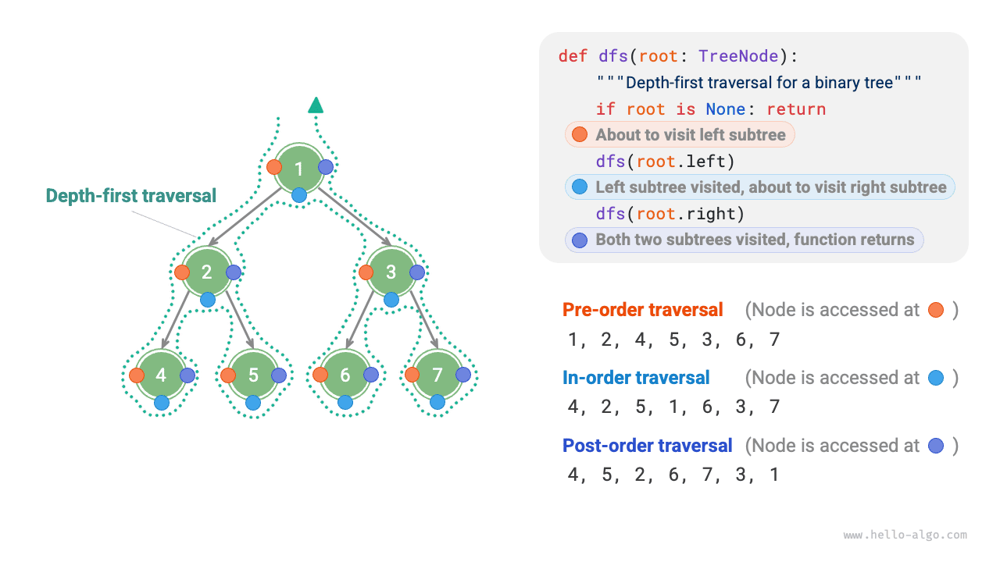
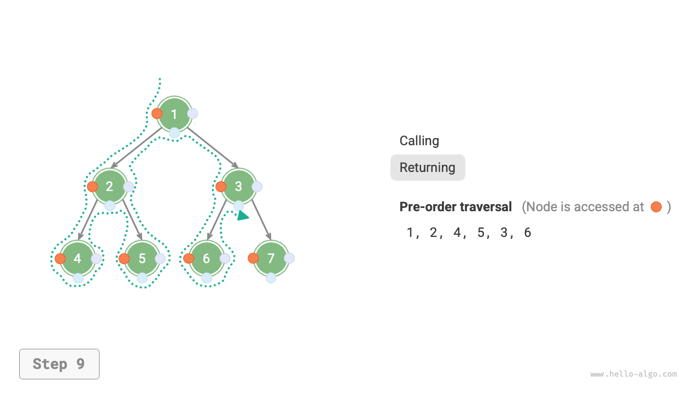

# Обход двоичного дерева

С точки зрения физической структуры дерево представляет собой разновидность структуры данных на основе связей, поэтому его обход выполняется через последовательный доступ к узлам по указателям. Однако дерево является нелинейной структурой данных, а значит, его обход сложнее, чем обход связного списка, и для него требуется использовать поисковые алгоритмы.

К распространенным способам обхода двоичного дерева относятся обход по уровням, прямой обход, симметричный обход и обратный обход.

## Обход по уровням

Как показано на рисунке ниже, <u>обход по уровням (level-order traversal)</u> проходит двоичное дерево сверху вниз по уровням и на каждом уровне посещает узлы слева направо.

По своей сути обход по уровням относится к <u>обходу в ширину (breadth-first traversal)</u>, также называемому <u>поиском в ширину (breadth-first search, BFS)</u>; он отражает идею "расширяться слой за слоем наружу".


### Код реализации

Обход в ширину обычно реализуется с помощью "очереди". Очередь подчиняется правилу "первым пришел - первым вышел", а обход в ширину подчиняется правилу "продвигаться по уровням", поэтому стоящая за ними идея согласована. Код реализации приведен ниже:

```src
[file]{binary_tree_bfs}-[class]{}-[func]{level_order}
```

### Анализ сложности

- **Временная сложность равна $O(n)$** : все узлы посещаются по одному разу, поэтому требуется $O(n)$ времени, где $n$ - число узлов.
- **Пространственная сложность равна $O(n)$** : в худшем случае, то есть для полной двоичной деревообразной структуры, до достижения самого нижнего уровня в очереди одновременно может находиться до $(n + 1) / 2$ узлов, что требует $O(n)$ памяти.

## Прямой, симметричный и обратный обходы

Соответственно, прямой, симметричный и обратный обходы относятся к <u>обходу в глубину (depth-first traversal)</u>, также называемому <u>поиском в глубину (depth-first search, DFS)</u>; он отражает идею "сначала идти до конца, затем откатываться и продолжать".

На рисунке ниже показан принцип работы обхода двоичного дерева в глубину. **Обход в глубину похож на то, как будто мы обходим всю двоичную структуру по внешнему контуру** , и у каждого узла встречаем три позиции, соответствующие прямому, симметричному и обратному обходам.



### Код реализации

Поиск в глубину обычно реализуется через рекурсию:

```src
[file]{binary_tree_dfs}-[class]{}-[func]{post_order}
```

!!! tip

    Поиск в глубину можно реализовать и итеративно; заинтересованные читатели могут изучить это самостоятельно.

На рисунках ниже показан рекурсивный процесс прямого обхода двоичного дерева. Его можно разделить на две противоположные части: "вход в рекурсию" и "возврат".

1. "Вход в рекурсию" означает запуск нового вызова функции; в этом процессе программа переходит к следующему узлу.
2. "Возврат" означает завершение вызова функции и возврат назад, то есть текущий узел уже полностью обработан.

=== "<1>"
    

=== "<2>"
    

=== "<3>"
    

=== "<4>"
    

=== "<5>"
    

=== "<6>"
    

=== "<7>"
    

=== "<8>"
    

=== "<9>"
    

=== "<10>"
    

=== "<11>"
    

### Анализ сложности

- **Временная сложность равна $O(n)$** : все узлы посещаются по одному разу, поэтому требуется $O(n)$ времени.
- **Пространственная сложность равна $O(n)$** : в худшем случае, когда дерево вырождается в связный список, глубина рекурсии достигает $n$ , и система тратит $O(n)$ памяти на стек вызовов.
