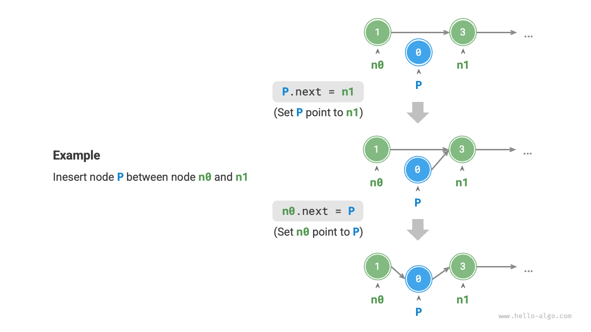
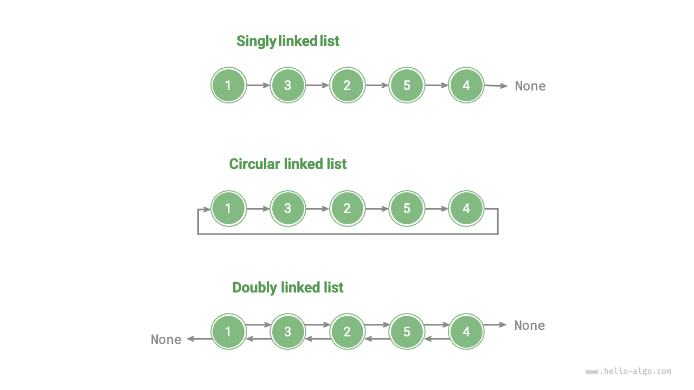

# Danh sách liên kết

Bộ nhớ là tài nguyên dùng chung cho tất cả các chương trình. Trong môi trường thời gian chạy phức tạp, bộ nhớ trống có thể bị phân tán khắp không gian địa chỉ. Chúng tôi biết rằng các mảng yêu cầu bộ nhớ liền kề và khi một mảng rất lớn, hệ thống có thể không cung cấp được khối liền kề lớn như vậy. Đây là lúc tính linh hoạt của danh sách liên kết trở nên rõ ràng.

<u>danh sách liên kết</u> là cấu trúc dữ liệu tuyến tính trong đó mỗi phần tử là một đối tượng nút và các nút được kết nối thông qua "tham chiếu". Một tham chiếu ghi lại địa chỉ bộ nhớ của nút tiếp theo, qua đó nút tiếp theo có thể được truy cập từ nút hiện tại.

Thiết kế này cho phép các nút danh sách liên kết được lưu trữ ở các vị trí khác nhau trong bộ nhớ và địa chỉ của chúng không cần phải liền kề nhau.


Quan sát hình trên, đơn vị cơ bản của danh sách liên kết là đối tượng <u>nút</u>. Mỗi nút chứa hai phần dữ liệu: "giá trị" của nút và "tham chiếu" đến nút tiếp theo.

- Nút đầu tiên của danh sách liên kết được gọi là "nút đầu" và nút cuối cùng được gọi là "nút đuôi".
- Nút đuôi trỏ đến "null", được ký hiệu lần lượt là `null`, `nullptr` và `None` trong Java, C++ và Python.
- Trong các ngôn ngữ hỗ trợ con trỏ, chẳng hạn như C, C++, Go và Rust, nên thay thế "tham chiếu" nói trên bằng "con trỏ".

Như được hiển thị trong đoạn mã sau, nút danh sách được liên kết `ListNode` không chỉ chứa một giá trị mà còn chứa một tham chiếu bổ sung (con trỏ). Do đó, **danh sách liên kết chiếm nhiều dung lượng bộ nhớ hơn mảng khi lưu trữ cùng một lượng dữ liệu**.

=== "Python"

    ```python title=""
    class ListNode:
        """Linked list node class"""
        def __init__(self, val: int):
            self.val: int = val               # Node value
            self.next: ListNode | None = None # Reference to the next node
    ```

=== "C++"

    ```cpp title=""
    /* Linked list node structure */
    struct ListNode {
        int val;         // Node value
        ListNode *next;  // Pointer to the next node
        ListNode(int x) : val(x), next(nullptr) {}  // Constructor
    };
    ```

=== "Java"

    ```java title=""
    /* Linked list node class */
    class ListNode {
        int val;        // Node value
        ListNode next;  // Reference to the next node
        ListNode(int x) { val = x; }  // Constructor
    }
    ```

=== "C#"

    ```csharp title=""
    /* Linked list node class */
    class ListNode(int x) {  // Constructor
        int val = x;         // Node value
        ListNode? next;      // Reference to the next node
    }
    ```

=== "Go"

    ```go title=""
    /* Linked list node structure */
    type ListNode struct {
        Val  int       // Node value
        Next *ListNode // Pointer to the next node
    }

    // NewListNode Constructor, creates a new linked list
    func NewListNode(val int) *ListNode {
        return &ListNode{
            Val:  val,
            Next: nil,
        }
    }
    ```

=== "Swift"

    ```swift title=""
    /* Linked list node class */
    class ListNode {
        var val: Int // Node value
        var next: ListNode? // Reference to the next node

        init(x: Int) { // Constructor
            val = x
        }
    }
    ```

=== "JS"

    ```javascript title=""
    /* Linked list node class */
    class ListNode {
        constructor(val, next) {
            this.val = (val === undefined ? 0 : val);       // Node value
            this.next = (next === undefined ? null : next); // Reference to the next node
        }
    }
    ```

=== "TS"

    ```typescript title=""
    /* Linked list node class */
    class ListNode {
        val: number;
        next: ListNode | null;
        constructor(val?: number, next?: ListNode | null) {
            this.val = val === undefined ? 0 : val;        // Node value
            this.next = next === undefined ? null : next;  // Reference to the next node
        }
    }
    ```

=== "Dart"

    ```dart title=""
    /* Linked list node class */
    class ListNode {
      int val; // Node value
      ListNode? next; // Reference to the next node
      ListNode(this.val, [this.next]); // Constructor
    }
    ```

=== "Rust"

    ```rust title=""
    use std::rc::Rc;
    use std::cell::RefCell;
    /* Linked list node class */
    #[derive(Debug)]
    struct ListNode {
        val: i32, // Node value
        next: Option<Rc<RefCell<ListNode>>>, // Pointer to the next node
    }
    ```

=== "C"

    ```c title=""
    /* Linked list node structure */
    typedef struct ListNode {
        int val;               // Node value
        struct ListNode *next; // Pointer to the next node
    } ListNode;

    /* Constructor */
    ListNode *newListNode(int val) {
        ListNode *node;
        node = (ListNode *) malloc(sizeof(ListNode));
        node->val = val;
        node->next = NULL;
        return node;
    }
    ```

=== "Kotlin"

    ```kotlin title=""
    /* Linked list node class */
    // Constructor
    class ListNode(x: Int) {
        val _val: Int = x          // Node value
        val next: ListNode? = null // Reference to the next node
    }
    ```

=== "Ruby"

    ```ruby title=""
    # Linked list node class
    class ListNode
      attr_accessor :val  # Node value
      attr_accessor :next # Reference to the next node

      def initialize(val=0, next_node=nil)
        @val = val
        @next = next_node
      end
    end
    ```

## Các thao tác danh sách liên kết phổ biến

### Đang khởi tạo một danh sách liên kết

Việc xây dựng danh sách liên kết bao gồm hai bước: đầu tiên, khởi tạo từng đối tượng nút; thứ hai, xây dựng mối quan hệ tham chiếu giữa các nút. Sau khi quá trình khởi tạo hoàn tất, chúng ta có thể duyệt qua tất cả các nút bắt đầu từ nút đầu của danh sách liên kết thông qua tham chiếu `next`.

=== "Python"

    ```python title="linked_list.py"
    # Initialize linked list 1 -> 3 -> 2 -> 5 -> 4
    # Initialize each node
    n0 = ListNode(1)
    n1 = ListNode(3)
    n2 = ListNode(2)
    n3 = ListNode(5)
    n4 = ListNode(4)
    # Build references between nodes
    n0.next = n1
    n1.next = n2
    n2.next = n3
    n3.next = n4
    ```

=== "C++"

    ```cpp title="linked_list.cpp"
    /* Initialize linked list 1 -> 3 -> 2 -> 5 -> 4 */
    // Initialize each node
    ListNode* n0 = new ListNode(1);
    ListNode* n1 = new ListNode(3);
    ListNode* n2 = new ListNode(2);
    ListNode* n3 = new ListNode(5);
    ListNode* n4 = new ListNode(4);
    // Build references between nodes
    n0->next = n1;
    n1->next = n2;
    n2->next = n3;
    n3->next = n4;
    ```

=== "Java"

    ```java title="linked_list.java"
    /* Initialize linked list 1 -> 3 -> 2 -> 5 -> 4 */
    // Initialize each node
    ListNode n0 = new ListNode(1);
    ListNode n1 = new ListNode(3);
    ListNode n2 = new ListNode(2);
    ListNode n3 = new ListNode(5);
    ListNode n4 = new ListNode(4);
    // Build references between nodes
    n0.next = n1;
    n1.next = n2;
    n2.next = n3;
    n3.next = n4;
    ```

=== "C#"

    ```csharp title="linked_list.cs"
    /* Initialize linked list 1 -> 3 -> 2 -> 5 -> 4 */
    // Initialize each node
    ListNode n0 = new(1);
    ListNode n1 = new(3);
    ListNode n2 = new(2);
    ListNode n3 = new(5);
    ListNode n4 = new(4);
    // Build references between nodes
    n0.next = n1;
    n1.next = n2;
    n2.next = n3;
    n3.next = n4;
    ```

=== "Go"

    ```go title="linked_list.go"
    /* Initialize linked list 1 -> 3 -> 2 -> 5 -> 4 */
    // Initialize each node
    n0 := NewListNode(1)
    n1 := NewListNode(3)
    n2 := NewListNode(2)
    n3 := NewListNode(5)
    n4 := NewListNode(4)
    // Build references between nodes
    n0.Next = n1
    n1.Next = n2
    n2.Next = n3
    n3.Next = n4
    ```

=== "Swift"

    ```swift title="linked_list.swift"
    /* Initialize linked list 1 -> 3 -> 2 -> 5 -> 4 */
    // Initialize each node
    let n0 = ListNode(x: 1)
    let n1 = ListNode(x: 3)
    let n2 = ListNode(x: 2)
    let n3 = ListNode(x: 5)
    let n4 = ListNode(x: 4)
    // Build references between nodes
    n0.next = n1
    n1.next = n2
    n2.next = n3
    n3.next = n4
    ```

=== "JS"

    ```javascript title="linked_list.js"
    /* Initialize linked list 1 -> 3 -> 2 -> 5 -> 4 */
    // Initialize each node
    const n0 = new ListNode(1);
    const n1 = new ListNode(3);
    const n2 = new ListNode(2);
    const n3 = new ListNode(5);
    const n4 = new ListNode(4);
    // Build references between nodes
    n0.next = n1;
    n1.next = n2;
    n2.next = n3;
    n3.next = n4;
    ```

=== "TS"

    ```typescript title="linked_list.ts"
    /* Initialize linked list 1 -> 3 -> 2 -> 5 -> 4 */
    // Initialize each node
    const n0 = new ListNode(1);
    const n1 = new ListNode(3);
    const n2 = new ListNode(2);
    const n3 = new ListNode(5);
    const n4 = new ListNode(4);
    // Build references between nodes
    n0.next = n1;
    n1.next = n2;
    n2.next = n3;
    n3.next = n4;
    ```

=== "Dart"

    ```dart title="linked_list.dart"
    /* Initialize linked list 1 -> 3 -> 2 -> 5 -> 4 */\
    // Initialize each node
    ListNode n0 = ListNode(1);
    ListNode n1 = ListNode(3);
    ListNode n2 = ListNode(2);
    ListNode n3 = ListNode(5);
    ListNode n4 = ListNode(4);
    // Build references between nodes
    n0.next = n1;
    n1.next = n2;
    n2.next = n3;
    n3.next = n4;
    ```

=== "Rust"

    ```rust title="linked_list.rs"
    /* Initialize linked list 1 -> 3 -> 2 -> 5 -> 4 */
    // Initialize each node
    let n0 = Rc::new(RefCell::new(ListNode { val: 1, next: None }));
    let n1 = Rc::new(RefCell::new(ListNode { val: 3, next: None }));
    let n2 = Rc::new(RefCell::new(ListNode { val: 2, next: None }));
    let n3 = Rc::new(RefCell::new(ListNode { val: 5, next: None }));
    let n4 = Rc::new(RefCell::new(ListNode { val: 4, next: None }));

    // Build references between nodes
    n0.borrow_mut().next = Some(n1.clone());
    n1.borrow_mut().next = Some(n2.clone());
    n2.borrow_mut().next = Some(n3.clone());
    n3.borrow_mut().next = Some(n4.clone());
    ```

=== "C"

    ```c title="linked_list.c"
    /* Initialize linked list 1 -> 3 -> 2 -> 5 -> 4 */
    // Initialize each node
    ListNode* n0 = newListNode(1);
    ListNode* n1 = newListNode(3);
    ListNode* n2 = newListNode(2);
    ListNode* n3 = newListNode(5);
    ListNode* n4 = newListNode(4);
    // Build references between nodes
    n0->next = n1;
    n1->next = n2;
    n2->next = n3;
    n3->next = n4;
    ```

=== "Kotlin"

    ```kotlin title="linked_list.kt"
    /* Initialize linked list 1 -> 3 -> 2 -> 5 -> 4 */
    // Initialize each node
    val n0 = ListNode(1)
    val n1 = ListNode(3)
    val n2 = ListNode(2)
    val n3 = ListNode(5)
    val n4 = ListNode(4)
    // Build references between nodes
    n0.next = n1;
    n1.next = n2;
    n2.next = n3;
    n3.next = n4;
    ```

=== "Ruby"

    ```ruby title="linked_list.rb"
    # Initialize linked list 1 -> 3 -> 2 -> 5 -> 4
    # Initialize each node
    n0 = ListNode.new(1)
    n1 = ListNode.new(3)
    n2 = ListNode.new(2)
    n3 = ListNode.new(5)
    n4 = ListNode.new(4)
    # Build references between nodes
    n0.next = n1
    n1.next = n2
    n2.next = n3
    n3.next = n4
    ```

??? pythontutor "Trực quan hóa mã"

    https://pythontutor.com/render.html#code=class%20ListNode%3A%0A%20%20%20%20%22%2 2%22%E9%93%BE%E8%A1%A8%E8%8A%82%E7%82%B9%E7%B1%BB%22%22%22%0A%20%20%20%20def%20__ init__%28self,%20val%3A%20int%29%3A%0A%20%20%20%20%20%20%20%20self.val%3A%20int%2 0%3D%20val%20%20%23%20%E8%8A%82%E7%82%B9%E5%80%BC%0A%20%20%20%20%20%20%20%20chính nó. tiếp theo%3A%20ListNode%20%7C%20None%20%3D%20None%20%20%23%20%E5%90%8E%E7%BB%A7%E8%8A %82%E7%82%B9%E5%BC%95%E7%94%A8%0A%0A%22%22%22Driver%20Code%22%22%22%0Aif%20__name __%20%3D%3D%20%22__main__%22%3A%0A%20%20%20%20%23%20%E5%88%9D%E5%A7%8B%E5%8C%96%E 9%93%BE%E8%A1%A8%201%20-%3E%203%20-%3E%202%20-%3E%205%20-%3E%204%0A%20%20%20%20%2 3%20%E5%88%9D%E5%A7%8B%E5%8C%96%E5%90%84%E4%B8%AA%E8%8A%82%E7%82%B9%0A%20%20%20% 20n0%20%3D%20ListNode%281%29%0A%20%20%20%20n1%20%3D%20ListNode%283%29%0A%20%20%20 %20n2%20%3D%20ListNode%282%29%0A%20%20%20%20n3%20%3D%20ListNode%285%29%0A%20%20%2 0%20n4%20%3D%20ListNode%284%29%0A%20%20%20%20%23%20%E6%9E%84%E5%BB%BA%E8%8A%82%E7 %82%B9%E4%B9%8B%E9%97%B4%E7%9A%84%E5%BC%95%E7%94%A8%0A%20%20%20%20n0.next%20%3D% 20n1%0A%20%20%20%20n1.next%20%3D%20n2%0A%20%20%20%20n2.next%20%3D%20n3%0A%20%20%2 0%20n3.next%20%3D%20n4&cumulative=false&curInstr=3&heapPrimitives=nvernest&mode=display&origin=opt-frontend.js&py=311&rawInputLstJSON=%5B%5D&textReferences=false

Mảng là một biến duy nhất; ví dụ: một mảng `nums` chứa các phần tử `nums[0]`, `nums[1]`, v.v. Ngược lại, một danh sách liên kết bao gồm nhiều đối tượng nút độc lập. **Chúng tôi thường sử dụng nút đầu làm nút thay thế cho toàn bộ danh sách liên kết**; ví dụ: danh sách liên kết trong đoạn mã trên có thể được gọi là danh sách liên kết `n0`.

### Chèn một nút

Việc chèn một nút vào danh sách liên kết rất dễ dàng. Như minh họa trong hình bên dưới, giả sử chúng ta muốn chèn một nút mới `P` giữa hai nút liền kề `n0` và `n1`. **Chúng ta chỉ cần thay đổi hai tham chiếu nút (con trỏ)**, ​​với độ phức tạp về thời gian là $O(1)$.

Ngược lại, độ phức tạp về thời gian của việc chèn một phần tử vào mảng là $O(n)$, không hiệu quả khi xử lý lượng lớn dữ liệu.



```src
[file]{linked_list}-[class]{}-[func]{insert}
```

### Xóa một nút

Như thể hiện trong hình bên dưới, việc loại bỏ một nút trong danh sách liên kết cũng rất thuận tiện. **Chúng ta chỉ cần thay đổi tham chiếu (con trỏ) của một nút**.

Lưu ý rằng mặc dù nút `P` vẫn trỏ đến `n1` sau khi thao tác xóa hoàn tất, danh sách liên kết không còn có thể truy cập `P` khi duyệt ngang, điều đó có nghĩa là `P` không còn thuộc danh sách liên kết này nữa.


```src
[file]{linked_list}-[class]{}-[func]{remove}
```

### Truy cập một nút

**Truy cập các nút trong danh sách liên kết kém hiệu quả hơn**. Như đã đề cập ở phần trước, chúng ta có thể truy cập bất kỳ phần tử nào trong một mảng trong thời gian $O(1)$. Đây không phải là trường hợp với danh sách liên kết. Chương trình cần bắt đầu từ nút đầu và duyệt ngược từng nút một cho đến khi tìm thấy nút đích. Nghĩa là, việc truy cập nút $i$-th trong danh sách liên kết yêu cầu lặp lại $i - 1$, với độ phức tạp về thời gian là $O(n)$.

```src
[file]{linked_list}-[class]{}-[func]{access}
```

### Tìm một nút

Duyệt qua danh sách liên kết để tìm nút có giá trị `target` và xuất chỉ mục của nút đó trong danh sách liên kết. Quá trình này cũng là một tìm kiếm tuyến tính. Mã được hiển thị dưới đây:

```src
[file]{linked_list}-[class]{}-[func]{find}
```

## Mảng so với danh sách liên kết

Bảng dưới đây tóm tắt các đặc điểm của mảng và danh sách liên kết cũng như so sánh hiệu quả hoạt động của chúng. Vì chúng sử dụng hai chiến lược lưu trữ trái ngược nhau nên các đặc tính và hiệu quả hoạt động khác nhau của chúng cũng thể hiện những đặc điểm tương phản.

<p align="center"> Bảng <id> &nbsp; So sánh hiệu quả của mảng và danh sách liên kết </p>

|                        | Mảng | Danh sách liên kết |
| ---------------------- | --------------------------------------------- | -------------------------- |
| Phương pháp lưu trữ | Không gian bộ nhớ liền kề | Không gian bộ nhớ rải rác |
| Mở rộng công suất | Độ dài bất biến | Mở rộng linh hoạt |
| Hiệu quả bộ nhớ | Các phần tử chiếm ít bộ nhớ hơn nhưng có thể lãng phí dung lượng | Các phần tử chiếm nhiều bộ nhớ hơn |
| Truy cập một phần tử | $O(1)$ | $O(n)$ |
| Thêm một phần tử | $O(n)$ | $O(1)$ |
| Xóa một phần tử | $O(n)$ | $O(1)$ |

## Các loại danh sách liên kết phổ biến

Như thể hiện trong hình bên dưới, có ba loại danh sách liên kết phổ biến:

- **Danh sách liên kết đơn**: Đây là danh sách liên kết thông thường được giới thiệu trước đó. Các nút của danh sách liên kết đơn chứa một giá trị và một tham chiếu đến nút tiếp theo. Chúng ta gọi nút đầu tiên là nút đầu và nút cuối cùng là nút đuôi; nút đuôi trỏ tới `None`.
- **Danh sách liên kết vòng**: Nếu chúng ta đặt nút đuôi của một danh sách liên kết đơn trỏ đến nút đầu (nối đuôi với đầu), chúng ta sẽ có một danh sách liên kết vòng. Trong danh sách liên kết vòng, bất kỳ nút nào cũng có thể được xem là nút đầu.
- **Danh sách liên kết đôi**: So với danh sách liên kết đơn, danh sách liên kết đôi ghi lại các tham chiếu theo cả hai hướng. Định nghĩa nút của danh sách liên kết đôi bao gồm các tham chiếu đến cả nút kế tiếp (nút tiếp theo) và nút tiền thân (nút trước). So với danh sách liên kết đơn, danh sách liên kết đôi linh hoạt hơn và có thể duyệt danh sách liên kết theo cả hai hướng, nhưng nó cũng yêu cầu nhiều dung lượng bộ nhớ hơn.

=== "Python"

    ```python title=""
    class ListNode:
        """Doubly linked list node class"""
        def __init__(self, val: int):
            self.val: int = val                # Node value
            self.next: ListNode | None = None  # Reference to the successor node
            self.prev: ListNode | None = None  # Reference to the predecessor node
    ```

=== "C++"

    ```cpp title=""
    /* Doubly linked list node structure */
    struct ListNode {
        int val;         // Node value
        ListNode *next;  // Pointer to the successor node
        ListNode *prev;  // Pointer to the predecessor node
        ListNode(int x) : val(x), next(nullptr), prev(nullptr) {}  // Constructor
    };
    ```

=== "Java"

    ```java title=""
    /* Doubly linked list node class */
    class ListNode {
        int val;        // Node value
        ListNode next;  // Reference to the successor node
        ListNode prev;  // Reference to the predecessor node
        ListNode(int x) { val = x; }  // Constructor
    }
    ```

=== "C#"

    ```csharp title=""
    /* Doubly linked list node class */
    class ListNode(int x) {  // Constructor
        int val = x;    // Node value
        ListNode next;  // Reference to the successor node
        ListNode prev;  // Reference to the predecessor node
    }
    ```

=== "Go"

    ```go title=""
    /* Doubly linked list node structure */
    type DoublyListNode struct {
        Val  int             // Node value
        Next *DoublyListNode // Pointer to the successor node
        Prev *DoublyListNode // Pointer to the predecessor node
    }

    // NewDoublyListNode Initialization
    func NewDoublyListNode(val int) *DoublyListNode {
        return &DoublyListNode{
            Val:  val,
            Next: nil,
            Prev: nil,
        }
    }
    ```

=== "Swift"

    ```swift title=""
    /* Doubly linked list node class */
    class ListNode {
        var val: Int // Node value
        var next: ListNode? // Reference to the successor node
        var prev: ListNode? // Reference to the predecessor node

        init(x: Int) { // Constructor
            val = x
        }
    }
    ```

=== "JS"

    ```javascript title=""
    /* Doubly linked list node class */
    class ListNode {
        constructor(val, next, prev) {
            this.val = val  ===  undefined ? 0 : val;        // Node value
            this.next = next  ===  undefined ? null : next;  // Reference to the successor node
            this.prev = prev  ===  undefined ? null : prev;  // Reference to the predecessor node
        }
    }
    ```

=== "TS"

    ```typescript title=""
    /* Doubly linked list node class */
    class ListNode {
        val: number;
        next: ListNode | null;
        prev: ListNode | null;
        constructor(val?: number, next?: ListNode | null, prev?: ListNode | null) {
            this.val = val  ===  undefined ? 0 : val;        // Node value
            this.next = next  ===  undefined ? null : next;  // Reference to the successor node
            this.prev = prev  ===  undefined ? null : prev;  // Reference to the predecessor node
        }
    }
    ```

=== "Dart"

    ```dart title=""
    /* Doubly linked list node class */
    class ListNode {
        int val;        // Node value
        ListNode? next;  // Reference to the successor node
        ListNode? prev;  // Reference to the predecessor node
        ListNode(this.val, [this.next, this.prev]);  // Constructor
    }
    ```

=== "Rust"

    ```rust title=""
    use std::rc::Rc;
    use std::cell::RefCell;

    /* Doubly linked list node type */
    #[derive(Debug)]
    struct ListNode {
        val: i32, // Node value
        next: Option<Rc<RefCell<ListNode>>>, // Pointer to the successor node
        prev: Option<Rc<RefCell<ListNode>>>, // Pointer to the predecessor node
    }

    /* Constructor */
    impl ListNode {
        fn new(val: i32) -> Self {
            ListNode {
                val,
                next: None,
                prev: None,
            }
        }
    }
    ```

=== "C"

    ```c title=""
    /* Doubly linked list node structure */
    typedef struct ListNode {
        int val;               // Node value
        struct ListNode *next; // Pointer to the successor node
        struct ListNode *prev; // Pointer to the predecessor node
    } ListNode;

    /* Constructor */
    ListNode *newListNode(int val) {
        ListNode *node;
        node = (ListNode *) malloc(sizeof(ListNode));
        node->val = val;
        node->next = NULL;
        node->prev = NULL;
        return node;
    }
    ```

=== "Kotlin"

    ```kotlin title=""
    /* Doubly linked list node class */
    // Constructor
    class ListNode(x: Int) {
        val _val: Int = x           // Node value
        val next: ListNode? = null  // Reference to the successor node
        val prev: ListNode? = null  // Reference to the predecessor node
    }
    ```

=== "Ruby"

    ```ruby title=""
    # Doubly linked list node class
    class ListNode
      attr_accessor :val    # Node value
      attr_accessor :next   # Reference to the successor node
      attr_accessor :prev   # Reference to the predecessor node

      def initialize(val=0, next_node=nil, prev_node=nil)
        @val = val
        @next = next_node
        @prev = prev_node
      end
    end
    ```



## Các ứng dụng điển hình của danh sách liên kết

Danh sách liên kết đơn thường được sử dụng để triển khai ngăn xếp, hàng đợi, bảng băm và biểu đồ.

- **Ngăn xếp và hàng đợi**: Khi cả hai thao tác chèn và xóa đều xảy ra ở một đầu của danh sách liên kết, nó thể hiện các đặc điểm vào sau-ra trước, tương ứng với một ngăn xếp. Khi các thao tác chèn xảy ra ở một đầu của danh sách liên kết và các thao tác xóa xảy ra ở đầu kia, nó thể hiện đặc điểm nhập trước xuất trước, tương ứng với một hàng đợi.
- **Bảng băm**: Chuỗi riêng biệt là một trong những giải pháp chủ đạo để giải quyết xung đột băm. Trong phương pháp này, tất cả các phần tử xung đột được đặt trong một danh sách liên kết.
- **Đồ thị**: Danh sách kề là một cách phổ biến để biểu thị một biểu đồ, trong đó mỗi đỉnh trong biểu đồ được liên kết với một danh sách liên kết và mỗi phần tử trong danh sách liên kết đại diện cho một đỉnh khác được kết nối với đỉnh đó.

Danh sách liên kết đôi thường được sử dụng trong các trường hợp cần truy cập nhanh vào các phần tử trước và phần tử tiếp theo.

- **Cấu trúc dữ liệu nâng cao**: Ví dụ: trong cây đỏ đen và cây B, chúng ta cần truy cập vào nút cha của một nút, điều này có thể đạt được bằng cách lưu tham chiếu đến nút cha trong nút đó, tương tự như danh sách liên kết đôi.
- **Lịch sử trình duyệt**: Trong trình duyệt web, khi người dùng nhấp vào nút tiến hoặc lùi, trình duyệt cần biết các trang web trước đó và tiếp theo mà người dùng đã truy cập. Đặc điểm của danh sách liên kết đôi làm cho thao tác này trở nên đơn giản.
- **Thuật toán LRU**: Trong thuật toán xóa bộ nhớ đệm (LRU), chúng ta cần nhanh chóng tìm thấy dữ liệu ít được sử dụng gần đây nhất và hỗ trợ thêm và xóa nhanh các nút. Sử dụng danh sách liên kết đôi rất phù hợp cho việc này.

Danh sách liên kết vòng thường được sử dụng trong các tình huống yêu cầu hoạt động định kỳ, chẳng hạn như lập kế hoạch tài nguyên hệ điều hành.

- **Thuật toán lập lịch vòng tròn**: Trong hệ điều hành, lập lịch vòng tròn là một thuật toán lập lịch CPU phổ biến cần thực hiện tuần hoàn qua một tập hợp các quy trình. Mỗi tiến trình được gán một lát thời gian và khi lát thời gian hết hạn, CPU sẽ chuyển sang tiến trình tiếp theo. Hoạt động tuần hoàn này có thể được thực hiện bằng cách sử dụng danh sách liên kết vòng.
- **Bộ đệm dữ liệu**: Trong một số triển khai bộ đệm dữ liệu, danh sách liên kết vòng cũng có thể được sử dụng. Ví dụ: trong trình phát âm thanh và video, luồng dữ liệu có thể được chia thành nhiều khối đệm và được đặt trong danh sách liên kết vòng để đạt được khả năng phát lại liền mạch.
