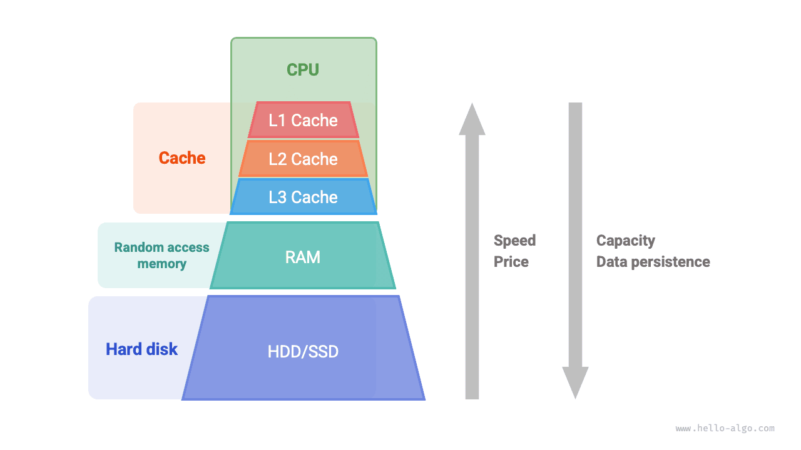
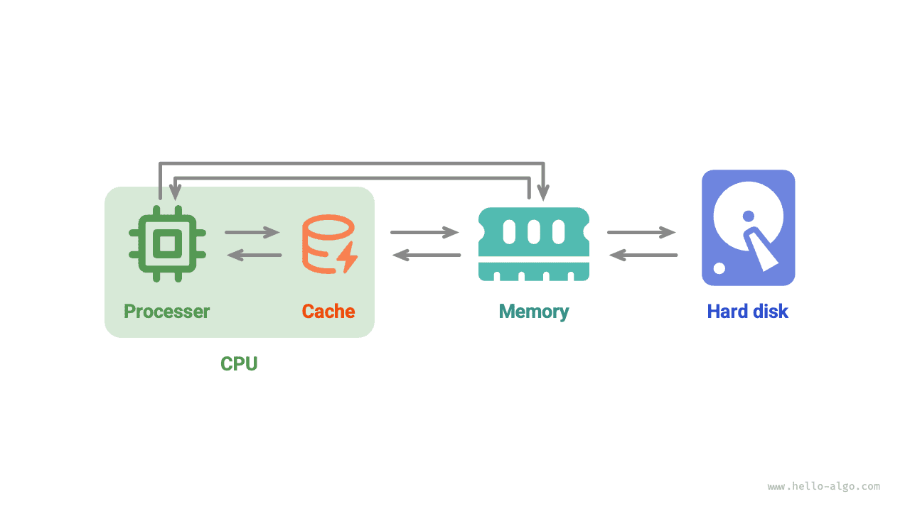

# Bộ nhớ truy cập ngẫu nhiên và bộ đệm *

Trong hai phần đầu của chương này, chúng ta đã khám phá mảng và danh sách liên kết, hai cấu trúc dữ liệu cơ bản và quan trọng đại diện cho hai bố cục vật lý lần lượt là "bộ nhớ liền kề" và "bộ nhớ phân tán".

Trên thực tế, **cấu trúc vật lý quyết định phần lớn hiệu quả sử dụng bộ nhớ và bộ đệm của chương trình**, từ đó ảnh hưởng đến hiệu suất tổng thể của các chương trình thuật toán.

## Thiết bị lưu trữ máy tính

Máy tính bao gồm ba loại thiết bị lưu trữ: <u>đĩa cứng</u>, <u>bộ nhớ truy cập ngẫu nhiên (RAM)</u> và <u>bộ nhớ đệm</u>. Bảng sau đây cho thấy các vai trò và đặc điểm hiệu suất khác nhau của chúng trong hệ thống máy tính.

 Bảng <id> &nbsp; Thiết bị lưu trữ máy tính 

|                | Đĩa cứng | RAM | Bộ nhớ đệm |
| -------------- | ------------------------------------------------------------- | ------------------------------------------------ | -------------------------------------------------------------- |
| Mục đích | Lưu trữ dữ liệu dài hạn, bao gồm hệ điều hành, chương trình và tệp | Lưu trữ tạm thời các chương trình đang chạy và dữ liệu đang được xử lý | Lưu trữ dữ liệu và hướng dẫn được truy cập thường xuyên để giảm quyền truy cập của CPU vào bộ nhớ |
| Biến động | Dữ liệu không bị mất sau khi tắt nguồn | Dữ liệu bị mất sau khi tắt nguồn | Dữ liệu bị mất sau khi tắt nguồn |
| Công suất | Lớn, cỡ terabyte (TB) | Nhỏ, cỡ gigabyte (GB) | Rất nhỏ, cỡ megabyte (MB) |
| Tốc độ | Chậm, hàng trăm đến hàng nghìn MB/s | Nhanh, hàng chục GB/s | Rất nhanh, hàng chục đến hàng trăm GB/s |
| Chi phí (CNY/GB) | Không tốn kém, từ vài phần mười nhân dân tệ đến vài nhân dân tệ mỗi GB | Đắt, từ hàng chục đến hàng trăm nhân dân tệ mỗi GB | Rất đắt, đi kèm gói CPU hiệu quả |

Chúng ta có thể tưởng tượng hệ thống lưu trữ máy tính như một kim tự tháp, như thể hiện trong sơ đồ bên dưới. Các thiết bị lưu trữ gần đầu sẽ nhanh hơn, có dung lượng nhỏ hơn và đắt hơn. Thiết kế nhiều lớp này là có chủ ý, là kết quả của sự cân nhắc cẩn thận của các nhà khoa học và kỹ sư máy tính.

- **Không thể dễ dàng thay thế ổ cứng bằng RAM**. Đầu tiên, dữ liệu trong bộ nhớ sẽ bị mất sau khi tắt nguồn, khiến nó không phù hợp để lưu trữ dữ liệu lâu dài. Thứ hai, bộ nhớ đắt hơn ổ cứng hàng chục lần nên khó phổ biến trên thị trường tiêu dùng.
- **Bộ nhớ đệm không thể đồng thời đạt được dung lượng lớn và tốc độ cao**. Khi dung lượng của bộ nhớ đệm L1, L2 và L3 tăng lên, kích thước vật lý của chúng sẽ lớn hơn và khoảng cách vật lý giữa chúng và lõi CPU cũng tăng lên, dẫn đến thời gian truyền dữ liệu dài hơn và độ trễ truy cập phần tử cao hơn. Với công nghệ hiện tại, cấu trúc bộ đệm nhiều lớp thể hiện điểm cân bằng tốt nhất giữa dung lượng, tốc độ và chi phí.

!!! mẹo

    Hệ thống phân cấp lưu trữ của máy tính thể hiện sự cân bằng tinh tế giữa tốc độ, dung lượng và chi phí. Trên thực tế, sự đánh đổi như vậy là phổ biến ở tất cả các lĩnh vực công nghiệp, đòi hỏi chúng ta phải tìm ra điểm cân bằng tối ưu giữa các lợi thế và hạn chế khác nhau.

Tóm lại, **đĩa cứng được sử dụng để lưu trữ lâu dài lượng lớn dữ liệu, RAM được sử dụng để lưu trữ tạm thời dữ liệu đang được xử lý trong quá trình thực thi chương trình và bộ nhớ đệm được sử dụng để lưu trữ các hướng dẫn và dữ liệu được truy cập thường xuyên**, nhờ đó cải thiện hiệu quả thực hiện chương trình. Cả ba làm việc cùng nhau để giữ cho hệ thống máy tính hoạt động hiệu quả.

Như được hiển thị trong sơ đồ bên dưới, trong khi thực hiện chương trình, dữ liệu được đọc từ đĩa cứng vào RAM để CPU tính toán. Cache có thể được xem như một phần của CPU. **Bằng cách tải dữ liệu từ RAM một cách thông minh**, nó cung cấp cho CPU khả năng truy cập dữ liệu tốc độ cao, cải thiện đáng kể hiệu quả thực thi chương trình và giảm sự phụ thuộc vào RAM chậm hơn.

## Hiệu suất bộ nhớ của cấu trúc dữ liệu

Về mặt sử dụng không gian bộ nhớ, mảng và danh sách liên kết đều có những ưu điểm và hạn chế.

Một mặt, **bộ nhớ bị hạn chế và nhiều chương trình không thể chia sẻ cùng một bộ nhớ**, vì vậy chúng tôi hy vọng cấu trúc dữ liệu có thể sử dụng không gian hiệu quả nhất có thể. Các phần tử mảng được đóng gói chặt chẽ và không cần thêm không gian để lưu trữ các tham chiếu (con trỏ) giữa các nút danh sách được liên kết, do đó có hiệu quả về không gian cao hơn. Tuy nhiên, mảng cần phân bổ đủ không gian bộ nhớ liền kề cùng một lúc, điều này có thể dẫn đến lãng phí bộ nhớ và việc mở rộng mảng đòi hỏi thêm chi phí về thời gian và không gian. Để so sánh, danh sách liên kết thực hiện phân bổ và giải phóng bộ nhớ động trên cơ sở "nút", mang lại tính linh hoạt cao hơn.

Mặt khác, trong quá trình thực thi chương trình, **khi bộ nhớ được cấp phát và giải phóng nhiều lần, mức độ phân mảnh của bộ nhớ trống ngày càng trở nên nghiêm trọng**, dẫn đến hiệu quả sử dụng bộ nhớ giảm. Mảng, do cách tiếp cận lưu trữ liền kề của chúng, tương đối ít bị phân mảnh bộ nhớ hơn. Ngược lại, các thành phần của danh sách liên kết được phân bổ trong bộ lưu trữ và các thao tác chèn và xóa thường xuyên có nhiều khả năng gây ra phân mảnh bộ nhớ.

## Hiệu quả bộ đệm của cấu trúc dữ liệu

Mặc dù bộ đệm có dung lượng không gian nhỏ hơn nhiều so với bộ nhớ nhưng nó nhanh hơn bộ nhớ nhiều và đóng vai trò quan trọng trong tốc độ thực thi chương trình. Do dung lượng bộ nhớ đệm bị giới hạn và chỉ có thể lưu trữ một phần nhỏ dữ liệu được truy cập thường xuyên nên khi CPU cố gắng truy cập dữ liệu không có trong bộ nhớ đệm, sẽ xảy ra <u>lỗi bộ nhớ đệm</u> và CPU phải tải dữ liệu cần thiết từ bộ nhớ chậm hơn.

Rõ ràng, **càng ít "lỗi bộ nhớ đệm", hiệu suất đọc và ghi dữ liệu của CPU càng cao** và hiệu suất chương trình càng tốt. Chúng tôi gọi tỷ lệ dữ liệu mà CPU lấy thành công từ bộ nhớ đệm là <u>tốc độ truy cập bộ nhớ đệm</u>, một số liệu thường được sử dụng để đo lường hiệu quả của bộ nhớ đệm.

Để đạt được hiệu quả cao nhất có thể, bộ đệm sử dụng các cơ chế tải dữ liệu sau.

- **Dòng bộ đệm**: Bộ đệm không lưu trữ và tải dữ liệu trên cơ sở từng byte mà thay vào đó là các dòng bộ đệm. So với truyền theo từng byte, truyền qua đường bộ đệm hiệu quả hơn.
- **Cơ chế tìm nạp trước**: Bộ xử lý cố gắng dự đoán các kiểu truy cập dữ liệu (ví dụ: truy cập tuần tự, truy cập nhảy sải bước cố định, v.v.) và tải dữ liệu vào bộ đệm theo các mẫu cụ thể, từ đó cải thiện tốc độ truy cập.
- **Vị trí không gian**: Nếu một phần dữ liệu được truy cập thì dữ liệu lân cận cũng có thể được truy cập trong tương lai gần. Do đó, khi bộ nhớ đệm tải một phần dữ liệu cụ thể, nó cũng tải dữ liệu lân cận để cải thiện tốc độ truy cập.
- **Vị trí tạm thời**: Nếu một phần dữ liệu được truy cập, nó có thể sẽ được truy cập lại trong tương lai gần. Bộ nhớ đệm tận dụng nguyên tắc này bằng cách giữ lại dữ liệu được truy cập gần đây để cải thiện tỷ lệ truy cập.

Trên thực tế, **mảng và danh sách liên kết khác nhau về mức độ hiệu quả mà chúng sử dụng bộ đệm**, chủ yếu ở các khía cạnh sau.

- **Không gian bị chiếm dụng**: Các phần tử trong danh sách liên kết chiếm nhiều không gian hơn các phần tử mảng, do đó, dữ liệu ít hữu ích hơn có thể vừa với bộ đệm.
- **Dòng bộ đệm**: Dữ liệu danh sách liên kết nằm rải rác trong bộ nhớ, trong khi bộ nhớ đệm tải "theo dòng", do đó tỷ lệ tải dữ liệu không hợp lệ sẽ cao hơn.
- **Cơ chế tìm nạp trước**: Mảng có nhiều kiểu truy cập dữ liệu "có thể dự đoán" hơn so với danh sách liên kết, giúp hệ thống dễ dàng đoán dữ liệu nào sẽ được tải tiếp theo.
- **Vị trí không gian**: Mảng được lưu trữ trong không gian bộ nhớ tập trung, do đó, dữ liệu gần dữ liệu đã tải sẽ có nhiều khả năng được truy cập sớm hơn.

Nhìn chung, **mảng có tỷ lệ truy cập bộ nhớ đệm cao hơn, do đó chúng thường hoạt động hiệu quả hơn danh sách liên kết**. Điều này làm cho cấu trúc dữ liệu được triển khai dựa trên mảng trở nên phổ biến hơn khi giải các bài toán thuật toán.

Điều quan trọng cần lưu ý là **hiệu quả bộ nhớ đệm cao không có nghĩa là mảng tốt hơn danh sách liên kết trong mọi trường hợp**. Trong các ứng dụng thực tế, việc lựa chọn cấu trúc dữ liệu nào cần được xác định dựa trên các yêu cầu cụ thể. Ví dụ: cả mảng và danh sách liên kết đều có thể triển khai cấu trúc dữ liệu "ngăn xếp" (sẽ được thảo luận chi tiết trong chương tiếp theo), nhưng chúng phù hợp với các tình huống khác nhau.

- Khi giải các bài toán thuật toán, chúng ta có xu hướng thích triển khai ngăn xếp dựa trên mảng vì chúng mang lại hiệu quả hoạt động cao hơn và khả năng truy cập ngẫu nhiên, với chi phí phải phân bổ trước một lượng không gian bộ nhớ nhất định cho mảng.
- Nếu khối lượng dữ liệu rất lớn, tính chất động cao và khó ước tính kích thước dự kiến ​​của ngăn xếp thì việc triển khai ngăn xếp dựa trên danh sách liên kết sẽ phù hợp hơn. Danh sách liên kết có thể phân phối lượng lớn dữ liệu trên các phần khác nhau của bộ nhớ và tránh được chi phí bổ sung do việc mở rộng mảng tạo ra.
