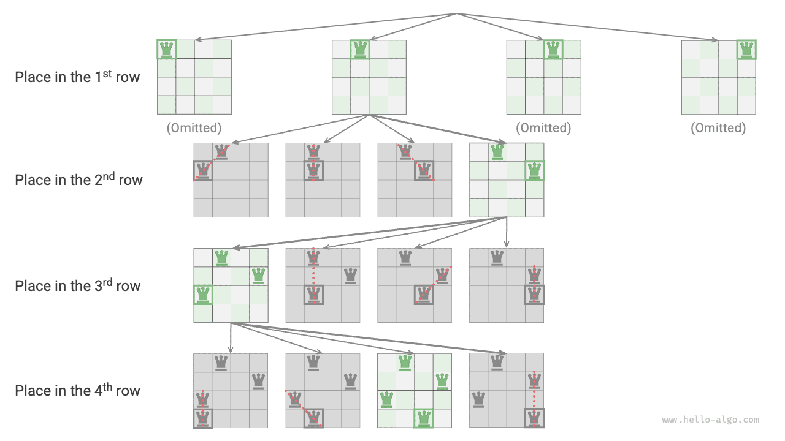

# Vấn đề N-Queens

!!! câu hỏi

    Theo luật cờ vua, quân Hậu có thể tấn công bất kỳ quân nào trên cùng hàng, cột hoặc đường chéo. Cho $n$ quân hậu và một bàn cờ $n \times n$, hãy sắp xếp sao cho không có hai quân hậu nào có thể tấn công lẫn nhau.

Như thể hiện trong hình bên dưới, khi $n = 4$, có thể tìm được hai nghiệm. Từ góc nhìn của thuật toán quay lui, một bàn cờ $n \times n$ có các ô vuông $n^2$, cung cấp tất cả các lựa chọn `choices`. Trong quá trình xếp từng quân hậu một, trạng thái bàn cờ thay đổi liên tục và bàn cờ tại mỗi thời điểm đại diện cho trạng thái `state`.


Hình dưới đây minh họa ba hạn chế của vấn đề này: **nhiều quân hậu không thể ở cùng một hàng, cùng một cột hoặc trên cùng một đường chéo**. Điều đáng chú ý là đường chéo được chia thành hai loại: đường chéo chính `\` và đường chéo đối `/`.


### Chiến lược sắp xếp từng hàng

Vì cả số quân hậu và số hàng trên bàn cờ đều là $n$, nên chúng ta có thể dễ dàng rút ra kết luận: **mỗi hàng của bàn cờ cho phép đặt một và chỉ một quân hậu**.

Điều này có nghĩa là chúng ta có thể áp dụng chiến lược sắp xếp theo từng hàng: bắt đầu từ hàng đầu tiên, đặt một quân hậu ở mỗi hàng cho đến khi hoàn thành hàng cuối cùng.

Hình dưới đây thể hiện quá trình sắp xếp từng hàng cho bài toán 4 con hậu. Do giới hạn về không gian, hình này chỉ mở rộng một nhánh tìm kiếm của hàng đầu tiên và tất cả các sơ đồ vi phạm các ràng buộc về cột hoặc đường chéo đều bị cắt bớt.



Về cơ bản, **chiến lược sắp xếp theo từng hàng phục vụ chức năng cắt tỉa**, vì nó tránh tất cả các nhánh tìm kiếm nơi có nhiều quân hậu xuất hiện trong cùng một hàng.

### Cắt tỉa cột và đường chéo

Để đáp ứng ràng buộc cột, chúng ta có thể sử dụng mảng boolean `cols` có độ dài $n$ để ghi lại xem mỗi cột có một nữ hoàng hay không. Trước mỗi quyết định về vị trí, chúng tôi sử dụng `cols` để cắt bớt các cột đã có quân hậu và cập nhật động trạng thái của `cols` trong quá trình quay lui.

!!! mẹo

    Xin lưu ý rằng gốc của ma trận nằm ở góc trên bên trái, trong đó chỉ số hàng tăng dần từ trên xuống dưới và chỉ số cột tăng dần từ trái sang phải.

Vậy chúng ta xử lý các ràng buộc về đường chéo như thế nào? Xét một hình vuông trên bàn cờ có chỉ số hàng và cột $(row, col)$. Nếu chúng ta chọn một đường chéo chính cụ thể trong ma trận, chúng ta sẽ thấy rằng tất cả các ô vuông trên đường chéo đó có cùng sự khác biệt giữa chỉ số hàng và cột của chúng, **có nghĩa là $row - col$ là một giá trị không đổi cho tất cả các ô vuông trên đường chéo chính**.

Nói cách khác, nếu hai hình vuông thỏa mãn $row_1 - col_1 = row_2 - col_2$ thì chúng phải nằm trên cùng một đường chéo chính. Sử dụng mẫu này, chúng ta có thể sử dụng mảng `diags1` hiển thị trong hình bên dưới để ghi lại xem có quân hậu trên mỗi đường chéo chính hay không.

Tương tự, **đối với tất cả các hình vuông nằm trên một đường chéo, tổng $row + col$ là một giá trị không đổi**. Tương tự, chúng ta có thể sử dụng mảng `diags2` để xử lý các ràng buộc chống đường chéo.


### Triển khai mã

Xin lưu ý rằng trong ma trận vuông $n \times n$, phạm vi của $row - col$ là $[-n + 1, n - 1]$ và phạm vi của $row + col$ là $[0, 2n - 2]$. Do đó, số lượng cả hai đường chéo chính và đối chéo là $2n - 1$, nghĩa là độ dài của cả hai mảng `diags1` và `diags2` là $2n - 1$.

```src
[file]{n_queens}-[class]{}-[func]{n_queens}
```

Đặt $n$ quân hậu theo hàng, xem xét ràng buộc cột, từ hàng đầu tiên đến hàng cuối cùng có các lựa chọn $n$, $n-1$, $\dots$, $2$, $1$, sử dụng thời gian $O(n!)$. Khi ghi lời giải, cần sao chép ma trận `state` và thêm ma trận đó vào `res`, thao tác sao chép sử dụng thời gian $O(n^2)$. Do đó, **độ phức tạp về thời gian tổng thể là $O(n! \cdot n^2)$**. Trong thực tế, việc cắt tỉa dựa trên ràng buộc đường chéo cũng có thể làm giảm đáng kể không gian tìm kiếm, do đó hiệu quả tìm kiếm thường tốt hơn độ phức tạp về thời gian nêu trên.

Mảng `state` sử dụng khoảng trắng $O(n^2)$ và các mảng `cols`, `diags1` và `diags2` mỗi mảng sử dụng khoảng trắng $O(n)$. Độ sâu đệ quy tối đa là $n$, sử dụng không gian khung ngăn xếp $O(n)$. Do đó, **độ phức tạp của không gian là $O(n^2)$**.
