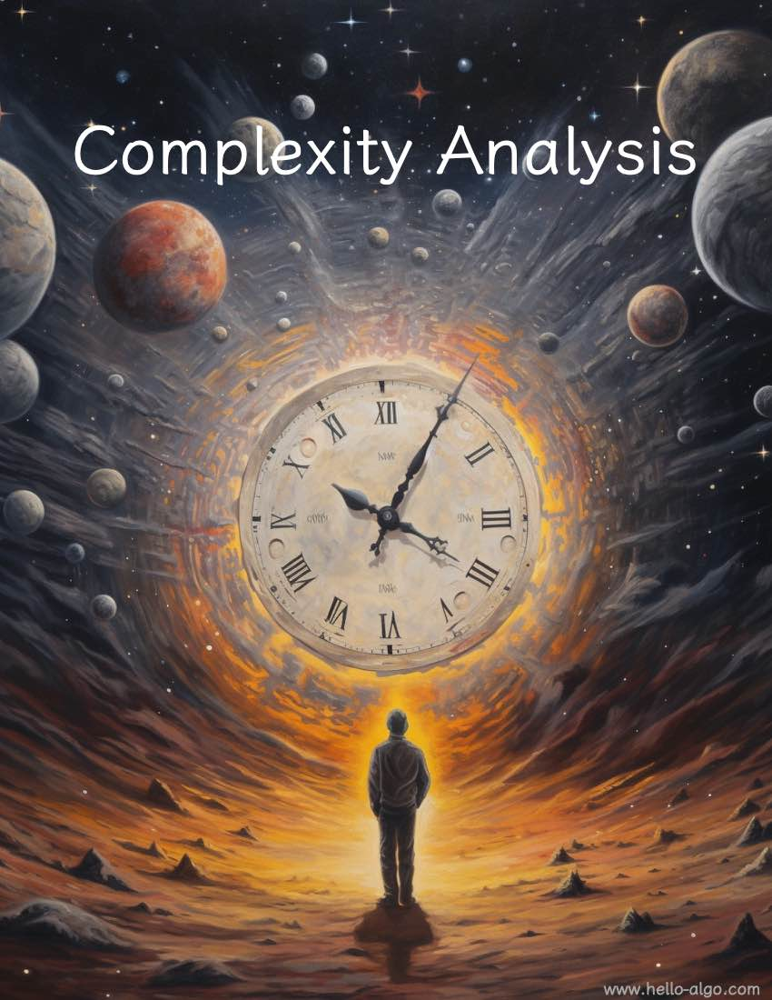

# Phân tích độ phức tạp

!!! trừu tượng

    Phân tích độ phức tạp giống như một hướng dẫn không-thời gian trong vũ trụ thuật toán rộng lớn.

    Nó dẫn chúng ta khám phá sâu sắc trong hai chiều thời gian và không gian, tìm kiếm những giải pháp tao nhã hơn.
