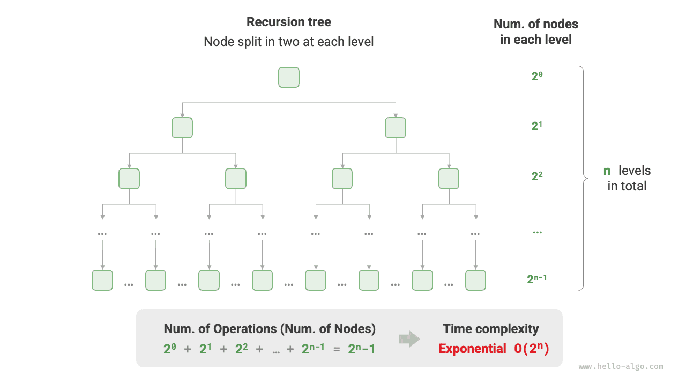
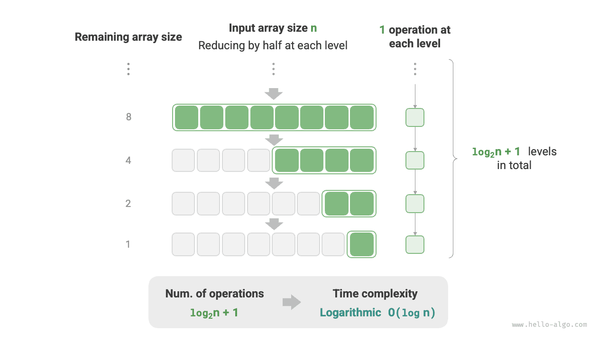

# Độ phức tạp thời gian

Thời gian chạy có thể phản ánh trực quan và chính xác hiệu quả của thuật toán. Nếu muốn ước tính chính xác thời gian chạy của một đoạn mã, chúng ta nên tiến hành như thế nào?

1. **Xác định nền tảng đang chạy**, bao gồm cấu hình phần cứng, ngôn ngữ lập trình, môi trường hệ thống, v.v. vì những yếu tố này đều ảnh hưởng đến hiệu quả thực thi mã.
2. **Đánh giá thời gian chạy cần thiết cho các hoạt động tính toán khác nhau**, ví dụ: thao tác cộng `+` yêu cầu 1 ns, thao tác nhân `*` yêu cầu 10 ns, thao tác in `print()` yêu cầu 5 ns, v.v.
3. **Đếm tất cả các thao tác tính toán trong mã** và tính tổng thời gian thực hiện của tất cả các thao tác để có được thời gian chạy.

Ví dụ: trong đoạn mã sau, kích thước dữ liệu đầu vào là $n$:

=== "Python"

    ```python title=""
    # On a certain running platform
    def algorithm(n: int):
        a = 2      # 1 ns
        a = a + 1  # 1 ns
        a = a * 2  # 10 ns
        # Loop n times
        for _ in range(n):  # 1 ns
            print(0)        # 5 ns
    ```

=== "C++"

    ```cpp title=""
    // On a certain running platform
    void algorithm(int n) {
        int a = 2;  // 1 ns
        a = a + 1;  // 1 ns
        a = a * 2;  // 10 ns
        // Loop n times
        for (int i = 0; i < n; i++) {  // 1 ns
            cout << 0 << endl;         // 5 ns
        }
    }
    ```

=== "Java"

    ```java title=""
    // On a certain running platform
    void algorithm(int n) {
        int a = 2;  // 1 ns
        a = a + 1;  // 1 ns
        a = a * 2;  // 10 ns
        // Loop n times
        for (int i = 0; i < n; i++) {  // 1 ns
            System.out.println(0);     // 5 ns
        }
    }
    ```

=== "C#"

    ```csharp title=""
    // On a certain running platform
    void Algorithm(int n) {
        int a = 2;  // 1 ns
        a = a + 1;  // 1 ns
        a = a * 2;  // 10 ns
        // Loop n times
        for (int i = 0; i < n; i++) {  // 1 ns
            Console.WriteLine(0);      // 5 ns
        }
    }
    ```

=== "Go"

    ```go title=""
    // On a certain running platform
    func algorithm(n int) {
        a := 2     // 1 ns
        a = a + 1  // 1 ns
        a = a * 2  // 10 ns
        // Loop n times
        for i := 0; i < n; i++ {  // 1 ns
            fmt.Println(a)        // 5 ns
        }
    }
    ```

=== "Swift"

    ```swift title=""
    // On a certain running platform
    func algorithm(n: Int) {
        var a = 2 // 1 ns
        a = a + 1 // 1 ns
        a = a * 2 // 10 ns
        // Loop n times
        for _ in 0 ..< n { // 1 ns
            print(0) // 5 ns
        }
    }
    ```

=== "JS"

    ```javascript title=""
    // On a certain running platform
    function algorithm(n) {
        var a = 2; // 1 ns
        a = a + 1; // 1 ns
        a = a * 2; // 10 ns
        // Loop n times
        for(let i = 0; i < n; i++) { // 1 ns
            console.log(0); // 5 ns
        }
    }
    ```

=== "TS"

    ```typescript title=""
    // On a certain running platform
    function algorithm(n: number): void {
        var a: number = 2; // 1 ns
        a = a + 1; // 1 ns
        a = a * 2; // 10 ns
        // Loop n times
        for(let i = 0; i < n; i++) { // 1 ns
            console.log(0); // 5 ns
        }
    }
    ```

=== "Dart"

    ```dart title=""
    // On a certain running platform
    void algorithm(int n) {
      int a = 2; // 1 ns
      a = a + 1; // 1 ns
      a = a * 2; // 10 ns
      // Loop n times
      for (int i = 0; i < n; i++) { // 1 ns
        print(0); // 5 ns
      }
    }
    ```

=== "Rust"

    ```rust title=""
    // On a certain running platform
    fn algorithm(n: i32) {
        let mut a = 2;      // 1 ns
        a = a + 1;          // 1 ns
        a = a * 2;          // 10 ns
        // Loop n times
        for _ in 0..n {     // 1 ns
            println!("{}", 0);  // 5 ns
        }
    }
    ```

=== "C"

    ```c title=""
    // On a certain running platform
    void algorithm(int n) {
        int a = 2;  // 1 ns
        a = a + 1;  // 1 ns
        a = a * 2;  // 10 ns
        // Loop n times
        for (int i = 0; i < n; i++) {   // 1 ns
            printf("%d", 0);            // 5 ns
        }
    }
    ```

=== "Kotlin"

    ```kotlin title=""
    // On a certain running platform
    fun algorithm(n: Int) {
        var a = 2 // 1 ns
        a = a + 1 // 1 ns
        a = a * 2 // 10 ns
        // Loop n times
        for (i in 0..<n) {  // 1 ns
            println(0)      // 5 ns
        }
    }
    ```

=== "Ruby"

    ```ruby title=""
    # On a certain running platform
    def algorithm(n)
        a = 2       # 1 ns
        a = a + 1   # 1 ns
        a = a * 2   # 10 ns
        # Loop n times
        (0...n).each do # 1 ns
            puts 0      # 5 ns
        end
    end
    ```

Theo phương pháp trên, thời gian chạy của thuật toán có thể được lấy là $(6n + 12)$ ns:

$$
1 + 1 + 10 + (1 + 5) \times n = 6n + 12
$$

Tuy nhiên, trên thực tế, **việc cố gắng tính thời gian chạy chính xác của một thuật toán là không thực tế cũng như không thực tế**. Đầu tiên, chúng tôi không muốn ràng buộc thời gian ước tính với nền tảng đang chạy, vì thuật toán cần chạy trên nhiều nền tảng khác nhau. Thứ hai, rất khó để biết thời gian chạy của từng loại hoạt động, điều này khiến quá trình ước tính trở nên vô cùng khó khăn.

## Xu hướng tăng trưởng đếm thời gian

Phân tích độ phức tạp về thời gian không tính thời gian chạy của thuật toán, **mà tính xu hướng tăng trưởng của thời gian chạy thuật toán khi khối lượng dữ liệu tăng**.

Khái niệm “xu hướng tăng trưởng theo thời gian” khá trừu tượng; hãy để chúng tôi hiểu nó thông qua một ví dụ. Giả sử kích thước dữ liệu đầu vào là $n$ và cho ba thuật toán `A`, `B` và `C`:

=== "Python"

    ```python title=""
    # Time complexity of algorithm A: constant order
    def algorithm_A(n: int):
        print(0)
    # Time complexity of algorithm B: linear order
    def algorithm_B(n: int):
        for _ in range(n):
            print(0)
    # Time complexity of algorithm C: constant order
    def algorithm_C(n: int):
        for _ in range(1000000):
            print(0)
    ```

=== "C++"

    ```cpp title=""
    // Time complexity of algorithm A: constant order
    void algorithm_A(int n) {
        cout << 0 << endl;
    }
    // Time complexity of algorithm B: linear order
    void algorithm_B(int n) {
        for (int i = 0; i < n; i++) {
            cout << 0 << endl;
        }
    }
    // Time complexity of algorithm C: constant order
    void algorithm_C(int n) {
        for (int i = 0; i < 1000000; i++) {
            cout << 0 << endl;
        }
    }
    ```

=== "Java"

    ```java title=""
    // Time complexity of algorithm A: constant order
    void algorithm_A(int n) {
        System.out.println(0);
    }
    // Time complexity of algorithm B: linear order
    void algorithm_B(int n) {
        for (int i = 0; i < n; i++) {
            System.out.println(0);
        }
    }
    // Time complexity of algorithm C: constant order
    void algorithm_C(int n) {
        for (int i = 0; i < 1000000; i++) {
            System.out.println(0);
        }
    }
    ```

=== "C#"

    ```csharp title=""
    // Time complexity of algorithm A: constant order
    void AlgorithmA(int n) {
        Console.WriteLine(0);
    }
    // Time complexity of algorithm B: linear order
    void AlgorithmB(int n) {
        for (int i = 0; i < n; i++) {
            Console.WriteLine(0);
        }
    }
    // Time complexity of algorithm C: constant order
    void AlgorithmC(int n) {
        for (int i = 0; i < 1000000; i++) {
            Console.WriteLine(0);
        }
    }
    ```

=== "Go"

    ```go title=""
    // Time complexity of algorithm A: constant order
    func algorithm_A(n int) {
        fmt.Println(0)
    }
    // Time complexity of algorithm B: linear order
    func algorithm_B(n int) {
        for i := 0; i < n; i++ {
            fmt.Println(0)
        }
    }
    // Time complexity of algorithm C: constant order
    func algorithm_C(n int) {
        for i := 0; i < 1000000; i++ {
            fmt.Println(0)
        }
    }
    ```

=== "Swift"

    ```swift title=""
    // Time complexity of algorithm A: constant order
    func algorithmA(n: Int) {
        print(0)
    }

    // Time complexity of algorithm B: linear order
    func algorithmB(n: Int) {
        for _ in 0 ..< n {
            print(0)
        }
    }

    // Time complexity of algorithm C: constant order
    func algorithmC(n: Int) {
        for _ in 0 ..< 1_000_000 {
            print(0)
        }
    }
    ```

=== "JS"

    ```javascript title=""
    // Time complexity of algorithm A: constant order
    function algorithm_A(n) {
        console.log(0);
    }
    // Time complexity of algorithm B: linear order
    function algorithm_B(n) {
        for (let i = 0; i < n; i++) {
            console.log(0);
        }
    }
    // Time complexity of algorithm C: constant order
    function algorithm_C(n) {
        for (let i = 0; i < 1000000; i++) {
            console.log(0);
        }
    }

    ```

=== "TS"

    ```typescript title=""
    // Time complexity of algorithm A: constant order
    function algorithm_A(n: number): void {
        console.log(0);
    }
    // Time complexity of algorithm B: linear order
    function algorithm_B(n: number): void {
        for (let i = 0; i < n; i++) {
            console.log(0);
        }
    }
    // Time complexity of algorithm C: constant order
    function algorithm_C(n: number): void {
        for (let i = 0; i < 1000000; i++) {
            console.log(0);
        }
    }
    ```

=== "Dart"

    ```dart title=""
    // Time complexity of algorithm A: constant order
    void algorithmA(int n) {
      print(0);
    }
    // Time complexity of algorithm B: linear order
    void algorithmB(int n) {
      for (int i = 0; i < n; i++) {
        print(0);
      }
    }
    // Time complexity of algorithm C: constant order
    void algorithmC(int n) {
      for (int i = 0; i < 1000000; i++) {
        print(0);
      }
    }
    ```

=== "Rust"

    ```rust title=""
    // Time complexity of algorithm A: constant order
    fn algorithm_A(n: i32) {
        println!("{}", 0);
    }
    // Time complexity of algorithm B: linear order
    fn algorithm_B(n: i32) {
        for _ in 0..n {
            println!("{}", 0);
        }
    }
    // Time complexity of algorithm C: constant order
    fn algorithm_C(n: i32) {
        for _ in 0..1000000 {
            println!("{}", 0);
        }
    }
    ```

=== "C"

    ```c title=""
    // Time complexity of algorithm A: constant order
    void algorithm_A(int n) {
        printf("%d", 0);
    }
    // Time complexity of algorithm B: linear order
    void algorithm_B(int n) {
        for (int i = 0; i < n; i++) {
            printf("%d", 0);
        }
    }
    // Time complexity of algorithm C: constant order
    void algorithm_C(int n) {
        for (int i = 0; i < 1000000; i++) {
            printf("%d", 0);
        }
    }
    ```

=== "Kotlin"

    ```kotlin title=""
    // Time complexity of algorithm A: constant order
    fun algoritm_A(n: Int) {
        println(0)
    }
    // Time complexity of algorithm B: linear order
    fun algorithm_B(n: Int) {
        for (i in 0..<n){
            println(0)
        }
    }
    // Time complexity of algorithm C: constant order
    fun algorithm_C(n: Int) {
        for (i in 0..<1000000) {
            println(0)
        }
    }
    ```

=== "Ruby"

    ```ruby title=""
    # Time complexity of algorithm A: constant order
    def algorithm_A(n)
        puts 0
    end

    # Time complexity of algorithm B: linear order
    def algorithm_B(n)
        (0...n).each { puts 0 }
    end

    # Time complexity of algorithm C: constant order
    def algorithm_C(n)
        (0...1_000_000).each { puts 0 }
    end
    ```

Hình dưới đây cho thấy độ phức tạp về thời gian của ba hàm thuật toán trên.

- Thuật toán `A` chỉ có thao tác in $1$ và thời gian chạy của thuật toán không tăng khi $n$ tăng. Chúng tôi gọi độ phức tạp về thời gian của thuật toán này là "thứ tự không đổi".
- Trong thuật toán `B`, thao tác in cần lặp $n$ lần và thời gian chạy của thuật toán tăng tuyến tính khi $n$ tăng. Độ phức tạp về thời gian của thuật toán này được gọi là "thứ tự tuyến tính".
- Trong thuật toán `C`, thao tác in cần lặp $1000000$ lần. Mặc dù thời gian chạy rất dài nhưng nó độc lập với kích thước dữ liệu đầu vào $n$. Do đó, độ phức tạp về thời gian của `C` giống như `A`, vẫn là "thứ tự không đổi".


So với việc đếm trực tiếp thời gian chạy của thuật toán, đặc điểm của phân tích độ phức tạp thời gian là gì?

- **Độ phức tạp về thời gian có thể đánh giá hiệu quả của thuật toán một cách hiệu quả**. Ví dụ: thời gian chạy của thuật toán `B` tăng tuyến tính; khi $n > 1$ thì nó chậm hơn thuật toán `A` và khi $n > 1000000$ thì nó chậm hơn thuật toán `C`. Trên thực tế, miễn là kích thước dữ liệu đầu vào $n$ đủ lớn, thuật toán có độ phức tạp "bậc không đổi" sẽ luôn vượt trội so với thuật toán có độ phức tạp "bậc tuyến tính", đây chính xác là ý nghĩa của xu hướng tăng trưởng theo thời gian.
- **Phương pháp đạo hàm độ phức tạp về thời gian đơn giản hơn**. Rõ ràng, nền tảng đang chạy và các loại hoạt động tính toán đều không liên quan đến xu hướng tăng trưởng thời gian chạy của thuật toán. Do đó, trong phân tích độ phức tạp về thời gian, chúng ta có thể đơn giản coi thời gian thực hiện của tất cả các thao tác tính toán là cùng một "đơn vị thời gian", giảm việc "theo dõi thời gian chạy của từng thao tác" thành "đếm số lượng thao tác", điều này giúp giảm đáng kể độ khó của việc ước tính.
- **Độ phức tạp về thời gian cũng có những hạn chế nhất định**. Ví dụ: mặc dù thuật toán `A` và `C` có cùng độ phức tạp về thời gian nhưng thời gian chạy thực tế của chúng khác nhau đáng kể. Tương tự, mặc dù thuật toán `B` có độ phức tạp về thời gian cao hơn `C`, nhưng khi kích thước dữ liệu đầu vào $n$ nhỏ, thuật toán `B` rõ ràng vượt trội hơn thuật toán `C`. Trong những trường hợp như vậy, thường rất khó để đánh giá hiệu quả của thuật toán chỉ dựa trên độ phức tạp về thời gian. Tất nhiên, bất chấp những vấn đề trên, phân tích độ phức tạp vẫn là phương pháp hiệu quả nhất và được sử dụng phổ biến nhất để đánh giá hiệu quả của thuật toán.

## Giới hạn trên tiệm cận của hàm số

Cho một hàm có kích thước đầu vào $n$:

=== "Python"

    ```python title=""
    def algorithm(n: int):
        a = 1      # +1
        a = a + 1  # +1
        a = a * 2  # +1
        # Loop n times
        for i in range(n):  # +1
            print(0)        # +1
    ```

=== "C++"

    ```cpp title=""
    void algorithm(int n) {
        int a = 1;  // +1
        a = a + 1;  // +1
        a = a * 2;  // +1
        // Loop n times
        for (int i = 0; i < n; i++) { // +1 (i++ is executed each round)
            cout << 0 << endl;    // +1
        }
    }
    ```

=== "Java"

    ```java title=""
    void algorithm(int n) {
        int a = 1;  // +1
        a = a + 1;  // +1
        a = a * 2;  // +1
        // Loop n times
        for (int i = 0; i < n; i++) { // +1 (i++ is executed each round)
            System.out.println(0);    // +1
        }
    }
    ```

=== "C#"

    ```csharp title=""
    void Algorithm(int n) {
        int a = 1;  // +1
        a = a + 1;  // +1
        a = a * 2;  // +1
        // Loop n times
        for (int i = 0; i < n; i++) {   // +1 (i++ is executed each round)
            Console.WriteLine(0);   // +1
        }
    }
    ```

=== "Go"

    ```go title=""
    func algorithm(n int) {
        a := 1      // +1
        a = a + 1   // +1
        a = a * 2   // +1
        // Loop n times
        for i := 0; i < n; i++ {   // +1
            fmt.Println(a)         // +1
        }
    }
    ```

=== "Swift"

    ```swift title=""
    func algorithm(n: Int) {
        var a = 1 // +1
        a = a + 1 // +1
        a = a * 2 // +1
        // Loop n times
        for _ in 0 ..< n { // +1
            print(0) // +1
        }
    }
    ```

=== "JS"

    ```javascript title=""
    function algorithm(n) {
        var a = 1; // +1
        a += 1; // +1
        a *= 2; // +1
        // Loop n times
        for(let i = 0; i < n; i++){ // +1 (i++ is executed each round)
            console.log(0); // +1
        }
    }
    ```

=== "TS"

    ```typescript title=""
    function algorithm(n: number): void{
        var a: number = 1; // +1
        a += 1; // +1
        a *= 2; // +1
        // Loop n times
        for(let i = 0; i < n; i++){ // +1 (i++ is executed each round)
            console.log(0); // +1
        }
    }
    ```

=== "Dart"

    ```dart title=""
    void algorithm(int n) {
      int a = 1; // +1
      a = a + 1; // +1
      a = a * 2; // +1
      // Loop n times
      for (int i = 0; i < n; i++) { // +1 (i++ is executed each round)
        print(0); // +1
      }
    }
    ```

=== "Rust"

    ```rust title=""
    fn algorithm(n: i32) {
        let mut a = 1;   // +1
        a = a + 1;      // +1
        a = a * 2;      // +1

        // Loop n times
        for _ in 0..n { // +1 (i++ is executed each round)
            println!("{}", 0); // +1
        }
    }
    ```

=== "C"

    ```c title=""
    void algorithm(int n) {
        int a = 1;  // +1
        a = a + 1;  // +1
        a = a * 2;  // +1
        // Loop n times
        for (int i = 0; i < n; i++) {   // +1 (i++ is executed each round)
            printf("%d", 0);            // +1
        }
    }
    ```

=== "Kotlin"

    ```kotlin title=""
    fun algorithm(n: Int) {
        var a = 1 // +1
        a = a + 1 // +1
        a = a * 2 // +1
        // Loop n times
        for (i in 0..<n) { // +1 (i++ is executed each round)
            println(0) // +1
        }
    }
    ```

=== "Ruby"

    ```ruby title=""
    def algorithm(n)
        a = 1       # +1
        a = a + 1   # +1
        a = a * 2   # +1
        # Loop n times
        (0...n).each do # +1
            puts 0      # +1
        end
    end
    ```

Giả sử số lần thực hiện của thuật toán là hàm của kích thước dữ liệu đầu vào $n$, ký hiệu là $T(n)$. Khi đó số lần thực hiện của hàm trên là:

$$
T(n) = 3 + 2n
$$

$T(n)$ là một hàm tuyến tính, biểu thị rằng xu hướng tăng trưởng thời gian chạy của nó là tuyến tính và do đó độ phức tạp về thời gian của nó là bậc tuyến tính.

Chúng tôi biểu thị độ phức tạp về thời gian của thứ tự tuyến tính là $O(n)$. Ký hiệu toán học này được gọi là <u>ký hiệu big-$O$</u>, biểu thị <u>giới hạn tiệm cận trên</u> của hàm $T(n)$.

Phân tích độ phức tạp về thời gian về cơ bản tính toán giới hạn tiệm cận trên của "số phép toán $T(n)$", có định nghĩa toán học rõ ràng.

!!! lưu ý "Giới hạn trên tiệm cận của hàm số"

    Nếu tồn tại các số thực dương $c$ và $n_0$ sao cho với mọi $n > n_0$, chúng ta có $T(n) \leq c \cdot f(n)$, thì $f(n)$ có thể được coi là cận trên tiệm cận của $T(n)$, ký hiệu là $T(n) = O(f(n))$.

Như thể hiện trong hình bên dưới, việc tính giới hạn trên tiệm cận là tìm một hàm $f(n)$ sao cho khi $n$ tiến tới vô cùng, $T(n)$ và $f(n)$ có cùng mức tăng trưởng, chỉ khác nhau một hệ số không đổi $c$.


## Phương pháp phái sinh

Ý tưởng về giới hạn trên tiệm cận có phần mang tính toán học. Nếu bạn cảm thấy mình chưa hiểu hết về nó, đừng lo lắng. Trước tiên chúng ta có thể nắm vững phương pháp đạo hàm và dần dần nắm bắt được ý nghĩa toán học của nó thông qua thực hành liên tục.

Theo định nghĩa, sau khi xác định $f(n)$, chúng ta có thể thu được độ phức tạp thời gian $O(f(n))$. Vậy làm cách nào để xác định giới hạn trên tiệm cận $f(n)$? Nhìn chung, nó được chia thành hai bước: đầu tiên đếm số lượng thao tác, sau đó xác định giới hạn tiệm cận trên.

### Bước 1: Đếm số thao tác

Đối với mã, đếm từ trên xuống dưới theo dòng. Tuy nhiên, vì hệ số không đổi $c$ trong $c \cdot f(n)$ ở trên có thể có kích thước bất kỳ, **các hệ số và số hạng không đổi trong số lượng phép toán $T(n)$ đều có thể bị bỏ qua**. Theo nguyên tắc này, có thể tóm tắt các kỹ thuật đơn giản hóa việc đếm sau đây.

1. **Bỏ qua các hằng số trong $T(n)$**. Vì chúng đều độc lập với $n$ nên chúng không ảnh hưởng đến độ phức tạp về thời gian.
2. **Bỏ qua tất cả các hệ số**. Ví dụ: lặp $2n$ lần, $5n + 1$ lần, v.v., tất cả đều có thể được đơn giản hóa thành $n$ lần, vì hệ số trước $n$ không ảnh hưởng đến độ phức tạp về thời gian.
3. **Sử dụng phép nhân cho các vòng lặp lồng nhau**. Tổng số thao tác bằng tích của số thao tác ở vòng lặp bên ngoài và vòng lặp bên trong, với mỗi lớp vòng lặp vẫn có thể áp dụng các kỹ thuật `1.` và `2.` riêng biệt.

Cho một hàm, chúng ta có thể sử dụng các kỹ thuật trên để đếm số lượng thao tác:

=== "Python"

    ```python title=""
    def algorithm(n: int):
        a = 1      # +0 (Technique 1)
        a = a + n  # +0 (Technique 1)
        # +n (Technique 2)
        for i in range(5 * n + 1):
            print(0)
        # +n*n (Technique 3)
        for i in range(2 * n):
            for j in range(n + 1):
                print(0)
    ```

=== "C++"

    ```cpp title=""
    void algorithm(int n) {
        int a = 1;  // +0 (Technique 1)
        a = a + n;  // +0 (Technique 1)
        // +n (Technique 2)
        for (int i = 0; i < 5 * n + 1; i++) {
            cout << 0 << endl;
        }
        // +n*n (Technique 3)
        for (int i = 0; i < 2 * n; i++) {
            for (int j = 0; j < n + 1; j++) {
                cout << 0 << endl;
            }
        }
    }
    ```

=== "Java"

    ```java title=""
    void algorithm(int n) {
        int a = 1;  // +0 (Technique 1)
        a = a + n;  // +0 (Technique 1)
        // +n (Technique 2)
        for (int i = 0; i < 5 * n + 1; i++) {
            System.out.println(0);
        }
        // +n*n (Technique 3)
        for (int i = 0; i < 2 * n; i++) {
            for (int j = 0; j < n + 1; j++) {
                System.out.println(0);
            }
        }
    }
    ```

=== "C#"

    ```csharp title=""
    void Algorithm(int n) {
        int a = 1;  // +0 (Technique 1)
        a = a + n;  // +0 (Technique 1)
        // +n (Technique 2)
        for (int i = 0; i < 5 * n + 1; i++) {
            Console.WriteLine(0);
        }
        // +n*n (Technique 3)
        for (int i = 0; i < 2 * n; i++) {
            for (int j = 0; j < n + 1; j++) {
                Console.WriteLine(0);
            }
        }
    }
    ```

=== "Go"

    ```go title=""
    func algorithm(n int) {
        a := 1     // +0 (Technique 1)
        a = a + n  // +0 (Technique 1)
        // +n (Technique 2)
        for i := 0; i < 5 * n + 1; i++ {
            fmt.Println(0)
        }
        // +n*n (Technique 3)
        for i := 0; i < 2 * n; i++ {
            for j := 0; j < n + 1; j++ {
                fmt.Println(0)
            }
        }
    }
    ```

=== "Swift"

    ```swift title=""
    func algorithm(n: Int) {
        var a = 1 // +0 (Technique 1)
        a = a + n // +0 (Technique 1)
        // +n (Technique 2)
        for _ in 0 ..< (5 * n + 1) {
            print(0)
        }
        // +n*n (Technique 3)
        for _ in 0 ..< (2 * n) {
            for _ in 0 ..< (n + 1) {
                print(0)
            }
        }
    }
    ```

=== "JS"

    ```javascript title=""
    function algorithm(n) {
        let a = 1;  // +0 (Technique 1)
        a = a + n;  // +0 (Technique 1)
        // +n (Technique 2)
        for (let i = 0; i < 5 * n + 1; i++) {
            console.log(0);
        }
        // +n*n (Technique 3)
        for (let i = 0; i < 2 * n; i++) {
            for (let j = 0; j < n + 1; j++) {
                console.log(0);
            }
        }
    }
    ```

=== "TS"

    ```typescript title=""
    function algorithm(n: number): void {
        let a = 1;  // +0 (Technique 1)
        a = a + n;  // +0 (Technique 1)
        // +n (Technique 2)
        for (let i = 0; i < 5 * n + 1; i++) {
            console.log(0);
        }
        // +n*n (Technique 3)
        for (let i = 0; i < 2 * n; i++) {
            for (let j = 0; j < n + 1; j++) {
                console.log(0);
            }
        }
    }
    ```

=== "Dart"

    ```dart title=""
    void algorithm(int n) {
      int a = 1; // +0 (Technique 1)
      a = a + n; // +0 (Technique 1)
      // +n (Technique 2)
      for (int i = 0; i < 5 * n + 1; i++) {
        print(0);
      }
      // +n*n (Technique 3)
      for (int i = 0; i < 2 * n; i++) {
        for (int j = 0; j < n + 1; j++) {
          print(0);
        }
      }
    }
    ```

=== "Rust"

    ```rust title=""
    fn algorithm(n: i32) {
        let mut a = 1;     // +0 (Technique 1)
        a = a + n;        // +0 (Technique 1)

        // +n (Technique 2)
        for i in 0..(5 * n + 1) {
            println!("{}", 0);
        }

        // +n*n (Technique 3)
        for i in 0..(2 * n) {
            for j in 0..(n + 1) {
                println!("{}", 0);
            }
        }
    }
    ```

=== "C"

    ```c title=""
    void algorithm(int n) {
        int a = 1;  // +0 (Technique 1)
        a = a + n;  // +0 (Technique 1)
        // +n (Technique 2)
        for (int i = 0; i < 5 * n + 1; i++) {
            printf("%d", 0);
        }
        // +n*n (Technique 3)
        for (int i = 0; i < 2 * n; i++) {
            for (int j = 0; j < n + 1; j++) {
                printf("%d", 0);
            }
        }
    }
    ```

=== "Kotlin"

    ```kotlin title=""
    fun algorithm(n: Int) {
        var a = 1   // +0 (Technique 1)
        a = a + n   // +0 (Technique 1)
        // +n (Technique 2)
        for (i in 0..<5 * n + 1) {
            println(0)
        }
        // +n*n (Technique 3)
        for (i in 0..<2 * n) {
            for (j in 0..<n + 1) {
                println(0)
            }
        }
    }
    ```

=== "Ruby"

    ```ruby title=""
    def algorithm(n)
        a = 1       # +0 (Technique 1)
        a = a + n   # +0 (Technique 1)
        # +n (Technique 2)
        (0...(5 * n + 1)).each do { puts 0 }
        # +n*n (Technique 3)
        (0...(2 * n)).each do
            (0...(n + 1)).each do { puts 0 }
        end
    end
    ```

Công thức sau đây thể hiện kết quả đếm trước và sau khi sử dụng các kỹ thuật trên; cả hai đều có độ phức tạp về thời gian là $O(n^2)$.

$$
\bắt đầu{căn chỉnh}
T(n) & = 2n(n + 1) + (5n + 1) + 2 & \text{Đếm đầy đủ (-.-|||)} \newline
& = 2n^2 + 7n + 3 \newline
T(n) & = n^2 + n & \text{Số đơn giản hóa (o.O)}
\end{căn chỉnh}
$$

### Bước 2: Xác định giới hạn tiệm cận trên

**Độ phức tạp về thời gian được xác định bởi số hạng có thứ tự cao nhất trong $T(n)$**. Điều này là do khi $n$ tiến tới vô cùng, số hạng bậc cao nhất sẽ đóng vai trò chủ đạo và ảnh hưởng của các số hạng khác có thể bị bỏ qua.

Bảng dưới đây trình bày một số ví dụ, trong đó một số giá trị phóng đại được sử dụng để nhấn mạnh kết luận rằng "các hệ số không thể làm lung lay trật tự". Khi $n$ tiến tới vô cùng, các hằng số này trở nên không có ý nghĩa.

<p align="center"> Bảng <id> &nbsp; Độ phức tạp về thời gian tương ứng với số lượng thao tác khác nhau </p>

| Số lượng hoạt động $T(n)$ | Độ phức tạp thời gian $O(f(n))$ |
| ---------------------- | -------------------- |
| $100000$ | $O(1)$ |
| $3n + 2$ | $O(n)$ |
| $2n^2 + 3n + 2$ | $O(n^2)$ |
| $n^3 + 10000n^2$ | $O(n^3)$ |
| $2^n + 10000n^{10000}$ | $O(2^n)$ |

## Các loại phổ biến

Đặt kích thước dữ liệu đầu vào là $n$. Các loại độ phức tạp thời gian phổ biến được thể hiện trong hình bên dưới (sắp xếp theo thứ tự từ thấp đến cao).

$$
\bắt đầu{căn chỉnh}
& O(1) < O(\log n) < O(n) < O(n \log n) < O(n^2) < O(2^n) < O(n!) \newline
& \text{Constant} < \text{Logarithmic} < \text{Linear} < \text{Linearithmic} < \text{Quadratic} < \text{Exponential} < \text{Factorial}
\end{aligned}
$$


### Constant Order $O(1)$

The number of operations in constant order is independent of the input data size $n$, meaning it does not change as $n$ changes.

In the following function, although the value of `size` may be large, it is independent of the input data size $n$, so the time complexity remains $O(1)$:

```src
[file]{time_complexity}-[class]{}-[func]{constant}
```

### Linear Order $O(n)$

The number of operations in linear order grows linearly relative to the input data size $n$. Linear order typically appears in single-layer loops:

```src
[file]{time_complexity}-[class]{}-[func]{linear}
```

Operations such as traversing arrays and traversing linked lists have a time complexity of $O(n)$, where $n$ is the length of the array or linked list:

```src
[file]{time_complexity}-[class]{}-[func]{array_traversal}
```

It is worth noting that **the input data size $n$ should be determined according to the type of input data**. For example, in the first example, the variable $n$ is the input data size; in the second example, the array length $n$ is the data size.

### Quadratic Order $O(n^2)$

The number of operations in quadratic order grows quadratically relative to the input data size $n$. Quadratic order typically appears in nested loops, where both the outer and inner loops have a time complexity of $O(n)$, resulting in an overall time complexity of $O(n^2)$:

```src
[file]{time_complexity}-[class]{}-[func]{quadratic}
```

The figure below compares constant order, linear order, and quadratic order time complexities.


Taking bubble sort as an example, the outer loop executes $n - 1$ times, and the inner loop executes $n-1$, $n-2$, $\dots$, $2$, $1$ times, averaging $n / 2$ times, resulting in a time complexity of $O((n - 1) n / 2) = O(n^2)$:

```src
[file]{time_complexity}-[class]{}-[func]{bubble_sort}
```

### Exponential Order $O(2^n)$

Biological "cell division" is a typical example of exponential order growth: the initial state is $1$ cell, after one round of division it becomes $2$, after two rounds it becomes $4$, and so on; after $n$ rounds of division there are $2^n$ cells.

The figure below and the following code simulate the cell division process, with a time complexity of $O(2^n)$. Note that the input $n$ represents the number of division rounds, and the return value `count` represents the total number of divisions.

```src
[file]{time_complexity}-[class]{}-[func]{exponential}
```



In actual algorithms, exponential order often appears in recursive functions. For example, in the following code, it recursively splits in two, stopping after $n$ splits:

```src
[file]{time_complexity}-[class]{}-[func]{exp_recur}
```

Exponential order growth is very rapid and is common in exhaustive methods (brute force search, backtracking, etc.). For problems with large data scales, exponential order is unacceptable and typically requires dynamic programming or greedy algorithms to solve.

### Logarithmic Order $O(\log n)$

In contrast to exponential order, logarithmic order reflects the situation of "reducing to half each round". Let the input data size be $n$. Since it is reduced to half each round, the number of loops is $\log_2 n$, which is the inverse function of $2^n$.

The figure below and the following code simulate the process of "reducing to half each round", with a time complexity of $O(\log_2 n)$, abbreviated as $O(\log n)$:

```src
[file]{time_complexity}-[class]{}-[func]{logarithmic}
```



Like exponential order, logarithmic order also commonly appears in recursive functions. The following code forms a recursion tree of height $\log_2 n$:

```src
[file]{time_complexity}-[class]{}-[func]{log_recur}
```

Logarithmic order commonly appears in algorithms based on the divide-and-conquer strategy, reflecting the idea of repeatedly splitting a problem and simplifying it. It grows slowly and is the ideal time complexity second only to constant order.

!!! tip "What is the base of $O(\log n)$?"

    To be precise, "dividing into $m$" corresponds to a time complexity of $O(\log_m n)$. And through the logarithmic base change formula, we can obtain time complexities with different bases that are equal:

    $$
    O(\log_m n) = O(\log_k n / \log_k m) = O(\log_k n)
    $$

    That is to say, the base $m$ can be converted without affecting the complexity. Therefore, we usually omit the base $m$ and denote logarithmic order simply as $O(\log n)$.

### Linearithmic Order $O(n \log n)$

Linearithmic order commonly appears in nested loops, where the time complexities of the two layers of loops are $O(\log n)$ and $O(n)$ respectively. The relevant code is as follows:

```src
[file]{time_complexity}-[class]{}-[func]{linear_log_recur}
```

The figure below shows how linearithmic order is generated. Each level of the binary tree has a total of $n$ operations, and the tree has $\log_2 n + 1$ levels, resulting in a time complexity of $O(n \log n)$.


Mainstream sorting algorithms typically have a time complexity of $O(n \log n)$, such as quicksort, merge sort, and heap sort.

### Factorial Order $O(n!)$

Factorial order corresponds to the mathematical "permutation" problem. Given $n$ distinct elements, find all possible permutation schemes; the number of schemes is:

$$
n! = n \times (n - 1) \times (n - 2) \times \dots \times 2 \times 1
$$

Factorials are typically implemented using recursion. As shown in the figure below and the following code, the first level splits into $n$ branches, the second level splits into $n - 1$ branches, and so on, until the $n$-th level when splitting stops:

```src
[file]{time_complexity}-[class]{}-[func]{factorial_recur}
```


Note that because when $n \geq 4$ we always have $n! > 2^n$, thứ tự giai thừa tăng nhanh hơn thứ tự hàm mũ và cũng không được chấp nhận đối với $n$ lớn.

## Độ phức tạp thời gian tồi tệ nhất, tốt nhất và trung bình

**Hiệu quả về thời gian của một thuật toán thường không cố định mà liên quan đến việc phân phối dữ liệu đầu vào**. Giả sử chúng ta nhập một mảng `nums` có độ dài $n$, trong đó `nums` bao gồm các số từ $1$ đến $n$, với mỗi số chỉ xuất hiện một lần nhưng thứ tự phần tử được xáo trộn ngẫu nhiên. Nhiệm vụ là trả về chỉ mục của phần tử $1$. Chúng ta có thể rút ra kết luận sau đây.

- Khi `nums = [?, ?, ..., 1]`, tức là khi phần tử cuối cùng là $1$, nó yêu cầu duyệt toàn bộ mảng, **đạt độ phức tạp về thời gian trong trường hợp xấu nhất $O(n)$**.
- Khi `nums = [1, ?, ?, ...]`, tức là khi phần tử đầu tiên là $1$, bất kể mảng dài bao nhiêu, không cần tiếp tục duyệt, **đạt độ phức tạp về thời gian trong trường hợp tốt nhất $\Omega(1)$**.

"Độ phức tạp về thời gian trong trường hợp xấu nhất" tương ứng với cận trên tiệm cận của hàm, được biểu thị bằng ký hiệu big-$O$. Tương ứng, "độ phức tạp thời gian trong trường hợp tốt nhất" tương ứng với giới hạn dưới tiệm cận của hàm, được biểu thị bằng ký hiệu $\Omega$:

```src
[file]{worst_best_time_complexity}-[class]{}-[func]{find_one}
```

Điều đáng lưu ý là chúng ta hiếm khi sử dụng độ phức tạp về thời gian trong trường hợp tốt nhất trong thực tế, bởi vì nó thường chỉ có thể đạt được với xác suất rất nhỏ và có thể gây hiểu nhầm đôi chút. **Độ phức tạp về thời gian trong trường hợp xấu nhất thực tế hơn vì nó mang lại giá trị an toàn về hiệu quả**, cho phép chúng tôi sử dụng thuật toán một cách tự tin.

Từ ví dụ trên, chúng ta có thể thấy rằng cả độ phức tạp về thời gian trong trường hợp xấu nhất và trường hợp tốt nhất chỉ phát sinh dưới các phân phối đầu vào cụ thể, có thể xảy ra với xác suất rất thấp và có thể không phản ánh thực sự hiệu quả hoạt động của thuật toán. Ngược lại, **độ phức tạp về thời gian trung bình có thể phản ánh hiệu quả hoạt động của thuật toán trong dữ liệu đầu vào ngẫu nhiên**, được biểu thị bằng ký hiệu $\Theta$.

Đối với một số thuật toán, chúng ta có thể rút ra trường hợp trung bình một cách đơn giản theo phân phối dữ liệu ngẫu nhiên. Ví dụ: trong ví dụ trên, do mảng đầu vào bị xáo trộn nên xác suất phần tử $1$ xuất hiện ở bất kỳ chỉ mục nào là bằng nhau, do đó số vòng lặp trung bình của thuật toán bằng một nửa độ dài mảng $n / 2$, cho độ phức tạp thời gian trung bình là $\Theta(n / 2) = \Theta(n)$.

Nhưng đối với các thuật toán phức tạp hơn, việc tính toán độ phức tạp thời gian trung bình thường khá khó khăn, vì khó có thể phân tích kỳ vọng toán học tổng thể theo phân phối dữ liệu. Trong trường hợp này, chúng tôi thường sử dụng độ phức tạp về thời gian trong trường hợp xấu nhất làm tiêu chí để đánh giá hiệu quả của thuật toán.

!!! câu hỏi "Tại sao biểu tượng $\Theta$ hiếm khi được nhìn thấy?"

    Điều này có thể là do ký hiệu $O$ quá bắt mắt nên chúng ta thường sử dụng nó để thể hiện độ phức tạp về thời gian trung bình. Nhưng nói đúng ra, cách thực hành này không phải là tiêu chuẩn. Trong cuốn sách này và các tài liệu khác, nếu bạn gặp những biểu thức như "độ phức tạp thời gian trung bình $O(n)$", vui lòng hiểu trực tiếp là $\Theta(n)$.
