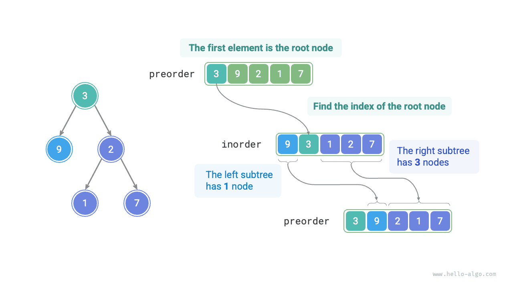
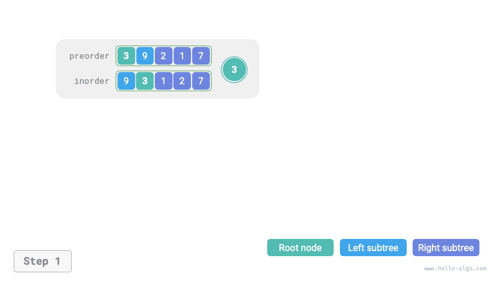

# Xây dựng một bài toán cây nhị phân

!!! câu hỏi

    Xét duyệt thứ tự trước `preorder` và duyệt thứ tự `inorder` của cây nhị phân, xây dựng cây nhị phân và trả về nút gốc của cây nhị phân. Giả sử không có giá trị nút trùng lặp nào trong cây nhị phân (như minh họa trong hình bên dưới).


### Xác định xem đây có phải là vấn đề chia để trị không

Bài toán ban đầu được định nghĩa là xây dựng cây nhị phân từ `preorder` và `inorder`, đây là một bài toán chia để trị điển hình.

- **Bài toán có thể được phân tách**: Từ góc độ chia để trị, chúng ta có thể chia bài toán ban đầu thành hai bài toán con: xây dựng cây con bên trái và xây dựng cây con bên phải, cộng với một thao tác: khởi tạo nút gốc. Đối với mỗi cây con (bài toán con), chúng ta vẫn có thể sử dụng lại phương pháp chia trên, chia nó thành các cây con (bài toán con) nhỏ hơn cho đến khi đạt được bài toán con nhỏ nhất (cây con trống).
- **Các bài toán con độc lập**: Cây con bên trái và cây con bên phải độc lập với nhau; không có sự chồng chéo giữa chúng. Khi xây dựng cây con bên trái, chúng ta chỉ cần tập trung vào các phần duyệt theo thứ tự và thứ tự trước tương ứng với cây con bên trái. Điều tương tự cũng áp dụng cho cây con bên phải.
- **Giải pháp của các bài toán con có thể được hợp nhất**: Khi chúng ta có cây con trái và cây con bên phải (giải pháp của các bài toán con), chúng ta có thể liên kết chúng với nút gốc để thu được lời giải cho bài toán ban đầu.

### Cách chia cây con

Dựa trên phân tích ở trên, vấn đề này có thể được giải quyết bằng cách sử dụng phép chia và chinh phục, **nhưng làm cách nào để chia cây con bên trái và cây con bên phải thông qua việc duyệt theo thứ tự trước `preorder` và duyệt theo thứ tự `inorder`**?

Theo định nghĩa, cả `preorder` và `inorder` đều có thể được chia thành ba phần.

- Truyền tải đặt hàng trước: `[ Root Node | Left Subtree | Right Subtree ]`, ví dụ: cây trong hình trên tương ứng với `[ 3 | 9 | 2 1 7 ]`.
- Truyền tải theo thứ tự: `[ Left Subtree | Root Node ｜ Right Subtree ]`, ví dụ: cây trong hình trên tương ứng với `[ 9 | 3 | 1 2 7 ]`.

Lấy dữ liệu từ hình trên làm ví dụ, chúng ta có thể thu được kết quả chia thông qua các bước như trong hình bên dưới.

1. Phần tử đầu tiên 3 trong quá trình duyệt thứ tự trước là giá trị của nút gốc.
2. Tìm chỉ mục của nút gốc 3 trong `inorder` và sử dụng chỉ mục này để chia `inorder` thành `[ 9 | 3 ｜ 1 2 7 ]`.
3. Dựa vào kết quả chia của `inorder`, dễ dàng xác định cây con trái và cây con bên phải lần lượt có 1 và 3 nút, cho phép chúng ta chia `preorder` thành `[ 3 | 9 | 2 1 7 ]`.



### Mô tả các khoảng thời gian của cây con dựa trên các biến

Dựa trên phương pháp chia ở trên, **chúng tôi đã thu được các khoảng chỉ mục của nút gốc, cây con bên trái và cây con bên phải trong `preorder` và `inorder`**. Để mô tả các khoảng chỉ số này, chúng ta cần sử dụng một số biến chỉ số.

- Biểu thị chỉ mục của nút gốc của cây hiện tại trong `preorder` là $i$.
- Biểu thị chỉ mục của nút gốc của cây hiện tại trong `inorder` là $m$.
- Biểu thị khoảng chỉ mục của cây hiện tại trong `inorder` là $[l, r]$.

Như được hiển thị trong bảng bên dưới, thông qua các biến này, chúng ta có thể biểu thị chỉ mục của nút gốc trong `preorder` và khoảng chỉ mục của các cây con trong `inorder`.

<p align="center"> Bảng <id> &nbsp; Các chỉ số của nút gốc và cây con trong quá trình duyệt theo thứ tự trước và theo thứ tự </p>

|              | Chỉ mục nút gốc trong `preorder` | Khoảng chỉ mục cây con trong `inorder` |
| ------------ | ----------------------------- | ----------------------------------- |
| Cây hiện tại | $i$ | $[l, r]$ |
| Cây con trái | $i + 1$ | $[l, m-1]$ |
| Cây con bên phải| $i + 1 + (m - l)$ | $[m+1, r]$ |

Xin lưu ý rằng $(m-l)$ trong chỉ mục nút gốc của cây con bên phải có nghĩa là "số lượng nút trong cây con bên trái". Nên hiểu điều này kết hợp với hình dưới đây.


### Triển khai mã

Để cải thiện hiệu quả truy vấn $m$, chúng tôi sử dụng bảng băm `hmap` để lưu trữ ánh xạ từ các phần tử trong mảng `inorder` tới các chỉ mục của chúng:

```src
[file]{build_tree}-[class]{}-[func]{build_tree}
```

Hình dưới đây cho thấy quá trình đệ quy xây dựng cây nhị phân. Mỗi nút được thiết lập trong quá trình "đệ quy" đi xuống, trong khi mỗi cạnh (tham chiếu) được thiết lập trong quá trình "trở về" đi lên.

=== "<1>"
    

=== "<2>"
    

=== "<3>"
    

=== "<4>"
    

=== "<5>"
    

=== "<6>"
    

=== "<7>"
    

=== "<8>"
    

=== "<9>"
    

Kết quả phân chia của việc truyền tải theo thứ tự trước `preorder` và truyền tải theo thứ tự `inorder` trong mỗi hàm đệ quy được hiển thị trong hình bên dưới.


Gọi số nút trong cây là $n$. Việc khởi tạo mỗi nút (thực thi một hàm đệ quy `dfs()`) mất $O(1)$ thời gian. **Do đó, độ phức tạp về thời gian tổng thể là $O(n)$**.

Bảng băm lưu trữ ánh xạ từ các phần tử `inorder` tới các chỉ mục của chúng, với độ phức tạp về không gian là $O(n)$. Trong trường hợp xấu nhất, khi cây nhị phân thoái hóa thành danh sách liên kết, độ sâu đệ quy đạt tới $n$, sử dụng không gian khung ngăn xếp $O(n)$. **Do đó, độ phức tạp của không gian tổng thể là $O(n)$**.
