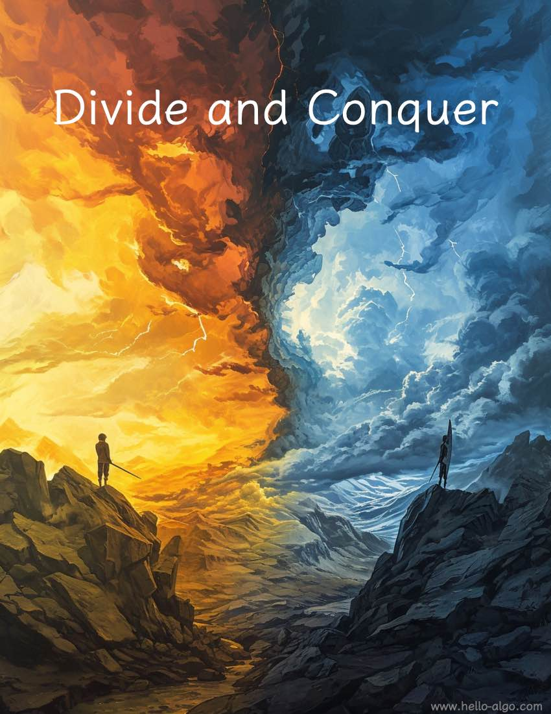

# Chia rẽ và chinh phục

!!! trừu tượng

    Những vấn đề khó khăn được phân tách từng lớp, mỗi lần phân tách lại khiến chúng trở nên đơn giản hơn.

    Chia để trị tiết lộ một sự thật quan trọng: hãy bắt đầu từ những gì đơn giản và không có gì phức tạp cả.
