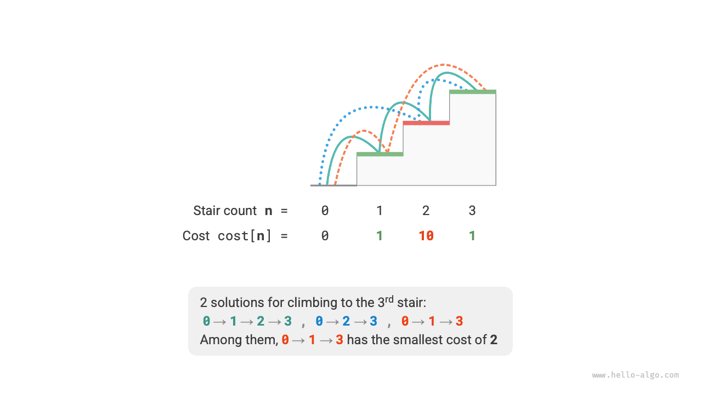
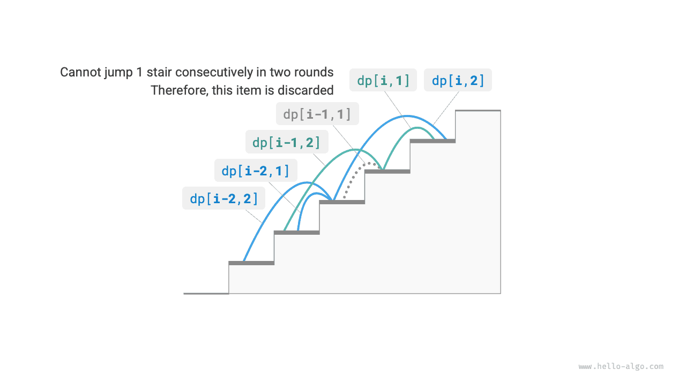

# Đặc điểm của bài toán lập trình động

Trong phần trước, chúng ta đã tìm hiểu cách lập trình động giải quyết vấn đề ban đầu bằng cách phân tách nó thành các bài toán con. Trên thực tế, phân rã bài toán con là một cách tiếp cận thuật toán tổng quát, với các điểm nhấn khác nhau trong phân chia và chinh phục, lập trình động và quay lui.

- Thuật toán chia và chinh phục đệ quy chia bài toán ban đầu thành nhiều bài toán con độc lập cho đến khi đạt được bài toán con nhỏ nhất và hợp nhất lời giải của các bài toán con trong quá trình quay lui để cuối cùng thu được lời giải cho bài toán ban đầu.
- Lập trình động cũng phân rã đệ quy các bài toán, nhưng điểm khác biệt chính so với thuật toán chia để trị là các bài toán con trong lập trình động phụ thuộc lẫn nhau và nhiều bài toán con chồng chéo xuất hiện trong quá trình phân rã.
- Các thuật toán quay lui liệt kê tất cả các giải pháp có thể thông qua thử và sai, đồng thời tránh các nhánh tìm kiếm không cần thiết thông qua việc cắt tỉa. Lời giải của bài toán ban đầu bao gồm một loạt các bước quyết định và chúng ta có thể coi dãy con trước mỗi bước quyết định là một bài toán con.

Trên thực tế, quy hoạch động thường được sử dụng để giải các bài toán tối ưu hóa, chúng không chỉ chứa các bài toán con chồng chéo mà còn có hai đặc điểm chính khác: cấu trúc con tối ưu và không có hậu quả.

## Cấu trúc tối ưu

Chúng tôi thực hiện một sửa đổi nhỏ cho bài toán leo cầu thang để làm cho nó phù hợp hơn trong việc thể hiện khái niệm kết cấu nền tối ưu.

!!! câu hỏi “Leo cầu thang với chi phí tối thiểu”

    Với một cầu thang, bạn có thể leo từng bước $1$ hoặc $2$ một lần và mỗi bước được gắn nhãn bằng một số nguyên không âm biểu thị chi phí khi bước lên nó. Cho một mảng số nguyên không âm $cost$, trong đó $cost[i]$ biểu thị chi phí của bước $i$-th và $cost[0]$ là điểm cơ bản (điểm bắt đầu), chi phí tối thiểu cần thiết để đạt đến đỉnh là bao nhiêu?

Như được hiển thị trong hình bên dưới, nếu chi phí của các bước $1$st, $2$nd và $3$lần lượt là $1$, $10$ và $1$, thì việc leo từ mặt đất lên bước thứ $3$ yêu cầu chi phí tối thiểu là $2$.



Gọi $dp[i]$ là chi phí tích lũy để leo lên bước thứ $i$. Vì bước $i$-th chỉ có thể đến từ bước $i-1$-th hoặc $i-2$-th, nên $dp[i]$ chỉ có thể bằng $dp[i-1] + cost[i]$ hoặc $dp[i-2] + cost[i]$. Để giảm thiểu chi phí, chúng ta nên chọn cái nhỏ hơn trong hai cái:

$$
dp[i] = \min(dp[i-1], dp[i-2]) + chi phí[i]
$$

Điều này dẫn chúng ta đến ý nghĩa của cấu trúc con tối ưu: **giải pháp tối ưu cho bài toán ban đầu được xây dựng từ các giải pháp tối ưu cho các bài toán con**.

Bài toán này rõ ràng có cấu trúc con tối ưu: chúng ta chọn cấu trúc con tốt hơn từ các lời giải tối ưu cho hai bài toán con $dp[i-1]$ và $dp[i-2]$, và sử dụng nó để xây dựng lời giải tối ưu cho bài toán ban đầu $dp[i]$.

Vậy bài toán leo cầu thang ở phần trước có cấu trúc phần dưới tối ưu không? Mục đích của nó là tìm ra số cách, tưởng chừng như là một bài toán đếm, nhưng nếu chúng ta đổi câu hỏi: "Tìm số cách tối đa". Chúng tôi ngạc nhiên phát hiện ra rằng **mặc dù vấn đề trước và sau khi sửa đổi là tương đương nhau, nhưng cấu trúc con tối ưu đã xuất hiện**: số cách tối đa cho bước $n$-th bằng tổng số cách tối đa cho các bước $n-1$-th và $n-2$-th. Vì vậy, việc giải thích cấu trúc con tối ưu khá linh hoạt và sẽ có ý nghĩa khác nhau trong các bài toán khác nhau.

Theo phương trình chuyển trạng thái và các trạng thái ban đầu $dp[1] = cost[1]$ và $dp[2] = cost[2]$, chúng ta có thể thu được mã lập trình động:

```src
[file]{min_cost_climbing_stairs_dp}-[class]{}-[func]{min_cost_climbing_stairs_dp}
```

Hình dưới đây thể hiện quy trình lập trình động cho đoạn mã trên.


Vấn đề này cũng có thể được tối ưu hóa không gian, nén từ một chiều về 0, giảm độ phức tạp của không gian từ $O(n)$ xuống $O(1)$:

```src
[file]{min_cost_climbing_stairs_dp}-[class]{}-[func]{min_cost_climbing_stairs_dp_comp}
```

## Không có hậu quả

Không có hậu quả là một trong những đặc điểm quan trọng cho phép lập trình động giải quyết vấn đề một cách hiệu quả. Định nghĩa của nó là: **với một trạng thái nhất định, sự phát triển trong tương lai của nó chỉ liên quan đến trạng thái hiện tại và không liên quan gì đến tất cả các trạng thái trong quá khứ**.

Lấy bài toán leo cầu thang làm ví dụ, với trạng thái $i$, nó sẽ phát triển thành các trạng thái $i+1$ và $i+2$, tương ứng với việc nhảy bước $1$ và nhảy bước $2$. Khi thực hiện hai lựa chọn này, chúng ta không cần xem xét các trạng thái trước trạng thái $i$, vì chúng không ảnh hưởng gì đến tương lai của trạng thái $i$.

Tuy nhiên, nếu chúng ta thêm một ràng buộc cho bài toán leo cầu thang thì tình hình sẽ thay đổi.

!!! Câu hỏi “Leo cầu thang có hạn chế”

    Cho một cầu thang có $n$ bậc, trong đó bạn có thể leo lên các bậc $1$ hoặc $2$ cùng một lúc, **nhưng bạn không thể nhảy bước $1$ trong hai vòng liên tiếp**. Có bao nhiêu cách để leo lên đỉnh?

Như được minh họa trong hình bên dưới, chỉ có những cách khả thi $2$ để leo lên bước thứ $3$. Đường đi có ba bước nhảy $1$ liên tiếp không thỏa mãn ràng buộc và do đó bị loại bỏ.


Trong bài toán này, nếu vòng trước là bước nhảy $1$ thì vòng tiếp theo phải nhảy bước $2$. Điều này có nghĩa là **lựa chọn tiếp theo không thể chỉ được xác định bởi trạng thái hiện tại (số bước cầu thang hiện tại) mà còn phụ thuộc vào trạng thái trước đó (số bước cầu thang từ vòng trước)**.

Không khó để thấy rằng vấn đề này không còn thỏa mãn không có hậu quả, và phương trình chuyển đổi trạng thái $dp[i] = dp[i-1] + dp[i-2]$ cũng thất bại, bởi vì $dp[i-1]$ thể hiện việc nhảy $1$ trong vòng này, nhưng nó bao gồm nhiều giải pháp trong đó "vòng trước là bước nhảy $1$", không thể tính trực tiếp bằng $dp[i]$ để thỏa mãn ràng buộc.

Vì lý do này, chúng ta cần mở rộng định nghĩa trạng thái: **state $[i, j]$ thể hiện đang ở bước $i$-th với vòng trước đã nhảy $j$ bước**, trong đó $j \in \{1, 2\}$. Định nghĩa trạng thái này phân biệt một cách hiệu quả liệu vòng trước đó là bước nhảy $1$ hay bước $2$, cho phép chúng tôi xác định trạng thái hiện tại đến từ đâu.

- Khi vòng trước nhảy $1$, vòng trước đó chỉ có thể chọn nhảy $2$, tức là $dp[i, 1]$ chỉ có thể chuyển từ $dp[i-1, 2]$.
- Khi vòng trước nhảy $2$ bước, vòng trước đó có thể chọn nhảy $1$ bước hoặc $2$ bước, tức là $dp[i, 2]$ có thể chuyển đổi từ $dp[i-2, 1]$ hoặc $dp[i-2, 2]$.

Như được hiển thị trong hình bên dưới, theo định nghĩa này, $dp[i, j]$ biểu thị số cách để chuyển sang trạng thái $[i, j]$. Khi đó phương trình chuyển trạng thái sẽ là:

$$
\bắt đầu{trường hợp}
dp[i, 1] = dp[i-1, 2] \\
dp[i, 2] = dp[i-2, 1] + dp[i-2, 2]
\end{trường hợp}
$$



Cuối cùng, trả về $dp[n, 1] + dp[n, 2]$, trong đó tổng của hai đại diện cho tổng số cách để leo lên bước $n$-th:

```src
[file]{climbing_stairs_constraint_dp}-[class]{}-[func]{climbing_stairs_constraint_dp}
```

Trong trường hợp trên, vì chỉ cần xét thêm một trạng thái trước đó nên chúng ta vẫn có thể làm cho bài toán thỏa mãn không có hậu quả bằng cách mở rộng định nghĩa trạng thái. Tuy nhiên, một số vấn đề có “hậu quả” rất nghiêm trọng.

!!! Câu hỏi "Leo cầu thang có tạo chướng ngại vật"

    Cho một cầu thang có $n$ bậc, trong đó bạn có thể leo từng bậc $1$ hoặc $2$ một lần. **Bất cứ khi nào bạn đạt đến bước $i$-th, hệ thống sẽ tự động đặt chướng ngại vật ở bước $2i$-th và không vòng tiếp theo nào được phép chuyển sang bước $2i$-th**. Ví dụ: nếu hai vòng đầu tiên chuyển sang bước thứ $2$ và $3$, thì sau đó bạn không thể chuyển sang bước thứ $4$ và $6$. Có bao nhiêu cách để leo lên đỉnh?

Trong bài toán này, lần nhảy tiếp theo phụ thuộc vào tất cả các trạng thái trong quá khứ, bởi vì mỗi lần nhảy sẽ đặt chướng ngại vật ở các bước cao hơn, ảnh hưởng đến các lần nhảy trong tương lai. Đối với những bài toán như vậy, quy hoạch động thường khó giải quyết.

Trên thực tế, nhiều bài toán tối ưu hóa tổ hợp phức tạp (chẳng hạn như bài toán người bán hàng du lịch) không thỏa mãn bất kỳ hậu quả nào. Đối với những vấn đề như vậy, chúng ta thường sử dụng các phương pháp khác, chẳng hạn như tìm kiếm heuristic, thuật toán di truyền và học tăng cường, để thu được các giải pháp tối ưu cục bộ có thể sử dụng được trong một thời gian giới hạn.
